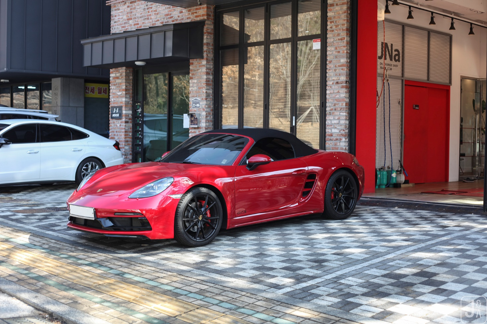

# 718 GTS4.0과 S, NORMAL 그리고 제네시스 G70과의 차이점.

포르쉐 718 카이맨/박스터 GTS 4.0은 단순히 엔진(4.0L 6기통 자연흡기)만 커진 것이 아니라, 하위 모델인 노멀(2.0)이나 S(2.5)에서 유료 옵션으로 넣어야 하거나 아예 선택할 수 없는 퍼포먼스 사양들이 대거 기본 적용된 모델이다.

노멀과 S에서는 추가 비용을 내야 하는 옵션들이 GTS 4.0에는 '기본'으로 들어간다..

## 1. 기본사양

### 1. 하체 및 주행 성능 (기본 탑재 사양)

1) PASM 스포츠 서스펜션: 스포츠모드 시 차고가 노멀 대비 20mm 더 낮아집니다. (S는 기본이 10mm이며, 20mm는 옵션) 훨씬 단단하고 날렵한 거동을 보여줍니다.

2) PTV (포르쉐 토크 벡터링): 기계식 리미티드 슬립 디퍼런셜(LSD)이 포함되어 코너링 시 안쪽 바퀴에 제동을 걸어 회전력을 극대화합니다.

스포츠 크로노 패키지: 대시보드 위의 스톱워치, 모드 스위치(스티어링 휠), 런치 컨트롤 등이 포함된다.

스포츠 배기 시스템: GTS 전용으로 튜닝된 블랙 테일파이프가 적용되며, 6기통 특유의 고회전 사운드를 구현합니다.

이 두 시스템이 조합된 GTS 4.0을 타다가 노멀 모델을 타보시면 바로 이런 느낌이 든다.

조향감: "핸들을 꺾는 대로 차가 즉각적으로 반응한다."

안정감: "속도가 꽤 높은데도 차가 쏠리지 않고 평평하게 돌아나간다."

한계치: "타이어가 비명을 지를 법한 상황에서도 차가 노면을 움켜쥐고 있다."

### 2. 브레이크 시스템

엔진 출력이 높아진 만큼 제동 성능도 강화되었습니다. S 모델보다 더 큰 브레이크 디스크와 캘리퍼가 장착되어 반복적인 제동에도 페이드 현상이 적습니다

요약하자면

노멀이나 S 모델에 주행 옵션을 GTS 수준으로 추가하다 보면 결국 가격이 GTS 4.0에 근접하게 된다. 하지만 GTS 4.0은 '6기통 자연흡기'라는 상징성과 감성, 그리고 더 높은 중고차 잔존 가치를 가지기 때문에 매니아들 사이에서 만족도가 압도적으로 높습니다.

### 3. 외관 디자인 (GTS 전용 익스테리어)

GTS 라인업 특유의 '블랙 디테일'이 특징이다.

전용 프런트 에이프런: 노멀/S보다 공기 흡입구가 더 크고 공격적인 디자인의 SportDesign 프런트 범퍼가 적용된다.
틴팅 처리된 램프: 헤드라이트와 리어 라이트가 어둡게 처리(다크 틴트)되어 있습니다.
휠: 20인치 718 스포츠 휠이 새틴 블랙 색상으로 기본 장착된다.
블랙 레터링: 후면부 모델명과 측면 데칼 등이 블랙으로 마감된다.

### 4. 실내 구성

알칸타라(Race-Tex) 소재: 스티어링 휠, 시트 중심부, 암레스트 등에 고급스럽고 접지력이 좋은 알칸타라 소재가 광범위하게 사용된다.
스포츠 시트 플러스: 옆구리를 더 단단하게 잡아주는 스포츠 시트가 기본이다.
인테리어 패키지: 트림 부분에 카본이나 알루미늄 등 스포티한 소재가 기본 적용되는 경우가 많다.

### 5. GTS 인테리어 패키지(GTS Interior Package)

GTS 모델에서 가장 선호도가 높고 고가인 'GTS 인테리어 패키지(GTS Interior Package) 도 있음.

희소성: 일반 레드 가죽은 노멀 모델이나 S 모델에서도 선택할 수 있다. 하지만 'GTS 인테리어 패키지'는 오직 GTS 모델에서만 선택 가능한 전용 옵션이다. "GTS인데 GTS 패키지가 빠진 차"는 중고 시장에서 감가 요인이 되기도 합니다. 반면 이 패키지가 들어간 차는 "옵션을 제대로 넣은 차"로 대접받는다.

구성: 시트, 대시보드, 도어 트림 등에 카마인 레드(Carmine Red) 또는 크레용(Crayon) 컬러의 스티치가 들어간다..

포인트: 안전벨트 색상과 계기판(타코미터) 다이얼 색상이 스티치와 동일한 빨간색으로 맞춰집니다.

카본 트림: 보통 이 패키지를 선택하면 실내 트림(대시보드 가로 줄 등)이 카본으로 마감되는 경우가 많아 실내가 훨씬 스포티해 보이다.

### 6. 가격과 가치

신차 기준: 이 패키지 하나만 해도 옵션 가격이 약 400~500만 원 정도 하는 고가 사양이다.

중고차 시장: GTS 4.0을 찾는 사람들은 "GTS라면 당연히 알칸타라에 빨간 스티치가 있어야지"라고 생각하는 경우가 많다. 그래서 나중에 다시 판매하실 때도 일반 가죽 시트 차량보다 인기가 훨씬 많고 가격 방어(감가 방어)에 유리하다.

희소성: 일반 레드 가죽은 노멀 모델이나 S 모델에서도 선택할 수 있다. 하지만 'GTS 인테리어 패키지'는 오직 GTS 모델에서만 선택 가능한 전용 옵션이다.

## 2. 기술 사양

### 1. 기술적 진보성: "태생부터 다른 물리 법칙"

수평대향(Boxer) 엔진의 저중심 설계: 제네시스의 V6 엔진은 실린더가 위를 향해 서 있지만, 포르쉐의 6기통은 피스톤이 좌우로 누워 있습니다. 덕분에 엔진 높이가 매우 낮아 차 전체의 무게중심을 지면 밀착형으로 만듭니다. 이는 코너링 시 차가 기우뚱하는 물리적 한계치를 제네시스보다 훨씬 높게 설정되었다.

미드십(Mid-ship) 레이아웃: 엔진이 운전석 바로 뒤, 뒷바퀴 앞에 있습니다. 무거운 부품이 차체 중앙에 몰려 있어, 긴 차체(제네시스)가 꼬리를 흔들며 따라오는 느낌과 달리, GTS는 내 몸이 차의 중심이 되어 회전하는 감각을 준다.

PDK 변속기의 정밀도: 포르쉐의 듀얼 클러치(PDK)는 현대의 자동변속기와는 비교 불가능한 속도로 다음 단을 준비합니다. 변속 충격 없이 동력을 100% 전달하며, 과열 없이 수십 번의 급가속을 견디는 냉각 설계는 양산차 최고 수준이다.

### 2. 내구성: "버티는 힘의 차이"

제네시스가 10년 타기 좋은 차라면, 포르쉐는 '혹독한 주행 환경에서도 망가지지 않는 차'를 지향합니다.

과잉 엔지니어링: 포르쉐는 서킷 주행(트랙)을 전제로 만든다.. 일반 도로 주행은 포르쉐에게 일종의 '휴식' 수준이다. 엔진 냉각 성능, 브레이크 내열성, 하체 부싱의 강도가 일반 세단인 제네시스보다 훨씬 높은 부하를 견디도록 설계되어 있다.

자연흡기(N/A)의 신뢰성: 터보 차저가 없는 4.0L 엔진은 구조가 상대적으로 단순하고 열 관리가 유리하다. 터보 랙(가속 지연)이 없을 뿐만 아니라, 장기적으로 터보 관련 부품의 고장 걱정에서 자유롭다.

부품의 수명: 포르쉐는 "전체 생산 차량의 70%가 여전히 도로를 달리고 있다"는 슬로건을 가질 만큼 장기 내구성이 뛰어납니다. 하체 부품 하나하나의 강성이 높고, 노후화에 따른 주행 성능 저하가 매우 느린 편이다.

### 3. 비교 요약

| 구분   | 현대 제네시스 (G70/G80)            | 포르쉐 718 GTS 4.0                         |
|--------|------------------------------------|--------------------------------------------|
| 목적   | 안락함, 편의성, 가성비 고급감      | 정밀한 조종, 드라이빙의 즐거움             |
| 코너링 | 타이어가 비명을 지르며 버티는 느낌 | 차 자체가 레일을 타고 도는 느낌            |
| 한계치 | 일상 영역을 넘어서면 불안함 발생   | 한계 상황에서도 기계적으로 견고함 유지     |
| 내구성 | 쾌적한 유지보수 위주               | 가혹한 주행(고RPM) 시에도 엔진 보호력 우수 |