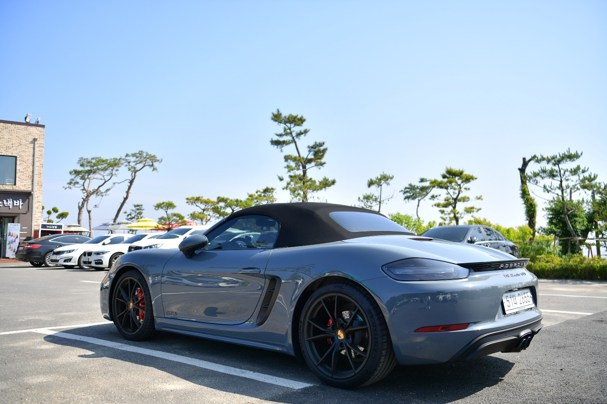

# 로드스터 VS GT

"로드스터와 GT는 겹치는 부분이 있지만, 기본적으로 추구하는 방향이 다른 개념"이다.

718 박스터 GTS 4.0은 '로드스터'이면서 동시에 'GT(그랜드 투어러)'의 성격을 어느 정도 커버하진, 엄밀히 따지면 퓨어 스포츠카에 더 가깝다.

## 1. 로드스터와 GT의 정의

### 로드스터 (Roadster)의 정의: "오픈 에어링과 경량화"

로드스터는 기본적으로 '운전의 재미'에 올인한 차다.
구조: 2인승이며 지붕을 열 수 있는(오픈톱) 구조다.
특징: 차체가 작고 가벼우며 핸들링이 날카롭다. 718 박스터처럼 엔진을 가운데 두는(MR) 등
학적인 밸런스를 극대화하여 코너를 타는 즐거움을 위해 만든다.
한계: 짐 공간이 좁고 장거리 주행 시 피로감이 GT보다는 클 수 있다.

### GT (Grand Tourer)의 정의: "장거리 고속 주행의 여유"

GT카는 '먼 거리(Grand Tour)를 빠르고 편안하게 이동'하기 위해 만든 차다.
구조: 보통 엔진이 앞에 있고(FR) 뒷좌석이 좁게라도 있는 2+2 구조가 많다.
특징: 출력이 넉넉하면서도 승차감이 부드럽고, 고속도로 주행 시 안정감이 뛰어납니다. 짐을 실을 수 있는 트렁크 공간도 어느 정도 확보되어 있다.
예시: 포르쉐 911(일부 라인업), 벤틀리 컨티넨탈 GT, 마세라티 그란투리스모 등.

### 로드스터는 GT가 될 수 있는가?

로드스터 중에서도 성격에 따라 다르다.
박스터 GTS 4.0: 전형적인 로드스터이자 스포츠카다. MR 구조라 밸런스가 최고지만, 포르쉐의 기술력 덕분에 다른 로드스터들에 비하면 고속 안정성이 뛰어나 GT의 맛을 약간 낼 수 있다.
메르세데스-벤츠 SL: 이 차는 로드스터(오픈카)이면서 동시에 전형적인 GT카다. 2인승 오픈카지만 승차감이 안락하고 고급스러운 편의 사양이 가득해 장거리 드라이브에 최적화되어 있다.

결론 : 718 GTS 4.0은 "GT카만큼 빠르고 안정적이지만, 태생은 코너를 베어 가르기 위해 만든 정통 로드스터"라고 할 수 있겠다.

## 2. 로드스터 와 GT의 비교

### 날카롭다 (Sharp / Precise) — \[718 GTS 4.0의 특징\]

마치 잘 갈려진 '메스'나 '면도날'을 다루는 느낌이다.
즉각적인 반응: 핸들을 1도만 꺾어도 차의 코(Front)가 즉각적으로 안쪽을 파고든다. 지연 시간(Lag)이 거의 느껴지지 않다.
노면의 전달: 바퀴가 아스팔트의 작은 모래알을 밟는지, 껌을 밟는지까지 손바닥과 엉덩이로 전달됩니다. 정보량이 많아 긴장감이 생기지만, 그만큼 차를 완벽히 통제하고 있다는 쾌감을 준다.
물리적 가벼움: 무게 중심이 중앙(MR)에 있고 차체가 가볍기 때문에, 코너에서 차가 밖으로 밀려나려는 관성 자체가 적다. "칼로 종이를 베는 듯한" 깔끔한 코너링이 바로 이 느낌이다.

### 여유롭다 (Relaxed / Effortless) — \[GT카의 특징\]

마치 거대한 '항공기'나 '고속열차'를 조종하는 느낌이다.
압도적인 힘의 여유: 시속 150km로 달리고 있어도 엔진이 으르렁거리지 않고 조용하다.
"원하면 언제든 더 튀어 나갈 수 있다"는 힘의 비축량이 느껴질 때 오는 심리적 안정적이다.
안정적인 묵직함: 날카로운 차들이 노면의 충격에 민감하게 반응한다면, 여유로운 GT카는 웬만한 요철은 묵직하게 눌러버리며 고속으로 순항한다. 운전자가 피로를 느끼지 않게 필터링을 해주는 것이다.
심리적 편안함: 차가 너무 예민하지 않아서 장시간 운전해도 신경이 곤두서지 않다. 편안한 시트에 기대어 풍부한 오디오 사운드를 즐기며 부산에서 서울까지 단숨에 가도 거뜬한 상태를 말합니다.

### 왜 718 GTS 4.0은 특별한가?

GTS 4.0은 이 두 가지 사이에서 아주 절묘한 위치에 있다. 4.0 자연흡기 엔진 덕분에 저속부터 고속까지 출력이 매끄럽게 터져 나와서 엔진 성능만큼은 '여유롭다.' (힘이 모자라 쩔쩔매는 느낌이 전혀 없다.) 반면, 하체와 조향은 포르쉐 전용 셋업 덕분에 극도로 '날카롭다.' 날카롭다: "내 몸과 기계가 하나가 되어 아주 예민하게 반응한다." (스포츠카의 미덕) 여유롭다: "기계가 나를 대신해 거친 환경을 다스려주며 편안하게 고속을 유지한다." (GT카의 미덕)
