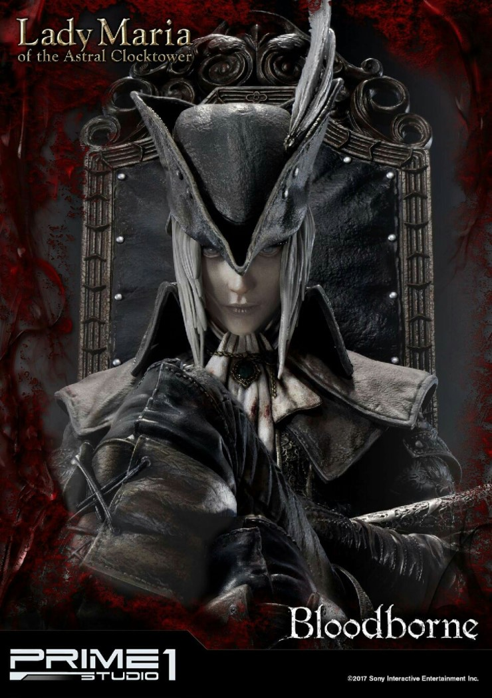
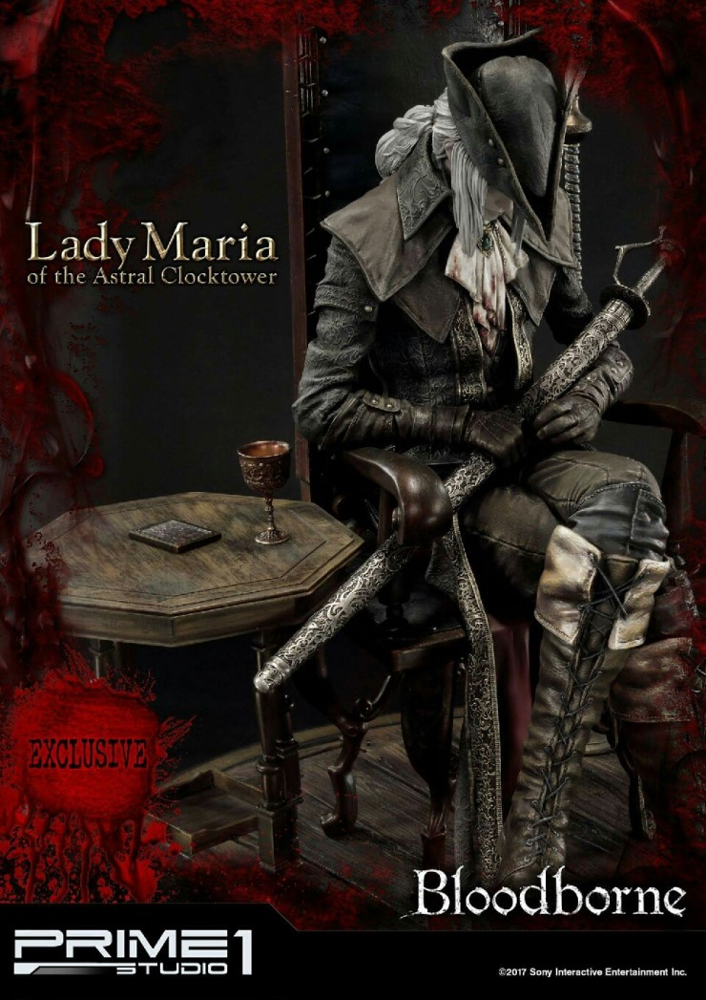
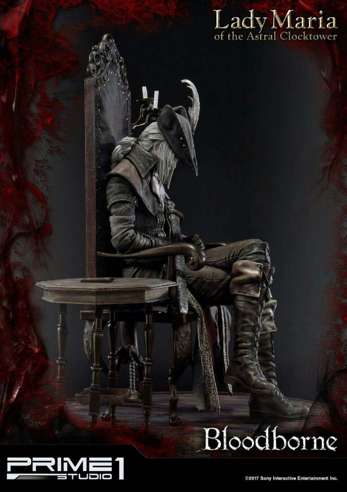

# 블러드본 매칭 시스템 총정리: 왜 48레벨이 협력 캐릭터의 정석일까?

블러드본의 독특한 협력 매칭 및 너프 시스템을 완벽하게 분석합니다. 왜 고수 유저들은 50렙, 60렙이 아닌 하필 '48레벨'을 최고의 황금 밸런스 협력 캐릭터로 꼽을까요? 태생 4렙 뉴비부터 고회차 고레벨 유저까지 페널티(너프) 없이 완벽하게 케어할 수 있는 효율적인 레벨 설계 가이드와 USB 세이브 로드 신공 노하우를 지금 확인해 보세요!

## 1. 협력 캐릭은 왜 하필 '48레벨'로 키울까?

블러드본에서 '협력'은 보통 게임을 처음 접하는 초보 유저(뉴비)를 도와주는 시스템입니다. 

하지만 블러드본의 독특한 시스템 때문에, 매칭된 호스트와 협력자의 레벨 차이가 너무 크면 협력자의 공격력과 체력이 크게 감소하는 '너프'를 받게 됩니다. 예를 들어 10레벨 유저를 도와주러 500레벨 유저가 진입하면, **너프 폭이 너무 커서 오히려 10레벨 호스트보다 체력과 공격력이 낮아지기도** 합니다.

이 때문에 전문적으로 협력을 뛰는 유저들은 일부러 레벨 제한을 두고 '낮은 레벨'을 고수합니다. 그런데 왜 하필 50렙이나 60렙도 아닌, 딱 '48레벨'이 협력 캐릭의 기준이 된 걸까요?

정답은 바로 **너프를 받지 않는 최적의 한계 레벨**이기 때문입니다.

**"즉, 무식하게 레벨만 높인다고 능사가 아닌, 치밀한 레벨 설계가 필요한 게임이라는 뜻입니다."**  

일반적인 RPG 게임과 많이 다르죠? 
특정 범위를 벗어나 '일정 레벨 이상' 차이가 날 때만 너프가 적용되는데요. 이 시스템을 역산해 보면 왜 48레벨인지 알 수 있습니다.

- 48레벨이 너프 없이 갈 수 있는 가장 낮은 호스트는 **24레벨**입니다.
- 24레벨이 너프 없이 갈 수 있는 가장 낮은 호스트는 바로 블러드본 최저 레벨인 '**4레벨(태생)**'입니다.

이론상으로는 4레벨 뉴비까지 완벽하게 커버하면서 너프도 안 받는 '**24레벨 협력 캐릭**'을 만드는 게 가장 좋습니다. 하지만 24레벨로는 고난도 성배 던전을 돌거나 고회차를 밀기가 손가락 능력을 극단적으로 요구할 만큼 어렵습니다. 

결국 "초보(4렙)들을 돕기 위해 험난한 성배를 깨고 올라온 24레벨 숙련자들, 그 숙련자들을 너프 없이 완벽하게 도와줄 수 있는 든든한 구원 투수"가 바로 **48레벨**인 셈입니다.

## 2. 타겟 레벨별 협력 캐릭터 추천 육성 트리

앞서 설명해 드린 페널티(너프) 없는 매칭 공식을 바탕으로, 우리가 육성해야 할 협력 캐릭터의 레벨 체인은 다음과 같이 정리할 수 있습니다.

* 태생 최저 레벨(4렙)까지 완벽하게 커버하고 싶을 때
 - 레벨 체인: 4레벨 → 24레벨 → 48레벨 → 77레벨 → 112레벨
 - 특징: 4렙 뉴비부터 최적의 효율로 도와주고 싶을 때 기준이 되는 라인입니다.

* 무난하게 10레벨 호스트까지만 커버하고 싶을 때
 - 레벨 체인: 10레벨 → 32레벨 → 58레벨 → 89레벨 → 126레벨
 - 특징: 극단적인 4렙 태생 유저를 제외한 일반적인 초반 유저들을 겨냥한 라인입니다.

| 레벨  | 협력갈 수 있는 레벨 | 너프 없이 협력 가능 레벨 |
|-----|-------------|----------------|
| 4   | 4           | 4              |
| 10  | 4           | 4              |
| 20  | 4           | 4              |
| 24  | 4           | 4              |
| 32  | 5           | 10             |
| 48  | 18          | 24             |
| 58  | 26          | 32             |
| 77  | 41          | 48             |
| 89  | 51          | 58             |
| 112 | 69          | 77             |
| 120 | 76          | 84             |
| 126 | 80          | 89             |
| 154 | 103         | 112            |
| 171 | 116         | 126            |
| 200 | 140         | 150            |

위 테이블 외에 레벨이 궁금하시면 아래 링크에서 확인하세요.  
[Bloodborne Multi-Player Level Range Calculator](https://mpql.net/tools/bloodborne/)  

## 3. 왜 24렙, 77렙이 아닌 '48레벨'이 최고의 선택일까?

1. 24레벨의 한계: "파밍 난이도의 지옥"
이론상 4렙 뉴비까지 너프 없이 완벽하게 도우려면 '24레벨 협력 캐릭'이 가장 이상적입니다. 하지만 24레벨의 빈약한 스탯으로 1회차를 마무리하고, 종결급 혈석 파밍을 위해 고난도 깊은 성배 던전까지 돌파하는 것은 현실적으로 난이도가 너무 높습니다.

2. 77레벨의 한계: "초반 구역 매칭의 포기"
파밍과 육성이 편하다는 이유로 레벨을 77까지 올려버리면, 정작 손길이 가장 많이 필요한 48레벨 이하의 호스트들을 모두 포기해야 합니다. 77레벨은 보통 호스트들이 '금단의 숲'이나 '비르겐워스'에 진입하는 시점(약 40~50레벨대)부터나 너프 없이 매칭이 됩니다. 결국 가장 유저가 붐비는 극초반 구역(야남 시내, 구시가지)의 협력이 불가능해지므로 협력 캐릭으로서의 매력이 크게 떨어집니다.

3. 결론: 황금 밸런스 '48레벨'
적당한 스탯 투자로 성배 던전 파밍과 회차 진행을 직접 감당할 수 있으면서, 초반 구시가지와 야남 지역에서 고군분투하는 24레벨 전후의 호스트들까지 페널티(너프) 없이 완벽하게 구원할 수 있는 마지노선이 바로 '48레벨'입니다. 성배 파밍의 현실성과 초반 매칭의 효율성을 모두 잡은 최고의 황금 밸런스 레벨입니다.

## 4. 그럼 고레벨 협력은 어떻게 해야 하나요?

게임이 2회차 이상으로 넘어가 **100레벨이 훌쩍 넘은 고레벨** 호스트를 도와야 할 때도 있습니다. 이럴 때 48레벨 캐릭터로 진입하면, 아무리 실력이 뛰어난 고수라도 화력과 체력 부족으로 공략이 상당히 힘들어집니다. 

하지만 걱정할 필요 없습니다. 우리에게는 '**USB 세이브 로드 신공**'이 있으니까요.

보통 48레벨로 회차를 마무리하고 성배 던전까지 모두 밀고 나면, 다들 종결 혈정석을 얻기 위해 '삼뚱땡이(투메르 일의 후예 등)' 파밍을 시작하십니다. 이때 레벨을 더 올릴 게 아니라면 사냥 후 남는 '피의 유지' 처리가 곤란해지는데요. 바로 이 **유지를 고스란히 저축해 두는 방법**이 있습니다.

가장 좋은 방법은 사냥꾼의 꿈 상점에서 '**의식의 피(5)'나 '라쿠요' 같은 고가의 아이템을 잔뜩 사서 창고에 쟁여두는 것**입니다. 예를 들어 '의식의 피(5)'를 200~300개 정도 미리 사둔 뒤, 나중에 이를 한 번에 되팔면 순식간에 **150레벨까지 프리패스로 올릴 수 있는** 엄청난 유지가 확보됩니다.

이를 활용한 고레벨 협력 루틴은 다음과 같습니다.

1. [백업] 고레벨 협력 요청이 오면, 현재 48레벨 상태의 세이브 파일을 USB나 클라우드에 백업합니다.(평상시에 해두세요)
2. [레벨업] 쟁여둔 아이템을 전부 되팔아 유지를 확보한 뒤, 레벨을 한방에 100~150레벨대로 폭발적으로 올립니다.
3. [출격] 든든해진 스펙으로 고회차·고레벨 호스트의 세계로 들어가 무난하게 협력을 성공시킵니다.
4. [복구] 협력이 끝나면 백업해 두었던 48레벨 세이브 파일을 다시 불러옵니다(로드).

이 방법만 알면 캐릭터 하나로 저레벨 뉴비부터 고회차 고인물 유저까지 완벽하게 케어하는 '**만능 협력자**'가 될 수 있습니다.

## 5. 4렙 협력을 포기한다면 다른 빌드가 있을까?

만약 "나는 4레벨(태생) 초보 유저 매칭은 과감히 버리겠다"라고 가정하면, 타겟으로 잡을 수 있는 최하위 기준점은 10레벨이 됩니다. 이 10레벨을 기준으로 페널티 없는 매칭 체인을 다시 짜보면 다음과 같습니다.

- 10레벨 → 32레벨 → 58레벨 → 89레벨

그렇다면 10레벨 구역을 완벽하게 커버하기 위해 32레벨이나 58레벨 캐릭터를 따로 키워야 할까요? 정답은 "그럴 필요 없다"입니다. 앞에서 소개해 드린 만능 'USB 세이브 로드 신공'이 여기서도 빛을 발하기 때문입니다.

예를 들어 10레벨 호스트를 너프 없이 도와야 하는 상황이 오면, 평소에 쓰던 '**24레벨**' 캐릭터의 세이브 파일을 백업한 뒤 유지를 사용해 딱 '**32레벨**'까지만 올려서 출격하면 됩니다. 그리고 협력이 끝나면 다시 24레벨 세이브를 불러오면 그만입니다. 마찬가지로 58레벨 협력이 필요할 때는 '**48레벨**' 캐릭터를 잠시 58레벨로 올렸다가 복구하면 됩니다.

결국 10레벨 기준 빌드들은 **4레벨 기반 빌드(24-48-77) 안에서** 세이브 로드 신공으로 모두 흡수 및 운영이 가능하므로, 별도의 캐릭터를 새로 파서 키울 메리트가 전혀 없습니다.

## 결론

**답은 언제나 '48레벨'입니다.**   

성배 파밍의 현실적인 난이도, 극초반 구역 매칭의 효율성, 그리고 세이브 백업을 통한 유연한 레벨 조절까지 고려했을 때 블러드본 최고의 전천후 협력 캐릭터는 단언컨대 '**48레벨**'입니다. 고민하지 마시고 지금 바로 48레벨 협력 캐릭터 육성을 시작하세요!
