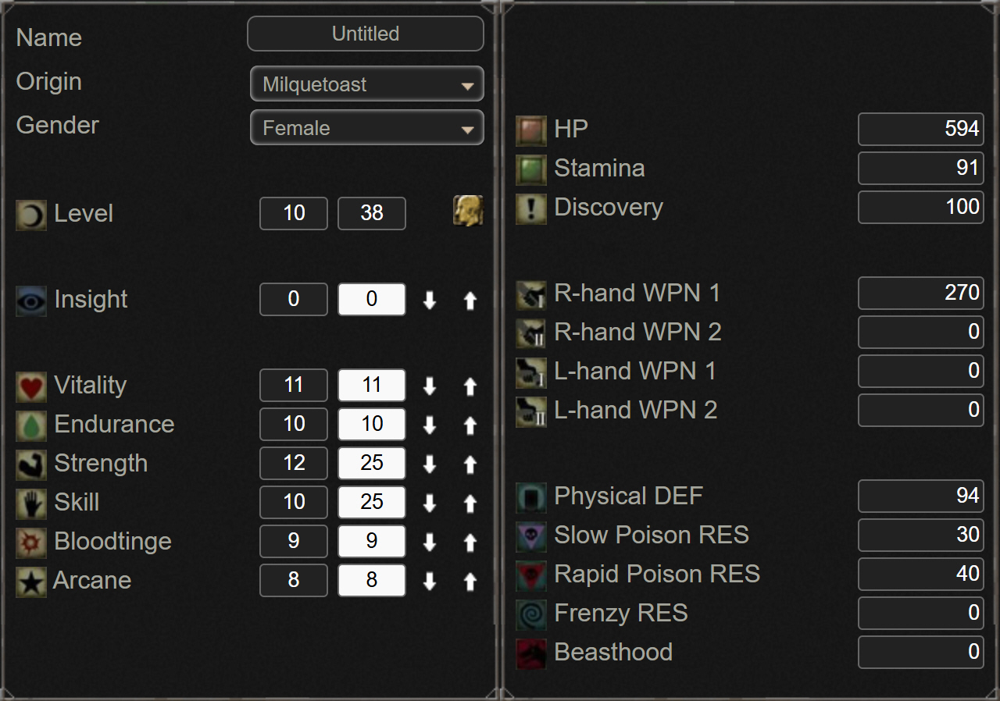

## 블러드본 초간단 공격력 계산법: 스탯별 효율과 혈정석 데미지 계산하기

블러드본에서 어떤 혈정석이 좋은지에 대해서는 의견이 분분하다. 하지만 내가 착용했을 때 실제로 최종 공격력이 얼마가 될지는 수식을 통해 간단히 계산할 수 있다. 

오늘은 물리 공격력(근력, 기술) 세팅에서 유저들이 가장 많이 사용하는 무기인 '톱단창'을 기준으로 계산하는 방법을 알아본다.  

소울류 게임에서 가장 유명한 스탯 시뮬레이터 사이트인 '무겐몽키'를 이용하면 캐릭터 육성 플랜을 쉽게 짜볼 수 있다.  

[무겐몽키(MugenMonkey) 블러드본 시뮬레이터 바로가기](https://www.mugenmonkey.com/bloodborne)

이 웹사이트에서는 체력, 지구력, 근력, 기술, 혈질, 신비 등의 값을 조정할 수 있다. 무기와 방어구를 선택했을 때 해당 기본 스탯에 대응하는 최종 능력치를 직관적으로 확인해볼 수 있다.  

시뮬레이터에서 스탯값을 직접 조정해보면 쉽게 알 수 있는 사실이지만, 블러드본의 근력, 기술, 혈질, 신비 스탯의 소프트캡은 25이며 하드캡은 50이다. 구간별 효율과 육성 팁은 다음과 같다.

## 1. 스탯 구간별 효율 변화 (소프트캡, 하드캡 성능 차이)

* 1 ~ 25 구간 (최대 효율): 근력이나 기술을 올릴 때마다 무기 공격력이 가장 큰 폭으로 상승한다. 주력 무기가 해당 스탯의 보정을 받는다면 최우선으로 25를 찍는 것이 좋다. **소프트캡**
* 26 ~ 50 구간 (완만한 상승): 스탯이 25를 넘어가면 공격력 상승폭이 이전의 절반 수준으로 감소한다. 하지만 여전히 투자 가치가 높다. 근력 특화 빌드라면 50까지 투자하는 것이 일반적이다. **하드캡**
* 51 ~ 99 구간 (효율 급감): 스탯이 50을 초과하면 능력치를 더 올려도 공격력이 거의 오르지 않는다. 레벨업에 소모되는 블러드 에코 대비 효율이 극도로 떨어지므로, 특별한 경우가 아니라면 50 이상 투자하지 않는 것을 권장한다.

## 2. 효율적인 캐릭터 스탯 분배 팁

* 근력 기반 빌드: 근력을 먼저 소프트캡인 25까지 올린 후 생존을 위한 체력을 확보한다. 그 뒤에 근력을 하드캡인 50까지 밀어붙이는 것이 좋다.
* 근기빌드 (근력+기술 균등 투자): 사용하는 무기가 근력과 기술 보정을 둘 다 받는다면, 한쪽 스탯만 50을 찍는 것보다 **근력 25 / 기술 25**를 먼저 맞추는 것이 최종 공격력이 더 많이 오른다. 이후에 두 스탯을 모두 50까지 올리면 된다.

[ 블러드본 매칭 시스템 총정리: 왜 48레벨이 협력 캐릭터의 정석일까? ](https://soometro.kr/docs/bloodborne/48level/)  
이 글을 보면 48레벨이 정석이기때문에, 48레벨 스탯 기준으로 계산해보려한다.  

## 3. 혈정석 장착 시 무기 공격력 계산법
기본 공격력 상태에서 혈정석을 박았을 때 최종 데미지가 어떻게 계산되는지 알아본다. 앞서 언급한 무겐몽키 시뮬레이터 기준으로 근력과 기술을 각각 25씩 투자했을 때 톱단창의 표기 공격력은 270이 됨을 확인할 수 있다.  

여기서 우리가 기준으로 삼은 48레벨 근력 빌드(다른 게시물에서 상세 설명)는 퇴역군인 태생 기반의 근력 25, 기술 13 세팅이다.  
이 스탯 조합일 때 톱단창의 기본 공격력은 **244**가 된다.

* **톱단창 혈정석 조합별 최종 공격력 기대치 (기본 공격력 244 기준)**

* "소수점 셋째 자리에서 반올림/버림 한 수치입니다"

| 혈정석           | 1옵    | 2옵     | 공격력  |
|---------------|-------|--------|------|
| 뚱땡이 3개        | 1.272 | 1      | 502  |
| 야피주 2개+뚱땡이 1개 | 1.248 | 1.057  | 540  |
| 광녀 2개+뚱땡이 1개  | 1.21  | 1.12   | 570  |
| 광녀 3개         | 1.21  | 1.12   | 607  |
| 빈사 유령 3개      | 1.091 | 1.27   | 649  |
| 가난한자 3개       | 1.122 | 1.27   | 706  |

그렇다면 성배 던전의 묘지기 파수꾼(뚱땡이)이 드롭하는 방사형 2개, 삼각 1개 조합으로 물리 혈정석 27.2% 상승 옵션을 3개 끼면 계산이 어떻게 이루어질까?  

기본 공격력에 혈정석 상승률을 곱하는 곱연산 방식으로 진행된다.  
`* 곱연산 계산식: 244 * 1.272 * 1.272 * 1.272 = 502.2`

위 표의 야수 피의 주인(야피주) 혈정석 옵션은 1옵션 물리 24.8% 상승에 2옵션 HP 최대 시 공격력 5.7% 상승으로 계산을 한값이 **540** 이다.  
`* 곱연산 계산식: 244 * 1.248 * 1.057 * 1.248 * 1.057  * 1.272 = 540`

그러나 두 번째 옵션에 % 증가가 아니라 '물리 공격력 +15'와 같은 가산 옵션이 붙는 경우가 있다. 이를 계산해보면 아래와 같다.

`승산(곱연산) 계산: 244 * 1.248 * 1.248 * 1.272 = 483(반올림) `  
`가산(더하기) 계산: +15 (야피주 1) + 15 (야피주 2) = +30`  
`최종 합산 결과: 483.4 + 30 = 513(반올림)` 

표에 기록된 공격력 5.7% 상승된 **540**보다 수치상으로는 적은 **513**가 나오지만, 공격력 **+30**은 조건 없이 확정적으로 적용되기 때문에 실전에서는 가산 옵션이 더 좋다고 말할 수 있다.  

보스전 도중 적에게 한 대 맞아서 캐릭터의 피통(HP)이 깎였을 때를 가정해보자. HP 최대 시 발동하는 옵션이 꺼진 상태의 야피주 세팅 공격력을 계산해보면 **483** 수준으로 떨어진다.  

2옵션 선택은 유저 개개인의 플레이 스타일과 취향의 문제이므로 어떤 것이 절대적으로 더 낫다고 단정할 수는 없다. 하지만 리스크 없는 상시 데미지와 조건부 맥스 데미지의 중간값 정도를 안정적으로 보장하는 **513** 세팅이 실전에서 더 유용하지 않을까 생각한다.

## 4. 우리들의 로망, 최대 데미지 계산 (근기 50 vs 근기 99)
실전 게임 플레이에서 근력과 기술 스탯을 모두 99까지 만드는 것은 현실적으로 무리가 따른다.  

단, 하드캡 스탯인 근력 50, 기술 50(일명 근기 50) 스탯을 달성하는 것은 비교적 수월하다. 어차피 유저들의 로망값이니 두 가지 경우를 모두 계산해본다.  

스탯에 따른 톱단창의 기본 공격력은 다음과 같다. 참고로 근력과 기술이 모두 99일 때의 기본 공격력은 360이다.

* 근력 50 / 기술 50 기준 기본 공격력: 333
* 근력 99 / 기술 99 기준 기본 공격력: 360

여기에 극단적인 데미지를 뽑아내는 '가난한 자의 혈정석' 3개를 박았다고 가정한다. 

공격력은 2옵션 승산(곱연산) 적용 시 혈정석 1개당 상승률이 1.122 * 1.27 = 1.4249가 된다. 이를 바탕으로 계산한 최종 로망 데미지는 다음과 같다.

`근기 50 스탯 세팅: 333 * 1.4249 * 1.4249 * 1.4249 = 963.4`  
`근기 99 스탯 세팅: 360 * 1.4249 * 1.4249 * 1.4249 = 1041.5`

수치를 보면 헛웃음이 나올 정도로 강력하다. 블러드본 실전에서는 무기 표기 공격력이 400 이상만 되어도 어지간한 보스에게 줄 수 있는 데미지는 충분하다. 따라서 이 영역은 효율을 넘어선 유저들만의 말 그대로 '로망' 영역이다.

## 부록

* 물리혈정석 시리즈 정리

① 3뚱보: 물리 27.2%  

② 광년이: 물리 21%,HP최대시 물리12%  
1.21×1.12=1.3552　따라서 35.52% 

③ 야수피의 주인: 물리 24.8%, HP최대시 5.7%  
1.248×1.057=1.319136　따라서 31.91%  

④ 여자 유령 물리혈정석 
물리 9.1%, 빈사시 물리 27% 
1.091×1.27=1.38557　따라서 38.55%  

⑤ 여자 유령 가난한자 
빈사시 물리 12.2%, 빈사시 물리 27% 
1.122×1.27=1.42494　따라서 42.49%  

* 특화 (타격, 찌르기)

⑥ 3뚱보: 특화 32.6%  

⑦ 불사의 거인: 특화 28.7%, HP최대시 물리5.5%  
1.287×1.055=1.357785 따라서 35.77%  

⑧ 광년이: 특화 +25.2%,HP 최대시 12% 
1.252×1.12=1.402224　따라서 40.22%  

⑨ 여자 유령: 특화 10.9%, 빈사시 물리 27% 
1.109×1.27=1.40843 따라서 40.84%  

* 일격 (모으기 공격)

⑩ 3뚱보: 모으기 공격력+36.3%  

⑪ 야수에 홀린 영혼: 모으기 공격력+31.7%,HP최대시 물리+5.5%  
1.317×1.055=1.389435　따라서 38.94%  

⑫ 광년이: 모으기 공격력 28%,HP최대시 물리 12%  
1.28×1.12=1.4336　따라서 43.36%  

⑬ 여자 유령 
모으기 공격력12.2%, 빈사시 물리27% 
1.122×1.27=1.42494　따라서 42.49% 