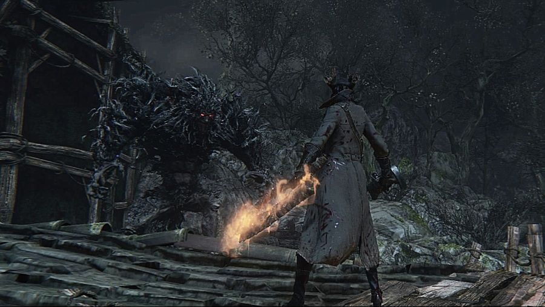

# 톱단창과 톱창에 대해 알아보자.

## 1. 블러드본 기본 무기

톱단창과 톱창은 블러드본의 가장 기본 무기이다.  
톱단창은 게임표지의 무기이며, 톱창은 톱단창과 거의 톱단창과 같지만, 미세하게 다른 부분이 있다. 오늘은 그 부분중 사람들이 잘 모르는 부분을 깊게 고찰해보고자 한다. 

## 2. 공격력  49레벨 기준

4레벨에 협력갔을때 너프가 없는 레벨이 24레벨  
그 24레벨에 협력갔을때 너프가 없는 레벨이 48레벨 이다.  
그래서 기본레벨을 48레벨로 두고, 필요에 따라 레벨업을 하고, 세이브로드 신공으로 본레벨로 돌아가는 방법으로 게임을 즐기길 추천한다.

톱단창 : 기본공격력 180(10강)  
근력 48렙 : 폭력적인 과거 체40 근25  
기본공격력 : 237  
27.2% : 488

톱창 : 기본 공겯력 170(10강)  
기술 48렙 : 유일한 생존자 체37 기25 공격력  
기본공격력 : 230  
27.2% : 473

톱단창이 기본 공격력이 조금더 높고, 신비보정이 더 좋습니다.  
(신비보정은 여기서는 설명을 생략한다.)
기본 공격력이 우세하니, 환약 빨고 극딜넣기엔, 톱단창이 더 좋다.
(환약 게이지 채우기를 알면 이해가능)
 
 ## 3. 공격력  근기50, 근기99 기준

근기99 기준  
톱단창 기본360 - 741(27.2%)  
톱창 기본362 - 745(27.2%)  
톱창이 만레벨을 찍고 나서야 톱단창보다 공격력이 겨우 4 높아졌습니다.   
이 4에 목숨거는 분들있죠...  
그리고 근기 50 기준으로는  
톱단창 톱창 둘다 기본333에 685(27.2%)
근기50과 근기99는 결과적으로 공격력 60도 차이 안남!
블본 최대공격력의 10%입니다.  
(그러니까 무식하게 만렙 만들면 진짜 무식한것이다.)
 
참고로 관통력과 몹들의 방어력을 기준으로 고려한다면, 공격력이 400이상이면 엥간하면, 데미지가 잘 들어가고 500이상이면 사실상 몹들이 퍽퍽 쓰러집니다.
이건 블본 몹들의 방어력과 관련있으므로 설명 생략.
(움...50대 때려서 죽일 보스를 49대 때려서 죽이고 나온다 생각하심 됩니다.)
 
 ## 4. 내장 뽑기 데미지

기술 무기인 톱창이 근력무기인 톱단창보다 내장데미지는 잘 나옵니다.
결과적으로 톱창이 우세하고, PVP도 공격과 모션별 임팩트를 고려한다면, 톱창이 더 좋다고 볼수 있습니다.   

다만, 보스전만 놓고 본다면. 무조건 톱단창 입니다.  
환약 플레이시에는 톱창의 내장뽑기보다 톱단창이 더 유리할것 입니다.
(그로기시 내장을 뽑기보단, 연타 혹은 모으기 공격이 데미지가 더 나오니까요.)
보스전은 특정 보스 아니고서야 내장 뽑을일이 별로....
(뭐 삼뚱 파밍시에는 기술캐가 당연 유리하겠지만요^^)

## 5. 근력심연

그리고 근력심연이라는 선택지가 있습니다.
근력심연 혈정석은 근력값이 높은 톱단창으로 사용해야 합니다.  
(이미 여기서 톱창보다 톱단창의 선택지가 높아집니다. )
 
첫옵 근력보정 상승 +65
세컨옵 물리 +15 를 최선으로 아는데..
정말 잘못된 상식^^
물리 +15를 넣어서 27.2보다 같거나 조금더 아주~~~조금더 27.2를 겨우 넘어서는데요.  
레벨이 올라가면 갈수록 근력심연이 더 강해지므로, 27.2가 갖추어 졌다면, 야피주 파밍을 해서 근력심연으로 세팅하시기 바랍니다.   
> 어찌보면 근력심연 세팅이 궁극의 세팅일 것입니다. 
> 광녀, 유령 제외하고요!

## 6. 모션에 따른 배율

변형전
모션 : 동일 (R1 변형 연타 또한 동일)
공속 : 동일
사거리 : 동일 (변형 공격시 톱창이 더 길다.)
모션 배율 : 5타까지 모두 동일
 
변형후
모션 : 완전 다름, 단창은 종공격 먼저, 톱창은 횡공격 먼저
공속 : 비교의 의미가 없음
사거리 : 비교의 의미가 없음
스테미너 소모량 : 톱창이 조금더 소모.
모션배율 : 톱창이 10% 정도 더 높음.데미지가 있음.)

보통 톱단창이나 톱창으로 연타 시,
R1 - L1 - L1 - L1 - L1
으로 공격을 하게 됩니다.

이때의 모션배율은
톱단창 : 1 - 1.3 - 1.3 - 1.3 - 1.3
톱창 : 1 - 1.3 - 1.23 - 1.3 - 1.23
톱단창이 미세하게 높지만, 환약을 썼을때는 격차가 체감됩니다. 

## 7. 신비보정, 야수추뎀

1. 신비보정이 톱단창이 더 좋음. 화염톱단창이 화염톱창보다 좋음.
2. 야수추뎀은...변형후 톱창은 붙지만, 변형후 톱단창은 붙지 않습니다. 
3. 모션배율도 더 좋아서 변형후는 톱창이 더 셉니다.
> 모션배율과, 야수추뎀은 무시해도 될듯 합니다. 
 
설명.
R1 후 L1 변형 연타시에는 톱날이 있는 부분으로 때리기 때문에 톱단창 톱창 모두 야수추뎀 붙습니다.
그리고 변형후만 가지고 싸우는 경우는 PVP에 간혹쓰이고.
필드전, 혹은 보스전에서 사용하는 유저는 본적도 없고, 필자도 사용하지 않습니다.
아....톱단창 변형후는 아미그달라 머리를 칠때 간혹 사용합니다.
톱창의 변형후 야수추뎀이 별 쓸데가 없다는 말입니다.
 

## 8. 데미지

### 1. 근력심연

대부분의 유저들이 근력50을 찍는 경우 근력심연을 사용하므로...
물리27.2%두개 + 근력심연 사용 시,

근기99 기준
톱단창 786
톱창 779

근기 50 기준
톱단창 714
톱창 706

근력과 기술을 동일하게 찍은 경우 공격력 측면에서는 톱창을 사용할 이유가 없습니다.               
 
### 2. 임팩트

임팩트에 대한 이야긴데요.
톱단창과 톱창의 모션별 임펙트를 살펴보면,
거의 모든 내용에서 같지만 딱 4가지가 다릅니다.

모션 : 노멀모드에서 변형공격
톱단창 : heavy / 톱창 : normal

모션 : 변형모드에서 변형공격
톱단창 : normal / 톱창 : light

잡몹상대 시, 경직을 위하여 막타를 변형공격으로 치게되는데 톱단창의 경직이 톱창보다 우월합니다.

모션 : 한손모드 R2(끝까지모으기)
톱단창 : heavy / 톱창 : normal

모션 : 변형모드 R2(끝까지모으기)
톱단창 : **masive** / 톱창 : heavy    
 
impact 단계는
light < normal < heavy < masive 순 입니다.
테스트를 해 본 결과  **masive**는 일단, 공격모션이 발동되면 어떠한 것으로도 그 공격모션을 끊을 수 없는 impact를 말하는 것 같습니다.
슈퍼아머와 비슷한거라고 볼 수 있겠네요. 톱창은 masive가 없습니다.
 
## 8. 마지막으로...

그냥 근력캐는 톱단창을, 기술캐는 톱창을...
근기 캐릭은 근력보정을 통한 톱단창을 사용하는게 낫다고 봅니다.
 
굳이 톱단창과, 톱창 뭐가 좋아요?  
라는 질문에 본글은 결론은 톱단창이 더 좋다입니다.  
톱창 빠들이 보기엔...   
어그로 끄는 글일것듯 해서 사실 그리 편하진 않습니다.