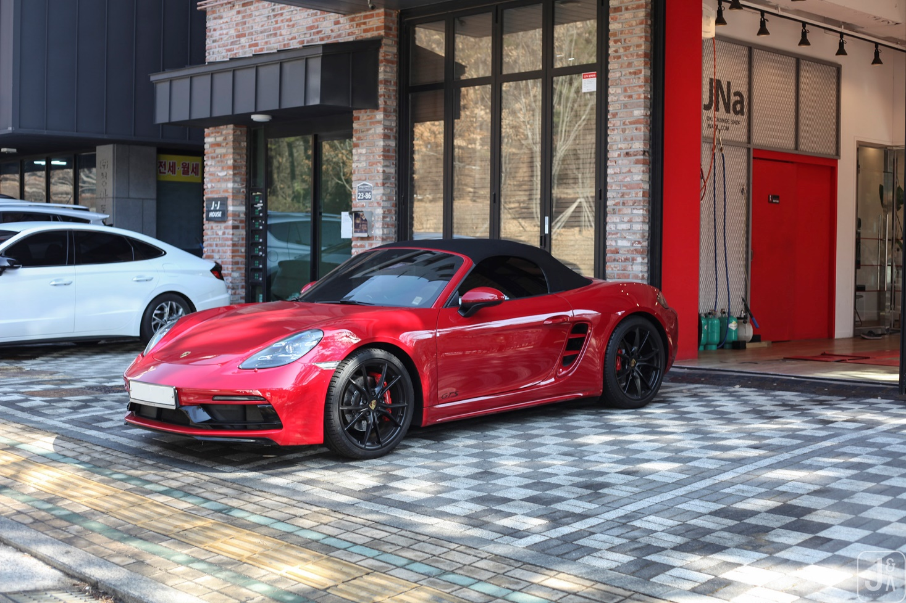

# 포르쉐 718 GTS S 노멀 vs 제네시스 G70 비교

포르쉐 718 GTS 4.0은 하위 라인업의 옵션을 기본 탑재하고 6기통 자연흡기 엔진을 갖춰 노멀, S 모델과 차별화되며, 미드십 레이아웃의 구조적 특성으로 제네시스 G70과 태생부터 다른 주행 한계를 보여준다. 단순히 엔진 마력의 높고 낮음을 떠나 하체 제어 시스템과 변속기의 반응 속도, 그리고 부품이 견뎌내는 내구 부하의 한계치가 완전히 다르다. 일상적인 고급 세단과 서킷 주행을 염두에 둔 미드십 스포츠카의 격차를 기술적 사양을 통해 정밀하게 비교 분석한다.

## 핵심 요약

* 포르쉐 718 GTS 4.0은 4기통 터보를 사용하는 노멀(2.0) 및 S(2.5) 모델과 달리 6기통 자연흡기 엔진을 탑재하여 차별화된 감성과 성능을 제공한다.
* 하위 라인업에서는 고가의 유료 옵션인 PASM 스포츠 서스펜션, PTV, 스포츠 크로노 패키지, 스포츠 배기 시스템이 GTS 4.0에 기본 사양으로 적용된다.
* 출력이 높아짐에 따라 S 모델보다 직경이 큰 브레이크 디스크와 대형 캘리퍼를 장착하여 제동 한계를 한층 더 끌어올렸다.
* 외관에는 고성능을 상징하는 SportDesign 범퍼와 다크 틴트 램프가 적용되며, 실내는 Race-Tex(알칸타라) 소재와 스포츠 시트 플러스로 채워진다.
* 오직 GTS에서만 선택 가능한 'GTS 인테리어 패키지'는 독보적인 감성 전용 사양과 함께 중고차 잔존 가치 방어에 유리한 고가 옵션이다.
* 제네시스 G70과 비교 시 수평대향 엔진의 저중심 설계와 미드십 레이아웃의 결합으로 코너링 시 주행 물리 한계치가 압도적으로 높다.
* 포르쉐의 PDK 변속기와 가혹 주행을 상정한 엔진 냉각 계통은 양산차 최고 수준의 과잉 엔지니어링과 장기 내구성을 입증한다.

## 1. 포르쉐 718 라인업 내부의 사양 및 옵션 격차

하위 모델인 노멀이나 S에서 추가 비용을 지불하고 선택해야 하는 핵심 주행 옵션들이 GTS 4.0에는 출고 시부터 기본 탑재된다. 구성 옵션을 하나씩 추가하다 보면 하위 모델의 가격이 GTS 4.0의 가격에 근접하게 되므로, 순수 6기통 엔진의 가치를 고려할 때 GTS 4.0의 패키징 구성이 지니는 메리트는 명학하다.

### 하체 및 주행 성능 사양

* **PASM 스포츠 서스펜션**: 스포츠 모드 작동 시 차고가 노멀 모델 대비 20mm 낮아진다. S 모델의 기본 차고 감소 폭인 10mm보다 낮으며, 20mm 다운 사양은 S에서 유료 옵션이다. 이를 통해 한층 더 단단하고 날렵한 거동을 매끄럽게 제어한다.

* **PTV (포르쉐 토크 벡터링)**: 기계식 리미티드 슬립 디퍼런셜(LSD)과 연동되어 작동한다. 선회 구간 진입 시 안쪽 바퀴에 미세한 제동을 가해 회전력을 극대화하고 날카로운 코너링을 구현한다.

* **스포츠 크로노 패키지**: 대시보드 상단의 스톱워치, 스티어링 휠에 위치한 드라이브 모드 스위치, 정지 상태에서 최적의 가속력을 내는 런치 컨트롤 기능이 포함된다.

* **스포츠 배기 시스템**: GTS 모델 전용으로 조율된 블랙 테일파이프가 장착되며, 6기통 자연흡기 엔진 고유의 매끄러운 고회전 사운드를 구현한다.

### 제동 시스템의 차이

* 엔진 출력이 높아짐에 따라 제동 성능도 함께 강화되었다. S 모델보다 직경이 큰 브레이크 디스크와 대형 캘리퍼를 결합하여 가혹하고 반복적인 제동 상황에서도 페이드 현상을 억제한다.

## 2. GTS 전용 디자인 요소와 인테리어 패키지의 가치

GTS 라인업은 외관과 실내 전체에 특유의 블랙 디테일과 고급 소재를 사용하여 시각적, 기능적 차별화를 이뤄냈다.

### 외관 익스테리어 특징

* **SportDesign 프런트 범퍼**: 노멀 및 S 모델보다 공기 흡입구 면적이 더 넓고 공격적인 전면 범퍼 형상을 취한다.

* **틴팅 처리된 램프**: 헤드라이트와 리어 라이트 내부를 어둡게 처리하는 다크 틴트가 기본 적용된다.

* **휠 및 레터링**: 20인치 718 스포츠 휠이 새틴 블랙 색상으로 장착되며 후면부의 모델명과 측면 데칼 역시 블랙으로 마감된다.

### 실내 구성과 Race-Tex 소재

* 스티어링 휠, 시트 중심부, 암레스트 등 신체 접촉이 잦은 부위에 고급스럽고 미끄러짐 방지 효과가 우수한 알칸타라(Race-Tex) 소재가 광범위하게 사용된다.

* 측면 지지력을 강화한 스포츠 시트 플러스를 배치하여 역동적인 주행 상황에서 운전자의 몸을 견고하게 붙잡아 준다.

### GTS 인테리어 패키지의 희소성

* 일반 레드 가죽 시트는 하위 모델에서도 선택할 수 있으나, **GTS 인테리어 패키지**는 오직 GTS 라인업에서만 추가할 수 있는 유료 옵션이다. 약 400~500만 원 상당의 고가 사양이다.

* 카마인 레드 또는 크레용 컬러의 대비 스티치가 시트, 대시보드, 도어 트림 전반에 세밀하게 들어간다.

* 실내 안전벨트와 계기판 타코미터의 다이얼 색상이 선택한 스티치 컬러와 동일하게 일치되어 통일감을 강조한다.

* 해당 패키지 적용 시 실내 주요 트림 부분이 순정 카본 소재로 마감되어 한층 더 스포티한 실내 분위기를 연출하며, 중고차 시장에서도 선호도가 높아 감가 방어에 핵심적인 역할을 수행한다.

## 3. 제네시스 G70과 포르쉐 718의 태생적 기술 구조 비교

제네시스 G70이 일상적인 안락함과 정비 편의성, 가성비를 겸비한 프리미엄 세단이라면 포르쉐 718 GTS 4.0은 정밀한 조종 성능과 운전의 즐거움을 극대화한 정통 스포츠카다. 두 차량은 설계 목적과 구조적 역학 관계에서 뚜렷한 격차를 보인다.

### 수평대향 엔진과 미드십 레이아웃

* **수평대향(Boxer) 엔진**: 실린더 블록이 상향 배치되는 제네시스의 V6 엔진과 달리, 포르쉐의 6기통 엔진은 피스톤이 좌우로 누워 대향 운동을 한다. 이로 인해 엔진 자체의 높이가 낮아져 차량 전체의 물리적 무게중심을 지면에 가깝게 밀착시키는 데 기여한다. 코너링 시 발생하는 롤링 한계를 제네시스보다 훨씬 높은 영역으로 설정할 수 있는 이유다.

* **미드십(Mid-ship) 레이아웃**: 엔진이 운전석 바로 뒤, 뒷바퀴 축 앞에 위치한다. 무거운 구동계 부품이 차체 중앙에 집중되어 있어, 엔진이 앞에 위치해 후미가 관성으로 따라오는 일반 세단 구조와 확연히 다른 주행감을 준다. 선회 시 운전자의 몸이 차량의 회전 중심축이 되어 레일을 타고 도는 듯한 감각을 제공한다.

### PDK 변속기와 과잉 엔지니어링의 내구성

* **PDK 변속기**: 포르쉐의 듀얼 클러치(PDK) 변속기는 일반적인 토크컨버터 방식의 자동변속기를 사용하는 제네시스와 달리 체결 지연이 없는 초고속 변속을 수행한다. 동력 손실을 배제하고 과열 없이 연속적인 급가속 부하를 견디는 냉각 설계는 양산차 최고 수준으로 평가받는다.

* **과잉 엔지니어링 기반의 내구성**: 포르쉐는 서킷 트랙 주행을 기본 상정하고 모든 부품을 과설계한다. 엔진 냉각 장치의 용량, 브레이크 시스템의 열 배출 성능, 하체 링크 부싱의 강성이 가놓한 주행 환경을 버텨내도록 조율되어 있다. 부품 고유의 강성이 높기 때문에 경년 변화에 따른 주행 성능 저하가 매우 완만하며 장기 내구성이 우수하다.

## 4. 모델별 주요 제원 및 특성 스코어카드

| 구분   | 현대 제네시스 (G70/G80)            | 포르쉐 718 GTS 4.0                         |
|--------|------------------------------------|--------------------------------------------|
| 목적   | 안락함, 편의성, 가성비 고급감      | 정밀한 조종, 드라이빙의 즐거움             |
| 코너링 | 타이어가 비명을 지르며 버티는 느낌 | 차 자체가 레일을 타고 도는 느낌            |
| 한계치 | 일상 영역을 넘어서면 불안함 발생   | 한계 상황에서도 기계적으로 견고함 유지     |
| 내구성 | 쾌적한 유지보수 위주               | 가혹한 주행(고RPM) 시에도 엔진 보호력 우수 |
---

## 결론

차량의 가치는 제원표상의 수치만으로 재단할 수 없다. 제네시스 G70이 세단으로서 훌륭한 범용성과 출력을 제공하지만, 포르쉐 718 GTS 4.0이 보여주는 수평대향 엔진의 저중심 구조와 미드십 레이아웃은 옵션 추가나 튜닝으로 극복할 수 없는 물리 법칙의 영역이다. 하위 라인업인 노멀과 S 모델 역시 훌륭한 차량이나, 6기통 자연흡기 엔진이 선사하는 리니어한 출력 전개와 감성, 그리고 퍼포먼스 사양의 기본 탑재라는 측면에서 GTS 4.0은 대체 불가능한 독자적인 가치를 구축하고 있다.

## 자주 묻는 질문(FAQ)

### GTS 4.0과 S 모델의 보유 및 유지 비용 차이가 많이 날까?

엔진 배기량이 2.5L에서 4.0L로 크게 증가하기 때문에 매년 납부하는 자동차세 측면에서는 확실한 차이가 발생한다. 그러나 자차 보험료의 경우 가입자의 연령, 사고 요율 변동폭, 차량 가액이 미치는 영향이 더 크기 때문에 두 모델 간에 극단적인 요율 격차가 벌어지지는 않는다. 다만 소모품 교환 비용 및 장기 정비 비용은 6기통 자연흡기 구조인 GTS 4.0이 열관리 측면에서 다소 유리한 부분이 존재한다.

### GTS 인테리어 패키지에 포함된 알칸타라(Race-Tex) 소재는 관리가 까다로울까?

일반 천연 가죽에 비해 오염에 취약하고 보풀이 일어난다는 인식이 있으나, 인공 합성 소재 특성상 기본적인 내구성이 우수하다. 전용 클리너를 사용해 주기적으로 유분과 오염을 닦아주고 기모를 살려주면 장기간 양호한 상태를 유지할 수 있다. 코너링 시 운전자의 신체를 강하게 붙잡아 주는 기능적 이점이 매우 크기 때문에 관리의 수고로움을 상쇄하고도 남는다.

### 제네시스 G70 3.3T 모델이 직선 주로 가속에서 718 노멀 모델을 압도할 수 있을까?

단순 직선 가속력(제로백)이나 마력 수치상으로는 6기통 터보 엔진을 탑재한 G70 3.3T가 4기통 2.0 터보 엔진인 718 노멀 모델을 앞서거나 대등한 수준을 보여준다. 그러나 초고속 영역에서의 풍절음 및 하체 안정성, 연속적인 제동 시의 페이드 저항력, 그리고 선회 구간이 포함된 종합 트랙 주행으로 넘어가면 변속기 효율과 차체 레이아웃의 한계로 인해 G70이 밀리게 된다.

### 718 S 모델에 옵션을 최대로 추가하면 GTS 4.0과 성능이 완벽히 같아질까?

PASM 스포츠 서스펜션, PTV 등의 하체 제어 옵션을 S 모델에 전부 추가하면 선회 특성과 하체 반응은 GTS 4.0과 매우 유사해질 수 있다. 하지만 엔진의 실린더 수와 흡기 방식에서 오는 본질적인 차이는 메울 수 없다. 4기통 싱글 터보 엔진의 토크 분출 방식과 6기통 자연흡기 엔진이 제공하는 고회전 영역에서의 선형적인 질감 및 배기음은 옵션 선택의 범주를 넘어선 영역이다.

### 포르쉐 718 GTS 4.0을 매일 주행하는 데일리 카로 쓰기에 무리가 없을까?

PASM 서스펜션의 감쇄력 조절 기능 덕분에 컴포트 모드 설정 시 일상 주행이 가능한 수준의 정제된 승차감을 확보할 수 있다. 다만 일반 세단 대비 전면 지상고가 낮아 과속방지턱이나 주차장 진입 시 하부 긁힘에 주의해야 한다. 아울러 미드십 구조 특성상 엔진이 중앙에 있어 적재 공간이 전후면 트렁크로 분할되어 있으므로, 부피가 큰 단일 적재물을 싣기에는 제약이 따른다.