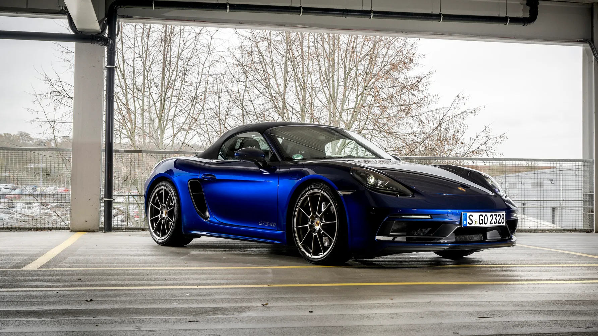

# 포르쉐 718 GTS 4.0은 정말로 911을 위협하는 하극상 모델일까?

포르쉐 718 GTS 4.0과 911의 제원을 비교하고 엔진 아키텍처의 기술적 차이와 구조적 내구성 및 하극상 논란의 실체를 공학적 관점에서 철저하게 분석한다.

많은 자동차 마니아들은 미드십 구조를 채택한 718 GTS 4.0이 포르쉐의 플래그십인 911의 영역을 침범했다고 주장하곤 한다.  
실제로 출력을 비교해 보면 하위 라인업이 상위 라인업을 역전하는 기현상이 관찰되기도 한다.

하지만 포르쉐는 브랜드 서열을 지키기 위해 눈에 보이지 않는 물리적 족쇄와 디튠을 영리하게 활용했다.  이 글에서는 두 모델의 제원표 이면에 숨겨진 공학적 배경과 실제 엔진 부품의 차이점을 상세히 살펴본다.

## 핵심 요약

* 718 GTS 4.0의 최고 출력은 407마력으로 911 카레라 기본형의 392마력을 넘어서는 출력 역전 현상이 존재한다.

* 포르쉐는 하극상을 막기 위해 718 GTS 4.0의 기어비를 길게 설정하고 터보 대신 자연흡기를 채택하여 중저속 토크를 제한했다.

* 718 GTS 4.0 엔진은 911 카레라의 3.0 터보 엔진 블록(9A2 EVO)에서 파생된 자연흡기 버전이며, 911 GT3의 9A1 엔진과는 완전히 다르다.

* 스트로크가 늘어나 피스톤 평균 속도가 21.2m/s까지 상승했으나, 이는 고성능 자연흡기 엔진의 안전 설계 범위 안에 속한다.

* 알루실 코팅 블록과 워터재킷 재설계를 통해 열변형을 제어하므로 단순 가공 확장이 아닌 전용 캐스팅으로 봐야 한다.

* 장기 보유 시 구조적 한계보다는 오일 관리, 냉간 시 과부하 금지 등 철저한 윤활 유지가 내구성을 결정하는 핵심 요소다.

## 1. 포르쉐 718 GTS 4.0과 911의 제원 비교와 하극상의 실체

단순히 엔진 출력만 놓고 보면 718 GTS 4.0은 911의 기본 모델인 카레라보다 높은 마력을 발휘한다.

하지만 상위 등급인 카레라 S를 넘어서지는 못하도록 철저하게 세팅되어 있다. 구조적 태생인 미드십 구조와 엔진 잠재력 측면에서 포르쉐가 의도적으로 성능을 제한하지 않았다면 상위 등급을 압도했을 가능성이 크다.

국내 출시 사양을 기준으로 정리한 제원 비교 데이터는 다음과 같다.

| 구분 | 718 Cayman GTS 4.0 | 911 Carrera (기본) | 911 Carrera S | 911 GT3 |
| --- | --- | --- | --- | --- |
| **엔진 형식** | 4.0L 6기통 자연흡기 (NA) | 3.0L 6기통 트윈터보 | 3.0L 6기통 트윈터보 | 4.0L 6기통 자연흡기 (NA) |
| **배치 구조** | 미드십 (MR) | 리어 엔진 (RR) | 리어 엔진 (RR) | 리어 엔진 (RR) |
| **최고 출력** | 407 ps / 7,000 rpm | 392 ps / 6,500 rpm | 458 ps / 6,500 rpm | 510 ps / 8,400 rpm |
| **최대 토크** | 43.9 kg·m | 45.9 kg·m | 54.1 kg·m | 48.0 kg·m |
| **0-100km/h** | 4.0초 | 4.2초 (SC 적용 시 4.0초) | 3.7초 (SC 적용 시 3.5초) | 3.4초 |
| **최고 속도** | 288 km/h | 293 km/h | 308 km/h | 318 km/h |

718 GTS 4.0의 마력은 407마력으로 911 기본형의 392마력을 분명히 앞선다.

일반적인 자동차 제조사는 하위 라인업이 상위 라인업의 출력을 넘지 못하게 통제하지만 자연흡기 4.0이라는 상징성을 위해 이를 허용했다. 그러나 제로백 가속 성능에서는 터보 엔진을 탑재하여 낮은 RPM부터 최대 토크가 분출되는 911 기본형에 비해 밀리는 양상을 보인다.

또한 포르쉐는 718 GTS 4.0의 기어비를 비정상적으로 길게 설정하여 2단에서 시속 100km를 훌쩍 넘기도록 물리적 족쇄를 채웠다. 구조적으로는 엔진이 차체 중앙에 위치한 미드십(MR) 방식이어서 엔진이 뒷바퀴 축 뒤에 있는 911의 리어 엔진(RR) 방식보다 코너링 한계치가 물리적으로 훨씬 높다.

## 2. 9A2 EVO와 9A1 엔진 아키텍처의 기술적 차이

718 GTS 4.0에 탑재된 엔진은 911 카레라 3.0 터보 엔진 계열인 9A2 EVO 엔진 패밀리를 기반으로 설계되었다.  
즉 911의 3.0 터보 엔진 블록 캐스팅과 기본 설계를 공유하는 모듈러 엔진 패밀리에서 파생되어 터보를 제거하고 배기량을 늘린 버전이다.

반면 많은 이들이 오해하는 911 GT3의 4.0 자연흡기 엔진은 완전히 별도의 엔진 코드인 9A1을 사용하는 레이싱 기반 고회전 엔진이다.  

두 엔진과 911 터보 엔진의 세부 부품별 기술적 차이는 아래 표와 같다.

| 항목 | 718 GTS 4.0 (9A2 EVO) | 911 GT3 4.0 (9A1) | 911 Carrera 3.0 Turbo (9A2 EVO) |
| --- | --- | --- | --- |
| **엔진 계열** | 9A2 EVO 계열 자연흡기 | 9A1 고회전 자연흡기 | 9A2 EVO 트윈터보 |
| **블록 캐스팅** | 9A2 EVO 기반 블록 | GT3 전용 고강성 블록 | 9A2 EVO 표준 블록 |
| **크랭크샤프트** | 9A2 EVO 기반 강화형 | 고강성 경주용 강철 합금 | 9A2 EVO 터보용 크랭크 |
| **커넥팅로드** | 강철 forged 단조 타입 | 티타늄 또는 고성능 합금 | 강철 forged 단조 타입 |
| **오일 시스템** | 통합 드라이섬프 표기 수식 | 건식 윤활 (별도 탱크) | 습식 윤활 시스템 |
| **밸브트레인** | DOHC 4밸브 자연흡기 최적화 | 초경량 고회전 레이싱 최적화 | DOHC 4밸브 터보 내구 중심 |
| **최대 회전수** | 약 7,800 rpm | 약 9,000 rpm | 약 7,000 rpm |

기술적으로 보면 718 GTS 4.0은 911의 3.0 터보 블록을 튜닝하여 자연흡기로 용도를 변경한 구조를 취한다.

GT3의 엔진은 9,000rpm 고회전을 견디기 위해 단조 크랭크와 티타늄 커넥팅 로드, 독립된 건식 윤활 시스템을 갖추어 기계적 완성도에서 격을 달리한다.
따라서 같은 4.0L 배기량을 가졌더라도 도로 중심의 스포츠 주행과 트랙 퍼포먼스 최우선이라는 개발 목적에 따라 부품 설계가 완전히 갈라진다.

## 3. 보어 및 스트로크 증가가 엔진 내구성에 미치는 영향

배기량을 3.0L에서 4.0L로 확대하면서 보어는 91mm에서 102mm로, 스트로크는 76.4mm에서 81.5mm로 대폭 증가했다.

이로 인해 레드라인인 7,800rpm에서 최고 평균 피스톤 속도는 약 21.2m/s에 도달하며 이는 3.0 터보의 19.1m/s보다 약 11% 높은 수준이다.

평균 피스톤 속도가 21m/s를 넘어서면 고성능 자연흡기 엔진의 영역에 진입하게 되며 크랭크와 로드에 작용하는 관성하중이 급격히 커진다.

포르쉐는 이러한 구조적 위험을 방지하기 위해 단조강 커넥팅로드와 단조 크랭크샤프트, 질량 최적화 피스톤을 적용하여 내구성을 확보했다.

또한 보어가 11mm 늘어난 것은 기존 블록의 내부벽을 단순히 깎아낸 것이 아니라 블록 캐스팅 자체를 새로 설계하여 스케일업한 결과다.

실린더 사이의 두께인 브릿지 두께는 알루실 구조 특성을 고려하여 약 5~7mm 수준의 부분 보강 구조로 유지되고 있다.

보어 확대에 따른 국부 열변형과 오일막 붕괴를 막기 위해 워터재킷의 냉각수 통로를 재배치하고 배기측 냉각을 한층 강화했다.

현재까지 전 세계적으로 718 GTS 4.0 엔진에서 구조적 로드 파단이나 크랭크 균열과 같은 집단적 결함 사례가 보고되지 않은 이유가 여기에 있다.

## 4. 하중 특성에 따른 베어링 설계 여유와 열팽창 제어

엔진의 내구성을 평가할 때 터보 엔진과 자연흡기 엔진은 받는 스트레스의 성격이 완전히 다르다.

3.0 터보 엔진은 높은 과급압으로 인해 연소실 내부의 폭발 압력 하중과 열 스트레스가 메인 및 로드 베어링에 집중된다.  
반면 4.0 자연흡기 엔진은 폭발 압력은 낮지만 고회전에 따른 피스톤과 로드의 왕복 관성하중이 베어링에 더 큰 부하를 준다.

포르쉐는 유한요소해석과 유막 두께 해석을 거쳐 수백 시간의 풀부하 벤치 테스트를 통과한 양산 승인 기준을 충족하여 설계 여유를 확보했다.

| 부하 유형 | 터보 엔진 (3.0T) | 자연흡기 엔진 (4.0 NA) |
| --- | --- | --- |
| **연소압 스트레스** | 높음 | 낮음 |
| **열 스트레스** | 높음 | 낮음 |
| **회전 피로** | 낮음 | 높음 |
| **밸브트레인 부담** | 낮음 | 매우 높음 |
| **개스킷 내구** | 열부하 큼 | 상대적으로 유리 |

대구경 보어에서 발생하는 열팽창과 타원 변형 문제를 제어하기 위해 고실리콘 알루미늄 합금인 알루실 계열 표면 처리가 적용되었다.

라이너 없이 알루미늄 본체에 직접 실린더 표면을 생성하는 방식으로 피스톤 오일 제트와 정밀 온도 제어가 동반되어 오일막 붕괴를 원천 차단한다.  
만약 실린더 벽이 손상될 경우 알루실 블록은 이론적으로 보링 후 강철이나 니카실 코팅 슬리브를 압입하는 방식으로 수리가 가능하다.

실제로 해외에서는 슬리브 개조 사례가 존재하므로 엔진 교체만이 유일한 해결책이라는 주장은 경제성이 낮을 뿐 기계적으로는 과장된 표현이다.

## 결론

포르쉐 718 GTS 4.0은 단순히 상위 모델을 사지 못해 선택하는 대체재가 아니라 미드십 자연흡기라는 독보적인 기계적 가치를 지닌 차량이다.

제원상 마력 역전을 허용하면서도 토크와 기어비를 제어하여 브랜드의 서열 구조를 유지한 포르쉐의 마케팅과 공학적 조율이 돋보이는 모델이기도 하다.

엔진의 기술적 뿌리는 911의 모듈러 아키텍처에 두고 있지만 전용 캐스팅 블록과 강화 부품을 통해 고성능 자연흡기 고유의 회전 피로를 견디도록 완성도를 높였다.

기계적인 설계 여유가 충분히 검증된 만큼 사용자가 냉간 시 과부하를 방지하고 오일 관리 주기를 철저히 준수한다면 장기 보유 시에도 뛰어난 내구성을 경험할 수 있다.

결국 이 차량은 숫자로 표현되는 가속력 이상의 날카로운 코너링 밸런스와 자연흡기 고회전 감성을 완벽하게 구현해 낸 공학적 걸작으로 평가할 수 있다.

## 자주 묻는 질문(FAQ)

### 718 GTS 4.0의 엔진은 911 GT3 엔진과 동일한가?

아니다.  718 GTS 4.0은 911 카레라의 3.0 터보 엔진 블록(9A2 EVO)을 기반으로 개발된 자연흡기 엔진이다.  반면 911 GT3의 엔진은 9,000rpm까지 회전하는 완전히 독립된 레이싱 전용 설계(9A1) 엔진이므로 부품과 아키텍처가 완전히 다르다.

### 출력이 더 높은데도 911 카레라보다 제로백이 느린 이유는 무엇인가?

엔진의 구동 방식과 기어비 차이 때문이다.  911 카레라는 터보차저를 장착하여 중저속 RPM에서부터 가공할 토크를 발휘하지만 718 GTS 4.0은 자연흡기라 고회전 영역까지 돌려야 힘이 나온다.  또한 포르쉐가 하극상을 방지하기 위해 718의 기어비를 의도적으로 매우 길게 세팅해 물리적 가속력을 제한했기 때문이다.

### 보어와 스트로크를 키우면 엔진이 파손될 위험이 커지지 않는가?

스트로크가 늘어나면서 피스톤 속도가 빨라지고 관성하중이 증가한 것은 사실이다.  그러나 포르쉐는 이를 감당할 수 있도록 고강성 단조 크랭크와 강화된 커넥팅 로드를 적용했다.  일반적인 양산 엔진의 안전율 기준을 충분히 충족하도록 설계되어 가혹한 서킷 주행에서도 구조적 파단이 일어나지 않도록 조치했다.

### 알루실 블록에 스크래치가 발생하면 무조건 엔진을 통째로 교체해야 하는가?

기계적으로는 그렇지 않다.  실린더 내벽을 보링한 뒤 강철이나 니카실 코팅 슬리브를 압입하는 가공 수리 방식이 존재하며 실제로 해외 전문 업체를 통해 개조가 이루어지고 있다.  다만 국내에서는 정밀 장비를 보유한 업체가 드물고 수리 비용이 매우 높아 경제성 측면에서 엔진 교체가 권장될 뿐 기술적으로 불가능한 것은 아니다.

### 이 엔진을 탑재한 차량을 장기 보유할 때 가장 주의해야 할 점은 무엇인가?

설계상의 마진보다 중요한 것은 가혹한 환경에서의 윤활 관리다.  고회전 자연흡기 엔진 특성상 엔진 오일의 점도 유지와 주기적인 교환이 필수적이며 오일이 제 온도를 찾기 전 냉간 상태에서 고부하 주행을 하는 것을 반드시 피해야 한다.  순정 상태를 유지하며 냉각 시스템 노화를 방지하는 관리가 동반된다면 20년 이상 안정적으로 운용할 수 subcontinent 있다.
