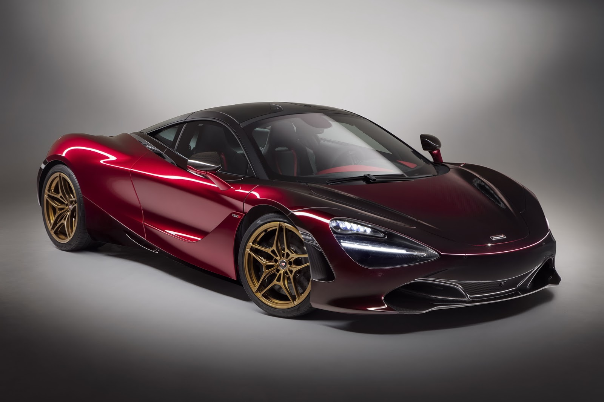
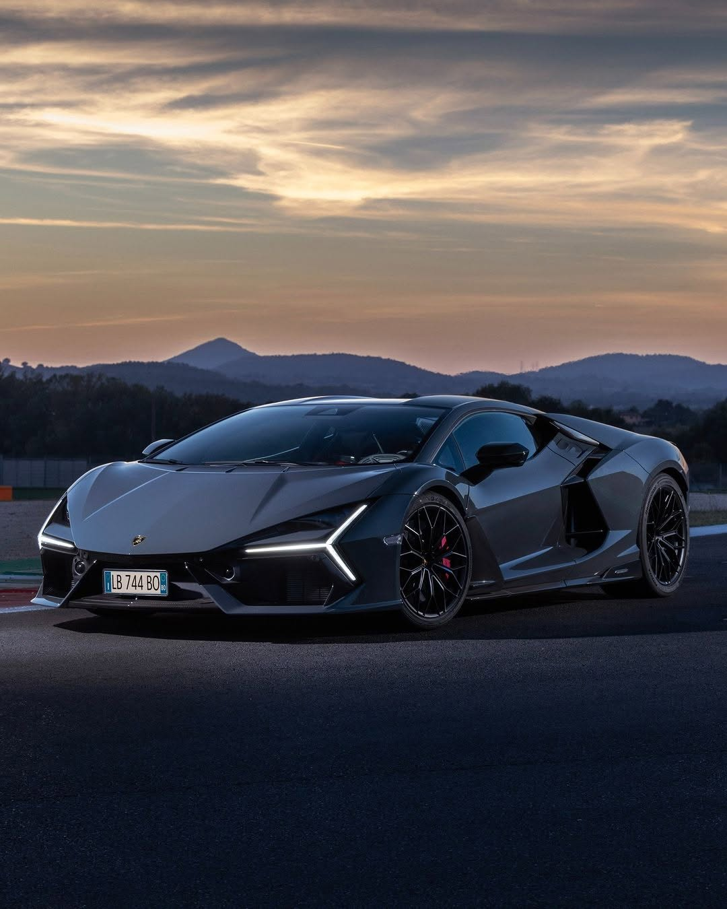
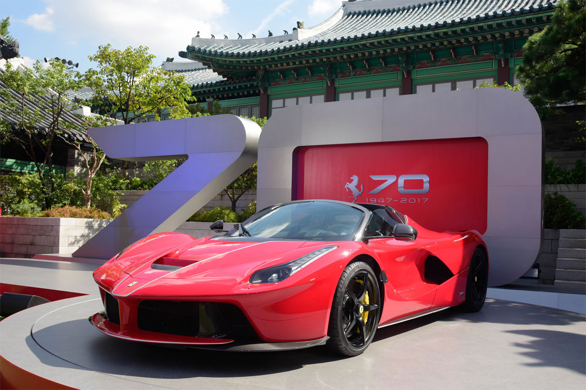

# 슈퍼카 단점과 유지비 스트레스, 오너들이 결국 중고로 처분하는 이유

슈퍼카는 강렬한 성능과 상징성을 제공하지만, 일상에서는 실용성 부족과 지속적인 정신적 부담으로 인해 많은 오너가 결국 소유를 포기하게 되는 구조를 지닌다. 페라리와 람보르기니, 맥라렌 같은 이름은 자동차를 좋아하지 않는 사람에게도 특별한 감정을 불러일으킨다. 그러나 실제로 오랜 기간 소유한 사람들의 경험을 살펴보면 만족감보다 피로감이 더 크게 남는 경우가 적지 않다. 이 글은 왜 수억 원을 들여 구입한 슈퍼카를 결국 다시 판매하거나 다른 차종으로 바꾸는 사람이 많은지 그 구조적인 이유를 단계적으로 살펴본다.

## 핵심 요약

* **슈퍼카의 가장 큰 매력은 성능보다 상징성**에 있다. 많은 사람은 자동차 자체보다 성공의 증표라는 이미지에 먼저 매료된다.
* **트랙을 위한 설계는 일상에서는 불편함으로 바뀐다.** 낮은 차고와 강한 출력은 일반 도로에서 장점보다 제약으로 작용하는 경우가 많다.
* **불편은 시간이 지나면서 스트레스로 변한다.** 운전보다 관리가 중심이 되기 시작하면 만족감은 빠르게 감소한다.
* **유지비보다 더 큰 비용은 정신적 비용**이다. 차량 손상에 대한 불안과 타인의 시선은 소유자의 일상을 지속적으로 제약한다.
* **많은 오너가 결국 GT카나 럭셔리 세단으로 이동하는 이유**는 속도를 포기해서가 아니라 자유를 되찾기 위해서다.
* **슈퍼카는 누구에게나 나쁜 자동차가 아니라**, 일상과 취미의 경계가 매우 명확한 자동차라고 이해하는 편이 현실에 가깝다.

## 1. 왜 사람들은 슈퍼카를 꿈꾸는가?

슈퍼카는 단순히 빠른 자동차가 아니다. 현대 사회에서 **슈퍼카는 성공을 상징하는 하나의 문화적 기호**다. 붉은 페라리, 각진 람보르기니, 레이싱 기술을 앞세운 맥라렌은 자동차 브랜드를 넘어 하나의 아이콘으로 소비된다. 사람들은 최고 속도나 랩타임보다 그 자동차가 상징하는 사회적 의미를 먼저 소비한다. 이는 시계나 예술품처럼 기능보다 상징성이 더 크게 작용하는 대표적인 사례다.

자동차 제조사 역시 이러한 심리를 잘 알고 있다. 극단적으로 낮은 차체, 일반 차량에서는 볼 수 없는 도어 구조, 굵은 배기음, 희소성을 강조하는 한정 생산 방식은 모두 소유자의 감정을 자극하도록 설계되어 있다. 자동차를 구매하는 순간 사람은 단순한 운전자가 아니라 특별한 세계의 구성원이 된 듯한 만족감을 경험한다. **희소성과 상징성**은 슈퍼카가 높은 가격에도 꾸준히 수요를 유지하는 가장 큰 이유다.

여기에 미디어가 만든 이미지도 큰 역할을 한다. 영화와 게임, 유튜브 콘텐츠에서는 슈퍼카가 언제나 자유와 성공, 압도적인 존재감을 상징한다. 긴 해안도로를 질주하거나 도심을 여유롭게 달리는 장면은 현실보다 훨씬 자주 소비된다. 자연스럽게 사람들은 자동차를 소유하면 그러한 삶도 함께 따라올 것이라고 기대하게 된다. 그러나 현실은 이 환상을 오래 유지하도록 허락하지 않는다.

## 2. 트랙에서는 장점이지만 일상에서는 약점이 되는 설계

슈퍼카는 본질적으로 **레이싱 기술을 일반 도로로 가져온 자동차**다. 따라서 설계의 우선순위 역시 일상생활이 아니라 최고 성능에 맞춰져 있다. 문제는 이러한 설계가 일반적인 도로 환경과 충돌한다는 점이다.

가장 대표적인 사례가 낮은 차고다. 공기저항을 줄이고 다운포스를 확보하기 위해 차체는 가능한 한 노면 가까이 설계된다. 트랙에서는 엄청난 안정성을 제공하지만, 일반 도로에서는 오히려 가장 큰 스트레스가 된다. 과속방지턱 하나를 넘을 때도 진입 각도를 계산해야 하고, 지하주차장 경사로에서는 바닥이 닿지 않을지 먼저 확인해야 한다. 작은 실수 하나가 카본 스플리터 손상으로 이어질 수 있기 때문이다.

노면 상태 역시 끊임없이 신경 써야 한다. 일반 승용차라면 무심코 지나갈 수 있는 포트홀이나 요철도 슈퍼카에게는 고가의 수리비로 이어질 수 있는 위험 요소다. 운전자는 목적지보다 도로 상태를 먼저 살피게 되고, 즐거움을 위해 시작한 운전이 어느새 긴장의 연속으로 변한다. **운전의 중심이 즐거움에서 회피로 바뀌는 순간**, 소유 경험 역시 달라지기 시작한다.

출력도 마찬가지다. 오늘날 상당수 슈퍼카는 600마력 이상, 일부 모델은 800~1,000마력을 넘는다. 그러나 일반 공도에서는 이러한 성능을 제대로 사용할 기회가 거의 없다. 제한속도와 교통량 때문에 가속 페달을 깊게 밟을 상황 자체가 드물며, 잠깐의 가속만으로도 법적 속도를 크게 초과할 수 있다. 결국 대부분의 시간 동안 엄청난 성능은 사용되지 못한 채 남아 있게 된다.

이러한 상황이 반복되면 운전자는 역설적인 감정을 경험한다. 더 높은 성능을 원해서 구입했지만 실제로는 성능을 사용할수록 위험 부담이 커진다. 결국 엔진은 잠재력을 발휘하지 못하고, 소유자는 자신이 비용을 지불한 가치의 상당 부분을 경험하지 못한다는 허탈함을 느끼게 된다.

## 3. 성능보다 먼저 무너지는 것은 일상의 편안함

일상에서 가장 먼저 체감하는 변화는 속도가 아니라 **편안함의 상실**이다. 슈퍼카는 경량화와 차체 강성을 확보하기 위해 서스펜션을 매우 단단하게 설정하는 경우가 많다. 이는 고속 코너링에서는 장점이지만, 일반 도로에서는 작은 요철도 그대로 차체와 운전자에게 전달한다.

버킷 시트 역시 같은 맥락이다. 몸을 단단히 고정하기 위해 제작된 시트는 서킷에서는 효과적이지만, 장거리 이동에서는 피로를 빠르게 누적시킨다. 허리와 골반을 자유롭게 움직이기 어려워 장시간 운전 시 일반 세단보다 훨씬 쉽게 피곤함을 느끼는 경우가 많다. 최근에는 승차감을 개선한 모델도 등장했지만, 기본적인 설계 철학 자체는 여전히 레이싱에 가깝다.

실용성은 더욱 제한적이다.

* **컵홀더가 없거나 사용성이 떨어지는 경우**가 적지 않다.
* 작은 수납공간만 제공되는 모델이 많다.
* 미드십 구조 때문에 트렁크 용량이 매우 작다.
* 승하차 자체가 일반 차량보다 훨씬 어렵다.
* 폭이 넓어 일반 주차칸 이용도 부담스럽다.

이러한 요소들은 하나하나만 보면 사소해 보일 수 있다. 그러나 출퇴근, 장보기, 가족과의 외출, 여행처럼 반복되는 일상 속에서는 불편이 계속 누적된다. 처음에는 특별함으로 느껴졌던 요소들이 시간이 지나면서 불편함으로 인식되기 시작하고, 자동차를 선택하는 기준 역시 자연스럽게 바뀌게 된다.

처음에는 모든 단점을 감수할 만큼 강렬했던 만족감도 반복되는 현실 앞에서는 조금씩 희미해진다. 그리고 그 시점부터 운전자는 자동차를 즐기는 사람이 아니라, 자동차를 관리하는 사람이 되어가기 시작한다.

## 4. 유지비보다 더 무거운 것은 정신적 유지 비용이다

슈퍼카를 이야기할 때 가장 먼저 언급되는 것은 수억 원에 이르는 차량 가격이나 높은 보험료다. 그러나 실제 오너들이 오랫동안 기억하는 부담은 단순한 금전이 아니라 **끊임없이 이어지는 정신적 긴장감**인 경우가 많다.

슈퍼카는 일반 차량보다 수리 단가가 매우 높다. 카본파이버 부품이나 특수 도장, 전용 부품은 교체 비용 자체가 크며, 일부 모델은 공식 서비스센터에서만 정비가 가능한 경우도 있다. 따라서 작은 접촉 사고조차 일반 차량과는 비교하기 어려운 비용으로 이어질 수 있다. 이러한 사실을 알고 있는 오너는 자연스럽게 운전보다 위험 회피를 우선하게 된다.

주차는 또 다른 스트레스다.

* **문콕 가능성이 있는 주차 공간은 피하게 된다.**
* CCTV 유무를 먼저 확인하게 된다.
* 사람이 많은 장소 방문을 망설이게 된다.
* 장시간 노상주차를 최대한 피하려 한다.
* 외출 중에도 차량 상태가 계속 신경 쓰인다.

처음에는 이러한 행동이 차량을 아끼는 마음처럼 느껴진다. 그러나 시간이 지나면 자동차가 생활을 제한하기 시작한다. 식당을 선택할 때도 주차장을 먼저 확인하고, 여행지를 고를 때도 노면 상태와 주차 환경을 고려하게 된다. 목적보다 자동차가 우선순위가 되는 순간, **소유 관계는 조금씩 뒤바뀐다.**

많은 오너가 "차를 내가 타는 것이 아니라 차가 나를 끌고 다닌다."라고 표현하는 이유도 여기에 있다. 자동차는 원래 이동의 자유를 넓혀 주기 위해 존재하지만, 오히려 행동 반경을 제한하는 존재가 되어 버리는 것이다.

## 5. 시간이 흐를수록 만족감은 줄고 피로감은 남는다

슈퍼카를 처음 인도받던 날의 감정은 매우 강렬하다. 엔진 시동 소리, 낮은 운전 자세, 시선을 끄는 디자인은 분명 일반 자동차가 주지 못하는 만족감을 제공한다. 그러나 **인간은 뛰어난 자극에도 빠르게 적응하는 존재**다.

처음에는 매번 감동을 주던 배기음도 시간이 지나면 익숙해지고, 강력한 가속 역시 반복되면서 특별함이 감소한다. 반면 불편함은 적응한다고 사라지지 않는다. 좁은 주차장, 낮은 차고, 부족한 적재공간, 관리 부담은 계속 남는다.

결국 시간이 흐를수록 두 곡선은 서로 반대 방향으로 움직인다.

| 시간의 흐름 | 만족감 | 피로감 |
| --- | --- | --- |
| 구입 직후 | 매우 높음 | 낮음 |
| 수개월 | 높음 | 점차 증가 |
| 수년 | 익숙해짐 | 지속적으로 누적 |
| 장기 소유 | 특별함 감소 | 생활의 부담으로 전환 |

이 구조 때문에 많은 슈퍼카는 예상보다 주행거리가 매우 짧다. 주행거리가 적어서 가치가 유지되는 것이 아니라, **탈 일이 점점 줄어들기 때문**인 경우도 적지 않다.

주말마다 탈 것이라 생각했던 자동차는 어느새 차고에서 배터리 충전기를 연결한 채 보관되는 시간이 더 길어진다. 좋은 날씨, 한적한 도로, 안전한 목적지라는 여러 조건이 모두 충족되어야만 운행하게 되기 때문이다. 결국 자동차는 가장 비싼 취미가 아니라 가장 사용하기 어려운 취미가 되기도 한다.

## 6. 그래서 많은 오너는 슈퍼카를 포기하는가?

이러한 이유 때문에 자동차 시장에서는 흥미로운 현상이 반복된다. 슈퍼카를 경험한 뒤 다시 슈퍼카를 구입하는 사람도 있지만, 상당수 오너는 결국 **GT카, 럭셔리 세단, 고성능 SUV**와 같은 보다 균형 잡힌 차량으로 이동한다.

이 변화는 자동차를 싫어하게 되었기 때문이 아니다. 오히려 자동차를 오래 즐긴 사람일수록 일상에서 가장 중요한 요소가 무엇인지 분명하게 알게 되기 때문이다.

많은 오너가 결국 중요하게 생각하는 것은 다음과 같다.

* 언제든 부담 없이 탈 수 있는가.
* 장거리 이동이 편안한가.
* 주차 때문에 목적지를 바꾸지 않아도 되는가.
* 가족이나 동승자도 함께 즐길 수 있는가.
* 관리보다 운전에 더 많은 시간을 사용할 수 있는가.

이 기준에서는 최고 출력보다 **사용 빈도**가 더 중요해진다. 실제로 자주 타는 자동차가 만족도 역시 높아지는 경우가 많다. 아무리 뛰어난 성능을 갖추었더라도 차고 안에 머무는 시간이 대부분이라면 소유의 의미는 점점 약해질 수밖에 없다.

물론 모든 슈퍼카 오너가 후회하는 것은 아니다. 서킷 주행을 즐기거나 컬렉션 목적으로 소유하는 사람에게는 충분한 가치가 있다. 다만 일상용 자동차로 접근하는 경우에는 현실과 기대 사이의 간극이 생각보다 훨씬 크다는 점을 이해할 필요가 있다.

## 결론

**슈퍼카는 최고의 자동차이면서 동시에 가장 목적이 분명한 자동차**다. 트랙과 같은 환경에서는 압도적인 성능과 감성을 제공하지만, 일상이라는 현실 속에서는 그 장점 상당수가 제약으로 바뀐다. 낮은 차체와 강한 출력, 단단한 승차감, 부족한 실용성은 시간이 흐를수록 반복되는 생활 속에서 지속적인 피로를 만들어 낸다.

더 중요한 것은 **정신적 비용**이다. 차량을 손상시키지 않기 위해 행동을 제한하고, 주차 환경을 먼저 고민하며, 끊임없이 관리 상태를 신경 쓰는 순간 자동차는 이동 수단이 아니라 관리 대상이 된다. 처음에는 소유자가 자동차를 선택했다고 생각하지만, 시간이 지나면 자동차가 소유자의 생활 방식을 결정하는 구조가 형성될 수도 있다.

결국 많은 사람이 슈퍼카를 처분하는 이유는 유지비를 감당하지 못해서만은 아니다. 시간이 흐르면서 **강렬했던 만족감은 일상이 되고, 반복되는 불편함은 끝까지 남기 때문**이다. 그래서 상당수 오너는 더 빠른 자동차가 아니라 더 자주 탈 수 있는 자동차를 선택한다. 자동차의 가치는 최고 속도보다 얼마나 자유롭게 삶 속에서 사용할 수 있는지에 의해 결정된다는 사실을 경험하게 되는 것이다.

## 자주 묻는 질문(FAQ)

### 슈퍼카는 일상용 자동차로 사용할 수 있는가?

가능은 하지만 많은 제약이 따른다. 낮은 차고, 좁은 적재공간, 단단한 승차감, 높은 유지비 때문에 일반 승용차보다 훨씬 많은 불편을 감수해야 한다.

### 슈퍼카는 유지비만 감당하면 만족스럽게 탈 수 있는가?

유지비는 중요한 요소지만 전부는 아니다. 주차 불안, 관리 부담, 행동 제약처럼 돈으로 해결하기 어려운 정신적 비용도 장기 소유 만족도에 큰 영향을 준다.

### 왜 슈퍼카는 주행거리가 짧은 차량이 많은가?

가치 보존 목적도 있지만 실제로는 운행 조건이 까다로워 자연스럽게 운행 빈도가 줄어드는 경우도 많다. 좋은 날씨와 적절한 도로 환경을 기다리다 보면 차고에 머무는 시간이 길어진다.

### 슈퍼카를 가장 만족스럽게 즐길 수 있는 환경은 무엇인가?

일상 출퇴근보다 서킷 주행이나 여유로운 와인딩처럼 차량 성능을 안전하게 활용할 수 있는 환경에서 만족도가 높아지는 경우가 많다.

### 슈퍼카 대신 만족도가 높은 선택지는 무엇인가?

개인의 목적에 따라 다르지만 장거리 여행과 일상까지 함께 고려한다면 GT카, 럭셔리 세단, 고성능 SUV처럼 성능과 실용성을 균형 있게 갖춘 차량을 선택하는 사례가 많다.
