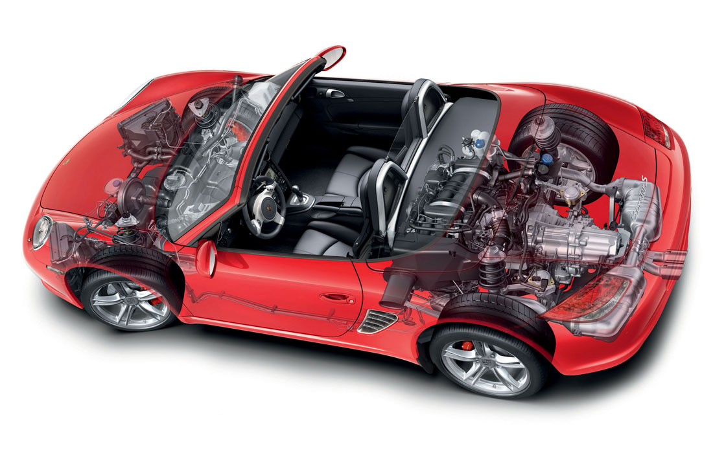
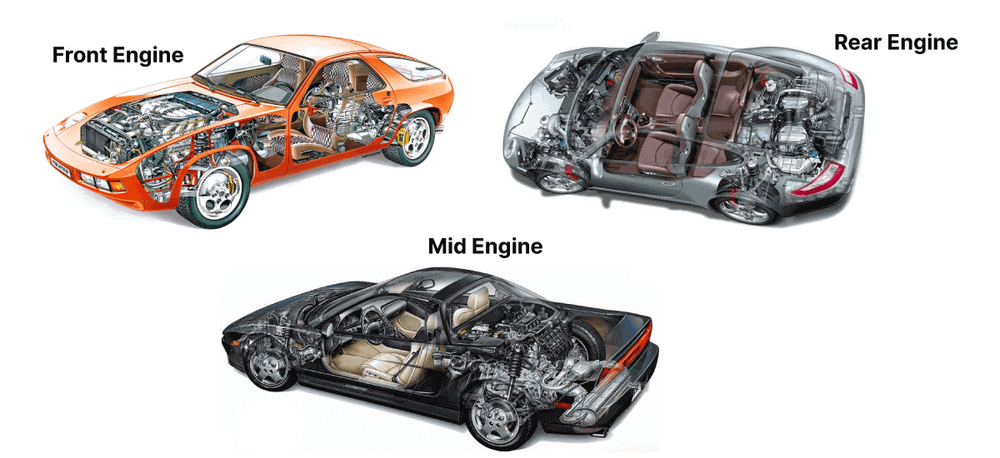

# 박스터 미드십 무게중심이 핸들링 특성을 바꾸는 원리

포르쉐 박스터의 **미드십 구조는 엔진을 차체 중앙에 배치**해 무게중심을 차축 사이에 집중시켜 핸들링 특성을 바꾸는 근본적 원리가 된다. 이를 바탕으로 타이어, 서스펜션, 구동계를 정교하게 조율하여 911과 차별화된 거동을 완성한다.

핵심은 차량의 질량이 모인 무게중심의 위치와 그 질량이 운전자의 조작에 반응하는 방식이다. 미드십은 이러한 무게중심 특성을 확보하는 뛰어난 출발점일 뿐이며, 실제 **핸들링 감각은 차체 전체의 통합적인 섀시 설계가 결정**한다.

## 1. 미드십은 왜 코너에서 유리한가?

자동차가 코너를 돌 때는 진행 방향을 바꾸는 동시에 차체 자체도 수직축을 중심으로 회전한다. 이 회전에 저항하는 정도를 나타내는 값이 **극관성 모멘트**다.

극관성 모멘트는 차량의 무게뿐 아니라 그 무게가 회전축에서 얼마나 떨어져 있는지에 따라 달라진다.

$$I = \sum m_i r_i^2$$

여기서 $m_i$는 각각의 질량이고 $r_i$는 회전축에서 해당 질량까지의 거리다. 거리가 제곱으로 반영되기 때문에 같은 무게의 부품이라도 차체 중심에서 멀리 떨어질수록 회전 관성에 미치는 영향이 커진다.

따라서 자동차에서는 엔진처럼 무거운 부품을 차체의 앞이나 뒤 끝에 배치하는 것보다 앞뒤 차축 사이, 회전축에 가까운 곳에 배치하는 것이 방향 전환에 유리하다. 박스터는 엔진을 운전자 뒤쪽이면서 앞뒤 차축 사이에 배치해 이런 조건을 만든다.

다만 **미드십의 장점을 엔진 위치 하나로 설명해서는 부족하다.** 변속기와 차동기어, 연료, 배터리, 냉각계, 차체 구조물, 탑승자까지 모두 차량의 질량 분포에 영향을 준다. 결국 미드십의 장점은 주요 질량을 차체 중심에 가깝게 배치하기 쉬운 패키징에서 출발한다.

## 2. 무게 배분과 질량 집중은 다르다

자동차의 핸들링을 설명할 때 50:50 같은 전후 중량 배분 수치가 자주 언급된다. 하지만 **전후 중량 배분과 질량 집중은 서로 다른 개념**이다.

전후 중량 배분은 정지 상태에서 앞뒤 차축에 얼마나 많은 하중이 걸리는지를 나타낸다. 반면 질량 집중은 무거운 부품들이 회전축 주변에 얼마나 모여 있는지를 의미한다. 따라서 전후 중량 배분이 비슷한 두 자동차라도 엔진과 변속기 같은 무거운 부품의 위치가 다르면 방향 전환 특성이 달라질 수 있다.

여기에 실제 주행에서는 하중 이동까지 발생한다.

* 전후 중량 배분은 정지 상태의 기본적인 차축 하중을 결정한다.
* 질량 집중은 차량의 회전 관성과 방향 전환 특성에 영향을 준다.
* 제동과 가속에서는 앞뒤로 하중이 이동한다.
* 코너에서는 좌우 하중이 달라진다.
* 타이어와 서스펜션은 이렇게 변하는 하중을 받아 실제 접지력을 만들어낸다.

따라서 박스터의 핸들링을 특정한 중량 배분 숫자 하나로 설명하기는 어렵다. **질량 배치와 하중 이동, 타이어의 접지 특성을 함께 봐야 한다.**

## 3. 코너에서는 타이어의 하중이 계속 변한다

정지해 있을 때 네 타이어에 걸리는 하중은 비교적 단순하다. 하지만 주행을 시작하면 계속 달라진다. 제동하면 앞쪽으로, 가속하면 뒤쪽으로 하중이 이동하고, 코너에서는 바깥쪽 타이어에 더 많은 하중이 실린다.

종방향 하중 이동은 단순화하면 다음과 같이 나타낼 수 있다.

$$\Delta W = \frac{a \cdot m \cdot h}{L}$$

$a$는 가속도 또는 감속도, $m$은 차량 질량, $h$는 무게중심 높이, $L$은 휠베이스다. 무게중심이 높거나 가감속이 클수록 하중 이동이 커지고, 휠베이스가 길수록 같은 조건에서 하중 이동은 줄어든다.

문제는 타이어의 접지력이 수직 하중에 정확히 비례하지 않는다는 것이다. 타이어에는 **하중 민감도**가 있기 때문에 한쪽에 하중이 지나치게 몰리면 네 타이어가 만들어낼 수 있는 전체 접지력의 효율이 떨어질 수 있다.

따라서 스포츠카에서 중요한 것은 하중 이동 자체를 없애는 것이 아니다. 주행 중 하중 이동은 피할 수 없다. 중요한 것은 그 과정에서도 차가 예측 가능한 움직임을 보이고 타이어의 접지력을 효율적으로 사용하는 것이다.

## 4. 제동과 조향, 가속은 하나로 연결된다

실제 코너에서는 제동과 조향, 가속이 따로 이루어지지 않는다. 코너에 진입하면서 브레이크를 밟으면 앞 타이어에 하중이 증가하고, 동시에 그 타이어는 제동력과 조향력을 함께 만들어야 한다.

**트레일 브레이킹**은 이 특성을 이용하는 대표적인 운전 방법이다. 코너에 진입하면서 브레이크를 완전히 놓지 않고 제동력을 서서히 줄이면 앞쪽에 어느 정도 하중이 남은 상태에서 조향하게 된다. 이를 이용해 차량의 회전을 적극적으로 유도할 수 있다.

코너 중반을 지나 브레이크를 풀고 가속을 시작하면 하중은 다시 뒤쪽으로 이동한다. 후륜구동 차량에서는 뒷타이어에 하중이 증가하면서 구동력을 노면에 전달하는 데 도움이 될 수 있다.

미드십 차량은 이런 연속적인 입력에 빠르게 반응하기 좋은 구조다. 다만 **빠르게 반응하는 것과 쉽게 운전하는 것은 같은 의미가 아니다.** 회전 관성이 작으면 정상적인 상황에서는 조작에 대한 반응이 빠르게 느껴지지만, 접지력을 잃었을 때 차체의 회전도 빠르게 진행될 수 있다.

그래서 좋은 스포츠카에서는 빠른 반응 자체보다 운전자가 그 반응을 예측하고 제어할 수 있는지가 중요하다.

## 5. 미드십이라고 항상 뉴트럴 스티어인 것은 아니다

미드십 자동차를 설명하면서 흔히 뉴트럴 스티어를 떠올리지만, 엔진 위치만으로 언더스티어와 오버스티어가 결정되는 것은 아니다.

전후 타이어의 크기와 컴파운드, 공기압, 서스펜션 지오메트리, 스프링과 댐퍼, 안티롤바, 얼라인먼트, 차동기어와 전자제어 시스템 등이 함께 차량의 코너링 특성을 만든다.

양산 스포츠카가 반드시 극단적인 중립성을 추구하는 것도 아니다. 한계를 넘어섰을 때 운전자가 거동을 예상하고 대응할 수 있도록 일정한 언더스티어 성향을 설정할 수도 있다.

중요한 것은 **한계에 가까워졌을 때 차량이 얼마나 일관되게 반응하느냐**다. 스티어링과 페달 입력에 대한 반응이 일정하다면 운전자는 타이어의 접지 한계를 판단하기 쉬워진다.

## 6. MR, FR, RR은 서로 다른 해법이다

엔진 배치를 이해하려면 MR, FR, RR을 단순한 우열 관계로 볼 필요가 없다. 각각 질량을 배치하고 동력을 전달하는 방식이 다르기 때문이다.

**MR(Mid-engine, Rear-wheel drive)** 은 엔진을 앞뒤 차축 사이에 두고 뒷바퀴로 구동한다. 박스터와 카이맨이 대표적인 사례다. 주요 질량을 차체 중심 가까이에 배치하기 쉬워 빠른 방향 전환 특성을 만들기에 유리하다.

**FR(Front-engine, Rear-wheel drive)** 은 엔진을 앞쪽에 두고 뒷바퀴로 구동한다. 전통적인 스포츠카 형태를 만들기 쉽고 엔진과 실내를 배치하는 데에도 장점이 있다. 엔진과 변속기, 차체 구조를 적절히 설계하면 상당히 균형 잡힌 중량 배분도 가능하다.

**RR(Rear-engine, Rear-wheel drive)** 은 엔진을 뒤차축보다 뒤쪽에 배치한다. 포르쉐 911이 대표적이다. 뒷바퀴에 많은 정적 하중을 확보할 수 있어 가속할 때 트랙션을 얻는 데 유리하지만, 후방에 집중된 질량 때문에 다른 레이아웃과는 다른 회전 특성이 나타난다.

결국 중요한 것은 레이아웃의 이름보다 **그 구조의 장점을 어떻게 살리고 약점을 어떻게 보완했느냐**다.

## 7. 박스터와 911은 왜 다른 주행 감각을 만드는가?

박스터와 911의 가장 큰 차이는 엔진 위치에서 시작된다. 박스터는 MR, 911은 RR이기 때문에 무거운 파워트레인의 위치부터 다르다.

911은 엔진이 뒤차축 뒤에 놓여 뒷바퀴에 상당한 정적 하중을 제공한다. 가속할 때 후륜의 트랙션을 확보하는 데 유리하지만, 후방에 집중된 질량 때문에 코너에서 차체가 회전하는 방식 역시 독특하다. 포르쉐는 이 특성을 오랜 기간 발전시켜 911만의 주행 감각으로 만들었다.

박스터는 엔진을 앞뒤 차축 사이에 둔다. 주요 질량을 차체 중심에 가깝게 배치할 수 있어 스티어링을 돌렸을 때 차체가 빠르게 방향을 바꾸는 특성을 만들기 좋다.

따라서 두 모델은 단순히 가격과 성능의 상하 관계로만 설명하기 어렵다. **서로 다른 엔진 배치가 서로 다른 주행 특성을 만든다.**

## 8. 미드십의 성능을 완성하는 것은 타이어와 서스펜션이다

미드십은 좋은 출발점을 제공하지만, 노면과 직접 접촉하는 것은 결국 타이어다. 질량 분포가 아무리 이상적이어도 타이어가 충분한 종력과 횡력을 전달하지 못하면 그 장점을 활용할 수 없다.

타이어는 제동과 조향, 가속을 모두 담당한다. 코너 진입에서 강하게 제동하면서 동시에 방향을 크게 바꾸면 이미 상당한 접지력을 사용하고 있는 상태가 된다. 운전자가 여러 동작을 한꺼번에 요구할수록 타이어의 부담도 커진다.

전후 타이어의 크기를 다르게 구성하는 **스테거드 세팅**도 이런 균형과 관련된다. 후륜구동 스포츠카는 구동력을 받아내야 하는 뒷바퀴에 더 넓은 타이어를 사용하는 경우가 많다. 하지만 뒤쪽 타이어를 무조건 크게 만든다고 좋은 핸들링이 만들어지는 것은 아니다. 앞뒤 그립의 균형과 조향 응답성까지 함께 고려해야 한다.

서스펜션은 타이어가 노면과 접촉을 유지하도록 차체 움직임을 관리한다. 스프링은 차체를 지지하고, 댐퍼는 움직임의 속도를 조절하며, 안티롤바는 코너링 때 발생하는 롤에 영향을 준다.

서스펜션을 무조건 단단하게 만드는 것도 답은 아니다. 너무 강한 세팅에서는 노면의 요철을 타이어가 따라가지 못해 오히려 접지력이 떨어질 수 있다. 스포츠카의 섀시는 **차체 움직임을 억제하면서도 타이어가 노면을 따라가도록 조율해야 한다.**

## 9. 미드십은 성능을 위해 패키징의 제약을 감수한다

미드십은 운동 성능에 유리한 조건을 만들 수 있지만 공간 활용에서는 제약이 따른다. 

자동차 설계에는 이런 **트레이드오프**가 항상 존재한다. 운동 성능을 얻는 대신 공간이나 무게, 비용에서 다른 선택을 해야 한다. 미드십은 실용적인 패키징의 자유를 일부 포기하는 대신 주행 성능과 운전 감각에 유리한 구조를 선택한 셈이다.

## 10. 박스터의 가치는 숫자보다 운전 경험에서 드러난다

출력과 토크, 차량 중량, 0→100km/h 가속 시간은 자동차를 비교하는 데 유용하다. 하지만 스포츠카의 성격을 숫자만으로 설명할 수는 없다.

스티어링 휠을 돌렸을 때 차체가 얼마나 자연스럽게 따라오는지, 브레이크를 풀면서 차체의 자세가 어떻게 변하는지, 코너를 빠져나오면서 가속 페달을 얼마나 자신 있게 사용할 수 있는지는 제원표에 나타나지 않는다.

박스터에서는 미드십 구조와 섀시 세팅이 이런 감각에 직접 연결된다. 주요 질량을 중심에 가깝게 배치하고 타이어와 서스펜션, 구동계를 조율하면 운전자의 입력이 차체 움직임으로 빠르게 이어진다.

여기에 로드스터라는 차체 형태가 더해진다. 지붕을 열면 엔진과 배기음뿐 아니라 바람과 주변 소리까지 주행 경험의 일부가 된다.

박스터의 특징은 결국 **운전자의 조작과 자동차의 물리적인 반응 사이의 거리가 가깝다는 것**으로 정리할 수 있다.

## 11. 박스터를 911보다 낮은 차로만 볼 수 없는 이유

포르쉐의 모델 서열과 가격만 보면 박스터를 911의 하위 모델로 생각하기 쉽다. 하지만 설계 목적까지 보면 두 차는 같은 방식으로 스포츠카를 만드는 모델이 아니다.

911은 RR 구조를 오랜 시간 발전시키면서 독특한 주행 특성과 높은 성능을 만들어왔다. 박스터는 MR 구조에 로드스터를 결합해 민첩한 방향 전환과 개방형 주행 경험을 강조한다.

따라서 두 차는 같은 목표를 놓고 어느 쪽이 우수한지를 겨루는 관계라기보다 **서로 다른 구조로 스포츠카의 즐거움을 구현한 포르쉐의 두 가지 해법**에 가깝다.

박스터를 선택하는 이유 역시 단순히 911보다 저렴하기 때문이라고만 볼 수 없다. 미드십과 오픈톱이 만들어내는 운전 경험 자체를 선호할 수도 있다.

## 결론

포르쉐 박스터의 **우수한 핸들링 성능은 단순히 엔진을 차체 중앙에** 배치했다는 사실 하나만으로 완성되지 않는다. 극관성 모멘트를 최소화하는 미드십 레이아웃을 기본 골격으로 삼고, 주행 중 끊임없이 변하는 **전후·좌우 하중 이동을 타이어와 서스펜션, 섀시 제어 시스템**이 효과적으로 수용하도록 통합 설계한 결과다.

따라서 **박스터는 911의 단순한 하위 대안**이 아니며, 차체 중심에 질량을 집중시켜 조작 반응성과 일관된 한계 거동을 극대화한 **독자적인 미드십 스포츠카**다. 제원표 상의 수치를 넘어 운전자의 입력과 차량의 물리적 반응 사이의 유격을 극소화한 주행 감각이야말로 박스터 미드십 구조가 증명하는 본질적인 가치다.

## 자주 묻는 질문(FAQ)

### 박스터가 미드십이라서 무조건 코너링이 좋은가?

그렇지는 않다. 미드십은 질량 집중과 회전 관성 측면에서 유리한 조건을 제공하지만 실제 코너링 성능은 타이어, 서스펜션, 차량 중량, 얼라인먼트, 디퍼렌셜, 전자제어 등의 영향을 함께 받는다.

### 박스터와 911 중 어느 쪽이 더 좋은 스포츠카인가?

절대적인 우열로 판단하기 어렵다. 911은 RR 구조에서 비롯된 독특한 주행 특성과 높은 성능을 제공하고, 박스터는 MR 구조와 오픈톱에서 비롯된 다른 운전 경험을 제공한다. 어떤 특성을 원하는지에 따라 선택이 달라진다.

### 718의 4기통 엔진은 981의 6기통보다 나쁜가?

그렇게 볼 수 없다. 718의 4기통 터보는 출력과 토크에서 강점을 갖지만 981의 자연흡기 6기통과는 소리와 회전 질감이 다르다. 성능과 감각을 나누어 평가할 필요가 있다.

### 미드십 차량은 운전하기 어려운가?

미드십은 빠른 방향 전환 특성 때문에 운전자의 입력에 민감하게 반응할 수 있다. 현대 스포츠카는 타이어와 서스펜션, 전자제어 시스템을 이용해 이러한 특성을 안정적으로 제어하도록 설계한다.

### 박스터를 911의 하위 모델로 봐야 하는가?

가격과 브랜드 내 서열만 보면 그렇게 볼 수 있다. 하지만 설계 목적과 주행 특성까지 고려하면 충분한 설명이 되지 않는다. 박스터는 **미드십 로드스터라는 독자적인 구조와 운전 경험을 가진 스포츠카**다.