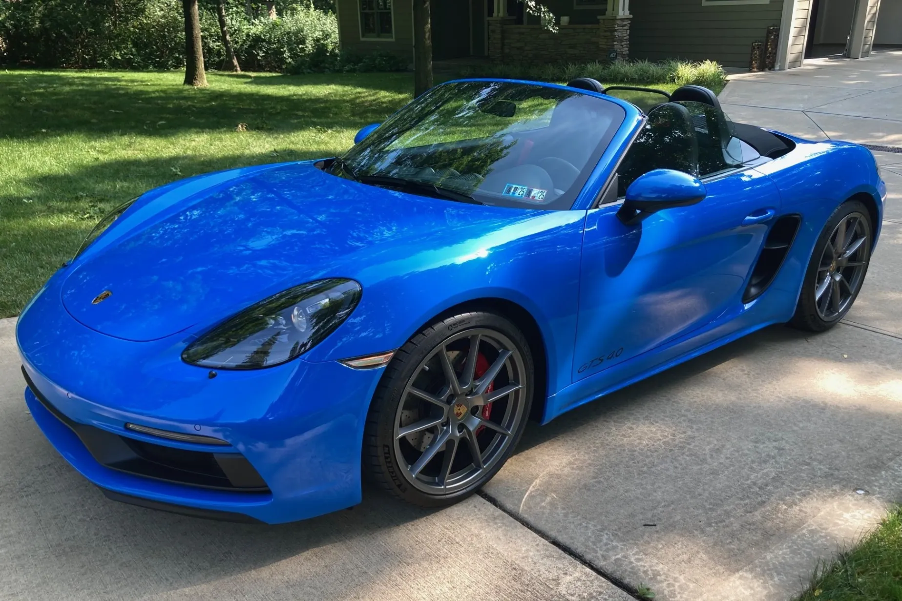

---
title: "자연흡기 스포츠카의 종말과 포르쉐 718 GTS 4.0 잔존가치 상승 구조"
date: 2026-06-23
lastmod: 2026-07-04
bookHidden: true
description: "자연흡기 엔진의 기술적 가치와 포르쉐 718 GTS 4.0의 미드십 구조 희소성을 기반으로, 전기차 전환 이후 중고 시장에서 잔존가치가 재평가되는 현상을 분석한다."
--- 

# 자연흡기 스포츠카의 종말과 포르쉐 718 GTS 4.0 잔존가치 상승 구조

자연흡기 엔진의 기술적 가치와 포르쉐 718 GTS 4.0의 미드십 구조 희소성을 기반으로, 전기차 전환 이후 중고 시장에서 잔존가치가 재평가되는 현상을 분석한다.  
글로벌 자동차 산업의 패러다임이 전동화로 급격히 선회함에 따라 대배기량 순수 내연기관 스포츠카의 생산은 사실상 종말 단계에 접어들었다.

이러한 구조적 변화 속에서 포르쉐의 718 GTS 4.0은 단순히 구형 모델로 도태되는 것이 아니라, 시장에서 대체 불가능한 고유의 가치를 지닌 자산으로 재정의되고 있다.  
본 분석에서는 이 모델의 핵심 역학 구조와 역사적 선례를 바탕으로 향후 형성될 중장기적 잔존가치 메커니즘을 규명한다.

## 핵심 요약

* 전동화 플랫폼 전환과 글로벌 환경 규제로 인해 대배기량 자연흡기 스포츠카의 신차 공급이 완전히 차단되고 있다.
* 718 GTS 4.0은 자연흡기 플랫식스 엔진과 미드십(MR) 레이아웃을 동시에 확보한 마지막 세대 모델이라는 상징성을 가진다.
* 전기 스포츠카가 제공하는 단순 가속 성능은 자연흡기 엔진 특유의 페달 직결감과 선형적 토크 상승을 물리적으로 대체할 수 없다.
* 배터리를 하부에 까는 전기차 구조 특성상 중량 분배를 활용한 전통적인 미드십 역학 구조는 향후 내연기관만의 희소 영역으로 남게 된다.
* 페라리 458, BMW E92 M3, 혼다 S2000 등 과거 '마지막 자연흡기' 타이틀을 쥔 모델들은 이미 중고 시장에서 가격 방어 및 프리미엄 형성에 성공했다.
* 718 GTS 4.0의 가치는 기계적 제원이 아닌 다시는 생산할 수 없는 구조적 희소성과 역사적 서사에 의해 결정된다.
* 향후 2026년부터 2035년까지 시장은 초기 관망세를 거쳐 수집 및 감성 보유 목적의 컬렉터 시장으로 완벽히 편입될 것으로 전망된다.

## 1. 자연흡기 엔진이 제공하는 독보적인 체감 가치

자연흡기 엔진은 정량화된 출력 수치를 넘어 운전자가 차량과 상호작용하는 감각의 본질을 구성한다.  
터보차저 엔진은 강제로 공기를 압축하는 과정에서 필연적으로 페달 입력과 실제 출력 사이에 미세한 시차인 터보랙을 발생시킨다.

반면 자연흡기 방식은 가속 페달을 밟는 즉시 스로틀 밸브가 열리며 엔진 회전수가 상승하여 지연 없는 직결감을 운전자에게 전달한다.  
이러한 선형적 토크 증가는 차량의 한계 영역에서도 거동을 예측하기 쉽게 만드는 구조적 장점을 제공한다.

고회전 영역에서의 감각 변화 역시 전기차나 터보차저가 흉내 낼 수 없는 고유의 영역이다.  
포르쉐의 4.0L 플랫식스 엔진은 4,000rpm을 기점으로 기계적 사운드가 변하기 시작하며, 6,000rpm을 넘어 7,000rpm 이상의 레드존에 달할 때 회전 질감과 출력이 정점에 이른다.  
전기차는 정지 상태에서 최대 토크를 뿜어내지만 회전수가 상승하며 출력을 쥐어짜는 과정의 드라마가 존재하지 않는다.

따라서 자연흡기 엔진은 단순한 동력원이 아니라 사운드와 회전 질감으로 완성되는 하나의 문화적 카테고리로 이동하고 있다.

## 2. 미드십(MR) 구조의 역학적 강점과 전기차 플랫폼의 구조적 단절

미드십(MR) 레이아웃은 차량의 가장 무거운 부품인 엔진을 앞바퀴와 뒷바퀴 사이, 즉 차체 중앙에 배치하는 설계 방식이다.  
이 구조는 회전 관성 모멘트를 최소화하여 코너링 시 조향 응답성을 극대화하고 전후 무게 배분의 완벽한 균형을 유도한다.  
트랙 주행이나 와인딩 로드에서 미드십 차량이 보여주는 날카로운 코너링 안정성은 물리적 역학 구조에서 기인한 절대적 강점이다.

그러나 전기차(EV) 플랫폼으로의 전환은 이러한 미드십의 정의를 완전히 소멸시킨다.  
전기차는 무거운 배터리 팩을 차량 바닥 전체에 넓고 낮게 배치하는 스케이트보드 구조를 채택한다.  
이 구조는 무게중심을 낮추는 데는 유리하지만, 특정 지점에 질량을 집중시켜 회전 특성을 제어하던 미드십 고유의 역학적 질감과는 본질적으로 분리된다.

즉 전기 스포츠카는 미드십을 대체하는 것이 아니라 완전히 다른 방식으로 주행 거동을 재정의하기 때문에, 전통적인 MR 방식의 내연기관 스포츠카는 구조적 희소성을 획득하게 된다.

## 3. 포르쉐 4.0 플랫식스 엔진의 기술적 차별성과 상징성

포르쉐 718 GTS 4.0에 탑재된 수평대향 6기통(플랫식스) 엔진은 브랜드의 정체성을 관통하는 기술적 결정체다.  
실린더가 서로 마주 보며 수평으로 움직이는 구조는 피스톤의 왕복 운동으로 발생하는 진동을 상호 상쇄시켜 극도로 매끄러운 회전 질감을 만들어낸다.  
또한 엔진의 높이 자체가 낮아 차체 전체의 무게중심을 지면 밀착 수준으로 낮추는 데 결정적인 기여를 한다.

이 엔진이 더욱 특별한 이유는 극악으로 치닫는 글로벌 환경 규제와 다운사이징 흐름을 뚫고 완성된 마지막 고배기량 모델이라는 점이다.  
대다수 브랜드가 배기량을 줄이고 터보를 장착할 때 포르쉐는 4.0L의 순수 자연흡기 라인업을 고수하며 기계적 순수성을 지켜냈다.  
포르쉐가 구축한 탄탄한 모터스포츠 헤리티지와 이 마지막 고배기량 엔진이 결합하면서, 718 GTS 4.0은 단순한 라인업 중 하나가 아니라 내연기관 황혼기를 상징하는 역사적 위치를 점하게 되었다.

## 4. 역사적 사례 분석을 통한 가치 재평가 패턴 검증

자동차 시장에서 '마지막 세대 자연흡기' 타이틀을 획득한 모델들은 시간이 흐를수록 중고 시장에서 단순 감가상각 법칙을 거스르는 경향을 보였다.

### 페라리 458 이탈리아

페라리 458 이탈리아는 페라리가 만든 마지막 V8 자연흡기 모델이다.

후속 모델인 488 GTB부터 터보 엔진이 도입되자 시장은 고회전 배기음과 날카로운 반응성을 가진 458의 가치를 재평가하기 시작했다.  
그 결과 458 이탈리아는 신차 출시 이후 오랜 시간이 지났음에도 감가율이 극도로 낮으며, 보존 상태가 우수한 매물은 신차가격을 상회하는 프리미엄을 형성하고 있다.

### BMW E92 M3 및 혼다 S2000

BMW E92 M3는 M3 역사상 처음이자 마지막으로 V8 자연흡기 엔진을 탑재한 차량이다.

이후 세대가 다운사이징 직렬 6기통 터보로 회귀하면서 E92 M3는 '고회전 독립 스로틀 V8'이라는 상징성 덕분에 마니아층의 절대적인 지지를 받으며 중고 가격 안정 구간에 진입했다.  
9,000rpm까지 회전하던 경량 로드스터 혼다 S2000 역시 단순한 구형 오픈카가 아니라 기계적 순수성의 상징으로 추앙받으며 수집가들의 표적이 된 지 오래다.

### 포르쉐 911 GT3 (991.1)

포르쉐 브랜드 내부에서도 선행 학습 효과를 찾을 수 있다.

911 GT3(991.1) 모델은 포르쉐 자연흡기 엔진의 정수를 보여주며 후속 터보 및 전동화 흐름 속에서도 독보적인 컬렉터 아이템으로 자리 잡았다.  
718 GTS 4.0은 자연흡기, 미드십, 포르쉐 브랜드라는 세 가지 핵심 조건을 모두 충족한다는 점에서 위 선례들과 완벽히 동일한 가격 방어 궤적을 따를 가능성이 높다.

## 5. 시간 축 기준 잔존가치 변동 시나리오 및 핵심 변수

718 GTS 4.0의 향후 10년간 잔존가치는 산업 구조 변화와 맞물려 세 단계의 뚜렷한 가치 재평가 구간을 거치게 된다.

### 단계별 시장 반응 (2026년~2035년)

* **2026~2028년 (전환 충격 구간):** 차세대 718 전기차 모델이 본격적으로 시장에 공개되고 내연기관 모델의 단종이 확정되는 시기다. 중고차 시장은 급격한 변동보다는 방향성을 탐색하는 관망세를 보이며 가격이 견고하게 유지되는 안정기를 거친다.
* **2028~2031년 (희소성 인식 구간):** 시장에 신차 공급이 완전히 차단되고 도로 위에 전기 스포츠카의 비율이 높아지는 시점이다. 이때부터 실사용 목적의 구매보다 감성적 보유 및 자산적 성격의 수집 수요가 본격적으로 유입되며 가치 상승 곡선이 가팔라진다.
* **2031~2035년 (컬렉터 시장 편입 구간):** 일반 중고차 매매 범주를 벗어나 희귀 차량을 다루는 컬렉터 중심의 거래체계로 편입된다. 이 단계에서는 일상적인 주행거리보다 차량의 원형 보존 상태와 사고 이력 여부가 가격을 결정하는 절대적인 지표가 된다.

### 가격 형성을 좌우하는 공급과 수요의 변수

가장 중요한 공급 측 변수는 사고 및 관리 부실로 인한 '정상 매물의 자연 감소율'이다.  
시간이 지날수록 순정 상태를 유지한 고품질 차량의 숫자는 줄어들 수밖에 없으므로 희소성은 가속화된다.  
수요 측면에서는 내연기관의 아날로그 감성을 갈망하는 하드코어 마니아층의 규모 유지와 글로벌 환경 규제에 따른 운행 제약 속도가 변수로 작용할 것이다.

## 결론

포르쉐 718 GTS 4.0의 장기 잔존가치를 결정하는 본질은 단순한 제원상의 수치가 아니라 다시는 복제할 수 없는 '구조의 희소성'에 있다.

수평대향 6기통 자연흡기 엔진이 선사하는 아날로그적 회전 질감과 미드십 레이아웃이 구현하는 역학적 밸런스의 시너지는, 배터리 중심의 전기차 플랫폼 체제에서는 물리적으로 재현이 불가능한 내연기관 고유의 유산이다.

과거 페라리 458이나 BMW E92 M3가 증명했듯, 한 시대의 종말을 고하는 마지막 기술 조합은 시간이 흐를수록 단순한 중고차가 아닌 역사적 서사를 품은 컬렉터 아이템으로 재평가된다.

따라서 718 GTS 4.0 역시 전기차 대전환 시대를 거치며 성능 중심의 감가상각 자산에서 벗어나, 전동화 이전 시대의 기계적 순수성을 대변하는 독보적인 희소 자산으로 시장에 각인될 것이다.

## 자주 묻는 질문(FAQ)

### 전기 스포츠카의 제로백이 더 빠른데 왜 자연흡기 내연기관을 고집하는가?

전기차의 가속력은 모터의 즉각적인 토크 분출로 구현되지만 단순한 속도의 영역에 머문다. 반면 자연흡기 엔진은 RPM이 상승함에 따라 변화하는 흡배기 사운드, 온몸으로 전달되는 기계적 진동, 밟는 깊이에 정밀하게 반응하는 스로틀의 피드백 등 운전자가 차량과 교감하는 감성적 밀도에서 완벽한 차이를 만들기 때문이다.

### 718 GTS 4.0의 잔존가치는 주행거리에 얼마나 민감하게 반응하는가?

단기적으로는 일반 중고차와 마찬가지로 주행거리가 짧을수록 유리하다. 그러나 장기 컬렉터 시장으로 진입하는 2030년대 이후부터는 단순 주행거리보다 사고 유무, 도장면의 순정 여부, 서비스 센터를 통한 정식 정비 이력 등 '보존의 순수성'이 가치 평가에 더 큰 영향을 미친다.

### 포르쉐 911이 아닌 718 라인업도 수집 가치가 충분한가?

911이 포르쉐의 영원한 플래그십인 것은 변함없으나 911은 리어 엔진(RR) 구조를 고수한다. 반면 718은 완벽한 밸런스를 자랑하는 미드십(MR) 구조의 정점이다. 포르쉐가 만든 마지막 자연흡기 미드십 내연기관이라는 독점적 서사가 존재하기 때문에 911과는 별개의 영역에서 확고한 수집 가치를 인정받는다.

### 향후 환경 규제가 더 강화되면 이 차량을 운행하지 못하게 되는 것 아닌가?

글로벌 규제는 신차 판매를 금지하는 방향으로 흐르고 있으며 기존 등록된 차량의 운행을 전면 금지할 가능성은 극히 낮다. 설령 도심 진입 제한 등의 페널티가 부과되더라도, 이러한 차량은 일상용이 아닌 주말 취미용이나 소장용 자산으로 취급되므로 규제가 강화될수록 기계적 희소 가치는 오히려 상승한다.

### 중고차 시장에서 장기적으로 프리미엄이 붙는 차량의 공통적인 보존 상태는 무엇인가?

임의적인 튜닝을 배제한 완벽한 '순정 상태'의 유지 여부가 핵심이다. 제조사 정식 보증 서비스 이력이 투명하게 남아있고, 크고 작은 사고로 인한 골격 데미지가 없으며, 실내 가죽이나 알칸타라 소재의 마모를 최소화하여 출고 당시의 기계적·미적 원형을 그대로 보존한 차량만이 최고 가치를 인정받는다.