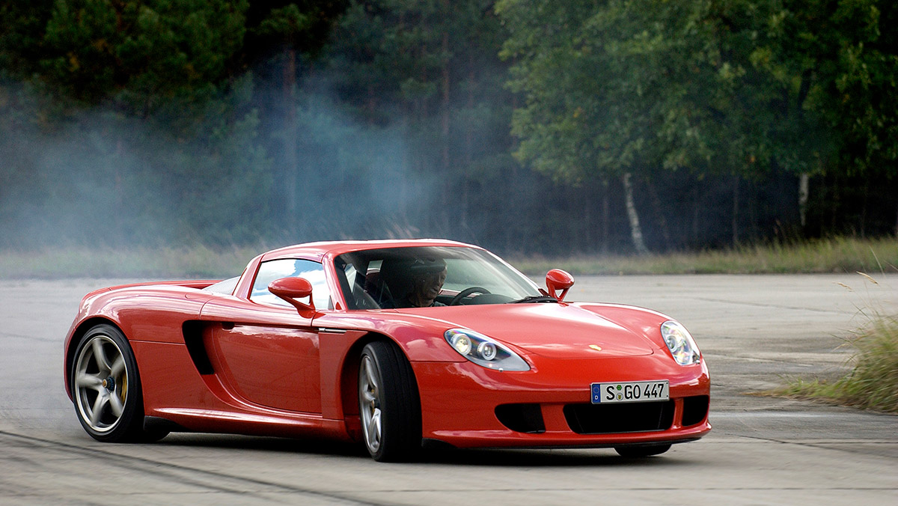

# 포르쉐가 페라리와 람보르기니보다 높은 명성을 가지는 이유

가격이 더 높은 페라리나 람보르기니보다 포르쉐의 명성이 더 강력하게 인정받는 이유를 독보적인 기술력, 일상적 실용성, 그리고 지적인 브랜드 이미지 측면에서 상세히 분석한다. 수많은 자동차 마니아들이 포르쉐를 최고의 스포츠카로 꼽는 배경에는 단순한 부의 과시를 넘어선 독보적인 가치가 존재한다. 포르쉐는 서킷 위의 강력한 퍼포먼스와 일상 주행의 편안함을 모두 만족시키는 유일무이한 엔지니어링을 선보인다. 이 글에서는 포르쉐가 구축한 독보적인 헤리티지와 경쟁사들과의 차별점을 살펴본다.

## 핵심 요약

* 포르쉐는 일상 주행과 서킷 주행을 모두 완벽하게 소화하는 독보적인 실용성을 자랑한다.
* 외계인을 고문해 만들었다는 찬사를 받는 수평대향 박서 엔진과 PDK 변속기는 현존 최고 수준의 완성도를 보여준다.
* 르망 24시 역대 최다 우승이라는 모터스포츠 역사와 60년 넘게 이어진 911의 전통이 브랜드의 정통성을 뒷받침한다.
* 과시적인 부의 상징인 경쟁사들과 달리 전문직과 지적인 성공을 상징하는 고유한 이미지를 구축했다.
* 차량 결함 리스크가 적고 중고 가치 방어가 뛰어나며, 가격 대비 가치가 월등하다.

## 1. 일상성과 실용성을 만족하는 독보적인 내구성

포르쉐는 다른 하이엔드 슈퍼카 브랜드와 비교했을 때 압도적인 판매량과 낮은 고장률을 자랑한다. 출퇴근이나 장거리 운전 등 실생활에서 매일 탈 수 있을 정도로 승차감과 실용성이 뛰어난 것이 특징이다. 역사상 생산된 포르쉐 차량의 70% 이상이 여전히 도로를 달리고 있다는 사실은 이들의 내구성이 얼마나 뛰어난지 증명하는 객관적인 지표다. 잔고장이 적고 유지비가 상대적으로 덜 들며 정비 인프라가 잘 갖추어져 있어, 부자들이 실제로 매일 운행하는 현실적인 선택지로 자리 잡았다.

## 2. 모터스포츠 DNA와 외계인 고문이라 불리는 기술력

포르쉐의 기술력은 수많은 레이싱 대회에서 우승하며 쌓은 초고성능 엔지니어링에 기반한다. 특히 르망 24시 역대 최다 우승이라는 타이틀은 포르쉐의 실전 기술력을 보여주는 가장 확실한 근거다. 차체 중심을 낮춰 코너링 성능을 극한으로 끌어올리는 **수평대향 박서 엔진**과 현존 가장 빠르고 내구성이 뛰어난 **PDK 변속기**는 포르쉐의 핵심 정체성이다. 또한 1963년 첫 출시 이후 60년이 넘는 세월 동안 고유의 유선형 실루엣과 RR 엔진 배치를 고수하며 진화한 911 플랫폼은 기술적 완성도의 정점을 보여준다.

## 3. 화려한 과시보다 지적인 성공을 상징하는 이미지

람보르기니와 페라리가 화려한 부를 과시하는 강렬한 느낌을 준다면, 포르쉐는 **성공한 전문가**나 지적인 부자의 이미지를 전달한다. 의사, 변호사, 엔지니어, 기업인 같은 전문직 종사자들이 포르쉐를 유독 선호하는 이유가 여기에 있다. 절제되고 정밀한 디자인 성향 덕분에 주변의 지나친 시선을 부담스러워하면서도 고성능을 즐기려는 이들에게 안정적인 만족감을 준다. 이러한 지적인 성공 브랜드로서의 인식이 유행을 타지 않는 깊은 명성을 만든다.

## 4. 리세일 가치와 압도적인 가격 대비 성능

포르쉐는 하이엔드 스포츠카 브랜드 중에서 가격 대비 가치 비율이 매우 뛰어난 희귀한 사례다. 상대적으로 가격대가 낮으면서도 세계 최고 수준의 퍼포먼스를 제공하여 비싼 가격이 충분히 납득된다는 평가를 받는다. 경쟁사들이 자주 겪는 리콜, 전기계 고장, 열 관리 문제 등의 결함 리스크가 적어 차량 신뢰성이 매우 높다. 특히 GT3, GT4, RS 같은 특정 모델들은 중고 시장에서 가격이 유지되거나 오히려 오르기도 하며, 기본적으로 높은 **중고 가치 방어**를 보여주며 자산으로서의 가치도 인정받는다.

## 5. 포르쉐, 페라리, 람보르기니의 핵심 비교 분석

각 브랜드는 지향하는 가치와 타깃 고객층에서 명확한 차이를 보인다. 스포츠카 세그먼트를 카이엔과 파나메라로 확장하며 가족이 함께 탈 수 있는 영역까지 성공적으로 개척한 점도 포르쉐만의 독창적인 행보다. 아래의 비교를 통해 각 브랜드의 특성을 한눈에 확인할 수 있다.

| 항목 | 포르쉐 | 페라리 | 람보르기니 |
| --- | --- | --- | --- |
| **브랜드 포지션** | 지적, 프리미엄, 일상과 서킷 | 예술, 감성, 레이싱 | 과시, 임팩트, 디자인 |
| **실사용성** | 최고 수준 (일상 및 장거리 최강) | 낮은 편 | 낮은 편 |
| **내구성 및 고장률** | 가장 안정적이며 고장 적음 | 보통 수준 | 보통 수준 |
| **모터스포츠 역사** | 르망 대회 최강 | F1 대회 최강 | 역사 매우 약함 |
| **타깃 고객층** | 전문직 및 성공한 중산층 | 상류층 및 컬렉터 | 강한 개성 추구층 |

## 6. 결론

포르쉐가 가격이 더 비싼 슈퍼카들을 제치고 강력한 명성을 유지하는 이유는 **성능, 신뢰성, 일상성**을 단 하나도 타협하지 않고 완벽하게 결합했기 때문이다. 단순한 부의 과시 수단이 아니라 매일 완벽한 주행을 선사하는 정밀 기계로서의 가치를 증명했기에 전문가와 실제 유저들로부터 절대적인 신뢰를 받는다. 창립자 페리 포르쉐가 꿈꾸던 차를 직접 만들겠다는 고집에서 시작된 철학은 오늘날 도로 위에서 가장 완벽한 현실적 최고의 스포츠카라는 객관적인 결론으로 이어진다.

## 7. 자주 묻는 질문(FAQ)

### 포르쉐는 왜 외계인이 만든 차라는 별명이 붙었는가?

포르쉐가 선보이는 엔지니어링과 주행 성능이 인간의 기술력을 뛰어넘은 것처럼 혁신적이기 때문이다. 특히 가혹한 서킷 주행을 견디면서도 일상 주행이 가능한 내구성을 동시에 확보한 기술력을 찬사하는 의미로 사용된다.

### 카이엔과 파나메라는 포르쉐의 정체성을 흐리지 않는가?

오히려 스포츠카 전문 브랜드의 한계를 넘어 성공적으로 세그먼트를 확장한 사례다. 가족과 함께 탈 수 있는 고성능 SUV와 세단이라는 새로운 영역을 개척하며 브랜드의 대중적 성공과 재정적 안정성을 동시에 가져다주었다.