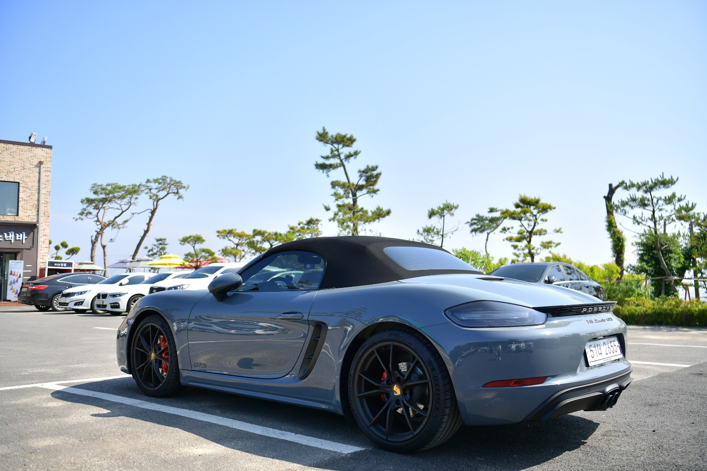

# 로드스터 vs GT 뭐가 더 나은 선택지?

로드스터와 GT는 모두 운전의 즐거움을 추구하는 자동차지만, 만들어진 목적은 분명하게 다르다. 많은 사람들이 오픈카면 모두 로드스터라고 생각하거나, 빠른 차는 모두 GT라고 생각하지만 실제 자동차 업계에서 두 용어는 서로 다른 철학을 의미한다. 특히 포르쉐 718 박스터 GTS 4.0처럼 두 성격이 일부 겹치는 모델은 더욱 헷갈리기 쉽다. 이 글에서는 로드스터와 GT의 차이, 각각의 특징, 그리고 718 박스터 GTS 4.0이 어떤 성격의 자동차인지 차근차근 알아본다.

## 핵심 요약

- 로드스터는 운전의 재미와 오픈 에어링을 우선하는 스포츠카다.
- GT는 장거리 고속 주행의 편안함과 여유를 추구하는 자동차다.
- 두 차종은 일부 성격이 겹치지만 개발 목적은 다르다.
- 718 박스터 GTS 4.0은 GT의 장점 일부를 갖고 있지만 본질은 스포츠카다.
- GT는 반드시 대형차나 럭셔리카를 의미하는 것은 아니다.
- 장거리 여행이라면 GT가, 와인딩과 드라이빙 재미라면 로드스터가 더 적합하다.

## 1. 로드스터(Roadster)란 무엇인가?

로드스터는 가장 순수한 운전의 즐거움을 목표로 만들어진 자동차다. 불필요한 요소를 최소화하고 운전자와 자동차가 하나처럼 움직이는 감각을 가장 중요하게 생각한다.

대표적인 특징은 다음과 같다.

- 2인승 중심의 구조
- 오픈톱 또는 컨버터블
- 가벼운 차체
- 민첩한 핸들링
- 높은 조향 반응성

특히 포르쉐 718 박스터처럼 미드십(MR) 구조를 사용하는 경우에는 무게 중심이 차체 중앙에 위치해 매우 뛰어난 코너링 성능을 보여준다.

로드스터는 빠른 속도보다 운전 자체를 즐기기 위한 자동차라고 이해하면 가장 쉽다.

## 2. GT(Grand Tourer)는 어떤 자동차인가?

GT는 Grand Tourer 또는 Grand Touring의 약자로, 장거리를 빠르고 편안하게 이동하기 위한 자동차를 의미한다.

여기서 중요한 것은 최고속도가 아니라 장시간 운전해도 피로하지 않은 성격이다.

대표적인 특징은 다음과 같다.

- 고속 안정성이 뛰어나다.
- 엔진 출력에 여유가 있다.
- 승차감이 비교적 부드럽다.
- 실내 정숙성이 우수하다.
- 여행을 위한 적재공간을 어느 정도 확보한다.

GT는 과거 유럽에서 국가 간 장거리 여행을 즐기던 문화에서 시작된 개념이다. 그래서 단순히 빠른 스포츠카가 아니라 편안함과 성능을 동시에 추구하는 자동차를 의미한다.

대표적인 GT 모델로는 다음과 같은 차량이 있다.

- 포르쉐 911 카레라
- 벤틀리 컨티넨탈 GT
- 마세라티 그란투리스모
- 메르세데스-벤츠 SL

물론 모든 GT가 같은 성격은 아니며, 스포츠 성향이 강한 GT와 럭셔리 성향이 강한 GT가 함께 존재한다.

## 3. 로드스터와 GT는 무엇이 다를까?

두 차종 모두 고성능 자동차지만 추구하는 방향은 상당히 다르다.

| 구분 | 로드스터 | GT |
|------|----------|------|
| 핵심 가치 | 운전 재미 | 장거리 주행 |
| 좌석 | 대부분 2인승 | 2인승 또는 2+2 |
| 승차감 | 단단한 편 | 비교적 편안함 |
| 조향감 | 매우 민첩함 | 안정적이고 여유로움 |
| 적재공간 | 제한적 | 비교적 넉넉 |
| 대표 이미지 | 스포츠카 | 그랜드 투어러 |

쉽게 비유하면 로드스터는 잘 갈린 메스처럼 예리하고, GT는 고속열차처럼 안정감 있게 목적지까지 이동하는 자동차다.

둘 다 빠르지만 운전자에게 전달하는 경험은 상당히 다르다.

## 4. 718 박스터 GTS 4.0은 어디에 속할까?

718 박스터 GTS 4.0은 로드스터와 GT의 경계선에 있는 자동차라고 볼 수 있다.

4.0리터 자연흡기 6기통 엔진은 저회전부터 고회전까지 매우 여유로운 출력을 제공한다. 고속도로에서도 엔진이 힘들어하는 느낌이 거의 없으며 장거리 주행 능력 역시 상당히 뛰어나다.

하지만 자동차의 기본 설계는 어디까지나 스포츠카다.

미드십 레이아웃과 짧은 휠베이스, 즉각적인 조향 반응은 GT보다 훨씬 날카롭다. 코너에서는 운전자의 의도를 그대로 따라가며, 작은 조향 입력에도 빠르게 반응한다.

즉 엔진은 GT처럼 여유롭지만, 차체와 섀시는 철저하게 스포츠카의 성격을 유지하고 있다.

## 5. 왜 718 GTS 4.0은 특별한 평가를 받을까?

718 GTS 4.0이 높은 평가를 받는 이유는 두 가지 장점을 동시에 어느 정도 갖추고 있기 때문이다.

### 스포츠카의 장점

- 미드십 특유의 뛰어난 밸런스
- 높은 코너링 성능
- 즉각적인 조향 반응
- 자연흡기 엔진의 뛰어난 응답성

### GT의 장점

- 장거리에서도 부족하지 않은 출력
- 뛰어난 고속 안정성
- 비교적 우수한 정숙성
- 일상 주행도 가능한 완성도

이처럼 극단적인 스포츠카처럼 불편하지도 않고, 그렇다고 GT처럼 무거운 성격도 아니다.

바로 이 균형감이 718 GTS 4.0만의 가장 큰 매력이다.

## 6. 어떤 사람이 로드스터를 선택하면 좋을까?

로드스터는 다음과 같은 운전자에게 잘 맞는다.

- 운전 자체를 즐긴다.
- 와인딩 로드를 자주 달린다.
- 오픈 에어링을 좋아한다.
- 핸들링을 가장 중요하게 생각한다.
- 혼자 또는 둘이 타는 경우가 많다.

반대로 장거리 여행과 실용성을 우선한다면 GT가 더 만족도가 높을 가능성이 크다.

## 7. 결론

로드스터와 GT는 모두 고성능 자동차지만 목표는 다르다. 로드스터는 운전자와 자동차가 하나가 되는 순수한 드라이빙 경험을 제공하고, GT는 빠르면서도 편안하게 먼 거리를 이동하는 능력을 추구한다.

718 박스터 GTS 4.0은 두 성격이 일부 공존하는 보기 드문 모델이다. 충분한 출력과 뛰어난 고속 안정성 덕분에 GT의 장점을 어느 정도 경험할 수 있지만, 미드십 섀시와 예리한 핸들링은 여전히 정통 스포츠 로드스터의 본질을 유지한다.

결국 어떤 자동차가 더 좋은지는 성능보다 운전자가 무엇을 원하는지에 달려 있다. 코너를 공략하는 즐거움이 우선이라면 로드스터가, 긴 여행을 여유롭게 즐기고 싶다면 GT가 더 만족스러운 선택이 될 것이다.

## 8. 자주 묻는 질문(FAQ)

### 로드스터와 컨버터블은 같은 의미인가?

아니다. 컨버터블은 지붕이 열리는 자동차를 의미하는 넓은 개념이다. 로드스터는 일반적으로 2인승 중심의 스포츠 성향 오픈카를 의미한다.

### GT는 스포츠카가 아닌가?

아니다. GT 역시 스포츠카의 한 종류다. 다만 최고 성능보다 장거리 주행 능력과 편안함에 조금 더 비중을 둔다.

### 718 박스터 GTS 4.0은 GT카인가?

GT의 장점을 일부 갖고 있지만 기본 철학은 정통 스포츠 로드스터에 가깝다.

### GT카는 모두 앞엔진(FR)인가?

아니다. 전통적으로 FR이 많지만 RR이나 MR 등 다양한 레이아웃을 사용하는 GT도 존재한다.

### 장거리 여행에는 어떤 차가 더 적합한가?

대체로 GT가 더 유리하다. 승차감과 적재공간, 정숙성에서 장점이 있기 때문이다.