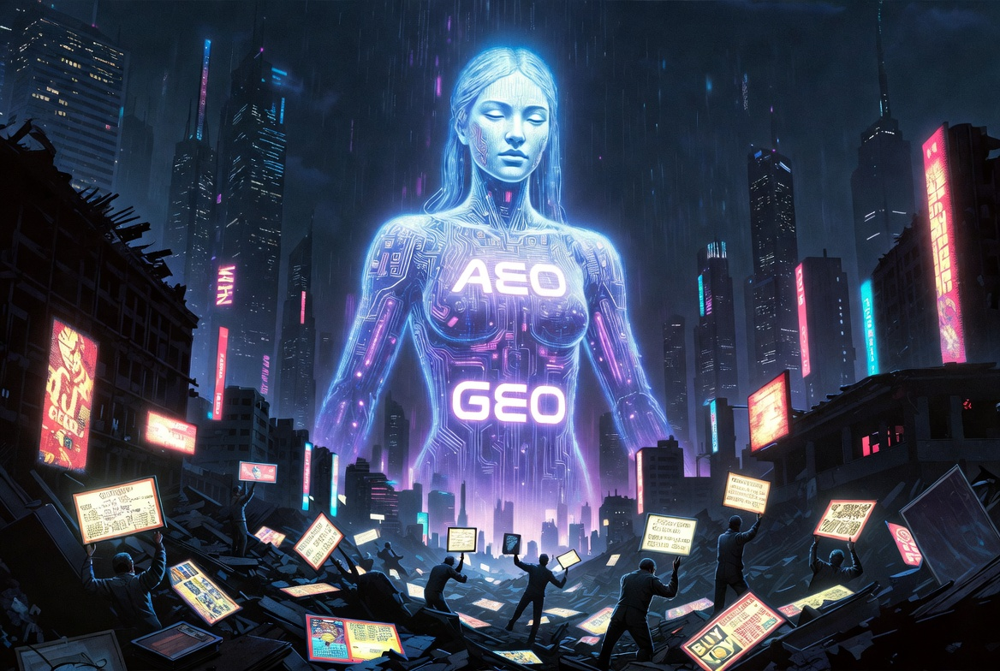

# AI가 지배하는 AEO·GEO 시대, 쓰레기 광고쟁이들의 몰락과 두괄식 생존 전략

돈에 눈이 멀어 웹 생태계를 쓰레기통으로 만든 저급한 광고쟁이들과 마케팅 대행사의 시대는 끝났다. SEO를 넘어 구글 AI 오버뷰와 네이버 하이퍼클로바가 지배하는 AEO·GEO 환경에서, 무의미해진 블로그 지수를 버리고 오직 진짜 글쟁이들만 살아남는 냉혹한 3단계 두괄식 생존 법칙을 폭로한다.

---

## 📌 핵·이·상 요약

*   **핵심 결론:** 기존의 단순 검색 최적화(SEO) 시장이 완전히 종말을 고하고, AI 엔진이 정답을 직접 도출하는 **AEO(답변 엔진 최적화)와 GEO(생성형 엔진 최적화)** 시대가 개막함에 따라 글 상단에 결론을 칼같이 때려 박는 **3단계 두괄식 구조**만이 유일한 생존 표준이 되었다.
*   **이유와 근거:** 구글의 AI 오버뷰와 네이버의 하이퍼클로바 시스템은 인간의 잔꾀를 비웃듯 문서를 초고속으로 청크(Chunk) 단위로 쪼개어 분석한다. 오직 상위 노출만을 노리고 영혼 없이 미괄식으로 기어 들어오는 저급한 광고쟁이들의 쓰레기 포스팅은 AI 필터링망에 걸려 철저히 스팸으로 매장되기 때문이다.
*   **상세 맥락:** 가짜 트래픽과 지수 사기극으로 연명하던 기생충 같은 대행사들의 몰락은 이미 확정되었다. 수많은 유저가 광고판이 된 블로그를 떠나 인스타그램, 유튜브 쇼츠, 다음 브런치로 이탈한 잔혹한 폐허 속에서, 역설적으로 꼼수가 아닌 진짜 글쓰기를 사랑하는 진정한 창작자들만이 AI의 선택을 받아 정화된 신생태계의 최상위 포식자로 군림하게 될 것이다.

---

## 1. SEO의 종말, AI 검색 엔진이 주도하는 냉혹한 판도 변화 (AEO & GEO)

우리가 지난 십수 년간 맹신하고 매달렸던 **SEO(검색엔진 최적화)**의 시대는 완전히 종말을 고했다. 이제 웹 검색 시장의 패러다임은 **AEO(Answer Engine Optimization, 답변 엔진 최적화)**를 넘어 생성형 인공지능이 결과물을 재구성하는 **GEO(Generative Engine Optimization, 생성형 엔진 최적화)**로 초고속 축 이동을 완료했다.

세계 검색 시장을 쥐고 흔드는 구글은 이미 검색 결과창 최상단에 AI 오버뷰(AI Overviews)를 전면 배치했다. 유저가 링크를 클릭해 들어오기도 전에 검색 의도를 완벽히 파악하여 단 몇 줄로 정답을 브리핑해 주는 방식이다. 토종 플랫폼인 네이버 역시 거대 언어 모델(LLM)인 초대규모 AI '하이퍼클로바(HyperCLOVA)' 체제를 전격 도입하며 검색 생태계의 판을 완전히 갈아엎었다. 

이제 AI 검색 로봇은 웹페이지를 한 줄 한 줄 한가롭게 정독하지 않는다. 이 영악한 기계들은 제목별로 문서를 칼같이 쪼개어 청크(Chunk) 단위로 인식하며, 사용자의 질문(Query)에 대한 가장 명확하고 구조적인 '즉각적인 정답'이 문서 상단에 배치되어 있는지만을 번개 같은 속도로 판별한다. 서론에서 "안녕하세요, 오늘 날씨가 참 좋네요" 따위의 쓸데없는 잡담이나 늘어놓으며 결론을 뒤로 미루는 글들은 AI에게 '전문성 없는 쓰레기 문서'로 분류되어 빛의 속도로 검색 누락의 무덤으로 처박힌다.

---

## 2. 기생충 같은 광고쟁이들의 업보와 네이버 블로그의 파산

현재 국내 블로그 생태계가 인공호흡기를 달아도 모자랄 수준으로 완전히 망가진 배경에는, 오직 돈만 벌겠다는 일념 하나로 웹 환경을 오염시켜 온 저급한 광고쟁이들과 바이럴 마케팅 대행사들의 업보가 있다.  
이 쓰레기 같은 인간들은 순수한 정보성 콘텐츠를 말살시키고, 알맹이 없는 키워드 도배, 허위 정보 낚시, 기계적인 영혼 없는 협찬 리뷰를 공장식으로 찍어내며 플랫폼의 신뢰도를 바닥으로 내팽개쳤다. 

소비 중심의 저급한 어뷰징에 지친 유저들은 더 이상 블로그의 검색 결과를 믿지 않는다. 날것의 정보와 즉각적인 재미를 찾아 인스타그램이나 유튜브 쇼츠, 틱톡 같은 숏폼 플랫폼으로 대거 탈출하는 사태가 벌어졌다. 

현재 네이버 블로그 생태계에 잔존하는 기형적인 인구 비율을 냉정하게 해부해 보면 그 처참함이 적나라하게 드러난다.

*   **상위 노출에 목숨 걸고 쓰레기를 양산하는 순수 광고쟁이:** **50%**
*   **매크로와 알바를 동원해 기계적으로 공장을 돌리는 대행사 업자:** **30%**
*   **보상 없이 단순 일상만 끄적이는 라이트 유저:** **10%**
*   **자신의 전문 지식을 나누는 진짜 블로거:** **10%**

결국 진심으로 글쓰기를 좋아하고 양질의 지식을 나누던 진짜 전문 블로거들의 상당수는 텍스트의 가치를 온전히 인정받을 수 있는 '다음 브런치'나 개인 독립형 블로그(Hugo 등)로 대거 망명을 선택했다.  

네이버 블로그에 남아서 제대로 된 정보의 맥을 이어가는 순수 유저는 **20% 남짓**에 불과하다. 네이버가 뒤늦게 유저 이탈을 막으려 인플루언서 제도를 급조하고 돈을 풀며 심폐소생술을 시도하고 있지만, 이미 신뢰 자본이 파산해 버린 플랫폼의 가치를 되돌리기엔 역부족인 상태다.

---

## 3. 무력화된 C-랭크와 지수 사기극, 어뷰징 사기꾼들의 확정된 몰락

과거 저급한 대행사 놈들은 네이버의 C-Rank(Creator Rank)나 다이아(D.I.A.) 알고리즘의 맹점을 교묘하게 파고들었다. 그들은 '최적화 블로그 지수'라는 정체불명의 숫자를 만들어내어 아이디를 수백만 원에 사고팔고, 프로그램으로 비정상적인 유령 트래픽을 밀어 넣으며 상위 노출을 독점하는 사기극을 벌여왔다. 네이버 역시 이러한 어뷰징 시스템을 완벽하게 차단하지 못하고 방관하거나 휘둘리는 등 오랜 기간 비정상적이고 기형적인 운영을 지속해 왔다.

하지만 고도화된 AI 검색 엔진이 생태계의 포식자로 등장한 지금, **기존의 블로그 지수나 C-랭크 따위의 야바위 짓은 완전히 무력화**되었다. 

새로운 시대의 AI는 대행사 업자들이 조작해 놓은 인위적인 블로그의 '과거 지수'를 신뢰하지 않는다. 오직 '지금 당장 유저가 던진 질문에 대해, 이 포스팅이 얼마나 구조적인 정답과 데이터 논리를 갖추고 있는가'라는 본질적인 콘텐츠 스펙 하나만 보고 칼같이 도려낸다. 아무리 비싼 돈을 주고 산 최적화 블로그라 할지라도 서론이 길고 꼼수로 가득 찬 미괄식 쓰레기 글이라면 AI는 이를 철저히 무시하고 배제한다. 오직 기술적 허점을 노려 연명하던 사기꾼 광고 업자들의 몰락은 이제 거스를 수 없는 확정된 미래다.

---

## 4. 미괄식 무덤을 탈출해라: 살아남기 위한 3단계 두괄식 무장 법칙

대다수의 한국인은 학창 시절부터 기승전결의 노예가 되어 **'미괄식 글쓰기'**에 중독되어 있다. 감정적인 빌드업을 장황하게 늘어놓은 후, 맨 마지막 결론에 이르러서야 진짜 하고 싶은 말을 꺼내는 방식이다. 감성을 자극하는 소설이나 수필이라면 모를까, 정보 전달과 생존이 목적인 웹 글쓰기에서 이러한 미괄식 서사는 곧 디지털 자살 행위와 다름없다. 유저는 3초 안에 원하는 답이 안 나오면 즉시 이탈하고, AI 스크랩 봇은 결론이 하단에 숨겨진 문서를 가치 없는 데이터로 간주하기 때문이다. 우리는 철저하게 **'3단계 두괄식 구조'**라는 차가운 숫자의 설계도로 무장해야만 한다.

### 🧱 웹 생태계에서 포식자로 살아남는 3단계 입체 구조

*   **1단계 [간판 & 직구]: 질문형 타이틀(H1) + 디스크립션 문장(p태그)**
    *   제목은 철저하게 유저의 구체적인 검색 의도를 저격하는 '질문형 H1 태그'로 뽑아야 한다. 그리고 그 바로 밑에 80~150자 내외로 이 글의 최종 결론을 단 한 문단(디스크립션)으로 때려 박아라. AI 답변 엔진은 이 부분을 가장 먼저 긁어가 유저 브리핑 창에 인용구로 띄운다. 첫 펀치에서 정답을 보여주지 못하면 무조건 탈락이다.
*   **2단계 [설계도]: 핵·이·상 요약 박스 (H2)**
    *   직구 답변과 이미지 바로 밑에는 글 전체의 설계도인 요약 박스를 배치한다. **핵(핵심 결론 1줄), 이(이유와 근거 2~3줄), 상(상세 맥락 및 예시)**을 마크다운 불릿 포인트로 깔끔하게 정렬해라. 본문을 정독하기 전 독자의 뇌리에 3초 만에 숲을 꽂아 넣는 강력한 장치다.
*   **3단계 [증명]: 세부 상세 항목 및 데이터 정렬 (H2)**
    *   상단 요약에서 제시한 근거들을 완벽하게 증명하는 본 전시정이다. 이때 평평한 텍스트만 늘어놓으면 탈락이다. AI 엔진은 환각 현상(Hallucination)을 방지하기 위해 구조화된 **'마크다운 표(Table)'**나 **'번호가 매겨진 리스트(Ordered List)'**, 그리고 **'Q&A(FAQ) 구조'**를 인용할 때 압도적인 가산점을 부여한다. 기계가 가장 파싱하기 좋은 형태로 데이터를 요리해 줘야만 한다.

이 법칙을 비웃고 과거의 저급한 키워드 반복이나 감상적 미괄식 늪에 머무는 자들은 인공지능의 시대에 단 한 줄도 노출되지 못하고 시스템적으로 완전히 매장당할 것이다. 이 3단계 두괄식 프레임워크를 장착하는 것만이 다가오는 거대한 AI 파도 속에서 살아남아 상위를 독점할 수 있는 유일한 생존 서류다.

---

## 5. 결론: 쓰레기들의 대멸종, 진짜 글쟁이들만의 위대한 승리와 건강한 생태계

그동안 국내 블로그 생태계는 지독할 정도로 비정상적이었고, 역겨울 정도로 저급했다. 아무런 가치도 없는 쓰레기 글들이 꼼수 알고리즘과 대행사의 물량 공세를 타고 상단을 차지하는 동안, 진짜 피와 살이 되는 지식을 나누는 전문가와 글쟁이들은 바닥에 파묻혀 숨을 죽여야 했다. 돈만 밝히는 사기꾼들의 폭주는 정상적인 창작자들의 의욕을 완전히 짓밟아 놓았다.

하지만 역설적이게도, 눈부시게 발전한 AI 검색 기술은 이 기형적이고 썩어버린 생태계를 가장 잔혹하고 완벽하게 **정상화**시키고 있다. 

꼼수 트래픽과 지수 장사로 생태계를 흐리던 저급한 인간들과 그들의 공장은 AI의 철저한 청소 레이더에 걸려 흔적도 없이 박멸될 것이다. 변화를 거부하고 과거의 미괄식 무덤 속에서 허우적대는 자들 역시 자연스럽게 도태의 길을 걷게 된다. 

결국 이 피비린내 나는 알고리즘 대전쟁의 끝에 살아남는 사람은 껍데기만 화려한 사기꾼들이 아니다. **AI의 구조적 메커니즘을 완벽히 이해하고 활용하면서, 동시에 진정으로 글쓰기를 좋아하고 독자에게 가치 있는 알맹이를 선물할 줄 아는 진짜 글쟁이들**만 남게 된다. 

돈독 오른 기생충들이 무너진 자리에 오직 진정성과 차가운 논리로 무장한 인간 고수들의 맑은 콘텐츠가 채워지는 것, 그것이 바로 우리가 마주하게 될 가장 아름답고 건강한 차세대 블로그 생태계의 미래일것이다.