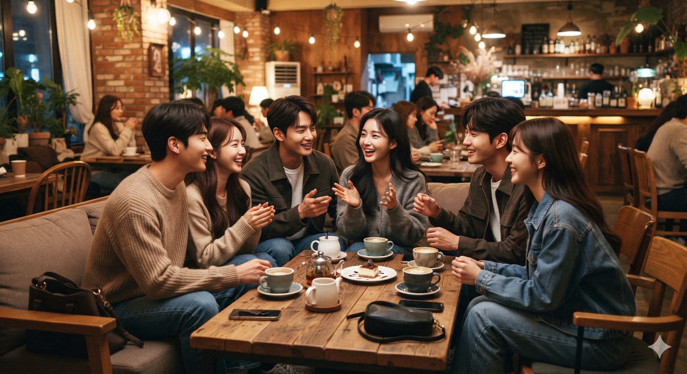

# 그 시절 연애가 낭만적이었던 이유와 사라진 만남의 방식

2000년대 연애는 우연과 대화 속에서 관계가 만들어졌고, 지금과 다른 만남의 과정 자체가 낭만으로 기억되는 이유를 이야기한다. 지금보다 불편한 시대였지만, 사람과 사람이 가까워지는 과정에는 예상하지 못한 설렘과 몰입이 있었다.

물론 그 시절이 모든 면에서 더 좋았다고 말할 수는 없어. 기술은 부족했고 연락 방식도 불편했으며, 지금처럼 다양한 선택지를 제공하는 시스템도 없었어. 하지만 한 가지 분명한 것은 있어. 당시에는 누군가를 알아가는 과정 자체가 하나의 경험이었다는 점이야.

지금은 사람을 만나기 전에 많은 것을 알 수 있어. 사진을 보고, SNS를 확인하고, 취향과 생활 방식을 어느 정도 예상한 뒤 관계를 시작해. 하지만 예전에는 아무것도 모르는 상태에서 한 사람을 알아가는 시간이 필요했어.

그리고 그 시간이 사람을 특별하게 만들었어.

## 1. 컴퓨터 한 대로 시작되던 새로운 인연

지금 세대에게는 이해하기 어려울 수도 있지만, 2000년대 초반 컴퓨터는 단순한 기계가 아니었어.

컴퓨터를 켜고 인터넷에 접속하는 순간, 현실과는 다른 새로운 공간이 열렸어.

세이클럽, 드림위즈 지니, MSN 같은 메신저에는 수많은 사람들이 있었고, 그 안에서는 누구나 새로운 사람과 대화를 시작할 수 있었어.

당시에는 지금처럼 상대방의 정보를 미리 확인할 방법이 많지 않았어.

인스타그램 프로필을 보고 어떤 사람인지 판단할 수도 없었고, 사진 몇 장으로 상대를 평가할 수도 없었어.

그저 닉네임 하나, 말투 하나, 대화 내용 하나가 그 사람을 판단하는 기준이었어.

처음에는 별것 아닌 이야기로 시작했어.

좋아하는 음악, 영화, 게임, 학교 이야기, 일상 이야기.

하지만 매일 대화를 나누다 보면 어느 순간 상대는 단순한 온라인 속 사람이 아니라 내 일상을 차지하는 사람이 되었어.

밤늦게까지 이어지는 대화, 상대가 접속했는지 확인하는 순간, 답장이 오기를 기다리는 시간.

지금 생각하면 비효율적인 과정이었지만, 바로 그 비효율 속에 감정이 자라고 있었어.

## 2. 그 시절에는 만남의 시작점이 많았다

요즘은 누군가를 만나려면 먼저 목적을 정해야 하는 경우가 많아.

연애를 위한 만남인지, 취미를 위한 만남인지, 소개를 통한 만남인지 구분하고 시작하는 경우가 많지.

하지만 예전에는 사람을 만나는 과정이 지금보다 훨씬 자연스러웠어.

길을 걷다가 마음에 드는 사람에게 말을 걸기도 했고, 친구를 따라간 자리에서 새로운 사람을 만나기도 했어.

특별한 계획 없이도 관계가 시작될 수 있었어.

그때는 카카오톡 같은 모바일 메신저가 없었기 때문에 연락 방식도 지금과 달랐어.

문자를 보내고 답장을 기다렸고, 전화 통화를 하면서 하루 이야기를 나눴어.

짧은 메시지 하나에도 의미가 있었고, 전화 한 통을 하기 위해 고민하는 순간도 있었어.

지금처럼 언제든 연결되어 있는 시대와 달리, 연락 자체가 하나의 사건처럼 느껴졌어.

그래서 상대가 연락을 기다리는 시간이 있었고, 그 기다림이 설렘으로 이어지기도 했어.

## 3. 밖으로 나가야 사람을 만났던 시대

2000년대에는 사람들이 머무는 공간이 분명했어.

집에서 게임을 하다가 친구를 만나러 나가면 PC방이나 만화방 같은 장소가 있었고, 친구들과 자주 모이는 아지트가 있었어.

저녁이 되면 자연스럽게 번화가로 이동했고, 사람들은 거리로 나왔어.

당시 인기 있는 거리와 술집은 항상 사람으로 가득했어.

친구들과 여러 장소를 돌아다니며 자리를 찾기도 했고, 우연히 다른 사람들과 어울리는 일도 흔했어.

지금처럼 집에서 배달 음식을 시키고, 각자 화면을 보며 시간을 보내는 문화와는 달랐어.

사람들은 직접 만나야 했고, 만나기 위해 움직였어.

그 과정에서 새로운 관계가 만들어졌어.

물론 지금의 생활 방식이 잘못된 것은 아니야.

온라인으로 연결되는 시대는 분명 편리하고, 과거보다 많은 기회를 제공해.

하지만 사람과 사람이 우연히 만나고 가까워지는 과정만 놓고 보면, 과거에는 지금보다 훨씬 많은 공간과 기회가 존재했어.

그 시절의 낭만은 특별한 이벤트에서 나온 것이 아니었어.

사람을 만날 기회가 많았고, 관계가 자연스럽게 발전할 시간이 있었기 때문에 만들어진 것이었어.

## 4. 썸보다 가까웠던 관계의 시대

지금은 연애를 시작하기 전 단계가 길어졌어.

서로 관심이 있는 것 같지만 확실하게 표현하지 않는 관계, 흔히 말하는 **썸**이라는 단계가 중요한 과정이 되었어. 상대를 알아가는 시간이라는 점에서는 긍정적인 면도 있지만, 때로는 관계를 시작하기 전부터 너무 많은 고민과 계산이 들어가기도 해.

하지만 2000년대에는 지금과 같은 애매한 관계가 오래 지속되는 경우가 많지 않았어.

물론 그때도 서로를 알아가는 시간은 있었어. 하지만 마음이 맞으면 자연스럽게 연락이 늘어나고, 자주 만나고, 주변 사람들도 그 관계를 알게 되었어.

매일 연락하는 사이가 되고, 친구들에게 소개하고, 함께 시간을 보내면서 관계가 발전했어.

연애라는 것은 거창한 선언보다 일상의 변화로 시작되는 경우가 많았어.

같이 밥을 먹고, 술을 마시고, 여행 계획을 세우고, 친구들과 함께 어울리는 과정 속에서 자연스럽게 연인이 되어갔어.

그 시절에는 연애가 개인과 개인만의 관계가 아니었어.

친구들에게 교제 사실을 알리고, 함께 축하하고, 100일 같은 기념일을 챙기는 문화도 자연스러웠어.

파티룸이 유행했던 것도 그런 문화와 연결되어 있었어.

누군가와 사귀는 것은 숨겨야 하는 일이 아니라 주변 사람들과 함께 공유하는 하나의 사건에 가까웠어.

친구들과 함께 펜션 여행을 가고, 모임 안에서 커플이 생기고, 또 다른 사람들과 함께 시간을 보내는 문화가 있었어.

연애는 스마트폰 화면 안에서 진행되는 것이 아니라 실제 생활 속에 존재했어.

## 5. 직관적인 매력이 통했던 시대

과거의 만남은 지금보다 훨씬 직접적이었어.

상대의 조건을 먼저 확인하는 것이 아니라, 실제로 만나서 느껴지는 분위기가 중요했어.

말투, 표정, 목소리, 대화 방식, 사람을 대하는 태도.

이런 요소들이 그 사람의 매력을 결정했어.

지금은 사진과 프로필, SNS를 통해 상대를 먼저 판단하는 경우가 많아.

어떤 일을 하는지, 어떤 취미가 있는지, 어떤 생활을 하는지 어느 정도 확인한 뒤 만나.

물론 이런 방식은 불필요한 시행착오를 줄여줘.

하지만 동시에 예상하지 못한 매력을 발견할 기회도 줄어들었어.

사람의 매력은 정보로 완전히 설명되지 않아.

처음에는 평범해 보였던 사람이 대화를 나누면서 점점 매력적으로 느껴지는 경우도 있어.

반대로 조건이 좋아 보여도 직접 만나면 맞지 않는 경우도 있어.

과거에는 이런 발견의 과정이 자연스럽게 이루어졌어.

누군가를 만나고, 이야기를 나누고, 함께 시간을 보내면서 그 사람만의 매력을 알아가는 것.

나는 그 과정이 연애에서 가장 중요한 부분이었다고 생각해.

## 6. 나이트클럽과 거리의 만남 문화가 존재했던 시대

2000년대에는 지금과 다른 유흥 문화가 있었어.

나이트클럽의 부킹은 당시에는 자연스러운 만남 방식 중 하나였어.

물론 모든 사람이 그런 문화를 좋아했던 것은 아니고, 그 안에서도 다양한 경험과 문제가 존재했어.

하지만 적어도 새로운 사람을 만나는 것 자체에 대한 사회적 거부감은 지금보다 낮았어.

사람들은 직접 다가갔고, 대화를 시도했고, 상대의 반응을 현장에서 확인했어.

지금처럼 SNS 메시지를 보내고 상대가 어떤 사람인지 오랫동안 관찰하는 방식과는 달랐어.

당시에는 마음에 들면 직접 표현하는 문화가 있었어.

좋으면 좋다고 말하고, 만나고 싶으면 만나자고 하는 것이 지금보다 자연스러웠어.

물론 현재의 조심스러운 문화가 만들어진 이유도 있어.

개인의 경계와 안전에 대한 인식이 높아졌고, 서로를 존중하는 방식도 변화했어.

하지만 그 변화와 별개로, 직접 부딪히며 관계를 만들어가는 경험이 줄어든 것은 사실이야.

## 7. 기다림이 있었기에 설렘도 있었다

과거 연애에서 중요한 것은 기다림이었어.

연락을 기다리고, 만날 날을 기다리고, 다음 만남을 기대했어.

지금은 언제든 연락할 수 있지만, 오히려 그만큼 특별함이 줄어들기도 해.

항상 연결되어 있다는 것은 항상 가까운 것을 의미하지 않아.

오히려 쉽게 연결되는 만큼 관계에 집중하는 시간이 줄어들 수 있어.

예전에는 한 사람과 대화를 나누기 위해 컴퓨터 앞에 앉았고, 전화기를 붙잡고 이야기를 나눴어.

그 시간 동안 다른 선택지는 없었어.

그 사람에게 집중하는 시간이 자연스럽게 만들어졌어.

반면 지금은 수많은 정보와 사람들이 동시에 존재해.

누군가와 대화하면서도 다른 사람의 게시물을 보고, 더 나은 선택지가 있는지 생각하게 돼.

선택의 폭은 넓어졌지만, 한 사람에게 몰입하는 경험은 줄어들었어.

그 시절의 낭만은 기술이 부족해서 생긴 것이 아니야.

오히려 기술이 부족했기 때문에 한 사람에게 집중할 수 있었고, 그 과정에서 관계가 깊어졌던 거야.

## 8. 왜 지금의 연애는 과거보다 삭막하게 느껴질까?

요즘 연애가 과거보다 재미없게 느껴지는 이유는 단순히 젊은 세대가 달라졌기 때문은 아니야.

사람의 감정은 크게 변하지 않았어. 누군가에게 호감을 느끼고, 가까워지고 싶어 하는 마음은 예나 지금이나 같아.

다만 관계를 시작하는 환경이 완전히 달라졌어.

과거에는 만나고 대화하면서 상대를 알아갔어.

세이클럽, 지니, MSN 같은 PC 기반 소통에서는 닉네임과 대화만으로 관계가 시작되는 경우가 많았어. 상대의 직업, 외모, 생활 수준을 미리 검증하기보다 대화를 통해 호감이 만들어졌고, 직접 만나면서 새로운 모습을 발견하는 과정이 중요했어.

하지만 지금은 만나기 전에 많은 것을 판단해야 해.

인스타그램 사진, 직업, 거주 지역, 취향, 생활 방식까지 다양한 정보를 먼저 확인하고 나와 맞는 사람인지 검토해.

실패를 줄이는 방식이지만, 동시에 관계가 시작되기 전에 이미 많은 판단이 끝나버리는 구조가 되었어.

예전에는 만나면서 생기는 설렘이 있었다면, 지금은 확인 후 시작하는 관계가 많아졌어.

그래서 예상하지 못한 반전이나 우연한 매력을 발견하는 순간이 줄어들었어.

물론 현재 방식이 틀렸다고 말할 수는 없어.

과거에는 알 수 없었던 위험을 줄이고, 더 신중한 관계를 만들 수 있다는 장점도 있어.

하지만 관계라는 것은 원래 어느 정도의 불확실성을 포함하고 있어.

과거에는 상대가 어떤 사람인지 모르는 상태에서 시작했기 때문에 예상하지 못한 매력을 발견하는 순간이 있었어. 첫인상과 실제 모습이 달랐고, 대화를 나누면서 생각보다 잘 맞는 사람이라는 것을 알아가는 과정 자체가 설렘이 되었어.

모든 것을 확인하고 시작하는 관계보다, 서로를 알아가는 과정에서 만들어지는 관계도 존재해.

## 9. 경험하지 않으면 알 수 없는 것들이 있다

젊은 시절의 연애는 단순히 누군가를 만나는 일이 아니야.

사람을 이해하는 방법을 배우고, 자신의 감정을 알아가는 과정이기도 해.

누군가에게 호감을 표현하는 방법, 관계를 유지하는 방법, 갈등을 해결하는 방법, 이별 이후 다시 일어나는 방법까지 대부분의 관계 경험은 실제 만남 속에서 배워.

연애는 정답을 찾아 시작하는 것이 아니라, 경험하면서 자신만의 기준을 만들어가는 과정이기도 해.

좋아하는 사람이 생기고, 잘 맞지 않는 부분을 발견하고, 갈등을 해결하고, 때로는 헤어지는 경험까지 모두 성장의 일부야.

하지만 지금은 관계를 시작하기 전에 실패하지 않는 방법부터 찾는 경우가 많아.

상처받지 않기 위해 조심하고, 시간을 낭비하지 않기 위해 계산하고, 확실한 결과가 예상될 때 움직이려고 해.

물론 이런 태도는 현실적인 선택이야.

하지만 너무 많은 조건을 확인하다 보면 정작 관계를 통해 배울 기회를 잃을 수도 있어.

사람은 완벽한 선택을 통해 관계를 배우는 것이 아니야.

실제 경험 속에서 상대를 이해하고, 자신이 어떤 사람인지 알아가는 과정에서 성장해.

그 시절 많은 사람들이 다양한 사람을 만나고 관계를 경험했던 이유도 여기에 있어.

좋은 경험만 있었던 것은 아니지만, 그 과정 자체가 삶의 일부가 되었어.

## 10. 낭만은 시대가 아니라 관계를 대하는 방식에서 나온다

2000년대 연애가 낭만적으로 기억되는 이유는 그 시대가 완벽했기 때문이 아니야.

그때는 사람들이 지금보다 더 많은 시간을 들여 서로를 알아갔기 때문이야.

컴퓨터 앞에서 밤늦게까지 대화를 나누고, 문자 하나를 기다리고, 직접 만나서 시간을 보내던 과정.

지금 보면 느리고 비효율적인 방식이었지만, 그 안에는 사람이 중심에 있었어.

기술은 계속 발전하고 있어.

앞으로는 더 편리한 만남 방식이 등장할 것이고, 사람들은 더 효율적으로 관계를 만들어갈 거야.

하지만 아무리 기술이 발전해도 변하지 않는 부분이 있어.

사람은 결국 누군가와 시간을 보내고, 서로의 모습을 확인하고, 함께 경험을 쌓으면서 가까워져.

낭만은 특별한 시대에만 존재하는 것이 아니야.

상대를 하나의 조건표가 아니라 한 사람으로 바라볼 때 만들어지는 것이야.

## 결론

그 시절 연애가 특별했던 이유는 사람들이 지금보다 더 용감하거나 더 순수했기 때문이 아니야.

**데이팅 앱도, SNS 검증도, 복잡한 관계 전략도 없던 시대** 였기에 사람과 사람이 직접 부딪히며 관계를 만들어가는 과정 자체가 자연스러웠기 때문이야.

모르는 사람과 대화를 시작하고, 시간을 보내며 서로를 알아가고, 관계가 깊어지는 과정에는 예상할 수 없는 순간들이 있었어.

물론 지금의 방식에도 장점은 있어.

더 많은 정보를 얻을 수 있고, 자신에게 맞는 사람을 찾는 과정도 효율적으로 변했어.

하지만 효율성이 항상 더 좋은 관계를 의미하지는 않아.

사람 사이의 감정은 계산만으로 만들어지지 않기 때문이야.

젊은 시절 다양한 사람을 만나고 경험하는 것은 단순히 연애 횟수를 늘리는 문제가 아니야.

사람을 이해하고, 자신을 이해하는 과정이야.

완벽한 상대를 찾기 위해 기다리는 것보다, 누군가를 만나면서 함께 만들어가는 경험이 필요할 때도 있어.

결국 과거의 낭만이 사라진 것이 아니라, 낭만이 만들어지는 방식이 변한 것이야.

하지만 사람 사이의 설렘, 우연한 만남, 함께 쌓아가는 시간의 가치는 여전히 변하지 않아.