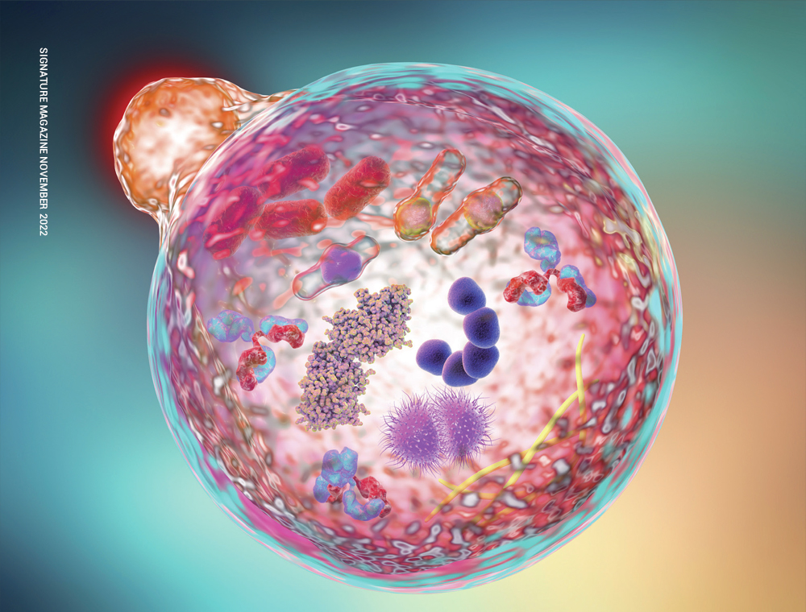

# 16:8 오토파지 단식으로 만성 염증성 통증과 당뇨를 극복하는 방법

무너진 대사 시스템을 정상화하고 만성 통증과 당뇨를 극복하기 위한 세포 정화 프로토콜이다. 외부 치료 대신 체내 화학적 염증 환경을 개선하는 생물학적 구조를 설명한다.

## 핵심 요약

* **오토파지**는 세포 내 노폐물을 분해·재활용하는 세포 자정 작용이다.
* 결핍 상태 유지가 세포 내 분해 공장인 리소좀을 활성화한다.
* 만성 근막 통증은 야식과 정제당이 유발한 프로염증성 사이토카인 축적이 원인이다.
* 단식 12시간 이후 **4시간**은 내장지방 연소와 노폐물 소각의 황금기다.
* 식사 순서법과 정제당 차단은 혈당 스파이크를 막는 방어벽이다.
* 식후 틈새 푸쉬업은 포도당을 근육 연료로 강제 전환시킨다.

## 1. 오토파지란 무엇이며, 암을 어떻게 예방하나요?

* 세포가 쌓인 노폐물이나 손상된 소기관을 분해해 에너지원으로 재활용하는 기전이다.
* 체내 결핍 상태가 되면 쓰레기 탐지, 주머니 형성, 용해 및 소각, 에너지 재활용 순의 **4단계 구조**로 작동한다.
* 방치된 세포 쓰레기는 DNA 변형을 일으켜 암세포의 씨앗이 된다.
* 오토파지는 돌연변이 단백질 찌꺼기를 선제 소각해 중증 질환을 차단하는 **암 예방 방어벽** 역할을 한다.

## 2. 야식과 간식이 유발하는 만성 근막 통증의 실체

* 야식과 정제 탄수화물 섭취는 인슐린을 과다 분비시켜 프로염증성 사이토카인을 대량 방출한다.
* 이때 형성된 독성 물질인 최종당화산물(AGEs)이 목과 어깨의 **근막 조직**에 들러붙어 조직을 굳히고 만성 통증을 유발한다.
* 외부 물리 치료가 소용없는 이유는 염증이 쏟아지는 내부 환경이 그대로이기 때문이다.
* 오토파지는 최종당화산물을 분해해 근육의 탄성력을 회복시켜 통증을 근원적으로 해결한다.

## 3. 인슐린 감수성 부활을 통한 내장지방 대사의 정상화

* **인슐린 저항성**이 높아지면 포도당이 세포로 들어가지 못해 혈당이 폭발하는 당뇨병으로 진행된다.
* 염증이 가득한 몸은 비상사태로 인식하여 내장지방을 연소하지 않고 저장하려는 방어기제를 작동시킨다.
* 오토파지로 염증을 걷어내면 인슐린 수용체가 정상화되어 감수성이 향상된다.
* 대사가 정상화되면 꽁꽁 묶인 **내장지방**을 연소해 복부 둘레가 감소하는 필연적 결과에 도달한다.

## 4. 단식 12시간 이후 찾아오는 아침 4시간의 생물학적 가치

* 저녁 8시 종료 후 익일 낮 12시까지 공복을 유지하는 **16시간 공복** 프로토콜을 기반으로 한다.
* 단식 후 12시간이 지나면 인슐린이 바닥을 치며, 이후 점심까지의 4시간 동안 세포 청소와 내장지방 대사가 폭발한다.
* 아침 허기짐에 음식을 먹으면 인슐린이 분비되어 세포 청소 시스템이 즉시 중단된다.
* 숙면과 단식이 맞물리면 **성장호르몬** 분비와 오토파지 시너지로 밤사이 조직을 복구하고 장내 미생물 환경을 개선한다.

## 5. 혈당 방어벽을 구축하는 식사 순서법과 식단 통제 전략

* 식사 시 반드시 **[식이섬유/채소] → [단백질/지방] → [탄수화물]** 순서로 섭취해야 한다.
* 점심 때 삶은 계란 2~3개를 먼저 먹으면 위장관에 코팅막을 형성해 인슐린 쇼크를 원천 차단한다.
* 인슐린 저항성의 주범인 면, 떡, 빵, 액상과당 등 정제당을 전면 차단해야 한다.
* 외식 시 짜장면 대신 짜장밥이나 짬뽕밥을 선택해 면을 배제하고, 급할 때는 **한식형 편의점 도시락**을 선택하는 것이 대안이다.

## 6. 틈새 상체 자극 운동법과 오토파지 식습관·수면·식품 통합 가이드

* **식후 틈새 상체 근육 자극의 원리:**
  * 식후 졸음이 올 때 눕는 지방 저장 행위를 멈추고, 제자리 정자세 **푸쉬업 8개 내외** 또는 10분 산책을 실행한다.
  * 짧은 상체 자극은 포도당을 뱃살 대신 근육 연료로 강제 전환시키고 근막의 만성 염증 물질을 청소한다.
  * 음식을 멈추는 공복은 내장 기관에 완벽한 휴식을 주어 오토파지를 유도하고, 근육은 틈새 운동으로 자극해 순환시키는 **이원화 전략**을 쓴다.
* **정밀한 실전 식습관 패턴:**
  * **16시간 공복 유치:** 저녁 식사를 오후 8시에 최종 종료하고 익일 낮 12시에 첫 식사(점심)를 하는 대사 패턴을 철저히 엄수한다.
  * **식사 순서법의 기계적 적용:** 음식을 입에 넣을 때는 항상 **[식이섬유/채소] → [단백질/지방] → [탄수화물]** 구도를 지킨다.
  * **식전 위장 코팅 루틴:** 점심 식사 직전 삶은 계란 2~3개를 선제적으로 섭취하여 탄수화물의 흡수 속도를 완만하게 제어한다.
* **생체 리듬 기반 수면 패턴:**
  * **자정 전 숙면 진입:** 생체 시계를 정상화하기 위해 반드시 **자정(밤 12시) 전 수면** 패턴을 확립한다.
  * **수면-공복 동기화:** 수면 시간을 단식 공복 상태와 일치시켜 밤샘 소화 과정으로 인한 위장관 부담을 없앤다. 이를 통해 숙면 중 오토파지와 성장호르몬 분비의 시너지를 이끌어내어 장내 미생물 환경과 손상 조직을 복구한다.
* **효과적인 대사 추천 식품:**
  * **고품질 단백질류:** 공복기 근육 파괴를 막고 세포 수리를 돕기 위해 **삶은 계란**, **두부**, **생선**을 매끼 당 20~30g의 단백질 섭취 의무 배치한다.
  * **안전한 음료 및 수분:** 인슐린을 자극하지 않고 자가포식을 촉진하는 **순수한 블랙커피(아메리카노)** 및 기상 직후 장 점막을 보호하는 **미지근한 물 200ml**을 적극 활용한다.
  * **지정 대체 식품:** 불가피한 외식이나 급한 상황에서는 라면을 배제하고 단백질과 채소 중심의 구색을 갖춘 **한식형 편의점 도시락**을 선택해 영양을 보충한다.

## 7. 충격파·주사 치료 실패를 극복한 2달간의 근막통증 개선 사례

* **고질적 통증과 치료 실패:** 수년간 목, 어깨, 승모근 부위의 극심한 근막통증증후군으로 고통받으며 병원에서 반복적인 체외충격파와 스테로이드 주사 치료를 받았으나, 일시적인 완화 효과만 있을 뿐 통증이 지속적으로 재발함.
* **화학적 환경 개선의 시작:** 통증의 근본 원인이 근육의 구조적 손상이 아닌 체내 만성 염증에 있음을 인지하고, 외부 물리 치료를 전면 중단한 채 16:8 오토파지 단식과 식단 통제 프로토콜을 엄격히 시작함.
* **2달 시행 후의 기적적 변화:** 루틴을 2달간 꾸준히 시행한 결과, 세포 자정 작용을 통해 근막 조직에 들러붙어 있던 최종당화산물(AGEs)과 독성 노폐물이 싹 쓸려 나감. 딱딱하게 굳어 불타는 듯했던 근막이 본연의 말랑한 탄성력을 회복하면서 기존 치료로 잡지 못했던 만성 통증이 근원적으로 완전히 개선됨.

## 결론

오토파지 기반의 **16:8 단식과 식단 제어**는 외부 자극 없이 체내 염증 환경을 복구하는 생활 습관 의학이다. 

낮에는 인슐린 자극을 최소화하고 밤에는 강력한 공복을 유지해 **만성 통증과 당뇨의 사슬**을 끊어야 한다.

## 자주 묻는 질문(FAQ)

### 단식 시간에 잠자는 시간을 포함해도 효과가 동일한가?
* 깨어 있을 때 억지로 굶으면 스트레스 호르몬인 코르티솔이 폭발해 대사를 망치므로 수면을 포함하는 것이 정석이다.
* 수면 중에는 인슐린이 가장 완벽하게 바닥을 치므로 **오토파지 효율**이 극대화되는 황금기다.

### 아침 공복에 마시는 아메리카노는 공복을 깨지 않나?
* 설탕이나 우유가 없는 순수한 블랙커피는 인슐린을 자극하지 않아 공복을 깨지 않는다.
* 커피의 폴리페놀과 카페인이 오토파지 작용을 추가 촉진하는 시너지를 낸다.
* 설사가 잦다면 빈속의 카페인이 장벽을 자극하므로 **미지근한 물 한 잔**을 먼저 마신 뒤 연하게 섭취한다.

### 간식과 라면을 끊으니 설사가 줄고 대변이 단단해진 이유는?
* 밀가루 속 글루텐과 산화된 튀김 기름인 팜유, 자극적 조미료는 장벽에 염증을 유발하고 유해균을 증식시켜 잦은 설사를 일으킨다.
* 공복 유지를 통해 위장관이 휴식하고 오토파지가 장 점막을 복구하면, **장내 미생물 환경**이 개선되고 수분 조절 능력이 정상화되어 단단한 변을 보게 된다.