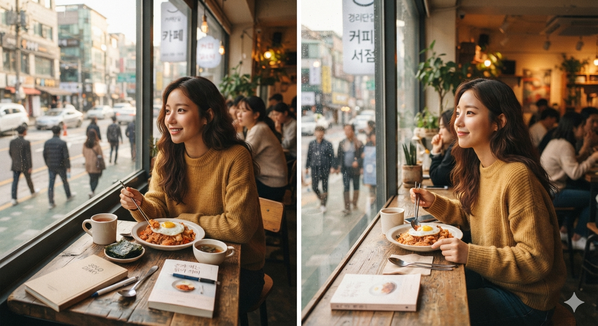

# 혼밥 타인 시선에서 벗어나 나를 돌보는 시간 삶의 균형

언제부터인가 사람들은 혼자 밥을 먹는 사람을 특별하게 바라보기 시작했다. 누군가는 외로워 보여 안쓰럽다고 생각했고, 누군가는 인간관계에 문제가 있는 것은 아닐까 짐작했다. 나 역시 처음 혼자 식당 문을 열던 날에는 괜히 주변을 한 번 더 둘러보며 다른 사람들의 시선을 의식했다. 하지만 시간이 흐를수록 혼밥을 바라보는 나의 생각도 달라졌다.

내가 무엇을 좋아하는지, 얼마나 타인의 시선을 의식하며 살아왔는지, 그리고 나를 위해 시간을 쓰는 일이 얼마나 어려웠는지를 말이다. 혼밥은 단순히 식사를 혼자 하는 행동이 아니라 현대인이 자신과 관계를 맺는 새로운 방식이기도 하다.

## 혼자 밥을 먹는 것이 이상했던 시대

오랫동안 한국 사회에서 식사는 공동체를 확인하는 의식에 가까웠다. 가족은 함께 밥을 먹어야 했고, 친구와의 식사는 우정을 확인하는 시간이었으며, 직장에서는 점심시간마저 업무의 연장선처럼 여겨졌다. '밥 한번 먹자.'라는 말이 인사말이 된 것도 식사가 단순한 영양 섭취가 아니라 관계를 의미했기 때문이다.

이러한 문화 속에서 혼자 식당에 들어가는 행동은 자연스럽게 결핍의 신호처럼 해석되곤 했다. 함께 먹을 사람이 없는 사람, 인간관계가 부족한 사람, 외로운 사람이라는 이미지가 혼밥 위에 덧씌워졌다. 실제로 혼자 식사를 하는 것보다 주변의 시선을 견디는 일이 더 어렵게 느껴지는 이유도 여기에 있다.

하지만 사회는 끊임없이 변한다. **1인 가구의 증가**, 개인화된 소비 문화, 다양한 근무 형태의 확산은 식사의 의미 자체를 바꾸기 시작했다. 이제 사람들은 관계를 유지하기 위해 식사하는 것이 아니라, 자신의 일정과 취향에 맞추어 식사하는 것을 자연스럽게 받아들이고 있다. 식당 역시 1인석과 키오스크를 도입하며 이러한 변화를 일상으로 만들고 있다.

혼밥이 늘어난 것이 사람들의 사회성이 약해졌기 때문이라고 단정하기는 어렵다. 오히려 개인의 선택권이 확대되면서 '함께 먹을 수도 있고, 혼자 먹을 수도 있는 자유'가 생긴 결과라고 보는 편이 더 자연스럽다.

## 혼밥이 내게 가르쳐 준 것은 자유였다

혼자 식사를 시작하면 가장 먼저 느끼는 변화는 **선택권**이다. 무엇을 먹을지 누구와 상의할 필요가 없다. 맵고 짠 음식을 먹고 싶으면 그대로 선택하면 되고, 아무도 좋아하지 않는 메뉴를 먹고 싶어도 눈치를 볼 이유가 없다.

식사의 속도 역시 오롯이 자신의 것이 된다. 빨리 먹는 사람에게 맞추거나, 대화가 끝날 때까지 젓가락을 내려놓을 필요도 없다. 천천히 씹으며 음식의 향과 식감을 느끼는 시간은 생각보다 훨씬 큰 만족감을 준다.

혼밥의 가장 큰 선물은 **고요함**이다. 평소 우리는 끊임없이 누군가의 말에 반응하고, 분위기를 맞추며, 상대의 감정을 살핀다. 식사 시간조차 쉬지 못하는 경우가 많다. 그러나 혼자 먹는 한 끼는 그 모든 역할에서 잠시 벗어날 수 있는 시간이다.

스마트폰을 내려놓고 창밖을 바라보며 식사하는 순간, 음식은 단순히 허기를 채우는 대상이 아니라 하루를 정리하는 작은 의식이 된다. 그 시간만큼은 누구의 기대도, 평가도 존재하지 않는다. 오직 나와 음식만 남는다.

## 혼자일 수 있는 사람만 관계도 건강하게 맺는다

흥미로운 사실은 혼밥을 즐기는 사람들이 반드시 인간관계를 싫어하는 것은 아니라는 점이다. 오히려 필요할 때는 누구보다 적극적으로 사람을 만나면서도, 혼자만의 시간을 불편해하지 않는 사람들이 많다.

반대로 항상 누군가와 함께 있어야만 안심하는 사람도 있다. 혼자 식당에 들어가는 일을 두려워하고, 점심을 같이 먹을 사람이 없으면 식사를 거르기도 한다. 여기서 문제는 혼자 밥을 먹는 행위가 아니라, **혼자 있는 시간을 견디지 못하는 심리**일 수 있다.

우리는 사회성이란 사람을 많이 만나는 능력이라고 생각하기 쉽다. 그러나 성숙한 사회성은 관계를 억지로 유지하는 것이 아니라, 필요할 때는 함께하고 필요할 때는 혼자 있을 줄 아는 균형감각에 더 가깝다.

언제나 함께만 있어야 한다면 그것은 관계를 선택하는 것이 아니라 관계에 의존하는 상태일 수도 있다. 혼자 있는 시간을 받아들이는 사람은 오히려 타인에게 과도한 기대를 하지 않는다. 그래서 관계 역시 훨씬 가볍고 건강해진다.

결국 **'혼밥만 하는 사람'과 '혼밥도 하는 사람'은 전혀 다르다.** 혼자 있는 능력은 사람을 피하는 기술이 아니라, 사람에게 휘둘리지 않는 능력이기 때문이다.

## 혼밥과 고립은 전혀 다른 이야기다

혼밥을 이야기할 때 반드시 구분해야 하는 것이 있다. **혼자 먹는 것과 혼자 남겨지는 것은 같은 일이 아니다.**

혼자 식사를 즐기는 사람은 자신의 의지로 시간을 선택한다. 오늘은 조용히 밥을 먹고 싶고, 내일은 친구를 만나고 싶을 수도 있다. 선택권은 언제나 자신에게 있다.

그러나 비자발적인 고립은 다르다. 함께 식사할 사람이 없어서가 아니라, 사회와 연결될 통로 자체가 사라진 상태다. 경제적인 어려움, 가족 해체, 실직, 질병, 빈곤 등은 사람을 원치 않는 고립으로 밀어 넣는다.

이때 혼밥은 자유가 아니라 생존이 된다. 식사는 가장 외로운 시간이 되고, 하루 동안 단 한마디도 하지 않는 날이 반복되기도 한다. 우리는 이 상황을 단순히 '혼자 밥 먹는 사람'이라는 말로 묶어서는 안 된다.

최근 고독사가 특정 연령만의 문제가 아니라 청년층까지 확대되는 이유도 여기에 있다. 문제는 혼자 식사했다는 사실이 아니라, **사회와 연결될 기회 자체가 사라졌다는 점**이다.

자발적인 혼밥과 비자발적인 고립은 원인도, 해결 방법도 완전히 다르다.

혼밥을 즐기는 문화를 이상하게 볼 것이 아니라, 선택권 없이 혼자가 된 사람들에게 어떤 사회적 안전망을 제공할 것인지를 고민하는 편이 훨씬 중요한 과제다.

## 점심시간은 가장 작은 자유가 되는 시간

이러한 변화는 직장에서도 쉽게 발견된다. 예전에는 점심시간이 조직 문화를 유지하는 중요한 시간이었다. 상사와 함께 식사하고, 업무 이야기를 이어가며, 자연스럽게 관계를 다지는 것이 당연하게 여겨졌다.

하지만 현대의 직장인에게 점심시간은 하루 중 거의 유일하게 **자신이 통제할 수 있는 시간**이 되었다.

오전 내내 업무에 집중하고 사람들과 협업한 뒤 맞이하는 한 시간은 단순한 식사 시간이 아니다. 누군가는 운동을 하고, 누군가는 독서를 하며, 또 다른 누군가는 조용히 혼자 식당에 앉아 아무 생각 없이 식사를 한다.

예전에는 이런 행동이 조직에 적응하지 못하는 모습처럼 보일 수도 있었다. 그러나 지금은 오히려 자신의 컨디션을 관리하고 오후 업무를 준비하는 효율적인 방법으로 받아들여진다.

특히 사회생활을 오래 한 사람일수록 모든 식사를 인간관계에 투자하지 않는다. 관계가 필요한 자리에는 적극적으로 참여하지만, 혼자만의 시간이 필요할 때는 자연스럽게 혼밥을 선택한다.

## 혼자 먹는 밥은 나를 대접하는 가장 쉬운 방법이다

생각해 보면 우리는 타인을 위해서는 많은 정성을 들인다. 가족이 좋아하는 메뉴를 고민하고, 손님이 오면 좋은 식당을 예약하며, 소중한 사람과의 식사에는 시간을 아끼지 않는다.

그런데 정작 **자기 자신에게는 그런 대접을 얼마나 하고 있을까.**

혼밥을 시작하면서 달라진 것 중 하나는 식사를 대하는 태도였다. 허기를 채우기 위해 대충 먹는 것이 아니라, 오늘 내가 먹고 싶은 음식을 스스로에게 선물하는 시간이 되었다.

집에서 먹더라도 예쁜 그릇에 담아 먹고, 평소 가보고 싶었던 식당에 혼자 들어가 보는 경험은 생각보다 큰 만족감을 준다. 누군가와 함께해야만 좋은 음식을 먹을 수 있다는 생각에서 벗어나는 순간, 식사는 타인을 위한 이벤트가 아니라 자신을 위한 보상이 된다.

우리는 종종 행복을 거창한 사건에서 찾는다. 여행을 가야 하고, 좋은 사람을 만나야 하며, 특별한 날이 되어야 한다고 생각한다. 그러나 하루 세 번 찾아오는 식사 시간을 어떻게 보내느냐 역시 삶의 만족도를 결정하는 중요한 요소다.

## 혼자라는 시대를 살아가는 우리의 준비

앞으로의 사회는 지금보다 더 많은 사람이 혼자 살아가는 시대가 될 가능성이 높다. 1인 가구는 계속 증가하고 있으며, 평균수명은 길어지고 있다. 배우자와 사별하거나 자녀가 독립하면서 누구나 인생의 어느 시점에는 혼자 식사하는 시간을 경험할 가능성이 있다.

이런 변화를 생각하면 혼밥은 특정 세대의 유행이나 특별한 취향이 아니다. **앞으로 대부분의 사람이 익혀야 할 생활 능력**에 가깝다.

특히 시니어 세대에게 혼밥은 더욱 중요한 의미를 가진다. 평생 가족을 위해 식사를 준비하고, 다른 사람의 일정에 맞추어 살아왔던 사람일수록 은퇴 이후에는 스스로를 위한 시간을 만드는 일이 낯설 수 있다.

그러나 혼자 식당에 들어가 원하는 음식을 주문하고, 천천히 식사를 마치고, 커피 한 잔을 마시며 하루를 보내는 일상은 외로움의 상징이 아니라 새로운 독립의 시작이 될 수도 있다. 행복의 조건을 타인에게만 의존하지 않기 때문이다.

## 혼밥을 바라보는 시선도 이제는 달라져야 한다

혼밥에는 이상한 위계가 존재한다. 분식집이나 국밥집에서 혼자 먹는 것은 자연스럽지만, 고깃집이나 패밀리레스토랑에 혼자 들어가는 일은 아직도 용기가 필요한 행동처럼 여겨진다.

하지만 곰곰이 생각해 보면 이러한 기준은 음식 때문이 아니라 **타인의 시선** 때문이다.

우리는 혼자 고기를 먹는 것이 이상한 것이 아니라, 다른 사람들이 이상하게 볼 것이라고 미리 상상한다. 실제로는 대부분의 사람들은 다른 사람의 식사에 큰 관심이 없다. 모두 자신의 식사와 대화에 집중할 뿐이다.

혼밥을 두려워하게 만드는 것은 현실보다 머릿속에서 만들어 낸 사회적 시선인 경우가 많다.

이러한 심리적 장벽은 조금씩 허물어진다. 처음에는 가까운 식당에서 시작하고, 익숙해지면 새로운 식당에도 혼자 가 본다. 그렇게 경험이 쌓이면 더 이상 혼자 식사하는 일이 특별한 일이 아니라 일상이 된다.

결국 혼밥의 난이도는 식당의 종류가 아니라 **자신을 얼마나 있는 그대로 인정할 수 있는가**의 문제일지도 모른다. 혼자 식당에 들어가는 용기는 거창한 도전이 아니라, 타인의 시선보다 자신의 선택을 조금 더 믿기 시작했다는 작은 변화의 증거다.

## 마무리

혼자 밥을 먹기 시작하면서 알게 된 사실이 하나 있다. 사람들은 생각보다 나에게 관심이 없다는 것이다. 식당에서 혼자 밥을 먹는 사람을 오래 바라보는 사람도 없고, 그것을 이상하게 기억하는 사람도 거의 없다. 오히려 나 자신이 만들어 낸 시선과 편견이 나를 가장 많이 붙잡고 있었다.

혼밥은 누군가와의 관계를 거부하는 행동이 아니다. **혼자 있을 자유를 인정하는 일**이며, 관계를 의무가 아니라 선택으로 바꾸는 과정이다. 혼자 있는 시간이 편안해야 함께하는 시간도 즐거워질 수 있다. 그래서 혼밥을 할 줄 아는 사람은 사람을 싫어하는 사람이 아니라, 관계에 지나치게 의존하지 않는 사람일 가능성이 크다.

물론 모든 혼자는 아름다운 것은 아니다. 우리는 **자발적인 혼자**와 **비자발적인 고립**을 구분해야 한다. 혼자 먹는 한 끼를 즐길 수 있는 사회는 건강한 사회지만, 원치 않게 홀로 남겨진 사람들이 마지막 식사마저 외로움으로 기억하는 사회는 결코 건강하다고 말할 수 없다. 개인은 혼자 있는 능력을 키워야 하고, 공동체는 누구도 고립되지 않도록 연결의 손길을 놓지 않아야 한다.  

그리고 누군가와 함께 먹는 밥만큼이나, 자신을 위해 차린 한 끼 역시 충분히 존중받아야 한다.

어쩌면 우리는 지금까지 너무 오랫동안 '누구와 함께 먹는가'에만 관심을 가져왔는지도 모른다. 이제는 한 가지 질문을 더 던져볼 필요가 있다. **오늘의 한 끼를 가장 소중하게 대접해야 할 사람은, 혹시 나 자신이 아닐까.**