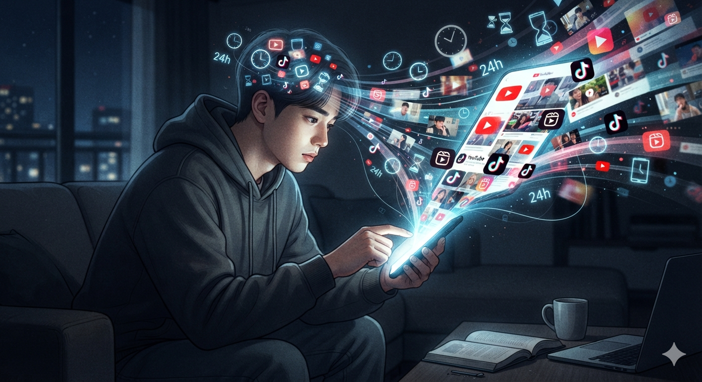

# 영상은 시간을 가져갔고 인간은 생각할 시간을 잃어가고 있다

인간은 하루 24시간을 모두 자유롭게 사용할 수 있는 존재가 아니다. 잠을 자고, 생계를 위해 일하고, 이동하고, 식사를 하는 시간을 제외하면 스스로 선택할 수 있는 여유 시간은 생각보다 많지 않다. 그런데 그 얼마 남지 않은 시간의 상당 부분이 이제는 **디지털 화면** 안에서 소비된다. 이는 단순히 스마트폰 사용 시간이 늘었다는 의미가 아니라, 인간이 사고하고 놀고 배우고 관계를 맺는 공간 자체가 디지털 플랫폼으로 이동했음을 뜻한다.

흥미로운 점은 사람들의 관심사가 무한히 다양해 보이지만, 실제로는 극소수의 플랫폼 안에서 대부분의 시간이 소비된다는 사실이다. 디지털 세상은 무한한 선택지를 제공하는 것처럼 보이지만, 거시적으로 보면 수십 개 서비스가 대한민국 국민 대부분의 여가 시간을 사실상 공유하고 있다.

이 글에서는 현대인의 하루가 어떻게 디지털 서비스 중심으로 재편되었는지 살펴보고, 이러한 변화가 인간의 사고 방식과 정보 소비 구조에 어떤 의미를 가지는지 분석한다.

## 1. 인간에게 자유 시간은 생각보다 많지 않다

우리는 흔히 하루가 24시간이라고 말하지만, 실제로 마음대로 사용할 수 있는 시간은 훨씬 적다.

현대인의 하루 구조를 이해하기 위한 하나의 거시적 모델로 나누면 다음과 같이 볼 수 있다.

| 대분류 영역           | 하루 평균 소요 시간 |
| ---------------- | ----------: |
| 생존 및 생리적 유지      |       약 8시간 |
| 생업 및 공식 노동       |       약 8시간 |
| 이동 및 통근          |     약 1.5시간 |
| 식사 및 필수 가사       |       약 2시간 |
| 오프라인 순수 여가·외부 활동 |       약 1시간 |
| **디지털 기기 이용 시간** | **약 3.5시간** |
| **합계**           |    **24시간** |

이 수치는 개인마다 차이가 있지만, 현대인의 생활 구조를 이해하기 위한 거시적 모델로는 충분히 의미가 있다.

여기서 가장 눈에 띄는 부분은 **디지털 기기 이용 시간**이다. 하루 약 3.5시간은 전체 하루의 약 **14.6%** 에 해당한다. 하지만 더 중요한 것은 자유롭게 사용할 수 있는 시간만 놓고 보면 이 비중이 훨씬 커진다는 점이다.

수면과 노동을 제외하면 인간에게 남는 시간은 약 8시간 정도다. 그 가운데 약 3.5시간이 스마트폰이나 PC 같은 디지털 기기에 사용된다면, 자유 시간의 상당 부분이 디지털 플랫폼 안에서 소비되는 셈이다.

현대인의 여가는 더 이상 공원이나 광장보다 **디지털 생태계** 안에서 이루어진다.

## 2. 무한한 인터넷처럼 보이지만 실제 시간은 소수 서비스에 집중된다

인터넷은 무한한 정보 공간처럼 보인다.

하지만 대한민국 전체 이용자 기준으로 보면 대부분의 시간은 매우 제한된 플랫폼에 집중된다.

다음 표는 주요 디지털 서비스별 체류 시간을 하나로 정리한 것이다.

| 단일 서비스                               | 그룹           | 추정 점유율 |
|:------------------------------------------|:---------------|------------:|
| 유튜브                                    | 유튜브         |      27.10% |
| 네이버                                    | 네이버         |      10.60% |
| 카카오톡                                  | 카카오톡       |       8.00% |
| 문서 작업 및 업무                         | 생산성·업무   |       6.20% |
| 인스타그램                                | SNS 영상       |       6.00% |
| 리그 오브 레전드                          | 게임           |       3.60% |
| 구글                                      | 포털·검색     |       2.80% |
| 로블록스                                  | 게임           |       1.80% |
| 넷플릭스                                  | 미디어·콘텐츠 |       1.80% |
| 콘솔 게임                                 | 게임           |       1.80% |
| 틱톡                                      | SNS 영상       |       1.60% |
| 브롤스타즈                                | 게임           |       1.50% |
| X(구 twitter)                             | SNS 커뮤니티   |       1.40% |
| 학습 및 E-러닝                            | 학습·교육     |       1.40% |
| FC 온라인                                 | 게임           |       1.20% |
| 쿠팡                                      | 커머스         |       1.20% |
| 업무용 협업 툴                            | 생산성·업무   |       1.20% |
| 네이버 카페                               | SNS 커뮤니티   |       1.15% |
| 배틀그라운드                              | 게임           |       1.10% |
| 리니지M                                   | 게임           |       1.00% |
| 네이버 블로그                             | SNS 블로그     |       1.00% |
| 금융 및 공공 행정                         | 금융·행정     |       1.00% |
| 클라우드 및 유틸리티                      | 유틸리티       |       1.00% |
| 네이버 밴드                               | SNS 커뮤니티   |       0.90% |
| 페이스북                                  | SNS 커뮤니티   |       0.90% |
| 네이버쇼핑                                | 커머스         |       0.90% |
| 디시인사이드                              | SNS 커뮤니티   |       0.85% |
| 기타 PC/모바일 게임                       | 게임           |       0.85% |
| 로컬 비디오 감상                          | 로컬 미디어    |       0.80% |
| 언론사 뉴스                               | 뉴스           |       0.75% |
| 나무위키                                  | 포털·검색     |       0.70% |
| 기타 커뮤니티(펨코·루리웹·인벤 등)      | SNS 커뮤니티   |       0.70% |
| 치지직                                    | 미디어·콘텐츠 |       0.50% |
| 티빙                                      | 미디어·콘텐츠 |       0.50% |
| 멜론                                      | 미디어·콘텐츠 |       0.50% |
| 네이버 웹툰                               | 미디어·콘텐츠 |       0.50% |
| 당근                                      | 커머스         |       0.40% |
| SOOP                                      | 미디어·콘텐츠 |       0.40% |
| 로컬 음원 감상                            | 로컬 미디어    |       0.40% |
| 토스                                      | 커머스         |       0.35% |
| 쓰레드                                    | SNS 커뮤니티   |       0.35% |
| 다음                                      | 포털·검색     |       0.30% |
| 배달의민족                                | 커머스         |       0.30% |
| 디스코드                                  | SNS 커뮤니티   |       0.30% |
| 티스토리                                  | SNS 블로그     |       0.25% |
| 쿠팡플레이                                | 미디어·콘텐츠 |       0.25% |
| 네이버지도                                | 포털·검색     |       0.20% |
| 웨이브                                    | 미디어·콘텐츠 |       0.20% |
| 디즈니+                                   | 미디어·콘텐츠 |       0.20% |
| ChatGPT                                   | 생성형 AI      |       0.18% |
| 카카오맵                                  | 포털·검색     |       0.18% |
| 카카오페이지                              | 미디어·콘텐츠 |       0.18% |
| 알리익스프레스                            | 커머스         |       0.12% |
| 기타 블로그(워드프레스·개인 홈페이지 등) | SNS 블로그     |       0.12% |
| 네이트                                    | 포털·검색     |       0.12% |
| 스포티파이                                | 미디어·콘텐츠 |       0.08% |
| 테무                                      | 커머스         |       0.08% |
| 기타 서비스                               | 기타           |       0.08% |
| 요기요                                    | 커머스         |       0.06% |
| Gemini                                    | 생성형 AI      |       0.04% |
| Wrtn                                      | 생성형 AI      |       0.02% |
| Claude                                    | 생성형 AI      |       0.02% |
| Copilot                                   | 생성형 AI      |       0.01% |
| Grok                                      | 생성형 AI      |       0.01% |
| **합계**                                  | -              | **100.00%** |

출처: 와이즈앱·리테일·굿즈 앱 통계 분석 리포트: https://www.wiseapp.co.kr/insight/detail/899/app-ranking-2025

물론 개인별 비율은 크게 다를 수 있다.

누군가는 게임이 하루의 대부분일 수도 있고, 누군가는 유튜브만 하루 종일 시청할 수도 있으며, 또 다른 누군가는 업무용 프로그램을 가장 오래 사용할 수도 있다.

그러나 이러한 개인차와 별개로 **대한민국 전체 이용자를 하나의 거대한 집합으로 바라보면 대부분의 디지털 체류 시간은 이처럼 제한된 주요 서비스에 집중된다.**

이 점이 중요한 의미를 갖는다.  
64개의 서비스를 큰 범주로 묶으면 디지털 이용 구조는 더욱 명확해진다.

| 디지털 기기 이용 시간 | 추정 점유율 |
| ------------ | -----: |
| 유튜브          | 27.10% |
| 게임           | 12.85% |
| 네이버          | 10.60% |
| 카카오톡         |  8.00% |
| SNS 영상       |  7.60% |
| 생산성·업무       |  7.40% |
| SNS 커뮤니티     |  6.55% |
| 미디어·콘텐츠      |  5.11% |
| 포털·검색        |  4.30% |
| 커머스          |  3.41% |
| 학습·교육        |  1.40% |
| SNS 블로그      |  1.37% |
| 로컬 미디어       |  1.20% |
| 금융·행정        |  1.00% |
| 유틸리티         |  1.00% |
| 뉴스           |  0.75% |
| 생성형 AI       |  0.28% |
| 기타           |  0.08% |

출처: 모바일인덱스(Mobile Index) 앱 시장 데이터: https://www.mobileindex.com/

이 표를 보면 흥미로운 사실 하나가 드러난다.

우리는 수많은 앱을 사용하는 것처럼 느끼지만, 실제 시간은 **영상**, **게임**, **메신저**, **SNS**, **검색 플랫폼**같은 일부 영역에 집중된다.

다시 말해 현대인의 디지털 생활은 다양성이 아니라 **집중화**라는 특징을 가진다.

## 3. 영상과 알고리즘은 인간의 시간을 어떻게 흡수하는가?

디지털 서비스의 가장 큰 변화는 단순히 콘텐츠 종류가 늘어난 것이 아니다. 핵심 변화는 **사용자가 콘텐츠를 찾는 구조에서 플랫폼이 콘텐츠를 제공하는 구조로 이동했다는 점**이다.

과거 인터넷은 검색 중심이었다. 사용자는 원하는 정보를 알고 있어야 했고, 검색어를 입력한 뒤 여러 결과를 비교하며 필요한 내용을 찾았다. 이 과정에서는 사용자의 목적과 판단이 중요했다.

하지만 현재의 주요 플랫폼은 다른 방식으로 작동한다.

유튜브, 인스타그램, 틱톡과 같은 서비스는 사용자가 무엇을 검색할지 고민하기 전에 알고리즘이 먼저 콘텐츠를 제시한다. 사용자는 선택하는 사람에서 추천받는 사람으로 위치가 변화했다.

이 구조가 강력한 이유는 인간의 주의력이라는 한정된 자원을 지속적으로 확보하도록 설계되어 있기 때문이다.

영상 플랫폼은 다음과 같은 특징을 가진다.

* 자동 재생 구조
* 개인 맞춤형 추천
* 짧고 강한 자극의 반복
* 무한 스크롤 방식
* 즉각적인 보상 구조

이러한 기능은 사용자가 특정 목적을 달성한 뒤 종료하는 것이 아니라, 다음 콘텐츠를 계속 소비하도록 만든다.

반면 텍스트 기반 서비스는 구조적으로 다르다.

사용자는 글을 읽기 위해 일정한 인지적 노력을 투입해야 한다. 내용을 이해하고, 앞뒤 맥락을 연결하고, 자신의 생각과 비교하는 과정이 필요하다. 따라서 필요한 정보를 얻으면 비교적 빠르게 서비스를 떠나는 경우가 많다.

결국 디지털 플랫폼 경쟁은 단순히 좋은 콘텐츠를 만드는 경쟁이 아니라 **사용자의 시간을 얼마나 오래 붙잡아 둘 수 있는가의 경쟁**으로 변화했다.

## 4. 텍스트 서비스는 사라진 것이 아니라 역할이 바뀌었다

현재 텍스트 기반 서비스의 이용 시간이 줄어든 것은 사실이지만, 이것이 곧 텍스트 정보의 가치가 사라졌다는 의미는 아니다.

오히려 텍스트는 다른 역할로 이동했다.

과거 블로그는 개인의 일상 기록, 관계 형성, 의견 교환이 이루어지는 공간이었다. 하지만 현재 이러한 기능은 여러 플랫폼으로 분산되었다.

* 개인 일상 공유 → 인스타그램, 숏폼 SNS
* 실시간 의견 교류 → X, 페이스북, 커뮤니티
* 관심사 기반 토론 → 네이버 카페, 디시인사이드, 전문 커뮤니티
* 정보 검색 → 블로그, 개인 홈페이지, 위키

즉 블로그를 포함한 텍스트 매체는 일상 공유와 관계 형성 중심의 **체류형 플랫폼에서, 특정 목적을 해결하기 위한 검색형 정보 매체로 역할**이 이동했다.

사람들은 과거처럼 블로그에 오래 머물며 다른 사람의 일상을 구경하지 않는다. 대신 특정 정보를 찾기 위해 검색하고, 필요한 내용을 확인한 뒤 이동한다.

이 변화는 개인 블로그 운영자에게 중요한 의미를 가진다.

워드프레스, 개인 홈페이지 같은 독립적인 텍스트 매체는 전체 디지털 체류 시간에서 매우 작은 비중을 차지한다. 하지만 이것은 텍스트 자체가 무가치하다는 의미가 아니다.

오히려 경쟁 상대가 바뀐 것이다.

과거에는 "다른 블로그와 경쟁"했다면, 현재는 모든 텍스트 기반 정보 공간과 경쟁한다.

사용자가 정보를 찾을 때 비교 대상은 개인 홈페이지뿐 아니라 다음과 같다.

* 네이버 카페
* 디시인사이드
* X
* 각종 커뮤니티 게시글
* 위키 서비스
* AI 검색 결과

따라서 현재 개인 콘텐츠 생산자가 살아남기 위해서는 단순한 정보 전달만으로 부족하다.

검색으로 찾을 이유가 있는 **깊이 있는 분석, 독창적인 데이터, 개인적인 경험이 결합된 콘텐츠**가 필요하다.

## 5. 체류 시간을 결정하는 것은 콘텐츠보다 서비스 구조다

64개 서비스 데이터를 큰 범주로 묶으면 디지털 이용 구조의 특징은 더욱 명확해진다.

상위 영역은 다음과 같다.

* 유튜브
* SNS 영상
* SNS 커뮤니티
* 게임
* 네이버
* 카카오톡

이 영역들이 대부분의 디지털 체류 시간을 차지한다.

특히 영상과 소셜 영역의 영향력이 크다.

| 영역       | 특징                       |
| -------- | ------------------------ |
| 영상 콘텐츠   | 시청 시간이 길고 반복 소비가 발생      |
| SNS 영상   | 짧은 자극과 추천 알고리즘으로 체류 증가   |
| SNS 커뮤니티 | 댓글, 반응, 관계 형성으로 반복 방문 유도 |
| 게임       | 목표 달성 구조와 경쟁 요소로 장시간 이용  |
| 검색·커머스   | 목적 달성 후 빠른 종료            |

여기서 중요한 차이가 있다.

검색, 금융, 쇼핑 같은 서비스는 생활에 필수적이지만 체류 시간이 길지 않다. 사용자는 목적을 달성하면 서비스를 종료한다.

반면 영상, SNS, 게임은 목적이 없어도 계속 사용할 수 있다.

이 차이가 디지털 경제에서 가장 중요한 경쟁 요소가 되었다.

플랫폼 기업은 정보를 제공하는 것뿐 아니라 사용자가 머무르는 시간을 확보하려 한다. 체류 시간이 곧 광고 노출, 데이터 축적, 서비스 영향력으로 연결되기 때문이다.

## 6. 생성형 AI 시대에도 체류 시간은 짧게 나타나는 이유

흥미로운 부분은 최근 급성장한 생성형 AI 역시 현재 사용 패턴에서는 상대적으로 낮은 체류 시간을 보인다는 점이다.

표 기준으로 보면 ChatGPT, Gemini, Claude, Copilot 등 생성형 AI 영역의 합산 비중은 약 **0.28%** 수준이다.

하지만 이것을 AI의 영향력이 작다고 해석하는 것은 정확하지 않다.

생성형 AI는 기존 영상이나 SNS와 사용 방식 자체가 다르다.

영상 플랫폼:

* 콘텐츠 소비 목적
* 긴 체류 시간
* 반복 시청

생성형 AI:

* 질문 입력
* 결과 확인
* 작업 완료
* 종료

즉 AI는 **시간을 빼앗는 서비스가 아니라 시간을 절약하는 서비스**에 가깝다.

예를 들어 사용자가 보고서 초안을 작성하거나, 코드를 검토하거나, 정보를 요약하기 위해 AI를 사용한다면 몇 분 만에 목적을 달성할 수 있다.

따라서 체류 시간만으로 서비스 영향력을 판단하면 AI의 실제 가치를 제대로 평가하기 어렵다.

오히려 앞으로 중요한 변화는 "얼마나 오래 머무르는가"가 아니라 "얼마나 많은 인간의 판단과 작업 과정에 개입하는가"가 될 가능성이 높다.

이는 기존 플랫폼과 생성형 AI의 가장 큰 차이다.

## 7. 인간의 남은 여가는 대부분 디지털 플랫폼 안으로 이동했다

현대인은 디지털 기기를 사용하지 않고 하루를 보내기 어렵다.

업무, 금융, 쇼핑, 이동, 정보 검색까지 대부분의 활동이 스마트폰과 컴퓨터를 통해 이루어진다.

따라서 단순히 "스마트폰을 많이 사용하는가"라는 질문보다 중요한 것은 **현대인의 자유 시간이 어떤 구조 안에서 소비되고 있는가**라는 질문이다.

하루 24시간 기준으로 보면 디지털 이용 시간은 약 14.6%에 해당한다.

하지만 실제 선택 가능한 여가 시간만 기준으로 보면 절반에 가까운 비중이다.

결국 현대인은 남는 시간을 다음과 같은 구조 안에서 사용한다.

* 영상 시청
* 게임
* SNS 소통
* 검색
* 커뮤니티 활동
* 콘텐츠 소비

과거에는 책을 읽거나 음악을 듣거나 사람을 만나거나 산책하는 시간이 자연스럽게 존재했었는데 말이다.

## 8. 텍스트를 읽는다는 것은 생각하는 시간을 확보하는 일이다

디지털 시대에 텍스트 소비가 감소했다는 사실 자체가 문제는 아니다. 인간은 새로운 매체가 등장할 때마다 기존 방식을 변화시켜 왔다. 라디오가 등장했을 때 책의 시대가 끝날 것이라는 예측이 있었고, 텔레비전이 등장했을 때도 독서 문화의 쇠퇴가 우려되었다.

그러나 현재의 변화가 과거와 다른 점은 **콘텐츠 전달 방식 자체가 인간의 주의력 구조를 바꾸고 있다는 점**이다.

텍스트를 읽는 과정은 단순히 글자를 눈으로 확인하는 행위가 아니다. 문장을 이해하고, 앞뒤 내용을 연결하고, 저자의 주장과 자신의 생각을 비교하는 과정이 포함된다.

뇌과학자 메리언 울프(Maryanne Wolf)는 이러한 과정을 설명하며 인간의 뇌가 문자 읽기를 위해 별도의 인지 회로를 발달시킨다고 설명한다. 인간은 태어날 때부터 글을 읽도록 설계된 것이 아니라, 문자를 배우면서 시각 정보 처리, 언어 이해, 기억, 추론 능력을 연결하는 새로운 신경망을 만들어낸다.

이것이 흔히 말하는 **독서 회로(Reading Circuit)** 이다.

독서 회로의 핵심은 단순한 문자 해독 능력이 아니다.

* 정보를 천천히 처리하는 능력
* 복잡한 문맥을 유지하는 능력
* 서로 다른 정보를 연결하는 능력
* 주장과 근거를 구분하는 능력
* 스스로 질문을 만드는 능력

이러한 능력은 긴 글을 읽고 생각하는 과정에서 강화된다.

반대로 짧고 강한 자극이 반복되는 환경에서는 정보를 빠르게 소비하는 능력은 발달할 수 있지만, 하나의 주제를 오래 붙잡고 분석하는 능력은 상대적으로 사용 기회가 줄어들 수 있다.

그렇다고 해서 모든 사람이 반드시 책만 읽어야 한다는 결론으로 이어지는 것은 아니다. 독서 자체가 깊은 사고를 자동으로 만들어내는 것은 아니다. 아무런 고민 없이 글을 읽는 행위는 영상 콘텐츠를 수동적으로 보는 것과 비슷한 결과를 가져올 수 있다.

중요한 것은 **능동적인 사고 과정**이다.

좋은 독서는 다음과 같은 질문을 포함한다.

* 이 주장은 어떤 근거를 가지고 있는가?
* 다른 관점에서는 어떻게 해석할 수 있는가?
* 내가 알고 있던 사실과 충돌하지 않는가?
* 저자의 전제가 잘못된 것은 아닌가?

이 과정에서 인간은 정보를 단순히 받아들이는 것이 아니라 자신의 사고 체계 안에서 재구성한다. 따라서 독서의 본질적인 가치는 책이라는 매체 자체에 있지 않다.

핵심은 정보를 받아들이는 과정에서 인간이 **생각의 주도권을 유지하는 것**이다. 프로그래밍, 연구, 글쓰기, 토론, 전략 게임 등도 비슷한 역할을 할 수 있다. 중요한 것은 어떤 활동을 하느냐보다 스스로 판단하고 검증하는 과정이 포함되어 있는가이다.

다만 현대 사회에서 독서는 이러한 능동적 사고 훈련을 가장 쉽게 접근할 수 있는 방법 가운데 하나라는 점에서 의미가 있다.

## 9. 알고리즘 시대의 가장 큰 위험은 편리함 자체다

현재 디지털 플랫폼이 제공하는 편리함은 부정할 수 없다.

검색하지 않아도 원하는 영상을 추천받고, 길을 찾지 않아도 내비게이션이 최적 경로를 제시하며, 질문하면 AI가 빠르게 답을 제공한다.

이러한 기술은 인간의 삶을 크게 개선했다. 문제는 편리함이 아니라 **편리함에 익숙해졌을 때 무엇을 잃을 수 있는가**이다.

인간은 에너지를 절약하려는 특성이 있다. 스스로 고민하고 탐색하는 것보다 이미 정리된 정보를 받아들이는 것이 훨씬 쉽다.

알고리즘 기반 서비스는 바로 이 인간의 특성을 활용한다. 사용자는 자신이 원하는 것을 찾고 있다고 생각하지만, 실제로는 플랫폼이 선택한 정보 흐름 안에서 움직일 가능성이 있다.

이것이 문제가 되는 이유는 정보 자체보다 **선택 과정** 때문이다.

스스로 정보를 찾는 사람은 다양한 자료를 비교하고 판단한다. 하지만 추천받은 정보만 반복적으로 소비하면 자신이 어떤 기준으로 정보를 선택하고 있는지 인식하기 어려워진다.

결국 문제의 핵심은 영상이나 AI를 사용하는 것이 아니다. 문제는 인간이 스스로 판단하는 과정을 완전히 외부 시스템에 맡기는 상태다.

## 10. 디지털 시대에 필요한 것은 거부가 아니라 균형이다

현대인이 스마트폰과 인터넷을 떠나는 것은 현실적으로 불가능하다.

디지털 플랫폼은 이미 생활 기반 시설이 되었다. 업무, 금융, 교육, 의료, 인간관계 대부분이 디지털 환경과 연결되어 있기 때문이다. 따라서 해결책은 디지털 기술을 거부하는 것이 아니다.

필요한 것은 **디지털 도구를 사용하는 사람과 디지털 환경에 끌려가는 사람의 차이를 만드는 것**이다. 같은 유튜브를 보더라도 누군가는 새로운 지식을 얻기 위해 활용하고, 누군가는 추천 영상의 흐름에 몇 시간을 소비한다.

같은 AI를 사용하더라도 누군가는 자신의 생각을 발전시키는 도구로 활용하고, 누군가는 사고 과정 자체를 맡긴다. 결국 중요한 것은 기술이 아니라 사용 방식이다. 디지털 시대의 인간에게 필요한 능력은 정보를 얼마나 많이 소비하는지가 아니다.

필요한 정보를 선택하고, 검증하고, 자신의 생각으로 재구성하는 능력이다.

## 마무리

디지털 플랫폼은 인간의 시간을 과거와 다른 방식으로 배분하고 있다. 하루 약 3.5시간이라는 디지털 이용 시간은 단순한 기기 사용 시간이 아니라, 현대인의 여가와 사고 방식이 이동한 공간이다.

64개의 주요 서비스 분석이 보여주는 것은 인터넷이 무한한 공간이라는 이미지와 달리 실제 인간의 관심과 시간은 소수 플랫폼에 집중되어 있다는 사실이다. 그리고 그 중심에는 영상, 게임, SNS처럼 **오랜 체류를 유도하는 서비스 구조**가 존재한다.

결국 중요한 것은 책을 읽느냐, 영상을 보느냐라는 단순한 문제가 아니다. 인간이 스스로 생각하고 질문하고 검증하는 시간을 확보하고 있는지가 핵심이다.

디지털 시대에 독서가 필요한 이유도 여기에 있다. 독서는 과거의 문화 습관을 유지하기 위한 행위가 아니라, 수많은 정보와 알고리즘 속에서 **자신의 생각을 잃지 않기 위한 훈련**이다.

인간은 앞으로 더 많은 기술과 함께 살아가게 될 것이다. 그렇다면 더욱 필요한 것은 기술을 멀리하는 능력이 아니라, 기술을 사용하면서도 스스로 판단하는 주체성을 유지하는 능력이다.

