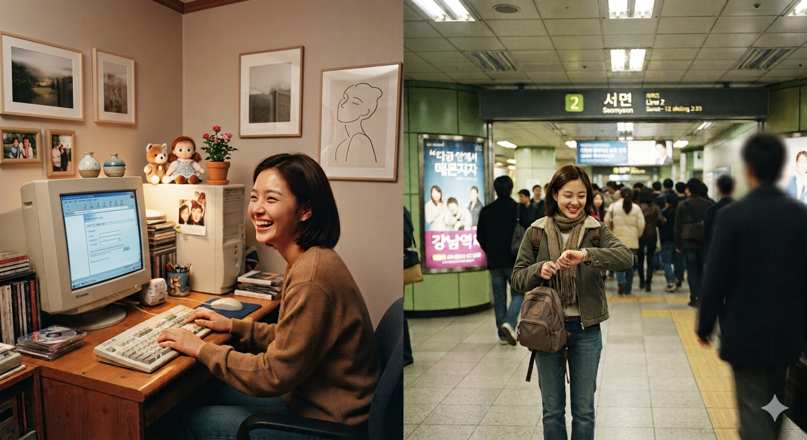

# 싸이월드 시절, 인터넷 안에서 청춘을 살았던 기록

어떤 시절은 지나가고 나서야 비로소 하나의 풍경이 된다. 2000년대 초반의 한국 인터넷이 그랬다. 당시는 그저 새롭고 신기한 기술의 물결처럼 보였지만, 지금 돌이켜보면 그것은 단순한 서비스의 집합이 아니었다. 한 세대가 처음으로 자기 손으로 공간을 꾸미고, 사람을 만나고, 관계를 만들고, 감정을 남기고, 청춘을 저장했던 거대한 생활의 장이었다. 그 시절의 인터넷은 정보를 주고받는 통로이기 전에, 우리가 살아본 하나의 **방**이었다.

지금의 인터넷은 너무 빠르다. 너무 빠르고, 너무 효율적이고, 너무 잘 정리되어 있다. 무엇이든 손쉽게 찾을 수 있고, 누구와도 연결될 수 있고, 어떤 콘텐츠든 즉시 소비할 수 있다. 하지만 그 편리함은 때로 우리를 너무 수동적인 존재로 만든다. 알고리즘이 보여주는 것을 보고, 플랫폼이 정해놓은 방식대로 반응하고, 스크롤하며 시간을 흘려보내는 것. 물론 그것도 인터넷의 한 모습이지만, 그것만이 전부는 아니었다. 적어도 2000년대의 한국 인터넷은 달랐다. 거기에는 사람의 손이, 사람의 성격이, 사람의 기분이 더 많이 묻어 있었다.

## 초고속이 들어오던 밤

2000년대 초반을 기억하는 사람이라면, 그때의 인터넷은 먼저 소리로 떠오를 것이다. 삐삐삐, 끊기는 듯 이어지는 접속음, 그리고 잠시 뒤에 열리던 낯선 화면들. 지금처럼 클릭 한 번이면 끝나는 것이 아니라, 기다림이 있었다. 그 기다림은 불편했지만, 이상하게도 설렘을 만들었다. 화면이 뜨기까지의 몇 초, 사진이 로딩되기까지의 몇 분, 채팅 상대가 답장을 보내기까지의 몇 순간이 당시에는 지루함이 아니라 긴장과 기대의 시간이기도 했다.

초고속 인터넷이 급속히 보급되면서 집 안 풍경도 바뀌었다. 컴퓨터는 단지 게임을 하거나 문서를 작성하는 기계가 아니라, 세상과 통하는 입구가 되었다. 그 입구를 통해 들어간 곳에는 아직 완전히 정리되지 않은 디지털 마을이 있었고, 사람들은 그 마을의 골목을 스스로 만들어가고 있었다. 누군가는 카페를 열고, 누군가는 채팅방에 들어갔고, 누군가는 첫 홈페이지를 만들었다. 그 모든 행동에는 지금처럼 정교한 기획보다 즉흥과 호기심이 먼저였다.

그리고 바로 그 즉흥이 당시 인터넷을 살아 있게 했다. 정답이 없었다. 무엇을 어떻게 써야 하는지, 어떤 사진을 올려야 하는지, 어떤 닉네임을 써야 하는지, 모두가 스스로 배워야 했다. 그래서 인터넷은 단순한 기술이 아니라, 하나의 **실험장**이었다. 사람들은 그 안에서 자기 취향을 시험했고, 관계를 시험했고, 자기 정체성을 시험했다.

## 포털이 삶의 문이던 시절

오늘날 포털이라는 단어는 다소 무겁게 느껴지지만, 당시 포털은 정말로 삶의 문처럼 느껴졌다. 다음은 메일과 카페를 중심으로 사람들을 끌어모았고, 네이버는 검색이라는 강력한 힘으로 일상 속 질서를 만들어갔다. 포털은 단순히 정보를 모아놓은 곳이 아니었다. 뉴스도 보고, 메일도 보내고, 카페도 들어가고, 사진도 보고, 사람도 찾는, 일종의 디지털 생활관이었다.

그 시절 포털은 아직 거대 플랫폼의 냄새보다 사람 냄새가 더 강했다. 메일은 업무보다 안부에 가까웠고, 카페는 단순한 게시판이 아니라 취향의 공동체였다. 어떤 사람은 음악 카페에서 밤을 새웠고, 어떤 사람은 지역 카페에서 동네 정보를 나눴고, 어떤 사람은 학교 카페에서 친구를 만났다. 지금의 SNS가 흘러가는 피드라면, 그때의 카페는 들어가서 앉아 머무는 방에 가까웠다.

특히 다음 카페는 공동체의 감각을 아주 진하게 품고 있었다. 글 하나에도 정성이 있었고, 공지 하나에도 분위기가 있었으며, 회원들 사이에는 단순한 이용자 관계를 넘어선 유대가 생겼다. 이 공간은 온라인 안에 있었지만, 오프라인의 삶과 밀접하게 이어져 있었다. 동호회가 있고, 지역 모임이 있고, 정모가 있고, 번개가 있었다. 인터넷에서 시작된 관계는 곧 현실의 얼굴로 넘어갔다. 그리고 그 과정 자체가 흥미로웠다.

## 세이클럽과 밤의 채팅방

세이클럽을 기억하는 사람들에게 그곳은 단순한 채팅 프로그램이 아니다. 그 안에는 밤이 있었다. 채팅방은 늘 조금 늦게 열렸고, 늘 조금 더 길게 이어졌다. 모르는 사람들과의 대화, 닉네임만으로 시작하는 관계, 가볍게 인사를 건네고 천천히 친해지는 방식은 지금의 메신저와는 전혀 다른 호흡이었다. 그때는 대화 하나에도 기승전결이 있었다. 아무 말 없이 들어와도 되고, 한참 읽기만 해도 되었고, 천천히 마음이 풀린 뒤에야 비로소 말을 섞을 수 있었다.

세이클럽의 매력은 익명성과 친밀감이 묘하게 공존했다는 데 있다. 얼굴은 모르지만 목소리 없는 글자들만으로 상대의 분위기를 짐작했고, 자주 보게 되면 이상하게 정이 붙었다. 누가 늘 그 시간에 들어오는지, 누가 오늘은 기분이 좋은지, 누가 갑자기 말수가 줄었는지, 그런 것들을 알아차리는 것이 자연스러웠다. 채팅방은 정보의 장소가 아니라 감정의 장소였다.

그리고 채팅방은 단순히 사람을 만나는 곳이 아니라, 새로운 관계가 시작되는 문이었다. 어느 날 밤 우연히 들어간 방에서 누군가와 대화를 나누고, 그 사람과 자주 만나고, 결국은 오프라인으로 이어지기도 했다. 지금은 이런 우연이 점점 드물어졌지만, 그때는 우연이 일상이었다. 그래서 더 떨렸고, 더 아름다웠다.

## 아이러브스쿨과 기억의 회수

아이러브스쿨은 관계를 되찾는 사이트였다. 이름부터 이미 어떤 향수를 품고 있었다. 학교를 졸업하면 사람들은 흩어진다. 복도에서 매일 보던 얼굴도, 운동장에서 함께 뛰던 친구도, 급식실에서 함께 떠들던 친구도 시간이 지나면 멀어진다. 그런데 아이러브스쿨은 그 흩어진 시간을 다시 불러오는 통로 같았다.

동창을 찾는다는 것은 단지 이름을 다시 보는 일이 아니었다. 그것은 그 시절의 공기까지 다시 읽어내는 일이었다. 어떤 친구를 검색하는 순간, 이름 하나만으로도 그때의 교실 풍경이 떠오르고, 그 아이가 앉아 있던 자리와 웃음소리와 말투까지 함께 되살아났다. 아이러브스쿨은 기억을 데이터로 바꾸는 서비스가 아니라, 데이터를 기억으로 되돌리는 서비스였다.

그 공간이 더 특별했던 이유는, 그것이 과거를 단순히 저장하는 데 그치지 않았기 때문이다. 오래 못 본 친구와 다시 연락이 닿고, 소식을 주고받고, 실제로 만나기도 했다. 그때 인터넷은 분명히 현실을 대체하지 않았다. 오히려 현실이 다시 살아날 수 있게 도와주었다. 우리는 그걸 통해 잊힌 시간을 회복했다.

## 드림위즈 지니와 메신저의 온도

드림위즈 지니 같은 초기 메신저들은 지금 기준으로 보면 단순한 기능에 가까웠다. 하지만 그 단순함이 오히려 관계의 본질을 드러냈다. 메신저는 정보를 전달하는 도구였지만, 동시에 누군가가 지금 나를 보고 있는지, 접속해 있는지, 혹은 말을 걸 준비가 되어 있는지를 알려주는 감정의 장치이기도 했다. 온라인 상태, 자리비움, 오프라인 같은 표시 하나가 하루의 분위기를 바꿨다.

그 시절 메신저는 늘 사람의 생활 리듬과 함께 움직였다. 학교가 끝나고 접속하는 친구들, PC방에서 잠깐 들어오는 친구들, 밤늦게 몰래 로그인하는 친구들. 메신저 창이 뜨는 순간의 반가움은 지금의 알림보다 훨씬 조용했지만, 그 조용함 때문에 더 깊게 남았다. 아무것도 아닌 듯 보이는 작은 표시가 사실은 관계의 체온을 알려주는 신호였던 셈이다.

특히 밤에 PC 앞에 앉아 있다가 상대가 접속하는 순간은 지금도 떠올리면 묘하게 가슴이 뛴다. 그 시절에는 스마트폰도 없었고, 늘 연결된 세상도 아니었다. 그래서 더 간절했다. 누군가 온라인에 있다는 것만으로도, 오늘은 무언가가 일어날 수 있을 것 같은 예감이 생겼다. 그 예감이 바로 설렘이었다.

# IRC와 보이지 않는 지하실

IRC는 조금 다른 결의 공간이었다. 조금 더 기술적이고, 조금 더 익숙하지 않고, 조금 더 비공식적이었으며, 조금 더 깊은 세계였다. 이름만 들어도 낯설어하는 사람이 많지만, IRC는 당시 디지털 문화의 중요한 층위였다. 그곳에는 관심사가 모였고, 취향이 갈라졌고, 정해진 질서 밖의 대화가 이루어졌다.

어떤 이들에게 IRC는 단순한 채팅이 아니라, 공식적이지 않은 흐름을 만나게 해주는 공간이었다. 소리바다가 당대의 파일 공유 문화를 상징했다면, IRC는 그 이면에서 여러 교환과 접속과 우회가 오가던 장소로 기억되기도 했다. 물론 지금의 기준으로는 여러 논란과 위험이 있었겠지만, 그 시절의 인터넷은 아직 제도가 완전히 정리되지 않은 경계지대였고, 사람들은 그 틈에서 새로운 방식을 실험했다.

그 경계지대의 분위기는 지금 다시 생각해도 묘하다. 완전히 통제되지 않았고, 완전히 공개되지도 않았고, 그 사이에서 사람들은 자기 나름의 질서를 만들었다. 그 불안정함은 때로는 위험했지만, 동시에 자유였다.

## 세이클럽과 다음, 네이버 카페 그리고 오프라인

세이클럽의 클럽 문화는 단순히 온라인 게시판 이상의 의미를 가졌다. 다음 카페나 네이버 카페가 취향과 정보의 조직화에 강했다면, 세이클럽의 클럽은 훨씬 더 감각적이고 즉흥적인 만남을 가능하게 했다. 거기서는 단지 글을 읽고 의견을 나누는 데서 끝나지 않고, 실제로 만날 이유가 만들어졌다. 오프라인 모임, 정모, 번개, 소규모 만남, 지역 기반의 집합. 이런 것들이 자연스럽게 이어졌다.

그곳에서 사람들은 더 이상 닉네임이 아니었다. 온라인에서 먼저 알고, 오프라인에서 얼굴을 맞대고, 다시 온라인에서 이어지는 관계가 생겼다. 그것이 그 시절 인터넷의 가장 소중한 특징 중 하나였다. 가상과 현실이 단절되어 있지 않았고, 오히려 서로를 밀어주고 끌어주었다. 채팅방에서 시작된 인연이 실제 친구가 되고, 카페에서 나눈 글이 오프라인의 약속이 되고, 미니홈피 방문이 사랑의 신호가 되었다.

## 미니홈피의 뭉클한 기억

싸이월드의 미니홈피를 떠올리면 이상하게도 지금보다 더 감정의 밀도가 높았던 시절이 생각난다. 배경음악을 고르고, 사진을 정리하고, 다이어리를 쓰고, 미니미를 꾸미고, 방명록을 확인하는 일 하나하나가 다 작은 사건이었다. 미니홈피는 단순한 프로필 페이지가 아니었다. 그 안에는 관계의 온도와 자기 표현의 습관과 하루하루의 기분이 담겨 있었다.

특히 일촌의 기억은 뭉클하다. 일촌은 지금의 팔로우처럼 가볍지 않았다. 일촌이 된다는 것은 서로의 세계를 열어주는 행위였고, 그만큼 조심스러웠다. 누가 누구와 일촌인지, 누가 내 홈피를 자주 들어오는지, 누가 방명록을 남겼는지, 그런 사소한 것들이 모두 마음을 흔들었다. 일촌 수는 숫자가 아니라 관계의 표정이었다.

그리고 그 관계는 밤에 더 선명해졌다. PC 앞에 앉아 로그인하고, 온라인 목록을 확인하고, 누군가의 접속을 발견하는 순간, 마음이 먼저 반응했다. 접속 알림 하나가 그렇게 설렐 수 있다는 것을, 그 세대는 알고 있었다. 지금 생각하면 참 유치하지만, 그 유치함이야말로 청춘이었다. 아무것도 확실하지 않지만, 그래서 더 기대하게 만드는 감정. 그 감정이 미니홈피와 함께 있었다.

## 사랑과 우정이 머물던 자리

돌이켜보면 2000년대 한국 인터넷은 사랑과 우정이 가장 자연스럽게 섞여 있던 공간이었다. 사랑은 메시지로 시작했고, 우정은 방명록으로 이어졌으며, 관심사는 클럽과 카페를 통해 공동체가 되었다. 그 시절의 인터넷에는 아직 너무 많은 가능성이 남아 있었고, 사람들은 그 가능성 속에서 서로에게 다가갔다. 새로운 만남이 있었고, 오래된 친구를 다시 찾았고, 낯선 누군가에게 마음을 열었고, 그 모든 일이 일상처럼 벌어졌다.

우리는 거기서 참 많이 기대했다. 누가 들어올지, 누가 답할지, 누가 나를 기억할지, 누가 나와 같은 취향을 가졌는지, 누가 오늘 밤 나와 이야기할지. 그 기대가 청춘을 만들었다. 인터넷은 삶을 대체하지 않았고, 오히려 삶의 감각을 더 크게 흔들었다. 그래서 그 시절을 기억하는 사람들은 단순히 서비스를 기억하는 것이 아니라, 그 안에서 느꼈던 생생한 마음을 기억한다.

## 지금의 인터넷과의 거리

지금의 인터넷은 너무 잘 정리되어 있다. 검색은 편리하고, 메신저는 즉각적이며, SNS는 쉬우며, 플랫폼은 모든 것을 하나로 묶는다. 하지만 그 편리함은 많은 것을 잃게 만들었다. 우리는 더 많은 콘텐츠를 보지만, 더 적게 기억한다. 더 많은 사람과 연결되지만, 더 적게 만나고, 더 많은 시간을 온라인에 쓰지만, 더 적게 살아 있는 느낌을 받는다.

2000년대의 인터넷은 덜 효율적이었지만, 더 많은 가능성을 품고 있었다. 무엇이든 직접 만들 수 있었고, 사람을 직접 찾을 수 있었고, 취향을 직접 드러낼 수 있었고, 관계를 직접 키울 수 있었다. 그 느리고 서투른 구조 속에서 우리는 더 많이 기다렸고, 더 많이 설렜고, 더 많이 기억했다. 지금의 인터넷이 의미 없는 시간 때우기 공간처럼 느껴지는 이유는, 아마도 그때처럼 스스로를 걸 수 있는 자리가 적기 때문일 것이다.

## 그 시절이 아름다웠던 이유

그 시대가 아름다웠던 이유는 단순히 옛날이어서가 아니다. 사람의 흔적이 진하게 남아 있었기 때문이다. 플랫폼은 지금보다 약했고, 이용자는 지금보다 강했고, 관계는 지금보다 느렸지만 더 깊었다. 우리는 그 안에서 단순히 정보를 소비하지 않았다. 누군가를 기다렸고, 누군가를 찾았고, 누군가와 연결되었고, 누군가를 잃고, 또 누군가를 다시 만났다.

그 시절의 인터넷은 청춘의 아주 큰 일부였다. 그 안에서 우리가 보낸 시간은 단지 화면 속 시간이 아니었다. 그것은 첫사랑이 지나가던 시간, 우정이 시작되던 시간, 취향이 생기던 시간, 외로움을 견디던 시간, 그리고 자기 자신을 조금씩 알아가던 시간이었다. 그래서 지금도 그 시절을 떠올리면 마음 한구석이 먼저 반응한다. 거기에는 단순한 향수가 아니라, 우리가 정말로 살아 있었다는 증거가 있기 때문이다.

그리고 아마 그게 전부일 것이다. 2000년대 한국 인터넷은 기술의 역사이면서, 동시에 한 세대의 감정사였다. 드림위즈 지니와 세이클럽, 아이러브스쿨과 버디버디, IRC와 소리바다, 다음 카페와 네이버 카페, 싸이월드 미니홈피와 일촌, 그리고 밤마다 PC 앞에서 떨리던 로그인 알림까지. 그 모든 것이 합쳐져 하나의 시대를 만들었다. 그 시대는 아름다웠고, 따뜻했고, 서툴렀고, 무엇보다도 사람이 있었다.

오늘의 인터넷이 아무리 거대해도, 그때 우리가 느꼈던 설렘을 완전히 대체할 수는 없다. 그 설렘은 단순한 기능에서 나온 것이 아니라, 누군가를 만날 수도 있다는 가능성에서 나왔기 때문이다. 바로 그 가능성이 있었기에, 우리는 그 시절을 청춘이라고 부른다.