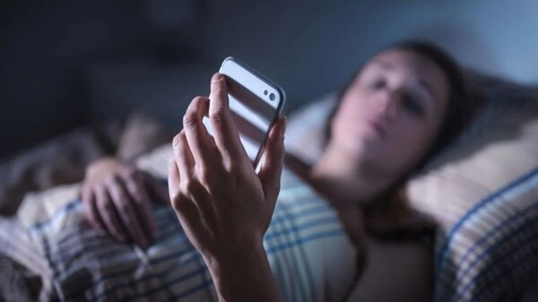

# 현대인들이 쇼츠, 릴스 중독에 대해 알아보자.

## 1. 스마트폰이 주는 건강학적 피해

스마트폰이 있기 전, 조금 더 디테일하게 인터넷이 없던 시절에는 밤이 되면 할 게 없어서 찾아오는 '적당한 지루함'이 방 안에 가득했습니다.

그 지루함을 달래기 위해 인간은 능동적으로 라디오를 켜고, 글을 쓰고, 공상을 하며 뇌를 쉬게 만들었습니다. 밤 11시쯤 되면 자연스럽게 멜라토닌이 분비되어 깊은 잠에 빠져들었죠. 반면 지금은 밤 11시에 침대에 누워도 스마트폰이 지루할 틈을 주지 않아 뇌가 새벽까지 각성 상태로 고문당합니다.

스마트폰이 주는 끊임없는 자극은 과거의 '적당한 지루함'을 빼앗아 우리 뇌에 심각한 부정적 영향을 미칩니다. 밤늦게까지 스마트폰을 사용할 때 발생하는 건강 및 인지 기능상의 정신과적 문제는 다음과 같습니다.

### 1) 뇌 기능 및 인지력 저하 (지능 저하)

- **팝콘 브레인 현상**: 빠르고 강한 자극에만 반응하고 현실의 느린 변화에는 무감각해집니다.
- **뇌 회백질 감소**: 스마트폰 과의존은 전두엽 고유 기능인 사고력과 인지 능력을 떨어뜨립니다.
- **디지털 치매 증상**: 단기 기억을 장기 기억으로 전환하는 능력이 약해져 건망증이 심해집니다.

### 2) 집중력 장애 및 ADHD 위험

- **주의력 결핍 유발**: 도파민이 과다 분비되는 자극에 익숙해져 일상적인 집중이 어려워집니다.
- **유사 ADHD 증상**: 산만함, 충동성, 과잉행동 제어 불가 등 후천적 ADHD 성향이 나타납니다.
- **멀티태스킹의 함정**: 화면을 빠르게 넘기는 습관은 깊이 있는 사유와 끈기 있는 집중을 방해합니다.

### 3) 수면 장애 및 신체 건강 악화

- **멜라토닌 분비 차단**: 화면의 블루라이트가 수면 호르몬 생성을 막아 입면을 방해합니다.
- **생체 리듬 파괴**: 뇌가 밤을 낮으로 인식하여 새벽까지 각성 상태가 유지됩니다.
- **면역력 회복 저하**: 깊은 잠(비렘수면)을 자지 못해 신체 세포 재생과 노폐물 배출이 안 됩니다.

### 4) 감정 조절 및 정신 건강 문제

- **감정 제어력 상실**: 전두엽 기능이 약해지면서 욱하거나 충동적인 분노 조절 장애가 생끌입니다.
- **우울감 및 불안증**: 자극이 끝난 후 찾아오는 공허함과 상대적 박탈감이 우울증을 유발합니다.

## 2. 매체별 중독성 및 현대인 100명 분포 (최종 재검증)

| 지적 활동 및 취미                 | (통제력/의지력) | (서사/남는 것/성취감) | 100중 몇 명 | 냉정한 한줄평                                                   |
|-----------------------------------|-----------------|-----------------------|-------------|-----------------------------------------------------------------|
| 최악: 만성 숏폼 중독              | 5점             | 5점                   | 60          | 알고리즘이 끄는 대로 끌려다니는 영혼 없는 상태                  |
| 유튜브 롱폼(인문학,다큐)          | 40점            | 35점                  | 18          | 자극은 덜하지만 지식 습득의 효울은 영상에 의존.                 |
| 넷플릭스 정주행                   | 50점            | 45점                  | 12          | 수동적 영상주입이나 서사를 끝까지 버텨보는 훈련                 |
| 영화 감상 (1편)                   | 60점            | 55점                  | 5           | 스마트폰을 참고 2시간의 긴 호흡을 견뎌내는 몰입                 |
| 만화책 하루 5권                   | 70점            | 65점                  | 2           | 수동적 자극을 내 통제력으로 바꾼 훌륭한 방어벽                  |
| AI와의 지적 대화 생각 정리        | 80점            | 75점                  | 1           | 내 머릿속 궁금증을 정교한 언어로 출력해 내는 고도의 능동적 행위 |
| 소설책 2시간 읽기                 | 90점            | 85점                  | 1           | 오직 활자만으로 뇌의 100% 상상력을 가동하는 상태                |
| 직접 사전/자료 조사 학술자료 분석 | 95점            | 90점                  | 0.5         | 스스로 정보의 진위여부를 가리고 체계화하는 학구적 집념          |
| 최상: 운동, 연구, 가죽공예, 창작  | 95점            | 95점                  | 0.5         | 몸과 정신의 고통을 이겨내고 무에서 유를 만드는 성취감           |

가) 쇼츠·릴스·틱톡 (중독성: 100)
그룹: \[1 & 2 그룹: 초고위험 및 만성 중독군\]
현대인 100명 중: 약 60명
뇌의 상태: 완전한 수동성

나) 넷플릭스 완결 드라마 정주행 (중독성: 55)
그룹: \[3 그룹: 소외형 경계군\]
현대인 100명 중: 약 20명
뇌의 상태: 비교적 수동성

다) 극장 또는 집에서 영화 1편 온전히 감상 (중독성: 45)
그룹: \[4 그룹: 건강한 조절군 - 진입\]
현대인 100명 중: 약 10명
뇌의 상태: 수동적 시청이나 드라마보다 밀도 높은 2시간의 긴 호흡 인내 필요

라) 플레이스테이션 게임 플레이 (중독성: 30)
그룹: \[4 그룹: 건강한 조절군 - 중급\]
현대인 100명 중: 약 7명
뇌의 상태: 강한 시각 자극이 있으나, 패드를 직접 조작하고 전략을 짜야 하는 높은 능동성

마) 책 2시간 읽기 (중독성: 15)
그룹: \[4 그룹: 건강한 조절군 - 최상위\]
현대인 100명 중: 약 3명
뇌의 상태: 100% 완전한 능동성
