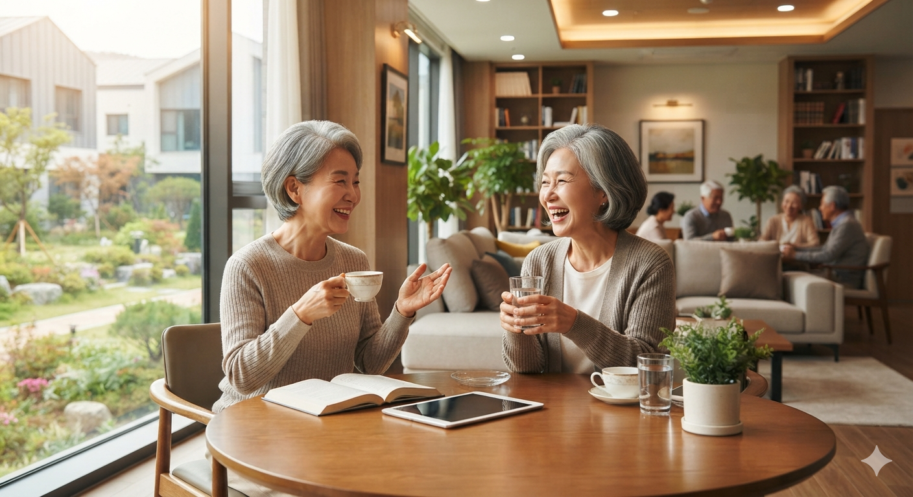

# 대한민국 실버타운 트렌드 변화: 1인 가구 친구 비혼 동반자 주거 문화 확대

대한민국 실버타운은 과거 부부 중심 주거에서 벗어나 1인 가구와 친구·동반자 기반의 선택적 관계망을 중심으로 새로운 노년 주거 문화로 변화하고 있다. 이러한 변화는 단순히 입주자의 숫자 구성 변화가 아니라, 고령층이 노후를 보내는 방식과 가족 개념 자체가 변화하고 있음을 의미한다. 과거 실버타운은 은퇴한 부부가 함께 여생을 보내는 공간으로 인식되었지만, 최근에는 사별·이혼·비혼 증가와 함께 개인의 독립성을 유지하면서도 정서적 연결을 원하는 새로운 형태의 거주 방식이 확대되고 있다.

특히 베이비부머 세대가 본격적으로 고령층에 진입하면서 이러한 변화는 더욱 뚜렷해지고 있다. 이전 세대가 가족과 혈연 중심의 노후를 자연스럽게 받아들였다면, 현재의 액티브 시니어는 자신의 취향과 가치관에 맞는 생활 방식을 직접 선택하려는 성향이 강하다. 이에 따라 실버타운은 단순한 돌봄 시설이 아니라, 독립적인 개인들이 새로운 관계망을 형성하는 **노년기의 라이프스타일 플랫폼**으로 변화하고 있다.

## 핵심 요약

* **실버타운의 주요 입주 형태가 변화하고 있다.** 과거에는 법적 부부 중심의 2인 가구가 일반적이었지만, 현재는 1인 가구·친구·형제자매·비혼 동반자 등 다양한 관계 형태가 등장하고 있다.
* **변화의 핵심 원인은 인구 구조와 가족 가치관의 변화다.** 평균 수명 차이로 인한 사별, 황혼 이혼, 비혼 증가, 개인주의적 노후 설계가 새로운 주거 방식을 만들고 있다.
* **현대 고령층은 혈연보다 선택한 관계를 중요하게 여기기 시작했다.** 취향과 가치관이 맞는 사람들과 형성한 관계가 노년기의 정서적 안전망 역할을 수행하고 있다.
* **실버타운은 수용 시설에서 생활 공간으로 변화하고 있다.** 의료와 돌봄뿐 아니라 문화, 취미, 커뮤니티 활동을 제공하는 복합 주거 공간으로 발전하고 있다.
* **새로운 관계망은 공간 설계에도 영향을 주고 있다.** 1인 특화 주택, 공유 공간, 인접 세대 구조 등 독립성과 연결성을 동시에 확보하는 방식이 중요해지고 있다.
* **비혈연 관계를 지원하는 법·제도 개선이 필요하다.** 의료 대리권, 거주권, 상속 문제 등 기존 가족 제도가 해결하지 못하는 문제가 새로운 과제로 등장하고 있다.

## 1. 대한민국 실버타운은 왜 부부 중심 구조에서 변화하고 있는가?

대한민국의 실버타운 시장은 초고령사회 진입과 함께 새로운 전환점을 맞고 있다. 과거 실버타운은 경제력이 있는 노부부가 은퇴 후 안정적인 생활을 보내기 위한 고급 주거 시설이라는 인식이 강했다. 자녀 세대가 부모를 직접 부양하기 어려워진 상황에서, 부부가 함께 입주해 식사·건강관리·여가생활을 해결하는 형태가 대표적인 모델이었다.

하지만 현재 실버타운의 주요 수요층으로 등장한 베이비부머 세대는 이전 노년층과 다른 특징을 가진다. 1955년부터 1963년 사이 출생한 이들은 경제 성장기를 경험하며 비교적 높은 교육 수준과 자산을 축적했고, 은퇴 이후에도 자신만의 생활 방식과 사회적 관계를 유지하려는 욕구가 강하다.

이들은 노년기를 단순히 보호받는 시기로 바라보지 않는다. 건강이 허락하는 동안 여행, 취미, 문화생활, 인간관계를 적극적으로 유지하려 하며, 자신의 선택권을 중요하게 여긴다. 이러한 변화는 자연스럽게 기존의 **부부 중심 실버타운 모델**에 변화를 요구하고 있다.

과거에는 "누구와 함께 사는가"라는 질문에 대부분 "배우자"라는 답이 가능했다. 그러나 현재 고령층에게 중요한 질문은 "어떤 관계를 선택하고, 어떻게 연결될 것인가"로 이동하고 있다.

이러한 변화의 배경에는 여러 사회적 요인이 복합적으로 작용한다.

* 배우자와의 평균 수명 차이로 인한 사별 증가
* 황혼 이혼과 졸혼 등 부부 관계의 변화
* 평생 미혼으로 살아온 1인 고령층 증가
* 자녀와 별도 거주하는 노년층 증가
* 개인의 취향과 독립성을 중시하는 가치관 확산

결국 실버타운은 더 이상 부부가 함께 입주하는 공간만을 의미하지 않는다. 혼자 살지만 고립되지 않고, 독립적으로 생활하면서 필요한 관계를 선택하는 새로운 노년 주거 모델로 이동하고 있다.

## 2. 인구 구조 변화가 만든 새로운 노년 주거 방식

실버타운의 변화는 개인의 취향 변화만으로 설명하기 어렵다. 가장 근본적인 원인은 대한민국 고령 인구 구조 자체가 변화했기 때문이다.

고령층에서 1인 가구 비중은 지속적으로 증가하고 있다. 특히 여성 고령자의 경우 남성보다 평균 수명이 길기 때문에 배우자 사별 이후 혼자 생활하는 기간이 길어지는 구조적 문제가 존재한다. 통계청 기준으로 2023년 기대수명은 남성이 약 80.6세, 여성이 약 86.6세로 약 6년의 차이가 발생한다.

이 차이는 노년기의 실제 생활 방식에 큰 영향을 준다. 젊은 시절에는 부부가 함께 생활하더라도, 노년기에는 한쪽 배우자가 먼저 사망하면서 남은 배우자가 장기간 혼자 생활하게 되는 경우가 많다.

특히 여성 고령자는 배우자 사망 이후 자녀와 함께 살기보다 독립적인 생활을 선택하는 경우가 증가하고 있다. 과거에는 자녀와 함께 사는 것이 노후의 일반적인 형태였지만, 현재는 세대 간 독립성이 중요해지면서 부모와 자녀 모두 별도 거주를 선호하는 경향이 강해졌다.

이러한 상황에서 실버타운은 단순히 거주 공간을 제공하는 것이 아니라, 혼자 사는 고령자가 사회적 관계를 유지할 수 있는 환경을 제공하는 역할을 하게 된다.

혼자 사는 고령자에게 가장 큰 위험은 신체적 질병뿐 아니라 **사회적 고립**이다. 경제적으로 안정되어 있고 건강한 고령자라도 인간관계가 단절되면 삶의 만족도가 낮아질 수 있다. 따라서 현대 실버타운은 개인 공간과 공동체 공간을 동시에 제공하는 방향으로 발전하고 있다.

과거 모델이 "부부가 함께 노후를 보내는 집"이었다면, 현재 모델은 "개인이 자신의 방식으로 관계를 구성하는 집"으로 변화하고 있는 것이다.

## 3. 가족 중심에서 선택적 관계망 중심으로 변화하는 이유

실버타운의 변화에서 가장 중요한 개념은 **선택적 가족(Chosen Family)**이다.

전통적인 한국 사회에서 가족은 혈연과 혼인을 기반으로 형성되는 것이 일반적이었다. 배우자와 자녀는 노년기의 가장 중요한 관계망이었고, 가족 내부의 돌봄 기능이 노후 안전망 역할을 담당했다.

하지만 현대 사회에서는 이러한 구조가 약화되고 있다. 자녀 세대는 경제적·공간적 이유로 부모와 함께 살기 어렵고, 고령층 역시 자녀에게 의존하는 삶보다 독립적인 생활을 선호한다.

또한 법적 가족 관계가 항상 정서적 안정감을 제공하는 것도 아니다. 가족 간에도 가치관 차이, 상속 문제, 돌봄 부담 등으로 갈등이 발생할 수 있다.

이에 따라 일부 고령층은 혈연이나 혼인이라는 조건보다 실제 생활에서 서로 의지할 수 있는 관계를 더 중요하게 여기기 시작했다.

선택적 관계망은 다음과 같은 특징을 가진다.

* 공통된 취미와 가치관을 기반으로 형성된다.
* 관계 유지의 목적이 의무보다 상호 만족에 있다.
* 개인의 독립성을 유지하면서 정서적 연결을 제공한다.
* 필요할 때 서로 돌봄을 제공하는 생활 안전망 역할을 한다.

예를 들어 실버타운에 입주한 친구 두 명이 있다고 가정하면, 과거에는 한 공간에서 함께 생활하는 형태를 떠올렸지만 현재는 각각 독립된 세대를 유지하면서 낮에는 함께 활동하고 밤에는 각자의 공간으로 돌아가는 방식이 선호된다.

이는 관계의 밀도를 낮추는 것이 아니라, 오히려 장기간 유지 가능한 형태로 조정하는 방식이다. 가까움과 독립성을 동시에 확보하는 새로운 노년 관계 모델이라고 볼 수 있다.

## 4. 실버타운 내부에서 등장하는 새로운 관계 유형

실버타운의 변화는 단순히 1인 가구가 증가하는 현상으로 끝나지 않는다. 핵심 변화는 **노년층이 어떤 방식으로 관계를 구성하고 유지하는가**에 있다. 과거에는 배우자와 가족이 노년기의 중심 관계망이었다면, 현재는 개인이 자신의 상황과 가치관에 맞는 관계를 선택하는 방식으로 이동하고 있다.

이러한 변화 속에서 실버타운 내부에서는 크게 세 가지 새로운 관계 유형이 나타난다.

### 친구·형제자매 동반 입주형

친구 또는 형제자매와 함께 실버타운에 입주하는 형태는 최근 나타나는 대표적인 변화다. 특히 사별이나 이혼 이후 혼자가 된 고령층에서 이러한 형태가 주목받고 있다.

대표적인 사례는 오랜 친구, 동창, 자매 등이 같은 실버타운에 각각 독립된 세대로 입주하는 방식이다. 중요한 점은 친밀한 관계라고 해서 반드시 같은 집에서 생활하려 하지 않는다는 것이다.

노년기에 접어들면 수십 년 동안 형성된 생활 습관과 개인적 취향이 강해지기 때문에, 한 공간에서 함께 생활하는 것은 오히려 갈등의 원인이 될 수 있다. 따라서 새로운 형태의 동반 입주는 **함께 있지만 독립적인 생활을 유지하는 구조**를 선호한다.

이러한 형태는 다음과 같은 방식으로 운영된다.

* 각자 독립된 세대를 계약해 개인 공간을 확보한다.
* 식사, 운동, 문화 프로그램 등 공용 공간에서는 함께 시간을 보낸다.
* 건강 문제나 긴급 상황 발생 시 서로 안부를 확인한다.
* 생활비와 재산은 각자 관리해 경제적 독립성을 유지한다.

이는 전통적인 동거와는 다른 방식이다. 물리적으로 가까이 있으면서도 개인의 영역을 보장하는 것이 핵심이다.

과거 가족 관계에서는 함께 사는 것이 친밀함의 기준이었다면, 현재 고령층에서는 **적절한 거리 유지가 관계를 오래 지속시키는 조건**으로 인식되고 있다.

### 황혼 메이트와 비혼 동반자형

두 번째 변화는 실버타운 내부 또는 외부에서 형성된 황혼기 동반자 관계다. 이는 연인 관계에 가까운 정서적 교류를 유지하지만, 반드시 법적 혼인으로 이어지지는 않는 형태다.

과거 노년기의 새로운 관계는 재혼이라는 선택으로 이어지는 경우가 많았다. 그러나 최근 고령층은 정서적 안정과 생활의 동반이라는 목적과 법적 혼인의 문제를 분리해서 바라보는 경향이 강해졌다.

비혼 동반자 관계를 선택하는 이유는 현실적인 문제가 크다.

* 기존 자녀와의 상속 갈등 가능성
* 재산 관리 및 소유권 문제
* 혼인으로 인한 법적 관계 변화
* 기존 연금 및 복지 제도와 관련된 문제
* 양쪽 가족과의 새로운 관계 형성 부담

따라서 일부 고령층은 법적 혼인보다 서로의 생활을 존중하는 동반자 관계를 선택한다.

이 관계의 핵심은 경제적 결합보다 **정서적 안정과 일상 공유**다. 함께 식사를 하고, 산책을 하고, 여행을 하며 서로의 삶을 보완하지만 재산과 법적 권리는 분리하는 방식이다.

이러한 형태는 기존 가족 제도와 완전히 다른 새로운 관계 모델이라기보다, 고령층이 자신의 현실에 맞게 관계의 형태를 재설계하는 과정으로 볼 수 있다.

### 취미와 가치관 기반 소그룹 공동체형

세 번째 유형은 특정한 한 사람과의 관계보다 여러 사람과 연결되는 소규모 공동체 형태다.

실버타운 내부에는 골프, 수영, 독서, 미술, 음악, 종교 활동 등 다양한 프로그램이 운영된다. 이러한 활동을 통해 입주자들은 자연스럽게 비슷한 관심사를 가진 사람들과 관계를 형성한다.

이러한 관계는 단순한 여가 활동을 넘어 생활 안전망 역할을 한다.

예를 들어 같은 취미 모임에 참여하는 입주자들은 특정 구성원이 며칠 동안 보이지 않으면 이상 여부를 확인하고, 병원 방문이나 생활 지원이 필요한 상황에서 서로 도움을 제공할 수 있다.

이는 기존 가족이 담당했던 일부 기능이 지역 공동체와 선택적 관계망으로 이동하는 현상이다.

다만 이러한 관계는 혈연 가족과 동일하지 않다. 상속이나 법적 보호 같은 권한은 없지만, 실제 일상에서는 가까운 관계망으로 기능할 수 있다.

## 5. 부부 중심 입주가 감소하는 구조적 원인

실버타운에서 부부 중심 입주 비중이 감소하는 현상은 단순히 결혼관 변화 때문만은 아니다. 인구 구조, 건강 문제, 가족 관계 변화가 복합적으로 작용한 결과다.

### 남녀 수명 차이가 만드는 노년기의 비대칭

가장 큰 원인은 남성과 여성의 평균 수명 차이다.

한국 여성은 평균적으로 남성보다 오래 산다. 이 때문에 노년기 부부 중 한쪽이 먼저 사망하는 경우가 많고, 남겨진 배우자가 혼자 생활하는 기간이 길어진다.

특히 남성이 먼저 사망하는 경우가 많기 때문에 실버타운에서는 여성 단독 입주자의 비중이 높아지는 구조가 만들어진다.

또한 단순한 사별뿐 아니라 건강 상태 차이도 영향을 준다. 부부가 같은 공간에 거주하더라도 한쪽 배우자가 치매, 뇌혈관 질환, 암 등 중증 질환을 겪으면 다른 배우자가 간병 부담을 떠안게 된다.

이 과정에서 발생하는 문제는 다음과 같다.

* 건강한 배우자의 신체적 피로 증가
* 간병 과정에서 발생하는 정서적 소진
* 부부 관계 변화
* 전문적인 돌봄 서비스 필요성 증가

결국 일부 고령층은 "부부가 반드시 함께 모든 문제를 해결해야 한다"는 기존 방식에서 벗어나 전문 케어 시스템과 독립적인 생활 공간을 활용하는 방향으로 이동하고 있다.

### 황혼 이혼과 졸혼의 증가

노년층의 관계 변화에서 황혼 이혼과 졸혼 역시 중요한 요인이다.

과거에는 결혼 생활을 유지하는 것이 노년기의 안정이라고 생각하는 경향이 강했다. 하지만 기대수명이 증가하면서 은퇴 이후의 시간이 길어졌고, 남은 인생을 자신의 방식대로 보내고 싶다는 욕구가 커졌다.

이에 따라 일부 부부는 법적으로 이혼하거나, 혼인 관계는 유지하지만 생활 공간과 일상을 분리하는 졸혼을 선택한다.

이러한 변화는 노년기에도 개인의 자율성과 삶의 만족도를 중요하게 생각하는 가치관 확산과 연결된다.

### 개인 중심 라이프스타일의 확산

현재 고령층은 이전 세대와 다른 소비와 생활 문화를 보여준다.

이들은 단순히 안정적인 보호를 원하는 것이 아니라, 자신의 취향과 생활 방식을 유지하기를 원한다.

노년기에도 중요하게 생각하는 요소는 다음과 같다.

* 개인만의 공간
* 취미와 문화생활
* 새로운 인간관계
* 건강 관리
* 자기 결정권

따라서 실버타운 역시 "노인을 위한 시설"이라는 이미지에서 벗어나 "새로운 삶을 설계하는 주거 공간"으로 변화하고 있다.

## 6. 변화하는 실버타운 공간 설계와 주거 모델

새로운 관계망의 등장은 실버타운의 건축 방식에도 직접적인 영향을 주고 있다. 과거에는 부부 중심의 넓은 주거 공간이 중요했다면, 현재는 개인의 독립성과 공동체 활동을 동시에 만족시키는 구조가 요구된다.

### 1인 가구 맞춤형 컴팩트 평면 확대

과거 실버타운은 부부가 함께 생활하는 것을 전제로 비교적 큰 평형 중심으로 구성되는 경우가 많았다. 그러나 최근에는 1인 가구 증가에 대응하기 위해 작은 면적의 효율적인 주거 공간이 중요해지고 있다.

새로운 1인 특화 공간은 단순히 크기를 줄이는 것이 아니라 안전성과 편의성을 강화하는 방향으로 설계된다.

주요 특징은 다음과 같다.

* 낙상 감지 센서
* AI 음성 제어 시스템
* 생활 패턴 분석 기술
* 응급 상황 대응 시스템
* 고령자 동선을 고려한 구조

혼자 생활하더라도 위험 상황에 대응할 수 있도록 스마트 기술을 결합하는 것이다.

### 인접 세대와 커넥팅 구조

친구나 가족처럼 가까운 관계가 같은 공간을 공유하고 싶을 때는 완전한 동거보다 인접 세대 방식이 적합하다.

대표적인 방식은 두 개의 독립 세대를 가깝게 배치하는 것이다.

예를 들면 다음과 같다.

| 구분    | A 세대             | B 세대             |
| ----- | ---------------- | ---------------- |
| 거주자   | 친구 또는 자매 1명      | 친구 또는 자매 1명      |
| 개인 공간 | 독립된 침실·생활 공간 유지  | 독립된 침실·생활 공간 유지  |
| 교류 방식 | 필요할 때 방문         | 필요할 때 방문         |
| 공동 활동 | 식사·운동·문화 프로그램 참여 | 식사·운동·문화 프로그램 참여 |

이 구조는 함께 생활하는 안정감과 혼자 생활하는 자유를 동시에 제공한다.

### 공유 공간 중심의 커뮤니티 강화

개별 세대가 작아지는 대신 공용 공간의 중요성은 더욱 커지고 있다.

현대 실버타운은 카페, 공유 거실, 공동 주방, 취미 공간 등을 통해 자연스러운 만남을 유도한다.

이는 단순한 시설 확장이 아니다. 새로운 관계가 형성될 수 있는 환경을 설계하는 것이다.

과거 주거 공간의 핵심이 "가족이 머무는 집"이었다면, 미래 실버타운의 핵심은 "개인이 연결되는 플랫폼"이 되고 있다.

## 7. 비혈연 동반자 시대가 해결해야 할 법적·제도적 과제

실버타운에서 새로운 관계 형태가 증가하고 있지만, 현재 대한민국의 법과 제도는 여전히 **혈연과 혼인 중심의 가족 체계**를 기반으로 운영되고 있다. 이 때문에 실제 생활에서는 가족과 같은 역할을 수행하는 비혈연 동반자가 법적으로는 아무런 권한을 갖지 못하는 문제가 발생한다.

고령층의 삶에서는 단순한 정서적 관계뿐 아니라 의료, 재산, 거주, 장례 등 중요한 의사결정이 필요하다. 그러나 현행 제도에서는 이러한 권한이 대부분 배우자나 직계 가족에게 집중되어 있다.

비혈연 관계가 직면하는 주요 문제는 다음과 같다.

* **의료 의사결정 권한 부족**
* **거주권 승계 문제**
* **재산 및 상속 문제**
* **장례 및 사후 절차 결정권 문제**

### 의료 대리권 문제

실버타운에서 수년간 함께 생활한 동반자라도, 상대방이 갑작스럽게 의식을 잃거나 긴급한 의료 처치가 필요한 상황에서는 법적 보호자로 인정받기 어렵다.

예를 들어 황혼 동반자가 평소 병원 동행, 건강 관리, 일상 돌봄을 담당하고 있었다 하더라도 의료기관에서는 법적으로 인정된 가족 구성원의 확인을 요구하는 경우가 발생할 수 있다.

이는 실제 돌봄 관계와 법적 권한 사이에 차이가 존재하기 때문이다.

앞으로 고령사회에서는 단순히 가족 여부만으로 보호자를 판단하기보다, 개인이 사전에 지정한 신뢰 관계자에게 일정한 의료 의사결정 권한을 부여하는 제도적 보완이 필요하다.

### 거주권과 계약 문제

실버타운은 일반 주거와 달리 보증금, 입주 계약, 생활 서비스 이용권 등이 결합되어 있다. 따라서 계약자의 사망 이후 남은 동반자의 권리 문제가 복잡해질 수 있다.

예를 들어 한 사람이 실버타운 계약을 체결하고 이후 동반자가 함께 생활했다고 하더라도, 계약자가 사망하면 남은 사람이 자동으로 거주권을 승계받는 것은 아니다.

이 경우 다음과 같은 문제가 발생할 수 있다.

* 기존 거주자의 퇴거 문제
* 보증금 반환 과정에서의 갈등
* 사망자의 자녀와 동반자 간 법적 분쟁
* 장기간 형성된 생활 관계의 보호 부족

이는 앞으로 실버타운 계약 구조가 단순히 개인 단위가 아니라 다양한 동반 관계를 고려해야 함을 보여준다.

### 임의후견제도의 활용 가능성

현재 제도 안에서 고령자가 자신의 의사를 반영할 수 있는 방법 가운데 하나가 **임의후견제도**다.

임의후견은 판단 능력이 유지되는 시기에 본인이 원하는 사람을 후견인으로 지정하고, 이후 판단 능력이 저하되었을 때 재산 관리나 법률 행위를 지원받도록 하는 제도다.

이를 활용하면 혈연 가족이 아닌 신뢰하는 친구나 동반자를 법적 보호 체계 안으로 일부 편입할 수 있다.

하지만 실제 활용에는 절차적 복잡성과 비용 부담이 존재한다. 초고령사회에서는 이러한 제도를 보다 쉽게 접근할 수 있도록 개선하는 논의가 필요하다.

## 8. 해외 고령자 주거 모델이 보여주는 변화 방향

한국보다 먼저 초고령사회에 진입한 국가들은 이미 혈연 중심 가족 구조에서 벗어난 다양한 노년 주거 모델을 발전시켜 왔다.

이들의 공통점은 노인을 보호 대상이 아니라 독립적인 생활 주체로 바라본다는 점이다.

### 일본의 고령자 공동체 모델

일본은 한국보다 먼저 고령화 문제를 경험하면서 다양한 노인 주거 형태를 발전시켰다.

일본의 고령자 주거는 단순한 요양 시설보다 독립 생활이 가능한 고령자 전용 주택과 공동체형 주거 모델에 초점을 맞추고 있다.

주요 특징은 다음과 같다.

* 독립된 개인 주거 공간 제공
* 공용 공간을 통한 사회적 교류 지원
* 고령자의 자립 생활 유지
* 돌봄 서비스와 주거 서비스 결합

특히 일본에서는 고령자가 혈연 가족에게만 의존하지 않고, 지역 공동체와 전문 서비스 네트워크를 활용하는 방향으로 변화하고 있다.

### 미국의 CCRC와 시니어 코하우징

미국에서는 **CCRC(Continuing Care Retirement Community)**라는 형태가 대표적인 고령자 주거 모델이다.

CCRC는 건강 상태 변화에 따라 독립 주거, 생활 지원, 의료 서비스까지 단계적으로 이용할 수 있는 구조다.

또한 시니어 코하우징은 개인 주거 공간과 공동 생활 공간을 결합한 형태다.

특징은 다음과 같다.

* 개인 주택 또는 독립 세대 유지
* 공동 식사 및 커뮤니티 활동
* 비슷한 가치관을 가진 사람들과 생활
* 주민 참여형 공동체 운영

이는 혈연 가족이 아닌 사람들도 안정적인 노년 공동체를 형성할 수 있다는 사례를 보여준다.

### 북유럽의 코하우징 모델

덴마크와 네덜란드 등 북유럽 국가에서는 오래전부터 코하우징 문화가 발달했다.

코하우징은 각자의 독립된 주거 공간을 유지하면서 일부 공간과 활동을 공유하는 방식이다.

이 모델의 핵심은 공동생활이 개인의 자유를 침해하지 않는다는 점이다.

오히려 적절한 공유 공간과 사회적 연결을 통해 고립을 예방하고, 주민 스스로 공동체를 운영한다.

이는 앞으로 한국 실버타운이 나아갈 방향과 연결되는 부분이 많다.

## 9. 실버타운 산업과 사회에 미치는 변화

실버타운 내 관계망 변화는 단순한 주거 트렌드가 아니다. 이는 시니어 산업 전체의 서비스 방식과 시장 전략을 바꾸는 요인이 되고 있다.

기존 실버타운은 주거 공간과 의료 서비스를 중심으로 경쟁했다. 그러나 앞으로는 어떤 관계를 만들고 유지할 수 있는 환경을 제공하는지가 중요한 경쟁력이 될 가능성이 높다.

### 시니어 비즈니스 전략의 변화

실버타운 운영사는 더 이상 "노부부를 위한 공간"이라는 기존 관점에서 벗어나야 한다.

앞으로 중요한 전략은 다음과 같다.

* 1인 고령자를 위한 맞춤형 주거 상품 개발
* 친구·동반자 입주를 고려한 계약 방식 개선
* 입주자 간 관계 형성을 돕는 커뮤니티 프로그램 운영
* 취미와 가치관 기반 소그룹 지원
* 개인 맞춤형 스마트 케어 서비스 제공

특히 커뮤니티 매니저 역할이 중요해질 가능성이 높다.

과거 관리자의 역할이 시설 운영과 안전 관리였다면, 미래 관리자는 입주자가 새로운 관계를 형성하고 공동체에 적응하도록 돕는 역할까지 수행해야 한다.

### 스마트 기술과 프라이버시의 균형

고령자 주거에서 기술 활용도 더욱 중요해지고 있다.

AI 기반 건강 관리, 낙상 감지, 생활 패턴 분석 등은 1인 가구 고령자의 안전을 높이는 데 도움을 줄 수 있다.

하지만 기술이 지나치게 개입하면 개인의 사생활을 침해할 수 있다.

따라서 미래 실버타운은 "감시"가 아니라 "필요할 때 도움을 제공하는 기술"을 목표로 해야 한다.

## 10. 대한민국 노년 주거의 미래 방향

실버타운의 변화는 결국 가족이라는 개념 자체가 변화하고 있음을 보여준다.

과거 노년기의 안정은 배우자와 자녀라는 혈연 관계 안에서 확보되는 것으로 여겨졌다. 그러나 초고령사회에서는 하나의 가족 형태만으로 모든 노년층의 삶을 설명하기 어렵다.

앞으로는 다양한 관계 형태가 공존하게 될 가능성이 높다.

* 배우자와 함께 생활하는 부부형
* 혼자 독립적으로 생활하는 1인형
* 친구와 인접 거주하는 동반형
* 취미와 가치관 기반 공동체형
* 비혼 동반자형

중요한 것은 특정 관계 형태를 정답으로 규정하는 것이 아니다. 고령자가 자신의 상황과 가치관에 맞는 방식을 선택할 수 있는 환경을 만드는 것이다.

## 결론

대한민국 실버타운의 변화는 단순한 주거 상품의 변화가 아니라 **노년기의 관계와 가족 개념이 재구성되는 과정**이다. 과거에는 법적 부부와 혈연 가족이 노후 생활의 중심이었다면, 앞으로는 개인이 선택한 관계망과 공동체가 중요한 역할을 담당하게 될 가능성이 높다.

이러한 변화는 고령층이 가족을 포기한다는 의미가 아니다. 오히려 기존 가족 제도가 담당하기 어려워진 역할을 새로운 사회적 관계가 보완하는 과정으로 이해할 필요가 있다. 독립성과 연결성을 동시에 원하는 현대 고령층에게 중요한 것은 함께 사는 방식이 아니라, 자신에게 맞는 관계를 선택할 수 있는 자유다.

실버타운 역시 이에 맞춰 변화해야 한다. 좋은 실버타운의 기준은 단순히 넓은 공간이나 고급 시설을 제공하는 것이 아니라, 입주자가 안전하게 자신의 삶을 유지하면서 필요한 관계를 형성할 수 있는 환경을 제공하는 데 있다.

초고령사회에서 노년의 삶의 질을 결정하는 핵심 요소는 단순한 수명이 아니다. **어떤 공간에서, 어떤 사람들과, 어떤 방식으로 연결되어 살아가는가**가 새로운 기준이 될 것이다.

## 자주 묻는 질문(FAQ)

### 실버타운은 앞으로 부부보다 1인 입주자가 많아질까?

그럴 가능성이 높다. 사별, 이혼, 비혼 증가와 함께 독립적인 노후 생활을 원하는 고령층이 증가하면서 1인 중심 주거 수요는 계속 확대될 것으로 예상된다.

### 친구와 함께 실버타운에 입주할 수 있을까?

가능한 경우가 많다. 다만 일반적으로는 같은 공간에서 함께 생활하기보다 각각 독립된 세대를 계약하고 가까운 위치에서 생활하는 방식이 선호된다.

### 황혼 동반자는 법적으로 가족과 같은 권리를 가질 수 있을까?

현재 대한민국 제도에서는 혼인이나 혈연 가족과 동일한 권리를 자동으로 인정받기는 어렵다. 의료, 재산, 거주 문제에서 별도의 법적 준비가 필요하다.

### 실버타운은 요양시설과 어떻게 다른가?

실버타운은 기본적으로 독립적인 생활이 가능한 고령자를 위한 주거 공간이다. 반면 요양시설은 일상생활 지원과 전문적인 돌봄이 필요한 사람을 대상으로 한다.

### 미래 실버타운에서 가장 중요한 요소는 무엇인가?

앞으로는 시설 규모보다 개인의 독립성을 보장하면서 사회적 관계를 형성할 수 있는 커뮤니티 설계가 중요한 경쟁력이 될 가능성이 높다.

