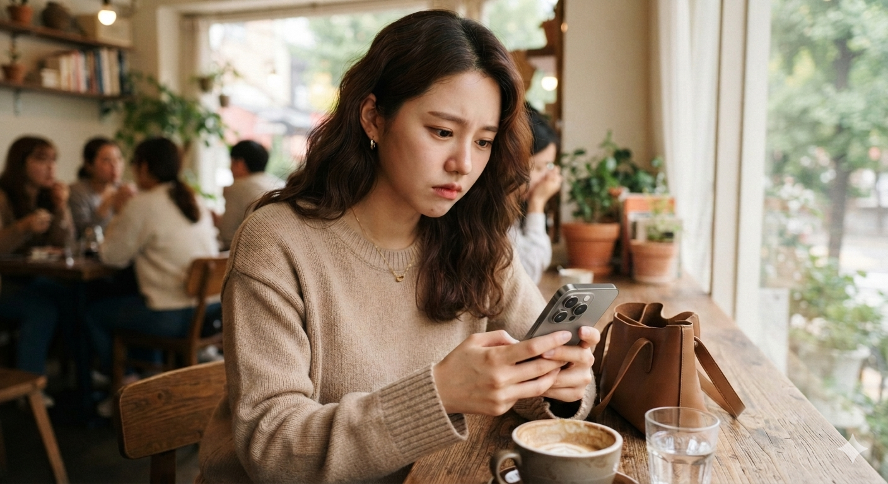

# SNS 트렌드 분석 인스타그램 타인 과시 심리 비교와 자랑

2026년 SNS 이용 행태는 과시 중심에서 기록과 정보 공유 중심으로 변화하고 있지만, 타인의 SNS는 여전히 과시적이라고 인식하는 강한 심리적 괴리를 보여준다. 소셜미디어는 이제 단순한 온라인 소통 공간을 넘어 개인의 일상, 가치관, 사회적 관계를 동시에 드러내는 생활 플랫폼이 되었다. 그러나 이용 방식이 성숙해졌음에도 사람들은 자신의 행동과 타인의 행동을 전혀 다른 기준으로 평가하는 경향을 보인다. 이러한 인식의 비대칭성은 단순한 개인 성향이 아니라 현대 사회와 한국 문화가 결합하면서 나타나는 사회심리학적 현상으로 해석할 수 있다.

## 핵심 요약

* **SNS 이용 목적은 자기 과시 일변도에서 벗어나고 있다.** 자기 과시(39.0%), 일상 기록(32.7%), 정보 공유(28.3%)가 비교적 균형을 이루며 공존한다.
* **11년 동안 이용 방식은 크게 변했다.** 좋은 평가를 받기 위한 게시물 선별과 공감을 얻기 위한 게시물 작성은 모두 큰 폭으로 감소했다.
* **좋아요와 댓글에 대한 의존성도 낮아지고 있다.** 이용자 상당수는 SNS 반응보다 자신의 만족을 우선하는 방향으로 이동하고 있다.
* **그러나 타인의 SNS에 대한 평가는 여전히 부정적이다.** 많은 사람은 다른 이용자들이 SNS를 과시 목적으로 사용한다고 인식한다.
* **이러한 괴리는 이후 제3자 효과와 자기 고양 편향으로 설명할 수 있으며**, 한국 사회의 평판 중심 문화와도 깊게 연결된다.

## 1. SNS는 어떻게 현대인의 일상을 바꾸었는가?

SNS는 처음 등장했을 때만 해도 친구와 연락하거나 사진을 공유하는 보조적인 서비스에 가까웠다. 그러나 스마트폰 보급과 모바일 네트워크의 발전 이후 소셜미디어는 인간관계의 중심 공간으로 빠르게 이동했다. 이제 사람들은 여행, 식사, 취미, 소비, 공부, 업무까지 대부분의 일상을 디지털 공간에 기록하며 살아간다.

이러한 변화는 단순히 기술의 발전만으로 설명하기 어렵다. SNS는 현실의 자신을 온라인 공간에서 다시 구성할 수 있는 플랫폼을 제공했다. 이용자는 사진을 선택하고 문장을 다듬으며 자신이 보여 주고 싶은 모습을 스스로 편집할 수 있게 되었다. 즉, SNS는 현실을 기록하는 공간이면서 동시에 **자아를 표현하는 무대**가 되었다.

이 때문에 SNS를 둘러싼 논의는 항상 두 가지 질문으로 이어진다.

* 사람들은 왜 자신의 일상을 공개하는가?
* SNS는 진짜 일상을 보여 주는 공간인가?

이 질문에 답하기 위해서는 실제 이용 목적부터 살펴볼 필요가 있다.

## 2. SNS 게시물을 올리는 목적은 어떻게 변화했는가?

2026년 조사 결과를 보면 SNS 이용 목적은 과거보다 훨씬 다양해졌다.

| 게시물 업로드 목적 | 비율 |
| --- | ---: |
| 자기 과시 | 39.0% |
| 일상 기록 | 32.7% |
| 정보 공유 | 28.3% |

가장 높은 비율은 **자기 과시**(**39.0%**)였다. 여행, 자동차, 맛집, 소비, 취미 등을 통해 자신의 라이프스타일을 표현하려는 욕구는 여전히 SNS의 중요한 동력으로 작용한다.

그러나 흥미로운 점은 과시가 절대적인 목적이 아니라는 사실이다.

**일상 기록**(**32.7%**)은 과시와 큰 차이를 보이지 않았다. 스마트폰 카메라의 발전과 클라우드 저장 환경이 보편화되면서 SNS는 개인의 사진첩이자 디지털 일기로 기능하기 시작했다. 과거처럼 타인의 반응을 얻기 위해서가 아니라 자신의 추억을 남기기 위해 게시물을 올리는 이용자가 꾸준히 증가한 것이다.

또한 **정보 공유**(**28.3%**) 역시 중요한 목적 가운데 하나였다.

* 맛집 후기
* 여행 정보
* 제품 사용기
* 취미 활동
* 전문 지식

이처럼 SNS는 단순한 자기 홍보 공간이 아니라 정보 교환 플랫폼으로도 활용되고 있다.

결국 오늘날 SNS는 하나의 목적만으로 설명하기 어렵다. 과시와 기록, 정보 공유가 서로 경쟁하는 것이 아니라 동시에 공존하며 개인마다 서로 다른 비중으로 작동하는 **복합적인 자아 표현 공간**으로 변화한 것이다.

## 3. 11년 동안 이용 방식은 어떻게 달라졌는가?

2015년과 2026년을 비교하면 가장 눈에 띄는 변화는 **타인의 반응에 대한 의존성이 크게 감소했다는 점**이다.

첫 번째 변화는 게시물을 선택하는 기준이다.

| 문항 | 2015년 | 2026년 |
| --- | ---: | ---: |
| 좋은 평가를 받을 게시물을 올린다 | 39.6% | 24.5% |

11년 동안 무려 **15.1%포인트 감소**했다.

이는 사람들이 타인의 좋은 평가를 받기 위해 자신의 이미지를 지나치게 연출하는 데 점점 피로감을 느끼기 시작했음을 보여 준다.

두 번째 변화는 공감에 대한 기대다.

| 문항 | 2015년 | 2026년 |
| --- | ---: | ---: |
| 공감을 받기 위해 글을 올린다 | 41.2% | 22.7% |

이 역시 **18.5% 포인트 감소**했다.

SNS 초창기에는 댓글과 공감을 통해 정서적 만족을 얻으려는 경향이 강했다. 그러나 시간이 지나면서 사람들은 온라인 공감이 지속적인 만족으로 이어지지 않는다는 사실을 경험하게 되었다.

세 번째 변화는 좋아요와 댓글에 대한 집착이다.

2026년 기준으로 **좋아요나 댓글이 적으면 신경이 쓰인다**고 응답한 비율은 30.9%였다. 반대로 말하면 약 70%는 SNS 반응이 기대보다 적더라도 크게 개의치 않는다는 의미다.

이러한 변화는 단순한 수치 이상의 의미를 가진다.

SNS는 오랫동안 타인의 평가를 실시간으로 확인하는 플랫폼이었다. 그러나 이용 경험이 축적되면서 사람들은 디지털 피로감을 학습했고, 점차 외부 평가보다 자신의 만족을 우선하는 방향으로 행동을 수정하기 시작했다.

즉, **SNS 이용 방식은 타인의 인정에서 개인의 자율성으로 조금씩 이동하고 있는 과정**이라고 해석할 수 있다.

## 4. 그런데 왜 사람들은 다른 이용자들은 모두 과시한다고 생각하는가?

흥미로운 점은 자신의 행동과 타인의 행동을 바라보는 기준이 전혀 다르다는 사실이다. 조사 결과는 이를 명확하게 보여 준다.

| 항목 | 비율 |
| --- | ---: |
| 자신의 게시 목적이 자기 과시 | 39.0% |
| SNS에는 자기 과시하는 사람이 많다 | 72.9% |
| 모두 행복한 모습만 보여 주는 것 같다 | 65.0% |

자신은 기록도 하고 정보를 공유하기도 하지만, 다른 사람들은 대부분 과시를 위해 SNS를 이용한다고 생각하는 것이다.

이 차이는 단순한 통계 차이가 아니다.

자신의 행동은 여러 상황과 맥락을 알고 있기 때문에 다양한 이유를 함께 고려한다. 반면 타인의 행동은 게시물이라는 결과만 보고 판단한다. 따라서 같은 사진이라도 자신에게는 "추억을 기록한 사진"이지만 타인에게는 "과시하기 위한 사진"으로 해석하기 쉽다. 이러한 인식의 비대칭성은 단순한 SNS 문화가 아니라 인간의 인지 구조 자체와 관련되어 있다.

## 5. 제3자 효과는 왜 SNS에서 더욱 강하게 나타나는가?

앞서 살펴본 것처럼 자신의 게시 목적을 **자기 과시**라고 인정한 비율은 39.0%였지만, 다른 사람들이 SNS에서 자기 과시를 많이 한다고 응답한 비율은 무려 72.9%에 달했다. 같은 공간을 이용하는 사람들이 이처럼 서로 다른 판단을 내리는 이유는 사회심리학에서 말하는 **제3자 효과**(**Third-Person Effect**)로 설명할 수 있다.

제3자 효과란 미디어가 자신에게는 큰 영향을 미치지 않지만, 다른 사람들에게는 훨씬 더 강하게 영향을 준다고 믿는 인지적 편향을 의미한다.

SNS에서는 이러한 현상이 더욱 쉽게 나타난다.

자신의 게시물은 작성 과정과 상황을 모두 알고 있다.

예를 들어 기념일에 방문한 레스토랑 사진을 올렸다면 자신은 그것을 "기념일 기록"으로 기억한다. 여행 사진 역시 "추억을 남기기 위한 기록"이라고 생각한다. 그러나 타인의 게시물은 그 배경을 전혀 알 수 없다. 화면에 보이는 결과만 보고 판단하기 때문에 자연스럽게 "**보여 주기 위해 올렸겠구나.**"라는 해석을 하게 된다.

여기에 **자기 고양 편향**(**Self-Serving Bias**)도 함께 작동한다.

인간은 자신의 행동은 긍정적으로 해석하려는 경향이 있다.

* 내 사진은 기록이다.
* 내 소비는 경험이다.
* 내 여행은 추억이다.

반면 같은 행동을 하는 타인에게는 다른 기준을 적용한다.

* 저 사람은 자랑하려고 올렸다.
* 저 사진은 보여 주기 위한 것이다.
* 저 소비는 과시다.

객관적으로 보면 같은 행동일 수도 있지만, 평가 기준이 달라지면서 전혀 다른 결론이 만들어지는 것이다.

또 하나 주목해야 할 요소는 **플랫폼 알고리즘**이다.

인스타그램이나 페이스북은 이용자의 체류 시간을 늘리기 위해 시각적으로 강한 콘텐츠를 우선적으로 추천한다.

* 고급 레스토랑
* 해외여행
* 명품
* 자동차
* 화려한 라이프스타일

이러한 콘텐츠는 일반적인 일상보다 훨씬 눈에 잘 띄기 때문에 이용자는 플랫폼 전체가 과시적인 콘텐츠로 가득하다는 착각을 하기 쉽다. 실제로는 다양한 게시물이 존재하지만 알고리즘은 가장 자극적인 일부를 반복적으로 노출시키기 때문이다.

결국 사람들은 자신의 SNS는 평범하다고 생각하면서도, 타인의 SNS는 과시와 허영으로 가득 차 있다고 인식하는 역설적인 결론에 도달하게 된다.

## 6. 한국 사회의 평판 문화는 이러한 인식을 어떻게 강화하는가?

이러한 심리적 편향은 한국 사회의 문화적 특성과 결합하면서 더욱 강해진다. 이번 조사에서는 평판과 관련된 문항에서도 매우 높은 수치가 나타났다.

| 항목 | 비율 |
| --- | ---: |
| 남들에게 모나지 않은 사람으로 보이고 싶다 | 68.3% |
| 회사·학교에서 인정받고 싶다 | 67.6% |
| 좋은 사람이라는 이미지를 남기고 싶다 | 66.1% |

세 문항 모두 약 3명 가운데 2명이 동의한 수준이다. 이는 한국 사회에서 **평판 관리**가 여전히 중요한 사회적 자산으로 작동하고 있음을 보여 준다.

한국은 개인보다 집단 속 관계를 중요하게 여기는 문화적 특성이 비교적 강한 사회다. 학교, 회사, 가족, 지역사회처럼 다양한 공동체 안에서 타인의 평가가 개인의 사회적 위치와 연결되는 경우가 많다. 자연스럽게 사람들은 SNS에서도 자신의 모든 모습을 공개하기보다 **평판에 도움이 되는 모습만 선택적으로 공개**하게 된다.

흥미로운 점은 이러한 사실을 모두가 알고 있다는 것이다. 나 역시 사진을 고르고 문장을 수정한다.

다른 사람도 같은 과정을 거친다는 사실을 알고 있기 때문에, 타인의 게시물을 볼 때는 더욱 쉽게 "실제 삶이 아니라 잘 편집된 모습일 것이다."라고 의심하게 된다.

즉, **자신도 편집하고 있으므로 타인도 편집하고 있을 것이라고 추론하는 구조**가 형성되는 것이다.

이러한 상호 의심은 시간이 지날수록 강화된다.

타인은 자신의 좋은 모습만 올리고 있을 것이라고 생각하기 때문에 상대와 자신을 비교하게 되고, 비교가 반복될수록 SNS는 소통 공간보다 경쟁 공간처럼 인식되기 시작한다.

결국 한국 사회의 평판 중심 문화는 SNS를 단순한 기록 공간이 아니라 끊임없이 자신을 관리해야 하는 무대로 만드는 중요한 배경이 된다.

## 결론

이번 조사 결과는 SNS 이용 방식이 과거보다 분명히 성숙해지고 있음을 보여 준다. **좋아요와 댓글에 대한 의존성은 감소했고, 공감을 얻기 위한 과도한 게시나 좋은 평가를 의식한 이미지 관리 역시 2015년에 비해 크게 줄어들었다.** SNS는 점차 타인의 인정보다 자신의 기록과 정보 공유를 위한 공간으로 이동하는 모습을 보이고 있다.

그러나 이러한 변화가 곧 **타인의 시선으로부터 완전히 자유로워졌다는 의미는 아니다.** 사람들은 자신의 게시물은 다양한 맥락을 가진 기록으로 이해하면서도, 타인의 게시물은 과시와 허영의 결과로 해석하는 경향을 여전히 보였다. 이러한 인식의 비대칭성은 제3자 효과와 자기 고양 편향 같은 인지적 특성뿐 아니라, 평판을 중요하게 여기는 한국 사회의 문화적 배경과도 깊이 연결되어 있다.

결국 오늘날의 SNS는 단순히 사진과 글을 올리는 플랫폼이 아니다. 한편으로는 개인의 **주체적인 디지털 아카이브**로 기능하면서도, 다른 한편으로는 타인의 시선과 사회적 평판을 끊임없이 의식하게 만드는 **평판의 무대**이기도 하다. 이용 방식은 분명 변화하고 있지만, 인간이 타인을 바라보는 심리와 사회가 요구하는 평판 관리의 구조는 여전히 SNS 문화의 핵심을 이루고 있다고 볼 수 있다.

## 자주 묻는 질문(FAQ)

### SNS 이용자들은 과거보다 자기 과시를 덜 하게 되었는가?

조사 결과를 보면 좋은 평가를 받기 위한 게시물 선별과 공감을 얻기 위한 게시물 작성은 2015년에 비해 모두 큰 폭으로 감소했다. 이는 과시 중심의 이용 방식이 일부 완화되고 있음을 시사한다.

### 왜 사람들은 다른 사람의 SNS는 과시적이라고 생각하는가?

자신의 행동은 상황과 맥락을 함께 고려하지만, 타인의 행동은 게시물 결과만 보고 판단하기 때문이다. 여기에 제3자 효과와 자기 고양 편향이 더해져 인식의 차이가 발생한다.

### 좋아요와 댓글은 이제 중요하지 않은가?

과거보다 중요성이 낮아진 것은 사실이다. 하지만 좋아요에 대한 관심이 줄었다고 해서 타인의 시선을 완전히 의식하지 않게 된 것은 아니다. 평판 관리는 여전히 중요한 심리적 요인으로 남아 있다.

### 한국에서는 왜 평판 관리가 특히 중요한가?

집단 속에서의 관계와 사회적 평가를 중요하게 여기는 문화적 특성이 비교적 강하기 때문이다. 이러한 특성은 온라인에서도 자신을 신중하게 표현하도록 만드는 배경이 된다.

### 앞으로 SNS 문화는 어떤 방향으로 변화할 가능성이 높은가?

현재 추세가 이어진다면 즉각적인 반응을 얻기 위한 이용보다 개인 기록과 정보 축적, 관심사가 비슷한 사람들 사이의 소규모 소통이 더욱 중요한 이용 방식으로 자리 잡을 가능성이 크다.
