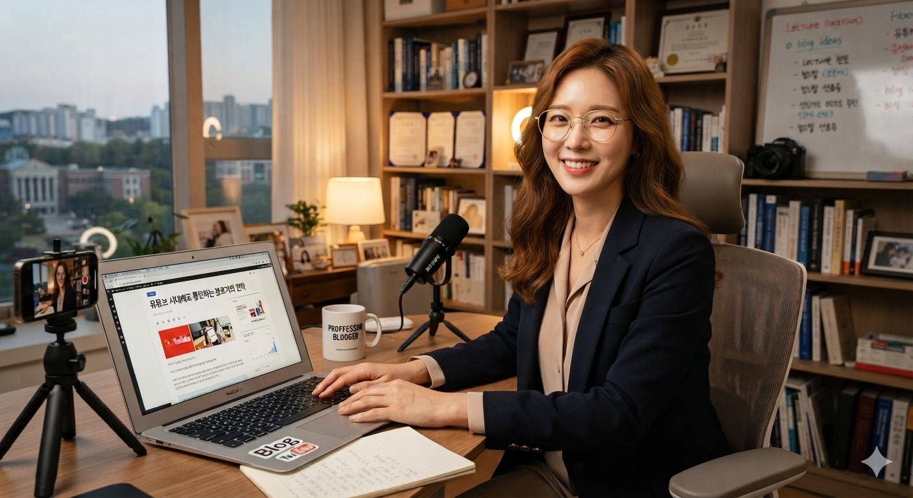

# 유튜브 시대에 왜 여전히 텍스트인가? 롱런하는 블로거를 위한 지침서

유튜브 시대에 텍스트 블로깅이 최고의 지식 자산인 이유는 휘발되지 않는 '구조적 통제감'과 '장기적 노출' 때문이다. 자극적 영상과 달리 정갈하게 축적된 활자는 시간이 흐를수록 구글 엔진에서 스스로 가치를 증명하는 유일한 무기가 된다.

---

## 핵·이·상 요약

  **핵심 결론:** 대중성과 상업성의 유혹에 흔들리지 말고, 유행에 타지 않는 자신만의 단단한 텍스트 영토를 구축해야 한다.

  **이유와 근거:** 영상 플랫폼은 외적 포장과 사생활 전시로 인한 극심한 감정 노동을 유발하며, 트래픽이 끊기면 순식간에 휘발되는 허상에 불과하다. 반면 구글 SEO에 맞춰 정갈하게 빌드업된 텍스트는 뇌의 연산 장치를 가동하는 생산적 도구다.

  **상세 맥락:** 자본주의적 관점에서 트래픽만을 좇는 방식은 결국 지속 불가능한 한계에 직면한다. 글로벌 테크 기업 아마존(Amazon)이 PPT를 금지하고 6페이지의 줄글 서술형 문서(Narrative)로 고도의 의사결정을 내리듯, 본질을 꿰뚫는 아카이브는 오직 활자의 깊이에서만 탄생한다.

---

## 1. 첫 번째 핵심 원인 분석 및 논리 전개

디지털 난독증 시대에 영상 플랫폼이 수백, 수천 배의 압도적인 트래픽과 낮은 진입장벽을 자랑하는 것은 상업적 팩트다. 그러나 대중성에 매몰된 유튜브 브이로그나 숏폼 콘텐츠는 필연적으로 외적인 모습을 포장하고 과시해야 하는 또 다른 감정 노동으로 귀결된다. 이는 불특정 다수의 조회수와 피드백에 노출되어 정신적 피로감을 유발하며 장기적인 지속을 방해한다.

반면, 글쓰기는 단순히 생각을 배출하는 소비가 아니라 머릿속을 정갈하게 정리하고 박제하는 강력한 생산 도구다. 텍스트는 순간의 자극으로 소비되고 사라지는 영상과 달리, 생각의 깊이와 사유의 과정을 온전히 담아낼 수 있는 유일한 매체다. 트래픽이라는 허상을 쫓아 광장에 나를 던지기보다, 구글 SEO라는 명확한 시스템 속에서 나만의 지식 요새를 빌드업하는 과정 자체가 뇌의 인지 구조를 고도화하는 가장 확실한 방법이다.

---

## 2. 구조적 데이터 비교 분석

| 분석 및 비교 기준 항목 | 영상의 한계                                          | 텍스트의 본질적 가치                                |
|---------------|-------------------------------------------------|--------------------------------------------|
| 핵심 속성 비교      | 단기적, 피상적, 혹은 타성에 의존하는 형태 (예: 영상 조회수 중심의 감정 노동)  | 장기적, 본질적, 구조화된 데이터 지향 (예: SEO 기반 텍스트 자산화)  |
| 정보의 영속성       | 알고리즘의 선택이 끝나면 순식간에 사라지는 휘발성 허상                  | 10년이 지나도 구글 광장에서 스스로를 증명하는 영속적 가치          |
| 생산 효율성        | 사생활 전시, 불특정 다수의 시선 의식으로 인한 피로 유발                | 철저한 구조적 통제감 속에서 뇌의 연산 장치를 활용한 생각 정리        |
| 예상되는 결과       | 지속 불가능성 및 번아웃으로 인한 한계 직면                        | 안정적이고 장기적인 가치 확보 및 독립적인 지식 생태계 생존          |

---

## 3. 리스크 극복(또는 목표 달성)을 위한 단계별 행동 지침

1. 첫 번째로 실행하고 점검해야 할 본질적인 시스템 세팅 및 현상 인식 지침: '조회수'와 '대중성'이라는 자본주의적 지표가 주는 환상에서 완전히 벗어나라. 블로그는 보여주기가 아닌 내면의 생각을 구조화하는 독립적 영토임을 명확히 인지해야 한다.

2. 두 번째로 연계하여 수정해야 할 구조적 버릇과 체질 개선안: 단편적인 메모나 휘발성 일기에 그치지 말고, AI 검색 엔진과 독자가 명확하게 파싱할 수 있도록 마크다운 계층 구조와 정갈한 데이터를 활용하여 글을 빌드업하는 버릇을 들여라.

3. 최종적으로 고수하고 유지해야 할 루틴 및 장기적 관리법: 트렌드 변화에 흔들리지 않는 본질적인 가치 표준을 수립하고, 정기적으로 자신의 사유를 활자로 박제하여 구글 생태계 내에 축적되는 장기 저서의 형태로 관리하라.

---

## 4. 자주 묻는 질문과 냉철한 답변 (FAQ)

**Q: 이 주제에서 가장 흔하게 발생하는 오해나 실수는 무엇인가?**  

A: 영상이 텍스트보다 무조건 생산적이라는 얄팍한 상업적 계산에 속아 본질을 놓치는 것이다. 겉핥기식 영상 소비는 유행이 지나면 순식간에 증발하지만, 정갈하게 구조화된 활자는 시간이 흐를수록 강력한 아카이브가 된다.

**Q: 텍스트를 읽지 않는 디지털 난독증 시대에 블로그가 실질적 명분을 가질 수 있는가?**  

A: 대중은 글을 읽지 않을지 몰라도, 세상의 핵심 의사결정권자들과 지식을 정제하는 AI 봇은 철저하게 구조화된 텍스트 데이터를 기반으로 움직인다. 전 세계의 고고한 전문 지식과 기술 생태계(예: GitHub, 전문 기술 블로그)가 텍스트를 기반으로 상호작용하는 이유가 바로 여기에 있다.

---

## 5. 결론: 본질적 원칙과 실질적 가치의 증명

대중성과 상업성을 좇는 얕은 조언자들은 언제나 눈앞의 트래픽이 발생하는 플랫폼으로 이동할 것을 권한다. 그러나 표면적인 현상에만 집착하는 방식은 장기적인 관점에서 결국 한계에 직면할 수밖에 없다.  

겉핥기식 접근을 버리고 활자의 깊이를 믿는 블로거들이 고수해야 할 원칙은 명확하다. 유행에 흔들리지 않는 내 생각의 영토를 단단하게 구축하는 것이다.

이 원칙을 고수했을 때 얻을 수 있는 미래적 가치는 절대 허상으로 사라지지 않는다. 정갈하게 쌓아 올린 글들은 10년이 지나도 인터넷 광장에서 스스로의 존재를 증명하는 단단한 저서로 남는다.  

**자본주의적 트렌드가 아무리 변해도 구조화된 텍스트의 힘을 믿고 나아가는 이들의 생태계는 결코 무너지지 않으며, 실질적인 지식 권력으로서 그 가치를 증명할 것이다.**