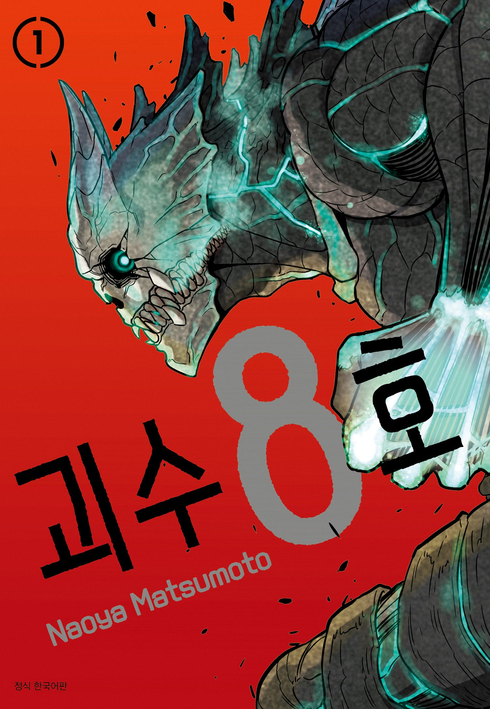

# 괴수 8호 정체는 무엇일까? 카프카를 선택한 소형 괴수의 비밀

처음 《괴수 8호》를 보면 가장 큰 의문은 하나다. 카프카 몸속으로 들어간 작은 괴수는 도대체 무엇이며 왜 하필 카프카를 선택했을까? 초반에는 외계 생명체나 미지의 괴수라는 추측도 많았지만, 작품 후반부에서 모든 진실이 밝혀진다. 이 설정은 단순히 주인공에게 힘을 주는 장치가 아니라, 수백 년 동안 이어진 인간과 괴수의 싸움을 하나로 연결하는 핵심 반전이기도하다.

---

## 핵심 요약

* 카프카 몸속의 소형 괴수는 외계인이 아니다.
* 정체는 메이레키 대화재 당시 전사한 토벌자들의 원혼이 모인 존재다.
* 카프카를 선택한 이유는 강한 정의감과 괴수를 없애려는 의지 때문이다.
* "찾았다"라는 대사는 우연이 아닌 숙주를 발견했다는 의미다.
* 괴수 8호는 인류를 멸망시키는 존재가 아니라 인류를 지키기 위한 힘이다.
* 최종 결전 이후 원혼들은 숙원을 이루고 성불한다.
* 메이레키 대괴수와 괴수 9호의 관계를 이해하면 세계관이 훨씬 선명해진다.

## 소형 괴수의 정체는 원혼이 만든 존재였다

작품 초반에는 카프카 몸속으로 들어간 작은 괴수의 정체가 전혀 설명되지 않는다. 그래서 독자들 사이에서는 외계 생명체, 고대 괴수, 미지의 기생 생물 등 다양한 추측이 나왔다.

하지만 후반부에서 밝혀진 공식 설정은 예상과 전혀 달랐다.

소형 괴수는 1657년 메이레키 대화재 당시 메이레키 대괴수와 싸우다 목숨을 잃은 방위대 토벌자들의 의지와 원한이 수백 년 동안 괴수의 힘과 융합하면서 탄생한 존재였다.

즉 살아있는 생물이 아니라 인간의 의지가 만들어 낸 특수한 존재다. 작품은 이를 통해 괴수의 힘도 결국 사용하는 존재의 의지에 따라 전혀 다른 결과를 만들 수 있다는 점을 보여준다.

## 카프카를 선택한 이유와 '찾았다'의 의미

카프카가 소형 괴수와 만났을 때 가장 먼저 들은 말은 "찾았다."였다.

처음에는 아무 의미 없는 연출처럼 보이지만, 후반부를 보면 이 한마디에 모든 이유가 담겨 있다.

카프카는 어린 시절부터 미나와 함께 괴수를 모두 없애겠다는 약속을 했고, 방위대 입대에 계속 실패하면서도 그 꿈을 포기하지 않았다. 청소부가 된 이후에도 누구보다 괴수의 위험성과 희생을 가까이에서 지켜본 인물이다.

수백 년 동안 메이레키 대괴수를 쓰러뜨리지 못한 원혼들은 자신들과 같은 의지를 가진 인간을 찾고 있었고, 결국 카프카를 완벽한 숙주로 선택했다.

괴수의 힘을 원하는 인간이 아니라, 인간을 지키기 위해 괴수의 힘을 사용할 사람을 찾은 것이다.

## 메이레키 대괴수와 괴수 9호의 관계

메이레키 대괴수와 괴수 9호는 별개의 최종 보스가 아니다.

메이레키 대괴수는 에도 시대를 공포에 빠뜨린 거대한 재앙이었고, 엄청난 육체와 재생 능력을 가진 존재였다. 하지만 지성은 낮았다.  
반대로 괴수 9호는 뛰어난 학습 능력과 지능을 가진 괴수였다. 이후 메이레키 대괴수의 힘을 흡수하면서 육체와 지성을 모두 갖춘 최종 형태로 진화한다.  
쉽게 말하면 메이레키 대괴수는 하드웨어, 괴수 9호는 소프트웨어 역할을 한다.

그래서 최종 결전에서 상대해야 했던 진짜 적은 메이레키 대괴수 자체가 아니라, 그 힘을 완벽하게 활용하는 괴수 9호였다.

## 왜 괴수 8호만이 메이레키 대괴수를 상대할 수 있었을까?

괴수 8호는 단순히 강해서 선택된 것이 아니다.

카프카의 육체와 인간의 사고 능력, 그리고 메이레키 대괴수를 반드시 쓰러뜨리겠다는 원혼들의 집념이 하나로 합쳐진 결과다.  
메이레키 대괴수는 압도적인 재생 능력과 질량을 가진 괴수였지만, 전투는 본능에 의존하는 경우가 많았다.  
반면 카프카는 청소부 시절부터 괴수의 신체 구조와 약점을 누구보다 잘 알고 있었고, 방위대에서 익힌 경험까지 더해져 상대의 핵을 노리는 전투를 펼칠 수 있었다.  
결국 작품은 단순한 힘의 대결보다 인간의 경험과 의지가 더 중요하다는 메시지를 보여준다.

## 식별괴수 강함 순위 TOP 10

후반부 공식 설정과 전투 결과를 종합하면 식별괴수의 전력은 다음과 같이 정리할 수 있다.

| 순위 | 식별괴수   | 특징                    |
| -- | ------ | --------------------- |
| 1  | 괴수 9호  | 메이레키 대괴수와 융합한 최종 보스   |
| 2  | 괴수 8호  | 카프카와 원혼이 결합한 인류 최강 전력 |
| 3  | 괴수 6호  | 과거 최악의 재앙으로 불린 빙결 괴수  |
| 4  | 괴수 12호 | 호시나의 검술을 완벽히 복제한 완성형  |
| 5  | 괴수 4호  | 역대 최고 수준의 공중 기동력      |
| 6  | 괴수 1호  | 미래 예측 능력을 가진 특수 개체    |
| 7  | 괴수 2호  | 압도적인 근접 파괴력을 가진 대괴수   |
| 8  | 괴수 15호 | 정신 공격에 특화된 완성형 괴수     |
| 9  | 괴수 13호 | 최고 수준의 지상 돌진 능력       |
| 10 | 괴수 11호 | 수중 전투 특화형 완성체         |

작품 후반으로 갈수록 단순한 포티튜드보다 특수 능력과 상성이 전투 결과를 크게 좌우한다는 점도 함께 기억하면 이해하기 쉽다.

## 결론

《괴수 8호》는 단순히 인간이 괴수의 힘을 얻는 이야기가 아니다. 카프카 안에 있던 소형 괴수는 수백 년 동안 이어져 온 인간들의 의지가 만들어 낸 결과였으며, 괴수 8호라는 존재 자체가 메이레키 대괴수를 쓰러뜨리기 위해 준비된 마지막 희망이었다.

그래서 작품의 가장 큰 반전은 괴수의 정체가 아니라, 괴수의 힘을 움직인 것이 결국 인간의 의지였다는 점이다. 이 설정을 이해하면 카프카의 각성과 최종 결전, 그리고 괴수 9호와의 싸움까지 하나의 이야기로 자연스럽게 연결된다.

---

## 자주 묻는 질문(FAQ)

### 카프카 몸속 괴수는 외계 생명체인가?

아니다. 공식 설정에서는 메이레키 대화재 당시 전사한 토벌자들의 원혼이 만들어 낸 존재다.

### 왜 카프카를 선택했을까?

괴수를 끝까지 없애려는 의지와 희생정신을 가장 강하게 가진 인간이었기 때문이다.

### 괴수 8호는 악한 존재인가?

아니다. 인류를 지키기 위한 힘이며 최종 결전에서도 방위대를 돕는다.

### 괴수 9호와 메이레키 대괴수는 같은 존재인가?

완전히 같지는 않다. 메이레키 대괴수의 육체와 힘을 괴수 9호가 지배한 형태라고 이해하면 가장 정확하다.

### 최종 결전 이후 원혼들은 어떻게 되었나?

카프카와 함께 숙원을 이루고 메이레키 대괴수를 쓰러뜨한 뒤 성불하며 오랜 사명을 끝낸다.
