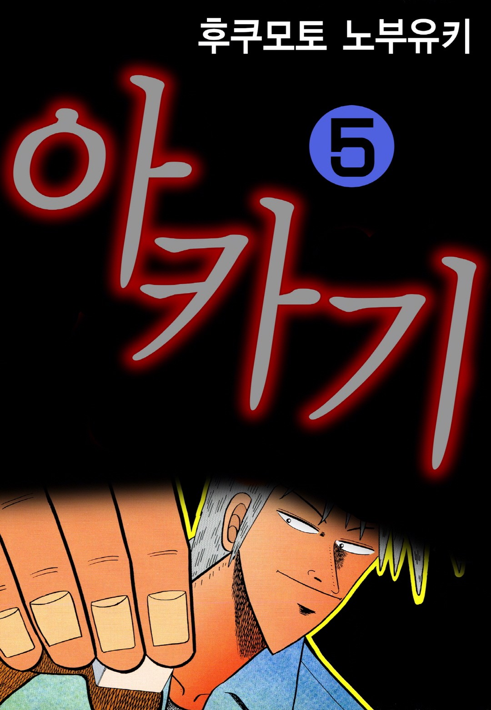
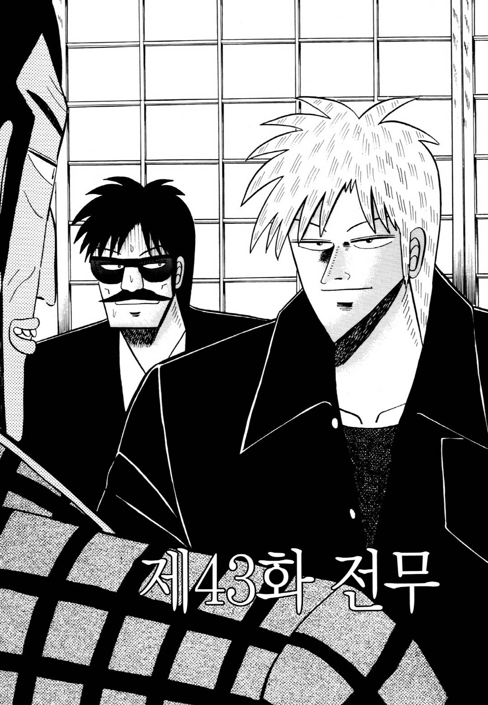

# 후쿠모토 노부유키 세계관과 아카기 시게루의 삶의 철학

후쿠모토 노부유키의 **아카기 세계관**은 단순한 마작 만화가 아니라 공포와 욕망을 초월한 인간상을 통해 삶과 죽음, 자유를 탐구하는 철학적 작품이다.

겉으로는 마작과 도박을 소재로 하지만, 작품이 반복해서 질문하는 대상은 승패 자체가 아니다. 인간은 무엇을 두려워하며, 무엇에 집착하고, 어떤 방식으로 살아야 하는가를 끊임없이 묻는다. 그 중심에는 현실에서는 거의 존재할 수 없는 인물인 **아카기 시게루**가 있다.

후쿠모토 노부유키는 독자가 아카기에게 감정을 이입하기보다, 그 존재를 하나의 거울처럼 바라보기를 의도한 것으로 보인다. 평범한 인간인 우리는 아카기를 통해 자신의 공포와 욕망을 되돌아보게 되며, 결국 작품의 진짜 주제는 마작이 아니라 인간 그 자체라는 사실을 깨닫게 된다.

## 핵심 요약

* **아카기 세계관**은 [텐], [아카기]를 중심으로 공식 외전과 후속작까지 이어지는 하나의 연속된 세계관이다.
* **아카기 시게루**는 승리를 위한 천재가 아니라 공포와 욕망을 초월한 존재로 설계된 철학적 캐릭터다.
* 작품에서 중요한 것은 **마작 기술**보다 인간 심리와 삶을 대하는 태도다.
* 후쿠모토 노부유키는 현실적인 인간을 대표하는 **카이지**와 초월적 존재인 **아카기**를 의도적으로 대비시켰다.
* [텐]의 마지막 이야기는 아카기의 최후를 통해 인간의 존엄과 자유를 질문하는 철학적 결말로 이어진다.
* 독자가 작품을 읽으며 얻어야 하는 것은 도박 기술이 아니라 삶을 바라보는 새로운 시각이다.

## 1. 아카기 세계관은 어떻게 구성되어 있는가?

후쿠모토 노부유키의 작품들은 모두 하나의 세계를 공유하지 않는다. 대표작인 **[도박묵시록 카이지]**, **[은과 금]**, **[최강전설 쿠로사와]** 등은 각각 독립된 세계관이다.

반면 **아카기 세계관(텐·아카기 유니버스)** 은 하나의 연대기로 연결되어 있으며, 공식적으로 인정되는 작품은 모두 다섯 편이다.

| 작품                      | 역할     | 작품 내 시점          |
| ----------------------- | ------ | ---------------- |
| [와시즈 염마의 패왕]          | 공식 외전  | 1940년대 후반~1960년대 |
| [아카기 어둠에 내려앉은 천재]     | 본편 프리퀄 | 1958~1965년       |
| [텐 - 천화거리의 쾌남아]         | 원작 본편  | 1989~1999년       |
| [HERO - 아카기의 유지를 잇는 남자] | 공식 후속작 | 2002년 이후         |
| [암마의 마미야]               | 공식 후속작 | 2019년            |

이 세계관의 특징은 시간이 자연스럽게 이어진다는 점이다.

* **와시즈**는 숙적인 와시즈 이와오의 젊은 시절을 다룬다.
* **아카기**는 전설이 시작되는 소년기를 그린다.
* **텐**에서는 노년의 아카기가 등장하며 삶의 마지막을 맞는다.
* **HERO**는 그의 정신을 이어받은 인물을 주인공으로 삼는다.
* **암마의 마미야**는 아카기가 떠난 뒤의 시대를 보여준다.

출시 순서와 작품 속 연대기는 다르다. 독자는 처음에는 노년의 아카기를 만났다가, 이후 프리퀄을 통해 그의 과거를 알게 되고, 다시 후속작에서 그가 남긴 영향을 확인하는 구조다.

이러한 구성 덕분에 아카기는 단순한 인기 캐릭터가 아니라, 한 세계관 전체를 관통하는 중심축으로 자리 잡게 된다.

## 2. 아카기 시게루는 왜 특별한 캐릭터인가?

아카기 시게루는 흔히 **천재 도박사**로 알려져 있지만, 작품이 묘사하는 본질은 단순한 실력자가 아니다. 그는 일반적인 인간이 가진 **생존 본능**, **손실 회피**, **물질적 욕망**이라는 세 가지 축에서 근본적으로 벗어나 있다.

그는 어린 시절부터 죽음을 두려워하지 않는다. 목숨을 걸어야만 비로소 살아 있음을 느끼며, 돈을 벌기 위해 도박을 하지도 않는다. 승리 역시 집착의 대상이 아니다. 그에게 중요한 것은 자신의 방식으로 판을 끝까지 받아들이는 일이다.

이러한 성향은 대부분의 도박 만화 주인공과도 크게 다르다.

* **돈**을 위해 싸우지 않는다.
* **명예**를 위해 싸우지 않는다.
* **복수**를 위해 싸우지 않는다.
* **생존** 자체에도 집착하지 않는다.
* 오직 **도박이라는 행위 자체**를 순수하게 받아들인다.

작품 속에서 상대가 사기를 쓰거나 판이 조작되더라도 그는 판을 거부하지 않는다. 오히려 그것 역시 도박의 일부라고 받아들인다.

아카기의 사고는 단순하다.

> 세상은 원래 불합리하다. 그렇다면 도박 역시 불합리한 것이 당연하다.

그래서 그는 상대의 속임수를 막으려 하기보다, 그 속임수를 이용하는 인간의 심리를 읽는다. 상대가 사기를 치는 순간 이미 두려움을 드러낸 것이라고 보기 때문이다.

이러한 접근은 기술보다 심리를 우선하는 아카기만의 승부 철학을 만들었고, 이후 등장하는 수많은 라이벌과도 본질적인 차이를 만들어낸다. 다음 장에서는 이러한 철학이 다른 대표 캐릭터들과 어떻게 대비되는지 살펴본다.

## 3. 카이지와 아카기, 두 주인공은 무엇이 다른가?

후쿠모토 노부유키를 대표하는 두 인물은 **아카기 시게루**와 **이토 카이지**다. 두 사람 모두 극한의 도박판을 살아가지만, 작품이 전달하려는 메시지는 정반대에 가깝다.

한 문장으로 요약하면 다음과 같다.

* **아카기 시게루**: 공포와 욕망을 초월하여 죽음마저 받아들이는 **선천적인 초월자**.
* **이토 카이지**: 나약하지만 절망 속에서도 성장하며 인간다움을 증명하는 **평범한 인간**.

| 비교 항목    | 아카기 시게루   | 이토 카이지       |
| -------- | --------- | ------------ |
| 인간상      | 초월적 존재    | 현실적인 인간      |
| 승부의 목적   | 살아 있음을 확인 | 생존과 희망       |
| 공포       | 거의 느끼지 않음 | 끊임없이 느끼지만 극복 |
| 돈에 대한 태도 | 무관심       | 절실한 생존 수단    |
| 독자의 위치   | 동경의 대상    | 감정이입의 대상     |
| 성장       | 거의 없음     | 끊임없이 성장      |

카이지는 대부분의 독자를 대변한다. 실패하고, 흔들리고, 후회하면서도 다시 일어선다. 독자는 자신의 모습을 카이지에게 투영한다.

반대로 아카기는 처음부터 완성된 존재다. 작품은 그가 성장하는 과정을 보여주기보다, **그 존재가 주변 사람들에게 어떤 영향을 미치는가**를 보여준다.

후쿠모토 노부유키는 두 캐릭터를 통해 서로 다른 질문을 던진다.

* 카이지는 "**절망 속에서도 인간은 다시 일어설 수 있는가?**"를 묻는다.
* 아카기는 "**욕망과 공포를 모두 내려놓은 인간은 어떤 모습인가?**"를 묻는다.

결국 두 작품은 경쟁 관계가 아니라 서로를 보완하는 철학적 쌍을 이룬다.

## 4. 아카기와 테쯔야가 보여주는 두 가지 승부 철학

마작 만화를 대표하는 또 다른 인물은 **아사다 테쯔야**다.

두 사람 모두 거의 패배하지 않는 전설적인 승부사이지만, 승리를 만들어 내는 방식은 극명하게 다르다.

| 비교 항목 | 아카기 시게루    | 아사다 테쯔야   |
| ----- | ---------- | --------- |
| 승부 방식 | 심리와 직감     | 기술과 경험    |
| 이카사마  | 거의 사용하지 않음 | 적극적으로 활용  |
| 목표    | 존재의 확인     | 살아남기      |
| 파트너   | 혼자 싸움      | 동료와 협력    |
| 분위기   | 철학적 · 초월적  | 현실적 · 장인형 |

주) 이카사마 : 일본말로 는 일본어로 사기, 속임수, 부정행위, 엉터리 등을 뜻하는 단어입니다.

테쯔야는 전후 혼란기를 살아남기 위해 기술을 연마한 **장인**이다.

반면 아카기는 기술보다 **인간의 심리**를 먼저 본다. 그는 상대의 눈빛, 숨소리, 욕망, 두려움을 읽으며 승부를 지배한다. 상대가 이카사마를 쓰더라도 크게 문제 삼지 않는다. 오히려 그 순간 상대는 자신의 두려움을 드러냈다고 판단한다.  

그래서 아카기는 상대의 기술을 무너뜨리는 것이 아니라, **기술을 사용하는 인간 자체를 무너뜨린다.** 이 차이는 작품 전체의 분위기도 바꾼다.

테쯔야는 현실을 살아가는 기술자의 이야기라면, 아카기는 인간 심리를 해부하는 철학자의 이야기다.

## 5. 아카기의 강함은 마작 실력이 아니라 삶을 대하는 태도다

많은 독자는 아카기를 최고의 마작 실력자로 기억하지만, 실제 작품에서 그의 가장 큰 무기는 **패를 잘 다루는 능력**이 아니다.

그의 진짜 무기는 삶을 바라보는 방식이다.

대표적으로 평가할 수 있는 요소는 다음과 같다.

| 능력 요소         | 평가            |
| ------------- | ------------- |
| **손기술**       | 최상급이지만 핵심은 아님 |
| **심리전**       | 세계관 최고 수준     |
| **흐름을 읽는 능력** | 세계관 최고 수준     |
| **직감**        | 거의 초월적인 수준    |
| **운**         | 극단적인 강운       |
| **도박 철학**     | 세계관 최고 수준     |

그는 목숨을 칩처럼 사용할 수 있기 때문에 상대보다 훨씬 자유롭다.

일반적인 인간은 잃을 것이 많아질수록 선택지가 줄어든다.

* 돈을 잃기 싫다.
* 명예를 잃기 싫다.
* 가족을 잃기 싫다.
* 목숨을 잃기 싫다.

이러한 집착이 판단을 흐린다.

그러나 아카기는 애초에 잃을 것을 계산하지 않는다. 그래서 상대는 아카기를 예측할 수 없다. 작품 속 수많은 강자들이 결국 무너지는 이유도 여기에 있다. 그들은 마작에서 패한 것이 아니라, **자신의 욕망과 공포에 패배한 것**이다.

후쿠모토 노부유키는 이러한 구조를 반복해서 보여주며, 진정한 승부는 패를 잘 다루는 기술이 아니라 인간 내부의 욕망을 다스리는 능력이라는 점을 강조한다.

다음 장에서는 이러한 아카기라는 존재를 후쿠모토 노부유키가 왜 만들어 냈는지, 그리고 작품 전체가 궁극적으로 독자에게 던지는 메시지를 살펴본다.

## 6. 후쿠모토 노부유키는 왜 아카기라는 존재를 만들었는가?

아카기를 단순한 **먼치킨 주인공**으로만 해석하면 작품의 의도를 충분히 설명하기 어렵다.

물론 그는 거의 패배하지 않는 압도적인 능력을 지녔다. 그러나 후쿠모토 노부유키가 보여주려 했던 것은 '강한 사람'이 아니라 **인간의 공포를 초월한 존재**다.

작가는 **카이지**를 통해 현실의 인간을, **아카기**를 통해 현실에서는 거의 존재할 수 없는 이상적인 인간상을 대비시킨 것으로 해석할 수 있다.

아카기는 독자가 닮아야 할 모델이라기보다, 인간을 비추는 하나의 거울이다.
그를 바라보는 순간 독자는 자연스럽게 자신의 모습을 돌아보게 된다.

* 왜 사람은 돈에 집착하는가?
* 왜 실패를 두려워하는가?
* 왜 손해를 보면 쉽게 무너지는가?
* 왜 안전한 선택만 반복하는가?

이 질문들은 작품 전체를 관통한다.

특히 **[텐]의 마지막 에피소드**는 이러한 철학을 가장 선명하게 보여준다.

노년의 아카기는 치매로 자신의 자아가 사라질 상황을 받아들이지 않는다. 그는 단순히 죽음을 선택한 것이 아니라, **자신다운 삶을 스스로 마무리하는 선택**을 한다. 이 장면은 승패와 마작을 넘어, 인간의 존엄과 자유에 대한 질문으로 작품을 확장시킨다. 따라서 아카기의 무패 전설은 결말을 위한 장치에 가깝다.

수십 년 동안 구축한 초월적인 존재성을 마지막 순간에 사용함으로써, 작가는 독자에게 "어떻게 살 것인가"라는 질문을 남긴다.

## 7. 독자는 이 작품을 통해 무엇을 얻을 수 있는가?

아카기를 현실에서 그대로 따라 하는 것은 불가능하며, 그럴 필요도 없다. 오히려 작품은 그의 삶을 통해 우리의 삶을 다시 바라보게 만든다. 독자가 얻을 수 있는 변화는 크게 다섯 가지다.

* **결과보다 과정**을 중요하게 바라보게 된다.
* **실패의 공포**를 이전보다 객관적으로 바라보게 된다.
* **소유**보다 자신의 선택을 중시하게 된다.
* **불합리한 현실**을 받아들이는 태도를 배우게 된다.
* **자기 삶의 기준**을 외부가 아닌 내부에서 찾게 된다.

특히 현대 사회는 성공과 실패를 숫자로 평가하는 경향이 강하다. 연봉, 직급, 자산, 학벌 같은 기준은 분명 현실에서 중요한 요소다. 그러나 작품은 인간의 가치를 그것만으로 판단하지 않는다.

아카기는 돈을 얻어도 집착하지 않고, 명성을 얻어도 머물지 않으며, 죽음조차 두려워하지 않는다. 현실에서 그처럼 살 수는 없지만, 그의 태도는 하나의 질문을 남긴다.

> 지금 내가 가장 두려워하는 것은 정말 잃어서는 안 되는 것인가.

이 질문 하나만으로도 작품은 단순한 도박 만화를 넘어 삶을 성찰하는 철학서가 된다.

## 결론

**아카기 세계관**은 마작이라는 소재를 빌려 인간의 공포와 욕망, 자유와 존엄을 탐구하는 연속된 이야기다. 연대기로 이어지는 다섯 작품은 한 명의 천재를 중심으로 연결되지만, 궁극적으로 바라보는 대상은 승부가 아니라 인간이다.

아카기 시게루는 현실에서 모방할 수 있는 인물이 아니다. 그는 공포와 집착을 극단적으로 제거한 가상의 존재이며, 그렇기 때문에 독자는 그에게 감정을 이입하기보다 자신의 삶을 되돌아보게 된다. 이러한 대비를 통해 후쿠모토 노부유키는 **카이지**와는 또 다른 방식으로 인간의 본질을 탐구했다.

결국 작품이 남기는 메시지는 도박에서 이기는 법이 아니다. 인간은 누구나 공포와 욕망 속에서 살아가지만, 그 속에서도 자신의 기준으로 선택하고 책임질 수 있을 때 비로소 자유로운 삶에 가까워질 수 있다는 점이다. 아카기는 그 자유를 극단적으로 형상화한 상징이며, 독자는 그 상징을 통해 자신만의 삶의 방식을 다시 질문하게 된다.

## 자주 묻는 질문(FAQ)

### 아카기 세계관과 카이지 세계관은 연결되어 있나?

아니다. **아카기 세계관**과 **카이지 세계관**은 서로 독립된 설정이다. 등장인물이나 사건도 공식적으로 연결되지 않는다.

### 아카기는 정말 이카사마를 거의 사용하지 않나?

그렇다. 작품에서 아카기의 강점은 손기술보다 **심리전**, **직감**, **상대의 욕망을 읽는 능력**에 있다. 상대의 이카사마를 역이용하는 경우가 훨씬 많다.

### 현실에도 아카기 같은 사람이 존재할 수 있을까?

현실에서 아카기와 같은 성향을 가진 사람은 거의 존재하기 어렵다. 공포의 결여, 뛰어난 지능, 물질욕의 부재, 극단적인 평정심이 모두 결합해야 하기 때문이다. 따라서 현실적인 관점에서는 문학적·철학적 상징으로 이해하는 편이 적절하다.

### [텐]의 마지막 이야기가 중요한 이유는 무엇인가?

아카기의 마지막 선택은 그의 승부 철학이 삶 전체에도 적용된다는 사실을 보여준다. 작품은 이 장면을 통해 승패를 넘어 인간의 존엄과 자기결정권이라는 주제를 제시한다.

### 이 작품의 핵심 메시지는 무엇인가?

핵심은 **아카기처럼 살라는 것이 아니라, 자신의 삶을 스스로 선택하는 인간이 되라는 것**이다. 아카기는 현실적인 삶의 모델이 아니라, 공포와 욕망을 비추는 거울로 기능하는 철학적 캐릭터다.
