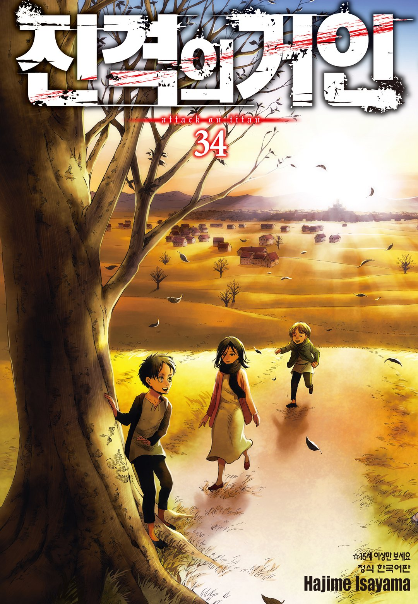
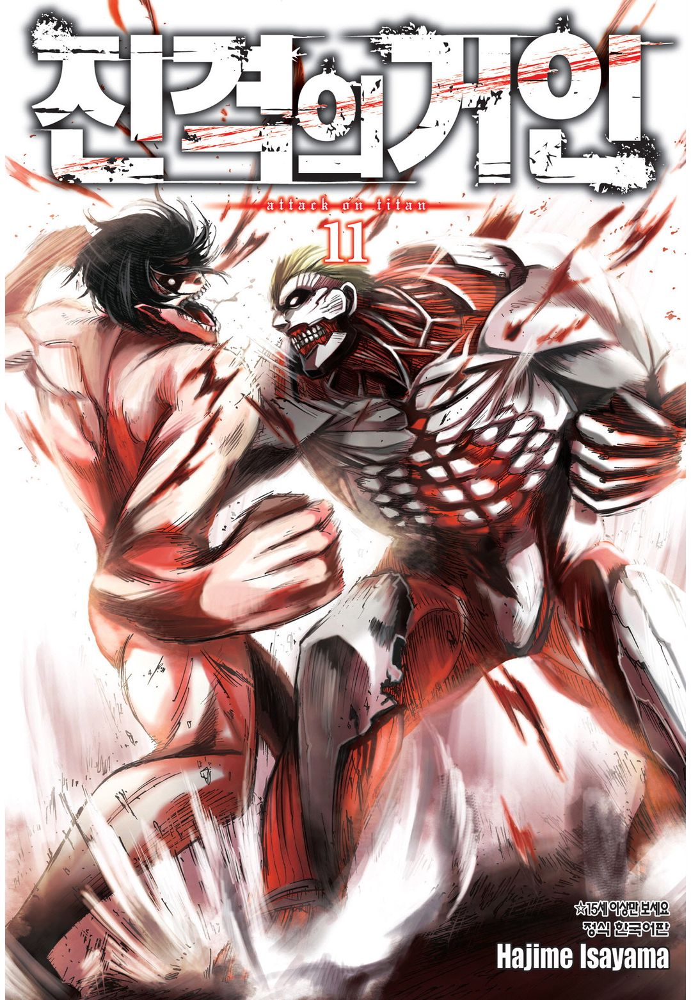
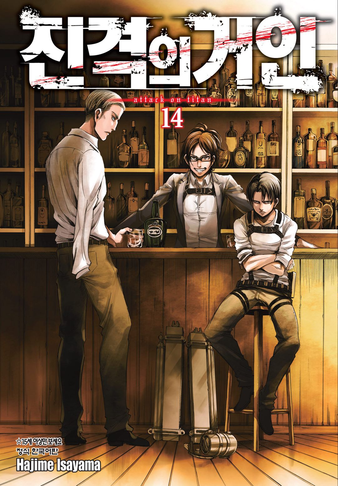

# 진격의 거인 엔딩 논란: 에렌의 선택이 옳았는가?

**에렌 예거**는 **땅울림**을 일으켜 세계 인구의 80%를 죽였고, 결국 미카사의 손에 죽으면서 거인의 힘 자체를 역사에서 지워버렸다. 이 **결말**을 어떻게 받아들여야 할지는 아직도 팬들 사이에서 **의견**이 갈린다. 파라디 섬과 동료들의 생존을 생각하면 이해가 가는 구석이 있지만, 무고한 사람들까지 휩쓸린 대량 학살이라는 사실은 어떻게 봐도 지워지지 않는다.

그래서 에렌을 그냥 "희생한 **영웅**" 아니면 "미쳐버린 **학살자**" 둘 중 하나로 정리해버리면 이 결말의 절반은 놓치게 된다. 작품이 정말 보여주고 싶었던 건 에렌이 왜 그런 **선택**을 했는지, 그 선택으로 실제로 뭘 얻었는지, 그리고 그 과정에서 에렌 자신이 무엇을 **잃었는지**다.

## 1. 에렌의 선택이 옳다고 보기 어려운 이유

도덕적으로만 놓고 보면 이건 **정당화**가 힘들다. 인류의 80%를 죽였다는 결과가 너무 명확하니까. 파라디 섬을 노리던 세력이 있었고 엘디아인이 오랜 세월 차별받아온 것도 사실이지만, 그렇다고 전 세계 민간인을 대규모로 살해한 걸 "정당방위"라고 부르기엔 무리가 있다.

에렌에게는 **파라디 섬**의 생존이라는 절박한 **목적**이 있었다. 하지만 목적이 정당하다고 수단까지 다 정당해지는 건 아니다. 특히 땅울림은 군사적으로 적대적인 세력만 골라 없앤 게 아니라, 관계없는 민간인 수십억 명까지 그대로 쓸어버렸다.

결국 에렌을 옹호하려면 "**생존권**과 개인의 자유를 위해 다른 사람들의 생존권을 희생해도 되는가"라는 별개의 **윤리적 질문**을 정면으로 거쳐야 한다.

## 2. 그럼에도 에렌이 이해되는 지점

에렌이 극단으로 치닫게 된 배경에는 파라디 섬의 **구조적 고립**이 있다. 벽 밖 세계는 오랫동안 엘디아인을 두려워하고 증오했고, 마레를 비롯한 세력들은 파라디 섬을 잠재적 위협으로만 취급했다. 벽 밖의 현실을 직접 마주한 에렌이 본 세상은 자신이 어릴 때 꿈꾸던 자유로운 세계와는 너무 달랐다.

선택지는 점점 좁아졌다. 파라디를 지키기 위한 군사적 대응, 외교와 협상, 지크의 안락사 계획, 그리고 **땅울림**으로 압도적 무력을 행사하는 것. 에렌은 마지막 방법을 골랐다. 다만 땅울림만이 유일한 답이었다고 작품이 확정 짓는 건 아니다. 다른 길이 있었을 가능성은 여전히 남아 있다. 중요한 건 에렌이 다른 방법을 몰라서가 아니라, 자신이 본 미래와 **자유**에 대한 집착이 뒤섞이면서 결국 땅울림 쪽으로 걸어갔다는 점이다.

## 3. 에렌은 순전히 파라디 섬을 위해 학살했을까?

이렇게만 말하면 에렌을 너무 단순하게 만드는 셈이다. 파라디와 친구들의 생존이 중요한 **동기**였던 건 맞지만, 에렌 안에는 자신이 꿈꾸던 자유로운 세계를 스스로 부숴버리고 싶은 **욕망**도 함께 있었다.

아르민과의 마지막 대화에서 에렌은 이 복합적인 감정을 그대로 드러낸다. 친구들을 살리고 싶었고 섬을 지키고 싶었던 것도 진심이지만, 동시에 벽 밖의 세계를 자신이 상상했던 자유로운 공간으로 받아들이지 못했고, 그 세계 자체를 없애버리고 싶다는 **충동**도 품고 있었다.

그래서 에렌은 단순한 피해자가 아니다. 자신이 자유를 얻기 위해 남의 자유를 짓밟는다는 **모순**을 알면서도 앞으로 나아갔다. 에렌의 비극은 선한 목적으로 악한 수단을 골랐다는 데만 있는 게 아니라, 누구보다 자유를 갈망했던 사람이 결국 누구보다 크게 남의 자유를 빼앗는 존재가 됐다는 **역설**에 있다.

## 4. 왜 에렌은 결정론적인 인물이 됐나?

에렌을 이해하기 어려운 큰 이유 중 하나는 작품 특유의 **시간 구조**다. 진격의 거인 계승자는 미래 계승자의 기억 일부를 미리 볼 수 있다는 설정이 있고, 에렌은 시조 거인의 힘을 통해 자신이 미래에 땅울림을 일으키는 모습을 미리 확인해버린다. 여기서부터 자유를 추구하던 에렌의 역설이 시작된다.

미래를 본다는 게 마음대로 미래를 바꿀 수 있다는 뜻은 아니다. 오히려 에렌에게는 자신이 이미 본 미래를 향해 현재가 흘러가는 것처럼 느껴지는 상황이 만들어진다. 그렇다고 에렌이 아무 의지 없는 꼭두각시였던 것도 아니다. 그는 자신이 본 **미래**를 원했고, 그 미래를 향해 스스로 걸어갔다. **운명**에 끌려가면서도 그 운명을 자기 의지로 받아들였다는 점이 핵심이다.

## 5. 이 작품에서 자유는 왜 역설적인가?

에렌이 말하는 **자유**는 단순히 벽 밖으로 나가는 게 아니다. 타인의 통제에서 벗어나 자신이 원하는 걸 스스로 **선택**하는 상태에 가깝다. 그런데 진격의 거인의 능력은 이 자유를 뒤집어버린다. 미래의 기억을 보고, 자신이 선택할 미래를 확인하고, 그 미래를 향해 행동하고, 과거의 인물에게 미래의 기억을 전달하고, 그 과거의 행동이 다시 현재와 미래의 원인이 되는 구조. 이 안에서 에렌은 자유롭게 선택하는 동시에 자신이 본 미래의 포로가 된다.

그래서 이 작품에서 자유는 단순한 해방의 개념이 아니다. 자기 의지로 선택했기 때문에 오히려 그 선택한 운명에 갇히는 **역설**이다.

## 6. 에렌과 지크, 서로 다른 구원

에렌을 이해하려면 **지크**의 안락사 계획과 비교할 수밖에 없다. 두 사람은 같은 아버지를 두었고 엘디아인의 비극을 공유했지만, 그 비극에서 벗어나는 방법은 정반대였다.

지크는 엘디아인이 더 이상 태어나지 않게 만들어 거인의 힘과 고통 자체를 역사에서 끝내려 했다. 생명의 탄생을 막는 방식이다. 에렌은 이걸 받아들이지 않았다. 살아갈 권리와 자유를 포기하는 평화는 그에게 평화가 아니었다. 지크가 종족의 소멸을 통한 **평화**를 택했다면, 에렌은 자신의 종족과 친구들을 살리기 위해 세계를 파괴하는 쪽으로 갔다. 지크는 고통의 근원을 없애려고 생명 자체를 줄이려 했고, 에렌은 살아남기 위해 남의 생명을 없애는 길을 택했다는 점에서 둘의 차이가 가장 선명하게 드러난다. 어느 쪽도 작품 안에서 완전한 정답으로 그려지진 않는다.

## 7. 미카사의 선택이 에렌의 죽음으로 이어진 이유

시조 **유미르**는 프리츠 왕에 대한 사랑과 복종에서 벗어나지 못한 채 2천 년 동안 거인의 힘을 유지해왔다. 에렌은 유미르에게 인간으로서의 선택을 요구했고, 결국 **미카사**가 사랑하는 에렌을 자기 손으로 죽인다. 미카사는 사랑을 포기한 게 아니라, 사랑하면서도 죽이는 **선택**을 한 것이다.

이 행동은 유미르가 오랫동안 하지 못했던 선택과 정확히 대비된다. 유미르의 사랑은 자신을 속박하는 관계에서 벗어나지 못하게 만들었지만, 미카사는 사랑하는 사람을 놓아주는 걸 선택했다. 이 대비를 통해 거인의 힘이 사라지는 계기가 만들어진다. 미카사는 그냥 에렌을 처단한 인물이 아니라, 누군가를 사랑하면서도 그 행동을 받아들이지 않을 수 있다는 걸 보여준 인물이다.

## 8. 에렌은 왜 미카사를 일부러 밀어냈나?

이야기가 끝을 향할수록 에렌은 미카사와 아르민을 비롯한 동료들과 의도적으로 **거리**를 둔다. 특히 미카사에게 자신을 향한 감정이 아커만의 본능일 뿐이라고 잔인하게 말한다. 하지만 이 말을 그대로 믿기는 어렵다. 후반부 에렌과 지크의 대화를 보면 미카사의 감정을 단순한 아커만의 복종 본능만으로 설명할 수 없다는 게 드러나기 때문이다.

그래서 에렌이 미카사에게 했던 말은 사실 설명이라기보다 관계를 끊어내기 위한 **거짓말**에 가깝다고 보는 게 더 타당하다. 에렌은 자기가 가야 할 길을 알고 있었고, 마지막 순간 미카사가 자신을 죽여야 한다는 것도 알고 있었다. 그렇다면 미카사와 정서적으로 계속 연결돼 있는 게 오히려 그 선택을 더 힘들게 만들었을 것이다. 에렌은 자신이 미카사의 선택을 강요할 수 없다는 걸 알았기에, 차라리 먼저 **밀어내는** 쪽을 택했다고 볼 수 있다.

## 9. 유미르와 미카사, 정반대의 사랑

두 사람 모두 사랑하는 대상에게 강한 **애착**을 갖고 있지만, 그 사랑을 다루는 **방식**은 완전히 다르다. 유미르는 사랑과 복종을 분리하지 못하고 프리츠 왕의 지배에서 끝내 벗어나지 못했다. 반면 미카사는 사랑하면서도 상대의 행동을 거부했고, 결국 에렌을 자기 손으로 죽이며 관계를 끊었다.

이 대비에서 작품이 말하려는 **자유의 의미**가 드러난다. 진짜 자유는 사랑이나 감정을 없애는 게 아니라, 사랑하는 대상에게 자신의 선택권을 통째로 넘겨주지 않는 데 있다는 것. 미카사의 선택을 지켜본 유미르가 그제야 오랜 **속박**에서 벗어나고, 거인의 힘이 사라지는 결말은 이 관계 위에서 설명된다.

## 10. 에렌은 과거에까지 손을 뻗었나?

진격의 거인의 시간 구조는 에렌을 단순히 미래의 희생자로만 두지 않는다. 미래 계승자의 기억을 과거 계승자가 일부 볼 수 있다는 설정을 이용해, 에렌은 아버지 **그리샤**의 행동에까지 영향을 준다.

대표적인 게 **레이스 가문** 사건이다. 그리샤는 처음부터 냉정한 학살자가 아니었다. 레이스 가문을 죽이는 걸 망설였지만, 미래의 에렌이 가진 **기억**과 압박 속에서 결국 행동으로 옮긴다. 여기서 에렌은 자신이 걸어온 길의 원인을 과거로 되돌려 보내는 존재가 된다. 에렌 크루거가 아직 알 수 없는 상태에서 미카사와 아르민의 이름을 언급하는 장면도 같은 구조를 보여준다. 시간의 인과관계가 직선으로만 이어지지 않는 것이다. 결국 에렌은 미래에 영향을 받은 동시에 과거를 움직이는 원인이 된다.

## 11. 땅울림으로 거인의 저주는 끝났을까?

에렌의 행동에는 세계 파괴와는 별개로 **거인의 저주** 자체를 끝내려는 목적도 있었다. 미카사가 에렌을 죽이고 유미르가 오랜 속박에서 벗어나면서 거인의 힘은 실제로 사라진다. 이건 에렌의 계획에서 분명 중요한 **성과**다. 적을 제거하는 것만으로는 2천 년 이어진 거인의 역사를 끝낼 수 없었으니까.

하지만 그렇다고 에렌의 행동 전체가 정당화되진 않는다. 거인의 힘이 사라졌다는 결과와 인류의 80%를 학살했다는 결과는 그냥 나란히 존재한다. 긍정적인 결과 하나가 그 **범죄**를 지워주지는 않는다. 이 둘은 **분리**해서 봐야 한다.

## 12. 파라디 섬은 그 덕분에 평화를 얻었을까?

결말 이후 파라디 섬은 완전한 **평화**를 얻지 못한다. 에렌이 죽은 뒤에도 섬 내부에서는 군사화가 계속되고 외부와의 **긴장**도 이어진다. 아르민과 생존자들은 외교와 협상으로 평화를 모색해야 하는 처지다. 더 먼 미래를 보여주는 장면에서는 파라디 섬의 도시가 전쟁으로 폐허가 된 모습까지 나온다.

이 장면은 에렌의 선택이 인간의 갈등 자체를 끝내지 못했다는 걸 보여준다. 거인의 힘은 없앴지만, 인간 사회에서 **전쟁**과 **증오**가 사라지게 만들지는 못한 것이다. 그러니 "에렌이 80%를 죽였으니 파라디 섬이 영원히 안전해졌다"는 해석은 결말과 맞지 않는다. 그가 얻은 건 영원한 평화가 아니라, 어느 정도 시간을 번 생존 가능성에 가깝다.

## 13. 마지막 거대한 나무 장면?

결말에서 소년이 **거대한 나무**를 발견하는 장면은 유미르가 처음 힘과 접촉했던 나무를 자연스레 떠올리게 한다. 폐허가 된 도시와 거대한 나무가 함께 등장하면서, 이야기가 다시 시작될 수도 있다는 **여운**을 남긴다. 다만 그 소년이 반드시 새로운 거인의 힘을 얻게 된다고 확정된 건 아니다. 작품은 그 가능성만 열어둔 채 끝난다.

중요한 건 거인의 힘이 사라졌다고 인간의 역사까지 완전히 달라지지는 않는다는 점이다. 거인의 힘이 갈등의 유일한 원인은 아니었으니까. 거인이 사라져도 인간은 다시 싸울 수 있고, 새로운 힘을 발견하면 또 다른 방식으로 써먹을 수도 있다. 이 장면 하나에 작품 전체의 **순환 구조**가 압축돼 있다.

## 14. 조사병단이 꿈꾸던 자유는 어떻게 변질됐나?

초기 **조사병단**은 벽 밖 세계를 탐험하고 인간이 몰랐던 영역을 확인하려던 집단이었다. 그들이 추구한 자유에는 미지의 세계를 향한 순수한 **호기심**이 있었다. 그런데 벽 밖에 적대적인 세계가 있다는 게 밝혀진 뒤로 자유의 의미는 달라진다. 탐험은 생존을 위한 전쟁으로 바뀌고, 외부 세계를 이해하려는 노력은 적을 없애야 한다는 논리와 부딪힌다.

이 변화는 에렌에게서 가장 극단적으로 나타난다. 벽 밖으로 나가고 싶었던 소년은 결국 벽 밖의 세계를 파괴하는 사람이 됐다. 자유를 얻으려고 시작한 여정이 타인의 자유를 빼앗는 **폭력**으로 끝난 셈이다. 조사병단의 몰락도 같은 **역설**과 이어진다. 한지와 리바이 같은 인물들은 자신들이 지키고 싶었던 인간성과 동료를 위해 결국 에렌과 싸워야 했다.

## 15. 거인화가 보여주는 인간성의 상실

거인의 힘은 이 작품에서 단순한 전투 능력이 아니다. 인간이 인간을 공격하기 위해 자기 몸을 병기로 바꾸는 구조 자체를 상징한다. 에렌도 처음에는 거인을 쓰러뜨리기 위해 이 힘을 썼다. 하지만 시간이 지나면서 그 힘은 적을 제거하는 수단에서 세계 전체를 파괴하는 수단으로 확대된다.

여기에 전쟁의 역설이 있다. 자신을 지키려고 만든 **무기**가 결국 자신이 지키려던 **인간성**까지 파괴한다. 에렌이 점점 동료들과 거리를 두고 냉정해지는 과정도 이 변화를 보여준다. 인간적인 관계를 지키기 위해 그 관계를 스스로 끊어야 하는 상황에 놓이면서, 에렌은 조금씩 **괴물**이 되어간다.

## 16. 에렌과 아르민의 마지막 대화

에렌과 아르민의 관계는 **자유**와 **평화**라는 두 가치의 충돌을 보여준다. 아르민은 대화와 이해를 통한 해결 가능성을 끝까지 놓지 않는다. 반면 에렌은 자신이 본 현실과 미래를 바탕으로 폭력을 택한다.

두 사람의 마지막 대화는 어느 한쪽이 완전히 옳다는 결론을 내지 않는다. 에렌은 자신이 한 일을 후회하면서도 결국 그 길을 택했고, 아르민 역시 에렌이 만든 결과에서 완전히 자유롭지 않다. 그래서 이 대화에는 **가해자**와 **생존자** 사이의 복잡한 공감과 죄책감이 함께 깔려 있다. 에렌은 친구들이 자신을 죽이게 만들었고, 아르민을 비롯한 동료들은 세계를 구한 영웅이라는 자리를 얻는다. 하지만 그 영웅의 기반에는 에렌이 저지른 대량 학살이 있다. 이 결말이 불편하게 느껴지는 이유가 바로 여기에 있다.

## 17. 결국 에렌의 선택은 성공했을까?

무엇을 성공의 기준으로 삼느냐에 따라 답이 달라진다. 거인의 힘을 없애는 데는 **성공**했다. 동료들이 살아남을 가능성을 높이는 데도 성공했다. 하지만 세계 인구의 80%를 죽였고, 파라디 섬의 영구적인 평화를 만드는 데는 **실패**했으며, 인간 사이의 증오와 전쟁을 없애는 데도 실패했다.

그러니 에렌의 계획을 성공이나 실패 하나로 정리하긴 어렵다. 특정 목표는 달성했지만, 그 목표가 요구한 희생은 상상을 초월했고 장기적인 평화까지 보장하진 못했다. **전략적**으로는 일부 목적을 이뤘지만, **윤리적**으로는 정당화할 수 없고 역사적으로도 완전한 해결책은 아니었다고 보는 게 맞을 것이다.

## 18. 옹호론과 비판론은 어디서 갈리나

에렌을 옹호하는 쪽은 대체로 **현실주의**와 **생존**의 관점에 선다. 파라디 섬이 절멸 위기에 놓였고 다른 선택지들이 실패할 가능성이 높았다면, 살아남기 위해 압도적인 힘을 쓰는 게 불가피했다는 논리다. 반대로 비판하는 쪽은 보편적 윤리와 개인의 생명권을 기준으로 삼는다. 파라디 섬의 생존이 아무리 중요해도 세계의 민간인을 대량 학살하는 걸 정당화할 순 없다는 것이다.

같은 사건을 보고도 두 입장은 서로 다른 **질문**을 던진다. 내 가족과 공동체가 공격받는다면 어디까지 싸울 수 있는가. 살아남기 위해 다른 사람을 죽이는 게 정당한가. 가해자가 될 수밖에 없는 상황이었다는 이유로 학살을 용서할 수 있는가. 미래가 이미 정해져 있었다면 그 행동의 **책임**은 누구에게 있는가. 진격의 거인은 이 질문들에 명확한 답을 내려주지 않는다.

## 결론

에렌 예거의 선택이 옳았다고 **단정**하긴 어렵다. 파라디 섬의 생존과 동료들의 미래를 지키려는 목적은 분명했지만, 그걸 위해 세계 인구의 80%를 학살한 행위를 정당화할 **근거**는 부족하다.

그렇다고 에렌을 그냥 **광인**으로 치부하는 것도 작품의 구조와 맞지 않는다. 에렌은 자유를 원했고, 친구들을 지키고 싶었고, 자신이 본 미래를 향해 스스로 걸어갔다. 이 여러 **욕망**이 하나의 행동 안에서 부딪혔을 뿐이다.

이 결말의 핵심은 에렌의 **학살**이 옳았다고 인정하는 데 있지 않다. 오히려 자유를 얻으려는 욕망이 타인의 자유를 파괴하는 순간 어떤 **비극**이 벌어지는지를 보여주는 데 있다. 거인의 힘은 사라졌지만 인간의 갈등은 끝나지 않았다. 파라디 섬도 영원한 평화를 얻지 못했다. 에렌이 세계를 파괴하면서까지 끊으려 했던 증오의 연쇄 역시 완전히 사라지지 않았다.

결국 진격의 거인이 남긴 **질문**은 "에렌이 옳았는가"에서 끝나지 않는다. 사랑하는 사람을 지키기 위해 어디까지 타인을 **희생**할 수 있는가, 그리고 자유를 위해 남의 자유를 빼앗는 순간 그것을 여전히 자유라고 부를 수 있는가. 이 질문까지 이어진다.

## 자주 묻는 질문(FAQ)

### 에렌은 왜 **땅울림**을 시작했는가?

파라디 섬과 동료들의 생존, 자신의 자유에 대한 **욕망**, 자신이 본 미래의 실현이 복합적으로 작용했다. 어느 하나의 동기만으로 에렌의 행동을 설명하기는 어렵다.

### 에렌은 **미래**를 보고 자신의 행동을 바꿀 수 있었는가?

작품의 시간 구조에서는 미래의 기억과 현재의 행동이 서로 얽혀 있다. 에렌은 미래를 알고 있었지만 그 미래를 단순히 피할 수 있는 위치에 있지 않았으며, 동시에 그 미래를 자신의 의지로 선택하고 실행했다.

### 미카사는 왜 에렌을 **죽였는가**?

미카사는 에렌을 사랑했지만 그의 학살을 막기 위해 직접 죽이는 선택을 했다. 이 선택은 시조 유미르가 오랫동안 끊지 못했던 **속박**에서 벗어나는 계기와 연결된다.

### 에렌이 80%를 학살한 결과 파라디 섬은 영원히 **안전**해졌는가?

그렇지 않다. 에렌이 죽은 뒤에도 파라디 섬은 군사화와 외부 세계와의 갈등을 겪으며, 먼 미래에는 섬의 도시가 전쟁으로 파괴된 모습까지 등장한다.

### 진격의 거인 결말은 인간의 **증오**가 영원히 반복된다는 뜻인가?

작품은 인간의 갈등이 거인의 힘이 사라진 뒤에도 지속될 가능성을 보여준다. 다만 모든 역사가 반드시 똑같이 반복된다고 확정하지는 않는다. 마지막 장면은 새로운 비극의 가능성을 열어둔 채 이야기를 끝낸다.