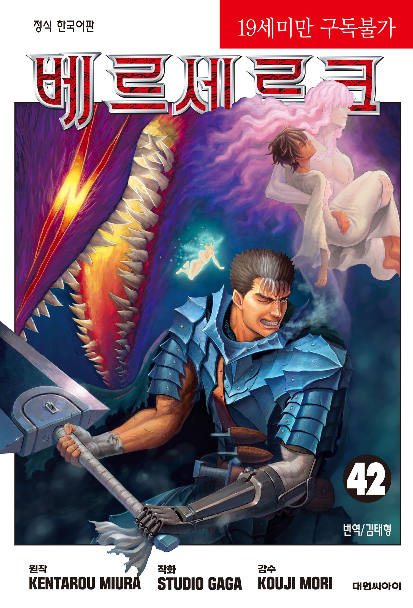
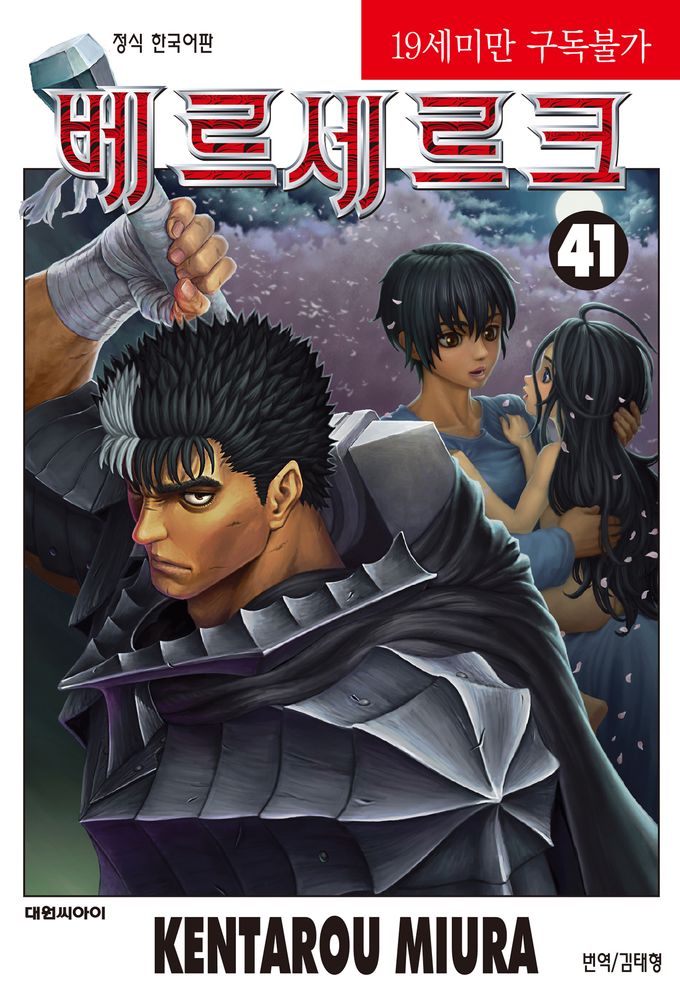
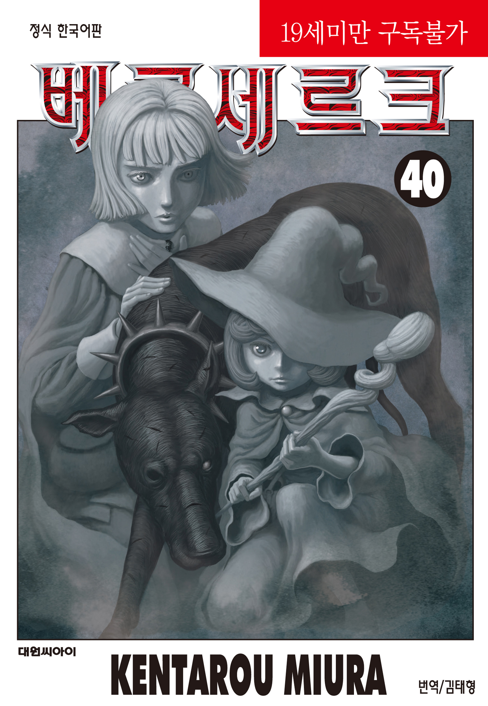

# 만화 베르세르크는 가혹한 운명에 대항할 수 있는가?

베르세르크는 인과율에 짓눌린 인간이 고통을 감수하면서도 스스로 선택하고 타인과 연대하는 과정에서 인간다움의 의미를 묻는 작품이다. 가츠의 싸움은 그리피스를 쓰러뜨리기 위한 복수극으로 시작하지만, 이야기가 진행될수록 질문의 방향이 달라진다. 정말 중요한 것은 운명을 완전히 부수는 일이 아니라, **운명이 정해놓은 것처럼 보이는 상황에서도 자신의 선택을 포기하지 않는 것**이다.

가츠와 그리피스는 같은 세계에서 전혀 다른 방식으로 운명을 받아들인다. 그리피스는 자신의 꿈을 위해 인간으로서의 관계와 책임을 희생하고 초월적인 존재의 질서에 편입된다. 가츠는 반대로 모든 것을 잃은 뒤에도 인간으로 남는 길을 택한다. 두 사람의 대비가 《베르세르크》의 철학적 중심축이다.

## 핵심 요약

* **가츠의 투쟁은 운명을 완전히 극복하는 영웅담이 아니라**, 압도적인 인과율 속에서도 자신의 선택을 포기하지 않는 인간의 주체성을 보여준다.
* 그리피스는 꿈을 이루기 위해 동료들을 제물로 바치고 초월적인 존재가 되었으며, 가츠와 정반대의 방식으로 자신의 운명을 받아들인다.
* 가츠의 이야기는 복수에만 머물지 않는다. 캐스커와 동료들을 지키려는 방향으로 나아가면서 **증오에서 관계와 연대의 가치**를 회복한다.
* 베헤리트와 고드핸드가 상징하는 인과율은 인간의 삶을 거대한 필연의 구조 안에 묶지만, 리케르트와 가츠 같은 인물은 그 질서에 완전히 편입되지 않는다.
* 《베르세르크》가 말하는 인간의 강함은 초월적인 힘 자체가 아니라 **상처와 공포를 안고도 스스로 선택하고 살아가는 태도**에 가깝다.

## 1. 가츠와 그리피스는 왜 같은 운명을 다르게 받아들이는가?

《베르세르크》의 가장 중요한 대비는 가츠와 그리피스다. 둘은 처음부터 서로 다른 인간처럼 보이지만, 실제로는 **자신의 삶을 스스로 결정하고 싶어 한다는 욕망**을 공유한다. 차이는 그 욕망을 실현하는 방식에서 생긴다.

그리피스에게 꿈은 자신의 존재를 증명하는 절대적인 기준이다. 그는 자신의 왕국을 갖겠다는 목표를 위해 수많은 전투를 감수하고, 부하들에게도 그 꿈을 위해 싸울 이유를 부여한다. 매의 단은 단순한 용병 집단이 아니라 그리피스의 꿈을 함께 믿는 공동체였다. 가츠 역시 그 안에서 처음으로 자신이 소속될 수 있는 장소를 발견한다.

문제는 그리피스에게 **타인의 삶이 자신의 꿈보다 우선할 수 없었다는 점**이다. 가츠가 떠난 뒤 그리피스는 통제력을 잃고 몰락한다. 육체가 망가진 채 감옥에 갇힌 그는 더 이상 꿈을 실현할 방법이 없다고 판단하고, 다시 작동한 베헤리트와 함께 '식'을 맞이한다.

그 순간 그리피스는 동료들을 제물로 바치고 페무토가 되는 길을 선택한다. 이 선택은 《베르세르크》에서 운명을 받아들이는 가장 극단적인 방식이다. 그리피스는 운명에 저항한 것이 아니라 **자신이 원하는 결과를 위해 인간으로서 감당해야 할 대가를 버렸다**. 초월적인 힘을 얻는 대신 인간적인 관계와 책임을 포기한 셈이다.

가츠는 정반대의 길을 걷는다. '식'에서 모든 것을 잃고 살아남은 뒤, 낙인을 가진 채 사도와 악령에게 쫓기는 삶을 시작한다. 현실은 아무런 보상을 약속하지 않는다. 매일 죽음과 마주하고, 몸은 끊임없이 상처 입으며, 소중하게 여긴 사람들은 이미 무너졌다.

그럼에도 가츠는 검을 놓지 않는다.

가츠에게 승리가 보장된 적은 없다. **《베르세르크》의 인간성은 승리의 결과보다 선택을 계속하는 과정에서 드러난다.** 운명을 이긴다는 말이 거대한 힘을 가진 존재를 쓰러뜨린다는 뜻이라면 가츠의 싸움은 아직 끝나지 않았다. 그러나 운명 때문에 아무것도 선택할 필요가 없다고 생각하는 순간, 인간의 주체성도 함께 사라진다.

## 2. 인과율은 인간의 선택을 어디까지 지배하는가?

《베르세르크》에서 운명은 막연한 숙명이 아니다. 작품은 그것을 **인과율**이라는 거대한 질서로 구체화한다. 사건들은 서로 연결되어 있고, 인간이 우연이라고 생각하는 일조차 더 큰 흐름 안에 배치된 것처럼 묘사된다.

베헤리트는 그 질서를 상징하는 대표적인 물건이다. 그리피스가 절망적인 상황에서 베헤리트를 다시 발견하는 장면은 단순한 우연으로 처리되지 않는다. 인간의 욕망과 절망이 특정한 조건에 도달했을 때 고드핸드와 연결되는 통로가 열린다.

그렇다면 인간에게 선택의 자유가 있는가?

작품은 이 질문에 단순한 답을 내리지 않는다. 가츠 역시 인과율의 영향을 받는다. 그는 '식'의 생존자라는 사실 때문에 낙인을 지니고 살아가며, 그 낙인은 사도와 악령을 끌어들인다. 그의 삶은 자신이 선택하지 않은 사건에 의해 끊임없이 규정된다.

하지만 **상황과 선택은 같은 것이 아니다.**

가츠가 '식'을 피할 수 있었는지는 별개의 문제다. 그 이후 무엇을 할 것인가는 가츠의 선택으로 남는다. 복수에 매달릴 것인지, 캐스커를 지킬 것인지, 동료를 받아들일 것인지, 분노를 그대로 따라갈 것인지가 계속해서 그의 앞에 놓인다.

이 차이가 《베르세르크》에서 인간의 주체성이 머무는 자리다. 태어날 때부터 선택할 수 없는 것들이 있고, 이미 발생한 사건을 되돌릴 수 없는 경우도 있다. 그렇다고 그 이후의 모든 행동까지 운명이라는 이름으로 설명할 필요는 없다.

가츠의 싸움은 운명을 부정하는 선언이라기보다, 운명에 모든 책임을 넘기지 않으려는 행동에 가깝다.

## 3. '식' 이후 가츠는 어떻게 복수와 연대 사이에서 변하는가?

'식'은 가츠에게 모든 것을 빼앗은 사건이다. 매의 단이라는 공동체는 붕괴하고, 동료들은 죽었으며, 캐스커는 심각한 정신적 상처를 입는다. 그리피스는 페무토가 되어 인간의 영역을 벗어난다.

이 사건 이후 가츠가 선택한 것은 복수였다. 검은 검사로서 그는 사도를 찾아 죽이고, 자신을 공격하는 악령을 베어내며, 그리피스에게 접근할 길을 찾는다. 이 시기의 가츠에게 세계는 적과 복수의 대상으로 가득하다.

그런데 복수만으로는 가츠의 삶을 설명할 수 없게 되는 순간이 찾아온다. **캐스커를 지키는 일이 그리피스를 죽이는 일보다 중요해지기 시작하기 때문이다.**

복수는 과거를 향한다. 이미 발생한 사건의 책임을 묻고 상대에게 대가를 치르게 하는 행동이다. 반면 누군가를 지키는 일은 미래를 향한다. 아직 오지 않은 시간을 위해 자신의 행동을 조절해야 한다. 이 변화는 가츠가 인간으로 살아가기 위해 무엇을 선택하는지 보여주는 전환점이다.

가츠가 동료들을 받아들이는 과정도 같은 의미를 가진다. 파르네제, 세르피코, 이시도르, 시르케와 함께 움직이면서 그는 다시 타인과 관계를 맺는다. 처음에는 자신을 방해하는 존재처럼 여기지만, 시간이 지나면서 그들의 생존을 자신의 책임으로 받아들인다.

가츠는 오랫동안 혼자 살아남는 것이 강함이라고 믿었다. 자신의 몸 하나를 무기로 삼고 거대한 검에 의지해 적을 베어내는 방식은 그의 삶과 잘 맞았다. 하지만 인간의 몸에는 한계가 있다. 광전사의 갑옷은 가츠에게 힘을 주면서도 **육체와 정신을 동시에 파괴하는 위험한 도구**다.

시르케의 도움은 이 문제를 분명하게 드러낸다. 광전사의 갑옷은 가츠의 의지를 강화하는 동시에 폭력성을 증폭시키기 때문에, 외부의 도움 없이는 그 힘을 통제하기 어렵다. 동료는 단순한 전투력의 보충이 아니다. 파르네제와 세르피코, 이시도르, 시르케가 곁에 있다는 것은 **가츠가 자신의 삶을 다른 사람과 연결하기 시작했다는 의미**다.

과거의 가츠는 다른 사람이 자신의 약점이 된다고 생각했다. 이제는 누군가를 잃고 싶지 않기 때문에 스스로를 통제한다. 인간이 혼자 강해지는 것이 반드시 인간다운 성장은 아니다. 자신의 한계를 인정하고 타인의 도움을 받아들이는 일이 더 어려운 선택일 때도 있다.

**가츠의 강함은 혼자 싸울 때보다 누군가를 위해 싸울 때 오히려 선명해진다.** 그렇다고 복수가 완전히 사라지는 것은 아니다. 그리피스가 남긴 상처는 쉽게 사라지지 않는다. 《베르세르크》는 인간이 과거의 고통을 깨끗하게 지우고 새로운 사람이 된다고 말하지 않는다. 상처와 분노를 가진 채로도 다른 사람을 선택할 수 있다고 보여준다.

## 4. 그리피스의 팔코니아는 왜 낙원처럼 보이는가?

그리피스가 다시 인간 세계에 모습을 드러낸 이후 건설한 팔코니아는 《베르세르크》의 선악 구도를 복잡하게 만든다. 전쟁과 괴물의 습격으로 무너진 세상에서 팔코니아는 질서와 안전을 제공한다.

사람들에게 팔코니아는 더 이상 단순한 악의 도시로 보이지 않는다. 오히려 **구원받은 사람들의 낙원**처럼 보인다.

이 점 때문에 그리피스와 가츠의 대비가 더욱 날카로워진다. 가츠는 인간의 모습으로 싸우지만 주변에 죽음과 피가 따라다닌다. 그리피스는 인간의 모습을 넘어선 존재가 되었지만, 사람들이 원하는 질서와 평화를 제공한다.

그렇다면 누가 선인가?

《베르세르크》는 외형만으로 이 질문에 답하지 않는다. 팔코니아가 제공하는 안전 자체를 부정하지도 않는다. 문제는 그 안전이 **무엇을 희생한 결과인가**에 있다.

그리피스의 힘은 동료들의 희생에서 시작되었다. '식'은 그가 꿈을 위해 가장 가까운 사람들을 제물로 바친 사건이다. 팔코니아의 질서가 아무리 아름답게 보이더라도 그 출발점까지 사라지지는 않는다.

리케르트가 팔코니아를 거부하는 이유도 여기에 있다. 그는 과거의 매의 단과 동료들의 죽음을 기억한다. 다른 사람들이 그리피스를 구원자로 받아들이는 상황에서도 그에게 남은 판단을 쉽게 포기하지 않는다.

리케르트가 그리피스의 뺨을 때리는 장면은 단순한 통쾌함 이상의 의미를 가진다. **신처럼 보이는 존재 앞에서도 인간이 인간의 기준으로 책임을 묻는 순간**이기 때문이다.

그리피스가 아무리 강해져도, 그가 저지른 일을 기억하는 사람이 존재하는 한 모든 것이 아름다운 신화로 바뀌지는 않는다. 리케르트의 저항은 거대한 전투가 아니다. 한 인간이 자신이 본 진실을 포기하지 않는 행위 자체가 저항이 된다.

## 결론

《베르세르크》에서 인간은 가혹한 운명을 완전히 정복하지 못한다. 인과율은 너무 거대하고, '식'과 같은 사건은 이미 발생한 뒤에는 되돌릴 수 없다. 가츠 역시 자신이 겪은 모든 고통을 지워버리지 못하며, 캐스커의 상처와 자신의 트라우마를 안고 살아간다.

그렇다고 인간의 선택이 무의미해지는 것은 아니다. **가츠의 싸움이 의미를 갖는 이유는 승리가 보장되어 있기 때문이 아니라, 패배할 가능성을 알면서도 선택을 포기하지 않기 때문이다.**

처음의 가츠는 그리피스를 죽이기 위해 살아간다. 그러나 시간이 흐르면서 캐스커와 동료들을 지키기 위해 살아가는 사람으로 변한다. 증오가 사라진 것은 아니다. 다만 증오만으로 자신의 삶을 설명하지 않게 된다.

그래서 《베르세르크》에서 운명에 대항한다는 말은 거대한 신적 존재를 쓰러뜨리는 것만을 의미하지 않는다. **자신에게 주어진 고통 때문에 인간다움까지 포기하지 않는 것**이 더 근본적인 저항이다.

가츠가 끝까지 인간으로 남는 이유도 여기에 있다. 그는 약하고, 분노하고, 흔들리고, 때로는 잘못된 선택을 한다. 그래도 다시 다른 사람을 선택하고 앞으로 나아간다.

《베르세르크》가 보여주는 희망은 밝은 세계가 아니다. 절망이 사라지는 것도 아니다. 절망이 그대로 존재하는 가운데 인간이 무엇을 선택하는가에 있다.

가혹한 운명을 완전히 이길 수 있는가라는 질문에 작품은 확답하지 않는다. 대신 더 현실적인 질문을 남긴다. **운명이 내게 무엇을 강요하더라도, 그 안에서 나는 어떤 인간으로 살아갈 것인가?**

## 자주 묻는 질문(FAQ)

### 《베르세르크》에서 인과율은 인간의 자유의지를 부정하는가?

인과율은 인간의 삶에 강력한 영향을 미치지만, 모든 인간의 행동을 단순한 꼭두각시의 움직임으로 만들지는 않는다. 가츠의 이야기는 주어진 상황과 그 상황에 대한 선택을 구분하면서 **인간의 주체성이 남아 있는 영역**을 보여준다.

### 가츠는 그리피스를 결국 운명적으로 이겨야 하는가?

작품의 핵심은 단순한 승패에 있지 않다. 그리피스와의 대립은 가츠가 인간으로서 어떤 선택을 하는지를 보여주는 장치이며, **그리피스를 쓰러뜨리는 것만으로 가츠의 모든 문제가 해결되는 구조는 아니다.**

### 그리피스는 단순한 악역인가?

그리피스의 행동은 명백히 타인의 희생을 전제로 하지만, 작품은 그를 단순한 악의 화신으로만 묘사하지 않는다. 그는 자신의 꿈을 위해 극단적인 선택을 한 인물이며, 그 과정에서 인간으로서의 책임을 포기했다는 점이 중요하다.

### 팔코니아는 정말 악한 세계인가?

팔코니아는 전쟁과 혼란 속에서 사람들에게 안전과 질서를 제공한다. 따라서 단순한 악의 공간으로 볼 수 없다. 오히려 **선한 결과처럼 보이는 질서가 어떤 희생을 통해 만들어졌는가**를 묻는 공간에 가깝다.

### 《베르세르크》에서 인간의 가장 큰 힘은 무엇인가?

초월적인 힘이나 압도적인 전투력이 아니다. 상처와 공포를 안고도 자신의 판단을 포기하지 않고, 타인과 관계를 맺으며 살아가는 힘에 가깝다. 가츠의 변화는 **혼자 살아남는 강함에서 누군가를 지키는 강함으로 이동하는 과정**으로 읽을 수 있다.