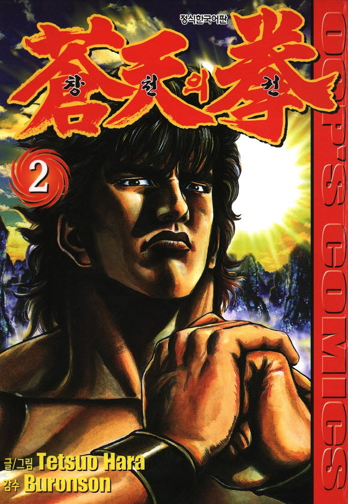

# 창천의권 카스미 켄시로 vs 북두의권 켄시로 비교 

북두의권을 좋아하는 팬이라면 한 번쯤은 이런 궁금증을 가져봤을 것이다.  
과연 **제62대 전승자 카스미 켄시로**와 **제64대 전승자 켄시로**가 싸우면 누가 승리할까?

두 사람은 모두 북두신권 역사상 손꼽히는 천재이며, 각각 자신이 살던 시대에서 최강자로 군림했다. 하지만 활동한 시대와 상대했던 적, 익힌 오의, 성장 과정이 전혀 다르기 때문에 단순 비교는 쉽지 않다.  
이번 글에서는 원작과 공식 설정을 바탕으로 두 전승자의 능력과 세계관을 하나씩 비교해 본다.

## 핵심 요약

* 창천의권과 북두의권은 동일한 세계관을 공유하는 선후배 관계다.
* 카스미 켄시로는 제62대 전승자이며, 북두의권 켄시로는 제64대 전승자다.
* 두 인물은 성격면에서 유쾌함과 과묵함이라는 정반대의 성향을 보인다.
* 순수한 파워와 파괴력 측면에서는 북두의권 켄시로가 우위를 점한다.
* 기술의 이해도와 지능, 변칙적 응용력은 카스미 켄시로가 앞선다.
* 최종 승부를 가르는 핵심 요의는 켄시로가 완성한 무상전생이다.
* 종합적인 최종 전투력은 세기말의 완성형인 북두의권 켄시로가 우세하다.



## 1. 창천의권과 북두의권은 같은 세계관일까?

결론부터 말하면 **같은 세계관**이다.

창천의권은 북두의권보다 약 60~70년 전을 배경으로 하는 프리퀄 작품이다. 1930년대 상하이를 무대로 하며, 북두신권 제62대 전승자인 카스미 켄시로의 이야기를 다룬다.

이후 세월이 흘러 류켄이 제63대 전승자가 되고, 핵전쟁 이후의 시대에서 우리가 알고 있는 켄시로가 제64대 전승자가 된다.

즉 두 사람은 같은 이름을 가진 별개의 인물이 아니라, 같은 북두신권을 계승한 선배와 후배의 관계다.

## 2. 북두신권 전승 계보

북두신권은 약 2,000년 동안 단 한 명의 계승자만을 인정하는 일자상전(一子相傳)의 권법이다.

```text
슈켄
   │
(역대 전승자)
   │
카스미 켄시로 (62대)
   │
류켄 (63대)
   │
켄시로 (64대)

```

카스미 켄시로는 류켄의 큰아버지이며, 북두의권 켄시로에게는 한 세대 위의 선배 전승자다.

## 3. 두 주인공 기본 프로필 비교

| 항목 | 카스미 켄시로 | 켄시로 |
| --- | --- | --- |
| 작품 | 창천의권 | 북두의권 |
| 시대 | 1930년대 상하이 | 핵전쟁 이후 |
| 전승 | 제62대 | 제64대 |
| 직업 | 옌칭대학 교수 | 방랑의 권사 |
| 성격 | 유쾌하고 여유로움 | 과묵하고 진중 |
| 대표 오의 | 북두신권 비전 다수 | 무상전생 |
| 별명 | 염왕 | 세기말의 구세주 |

두 사람 모두 북두신권 최고의 사용자지만 성격은 정반대다.

카스미 켄시로는 평소 농담과 담배, 술을 즐기는 여유로운 성격이다. 반면 켄시로는 사랑하는 사람과 동료들을 잃으며 깊은 슬픔을 짊어진 채 살아가는 과묵한 인물이다.

## 4. 종합 능력치 비교

| 능력치 | 북두의권 켄시로 | 창천의권 카스미 켄시로 | 종합 평가 |
| --- | --- | --- | --- |
| 스피드 | ★★★★★ | ★★★★★ | 호각 |
| 파워 | ★★★★★ | ★★★★☆ | 켄시로 우위 |
| 기술 | ★★★★★ | ★★★★★ | 서로 다른 강점 |
| 정신력 | ★★★★★ | ★★★★☆ | 켄시로 우위 |
| 지능 | ★★★★☆ | ★★★★★ | 카스미 우위 |
| 응용력 | ★★★★☆ | ★★★★★ | 카스미 우위 |
| 종합 전투력 | ★★★★★ | ★★★★☆ | 켄시로 우위 |

## 5. 스피드(Speed)

두 사람 모두 인간의 한계를 초월한 속도를 보여준다.

북두의권 켄시로는 상대가 인식하기도 전에 수십 발의 비공을 찌르는 북두백렬권을 자유롭게 사용하며, 화살이나 총탄에 가까운 공격도 순간적으로 대응한다.

카스미 켄시로는 전혀 다른 스타일이다. 직선적인 돌진보다는 유연한 회피와 변칙적인 움직임이 특징이며, 상대의 공격을 흘리면서 빈틈을 만드는 능력이 뛰어나다.

따라서 순수한 이동 속도와 반응 속도는 거의 호각으로 보는 것이 타당하다.

## 6. 파워(Power)

순수한 파괴력에서는 북두의권 켄시로가 우세하다.

켄시로는 라오우, 카이오 같은 괴물들과 정면으로 맞붙으며 건물과 암벽을 무너뜨리는 수준의 투기를 보여준다.

반면 카스미 켄시로 역시 엄청난 괴력을 지녔지만, 작품의 시대적 배경이 1930년대인 만큼 세기말처럼 과도한 파괴 연출은 상대적으로 적다. 세계관 자체의 인플레이션을 고려하면 순수한 힘은 켄시로가 한 단계 위라고 평가하는 것이 자연스럽다.

## 7. 기술(Skill) & 북두신권 완성도

두 사람 모두 북두신권 역사에 이름을 남긴 전설적인 전승자지만, 기술적인 강점은 서로 다르다. 카스미 켄시로는 북두신권 자체를 가장 자유롭게 활용하는 천재이며, 켄시로는 모든 경험을 통해 북두신권을 완성한 최종형에 가깝다.

### 북두의권 켄시로

켄시로는 수많은 강적들과의 사투를 거치며 끊임없이 성장했다. 라오우, 사우저, 카이오, 효우 등 세계관 최강자들과 싸우면서 북두신권뿐 아니라 남두성권과 북두류권의 장점까지 흡수했다.

특히 북두신권 궁극오의인 무상전생(無想転生)을 완성한 이후에는 세계관 최강자의 반열에 오른다.

### 카스미 켄시로

카스미 켄시로는 북두신권을 가장 아름답고 자유롭게 사용하는 천재다. 권법을 한 번 보면 바로 자신의 것으로 만들 정도의 응용력을 지녔으며, 서두월권을 비롯한 여러 권법에도 깊은 이해를 가지고 있다.

적의 움직임과 호흡을 읽어 가장 효율적인 비공을 선택하는 능력은 역대 전승자 가운데서도 최고 수준으로 평가된다.

### 종합 평가

궁극기의 완성도는 켄시로가 앞선다. 반면 순수한 기술 이해도와 응용력은 카스미 켄시로가 조금 더 뛰어나다고 볼 수 있다.

## 8. 정신력(Willpower)

두 사람 모두 강한 정신력을 가지고 있지만, 만들어진 과정은 전혀 다르다.

### 켄시로

켄시로는 사랑하는 사람과 동료들을 잃으며 수많은 슬픔을 짊어진다. 그 슬픔은 무상전생을 완성하는 원동력이 되었고, 어떤 절망적인 상황에서도 끝까지 포기하지 않는 정신력으로 이어진다. 세계관 전체를 통틀어 가장 강한 의지를 가진 인물이라고 평가받는 이유도 여기에 있다.

### 카스미 켄시로

카스미 켄시로는 위기 상황에서도 여유를 잃지 않는다. 적진 한가운데에서도 담배를 피우고 농담을 던질 만큼 배짱이 크며, 감정에 휘둘리지 않고 항상 냉정하게 상황을 판단한다.

멘탈의 안정감만 놓고 보면 오히려 켄시로보다 뛰어나다는 의견도 있다.

### 종합 평가

불굴의 의지와 정신력은 켄시로가 우위다. 반면 냉정함과 평정심은 카스미 켄시로가 조금 앞선다고 평가할 수 subcontinent다.

## 9. 지능(Intellect)

지능에서는 카스미 켄시로가 확실한 우위를 보인다.

그는 상하이 옌칭대학 교수이며, 방대한 의학과 역사, 문학 지식을 갖춘 학자다. 책 한 권을 그대로 외울 정도의 암기력과 뛰어난 추리 능력도 갖추고 있다. 켄시로 역시 전투 센스는 뛰어나지만, 학문적인 지식이나 전략적 사고에서는 카스미 켄시로를 따라가기 어렵다.

### 종합 평가

순수한 지적 능력과 학문적 재능은 카스미 켄시로의 완승이다.

## 10. 대표 오의 비교

| 기술 | 카스미 켄시로 | 켄시로 |
| --- | --- | --- |
| 북두백렬권 | O | O |
| 북두강타격 | O | O |
| 비공술 | O | O |
| 투기 운용 | O | O |
| 무상전생 | X | O |
| 권법 흡수 및 응용 | 매우 뛰어남 | 매우 뛰어남 |

가장 큰 차이는 역시 **무상전생**이다.

무상전생은 슬픔을 모두 받아들인 사람만 도달할 수 있는 북두신권 최고의 오의다. 카스미 켄시로가 활동했던 시대에는 이 경지에 도달했다는 설정이 존재하지 않는다. 이 점이 두 사람의 최종 전투력을 가르는 가장 큰 차이로 평가된다.

## 11. 상대했던 적들의 수준 비교

주인공의 강함은 상대했던 적을 보면 어느 정도 가늠할 수 있다.

### 카스미 켄시로가 상대했던 강자

* 야소카
* 유엽
* 홍련단
* 서두월권 고수들
* 청방과 흑사회의 권법가들

창천의권은 다양한 유파와 암살권이 등장하지만, 대부분은 인간 사회 안에서 활동하는 무술가들이다.

### 켄시로가 상대했던 강자

* 신
* 사우저
* 레이
* 토키
* 라오우
* 효우
* 한
* 카이오

특히 후반부 수라국 편은 북두신권 역사상 최강급 권사들이 연속으로 등장하는 구간이다. 라오우와 카이오는 북두신권 세계관 전체에서도 손꼽히는 강자이며, 효우와 한 역시 다른 시대였다면 최종 보스급으로 평가받을 실력을 갖추고 있다.

### 종합 평가

적들의 평균적인 수준은 북두의권이 훨씬 높다. 세계관 자체가 핵전쟁 이후 초인들이 살아남은 시대이기 때문에 전투력 인플레이션이 크게 진행된 작품이라고 볼 수 있다.

## 12. 성격 비교

| 비교 항목 | 카스미 켄시로 | 켄시로 |
| --- | --- | --- |
| 평소 모습 | 유쾌하고 여유롭다 | 과묵하고 진중하다 |
| 유머 감각 | 많다 | 거의 없다 |
| 술 | 즐긴다 | 거의 마시지 않는다 |
| 담배 | 피운다 | 피우지 않는다 |
| 여성과의 관계 | 적극적이다 | 다소 서툴다 |
| 전투 스타일 | 여유 있게 상대를 농락한다 | 빠르게 끝낸다 |

같은 이름을 가진 전승자지만 성격은 극과 권이다.

카스미 켄시로는 인간적인 매력이 강한 영웅이며, 켄시로는 슬픔을 짊어진 구도자에 가까운 인물이다. 그래서 팬들 사이에서도 "더 멋있는 켄시로"를 두고 의견이 자주 갈린다.

## 13. 카스미 켄시로 vs 켄시로, 실제로 싸우면 누가 이길까?

북두의권 팬이라면 한 번쯤은 상상해 봤을 드림 매치다. 두 사람 모두 역대 북두신권 전승자 가운데 손꼽히는 천재지만, 순수 전투력만 놓고 보면 결론은 생각보다 명확하다.

### 전투 초반

초반은 카스미 켄시로가 우세할 가능성이 높다. 카스미는 상대의 호흡과 버릇을 읽는 능력이 뛰어나며, 권법 응용력 또한 북두신권 역사상 최고 수준이다. 변칙적인 움직임과 유연한 유권으로 켄시로의 공격을 계속 흘려 보내며 흐름을 가져갈 가능성이 크다.

### 전투 중반

시간이 길어질수록 흐름이 바뀐다. 켄시로는 상대의 권법을 실전에서 흡수하며 계속 진화하는 타입이다. 라오우와 싸우며 성장했고, 사우저를 통해 약점을 찾았으며, 북두류권까지 자신의 것으로 만들었다. 카스미가 보여주는 기술 역시 시간이 지날수록 분석하고 대응하기 시작할 가능성이 높다.

### 전투 후반

결국 승부를 결정하는 것은 무상전생이다. 무상전생은 단순한 필살기가 아니라 공격 자체를 무의 상태로 흘려 버리는 북두신권 최종 오의다. 카스미 켄시로가 아무리 뛰어난 천재라 하더라도 무상전생을 상대할 방법은 작품 내에서 제시되지 않았다.

### 최종 예상

초반은 카스미 우세. 중반 이후 켄시로가 적응하기 시작하고, 최후에는 무상전생으로 켄시로가 승리할 가능성이 가장 높다.

## 14. 북두신권 역사상 최강 전승자는 누구일까?

역대 전승자를 종합하면 대략 다음과 같이 평가된다.

| 순위 | 전승자 | 평가 |
| --- | --- | --- |
| 1위 | 켄시로(64대) | 무상전생 완성, 북두종가 권법 계승, 세계관 최강 |
| 2위 | 카스미 켄시로(62대) | 역사상 최고의 천재, 압도적인 응용력 |
| 3위 | 류켄 | 제63대 전승자, 노환 이전에는 최강급 |
| 4위 | 토키(가정) | 병이 없었다면 역사상 최고 재능 |
| 5위 | 라오우 | 전승자는 아니지만 북두신권 최강의 강권 |

특히 토키는 어디까지나 **전성기 가정**이라는 전제가 붙는다. 실제로 작품에서 보여준 전투력만 기준으로 하면 카스미 켄시로보다 위에 두기는 어렵다.

## 15. 북두의권 and 창천의권은 세계관이 이어질까?

많은 사람들이 두 작품을 별개의 만화로 생각하지만 사실은 같은 세계관이다. 창천의권은 북두의권보다 약 60년 정도 이전 시대를 배경으로 한다.

즉,

**카스미 켄시로(62대 전승자) → 류켄(63대) → 켄시로(64대)**

순으로 북두신권이 계승된다. 그래서 창천의권에서 등장하는 여러 기술과 설정이 북두의권으로 자연스럽게 이어진다.

## 16. 북두신권과 북두류권의 차이

두 권법은 이름은 비슷하지만 성격은 상당히 다르다.

| 구분 | 북두신권 | 북두류권 |
| --- | --- | --- |
| 특징 | 비공을 이용한 암살권 | 파괴와 마투기에 특화 |
| 정신 | 자비와 슬픔 | 증오와 힘 |
| 대표 인물 | 켄시로, 토키, 라오우 | 카이오, 효우, 한 |
| 최종 오의 | 무상전생 | 암류천파 |

북두류권은 공격성이 매우 강하지만, 북두신권은 완성 단계에 도달하면 북두류권까지 극복하는 것으로 묘사된다.

## 결론

카스미 켄시로는 북두신권 역사상 가장 천재적인 전승자다. 지능과 응용력, 유연함에서는 켄시로보다 높은 평가를 받을 만하다. 하지만 켄시로는 세기말이라는 극한 환경에서 수많은 강적들과 싸우며 북두신권을 완성한 최종 진화형이다. 무상전생, 북두종가 권법, 타 유파 흡수 능력까지 모두 갖춘 만큼 순수 전투력에서는 한 단계 위라고 보는 것이 원작 설정과 가장 잘 부합한다.

결국 두 사람의 차이는 **'천재'와 '완성형'의 차이**라고 정리할 수 있다.


## 자주 묻는 질문(FAQ)

### 카스미 켄시로가 무상전생을 사용할 수 있나요?

아니다. 원작과 공식 설정 어디에도 카스미 켄시로가 무상전생을 익혔다는 내용은 없다.

### 카스미 켄시로와 라오우가 싸우면 누가 이길까요?

대부분의 팬들은 라오우의 근소 우세를 예상한다. 순수한 힘과 강기, 무상전생까지 고려하면 라오우가 조금 앞선다는 의견이 많다.

### 토키가 병에 걸리지 않았다면 세계관 최강이 되었을까요?

가능성은 매우 높다. 라오우 역시 토키의 재능만큼은 자신보다 위라고 인정했으며, 팬들 사이에서도 가장 많이 언급되는 가정이다. 다만 실제 작품에서 증명된 것은 아니므로 어디까지나 가설이다.

### 북두신권 역사상 가장 천재적인 전승자는 누구인가요?

대체로 카스미 켄시로가 가장 높은 평가를 받는다. 반면 최종적으로 가장 강한 전승자는 켄시로로 평가된다.

### 북두의권과 창천의권은 어느 작품부터 보는 것이 좋나요?

처음 접하는 독자라면 **북두의권 → 창천의권** 순서를 추천한다. 세계관의 핵심과 북두신권의 완성형을 먼저 이해한 뒤, 과거 이야기인 창천의권을 보면 여러 설정과 인물 관계를 더욱 흥미롭게 즐길 수 있다.