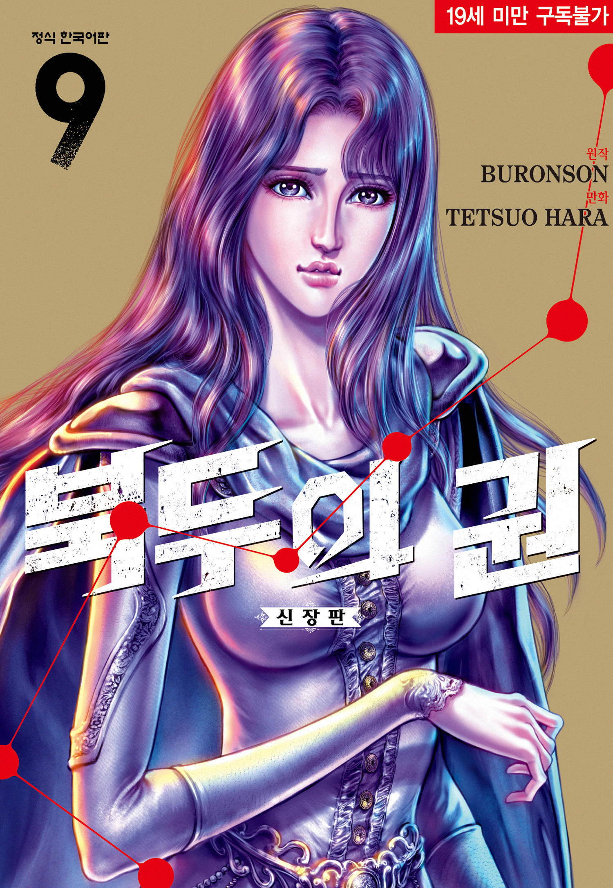
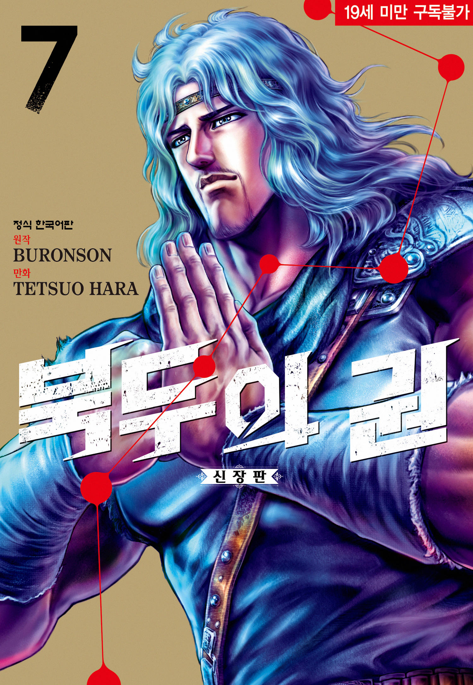
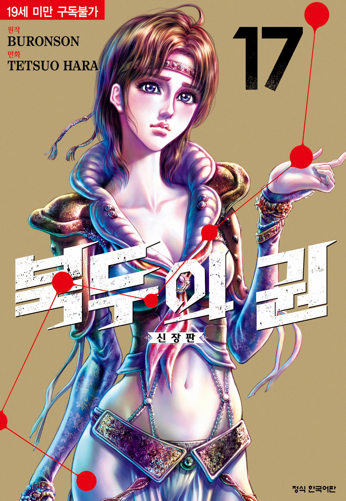

# 북두의 권 최강자 순위: 공식 설정 기준 전투력 TOP10

켄시로가 세계관 최강으로 평가되며, 토키·라오우·카이오의 논쟁까지 공식 설정과 원작 묘사를 바탕으로 북두의 권 전투력 TOP10을 종합 분석한다.

## 핵심 요약

* 원작 최종 시점을 기준으로 하면 켄시로가 세계관 최강으로 평가된다.
* 카이오와 라오우의 우열은 공식적으로 확정되지 않아 지금도 팬들 사이에서 논쟁이 이어진다.
* 병에 걸리지 않은 전성기 토키는 북두신권 역사상 최고의 천재로 평가받는다.
* 북두류권은 북두신권과 다른 계통이지만 마투기를 통해 독자적인 강함을 완성했다.
* 라오우는 순수한 강권과 무상전생을 모두 갖춘 완성형 권법가다.
* 효우는 잠재력은 최고 수준이지만 정신적인 불안정이 한계였다.
* 한은 수라국 최고의 속도형 권사이며 켄시로조차 강적으로 인정했다.
* 사우저는 특이 체질 덕분에 북두신권의 천적이 되었던 인물이다.
* 파르코는 원두황권 최고의 계승자로 라오우조차 쉽게 싸우지 않았던 강자다.
* 전투력은 단순한 인기 순위가 아니라 공식 설정과 원작 묘사를 함께 고려해야 정확하게 평가할 수 있다.

## 전투력 순위는 어떤 기준으로 선정했을까?

북두의 권은 장기 연재 작품인 만큼 시기마다 전투력 묘사가 조금씩 달라진다.

또한 애니메이션과 게임, 외전까지 포함하면 설정 차이가 존재한다.

이번 순위는 다음 기준을 중심으로 종합했다.

* 원작 만화 최종 시점
* 공식 설정집 「세기말패왕열전」
* 작중 직접적인 승패
* 등장인물의 평가와 대사
* 오의의 완성도
* 전성기 기준 여부

특히 토키처럼 병으로 인해 전력을 발휘하지 못한 인물은 별도로 전성기를 고려해 평가했다.

## 북두의 권 전투력 TOP10

| 순위 | 인물 | 권법 | 공식 등급 | 핵심 특징 |
| --- | --- | --- | --- | --- |
| 1 | 켄시로 | 북두신권 | AAA | 무상전생과 모든 권법의 흡수 |
| 2 | 카이오 | 북두류권 | AAA | 마투기와 암류천파 |
| 3 | 토키(전성기) | 북두신권 | AAA | 역사상 최고의 천재 |
| 4 | 라오우 | 북두신권 | AAA | 강권과 무상전생 |
| 5 | 효우 | 북두류권 | AAA | 종가의 혈통과 마투기 |
| 6 | 한 | 북두류권 | AA | 초고속 권풍 |
| 7 | 류켄 | 북두신권 | AA | 제63대 전승자 |
| 8 | 사우저 | 남두십자성권 | AA | 특이 체질 |
| 9 | 파르코 | 원두황권 | AA | 원두황권 최강 |
| 10 | 코우류 또는 쥬케이 | 북두신권 / 북두류권 | AA | 선대 최고수 |

## 1위 켄시로

### 세계관 최강자로 완성된 북두신권 전승자

초반의 켄시로는 뛰어난 재능을 가진 권사였지만 완성형은 아니었다.  
신, 레이, 토키, 라오우, 유리아와의 이별을 겪으며 정신적으로 성장했고, 수라국 편에서는 북두종가의 비밀까지 깨닫는다. 
최종 시점의 켄시로는 단순히 북두신권만 사용하는 인물이 아니다. 
남두성권과 북두류권은 물론 종가의 권법까지 이해하며 상대의 기술을 자신의 것으로 흡수하는 경지에 도달한다.

### 무상전생의 완성

무상전생은 북두신권 최고의 오의다. 
모든 슬픔을 짊어진 자만이 도달할 수 있는 궁극의 경지이며, 켄시로는 이를 완벽하게 자신의 것으로 만든 유일한 인물이다. 
카이오의 마투기를 극복한 것 역시 이러한 성장의 결과였다.

### 종합 평가

공식 설정과 원작 마지막 시점을 종합하면 켄시로를 넘어서는 인물은 존재하지 않는다.

## 2위 카이오

### 북두류권 최강의 제1라장

카이오는 수라국을 지배하는 절대자다.  
온몸에서 뿜어져 나오는 마투기는 상대의 정신과 감각을 흐트러뜨리며, 일반적인 권법으로는 대응하기 어렵다. 
대표 오의인 암류천파는 공간 감각 자체를 무너뜨리는 북두류권 최고의 기술이다.

### 켄시로를 가장 궁지로 몰아넣은 적

최종 보스라는 이유만이 아니라 실제 전투에서도 켄시로를 죽음 직전까지 몰아붙였다.  
초기 켄시로는 마투기를 전혀 이해하지 못했고, 그 차이 때문에 압도당한다.

다만 켄시로가 북두종가의 비밀을 깨달은 이후에는 상황이 완전히 달라진다.

### 종합 평가

순수 파괴력만 놓고 보면 세계관 최상위권이지만, 마투기에 대한 의존도가 높다는 점은 평가가 갈리는 부분이다.

## 3위 토키(전성기)

### 북두신권 역사상 최고의 천재

토키는 북두신권 최고의 재능을 가진 인물로 묘사된다.

류켄 역시 토키를 가장 이상적인 후계자로 생각했으며, 라오우조차 그의 재능만큼은 인정했다.  
문제는 핵전쟁 당시 방사능을 뒤집어쓰며 시한부가 되었다는 점이다.  
작중 대부분은 이미 병든 상태의 토키다.

### 병든 몸으로도 라오우를 몰아붙인 권사

놀라운 점은 이미 죽음을 앞둔 몸으로도 라오우를 상당히 압박했다는 사실이다.  
부드러움으로 강함을 제압하는 유권은 강권을 사용하는 라오우에게 매우 까다로운 상성이었다.  
이 때문에 팬들 사이에서는 '건강한 토키였다면 라오우를 넘어섰을 것'이라는 의견이 꾸준히 제기된다.

### 종합 평가

공식적으로 최강이라고 단정되지는 않았지만, 전성기를 가정하면 세계관 최고 수준의 잠재력을 가진 인물이라는 점에는 큰 이견이 없다.

## 4위 라오우

### 패왕이라 불린 이유

라오우는 힘으로 세상을 지배하려 했던 북두신권 최고의 강권 사용자다.  
압도적인 체격과 강기는 물론, 누구보다 뛰어난 전투 감각을 갖추고 있었다.  
후반부에는 슬픔을 받아들이며 무상전생까지 익히게 된다.  
이는 단순한 힘이 아니라 정신적인 성장까지 완성했음을 의미한다.

### 순수한 권법의 완성도

라오우는 특수 능력이나 기교보다 정면 승부에서 가장 위협적인 인물이다.

실제로 켄시로와의 마지막 대결 역시 순수한 북두신권의 정면 승부에 가까웠다.  
그 때문에 지금도 팬들 사이에서는 카이오보다 라오우가 더 강했다는 의견이 적지 않다.  

## 5위 효우

### 북두종가의 혈통을 이은 제2라장

효우는 켄시로의 친형이자 북두종가의 정통 혈통을 이어받은 인물이다.

수라국의 제2라장으로 군림하며 북두류권과 마투기를 모두 사용할 수 있는 몇 안 되는 권사이기도 하다.  
카이오는 효우의 잠재력을 누구보다 잘 알고 있었기에 기억을 봉인하고 감정을 이용해 자신의 뜻대로 움직이도록 만들었다.  
이는 효우의 재능이 카이오에게도 위협이 되었음을 보여준다.

### 잠재력은 최상위, 완성도는 아쉬웠다

효우는 혈통과 재능만 놓고 보면 세계관 최상위권이다.

하지만 가족에 대한 애정과 인간적인 감정을 끝내 버리지 못했고, 그것이 북두류권의 마성(魔性)을 완전히 받아들이지 못한 원인이 되었다.  
결국 잠재력은 카이오에 필적했지만 권법의 완성도에서는 한 단계 부족했다는 평가를 받는다.

### 종합 평가

완성된 권사라기보다 가능성이 매우 컸던 천재형 캐릭터다.  
전성기 토키와 비슷하게 '만약'이라는 가정이 가장 많이 따라붙는 인물 가운데 하나다.

---

## 6위 한

### 수라국 최고의 속도형 권사

한은 수라국 제3라장이며 북두류권의 또 다른 완성형이다.

압도적인 속도를 이용한 연속 공격이 특징이며, 너무 빠른 권속 때문에 팔의 움직임이 보이지 않는다는 묘사가 등장한다.  
주먹이 닿기 전에 권풍만으로 상대를 베어버리는 수준의 속도를 자랑한다.

### 켄시로가 인정한 강자

켄시로는 한과 싸운 뒤 라오우에 필적하는 강자라고 평가했다.

단순한 립서비스가 아니라 실제 전투에서도 켄시로가 상당한 고전을 겪는다.  
특히 근거리에서 폭발적으로 이어지는 연속 공격은 북두류권 특유의 공격성과 결합해 매우 위협적이었다.

### 종합 평가

절대적인 파괴력은 카이오나 라오우보다 한 단계 아래지만, 순수한 속도와 연속 공격만큼은 세계관 최고 수준으로 평가받는다.

---

## 7위 류켄

### 제63대 북두신권 전승자

류켄은 켄시로와 라오우, 토키, 자기를 길러낸 스승이다.

이미 노환과 심장 질환으로 전성기를 지난 상태에서도 라오우를 완전히 압도하는 모습을 보여준다.  
이는 전성기 류켄의 실력이 얼마나 뛰어났는지를 짐작하게 만든다.

### 마지막까지 라오우를 몰아붙인 인물

류켄은 북두신권의 비오의인 칠성점심을 사용해 라오우를 죽음 직전까지 몰아넣는다.

하지만 결정적인 순간 심장 발작이 발생하면서 역습을 허용했고, 결국 제자의 손에 생을 마감한다.  
만약 건강한 몸이었다면 결과는 완전히 달라졌을 가능성이 높다.

### 종합 평가

원작에서는 전성기를 거의 보여주지 못했지만, 설정과 묘사를 종합하면 충분히 TOP10 안에 포함될 자격이 있는 강자다.

---

## 8위 사우저

### 북두신권의 천적

사우저는 남두육성권 가운데 가장 독보적인 존재다.

남두십자성권 자체도 강력하지만, 진짜 무서운 점은 심장과 경락의 위치가 일반 인간과 완전히 반대라는 특이 체질이다.  
북두신권은 비공을 정확하게 찌르는 암살권이기 때문에 이 구조를 모르면 제대로 공격할 수 없다.

### 켄시로를 최초로 완패시킨 인물

초기 켄시로는 사우저의 비밀을 알지 못한 채 싸웠고 완전히 패배한다.

이후 비밀을 간파한 뒤에야 승리할 수 있었다.  
즉, 사우저는 순수한 실력뿐 아니라 상대 권법을 무력화하는 극단적인 상성을 가진 인물이었다.

### 종합 평가

정면 화력만 보면 상위권보다 조금 부족하지만, 상성까지 포함하면 누구와 싸워도 쉽게 볼 수 없는 위험한 권사다.

---

## 9위 파르코

### 원두황권 최고의 계승자

파르코는 천제를 지키는 금색의 장군이며 원두황권 최고의 사용자다.

원두황권은 비공을 찌르는 권법이 아니라 세포 자체를 파괴하는 특수한 권법이다.  
상대를 얼리거나 태워 세포를 붕괴시키는 독특한 공격 방식을 사용한다.

### 라오우조차 피했던 강자

작중에서는 라오우가 파르코와의 정면 충돌을 피했다는 언급이 등장한다.

이는 승패를 떠나 서로에게 큰 피해를 입을 정도의 강자였다는 의미로 해석하는 팬들이 많다.  
다만 작중 시점의 파르코는 의족이라는 큰 약점을 안고 있었다.

### 종합 평가

건강한 전성기 기준이라면 한 단계 더 높은 평가도 가능하지만, 원작에서 보여준 모습만 놓고 보면 9위 정도가 가장 안정적이다.

---

## 10위 코우류 또는 쥬케이

### 전설 속 선대 고수들

TOP10 마지막은 가장 의견이 갈리는 자리다.

레이를 넣는 경우도 많지만, 공식 설정과 원작의 암시를 종합하면 선대 고수인 코우류와 쥬케이가 더 높은 평가를 받는다.

### 코우류

코우류는 류켄의 사형이자 북두신권의 최고수 가운데 한 명이다.

라오우조차 정면 대결을 피하려 했다는 설정이 존재하며, 나이가 들기 전 실력은 류켄과 비슷하거나 그 이상으로 평가된다.

### 쥬케이

쥬케이는 북두류권을 완성한 스승이다.

카이오와 효우, 한까지 모두 그의 제자였으며, 북두류권이라는 위험한 권법을 통제할 수 있었던 몇 안 되는 인물이다.  
전성기의 실력은 직접 등장하지 않지만 설정상 최상위권 강자로 평가된다.

### 종합 평가

등장 장면은 적지만 설정을 고려하면 레이보다 높은 순위에 배치하는 것이 자연스럽다.

---

## 토키는 정말 라오우보다 강했을까?

북두의 권 팬들 사이에서 가장 오래 이어진 논쟁 가운데 하나다.

공식적으로 토키가 라오우보다 강했다고 확정된 적은 없다.  
하지만 전성기 토키가 라오우를 넘어섰을 가능성을 보여주는 근거는 상당히 많다.

### 라오우가 인정한 재능

라오우는 누구에게도 쉽게 패배를 인정하지 않는 인물이다.

그런 라오우조차 토키가 병에 걸리지 않았다면 북두신권 전승자는 토키가 되었을 것이라고 인정한다.  
이는 단순한 칭찬이 아니라 토키의 천재성을 보여주는 중요한 대사다.

### 병든 몸으로도 라오우를 몰아붙였다

토키는 이미 죽음을 앞둔 몸이었다.

그럼에도 라오우를 상당 시간 압박하며 승부를 이어간다.  
건강한 몸이었다면 결과가 달라졌을 가능성은 충분하다.

### 유권과 강권의 상성

토키의 유권은 상대의 힘을 흘려보내는 권법이다.

반면 라오우는 정면으로 밀어붙이는 강권의 대표적인 사용자다.  
권법의 상성만 보면 토키가 조금 더 유리한 구조라고 볼 수 있다.

### 결론

전성기 토키가 라오우보다 강했을 가능성은 충분히 존재한다.

다만 원작에서 실제 대결이 이루어지지 않았기 때문에 어디까지나 설정과 작중 묘사를 바탕으로 한 해석의 영역으로 보는 것이 가장 합리적이다.  

## 카이오와 라오우는 누가 더 강할까?

토키와 함께 가장 많은 논쟁이 이어지는 인물이 바로 카이오와 라오우다.

카이오가 최종 보스였다는 이유만으로 더 강하다고 평가하는 의견도 있고, 순수한 권법의 완성도는 라오우가 위라는 의견도 많다.  
공식 설정에서는 두 사람의 우열을 명확하게 확정하지 않았다.

### 카이오가 우세하다는 근거

카이오의 가장 큰 무기는 마투기다.

마투기는 상대의 정신을 흔들고 감각을 왜곡하는 특수한 기로, 처음 상대하는 권사는 자신의 실력을 제대로 발휘하기 어렵다.  
여기에 암류천파까지 더해지면 공간 감각 자체를 잃어버리기 때문에 일반적인 권법으로 대응하기는 거의 불가능하다.

실제로 켄시로 역시 첫 번째 대결에서는 아무것도 하지 못한 채 압도당했다.

순수한 파괴력과 특수 능력만 놓고 보면 카이오는 세계관 최상위권이라고 볼 수 있다.

### 라오우가 우세하다는 근거

반대로 라오우는 마투기 같은 특수 능력이 아니라 순수한 북두신권으로 최강의 자리에 오른 인물이다.

후반부에는 무상전생까지 익히면서 정신적인 경지 또한 완성한다.  
무상전생은 실체를 무의 상태로 만드는 북두신권 최고의 오의다.  
이 상태에서는 카이오의 마투기나 암류천파가 제대로 통하지 않을 가능성이 높다.

또한 카이오는 작중에서 라오우를 상당히 경계하는 모습을 여러 차례 보인다.  
이는 라오우를 단순히 동생이 아니라 자신의 패권을 위협할 존재로 인식했음을 의미한다.

### 종합 평가

마투기를 모르는 상대라면 카이오가 우세할 가능성이 크다.

반대로 무상전생을 완성한 라오우라면 순수한 권법의 완성도에서 우위를 점할 가능성이 있다.  
결국 두 사람은 상성에 따라 결과가 달라질 수 있는 세계관 최상위권 라이벌로 보는 것이 가장 합리적이다.

---

## 최고 전성기 토키와 최고 전성기 켄시로가 싸우면 누가 이길까?

이 역시 북두의 권 팬들이 가장 많이 토론하는 주제다.

한 사람은 북두신권 역사상 최고의 천재이고, 다른 한 사람은 모든 슬픔을 짊어진 끝에 세계관 최강으로 완성된 구세주다.

### 토키의 장점

토키는 태생부터 천재였다.

유권의 완성도는 북두신권 역사상 최고 수준이며, 상대의 기를 읽고 비공을 정확하게 공략하는 능력 역시 독보적이다.

병든 몸으로도 라오우를 위협했다는 점은 그의 재능을 가장 잘 보여주는 장면이다.  
만약 건강한 몸이었다면 무상전생에도 누구보다 먼저 도달했을 것이라는 의견도 적지 않다.

### 켄시로의 장점

켄시로는 작품이 진행될수록 끊임없이 성장한다.

라오우와의 결전 이후에는 무상전생을 완성했고, 수라국에서는 북두종가의 비밀까지 모두 이어받는다.  
또한 다른 권법을 자신의 것으로 흡수하고 응용하는 능력은 세계관에서 켄시로만 가진 가장 큰 장점이다.  
북두신권뿐 아니라 남두성권, 북두류권, 종가 권법까지 모두 이해한 완성형 권사라고 할 수 있다.

### 승부 예측

초반에는 토키가 경기 흐름을 주도할 가능성이 높다.

유권 특유의 부드러운 움직임은 켄시로의 공격을 계속 흘려보낼 수 있기 때문이다.  
하지만 장기전으로 갈수록 켄시로가 다양한 권법과 무상전생을 조합하며 흐름을 바꿀 가능성이 높다.

### 종합 평가

전성기 토키는 역사상 최고의 천재였지만, 원작 최종 시점의 켄시로는 그 천재성마저 뛰어넘어 완성된 존재다.

공식 설정과 원작 마지막 시점을 함께 고려하면 켄시로가 근소한 우세를 점한다고 보는 것이 가장 설득력이 있다.

---

---

## 결론

북두의 권의 전투력은 단순히 작품 후반에 등장했다고 해서 높아지는 구조가 아니다.

권법의 완성도와 정신적인 성장, 오의의 수준, 실제 전투 묘사를 모두 함께 살펴봐야 비로소 균형 잡힌 평가가 가능하다.  
최종적으로 켄시로는 무상전생과 북두종가의 힘, 그리고 수많은 강자들의 권법을 자신의 것으로 흡수하며 세계관 최강의 자리에 오른다.

카이오와 라오우는 지금도 팬들 사이에서 우열이 갈리는 최고의 라이벌이며, 병에 걸리지 않은 전성기 토키 역시 북두신권 역사상 가장 뛰어난 천재로 평가받는다.

이처럼 북두의 권은 단순한 강함의 경쟁을 넘어, 각 인물이 어떤 삶을 살아왔고 어떤 슬픔을 짊어졌는지가 전투력과 직결되는 작품이다. 그래서 수십 년이 지난 지금도 켄시로, 라오우, 토키, 카이오를 둘러싼 논쟁은 여전히 북두의 권 팬들에게 가장 흥미로운 이야기로 남아 있다.

---

## 자주 묻는 질문(FAQ)

### 북두의 권 공식 최강자는 누구인가?

원작 최종 시점과 공식 설정을 종합하면 켄시로가 세계관 최강으로 평가된다.

### 전성기 토키는 정말 라오우보다 강했을까?

라오우가 토키의 재능을 인정한 것은 사실이다.

다만 실제 전성기 대결은 등장하지 않았기 때문에 어디까지나 가능성의 영역으로 남아 있다.

### 카이오가 최종 보스인데 왜 1위가 아닌가?

최종 보스라는 사실과 세계관 최강이라는 평가는 반드시 일치하지 않는다.  
후반부 켄시로는 카이오를 극복하며 더 높은 경지에 도달한다.

### 무상전생은 정확히 어떤 기술인가?

북두신권 최고의 오의로, 모든 슬픔을 받아들인 자만이 도달할 수 있는 궁극의 경지다.  
공격을 흘려보내고 무의 상태에서 반격하는 것이 핵심이다.

### 북두류권과 북두신권은 무엇이 다른가?

북두신권은 비공을 이용하는 암살권이다.  
북두류권은 여기에 마성을 더해 상대를 파괴하는 방향으로 발전한 분파라고 볼 수 있다.

### 남두성권 최강자는 사우저인가?

남두육성권만 기준으로 보면 사우저를 최강으로 평가하는 의견이 가장 많다.

다만 유파 전체를 포함하면 다양한 해석이 존재한다.

### 파르코는 왜 생각보다 순위가 낮은가?

실력이 부족해서가 아니라 토키, 라오우, 효우처럼 세계관 최상위권 강자들이 너무 많기 때문이다.  
전성기 기준이라면 조금 더 높은 평가도 가능하다.

### 레이가 TOP10에서 빠진 이유는?

레이는 남두수조권 최고의 계승자지만, 후반부 수라국 편에서 등장하는 최상위 강자들과 비교하면 체급 차이가 있다는 평가가 많다.