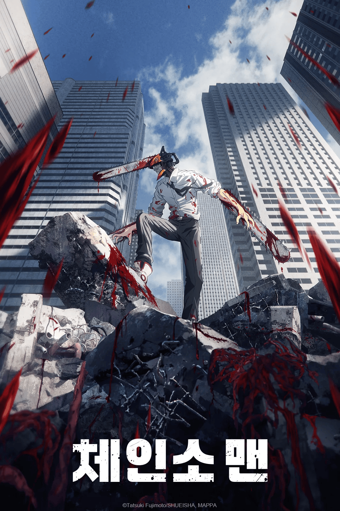

# 체인소맨 허무주의 분석: 소년만화 틀을 깬 진짜 이유

거대한 꿈과 성장의 공식을 뒤틀어버린 체인소맨. 생존과 욕망, 죽음이라는 키워드를 통해 기존 소년만화와는 결을 달리하는 허무주의를 들여다본다.

[드래곤볼]의 손오공은 최강자를 꿈꾸고, [나루토]의 나루토는 호카게가 되기 위해 질주한다. [원피스]의 루피가 해적왕을 향해 바다로 나가는 것처럼, 이들의 서사는 '고난 끝에 결국 더 나은 곳으로 닿을 수 있다'는 희망 어린 믿음을 연료 삼아 달린다.

반면 덴지가 속한 세계는 전혀 다르다. 그가 갈구하는 건 거창한 명예가 아니다. 식빵에 잼을 발라 먹고, 따뜻한 침대에서 잠을 자고, 누군가와 함께 사는 것. 남들이 보면 참 소박하고 초라한 꿈이지만, 덴지에게 그것은 한 번도 가져보지 못한, 삶의 가장 기본적인 권리였다.

그래서 [체인소맨]이 보여주는 허무주의는 허무함 그 자체에 매몰되는 태도와는 거리가 멀다. 거창한 꿈이 사라진 자리에서 그저 포기하는 이야기가 아니라, 꿈조차 꿀 수 없을 만큼 망가진 사람이 아주 작은 욕망 하나를 붙잡고 악착같이 살아가는 생존기인 셈이다.

## 1. 덴지가 원하는 것은 왜 그렇게 작은가?

보통의 소년만화 주인공들은 현재의 자신을 뛰어넘는 목표를 세운다. 목표가 클수록 이야기는 그를 향해 역동적으로 움직인다. 훈련하고, 동료를 모으고, 강적과 맞서며 점차 꿈에 가까워지는 과정이 우리가 알던 소년만화의 문법이다.

하지만 덴지에게는 애초에 그런 목표를 품을 여유가 없었다. 빚더미에 앉아 매일 생존을 위해 악마를 사냥하던 아이에게 '더 나은 미래'는 사치였다. 그에게 중요한 건 오늘 배를 채울 수 있느냐, 아니면 내일 당장 쫓겨나지 않느냐는 생존의 문제였다.

덴지가 툭하면 여자와 관계를 맺고 싶다거나 맛있는 음식을 먹고 싶다고 말하는 장면은 때로 우스꽝스럽게 비치기도 한다. 그러나 그 욕망을 단순한 쾌락 추구로 치부할 수 있을까? 누군가와 마음을 나누고 싶고, 안락한 집에서 평범하게 살고 싶다는 마음은 사실 덴지에게 가장 절박한 생존 본능이다.

다른 주인공들에게 평범한 일상이 모험의 출발점이라면, 덴지에게는 도달하고 싶은 최종 목표인 것이다. 이 작은 차이가 두 장르를 가르는 결정적인 지점이다.

과거의 만화가 "노력하면 언젠가 원하는 곳에 도착한다"고 속삭였다면, [체인소맨]은 그 말을 도무지 믿을 수 없는 사람을 주인공으로 내세운다. 덴지는 먼 미래를 위해 현재를 희생하는 법을 배운 적이 없다. 그래서 그는 지금 당장 손에 쥘 수 있는 아주 작은 행복에 매달린다. 덴지의 욕망이 초라해 보일수록 그의 처지는 더욱 처절하게 다가온다. 그건 그가 꿈이 없어서가 아니라, 꿈을 가질 기회조차 박탈당해 왔음을 의미하기 때문이다.

## 2. 죽음은 누구도 기다려주지 않는다.

소년만화에서 죽음은 대개 이야기의 전환점이 된다. 누군가의 죽음을 계기로 주인공은 슬픔과 분노를 겪고, 그 뜻을 이어받아 한 단계 성장한다. 죽음은 서사를 위한 도구이자 성장의 연료가 되곤 한다.

하지만 [체인소맨]에서의 죽음은 그리 깔끔하게 정리되지 않는다. 누군가가 허망하게 사라져도 세상은 아무 일 없다는 듯 계속 돌아간다. 남은 이들은 슬퍼할 겨를도 없이 닥쳐올 다음 재난을 맞이해야 한다. 죽음이 특별한 사건이 아니라 너무도 흔한 일상이기 때문이다.

공안 데빌헌터라는 직업 자체가 죽음과 늘 맞닿아 있다. 악마와 싸우기 위해 몸의 일부나 수명을 바치는 이들에게 목숨은 언제든 사라질 수 있는 소모품에 불과하다. 그들의 희생이 반드시 고결한 결과로 돌아오는 것도 아니다.

아키는 가족과 동료를 지키기 위해 모든 것을 바쳤지만, 그의 마지막은 자신이 가장 지키고 싶었던 이들을 향한 비극으로 되돌아온다. 파워의 죽음 또한 마찬가지다. 투닥거리며 유치하게 싸우던 둘 사이에 어느새 가족과 같은 감정이 싹텄을 때, 작품은 그 평범한 일상을 단칼에 끊어버린다.

독자가 느끼는 상실감은 단순히 캐릭터의 죽음 때문만은 아니다. 덴지가 그토록 어렵게 일궈온 '생활의 모양'이 무너져 내렸기 때문이다. 죽음은 덴지를 성장시키는 계기가 되기는커녕, 한동안 그를 무기력함의 늪으로 밀어 넣는다.

이런 점에서 [체인소맨]의 죽음은 지극히 현실적이다. 누군가의 죽음이 항상 교훈을 남기지는 않는다. 때로는 너무 갑작스럽고, 남은 이에게는 정리되지 않은 감정의 찌꺼기만 남을 뿐이다. 그 감정을 억지로 승화시키지 않고 불편함 그대로 두는 것, 이것이 바로 이 작품이 가진 힘이다.

## 3. 노력만으로는 바꿀 수 없는 세계

흔히 소년만화에서 노력과 힘은 정비례한다. 훈련하고 단련하면 이전에는 이길 수 없던 상대를 꺾을 수 있다. 주인공의 노력은 승리를 통해 증명된다.

[체인소맨]의 세계는 훨씬 냉혹하다. 악마의 힘은 개인의 수련이 아니라 사람들의 공포심에서 비롯된다. 한 개인이 아무리 피를 토하며 노력해도, 사회 전체가 느끼는 두려움까지 혼자 짊어질 수는 없다. 총에 대한 공포가 총의 악마를 키우듯, 힘의 원천은 개인을 넘어 사회적인 감정 속에 놓여 있다.

마키마는 이 구조를 꿰뚫고 있다. 그녀는 체인소맨을 굴복시키기 위해 더 강한 힘으로 맞붙는 대신, 대중의 인식을 조작한다. 그를 두려움의 대상에서 영웅으로, 혹은 다시 혐오의 대상으로 바꾸며 그 힘의 크기를 조절한다.

이 세계에서 개인의 의지는 무력하기 십상이다. 국가 권력, 조직의 명령, 대중의 감정, 악마와의 계약이 한 사람의 삶을 줄타기하게 만든다. 열심히 산다고 해서 반드시 보상받는다는 보장이 없는 세상이다. 공안이라는 조직조차 동료애를 나누는 길드와는 거리가 멀다. 여기에서 사람은 언제든 교체 가능한 부품이다. 누군가 죽으면 조직은 슬퍼하는 대신 다음 사람을 투입할 뿐이다.

덴지는 그 안에서 겨우 안정된 삶을 얻었다. 밥을 먹고, 잘 곳이 생기고, 친구가 생겼다. 하지만 그 대가는 명확했다. 바로 '자유'다. 그는 보호받는 동시에 철저히 관리되는 존재가 되었다.

## 4. 마키마가 무서운 이유

마키마가 소름 끼치는 이유는 그녀가 힘으로 덴지를 짓누르지 않기 때문이다. 대신 그녀는 덴지가 그토록 갈망하던 것들을 하나씩 건네준다. 밥과 잠자리, 그리고 관계까지.

덴지에게 마키마는 구원자와 다름없다. 삶의 질이 달라졌으니까. 하지만 그 변화는 덴지의 자발적인 선택이 아니었다. 마키마는 덴지가 원하는 것을 제공하면서, 동시에 그가 원하는 것의 방향마저 설계했다. 덴지는 스스로 선택한다고 믿었지만, 실은 그녀가 짜놓은 판 안에서 움직이고 있었을 뿐이다.

이 관계는 현실의 권력과 닮아 있다. 배고픈 이에게 음식을 주고, 외로운 이에게 관계를 맺어주는 행위는 선의로 보일 수 있다. 하지만 그 온정 뒤에 복종이 요구된다면, 그것은 보호가 아니라 지배다.

마키마는 덴지를 무너뜨릴 때도 잔인하다. 그가 소중히 여긴 일상을 하나씩 파괴한다. 애초에 행복을 몰랐다면 빼앗을 것도 없었을 것이다. 하지만 마키마는 덴지에게 행복을 맛보게 한 뒤 그것을 앗아감으로써 상실의 고통을 극대화한다.

그녀가 꿈꾸는 세계도 같은 맥락이다. 전쟁과 기아, 죽음이 없는 고통 없는 세상. 겉보기엔 이상향 같지만, 그 평화에는 인간의 선택권이 없다. 그녀에게 이상적인 세계란 각자가 원하는 대로 사는 곳이 아니라, 자신이 정한 질서가 완벽하게 유지되는 곳이다. 고통을 없애기 위해 인간의 개성과 자유를 거세하는 것, 이것이야말로 가장 거대한 폭력이 아닐까. [체인소맨]에서 정말 무서운 것은 악마의 외형이 아니라, 나의 욕망과 선택을 타인에게 저당 잡히는 상황 그 자체다.

## 5. 허무주의는 정말 아무것도 남기지 않는가

[체인소맨]을 두고 허무주의라고 부를 때, 세상에 의미가 없다는 뜻으로만 해석하면 작품의 진가를 놓치게 된다. 덴지는 위대한 꿈을 이루지도 못했고, 소중한 동료를 잃었으며, 그가 바랐던 일상조차 산산조각 났다. 그러나 그의 삶이 완전히 빈 껍데기가 된 것은 아니다.

아키와 파워와 함께했던 시간, 포치타와 맺었던 약속은 덴지의 내면에 깊이 박혀 있다. 평범한 생활을 겪어본 기억은, 이제 그가 앞으로 무엇을 원하는지 판단하는 기준이 된다.

작품은 "모든 게 무의미하다"고 말하는 대신, "의미란 영원히 보장되지 않는다"는 사실을 묵묵히 보여준다. 관계는 깨지고, 사람은 죽고, 노력은 실패할 수 있다. 하지만 함께 보낸 시간의 무게만큼은 결코 사라지지 않는다.

이런 태도는 기존 소년만화의 '인간찬가'와 결이 다르다. 세상을 더 나은 곳으로 만들겠다는 거창한 다짐이 아니라, 엉망진창인 세상에서도 기어코 밥을 먹고 누군가와 온기를 나누는 일을 포기하지 않는 삶. 그것이 [체인소맨]식의 인간찬가다.

주인공에게 혈통의 비밀도 없고, 죽음이 승리를 보장하지도 않으며, 노력이 늘 보상받는 것도 아니다. 이런 문법의 파괴를 거듭할수록, 독자는 오히려 다음을 기대하게 된다. 단순한 반전을 기다리는 것이 아니라, 캐릭터가 죽음을 맞이한 뒤 남은 이들이 어떻게 변해가는지를 지켜보게 된다.

단편 작업들이 하나의 감정을 짧고 강렬하게 응축해낸다면, [체인소맨] 같은 장편은 독자와 캐릭터가 함께 쌓아온 시간이 길다. 그만큼 캐릭터가 사라진 빈자리도 크다. 그래서 해체적인 작품일수록, 무엇을 부수느냐만큼이나 무엇을 남기느냐가 중요하다.

## 6. 덴지는 어떻게 자신의 삶으로 돌아가는가?

아키와 파워를 잃고 덴지는 모든 삶의 이유를 상실한다. 그토록 바랐던 평범한 일상이 곧 자신을 살게 하던 이유였기에, 그것이 무너지자 덴지도 함께 무너졌다. 마키마는 단순히 동료를 빼앗은 것이 아니라, 덴지라는 존재의 중심축을 뽑아버린 셈이다.

그럼에도 덴지는 무력한 피해자로 남지 않는다. 그가 마지막에 되찾은 것은 초능력도, 거창한 사명도 아니다. 자신이 무엇을 원하는지 스스로 생각할 힘이다.

이는 전통적인 소년만화의 성장과는 다른 지점이다. 강해지는 대신, 남이 주입한 욕망과 나의 진짜 욕망을 구분하고, 그중 무엇을 선택할지 결정하는 주체성을 회복하는 과정이다.

마키마라는 절대적인 존재에 맞서는 행위 역시 마찬가지다. 덴지는 더 이상 그녀가 만들어준 가짜 행복에 안주하지 않는다. 비록 완벽하지 않더라도, 스스로 선택하고 책임질 수 있는 삶을 선택한다.

그가 원하는 삶은 여전히 소박하다. 밥을 먹고, 사람을 만나고, 사랑하고, 또다시 상처받는 것. 하지만 그 욕망이 누군가의 명령이 아니라 자기 안에서 나온 것이라면, 그것만으로도 덴지에겐 충분히 위대한 변화다.

## 결론

[체인소맨]은 기존 소년만화의 성장을 부정하는 작품이 아니다. 다만, 그 성장이 더 이상 당연하게 주어지지 않는 세계를 그릴 뿐이다. 거대한 꿈을 꿔도 이루어질 보장은 없고, 노력해도 헛수고일 때가 있다. 때로는 희생이 주인공을 강하게 만들기는커녕 무너뜨리기도 한다.

덴지는 그런 불친절한 세계에서 산다. 그가 원하는 건 세상을 구하는 힘이 아니라, 한 끼 식사와 잠잘 곳, 그리고 곁에 있을 사람이다. 작고 초라해 보이지만, 덴지에게는 평생 가져본 적 없던 가장 소중한 조건이었다.

마키마는 그 욕망마저 도구로 삼아 덴지를 지배하려 했다. 하지만 덴지는 결국 다시 자신의 삶을 선택했다. 그가 얻은 건 완벽한 세계가 아니다. 자신의 욕망과 판단을 스스로 결정할 수 있는, 아주 작지만 확실한 자유다.

허무주의는 바로 그곳에 있다. 어떤 선택도 안전하지 않고, 세상이 반드시 좋아지라는 약속도 없다. 그럼에도 우리는 밥을 먹고, 사랑하고, 내일을 살아간다. 완벽한 답은 없지만, 스스로 선택한 삶을 이어가는 것. 덴지에게 남은 것은 아마 그 정도의 답일 것이다. 그리고 [체인소맨]이 특별한 이유 또한 그 '작고 불완전한 답'을 긍정하는 데 있다.

## 자주 묻는 질문(FAQ)

### [체인소맨]은 정말 허무주의 작품인가요?

철학적인 의미의 허무주의를 그대로 투영했다고 보기는 어렵습니다. 다만, 기존 소년만화가 신봉해온 '노력하면 보상받는다'는 공식을 철저히 흔들고, 죽음과 상실, 불확실성을 이야기의 핵심에 배치했다는 점에서 허무주의적인 분위기가 짙게 깔려 있습니다.

### 덴지는 왜 다른 소년만화 주인공들과 다른가요?

다른 주인공들이 '호카게'나 '해적왕' 같은 거대한 목표를 쫓는다면, 덴지는 '평범한 삶' 그 자체를 갈망합니다. 다른 이들에게 일상이 당연한 출발점이라면, 덴지에게 일상은 너무나 오랫동안 가져본 적 없는 간절한 목표이기 때문입니다.

### 마키마가 원하는 평화는 왜 위험한가요?

그녀가 말하는 평화는 전쟁과 기아 없는 세상을 만드는 것처럼 보이지만, 그 대가로 인간의 자율성과 개성을 모두 통제하려 합니다. 각자의 선택이 사라진 평화는 행복이라기보다는 마키마라는 관리자 아래 놓인 질서에 불과하기 때문입니다.

### [체인소맨]의 죽음은 왜 그렇게 허무하게 느껴지나요?

죽음이 주인공의 성장을 위한 도구로 쓰이지 않기 때문입니다. 누군가 죽어도 세계는 무심하게 돌아가고, 남은 이들은 충분히 슬퍼할 시간조차 갖지 못합니다. 작품은 죽음을 아름답게 포장하지 않고, 현실의 부조리처럼 갑작스럽고 정리되지 않은 상태 그대로 방치합니다.

### 왜 이런 해체적인 작품은 결말에서 호불호가 갈리나요?

익숙한 문법을 깨는 것보다, 그 뒤에 독자가 붙잡을 수 있는 새로운 의미를 남기는 것이 훨씬 어렵기 때문입니다. 파격적인 전개가 이어질수록 독자들은 충격 그 자체보다 '그래서 결국 무슨 말을 하고 싶은 건지'에 주목하게 됩니다. 해체 이후에도 캐릭터 간의 관계와 감정의 서사가 견고하지 않으면 이야기는 공허하게 느껴질 수 있습니다.