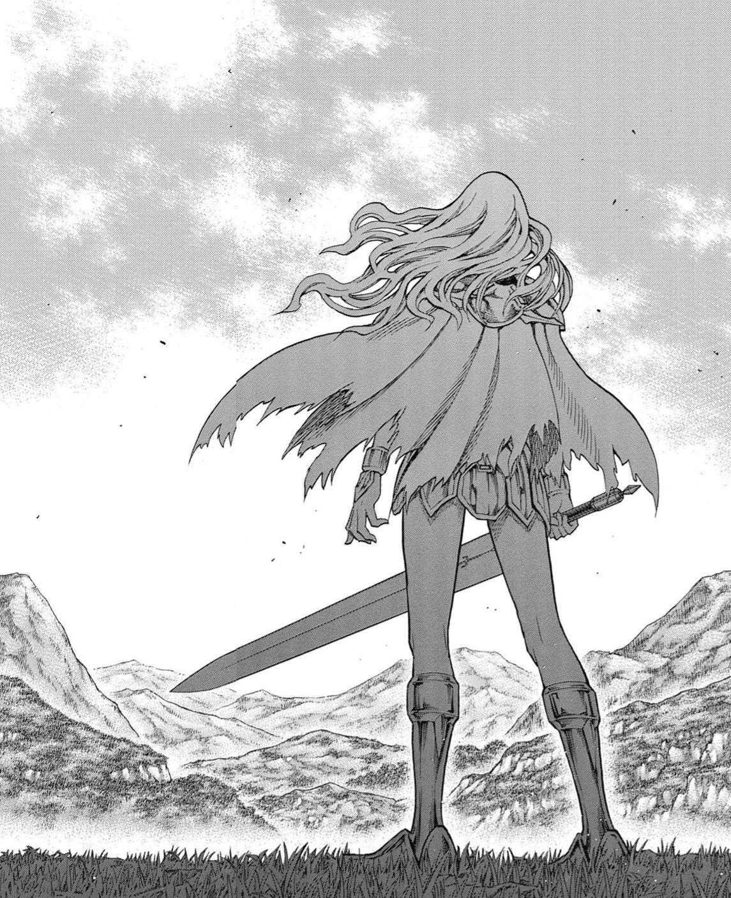
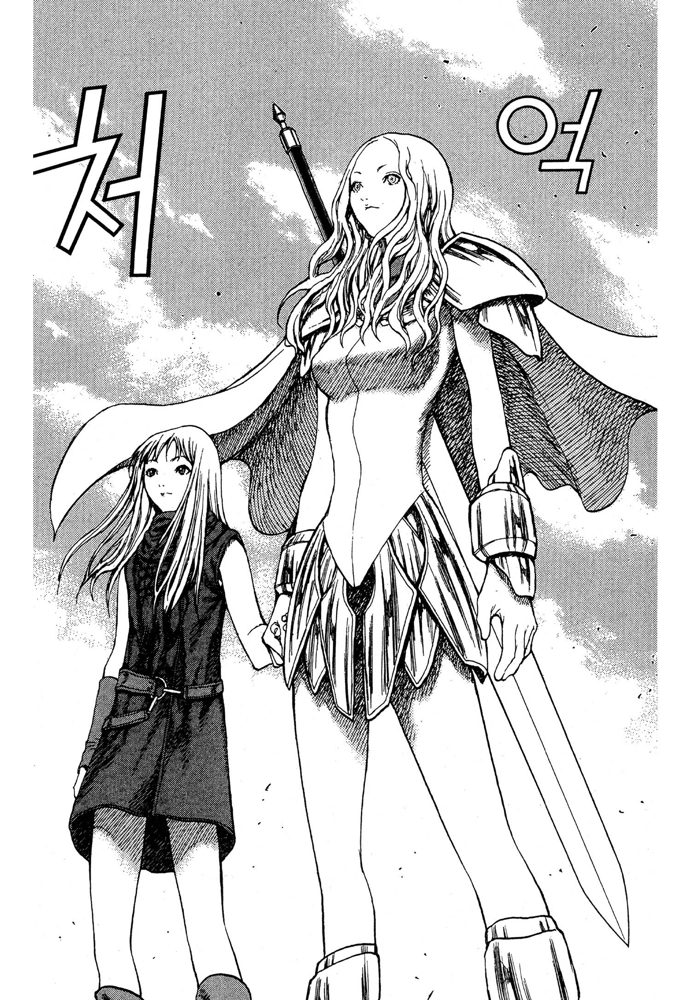
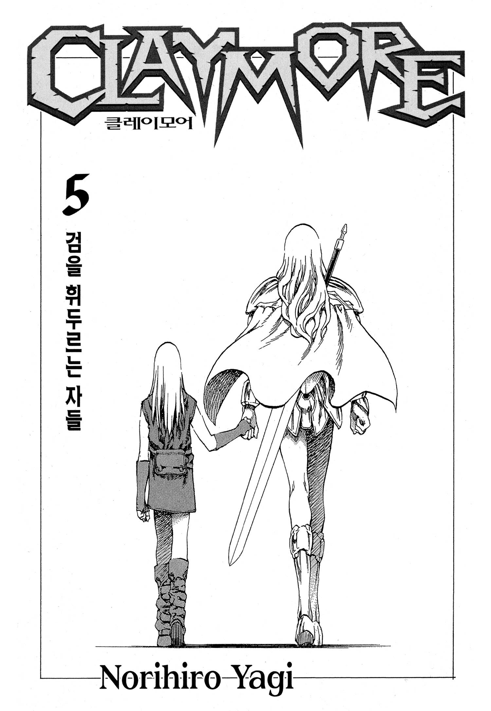
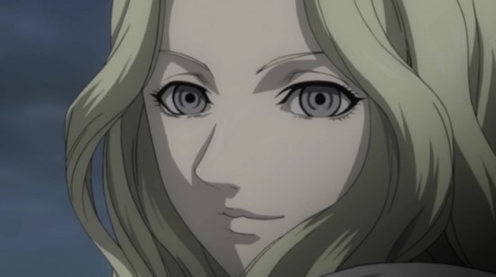
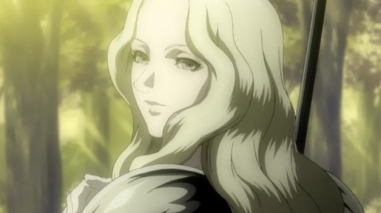

# 클레이모어 세계관 설정 전투력 체계 TOP 랭킹 완전 분석

클레이모어의 **전투력 체계**는 단순히 넘버가 높을수록 강하다는 구조가 아니다. 작품 후반으로 갈수록 **요력**, **각성**, **심연의 자**, **세대 차이**, **상성**, **잠재력**이 복합적으로 작용하면서 기존 서열은 계속 뒤집힌다. 특히 **테레사**, **프리실라**, **클레어**는 일반적인 전사의 성장 공식으로는 설명할 수 없는 예외적인 존재이며, 작품의 전투력 구조 자체를 다시 정의하게 만든 핵심 인물들이다.

이 문서는 작품 전체를 기준으로 인간 전사와 각성자의 성장 구조, 조직의 서열 시스템, 전투 메커니즘, 그리고 최종전까지 이어지는 세계관의 강함을 하나의 체계로 정리한다.

## 핵심 요약

* **클레이모어의 기본 서열**은 넘버가 높을수록 강하지만, **각성 이후에는 상성·잠재력·세대 차이**가 더 큰 영향을 준다.
* **심연의 자**는 역대 No.1 전사들이 각성한 존재이며 일반 각성자와는 차원이 다른 괴물이다.
* **프리실라**는 역대 심연의 자들을 모두 넘어선 존재였지만, **테레사**만은 끝내 넘지 못했다.
* **클레어**는 가장 약한 육체를 가졌지만 **요기 감지**, **반각성**, **부분 각성**이라는 독자적인 시스템으로 성장했다.
* **요력 해방**과 **요기 감지**는 서로 상충하는 구조이며, 이것이 테레사를 더욱 특별한 존재로 만든다.
* 최종전은 단순한 강함의 경쟁이 아니라 작품 전체가 구축한 **전투 시스템의 결론**이라고 볼 수 있다.

## 1. 클레이모어 세계관의 기본 전투 구조

클레이모어의 **전투력 시스템**은 크게 네 단계로 구분된다.

* **인간 전사**
* **각성자**
* **심연의 자**
* **규격 외 존재**

작품 초반에는 조직이 부여하는 **넘버**가 강함을 나타내는 가장 중요한 기준처럼 보인다.

하지만 이야기가 진행될수록 넘버는 어디까지나 **인간 전사 시절의 평가**일 뿐이며, 각성 이후에는 완전히 다른 질서가 형성된다는 사실이 드러난다.

## 2. 조직의 넘버는 무엇을 의미할까

많은 독자들이 넘버를 단순한 전투력 순위라고 생각하지만 실제 설정은 조금 더 복잡하다.

조직은 다음 요소를 종합적으로 평가한다.

* **기본 전투 능력**
* **요력 총량**
* **검술**
* **임무 수행 능력**
* **통솔력**
* **조직에 대한 순응도**

따라서 넘버가 반드시 순수한 실전 전투력만 의미하는 것은 아니다.

특히 성격 문제나 조직과의 관계 때문에 실제 실력보다 낮은 평가를 받은 사례도 존재한다.

반대로 인간 시절에는 높은 평가를 받았더라도 각성 이후 특별한 능력을 얻지 못하면 다른 각성자에게 쉽게 추월당하기도 한다.

## 3. 각성 이후에는 왜 서열이 바뀌는가

각성은 단순한 파워업이 아니다.

각성은 인간이 가지고 있던 **잠재력 전체가 새로운 형태로 폭발하는 과정**이다.

이 과정에서 여러 변수가 생긴다.

* **기본 요력 총량**
* **각성체의 형태**
* **특수 능력**
* **재생력**
* **전투 상성**
* **세대별 기술 발전**

그래서 인간 시절 No.3이 각성 후 No.2 출신보다 강해지는 경우도 충분히 발생한다.
반대로 상위 넘버였더라도 각성 능력이 평범하면 심연의 자까지 성장하지 못한다.

즉, **인간 시절의 넘버는 출발점일 뿐 최종 결과는 아니다.**

## 4. 심연의 자는 일반 각성자와 무엇이 다른가

심연의 자는 단순히 강한 각성자가 아니다.  
각 시대를 대표하던 **No.1 전사**가 각성하여 탄생한 특별한 존재를 의미한다.  
대표적인 인물은 다음과 같다.

* **북방의 왕 이슬레이**
* **서쪽의 리플**
* **남쪽의 루시엘라**

이들은 각각 대륙의 한 지역을 지배할 정도의 압도적인 힘을 갖추었으며 일반 각성자는 물론 현역 상위 전사들조차 상대가 되지 않았다.

하지만 이러한 심연의 자조차도 최종적으로는 **프리실라**라는 존재 앞에서 절대적인 우위를 잃게 된다.

## 5. 프리실라는 왜 모든 심연의 자를 넘어섰는가

작품 후반의 **프리실라**는 단순히 마지막 세대의 강자가 아니다.  
그녀는 역대 심연의 자들이 가진 강점을 모두 무력화하는 수준의 **압도적인 성장성**과 **무한에 가까운 재생력**을 보여준다.

그 이유는 크게 세 가지로 정리할 수 있다.

* **압도적인 타고난 잠재력**
* **끝없는 진화 능력**
* **사실상 불사에 가까운 재생 능력**

특히 프리실라는 전투를 반복할수록 더욱 강해지는 구조를 가지고 있었다. 육체가 파괴되어도 거의 즉시 재생하며, 상대와 싸우는 과정 자체가 자신의 진화를 촉진하는 과정이 된다.

이 때문에 일반적인 검술이나 일시적인 화력만으로는 프리실라를 완전히 쓰러뜨릴 수 없었다. 실제로 북방의 왕 **이슬레이**는 패배를 인정하고 그녀의 세력 아래로 들어갔으며, 서쪽의 **리플** 역시 정면 승부를 피하는 전략을 선택했다.

이는 프리실라가 기존 심연의 자들과는 다른 차원의 존재였음을 보여주는 대표적인 사례다.

## 6. 테레사는 왜 작품 전체에서 예외적인 존재인가

테레사는 작품 전체를 통틀어 가장 독특한 전사다. 그 이유는 단순히 강해서가 아니다. 클레이모어의 기본 전투 시스템 자체를 무시하는 존재였기 때문이다.  
보통 전사는 강해지기 위해 **요력 해방**을 선택한다. 하지만 테레사는 그렇지 않았다.  
그녀는 요력을 거의 사용하지 않는 상태에서도 대부분의 전사보다 훨씬 강했다.  
즉,

* **요력을 해방하지 않아도 최상위 피지컬**
* **완벽한 요기 감지**
* **압도적인 검술**
* **압도적인 반응 속도**

를 동시에 유지했다.

다른 전사들은 요력을 높이면 피지컬은 올라가지만 **요기 감지 능력**이 감소한다.  
반대로 요력을 억제하면 감지는 뛰어나지만 피지컬이 부족해진다. 이것이 작품의 기본 시스템이다. 하지만 테레사는 이 두 가지를 동시에 만족시켰다.  
그래서 대부분의 전사는 테레사를 상대하면 다음과 같은 상황에 빠진다.

* 자신의 요력을 해방한다.
* 자신의 요기가 주변으로 퍼진다.
* 테레사는 그 요기를 완벽하게 읽는다.
* 테레사는 거의 움직이지 않고 공격을 피한다.
* 상대는 자신의 공격이 모두 읽힌 상태에서 쓰러진다.

즉, 테레사는 일반적인 전투 공식을 아예 성립하지 못하게 만드는 존재였다.

## 7. 요력 해방과 요기 감지는 왜 서로 상충하는가

작품에서 **요기 감지**는 매우 정밀한 감각이다.

상대의 몸속을 흐르는 미세한 요력의 움직임을 읽어 공격을 예측하는 능력이다. 하지만 자신의 요력을 크게 해방하면 문제가 발생한다. 자신의 몸에서 거대한 요력이 계속 방출되기 때문이다. 쉽게 비유하면 다음과 같다.

* **요기 감지**는 조용한 공간에서 작은 소리를 듣는 것과 같다.
* **요력 해방**은 자신의 옆에서 확성기를 최대 음량으로 켜는 것과 같다.

따라서 대부분의 전사는 요력을 크게 해방할수록 상대의 미세한 요기를 읽기 어려워진다. 결국 일반 전사는 다음 가운데 하나를 선택해야 한다.

* **높은 피지컬**
* **높은 감지 능력**

둘 다 동시에 얻기는 어렵다. 테레사는 바로 이 균형을 무너뜨린 존재였다. 요력을 거의 사용하지 않으면서도 압도적인 피지컬을 유지했기 때문이다. 이 설정은 이후 클레어의 성장 방식에도 직접 연결된다.

## 8. 클레어는 왜 가장 독특한 전사인가

클레어는 조직 역사에서도 매우 특이한 전사다. 일반적인 클레이모어는 인간과 요마가 절반씩 섞인 **반인반요**다. 하지만 클레어는 이미 반인반요였던 **테레사의 살**을 이식받았다. 결과적으로 클레어는 일반 전사보다 훨씬 요마의 비율이 낮은 **쿼터(1/4)** 구조가 된다.  
이 독특한 신체 구조는 장점과 단점을 동시에 만든다.

단점은 명확하다.

* **기본 근력 부족**
* **낮은 요력 총량**
* **낮은 재생력**
* **최하위 넘버의 기본 피지컬**

반면 장점도 매우 컸다.

* **강한 인간의 이성 유지**
* **요력 폭주 억제**
* **반각성 유지**
* **부분 각성 제어**

여기에 테레사의 **요기 감지 능력**까지 계승하면서 클레어는 기존 전사들과 완전히 다른 방식으로 성장하게 된다.

그녀는 힘으로 상대를 이기는 전사가 아니라,

* **상대의 요기를 읽고**
* **공격을 예측하며**
* **필요한 순간에만 부분 각성을 사용하는**

독특한 전투 스타일을 완성한다.

이러한 구조 덕분에 클레어는 최약체에서 시작했음에도 작품 최후반에는 누구도 흉내 낼 수 없는 전사로 성장하게 된다.

## 9. 반각성과 부분 각성은 왜 클레어만 자유롭게 사용할 수 있었을까

작품에서 **반각성**은 일반 전사라면 누구나 연습해서 사용할 수 있는 기술이 아니다. 오히려 각성 직전까지 갔다가 다시 인간으로 돌아오는 것 자체가 기적에 가까운 일이다. 일반 전사들은 요력을 일정 수준 이상 해방하면 인간의 의지를 잃고 각성자로 변한다.

즉,

* **요력 해방**
* **이성 붕괴**
* **완전 각성**

이라는 과정이 거의 되돌릴 수 없이 이어진다. 밀리아, 데네브, 헬렌처럼 각성 직전에서 돌아온 사례가 존재하지만, 이들 역시 극한 상황에서 우연히 살아남은 예외에 가깝다. 
반면 클레어는 구조 자체가 달랐다.

**쿼터 전사**라는 신체 구조 덕분에 인간의 이성이 훨씬 강하게 남아 있었고, 요력 폭주 역시 일반 전사보다 훨씬 느리게 진행되었다. 이 때문에 클레어는 반각성을 하나의 전투 기술처럼 반복적으로 사용할 수 있었다.  
이것이 일반 전사들과 가장 큰 차이다.

### 부분 각성 역시 같은 원리다

클레어의 **부분 각성** 역시 동일한 구조에서 탄생했다. 일반 전사는 요력을 해방하면 온몸이 동시에 반응한다. 하지만 클레어는 원하는 부위에만 요력을 집중시킬 수 있었다. 대표적인 사례가 **일레네의 오른팔**이다.

이미 각성 직전까지 경험했던 일레네의 팔은 요력의 흐름을 기억하고 있었고, 클레어는 여기에 자신의 강한 이성을 결합해 팔 하나만 각성시키는 데 성공했다. 이후에는 다리까지 부분 각성을 확장하면서 기동력까지 강화한다.

즉, 부분 각성은 단순한 기술이 아니라 다음 요소가 모두 합쳐진 결과다.

* **쿼터 전사라는 신체**
* **강한 인간의 이성**
* **테레사의 요기 감지**
* **일레네의 오른팔**
* **극한 수준의 요력 제어**

이 다섯 요소가 동시에 존재했기에 가능한 전투 방식이었다.

## 10. 클레어는 사실상 인간 전사 최강이 될 수 있었을까

이 질문은 작품을 깊게 읽은 독자들이 가장 많이 고민하는 부분 가운데 하나다.  
클레어는

* **요기 감지**
* **부분 각성**
* **반각성**
* **고속검**
* **풍참**
* **다양한 전사의 기술**

을 모두 사용할 수 있었다.

겉으로만 보면 인간 전사 단계에서는 No.1이 되어야 하는 것처럼 보인다. 하지만 실제로는 몇 가지 결정적인 한계가 존재한다.

### 절대적인 요력 총량이 부족하다

가장 큰 문제는 **요력 총량**이다. 클레어는 순간적으로 엄청난 출력을 낼 수 있지만 연료 자체가 적다. 상위 No.1 전사들이 오랫동안 최고 출력으로 싸울 수 있다면, 클레어는 짧은 시간 안에 승부를 끝내야 한다.

장기전에서는 구조적으로 불리하다.

### 몸이 반응하지 못하는 한계

요기를 읽는 것과 움직일 수 있는 것은 다른 문제다. 예를 들어 상대의 검이 어느 방향으로 오는지 읽었다고 하더라도, 자신의 육체가 그 속도를 따라가지 못하면 결국 맞게 된다. 상위 한 자릿수 전사들의 순수 스피드는 클레어보다 훨씬 높다.

즉,

* **인지 속도**
* **반응 속도**
* **이동 속도**

는 반드시 같은 것이 아니다.

### 기술 대부분이 자신의 것이 아니다

클레어는 매우 독특한 성장 방식을 거쳤다. 하지만 그녀가 사용하는 기술 상당수는

* **테레사의 요기 감지**
* **일레네의 고속검**
* **플로라의 풍참**

처럼 다른 전사의 유산이다. 즉, 완전히 자신의 육체와 일체화된 기술이라고 보기 어렵다. 실제로 사용할수록 육체적 부담도 훨씬 크다.

### 조직의 평가 방식도 다르다

조직은 단순한 결투 능력만으로 넘버를 정하지 않는다.

다음 요소 역시 중요한 평가 기준이다.

* **임무 성공률**
* **지휘 능력**
* **순응도**
* **조직에 대한 충성**

클레어는 조직 입장에서 매우 불안정한 전사였다. 프리실라를 쫓기 위해 명령을 무시하는 경우도 많았고, 조직의 통제를 받지 않는 성향도 강했다. 설령 전투력만으로 상위권에 도달했다고 하더라도 조직이 No.1을 부여했을 가능성은 매우 낮다.

## 11. 최종전은 왜 테레사의 승리로 끝났는가

많은 독자들이 가장 궁금해하는 부분은 바로 이것이다. 최종전에서 등장한 **각성 테레사**는 과연 본래 테레사의 힘이었을까. 작품의 연출을 종합하면 중요한 사실 하나가 드러난다. 최종전의 테레사는 자신의 육체로 부활한 것이 아니다.

오히려

* **클레어라는 작은 그릇**
* **불완전한 육체**
* **임시로 구현된 존재**

라는 제약을 가진 상태였다.

그럼에도 완전체 프리실라를 압도했다. 이 연출은 최소한 하나의 사실을 강하게 암시한다. **테레사의 본래 잠재력은 프리실라보다도 훨씬 위에 있었을 가능성이 매우 높다.**  
다만 이것은 어디까지나 **작품의 연출과 설정을 바탕으로 한 해석**이며, 원작에서 "순수 각성 테레사가 프리실라보다 강하다"라고 명시적으로 설정한 것은 아니다.

따라서 다음처럼 구분해서 이해하는 것이 가장 적절하다.

* **공식 설정**

  * 최종전에서 각성한 테레사가 프리실라를 쓰러뜨렸다.

* **팬들의 일반적인 해석**

  * 클레어의 육체가 오히려 제약이었다면, 본래 테레사의 각성은 더욱 강했을 것이다.

* **의견 추론**

  * 순수 테레사가 자신의 육체로 각성했다면, 작품 전체에서 누구도 상대할 수 없는 절대적인 존재가 되었을 가능성이 높다.

## 12. 올타임 각성자 랭크 Top 10 (완전체 프리실라 = 100 기준)

아래 표는 **최종전 시점**을 기준으로 한 각성자들의 전투력을 정리한 것이다.

주의할 점은 **순수 테레사 각성**과 **클레어 순수 각성**은 작품에 직접 등장하지 않은 **가상 시나리오**라는 점이다. 공식 설정과 작품 내 묘사를 바탕으로 한 해석이며, 실제 설정과는 구분해서 이해해야 한다.

| 순위 |                           이름 | 전투력 | 특징 및 한줄평                                           |
| -- | ---------------------------: | --- | -------------------------------------------------- |
| 1  |           순수 **테레사 각성** (가상) | 180 | 측정 불가의 영역. 자신의 육체로 온전히 각성했다는 가정 아래 설정한 해석상의 최고 존재. |
| 2  | **클레어(테레사 부활)** (최종전 쌍둥이 여신) | 130 | 클레어의 육체를 매개로 부활한 각성 테레사. 완전체 프리실라를 압도했다.           |
| 3  |                 **완전체 프리실라** | 100 | 작품 최후반 기준 최강의 각성자. 심연의 자들을 모두 넘어선 존재.              |
| 4  |           **클레어 순수 각성** (가상) | 95  | 요기 감지와 기술 융합 능력을 유지한 채 전신 각성했다는 가정의 해석.            |
| 5  |                     **이슬레이** | 85  | 북방의 왕. 심연의 자 가운데서도 최고 수준의 전투력을 지닌 존재.              |
| 6  |                     **카산드라** | 83  | 부활한 역대 No.1 가운데 가장 강력한 전사로 평가된다.                   |
| 7  |                       **리플** | 80  | 서쪽의 심연. 뛰어난 잠재력과 독특한 공격 방식을 가진 존재.                 |
| 8  |                     **루시엘라** | 78  | 남쪽의 심연. 막대한 파괴력을 지닌 최초의 자매 실험 실패 사례.               |
| 9  |                     **리가르도** | 65  | 심연은 아니지만 일반 각성자를 크게 뛰어넘는 최상급 각성자.                  |
| 10 |                      **아가사** | 60  | 특수 능력과 상성에서 매우 뛰어난 변칙형 각성자.                        |

### 이 표에서 주목해야 할 점

가장 중요한 사실은 **프리실라**를 제외한 대부분의 강자들이 단순한 힘만으로 강했던 것이 아니라는 점이다.

* **이슬레이**는 압도적인 기본 체급을 가진 심연의 자다.
* **리플**은 독특한 능력과 높은 잠재력이 강점이다.
* **카산드라**는 인간 시절 검술이 각성 이후에도 그대로 극대화되었다.
* **리가르도**는 심연은 아니지만 일반 각성자와는 비교가 되지 않는 속도를 보여준다.

반면 **프리실라**는 이러한 요소를 모두 뛰어넘는다.

그녀는

* **재생력**
* **잠재력**
* **진화**
* **기본 전투력**

모든 영역에서 심연의 자를 초월하는 존재로 묘사된다.

### **테레사**는 왜 별도의 영역으로 취급되는가

여기서 가장 논란이 되는 부분은 **순수 테레사 각성**이다.  
작품에는 실제로 등장하지 않는다. 따라서 다음과 같이 구분해야 한다.

#### **공식 설정**

* 최종전에서 **각성 테레사**가 프리실라를 쓰러뜨렸다.
* 그 과정은 **클레어를 매개**로 이루어졌다.

#### **팬들의 일반적인 해석**

* 클레어라는 육체 자체가 제약이었다면 본래 육체의 테레사는 더욱 강했을 것이다.

#### **의견 추론**

* 순수 테레사가 자신의 육체로 완전히 각성했다면 프리실라조차 크게 뛰어넘는 존재였을 가능성이 있다.

이 부분은 작품에서 직접 명시된 설정이 아니라 **연출을 바탕으로 한 해석**이라는 점을 구분하는 것이 중요하다.

## 13. 올타임 인간 전사(클레이모어) 랭크 Top 30 (테레사 평상시 = 100 기준)

아래 순위는 **인간 전사 상태만을 기준**으로 정리한 것이다.

즉,

* **각성 이후 능력**
* **심연의 자**
* **반각성 상태**
* **클레어 최종전**

등은 모두 제외하였다. 기준은 다음 요소를 종합적으로 반영하였다.

* **공식 넘버**
* **작중 전투 묘사**
* **동시대 평가**
* **요력**
* **검술**
* **요기 감지**
* **잠재력**

| 순위 | 이름                 | 전투력 (테레사=100) | 비고                               |
| -: | ------------------ | ------------: | -------------------------------- |
|  1 | **테레사**            |           100 | 역대 최고의 No.1. 요력을 거의 사용하지 않고도 최강. |
|  2 | **프리실라**           |            98 | 테레사와의 결투 전까지 역사상 최고 수준의 신인.      |
|  3 | **카산드라**           |            97 | 역대 최고의 검술을 가진 No.1 가운데 한 명.      |
|  4 | **록산느**            |            95 | 카산드라를 기습으로 쓰러뜨린 천재 전사.           |
|  5 | **이슬레이**           |            94 | 북방의 왕이 되기 전부터 최강급 No.1.          |
|  6 | **리플**             |            93 | 서쪽의 심연이 되기 전 최고 수준의 전사.          |
|  7 | **루시엘라**           |            92 | 남쪽의 심연. 뛰어난 요력과 전투 감각을 보유.       |
|  8 | **라파엘라**           |            90 | 조직 최고의 암살 전사 가운데 하나.             |
|  9 | **알리시아**           |            89 | 조직 최강 프로젝트의 완성형 전사.              |
| 10 | **베스**             |            88 | 알리시아와 함께 조직 최강의 쌍둥이 전사.          |
| 11 | **밀리아**            |            84 | 환영의 밀리아. 전략과 속도에서 최고 수준.         |
| 12 | **갈라테아**           |            83 | 최고의 요기 감지 능력을 가진 특수형 전사.         |
| 13 | **일레네**            |            82 | 고속검의 창시자. 순수 검술은 역대 최상급.         |
| 14 | **플로라**            |            81 | 풍참의 사용자. 순간 화력은 최고 수준.           |
| 15 | **오필리아**           |            80 | 미친 전투 감각을 가진 공격형 전사.             |
| 16 | **진**              |            79 | 나선검의 사용자. 잠재력이 매우 높다.            |
| 17 | **헬렌**             |            77 | 뛰어난 회복력과 근접전 능력.                 |
| 18 | **데네브**            |            76 | 최고의 재생 능력을 가진 전사.                |
| 19 | **운디네**            |            75 | 순수 힘에서는 상위권.                     |
| 20 | **미아타**            |            74 | 어린 나이에도 압도적인 잠재력을 가진 전사.         |
| 21 | **클레어** (최종 인간 기준) |            73 | 기술은 최상급이지만 기본 체급은 낮다.            |
| 22 | **힐다**             |            71 | 한 자릿수 넘버다운 실력.                   |
| 23 | **오드리**            |            70 | 균형 잡힌 능력을 가진 상위 전사.              |
| 24 | **레이첼**            |            69 | 협동 능력이 뛰어난 전사.                   |
| 25 | **타바사**            |            68 | 장거리 지원 능력이 우수하다.                 |
| 26 | **신시아**            |            67 | 방어형 전사.                          |
| 27 | **유마**             |            66 | 민첩성이 뛰어난 전사.                     |
| 28 | **베로니카**           |            65 | 조직의 정예 전사.                       |
| 29 | **디트리히**           |            64 | 후반 세대의 성장형 전사.                   |
| 30 | **루네**             |            63 | 신세대 전사 가운데 안정적인 실력.              |

### 이 순위에서 가장 중요한 특징

이 표는 **인간 전사만 비교**했기 때문에 각성 이후의 강함과는 전혀 다를 수 있다.

예를 들어 **프리실라**는 인간 시절에도 거의 역사상 최고 수준이었지만, 각성 후에는 다른 심연의 자들과 비교조차 어려운 존재가 된다.

반대로 **갈라테아**는 순수 전투력은 상위권이 아니지만, **요기 감지** 능력 하나만큼은 작품 최고 수준이다.

또한 **일레네**, **플로라**, **진**처럼 특정 기술이 압도적인 전사들은 단순한 전투력 수치만으로 평가하기 어렵다.

즉, 인간 전사의 세계에서는 **기본 능력**, **검술**, **요력**, **전투 경험**이 균형 있게 작용하며, 각성 이후처럼 절대적인 체급 차이가 발생하지는 않는다.

## 14. 전사 & 각성자 통합 올타임 랭크 Top 10

아래 순위는 **인간 전사**, **각성자**, **심연의 자**, **최종전 등장 개체**까지 모두 포함한 작품 전체 기준의 종합 순위다.

다만 작품에서 직접 등장하지 않은 **순수 각성 테레사**는 어디까지나 해석 영역이므로 별도로 표시하였다.

| 순위 | 이름                 | 종합 평가 | 근거                              |
| -: | ------------------ | ----- | ------------------------------- |
|  1 | **순수 각성 테레사** (가상) | ★★★★★ | 최종전 연출을 바탕으로 한 해석상의 최고 존재.      |
|  2 | **클레어(테레사 부활)**    | ★★★★★ | 완전체 프리실라를 정면에서 압도하며 최종 승리를 거둔다. |
|  3 | **완전체 프리실라**       | ★★★★★ | 심연의 자 전체를 초월한 최종 보스.            |
|  4 | **이슬레이**           | ★★★★☆ | 심연의 자 가운데 가장 강한 전투형으로 평가된다.     |
|  5 | **카산드라(각성)**       | ★★★★☆ | 역대 최고 수준의 검술이 각성과 결합한 괴물.       |
|  6 | **리플**             | ★★★★☆ | 심연의 자 가운데 뛰어난 능력과 안정성을 보유.      |
|  7 | **루시엘라**           | ★★★★☆ | 막대한 요력과 파괴력을 가진 심연의 자.          |
|  8 | **리가르도**           | ★★★☆☆ | 심연은 아니지만 일반 각성자의 한계를 뛰어넘은 존재.   |
|  9 | **테레사(인간)**        | ★★★☆☆ | 인간 상태만으로 심연급에 근접한 역사상 최고의 전사.   |
| 10 | **프리실라(인간)**       | ★★★☆☆ | 각성 이전부터 역사상 최고 수준의 천재 전사.       |

### 통합 순위를 볼 때 주의해야 할 점

이 순위는 **같은 상태끼리만 비교한 순위가 아니다.**

따라서 인간 전사와 각성자를 동일한 기준으로 완벽하게 수치화하는 것은 원작에서도 불가능하다.

예를 들어 인간 상태의 **테레사**는 일반 심연의 자보다 강하게 묘사되는 장면도 있지만, 그렇다고 모든 심연의 자를 확실하게 이긴다고 단정할 수는 없다.

반대로 **리가르도**는 심연의 자는 아니지만 대부분의 상위 전사를 압도한다.

즉, 작품은 단순한 전투력 숫자보다 **상황**, **상성**, **요기 감지**, **기술**, **정신력**을 함께 고려하도록 설계되어 있다.

이러한 이유로 클레이모어는 지금까지도 전투력 논쟁이 가장 활발한 작품 가운데 하나로 남아 있다.

## 결론

**클레이모어**의 전투력 체계는 단순한 강함의 서열이 아니라, **요력**, **검술**, **요기 감지**, **잠재력**, **각성**, **상성**이 유기적으로 결합된 구조다.

작품 초반에는 조직의 **넘버**가 절대적인 기준처럼 보이지만, 이야기가 진행될수록 그것은 인간 전사 시절의 평가에 불과하다는 사실이 드러난다. 각성 이후에는 개인의 잠재력과 능력의 성격이 더욱 큰 영향을 미치며, 심연의 자조차 절대적인 존재가 아니다.

가장 상징적인 인물은 역시 **테레사**와 **프리실라**다.

* **프리실라**는 작품에서 실제로 등장한 최강의 각성자다.
* **테레사**는 인간 상태만으로도 작품의 전투 시스템 자체를 뛰어넘는 예외적인 존재였다.

최종전에서 두 인물의 대결은 단순한 보스전이 아니라, 작품 전체가 쌓아 올린 전투력 구조의 결론이라 할 수 있다.

또한 **클레어**는 가장 약한 전사에서 시작해 누구도 흉내 낼 수 없는 전투 방식을 완성하며, 작품이 말하고자 하는 성장의 의미를 상징적으로 보여준다.

결국 클레이모어의 강함은 단순한 힘의 크기가 아니라, **자신의 능력을 어떻게 활용하고 극복하느냐**에 의해 결정된다는 것이 작품 전체를 관통하는 핵심 메시지다.

## 자주 묻는 질문(FAQ)

### 테레사와 프리실라 가운데 공식 최강은 누구인가?

작품에서 실제로 등장한 기준이라면 **최종전의 프리실라**가 최강이다. 다만 최종전에서 **테레사가 프리실라를 쓰러뜨리는 연출**이 등장하기 때문에, 테레사의 잠재력이 더 높았다고 해석하는 팬들도 많다.

### 조직의 넘버는 전투력 순위와 같은 의미인가?

아니다. **넘버**는 기본 전투력뿐 아니라 **임무 수행 능력**, **안정성**, **조직 적응도** 등 여러 요소를 종합해 결정된다. 따라서 실제 실전 능력과 완전히 일치하지는 않는다.

### 심연의 자는 모두 No.1 출신인가?

기본적으로 그렇다. 작품에서 등장하는 **북방의 왕 이슬레이**, **서쪽의 리플**, **남쪽의 루시엘라**는 모두 각 시대를 대표하는 **No.1 전사**가 각성한 존재다.

### 클레어가 인간 전사 최강까지 성장했다고 볼 수 있을까?

기술과 전투 경험만 보면 최상위권에 도달했다고 볼 수 있다. 그러나 **요력 총량**, **기본 체급**, **지속 전투 능력**에서는 역대 No.1 전사들에게 미치지 못하는 부분이 있어 절대적인 인간 최강으로 보기는 어렵다.

### 작품에서 가장 완성도가 높은 전투 시스템은 무엇인가?

클레이모어의 가장 큰 특징은 **요력 해방과 요기 감지의 균형**이다. 단순히 힘이 강할수록 유리한 구조가 아니라, 감지 능력과 출력이 서로 상충하도록 설계되어 있어 다양한 전투 양상이 만들어진다. 이 균형을 유일하게 뛰어넘은 존재가 **테레사**이며, 이것이 그녀를 특별한 전사로 평가하는 가장 큰 이유다.

