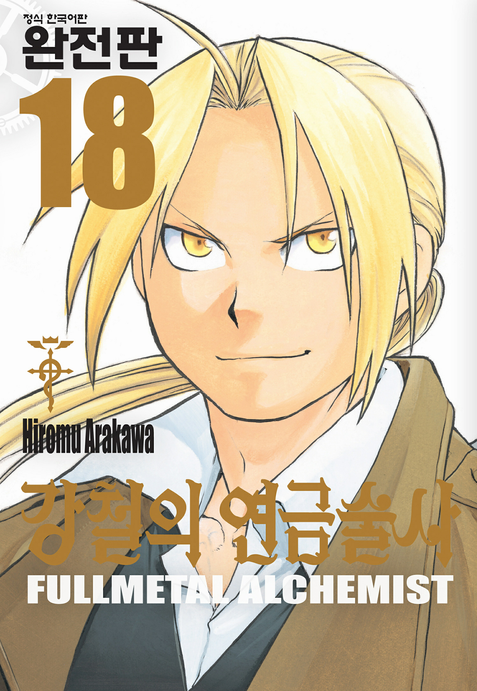
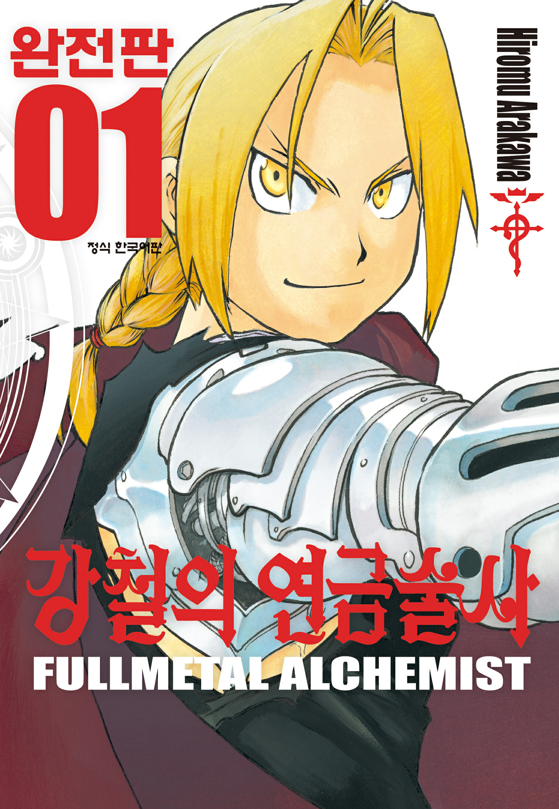

# 강철의 연금술사 등가교환 원칙은 무엇을 의미하는가

강철의 연금술사의 등가교환은 물질의 법칙에서 출발해 생명과 희생, 관계와 성장의 의미를 묻는 서사적 원리로 확장된다. 처음에는 연금술의 기본 규칙처럼 보인다. 하지만 에드워드와 알폰스가 겪는 사건을 하나씩 따라가 보면, 이 법칙은 어느새 인간이 세상을 이해하는 방식 자체를 시험하는 장치로 바뀐다. **무엇을 얻으려면 무엇인가를 내놓아야 한다는 사고방식**은 연금술의 영역에서는 유용하다. 다만 인간의 삶과 관계까지 같은 잣대로 잴 수 있는지는 전혀 다른 문제다.

## 핵심 요약

* **등가교환**은 물질을 무에서 만들어내는 게 아니라, 기존 물질을 이해하고 재구성하는 연금술의 기본 원리다.
* 에드워드와 알폰스의 인체연성 실패는 생명까지 물질 교환의 논리로 다룰 수 있다고 믿은 인간의 오만을 드러낸다.
* **현자의 돌**은 얼핏 등가교환을 깨뜨리는 것 같지만, 실제로는 수많은 인간의 생명을 대가로 만들어진다.
* 에드워드의 성장은 등가교환을 절대 법칙으로 여기던 태도에서 벗어나, 관계와 희생의 가치를 받아들이는 쪽으로 나아간다.
* 국가 연금술사 제도와 이슈발 전쟁은 지식과 기술이 국가 권력과 만날 때 폭력의 도구로 바뀔 수 있음을 보여준다.
* 결말에서 에드워드가 연금술을 내려놓는 선택은, 더 강한 힘을 얻기보다 **힘 자체를 내려놓는 것**이 인간에게 더 중요한 순간이 있음을 말해준다.

## 1. 등가교환은 연금술을 어떻게 규정하는가?

작품 속 등가교환은 흔히 현실의 질량보존 법칙과 동일한 개념으로 설명되지만, 엄밀히 보면 이 작품의 연금술 체계를 이루는 허구의 원리다. 핵심은 **무에서 유를 만들어내는 것이 아니라 이미 있는 물질을 이해하고 분해한 뒤 재구성한다는 점**이다. 연금술사는 물질의 성질과 구조를 무시할 수 없다. 원하는 결과를 얻으려면 그에 걸맞은 재료와 지식이 필요하다.

연금술의 기본 논리를 정리하면 다음과 같다.

* 기존 물질을 분해하고 재구성한다.
* 연성에는 물질적 대가가 따른다.
* 연금술사는 물질의 성질과 구조를 이해해야 한다.
* 인간의 생명처럼 단순한 물질로 환산할 수 없는 영역에는 연금술의 한계가 있다.

등가교환은 물리 법칙 하나로 끝나지 않는다. 작품은 이 원리를 인간의 행동 원리로까지 넓힌다. 공부하면 지식을 얻고, 노력하면 성과를 얻으며, 무언가를 원하면 그만큼 내놓아야 한다는 식이다. 에드워드에게 등가교환은 그래서 **세상을 이해하는 하나의 언어**였다.

## 2. 인체연성은 등가교환의 한계를 어떻게 드러내는가?

엘릭 형제가 어머니 트리샤를 되살리려 인체연성을 시도한 사건은 이야기 전체의 출발점이다. 두 사람은 인간의 몸을 이루는 물질만 갖추면 인간을 다시 만들 수 있다고 믿었다. 여기에는 연금술 지식에 대한 강한 확신과, 생명까지 계산할 수 있다는 오만이 함께 들어 있었다.

결과는 완전히 달랐다. 에드워드는 왼쪽 다리를 잃었고, 알폰스는 몸 전체를 잃었다. 에드워드는 알폰스의 영혼을 갑옷에 붙잡아두려 자신의 오른팔마저 내놓는다. 두 사람이 치른 대가는 재료 부족분이 아니었다. 인간을 연금술의 대상으로 삼으려 한 시도, 그 자체가 무너진 것이다.

이 사건은 신체 성분을 안다고 해서 인간을 되살릴 수 있는 게 아니라는 사실을 보여준다. 몸을 구성하는 물질과 사람이라는 존재는, 애초에 같은 차원에 있지 않았다.

## 3. 진리의 문은 인간의 지식이 가진 한계를 어떻게 보여주는가?

인체연성을 시도한 연금술사는 **진리의 문**과 마주한다. 문은 단순히 새 지식을 얻는 장소가 아니다. 인간이 자기 지식으로 모든 것을 통제하려 할 때 마주치는 한계를 상징한다.

에드워드가 문을 통해 얻은 것은 강력한 연금술 지식이었다. 그 대가는 신체의 일부였다. 알폰스 역시 자신의 몸을 잃었다. 지식을 얻었다는 사실과, 그 지식에는 반드시 대가가 따른다는 사실이 동시에 존재한다.

## 4. 현자의 돌은 등가교환의 예외인가?

현자의 돌은 겉보기에 등가교환 법칙을 무시하는 물질이다. 일반 연금술보다 훨씬 강력한 연성을 가능하게 하고, 연금술사가 짊어져야 할 물질적 한계를 사실상 뛰어넘게 한다. 그래서 초반의 에드워드와 알폰스에게 현자의 돌은 잃어버린 몸을 되찾을 결정적 수단처럼 보였다.

하지만 그 실체가 드러나며 예외의 의미는 뒤집힌다. 현자의 돌은 **인간의 생명을 응축한 결과물**이다. 법칙을 없앤 게 아니라, 대가의 범위를 다른 인간에게 떠넘긴 셈이다.

| 대상 | 표면적으로 보이는 대가 | 실제 의미 |
| --- | --- | --- |
| 일반 연금술 | 재료와 연성에 필요한 물질 | 자신의 자원으로 대가를 부담한다 |
| 인체연성 | 신체와 정신적 상실 | 인간 생명을 물질적 대상으로 취급한 대가다 |
| 현자의 돌 | 대가 없는 강력한 연성 | 다른 인간의 생명을 대가로 사용한다 |
| 에드워드의 마지막 선택 | 연금술 능력의 포기 | 타인을 위해 자신의 가장 큰 능력을 내려놓는다 |

현자의 돌은 등가교환의 반례가 아니다. 오히려 **등가교환이라는 사고방식의 윤리적 한계**를 가장 극단적으로 드러내는 사례다. 내가 얻은 것의 비용을 누가 대신 치렀는가, 그 질문을 던지기 때문이다.

## 5. 등가교환은 인간의 삶에도 그대로 적용되는가?

작품은 등가교환을 연금술에서 인간의 삶으로 넓힌 뒤, 그 한계를 드러낸다. 노력한 만큼 보상받는다는 생각은 삶을 버티는 데는 쓸모 있다. 다만 현실의 모든 결과를 설명해주지는 못한다.

2003년 애니메이션에서는 이 문제가 단테와 호엔하임의 대립으로 더 직접적으로 드러난다. 단테는 인간의 욕망과 현실의 불공평함을 보며 등가교환의 이상을 의심한다. 아무리 애써도 원하는 걸 얻지 못하는 사람이 있고, 반대로 애쓰지 않아도 큰 걸 얻는 사람이 있기 때문이다.

호엔하임이 보는 세계는 다르다. 부모의 사랑, 자연이 베푸는 것처럼 대가를 먼저 치르지 않고 **그냥 주어지는 것**도 있다. 이 관점에서 보면 세상은 교환만으로 이루어지지 않는다.

## 6. 에드워드는 어떻게 등가교환의 의미를 바꾸는가?

에드워드의 성장에서 가장 중요한 변화는 연금술 실력이 아니다. **세상을 계산하는 방식 자체가 달라진다는 것**, 이게 핵심이다.

어린 에드워드는 지식으로 모든 걸 풀려 한다. 어머니를 되살리고 싶으면 재료를 모으면 된다고 생각했다. 몸을 잃은 뒤엔 현자의 돌을 찾으면 된다고 믿었다. 지식과 힘을 더 쌓으면 잃은 것을 되찾을 수 있다고 여긴 셈이다.

여행을 거치며 이 생각은 계속 깨진다. 인간의 생명은 재료의 총합으로 환원되지 않는다. 국가를 위해 쓰인 연금술은 순수한 지식으로만 남지 않는다. 현자의 돌 역시 타인의 희생 없이는 존재할 수 없다.

부모의 사랑, 친구의 도움, 타인의 희생, 우연히 주어진 삶 — 이런 것들엔 정확한 가격표를 붙일 수 없다. 받은 걸 똑같은 값으로 돌려주는 일도 인간관계에서는 불가능하다.

에드워드는 **10을 얻으려면 10을 치러야 한다는 계산에서 벗어나, 자신에게 부족한 부분을 스스로 채워 넣는 사고**에 이른다. 삶에서 반드시 완벽한 등가를 맞출 필요는 없다.

이 변화는 그가 마지막에 연금술 능력을 내려놓는 행동으로 완성된다. 연금술은 그가 가장 오래 의지해온 힘이다. 그걸 버린다는 건 자신이 가진 가장 강한 자원을 포기한다는 뜻이다.

그럼에도 그는 알폰스를 선택한다.

등가교환을 완전히 버렸다기보다, **그 법칙이 통하는 영역을 다시 그은 것**에 가깝다. 물질을 다루는 연금술에서는 교환의 원칙이 여전히 중요하다. 하지만 인간의 삶에서는 받은 만큼만 돌려줄 필요가 없다.

10을 받았다고 10만 돌려주고 끝나는 게 아니다. 자신의 몫을 보태 11을 만들어 다음 사람에게 건넬 수도 있다. 이렇게 보면 삶은 닫힌 교환의 순환이 아니라, **가치를 이어가는 과정**이 된다.

## 7. 인간의 가치는 왜 계산할 수 없는가?

인체연성, 키메라, 호문쿨루스, 갑옷이 된 알폰스의 몸 — 이 모두가 인간의 경계를 묻는 장치다. 인간을 몸의 구성 성분으로 볼지, 기억과 의식으로 볼지, 관계 맺는 존재로 볼지가 작품 전체에서 반복된다.

몸을 구성하는 물질을 안다고 해서 그 사람 자체를 설명할 수 있는 건 아니다. 물질의 교환과 사람의 가치는 애초에 같은 잣대로 잴 수 없다.

알폰스는 이 문제를 가장 직접적으로 보여주는 인물이다. 몸이 없는 상태에서도 기억과 성격, 형제를 향한 애정을 그대로 지닌다. 그렇다면 인간의 정체성은 몸에만 있는 걸까?

슬라이서 형제도 비슷한 문제를 안고 있다. 영혼이 갑옷에 깃든 존재라는 점에서 알폰스와 닮았지만, 스스로 자신의 인간성을 의심한다. 에드워드가 이들을 단순한 물질이나 적으로 취급하지 않는 태도는, 인간의 가치를 **겉모습이 아니라 존재와 관계의 차원에서 보는 시각**과 이어진다.

호문쿨루스는 인간처럼 보이지만 인간이 아닌 존재로서 욕망과 결핍을 드러낸다. 완벽한 존재를 만들려는 시도는 역설적으로 인간의 불완전함을 부각한다. 작품이 말하는 인간의 가치는 완벽함에서 나오지 않는다. **한계를 인정하면서도 남을 위해 움직이는 능력**, 그게 인간성을 이룬다.

## 8. 스카와 머스탱은 등가교환의 다른 얼굴을 보여주는가?

스카의 복수는 등가교환의 논리를 인간관계에 적용했을 때 어떤 폭력이 생기는지 보여준다. 이슈발인들이 학살당한 뒤, 스카는 국가 연금술사를 자신의 가족과 민족을 죽인 가해자로 규정한다. 그들을 죽여 대가를 치르게 하려 한다.

문제는 복수가 또 다른 희생을 부르며 끝없이 이어진다는 것이다. 피해자가 가해자를 처벌하는 순간, 그 사람 역시 폭력의 주체가 된다. **고통을 똑같은 고통으로 갚는 것**은 등가교환과 닮았지만, 그것으로 정의가 완성되지는 않는다.

스카의 변화는 이 고리를 끊는 과정이다. 그는 자신의 신념과 맞서던 연금술 지식을 받아들이고, 굳어 있던 이분법적 세계관에서 벗어난다. 자기 신념이 절대적으로 옳다는 믿음보다, 현실의 복잡함을 받아들이는 쪽으로 움직인다.

머스탱과 호크아이의 관계는 다른 방식으로 인간적 가치를 보여준다. 머스탱은 군부 권력 구조 안에서 국가를 바꾸려 하지만, 호크아이는 그가 자기 목적을 위해 또 다른 폭력에 빠지지 않도록 견제한다. 이 관계에서 중요한 건 계산된 거래가 아니다. **서로 믿고 책임지는 것**, 그게 중요하다.

## 9. 리젬블의 일상은 왜 연금술보다 중요한가?

리젬블은 거대한 국가와 전쟁, 연금술 연구가 중심인 세계에서 벗어난 일상의 공간이다. 피나코와 윈리는 에드워드와 알폰스가 연금술사이기 전에 한 사람으로 살아갈 수 있게 해주는 존재다.

특히 윈리의 오토메일 수리와 간호는 연금술의 파괴적 힘과 대비된다. 연금술이 물질을 분해하고 바꾸는 힘이라면, 윈리의 기술은 **망가진 몸을 다시 살아가게 하는 힘**에 가깝다.

에드워드가 여행 끝에 돌아가야 할 곳도 결국 이 일상의 영역이다. 진리와 연금술의 비밀을 파헤치는 목적은 초월적 존재가 되는 데 있지 않다. 다시 인간으로 살아가는 데 있다.

## 10. 원작과 2003년 애니메이션은 등가교환을 어떻게 다르게 다루는가?

원작 만화와 2003년 애니메이션은 같은 출발점을 공유한다. 하지만 후반부 서사와 설정은 다르다. 두 작품에서 그리는 등가교환의 철학을 하나의 설정으로 단순히 합쳐서는 안 된다.

| 구분 | 원작 만화·2009년 애니메이션 | 2003년 애니메이션 |
| --- | --- | --- |
| 후반부 중심축 | 국가 규모의 음모와 호문쿨루스의 계획 | 인간의 욕망과 연금술의 비극 |
| 등가교환의 의미 | 인간의 관계와 성장 속에서 재해석 | 삶의 불공평함과 욕망의 문제를 강하게 부각 |
| 호엔하임 | 원작 고유의 서사와 역할 | 단테와 연결되는 다른 설정 |
| 결말의 방향 | 에드워드의 연금술 포기와 형제의 삶 | 원작과 다른 결말 구조 |
| 작품의 정서 | 공동체, 희생, 연대와 인간적 성장 | 상실, 욕망, 유한성과 실존적 비극 |

**단테의 논리와 원작의 결말을 같은 서사로 설명해서는 안 된다.** 두 작품은 등가교환이라는 소재를 공유하지만, 거기서 도달하는 철학적 결론은 다르다.

2003년판은 등가교환의 불완전함과 인간의 욕망을 어둡게 밀어붙인다. 원작은 반대로, 에드워드가 등가교환이라는 틀 자체를 넘어 관계와 연대의 가치를 발견하는 쪽으로 나아간다.

## 결론

《강철의 연금술사》에서 등가교환은 처음엔 세계의 법칙처럼 등장한다. 하지만 에드워드의 경험이 쌓일수록, 인간이 세상을 이해하려고 만든 하나의 틀이라는 성격이 짙어진다. 물질을 바꾸는 데는 대가가 필요하다. 그러나 인간의 사랑과 희생, 관계의 가치는 물질처럼 정확히 잴 수 없다.

에드워드가 마지막에 자신의 연금술을 내려놓는 선택은 이 변화를 가장 또렷하게 보여준다. **처음엔 힘을 얻으려 인간성을 희생했지만, 마지막엔 인간을 지키려 힘을 내려놓는다.**

그런 점에서 등가교환은 이 작품의 최종 진리가 아니다. **인간이 넘어서야 할 법칙이면서, 동시에 인간이 성장하는 출발점**이다.

## 자주 묻는 질문(FAQ)

### 등가교환은 실제 물리학의 질량보존 법칙과 같은가?

같지 않다. 작품 속 등가교환은 질량과 물질의 보존이라는 과학 개념을 모티프로 삼은, 어디까지나 허구의 연금술 원리다. 현실의 물리 법칙과 작품 속 연금술 규칙을 같은 과학 법칙으로 받아들이면 안 된다.

### 현자의 돌은 등가교환 법칙의 예외인가?

겉으로는 예외처럼 보이지만, 실은 그렇지 않다. 현자의 돌은 수많은 인간의 생명을 대가로 만들어진다. 대가가 사라진 게 아니라 **다른 사람에게 떠넘겨진 것**에 가깝다.

### 에드워드는 왜 마지막에 연금술을 포기했는가?

알폰스를 되찾기 위해 자신이 가진 가장 큰 능력을 대가로 내놓았기 때문이다. 이 선택은 에드워드가 힘과 지식보다 형제, 그리고 인간으로서의 삶을 더 중요하게 여겼음을 보여준다.

### 원작과 2003년 애니메이션의 등가교환 해석은 같은가?

같지 않다. 두 작품은 소재는 같지만 후반부 설정과 결말이 다르다. 특히 단테와 호엔하임을 중심으로 펼쳐지는 2003년판의 논리를, 원작 만화의 설정과 그대로 합쳐서는 안 된다.

### 작품에서 등가교환이 최종적으로 의미하는 것은 무엇인가?

등가교환은 물질의 영역에서는 유효한 원리다. 하지만 인간의 삶 전체를 설명하는 절대 법칙은 아니다. 작품의 결말은 받은 것과 똑같은 값을 돌려주는 데서 그치지 않는다. **자신의 몫을 더해 새로운 가치를 만들어내는 삶**으로 시선을 넓힌다.