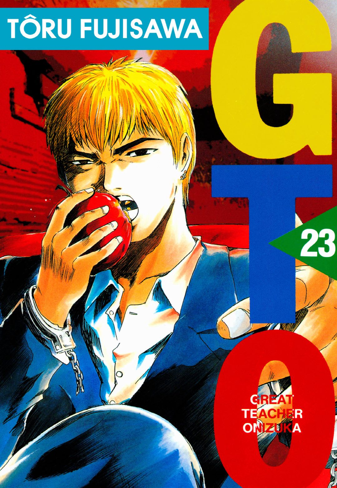

# GTO는 어떻게 교권 붕괴의 현실을 정확히 그려냈을까?

GTO는 무너진 교실을 통해 교권 붕괴의 원인과 한계를 보여주며, 오늘날 한국 교육 현장에도 여전히 유효한 질문을 던진다. 《GTO》(Great Teacher Onizuka, 한국 정식 발매명 《반항하지 마》)는 전설적인 비행 청소년이었던 오니즈카 에이키치가 교사가 된 뒤 문제 학생들과 학교의 부조리에 맞서는 이야기를 다룬다. 겉으로는 과장된 학원 코미디지만, 그 중심에는 **교사와 학생 사이의 신뢰가 무너진 교실**이라는 현실적인 문제가 놓여 있다.

오니즈카가 특별한 이유도 여기에 있다. 그는 모범적인 교사와는 거리가 멀다. 오히려 학교가 싫어서 뛰쳐나갔던 인물에 가깝다. 그런데 바로 그 과거가 아이들의 마음을 이해하는 가장 강력한 무기가 된다.

## 핵심 요약

* **오니즈카의 과거**는 학교와 기성세대에 대한 반감으로 가득했지만, 동시에 아이들의 입장에서 세상을 바라보는 감각을 만들었다.
* 교사가 된 계기는 황당했지만, 교생 실습을 거치면서 **아이들을 버리지 않는 어른**이 되겠다는 방향으로 바뀐다.
* 《GTO》의 문제 교실은 학생 개인의 일탈만이 아니라 **교사에 대한 불신과 학교 시스템의 실패**가 결합한 공간으로 묘사된다.
* 오니즈카는 제도와 권위보다 인간적인 관계를 앞세워 학생들의 신뢰를 얻지만, 그의 해결 방식은 현실의 교사가 그대로 사용할 수 없는 극단적인 판타지다.
* 작품 속 교사 폭력과 악성 민원, 교사 모함 등의 문제는 오늘날 한국 교육 현장에서 논쟁하는 **교권 침해 문제와 일정 부분 겹친다**.
* 《GTO》가 던지는 핵심 질문은 교사의 권위를 얼마나 강하게 만들 것인가보다 **교사가 학생을 교육할 수 있는 최소한의 권한과 신뢰를 어떻게 회복할 것인가**에 가깝다.

## 1. 오니즈카는 어떻게 문제 학생들의 마음을 이해할 수 있었을까?

오니즈카의 교사 인생을 이해하려면 먼저 그의 청소년 시절을 봐야 한다. 전작 《상남 2인조》에서 오니즈카는 친구 단마 류지와 함께 '귀폭 콤비'로 불리던 전설적인 폭주족이었다. 학교생활에 충실한 우등생과는 정반대의 인물이었다.

그렇다고 단순한 폭력배로만 설명하기도 어렵다. 싸움에서는 거칠었지만 동료를 위해서는 위험을 감수했고, 자신이 부당하다고 생각하는 일에는 물러서지 않았다. 특히 **억압적인 학교와 위선적인 어른에 대한 반감**은 훗날 교사가 된 뒤에도 사라지지 않는다.

아이러니한 지점이다. 학교가 싫었던 사람이 교사가 된다.

오니즈카가 학생들의 행동을 이해하는 방식은 교과서에 적힌 교육론과 다르다. 문제 행동을 먼저 교정하려 하지 않는다. 왜 저렇게 행동하는지를 먼저 본다. 자신 역시 학교와 어른들에게 반항했던 경험이 있기 때문에 학생이 보이는 공격적인 태도 뒤에 숨은 감정까지 파고든다.

그래서 오니즈카에게 학생은 통제해야 할 대상이 아니다. **자신과 비슷하게 어른들에게 상처받은 인간**이다.

## 2. 불순했던 교사 지망은 어떻게 진심으로 바뀌었을까?

성인이 된 오니즈카가 처음부터 교육에 뜻을 품었던 것은 아니다. 5류 대학을 간신히 졸업한 뒤 백수 생활을 이어가던 그는 어느 순간 교사가 되겠다고 결심한다. 그런데 그 출발점부터 정상적이지 않다.

교사가 되면 여고생과 결혼할 수 있지 않을까 하는 황당한 생각이 첫 동기였다.

하지만 교생 실습은 오니즈카의 생각을 바꿔놓는다. 학생들을 직접 만나면서 그는 **기성세대의 위선과 차별에 상처받은 아이들**을 발견한다. 학교는 학생에게 규칙을 요구하지만, 정작 어른들은 자신들의 편의에 따라 그 규칙을 적용한다. 오니즈카는 자신이 싫어했던 학교의 모습을 학생들 역시 똑같이 싫어한다는 사실을 깨닫는다.

그때부터 교사가 되고 싶은 이유가 달라진다.

어른들에게 버림받은 아이들을 지켜주는 어른이 되고 싶다는 생각이 생긴다. 오니즈카의 교육관은 여기서 만들어진다. **좋은 교사란 말을 잘 듣게 만드는 사람이 아니라 아이가 자신을 버리지 않도록 붙잡아주는 사람**이라는 생각이다.

## 3. 왜 오니즈카는 세린 학원의 교사가 될 수 있었을까?

정식 교사가 되는 과정에서도 오니즈카는 평범하지 않다. 임용고시에서는 날짜를 착각하거나 시험장에 가지 못하는 실수를 저지른다. 친구 류지의 조언으로 고시 없이 들어갈 수 있는 사립 세린 학원의 면접을 보게 된다.

면접관인 교감 우치야마다에게 독설을 날리면서 면접까지 망친다.

그런데 학교 이사장 사쿠라이 아키라는 오니즈카에게서 다른 가능성을 발견한다. 거칠고 무모하지만 학생을 대하는 태도만큼은 기존 교사들과 다른 **인간적인 진정성**이 있다는 판단이다.

오니즈카는 학교가 원하는 모범적인 교사의 모습과 거리가 멀다. 그래서 오히려 필요했다.

학교가 정상적으로 작동하지 않는 상황에서 기존의 방식만 반복하는 교사를 하나 더 투입한다고 문제가 해결되지는 않는다. 오니즈카의 파격적인 채용은 바로 이 지점을 겨냥한다.

## 4. 《GTO》의 교실은 왜 그렇게까지 무너져 있었을까?

오니즈카가 맡은 3학년 4반은 학교에서도 악명이 높은 문제 반이다. 학생들은 단순히 말을 듣지 않는 정도가 아니다. 마음에 들지 않는 교사를 조직적으로 괴롭히고 정신적으로 몰아붙여 학교를 떠나게 만든다.

교사의 권위가 무너진 정도가 아니라 **교사가 학생에게 일방적으로 사냥당하는 구조**다.

학생들은 교사를 경멸한다. 교사를 지식만 전달하는 사람으로 취급하고, 마음에 들지 않으면 모함하거나 조롱한다. 교사의 사진을 음란물과 합성해 유포하고 변태 성욕자로 몰아가는 식의 공격도 등장한다. 폭력과 협박도 예외가 아니다.

이 교실에서 중요한 것은 학생들이 나쁘다는 사실 하나가 아니다.

교사와 학생 사이에 이미 신뢰가 사라졌다는 점이다. 학생은 교사를 믿지 않고, 교사는 학생을 두려워한다. 그러면 교육은 시작하기도 어렵다.

## 5. 오니즈카는 왜 기존 교사들과 다른 방식으로 문제를 해결했을까?

오니즈카는 교과서적인 생활지도를 하지 않는다. 집단 따돌림, 가정 문제, 성적 압박, 자살 충동처럼 학생이 실제로 겪는 문제에 직접 뛰어든다.

방법은 상식을 벗어난다. 옥상에서 학생과 함께 뛰어내리기도 하고, 해머로 벽을 부수기도 한다. 필요하면 과거 폭주족 시절의 인맥까지 동원한다.

현실에서 교사가 따라 하면 곧바로 문제가 될 행동들이다.

그런데 만화에서는 이 **극단적인 행동 자체가 오니즈카의 교육 방식**이다. 그는 학생에게 권위를 요구하지 않는다. 자신을 존중하라고 명령하지도 않는다. 먼저 학생을 위해 위험을 감수한다. 그 모습을 본 학생들이 오니즈카를 신뢰하기 시작한다.

기존 교사들이 "내 말을 들어라"고 했다면 오니즈카는 행동으로 "나는 네 편이다"라고 보여준다.

그래서 학생들의 태도가 바뀐다. 어른을 믿지 않던 아이들이 자신을 위해 목숨까지 걸어주는 오니즈카를 보면서 마음을 연다. 학교가 다시 즐거운 공간으로 바뀌기 시작한다.

## 6. 《GTO》는 왜 교권 붕괴를 학생 개인의 문제로만 다루지 않았을까?

《GTO》에서 학생들의 문제 행동을 단순히 '요즘 아이들이 버릇없다'는 식으로 설명하지 않는다. **학생의 일탈 뒤에 학교와 사회의 실패가 함께 존재한다**는 시선이 깔려 있다.

1990년대 후반 일본 사회는 버블 경제 붕괴 이후 기존 가치관이 흔들렸고, 교육 현장에서도 학교 붕괴 문제가 심각한 사회적 현상으로 등장했다. 입시 중심 교육은 교사를 지식 전달자로 만들었고, 일부 교사의 촌지 수수나 학생 차별, 폭력 같은 문제는 교사에 대한 신뢰를 떨어뜨렸다.

가정과 학교의 관계도 복잡해졌다. 학교가 학생의 모든 문제를 책임져야 한다는 기대가 커지는 가운데 교사에 대한 사회적 신뢰가 약해지면 교육은 버티기 어렵다.

그래서 이 혼란은 단순한 학생들의 반항이 아니라, **학교가 교육적 권위를 잃었을 때 나타나는 연쇄적인 붕괴**에 가깝다.

## 7. 일본의 '학교 붕괴'와 한국의 교권 침해는 어디에서 겹치는가?

《GTO》가 오래된 작품이라는 사실을 생각하면 현재 한국 교육 현장과 겹쳐 보이는 장면들이 상당히 불편하다.

일본에서는 학생들의 집단 따돌림과 수업 방해, 교사 폭행, 학부모의 과도한 요구 등이 오래전부터 교육 문제로 논의됐다. 이른바 **몬스터 페어런츠** 문제도 그 과정에서 등장했다. 2015년 일본 문부과학성 조사에서 초·중·고등학교의 폭력행위는 총 5만 6,963건으로 집계됐고, 이 가운데 교사를 대상으로 한 폭력은 8,222건이었다. 숫자만 놓고 봐도 교사가 학교 안에서 신체적 위협에 노출되는 문제가 가볍지 않았음을 알 수 있다. 《GTO》가 보여준 극단적인 교실은 단순한 작가의 과장이 아니라, 당시 일본 사회에서 실제로 논의되던 **학교 붕괴와 교사 권위의 약화라는 문제의식**을 만화적 방식으로 확대해 보여준 셈이다.

한국에서도 학생이나 학부모의 폭행, 조롱, 모욕, 악성 민원과 같은 교권 침해 문제가 반복적으로 제기되어 왔다. 2015년에는 수업 중인 교사를 학생이 빗자루로 폭행하고 욕설하는 영상이 공개되어 큰 사회적 충격을 줬고, 이후에도 강릉, 수원, 춘천, 성남 등에서 발생한 교사 폭행 사건이 알려지면서 교권 침해에 대한 사회적 우려가 커졌다.

문제는 폭력만이 아니다. 교사의 정당한 생활지도가 아동학대 논란으로 이어질 수 있다는 불안 역시 학교 현장에서 꾸준히 나온다. 교사는 학생을 지도해야 하지만 동시에 지도 과정에서 발생할 법적 위험까지 감당해야 하는 상황에 놓인다.

그렇다고 한국이 일본의 미래를 그대로 따라간다고 단정할 수는 없다. 교육제도와 사회 구조가 다르기 때문이다. 다만 일본에서 먼저 나타난 현상이 한국에서도 일부 비슷한 형태로 나타난다는 사실은 가볍게 볼 일이 아니다.

이 지점에서 《GTO》와 현실의 차이가 선명해진다. 오니즈카에게는 만화적 자유가 있지만, 현실의 교사는 그럴 수 없다.

## 8. 교권이 무너지면 결국 학생에게 무엇이 돌아가는가?

교권 문제를 교사의 권리 문제로만 보면 핵심을 놓치게 된다. 교사가 수업을 정상적으로 진행하고 학생의 문제 행동을 지도할 수 있어야 **학생 역시 안정적인 교육을 받을 권리**를 확보할 수 있기 때문이다.

수업을 방해하는 학생을 제지할 수 없다면 가장 먼저 피해를 보는 사람은 교사만이 아니다. 수업을 듣고 싶은 다른 학생들도 피해를 입는다. 교사가 지속적인 민원과 분쟁을 우려해 필요한 생활지도를 포기한다면 학교는 교육기관이라기보다 단순한 공간 관리 기관에 가까워진다.

여기서 교권과 학생 인권을 대립시키는 방식은 적절하지 않다.

학생의 권리를 보호하는 것과 교사의 교육 활동을 보호하는 것은 서로 반대되는 목표가 아니다. **교사가 가르칠 권리와 학생이 배울 권리는 같은 교실에서 동시에 보장되어야 한다.**

## 9. 해외 사례는 교권 보호를 어떻게 다루고 있는가?

체벌을 금지한 국가들도 학생의 행동을 통제할 수단까지 없앤 것은 아니다. 오히려 체벌을 대신할 다른 제도와 권한을 마련하는 방식으로 학교 질서를 유지한다.

미국에서는 디텐션룸, 학부모 소환, 학교 내 경찰 배치 등의 방식을 활용하며, 교사를 폭행한 학생에게 강제퇴학이나 형사 처벌을 내리는 사례도 있다. 영국 역시 체벌을 금지하면서 학교장에게 학생을 고발할 수 있는 권한을 부여하고 교사에게 합리적인 범위의 강제력을 인정하는 제도를 운영한다. 프랑스도 학교 안전요원 배치와 규칙 위반에 대한 제재를 통해 학생 인권과 학교 질서 사이의 균형을 찾고 있다.

핵심은 체벌을 허용하느냐가 아니다.

**교사가 학생을 지도할 수 있는 실질적인 수단을 갖추고 있느냐**가 중요하다. 권한을 없앴다면 그 자리를 대신할 제도가 있어야 한다.

## 10. 한국의 교권 보호는 왜 법만으로 해결하기 어려운가?

대한민국도 교원의 교육 활동을 보호하기 위한 특별법을 마련하고 제도를 보완해왔다. 하지만 법이 존재한다는 사실과 교사가 실제로 보호받는다고 느끼는 것은 별개의 문제다.

교권 침해가 발생했을 때 조사하고 판단하고 분리하고 보호하는 절차가 느리다면 교사에게 법은 추상적인 문구에 머문다. 현장에서 필요한 것은 **사건 발생 직후 작동하는 보호 체계**다.

그래서 학급 교체나 전학과 같은 분리 조치, 분쟁 과정에서 교사를 지원할 학교 변호사 제도, 즉각적인 조사 시스템 같은 방안이 논의된다. 교사 개인이 학생이나 학부모와 법적 분쟁을 혼자 감당하는 구조에서는 교육 활동을 정상적으로 이어가기 어렵다.

교권 보호는 교사에게 무제한의 권력을 주자는 이야기가 아니다.

오히려 반대다. 교사가 행사할 수 있는 권한과 책임의 범위를 명확히 정하고, 그 범위를 넘어서는 행위는 제재하며, 정당한 교육 활동은 제도적으로 보호하는 구조가 필요하다.

## 11. 교권 회복은 처벌 강화만으로 충분할까?

처벌은 필요하지만 그것만으로 학교가 정상화되지는 않는다. 학생이 왜 교사를 존중해야 하는지 이해하지 못한다면 처벌은 행동을 잠시 억누르는 데 그칠 수 있다.

그래서 예방 교육이 중요하다. 교사의 인격권과 학생의 권리가 서로 충돌하는 것이 아니라 **학교라는 공동체 안에서 함께 작동해야 하는 권리**라는 사실을 가르쳐야 한다.

교사에 대한 성희롱이나 언어폭력이 단순한 장난이 아니라 교육 환경 전체를 파괴하는 행동이라는 점도 분명히 알려야 한다. 학교 규칙을 지키는 이유 역시 '선생님이 무서워서'가 아니라 공동체의 구성원으로서 다른 사람의 권리를 침해하지 않기 위해서라는 방향으로 설명해야 한다.

한국교총 조사에서 교원의 98.6%가 과거보다 학생 생활지도가 어려워졌다고 응답했다는 사실도 같은 문제를 보여준다. 현장의 어려움을 개인 교사의 능력 부족으로 돌릴 문제가 아니라는 뜻이다.

## 결론

《GTO》에서 오니즈카가 성공한 이유는 폭력이나 규칙 위반 자체에 있지 않다. 핵심은 **학생을 포기하지 않는 태도**에 있다. 그는 학생에게 복종을 요구하기 전에 자신이 먼저 학생을 위해 행동한다. 그래서 학생은 오니즈카의 말을 듣기 시작한다.

하지만 이것을 현실 교육의 해법으로 그대로 가져올 수는 없다. 현실의 교사는 옥상에서 학생과 뛰어내릴 수도 없고, 해머로 벽을 부술 수도 없으며, 폭주족 인맥을 동원해 사건을 해결할 수도 없다. 오니즈카가 가능한 이유는 어디까지나 만화이기 때문이다.

그렇다고 작품의 질문까지 허구가 되는 것은 아니다.

교사는 학생을 가르칠 권한이 있어야 하고, 학생은 안전하게 배울 권리가 있다. 학부모 역시 학교에 의견을 제시할 권리가 있지만 교사의 정당한 교육 활동까지 위협할 권리를 갖는 것은 아니다. **권리에는 서로를 침해하지 않는 경계가 필요하다.**

《GTO》가 보여주는 가장 중요한 장면은 교사가 학생을 이기는 장면이 아니다. 무너진 관계가 다시 연결되는 순간이다.

그래서 이 작품을 단순한 학원 코미디로만 읽기는 어렵다. 《GTO》는 교권이 무너진 교실에서 가장 먼저 사라지는 것이 교사의 권위만은 아니라는 사실을 보여준다. **교사와 학생 사이의 신뢰가 함께 사라진다.**

문제는 교사의 권력을 얼마나 크게 만들 것인가가 아니다. 학생의 인권을 지키면서도 교사가 정당하게 가르치고 지도할 수 있는 권한을 어떻게 보장할 것인가에 있다. 그 균형이 무너지면 교사도, 학생도, 학교도 함께 손해를 본다.

오니즈카가 현실의 교사가 될 수는 없다.

하지만 그가 던진 질문은 현실의 교육 현장에서도 여전히 유효하다.

**아이들이 교사를 믿지 못하고, 교사가 아이들을 두려워하는 교실에서 과연 교육이 제대로 될 수 있을까?**

## 자주 묻는 질문(FAQ)

### 《GTO》에서 오니즈카가 좋은 교사가 된 가장 큰 이유는 무엇인가?

오니즈카는 학생의 문제 행동만 보지 않고 그 행동 뒤에 있는 **상처와 사정**을 이해하려고 한다. 자신 역시 문제 학생이었던 경험이 있기 때문에 기존 교사들이 접근하지 못했던 방식으로 학생에게 다가간다.

### 오니즈카의 교육 방식은 현실에서도 적용할 수 있는가?

그대로 적용할 수 없다. 옥상에서 뛰어내리거나 폭력을 동반한 방식은 현실의 교육 현장에서 허용될 수 없다. 다만 학생을 문제 행동의 대상으로만 보지 않고 인간적으로 이해하려는 태도는 작품의 중요한 교육적 메시지다.

### 《GTO》와 한국의 교권 침해 문제는 같은 현상인가?

완전히 같다고 볼 수는 없다. 일본과 한국의 교육제도와 사회적 환경이 다르기 때문이다. 다만 **교사에 대한 불신, 학생의 교권 침해, 학부모와 학교 사이의 갈등, 교사의 생활지도 어려움**이라는 일부 문제에서는 공통점을 발견할 수 있다.

### 교권 보호와 학생 인권은 서로 충돌하는가?

반드시 그렇지는 않다. 학생의 권리를 보호하면서 동시에 교사의 정당한 교육 활동을 보호하는 제도를 만들 수 있다. 오히려 교사가 정상적으로 수업하고 생활지도를 할 수 있어야 다른 학생들의 학습권도 함께 보호된다.

### 교권을 회복하려면 처벌을 강화해야 하는가?

처벌만으로는 부족하다. 침해 행위에 대한 명확한 제재와 함께 **즉각적인 분리·조사·법률 지원·예방 교육**이 작동해야 한다. 교사 개인에게 모든 갈등 해결 책임을 떠넘기는 구조부터 바꿔야 한다.
