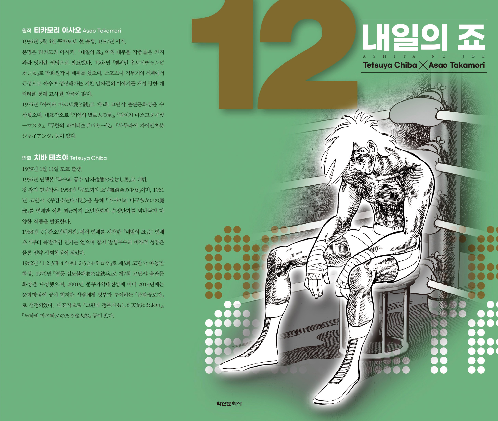
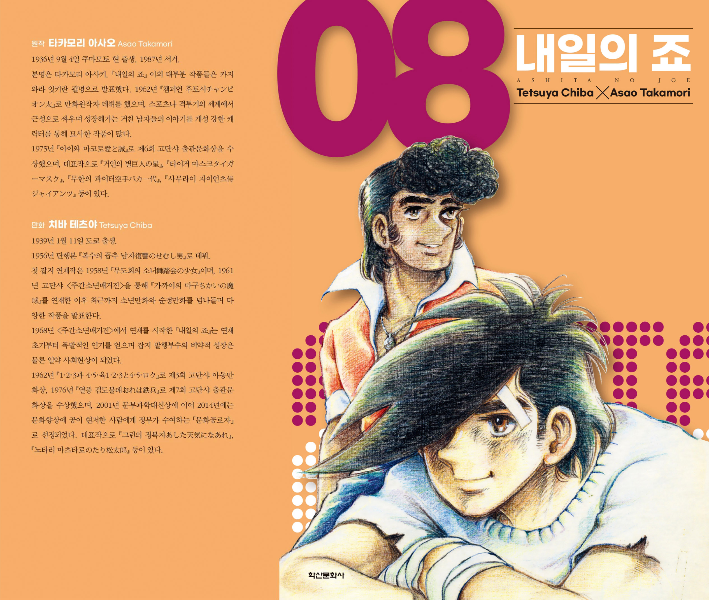
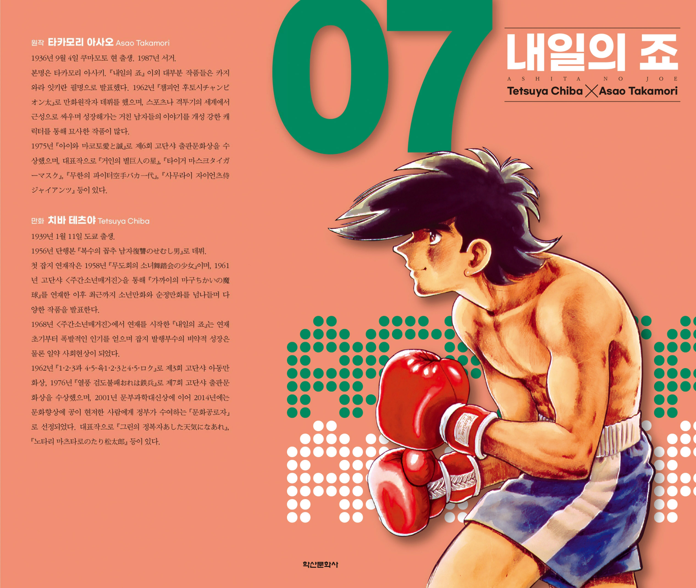

# 내일의 죠(허리케인 죠) "하얗게 불태웠다" 전하는 삶의 의미는?

[내일의 죠]는 복싱 만화가 아니라 자신의 삶을 끝까지 선택한 한 인간의 이야기다. '하얗게 불태웠어'가 오늘날까지 회자되는 이유를 작품의 철학과 함께 살펴본다.

> **"야부키 죠는 왜 그렇게까지 싸워야 했을까?"**

이 질문에 답하는 과정에서 [내일의 죠]는 스포츠 만화를 넘어 인간 드라마가 된다. 중요한 것은 승패가 아니라 어떤 삶을 선택했는가였다. "하얗게 불태웠어."는 그 답을 압축한 한마디다.

## 핵심 요약

| 핵심 키워드   | 의미                       |
| -------- | ------------------------ |
| 하얗게 불태웠어 | 후회 없이 자신의 삶을 모두 사용한 완전연소 |
| 야부키 죠    | 자신의 기준으로 삶을 선택한 인간       |
| 리키이시     | 존재의 의미를 깨닫게 한 첫 번째 라이벌   |
| 카를로스     | 그 길의 대가를 보여 준 두 번째 라이벌   |
| 시라키 요코   | 다른 삶의 가능성을 제시한 인물        |
| 호세 멘도사   | 마지막 시험이자 최종 완성           |

## [내일의 죠]가 지금도 명작인 이유

[내일의 죠]는 복싱 만화로 시작하지만, 끝까지 남는 것은 복싱이 아니라 삶의 태도다.

대부분의 스포츠 만화가 우승과 챔피언을 목표로 한다면, 죠는 처음부터 돈이나 명예에 관심이 없다. 그의 경기는 상대를 이기기보다 자신의 한계를 끝까지 밀어붙이는 과정이었다. 승패보다 **얼마나 후회 없이 싸웠는가**를 중요하게 여긴다.

이 점이 [내일의 죠]를 시대를 초월한 작품으로 만든다. 복싱이라는 소재는 시대와 함께 변했지만,

* 자신의 삶은 무엇인가.
* 나는 무엇을 위해 싸우는가.
* 후회 없는 삶이란 무엇인가.

이 질문은 지금도 변하지 않았기 때문이다.

이후 등장하는 리키이시 토오루, 카를로스 리베라, 시라키 요코, 호세 멘도사는 모두 이 질문을 더 깊게 만드는 인물들이다. 그들은 단순한 라이벌이 아니라 **야부키 죠라는 인간을 완성하는 거울이다.**

## '하얗게 불태웠어'는 무엇을 의미하는가?

많은 사람은 "**하얗게 불태웠어.**"를 죽음을 상징하는 대사로 기억한다. 하지만 [내일의 죠]가 말하고자 한 것은 **죽음이 아니라 완전연소**다.

일본 원문은 "**燃え尽きたよ……真っ白な灰に……**"로, 직역하면 "*다 태워버렸어. 새하얀 재가 될 때까지.*"라는 뜻이다. 이는 마지막 순간의 감상이 아니라, 작품 전체를 관통하는 철학을 압축한 문장이다.

죠는 오래 살아남기 위해 자신의 열정을 아껴 두는 사람이 아니다. 그는 자신의 모든 가능성을 끝까지 사용하길 원한다. 마지막에 남는 것은 승패가 아니라 **후회 없이 자신의 삶을 모두 사용했다는 사실**이다. 이 가치관은 작품 중반 노리코와의 대화에서 이미 드러난다.

> 오래 연기를 내며 타는 삶보다, 짧더라도 완전히 타올라 새하얀 재만 남는 삶을 살고 싶다.

이 장면은 마지막 결말을 이해하는 결말을 이해하는 핵심 복선이다. 즉, "**하얗게 불태웠어.**"는 즉흥적으로 만들어진 명대사가 아니라, 처음부터 준비된 작품의 결론이었다.

### '완전연소'가 의미하는 것

| 일반적인 해석 | 작품이 말하는 의미        |
| ------- | ----------------- |
| 죽음      | 삶의 완성             |
| 패배      | 후회 없는 선택          |
| 소진      | 자신의 모든 가능성을 사용함   |
| 체념      | 끝까지 자신의 삶을 선택한 의지 |

하지만 [내일의 죠]는 이 삶을 낭만적으로만 그리지 않는다.

* 리키이시는 극단적인 감량 끝에 목숨을 잃는다.
* 카를로스는 펀치드렁크 증후군으로 폐인이 된다.
* 죠 역시 자신의 몸이 무너지고 있음을 알고 있다.

그럼에도 그는 링을 떠나지 않는다. 죽고 싶어서가 아니다.

**자신의 삶을 결정하는 기준만큼은 끝까지 스스로 선택하고 싶었기 때문이다.**

그래서 마지막 장면은 죽음을 미화하는 결말이 아니라, **인간은 어디까지 자신의 선택에 책임질 수 있는가**를 묻는 장면이다.

## 리키이시와 카를로스는 왜 같은 운명을 반복하는가?

[내일의 죠]에는 수많은 라이벌이 등장하지만, 작품의 중심축은 **리키이시 토오루와 카를로스 리베라**다.  
둘은 전혀 다른 인물이지만, 서사에서는 하나의 역할을 수행한다.

| 리키이시 토오루    | 카를로스 리베라      |
| ----------- | ------------- |
| 첫 번째 라이벌    | 두 번째 라이벌      |
| 죠를 복서로 각성시킴 | 죠의 트라우마를 극복시킴 |
| 극단적 감량 후 사망 | 펀치드렁크로 폐인     |
| 길의 시작       | 길의 끝          |

리키이시는 죠에게 **복싱이 삶 자체가 될 수 있음을 깨닫게 한 인물**이다. 그의 죽음은 죠에게 깊은 죄책감을 남겼고, 이후 죠는 상대의 얼굴조차 제대로 때리지 못하는 슬럼프에 빠진다.

그 무너진 죠 앞에 나타난 사람이 카를로스다.  
죠가 카를로스를 보며 끊임없이 리키이시를 떠올리는 이유도 여기에 있다. 카를로스는 새로운 라이벌이 아니라, **리키이시가 남긴 자리를 이어받은 존재**이기 때문이다.

죠는 카를로스와의 혈전을 통해 리키이시의 죽음을 비로소 받아들이고, 다시 복서로 일어선다.

그러나 작품은 같은 비극을 반복한다.  
카를로스 역시 호세 멘도사와의 경기 이후 펀치드렁크 증후군으로 폐인이 된다. 이 장면은 단순히 호세의 강함을 보여 주기 위한 연출이 아니다. 리키이시의 죽음과 카를로스의 몰락은 하나의 메시지를 향한다.

> **복싱에 자신의 모든 것을 바친 인간은 무엇을 얻고, 무엇을 잃는가.**

이 질문이 있었기에 호세 멘도사와의 마지막 경기는 단순한 세계 타이틀전이 될 수 없었다.

리키이시는 **왜 이 길을 걸어야 하는가**를 보여 준 인물이었고, 카를로스는 **그 길 끝에 무엇이 기다리는가**를 보여 준 인물이었다.

그리고 두 사람의 삶이 있었기에, 마지막 호세전은 **야부키 죠가 자신의 삶을 완성하는 마지막 무대**가 될 수 있었다.

## 시라키 요코는 왜 끝까지 죠를 말렸는가?

시라키 요코는 [내일의 죠]에서 가장 큰 변화를 겪는 인물이다.

처음에는 슬럼가 출신의 거칠고 통제되지 않는 죠를 경멸했고, 재벌가의 후계자로서 그를 관리해야 할 대상으로 바라봤다. 그러나 작품이 진행될수록 그녀의 감정은 **경멸에서 이해로, 이해에서 사랑으로** 변해 간다.

### 요코의 감정 변화

| 시기  | 감정     | 의미                  |
| --- | ------ | ------------------- |
| 초반  | 경멸과 대립 | 슬럼가 출신 죠를 이해하지 못함   |
| 중반  | 집착과 이해 | 죠의 삶의 방식에 관심을 갖기 시작 |
| 후반  | 사랑     | 죠를 살리고 싶어 함         |
| 마지막 | 절박함    | 링보다 죠의 생명을 선택함      |

요코는 리키이시의 죽음과 카를로스의 몰락을 모두 지켜본 인물이다. 누구보다 먼저 죠의 몸이 한계에 이르렀음을 알아차렸고, 세계 타이틀전을 치르면 되돌릴 수 없을 것이라는 사실도 알고 있었다.

그래서 마지막에 죠를 말린 이유는 복싱을 반대한 것이 아니다.

**사랑하는 사람이 죽으러 가는 것을 막고 싶었기 때문**이다.

반면 죠 역시 요코의 마음을 이해하지 못한 것은 아니다. 마지막 대기실에서 그는 그녀의 진심을 받아들이고 감사의 마음을 전한다. 그러나 결국 링으로 향한다.

이 장면을 흔히 **복싱을 사랑보다 선택한 결말**이라고 해석하지만, 조금 다르게 볼 수도 있다. 죠는 사랑을 거부한 것이 아니라, **자신의 삶을 거부할 수 없었던 것**이다. 요코가 원하는 삶은 **살아남는 삶**이었다. 죠가 원하는 삶은 **끝까지 자신답게 사는 삶**이었다.

둘 중 어느 쪽도 틀리지 않았다. 다만 삶에서 가장 소중하게 여긴 가치가 달랐을 뿐이다. 이처럼 [내일의 죠]는 이루어지지 못한 사랑을 그린 작품이 아니라, **서로를 이해했기에 더욱 비극적이었던 두 사람의 선택**을 그린 이야기다.

## [내일의 죠]는 두 작가의 차이가 만든 명작이다

[내일의 죠]를 특별하게 만든 것은 원작자 **카지와라 잇키(타카모리 아사오 명의)**와 작화가 **치바 테츠야**의 서로 다른 시선이었다.

두 사람은 같은 작품을 만들었지만, 중요하게 생각한 가치는 달랐다.

| 카지와라 잇키 | 치바 테츠야  |
| ------- | ------- |
| 승부와 의지  | 인간과 감정  |
| 처절한 비극  | 따뜻한 인간미 |
| 극한의 긴장감 | 서정성과 여운 |
| 파멸의 미학  | 삶의 온기   |

카지와라는 **극한의 승부와 인간의 의지**를 그리고자 했다. 반면 치바는 슬럼가 사람들의 일상, 아이들과 어울리는 죠의 모습, 라이벌을 향한 존경과 슬픔처럼 **인간적인 감정**을 작품에 녹여 냈다.

이 차이는 연재 과정에서 실제로 여러 차례 드러났다.

대표적인 사례가 **리키이시의 체격 설정**이다. 치바가 리키이시를 죠보다 훨씬 큰 체격으로 그리면서 원래 설정대로는 공식 대결이 어려워졌다. 이를 해결하기 위해 카지와라는 **극단적인 감량**이라는 설정을 추가했고, 결과적으로 리키이시의 죽음이라는 작품 최고의 비극이 탄생했다.

또 하나는 **마지막 엔딩**이다.

카지와라의 초안은 지금보다 담담한 결말이었다. 그러나 치바는 그것만으로는 죠의 삶을 완성하기에 부족하다고 판단했고, 링 코너에 앉아 미소를 짓는 마지막 장면을 제안했다.

그 결과 탄생한 것이 지금도 회자되는 **"하얗게 불태웠어."**라는 전설적인 엔딩이다. 결국 [내일의 죠]는 두 사람 중 한 명의 작품이 아니다.

카지와라가 **인간의 의지를 끝까지 밀어붙이는 뼈대**를 만들었고, 치바가 **인간의 온기와 슬픔**을 더했다.

서로 다른 철학은 충돌했지만, 그 충돌은 작품을 약하게 만든 것이 아니라 더욱 입체적으로 만들었다. 그래서 [내일의 죠]는 단순한 복싱 만화가 아니라, **승부와 인간성, 이상과 현실이 함께 살아 숨 쉬는 명작**으로 남게 되었다.

## 현대 사회에서 [내일의 죠]는 우리에게 무엇을 묻는가?

[내일의 죠]가 연재된 1960~70년대 일본은 고도경제성장의 그늘 아래 청년층의 소외와 계층 간 격차가 커지던 시대였다. 가진 것 없는 슬럼가 청년이 오직 자신의 주먹 하나로 세상과 맞서는 모습은 당시 독자들에게 강한 공감을 불러일으켰다.

하지만 반세기가 지난 지금, 우리는 조금 다른 이유로 이 작품에 마음이 움직인다.

오늘날 사회는 **도전보다 안정**을, **신념보다 위험 관리**를 우선한다. 미래를 준비하고, 실패를 줄이며, 현실과 타협하는 것이 성숙한 선택으로 여겨진다. 특히 한국 사회는 학업과 취업, 주거와 노후까지 끊임없이 미래를 계산해야 하는 구조 속에 있다.

이런 현실에서 야부키 죠의 삶은 분명 비현실적이다.

그는 몸이 망가진다는 사실을 알면서도 링을 떠나지 않는다. 대부분의 사람은 그런 선택을 하지 못한다. 아니, 하지 않는 것이 옳다고 생각한다.

그래서 우리는 죠를 보며 서로 다른 두 감정을 동시에 느낀다.

### 야부키 죠를 바라보는 두 가지 감정

| 감정   | 이유                             |
| ---- | ------------------------------ |
| 애처로움 | 자신의 모든 것을 바친 끝에 비극을 맞이하기 때문이다. |
| 존경   | 끝까지 자신의 신념을 포기하지 않았기 때문이다.     |

애처로운 이유는 현실을 알기 때문이다.

리키이시는 죽었고, 카를로스는 폐인이 되었으며, 죠 역시 몸이 무너져 간다. 작품은 그 희생을 낭만적으로 포장하지 않는다. **신념을 끝까지 지키는 일이 얼마나 큰 대가를 요구하는지** 냉정하게 보여 준다.

그런데도 우리는 마지막 장면에서 슬픔만 느끼지는 않는다.

오히려 설명하기 어려운 존경심이 함께 남는다. 그 이유는 죠처럼 살고 싶어서가 아니다. 현실에서 우리는 가족을 책임지고, 미래를 준비하며, 수없이 타협한다. 그것이 틀렸다고 생각하지도 않는다.

그럼에도 자신의 기준을 단 한 번도 남에게 맡기지 않았던 한 인간을 보며, 우리는 쉽게 흉내 낼 수 없는 삶의 무게를 느낀다.

## 그래서 '하얗게 불태웠어'는 오래 기억된다

[내일의 죠]는 죠처럼 살아야 한다고 말하지 않는다.

오히려 그런 삶이 얼마나 위험하고, 얼마나 큰 희생을 요구하는지를 끝까지 보여 준다. 그럼에도 마지막 장면이 감동으로 남는 이유는 하나다.

**야부키 죠는 자신의 삶을 끝까지 남에게 맡기지 않았기 때문이다.** 그는 챔피언보다 자신의 삶을 선택했고, 안전보다 자신의 신념을 선택했다.

그래서 "하얗게 불태웠어."는 죽음을 의미하는 말이 아니라, **후회 없이 자신의 삶을 모두 살아냈다는 선언**이 된다.

## 결론

[내일의 죠]는 복싱 만화이지만, 끝내 복싱만을 이야기하는 작품은 아니다.

리키이시는 **왜 이 길을 걷는가**를 보여 주었고,
카를로스는 **그 길의 끝에는 무엇이 있는가**를 보여 주었으며,
요코는 **다른 삶도 가능했다**는 사실을 보여 주었다.

그리고 죠는 모든 갈림길 앞에서 끝내 자신의 삶을 선택했다.

젊은 시절의 우리는 죠의 승부에 열광하지만, 시간이 지나면 리키이시의 죽음과 카를로스의 비극, 그리고 요코의 절박함을 이해하게 된다. 그럼에도 마지막까지 기억에 남는 것은 야부키 죠라는 인간이다.

그는 승자가 아니었고, 행복한 삶을 선택한 사람도 아니었다. 그러나 마지막 순간까지 **자신의 삶을 남에게 맡기지 않았던 사람**이었다. 현실에서 우리는 안전과 타협하며 살아간다. 그것은 대부분 필요한 선택이다. 그래서 죠처럼 사는 것은 현실적으로 불가능할지도 모른다.

그럼에도 그의 마지막 장면이 오래 남는 이유는, 누구나 한 번쯤 자신의 삶을 돌아보며 묻게 되기 때문이다.

* 나는 무엇을 위해 살아가는가.
* 지금의 삶은 정말 내가 선택한 삶인가.
* 후회 없이 불태웠다고 말할 수 있는 순간이 올 것인가.

[내일의 죠]는 그 질문에 답하지 않는다. 대신 한 인간이 자신의 삶을 끝까지 책임지는 모습을 보여 준다. 그래서 **"하얗게 불태웠어."**는 패배의 말도, 죽음을 찬미하는 말도 아니다. **자신이 선택한 삶을 끝까지 살아낸 한 인간의 조용한 선언이다.**

반세기가 지난 지금도 이 한마디가 남는 이유는, 결국 우리 모두 언젠가 같은 질문을 마주하기 때문이다.

> **"나는 과연, 후회 없이 불태웠다고 말할 수 있는 삶을 살았는가."**

## 자주 묻는 질문(FAQ)

### 야부키 죠는 정말 죽었을까?

[내일의 죠]는 끝까지 죠의 생사를 명확히 밝히지 않는다. 마지막 장면은 링 코너에 앉아 미소를 짓는 죠의 모습에서 끝나며, 이후는 독자의 해석에 맡겨진다.

중요한 것은 생존 여부가 아니다. 작품이 강조하는 것은 **야부키 죠가 자신의 삶을 한 점의 미련도 없이 모두 태워냈다는 사실**이다. 그렇기에 마지막 장면은 죽음의 묘사가 아니라, 삶의 완성을 상징하는 장면으로 받아들여진다.

### 호세 멘도사는 왜 경기 후 백발이 되었을까?

호세 멘도사는 세계 최강의 챔피언이었지만, 야부키 죠처럼 모든 것을 걸고 끝없이 일어나는 상대는 처음 경험했다.

경기 내내 이어진 극도의 긴장과 압박은 그의 정신을 한계까지 몰아붙였고, 작품은 이를 **백발**이라는 상징적 연출로 표현했다. **최강이라 불리던 인간마저 두려움을 느끼게 만든 죠의 투지**를 시각적으로 보여 주기 위한 장치다.

### '하얗게 불태웠어'는 왜 지금까지도 회자될까?

원문은 **"燃え尽きたよ……真っ白な灰に……"**로, "다 태워버렸어. 새하얀 재가 될 때까지."라는 의미다.

이 대사는 [내일의 죠]를 넘어 하나의 문화적 표현으로 자리 잡았다.

오늘날에도 시험, 프로젝트, 운동 경기처럼 모든 힘을 쏟아낸 뒤 **"하얗게 불태웠다."**라고 말하는 이유는 단순히 지쳤다는 뜻이 아니다.

**후회 없이 자신의 모든 것을 쏟아냈다는 의미**가 이 한마디에 담겨 있기 때문이다.

### [내일의 죠]가 반세기가 지난 지금도 명작인 이유는 무엇일까?

복싱 기술이나 명승부 때문만은 아니다. 이 작품은 독자에게 하나의 질문을 끝까지 던진다.

* 무엇을 위해 살아가는가.
* 무엇을 위해 싸우는가.
* 자신의 삶은 스스로 선택하고 있는가.

이 질문은 시대가 바뀌어도 변하지 않는다. 그래서 [내일의 죠]는 스포츠 만화를 넘어 **삶의 태도를 이야기하는 작품**으로 남아 있다.
