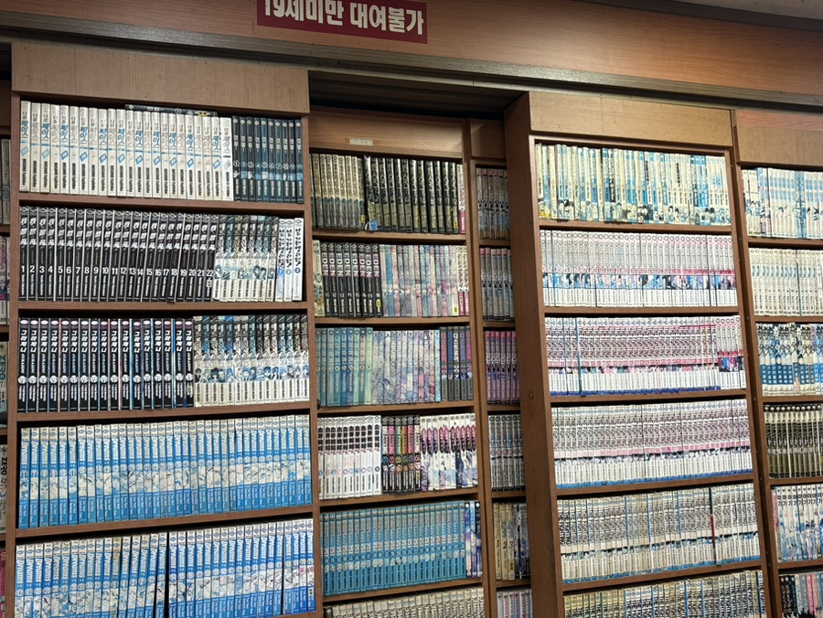
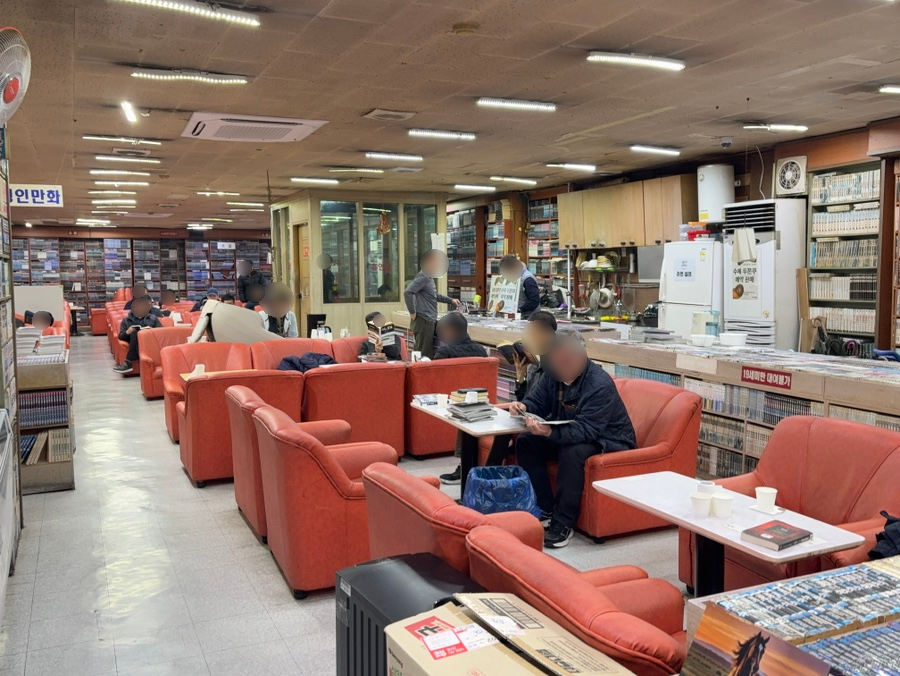
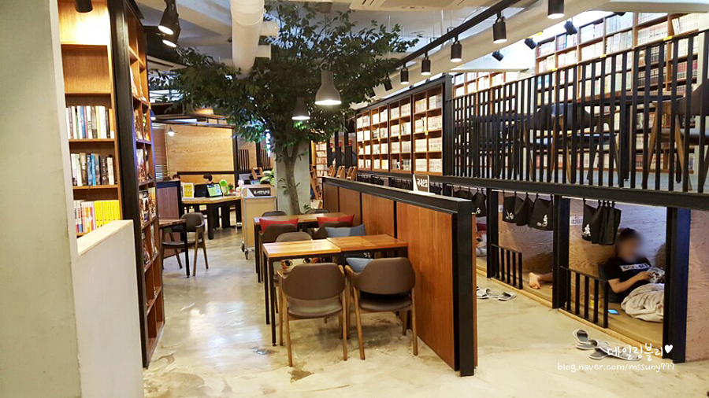
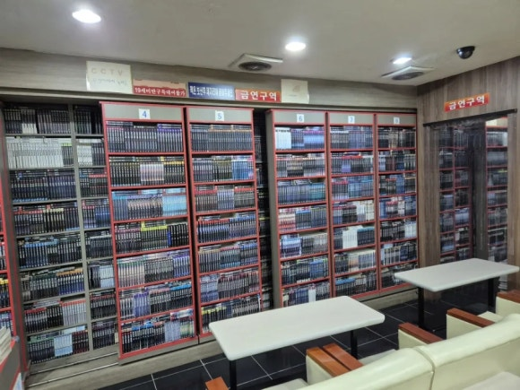

# 만화방을 기억한다.

 >나는 94년도 중학교 3학년때 만화방을 처음 간거 같아. 그 시절엔 만화책이  진열된 벽 바로 아래 목욕탕 의자 같은 의자에 쪼르르 다같이 앉아서 보곤했던 기억이 나.  

 > 그리고 2001년도에 군 제대를 한 23살 부터 만화방을 본격적으로 자주 다녔어. 이 시점에 주말엔 친구들과 술도 마시고, 당구도 치고, 나이트 클럽도 가곤했지만, 평일 수업 마치고 집으로 가는 지하철을 타고 경성대학교에 내려서 버스를 한번 더 갈아타야 했는데... 버스 정류장 가기전에 만화 방이 있었거든, 아마 2008년 서른살이 될때 까지는 그 만화방에 자주 들렸던거 같아. 이 무렵이 정액제가 1000원에서 1500원 정도까지 올랐던 기억이 나.

## 1. 만화방의 위기

2000년대 초반 군대 제대를 하고 바뀐 문화가 있어. 그 전까진 대학가에 당구장이 10개 있으면 PC방은 1개 정도 있었거든? 근데 제대 후 PC방 10개에 당구장 1개 수준으로 바뀐것 같아. 

스타크래프트와 포트리스 그리고 세이클럽으로 이어지는 인터넷 부흥기의 시작이었던 거지.
상대적으로 PC방은 시간당 요금을 받았기 때문에 당구장 보다 훨신 저렴해서 대학생들은 모두 PC방에 가는 세상이 되어 버렸지.  

만화방도 권당 얼마씩 받으면, 한시리즈를 다보려면 2,3만원은 써야 하기도 했기 때문에, 어찌 보면 이 무렵에 만화방도 시간제 정액요금을 받기 시작한 건 살아남기 위한 발버둥이었을 듯 해. 

그래서 만화방 사장님들은 쇠퇴기라 하겠지만, 인터넷 보급 전 누리던 운이였을 뿐, 그다지 손해도 아니었을 거야. 사실 시간제 요금으로 바뀐 후에도 꽤나 만화방은 북적대던 젊은 사람들의 아지트였거든. 

"당구장에서는 짜장면, 만화방에서는 라면" 이런 구호는 알만한 사람들은 알겠지.

아무튼, 그렇게 파격적인 '시간제' 도입 이후에 야간 정액제도 생겼지... 기억이 정확하진 않지만, 거의 12시간 정도에 7천원 정도 했던 거 같아. 정말 가성비 취미 아니었겠나?   
사장님들 입장에서야 PC방에 손님을 빼앗기지 않으려는 필사적인 생존 전략이었겠지만, 우리들에겐 정말 황금기 었어.

## 2. 그 시절의 추억에 잠기다.

만화방에 입장을 하면 빈 바코드를 사장님에게 찍어달라고 하고선, 하는말이 있었지. "라면 하나요.~" 그리곤 보고싶은 신간을 확인하곤 몇권을 가지고선 자리를 잡고 쇼파에 앉는거야.  

이 시절은 아직 실내 흡연을 하던 때였거든? 담배 한대 물고, 라면을 기다리며 책장을 한장씩 넘기던 그 기분은 해본 사람만 아는 그 시절 내 청춘의 그리움이야.  

요즘은 혼자 보내는 시간을 '고독'이나 '외로움'으로 치부하기도 하지만, 당시의 만화방은 '완벽하게 자발적인 고립'을 선물하는 공간이었어.  
전혀 외롭다거나 무의미한 시간이라고 생각한 적이 없었어.

스마트폰도 없고, SNS의 끊임없는 알림도 없던 시절이기에 가능했던 진정한 몰입의 시간이었지.  
그냥 요즘 모든 사람들이 쇼츠, 릴스, 피드 쳐다보는것과 같은거라면 이해할까?  

그래서 요즘 어때? 요즘 젊은 애들 소설책 한권 보는 걸 힘들어할걸?  
아니, 보지 못할 거야. 자극적인 영상에 BGM. 순식간에 사라지는 영상이 계속해서 끊임없이 입에 떠먹여 주는데, 글자를 읽어가며, 그 문장을 상상하며, 내 생각과 비교를 하면서 다음 줄을 이어 나가는 그 과정이 너무 당연한 건데, 이젠 못하는 사람들이 많을 것 같아...  

 아무튼 세상과 자발적인 단절의 시간을 가지며, 담배 연기 살짝 섞인 매장의 공기 속 라면 냄새를 맡으며, 오직 만화책 책장을 넘기는 손가락 끝에만 집중하던 그 시간은 무의미한 게 아니라 치열했던 20대 삶을 지탱해 준 최고의 충전 시간이었다고 생각해.  

 매장 안은 아주 조용하지도, 그렇다고 시끄럽지도 않았어. 책장 넘기는 소리, 과자 먹는 소리 등 백색소음이 매장을 채우고 대부분의 사람은 각자의 책속 으로 빠져있는 상태였어.  

 ## 3. 도피처이자 휴식공간

사진에는 없지만, 거의 누울 수 있는 의자들도 옆에 비치되어 있었어, 만화를 보다가 잠들어 버린 경우도 있었어.  

직장 생활을 갓 시작한 사회 초년생 시절 금요일 퇴근 후 여자친구도 없겠다. 만화방으로 직행한 날이었어.  
만화책에 집중을 하고 있었는데, 깜빡, 눈을 뜨니 새벽 3시인 거야. 라면과 쥐포등을 잔뜩 먹고 잠들어 버린거지. 그때 기분이 어땠냐고? 허무했냐고?  
아니, 너무 기분 좋게 주말을 시작하는것 같은 거지. 내일은 토요일이고 출근도 안 하고. 더 늦으면 안 되겠다 싶어서 만화방을 나와서 터벅터벅 집으로 걸어갔던 기억이 나.  

그 시절엔 친구들도 많았지만, 혼자 있을때 언제나 갈 수 있는 내 유일한 아지트였어. 누군갈 기다릴 때, 누군가와 헤어지고 집에 들어가기 아쉬울 때, 할 일이 없어 심심할 때. 최고의 휴식 공간이었다고 생각해.

## 4. 만화 카페와의 차이점.

요즘 만화 카페야. 만화방과는 많이 달라보이지? 커텐 처진 개인 동굴방도 보이고, 차를 마시며 쉴 수 있는 공간도 보인다 그치?  

그 시절, 만화방은 사방이 뻥 뚫려 있었다. 옆 사람 소파가 내 소파와 붙어 있었고, 모르는 사람인데도 슬쩍 보면 킥킥대는 모습도 다 보였어. 한 공간에 있는 모두가 '만화를 좋아하는 동지들'이라는 묘한 공동체 감각이 있었달까...

그런데 요즘 만화 카페는 동굴방 앞에 신발을 벗고 쏙 들어가 커튼을 쳐버리고 누우면 편하긴 하지만, 옆방에 누가 있는지 전혀 알 수 없고 매장 안은 숨소리조차 내기 조심스러운 침묵만 흐르지.  만화방이라기보다는 독서실이나 캡슐 호텔에 가까운 내가 알던 그 만화방과는 거리가 멀어.   

어쩌면, 간섭 받고 싶지 않은 요즘 세상에 어울리는 방식일지도 몰라.  

예전 낡은 그 쇼파에 앉아 앞쪽 쇼파에 다리를 올리기도 하고, 만화방 마다의 스타일로 끓여 주던 그 양은 냄비의 라면 냄새는 요즘 만화 카페 느낌하곤 많이 다른것 같아. (그런데, 만화카페도 라면 다 팔긴 해.)  

## 5. 웹툰 그리고 직추출 만화.

휴대폰에서 릴스를 보든 웹툰을 보든, 스크롤을 아래로 내려가며 보는 식이지? 기존의 만화와 보는 방식의 차이 말고도 큰 차이점은.   

이야기를 써내려가는 방식이 웹툰은 아주 간략하고 속도 전환이 빨라.  
굳이 따지자면, 만화가 드라마라면, 웹툰은 쇼츠 라고 생각하면 될것 같아. 그래서 쉽게 보고 쉽게 닫을 수 있지.
그리고 이젠 굳이 만화방을 가지 않아도, 웹에서 직추출 고화질 만화를 볼 수 있어.   

하고 싶은말은 만화방을 찾을 이유가 사라진게 사실이란 거야.  
어느 시절이나 유행하는게 있고, 쇠퇴하는게 있을것인데, 이제 한국에서는 만화가 쇠퇴하는 문화라는거지.  

## 6. 살아남은 만화방

그럼 다 사라졌는냐? 아니~  

나보다도 형님들은 웹툰이나, 직추출물은 거들떠 보지도 않을꺼야.  
여전히 만화방을 다니시지.  

좋은 점은 여전히 1시간 1,500원 선을 유지하며, 양은 냄비에 라면을 팔고 있으며, 하루 종일 죽치고 있는다고 눈치 주는 사람도 없고, 그 시절을 기억하는 사람이라면 아직도 그 갬성 그대로라는거야.  

그리고 전국에 만화방 이름이 통일이 되었어.  
**"봐라봐라 만화방"** 폐업하는 가게를 만화 유통업체에서 새로 하는 가게 마다 동일한 이름으로 런칭해준게 시초인데. 재미난건 체인점은 아니야.  

예전 처럼 많지는 않지만, 동 단위 까진 아니라도 구단위로 하나정도는 존재하는것 같아. 만화책을 본다기 보단 예전 갬성을 느끼고 싶을때, 그 때 그 라면이 먹고 싶을때, 아무 생각없이 잠수 타고 싶을때 가보면 좋을것 같아.  
만화가 재미 없으면, 그냥 라면 하나만 먹고 나와바. 혹시 알아 재미난 만화책 찾아서 다 보고 나올지?

## 7. 끝내며

언젠가 정말 마음이 동하는 주말이나 퇴근길에, 만원짜리 몇 장 주머니에 넣고 들어가서, 옛날처럼 시간제 바코드를 찍고, 가장 낡은 소파를 골라 앉아 사장님이 양은 냄비에 끓여주는 투박한 라면 한 그릇을 주문해 보는거야.  

책장에 꽂힌 빛바랜 만화책 한 권을 빼 들고 소파에 몸을 파묻는 그 순간, 20대의 청춘으로 돌아가는거다.  

***40,50대 친구들 형님들 그 시절을 기억하고 응원합니다.***