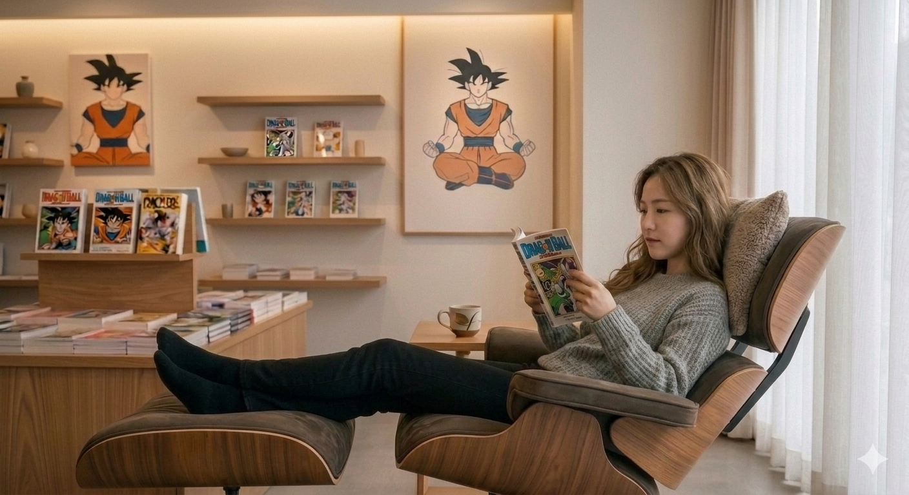

# 미니멀리즘 취미 추천, 삶의 속도를 늦추는 만화 독서 [만화인문학 ②]

이 글은 기획 연재 [만화인문학] 시리즈의 2부인 「미니멀리즘 취미 추천, 삶의 속도를 늦추는 만화 독서」이다. 앞서 1부에서 다룬 파편화된 집중력 문제의 연장선에서, 정보가 과잉 공급되는 시대일수록 핵심은 더 많은 콘텐츠를 소비하는 것이 아니라 인지적 자극의 총량을 의도적으로 제어하는 것이다. 현대인은 일상 속에서 무수한 데이터와 선택지에 노출되며 만성적인 인지 피로를 겪는다. 본문에서는 현대 사회의 구조적 피로 원인을 진단하고, 에센셜리즘과 다운시프팅의 관점에서 왜 만화가 가장 현실적이고 지속 가능한 미니멀리즘 취미가 되는지 그 논리적 근거를 제시한다.

## 핵심 요약

* 현대인의 만성 피로는 노동 시간보다 **정보 과부하**와 **선택 피로**에서 기인한다.
* 미니멀리즘의 본질은 소유물의 축소가 아닌, 일상적인 **인지적 노이즈의 제거**다.
* 에센셜리즘은 **본질적 선택**을, 다운시프팅은 **속도의 통제**를 통해 미니멀리즘을 완성한다.
* 만화는 진입 장벽과 유지 비용이 극히 낮아, 자산 축적을 방해하지 않는 **지속 가능한 취미**다.
* 영상과 달리 만화는 독자가 인지 속도를 직접 제어하므로 **뇌의 과부하를 방지**한다.
* 효율성 중심의 디지털 환경이 생략해 버린 '삶의 중간 과정'과 '무작위성'을 회복해야 한다.
* 멀티태스킹을 강요하는 여타 플랫폼과 달리, 만화는 **단일 서사 몰입**을 통해 뇌에 휴식을 제공한다.
* 아무것도 생산하지 않는 무목적의 여백이야말로 지친 정신을 복구하는 핵심 기전이다.

## 1. 현대인은 왜 항상 피곤할까: 정보 과부하와 선택 피로

현대인이 겪는 피로의 실체는 육체적 노동보다 정신적 에너지의 고갈에 가깝다. 기술의 발전으로 물리적 노동 강도는 과거보다 감소했으나, 정신적 피로도를 호소하는 이들은 오히려 증가했다. 이러한 현상이 발생하는 일차적 원인은 **정보 과부하**(Information Overload)에 있다. 스마트폰과 네트워크의 상시 연결성은 개인의 의도와 상관없이 초단위로 무수한 데이터를 뇌에 주입한다.

* 메신저 알림 및 실시간 업무 공유
* 자극적인 헤드라인의 뉴스 피드
* 알고리즘이 추천하는 유튜브 및 SNS 콘텐츠
* 타깃팅된 상업 광고 및 실시간 이슈

뇌는 입력되는 정보의 중요도를 완벽하게 선별하지 못하므로, 무가치한 자극을 처리하는 과정에서도 동일하게 인지 자원을 소모한다.

여기에 선택 피로(Decision Fatigue)가 더해진다. 인간이 하루 동안 사용할 수 있는 의지력과 결정 능력의 총량은 제한되어 있다. 그러나 현대인은 무엇을 먹고, 무엇을 입고, 수많은 OTT 라인업 중 어떤 영상을 시청할지 결정하는 사소한 과정에서조차 끊임없이 선택을 강요받는다. ***선택지가 넓어질수록** 기회비용에 대한 미련이 남아 **만족감은 오히려 하락**하며, 뇌는 휴식 시간조차 '무엇을 소비할지' 고민하느라 회복할 기회를 잃게 된다.

## 2. 미니멀리즘의 본질은 물건이 아니라 삶이다

많은 이들이 미니멀리즘을 단순히 '물건을 버리는 정리 정돈'으로 오해한다. 하지만 소유물의 축소는 미니멀리즘이라는 철학이 삶에 적용되었을 때 나타나는 하위 결과물 중 하나일 뿐이다.  

진정한 미니멀리즘의 본질은 **불필요한 인지적 노이즈를 제거하여 생존과 성장에 직결된 본질에 집중하는 구조적 환경을 구축하는 것**이다. 따라서 미니멀리즘은 물리적 공간을 넘어 디지털 환경, 인간관계, 시간 관리, 정보 소비 등 삶의 전 영역으로 확장되어야 한다.

현대인은 **휴식을 취한다는 명목 하에 또 다른 정보를 과소비하는 모순**을 범한다. 유튜브 알고리즘을 목적 없이 표류하거나 SNS 피드를 의미 없이 넘기는 행위는 뇌 과학적으로 명백한 인지 가동 상태다. 쉬는 시간에도 지속적인 시각·청각적 자극을 받아들이는 구조 안에서는 뇌의 피로 회복이 불가능하다. 진정한 의미의 미니멀리즘적 휴식을 실천하기 위해서는 시각적 자극의 양을 줄이는 '정보 다이어트'가 선행되어야 한다.

## 3. 에센셜리즘과 다운시프팅이 말하는 삶의 방향

인지 과잉의 시대를 돌파하기 위한 구체적인 방법론으로 에센셜리즘(Essentialism)과 다운시프팅(Downshifting)을 꼽을 수 있다.

* **에센셜리즘:** "선택과 집중의 기술"이다. '가장 본질적인 가치는 무엇인가?', '지금 당장 제거해야 할 무가치한 일은 무엇인가?'를 끊임없이 질문하며 절대적으로 필요한 소수(The Vital Few)만을 남기는 방식이다.
* **다운시프팅:** "속도와 제어의 기술"이다. 무한 경쟁 체제에서 한 걸음 물러나 삶의 속도를 의도적으로 늦추고, 효율성보다 내면의 여유와 만족을 우선순위에 두는 생활 방식이다.

이 두 가지 개념은 별개의 이론이 아니라 하나의 지향점을 공유한다. 에센셜리즘을 통해 불필요한 선택지를 가지치기하고, 다운시프팅을 통해 삶의 리듬을 하향 조정할 때 비로소 노이즈가 제거된 **미니멀리즘적 삶이 완성**된다. 자본주의 사회는 끊임없이 더 많이 경험하고 더 빠르게 소비하라고 압박하지만, 두 철학은 역설적으로 "덜 선택할수록 삶은 더 선명해지며, 느리게 걸을 때 비로소 만족의 깊이가 깊어진다"는 사실을 증명한다.

## 4. 최고의 취미는 과도한 소비를 요구하지 않는다

일반적인 취미 활동은 대개 추가적인 자본 소비와 물리적 이동을 전제로 한다. 캠핑, 골프, 자동차 튜닝, 여행 등은 취미를 시작하고 유지하기 위해 필연적으로 다음과 같은 기회비용을 요구한다.

* 고가의 초기 장비 구입 및 지속적인 업그레이드 비용
* 장거리 이동에 따른 시간적·물리적 에너지 소모
* 타인과 일정을 조율해야 하는 인간관계의 스트레스
* 소유물 관리를 위한 추가적인 공간 점유

취미가 삶을 풍요롭게 만들기보다, 취미를 유지하기 위한 지출과 노동이 주객전도되는 현상이 빈번하게 발생한다. 자산을 모으고 미래를 설계해야 하는 관점에서 이러한 과소비형 취미는 장기적인 리스크가 된다.

반면 **만화는 구조적으로 극도의 미니멀리즘을 만족**한다. 최소한의 비용으로 접근이 가능하며, 추가적인 장비 업그레이드를 강요하지 않는다. 타인의 시선을 의식해 과시용 장비를 마련할 필요도 없고, 온전히 혼자만의 시간 속에서 완결된다. 자본을 축적하면서도 인지적 유희를 누릴 수 있는 가장 경제적이고 독립적인 문화생활인 셈이다.

## 5. 만화는 삶의 속도를 독자가 제어하는 미디어다

만화가 지닌 가장 독보적인 매체적 특징은 **시간의 주도권이 제작자가 아닌 독자에게 있다**는 점이다. 영화, 드라마, 유튜브 등 영상 미디어는 철저히 타임라인(Timeline) 기반이다. 시청자는 제작자가 설정한 재생 속도와 편집 리듬에 자신의 뇌를 동기화해야 한다. 화면이 강제로 흘러가기 때문에 생각할 여유 없이 수동적으로 정보를 받아들이게 된다.

그러나 만화의 리듬은 독자가 전적으로 통제한다.

* 텍스트와 이미지의 여백을 원하는 만큼 오랫동안 머물며 응시할 수 있다.
* 이해가 되지 않거나 사유가 필요한 서사는 언제든 전 페이지로 돌아가 재독할 수 있다.
* 컷과 컷 사이의 생략된 인과관계를 독자 스스로의 속도에 맞춰 메워나간다.

콘텐츠의 소비 속도를 스스로 제어하는 이 경험은 다운시프팅의 핵심 원리와 정확히 일치한다. 플랫폼이 정해놓은 속도에서 벗어나 자신의 호흡대로 텍스트를 읽어나갈 때, 비로소 뇌는 강제된 동기화에서 벗어나 안정적인 인지적 휴식 상태에 접어든다.

## 6. 효율성 중심의 사회가 생략해 버린 '삶의 과정'

디지털 기술은 인류에게 압도적인 편리함과 효율성을 선사했다. 배달 앱으로 음식을 주문하고, 방 안에서 전자책을 다운받으며, 클릭 몇 번으로 필요한 물품을 구매한다. 이동 시간과 대기 시간이 획기적으로 줄어들었으나, 아이러니하게도 현대인은 더 큰 공허함을 호소한다. 그 이유는 효율성을 추구하는 과정에서 '**삶의 중간 과정**(Intermediate Process)'이 통째로 삭제되었기 때문이다.

과거에는 하나의 목적을 달성하기 위해 필연적인 과정들이 존재했다. 옷을 챙겨 입고, 대문을 나서고, 정류장에서 버스를 기다리며 주변 풍경을 보고, 목적지까지 걸어가는 일련의 흐름이다.  
이 과정들은 목적 자체와는 무관했으나, 인간에게 사유의 틈을 제공하고 하루의 리듬을 만드는 일상의 완충 지대 역할을 했다. 디지털 효율성이 이 서사를 생략하고 '결과'만을 점 형태로 연결하면서, 인간은 시간의 흐름을 체감하지 못하고 **삶이 파편화되는 감각**을 느끼게 된다.

## 7. 의도적인 느림과 무작위성의 가치

최근 효율성과 전혀 무관한 '**목적 없는 산책**'이나 '**골목길 걷기**'를 즐기는 현대인들이 늘어나는 현상은 인지적 균형을 맞추려는 뇌의 본능적인 방어 기전이다.  
알고리즘이 철저히 계산해 제공하는 정보만 소비하던 뇌는 인위적인 통제 상황에서 피로를 느낀다. 이때 의도적으로 속도를 늦추고 아날로그적인 공간을 걸을 때 마주하는 무작위성(Randomness)은 인지 회복에 결정적인 기여를 한다.

* 낡은 건물의 담벼락과 **무심히 피어난** 풀꽃
* 기획되지 않은 **시장 골목**의 냄새와 소음
* **예기치 않게** 마주치는 길고양이의 움직임

이러한 무작위적 자극들은 뇌에 생산적인 긴장감을 요구하지 않으며, 알고리즘의 지배력에서 벗어난 해방감을 준다. 다운시프팅은 단순한 나태가 아니라, 시스템이 규정해 놓은 효율의 리듬을 거부하고 세상의 우연성을 다시 받아들일 수 있는 인지적 여백을 확보하는 고도의 생존 전략이다.

## 8. 도시형 미니멀리즘의 현실적인 실천

미니멀리즘이나 다운시프팅을 실천하기 위해 반드시 시골로 이주하거나 자연 속에서 살아야 하는 것은 아니다. 디지털 인프라가 고도화된 현대 사회에서는 오히려 도심 안에서 나만의 규칙을 세우는 '도시형 미니멀리즘'이 훨씬 현실적이고 지속 가능하다.

| 구분 | 시골의 미니멀리즘 | 도시형 미니멀리즘 |
| --- | --- | --- |
| **환경적 특성** | 자연이 주는 물리적 안정감 | 익명성이 보장되는 독립적 공간 |
| **인프라 접근성** | 물리적 단절로 인한 선택지 부족 | 필요 시 문화·의료 인프라 즉시 이용 |
| **고립 위험도** | 정서적 고립 및 생활 불편 리스크 | 외부와 격리·연결을 스스로 선택 가능 |
| **핵심 실천 방식** | 주거 환경의 이동 | 내부적 생활 양식 및 정보 소비 제어 |

중요한 것은 거주하는 지리적 위치가 아니라, 외부의 과도한 자극으로부터 자신을 격리할 수 있는 '인지적 안전기지'를 확보했는가 여부다. 도심의 편리함을 누리되, 불필요한 인간관계와 상업적 소비 자극을 차단하는 내면의 미니멀리즘은 만화라는 지극히 개인적이고 정적인 매체를 통해 가장 밀도 높게 실천될 수 있다.

## 9. 에센셜리즘과 다운시프팅의 실천적 교차점으로서의 만화

지금까지 논증한 개념들을 결합하면 하나의 명확한 인과관계가 도출된다.  
에센셜리즘을 통해 정보 소비의 본질만을 남기고, 다운시프팅을 통해 소비의 속도를 하향 조정한 결과가 바로 궁극의 미니멀리즘이다. 만화는 이 두 가지 인지 철학이 일상 속에서 가장 현실적으로 교차하는 문화 매체다.

* **인풋(Input)의 최소화:** 비싼 장비, 특정 장소, 타인과의 스케줄 조율, 지속적인 자본 지출이 전혀 필요 없다.
* **아웃풋(Output)의 최대화:** 독자적 속도 제어를 통한 인지 안정, 몰입을 통한 잡념 제거, 서사를 따라가는 정서적 사유의 깊이를 보장한다.

즉, 만화는 경제적 자원을 거의 소모하지 않으면서도 인간이 문화생활에서 얻고자 하는 인지적·정서적 충족감을 극대화하는 매체다. 가성비와 시성비(시간 대비 효용)를 정밀하게 계산하는 현대인에게 이보다 더 구조적으로 완벽한 미니멀리즘 취미는 존재하기 어렵다.

## 10. 멀티태스킹을 거부하는 단일 서사의 힘

현대인의 뇌를 망가뜨리는 주범 중 하나는 **스마트폰 환경이 강요하는 멀티태스킹**이다. 화면 한쪽에서는 영상이 재생되고, 동시에 메신저 알림이 뜨며, 수시로 다른 앱을 오가는 동시다발적 자극은 뇌의 전두엽을 만성적인 각성 상태로 몰아넣는다. 파편화된 정보 처리에 익숙해진 뇌는 점차 긴 호흡의 서사를 읽어내지 못하는 '팝콘 브레인' 상태로 전락한다.

반면 만화는 철저히 단일 서사(Single Narrative)에의 몰입을 요구한다. 만화를 읽는 동안 독자는 오직 종이 위의 한 장, 혹은 스크린 위의 한 컷이라는 하나의 맥락에만 뇌의 자원을 집중시킨다. 하이퍼링크도, 실시간 댓글 창도, 즉각적인 알림 레이어도 배제된 상태다. 이처럼 하나의 닫힌 세계관을 진중하게 추적하는 과정은 멀티태스킹으로 산산이 조각난 현대인의 집중력을 한곳으로 모으고, 뇌가 단일 자극에 안정적으로 반응하도록 만드는 훌륭한 인지 훈련이 된다.

## 11. 생산성 압박에서 벗어나는 무목적의 여백

자본주의와 성과주의 사회는 취미 생활조차 '자기계발'의 카테고리로 편입시킨다. 독서를 해도 업무에 도움이 되는 경제경영서를 읽어야 할 것 같고, 운동을 해도 바디프로필이나 기록 단축이라는 성과를 내야 한다는 압박에 시달린다. 쉬는 시간마저 무언가 유용한 아웃풋을 생산해야 한다는 강박은 휴식을 또 다른 노동으로 변질시킨다.

인간의 정신이 온전히 복구되기 위해서는 생산성 스위치를 완전히 끄는 '무목적의 여백'이 필수적이다. 만화를 읽는 행위는 철저히 이 자본주의적 유용성의 규칙에서 벗어나 있다.  

만화를 읽는다고 해서 대단한 자격증이 주어지거나, 당장 자산이 증식되거나, 이력서에 스펙으로 기재할 수 없다. 오직 '순수한 유희와 재미'라는 원초적 목적만을 가진다. 아무것도 생산하지 않아도 된다는 이 안전한 무목적성이야말로, 성과 압박에 시달리는 현대인의 지친 정신에 완전한 면죄부와 여백을 허락하는 유일한 통로다.

## 결론

만화는 오랜 시간 동안 청소년기의 일시적인 오락거리나 생산성 없는 하위문화로 치부되어 왔다. 그러나 정보 과잉과 인지 과부하가 사회적 질병으로 대두된 현대에 이르러 만화의 매체적 가치는 완전히 재정의되어야 한다.

미니멀리즘은 소유를 거부하는 청빈 낙도가 아니라, 불필요한 인지 노이즈를 걷어내고 내 삶의 통제권을 되찾는 고도의 생활 양식이다. 에센셜리즘적 안목으로 자극의 총량을 줄이고, 다운시프팅의 호흡으로 인지 속도를 늦출 때 인간은 비로소 만성 피로의 굴레에서 벗어난다. 만화는 이 무거운 인지 철학들을 일상적 차원에서 가장 직관적이고 비용 효율적으로 구현해 낸다.

자랑거리가 되는 화려한 취미는 아닐지라도, 타인의 시선에서 자유로워질 때 비로소 진정한 휴식이 시작된다. 단일 서사가 주는 고도의 몰입감, 스스로 제어하는 시간의 리듬, 그리고 아무것도 생산하지 않아도 괜찮다는 안도감. 지금 만화를 다시 읽는다는 것은 과거로의 퇴행이 아니다. 정보 과잉 시대를 살아가는 현대인이 **더 적게 소비하고, 더 깊게 몰입하며, 자신의 존엄과 뇌의 리듬을 지키기 위해 선택할 수 있는 가장 지적이고 현대적인 생존 전략**이다.

## 자주 묻는 질문(FAQ)

### 만화가 정말 미니멀리즘 취미가 될 수 있는가?

만화는 지속적인 장비 업그레이드나 추가 자본 지출을 강요하지 않으며, 타인과의 비교나 과시욕이 개입할 여지가 적습니다. 그래서 만화는 정보 과부하가 일상이 된 현대 사회속에 내면의 몰입을 극대화한다는 점에서 최소한의 금전적 자원을 사용하여 **자신만의 속도를 회복할 수 있는 현실적인 취미 활동** 가운데 하나라고 볼 수 있다.

### 에센셜리즘과 다운시프팅은 어떻게 다른가?

에센셜리즘은 내 삶에 남겨야 할 '본질적인 소수'를 선택하고 나머지를 가지치기하는 **선택의 기준**입니다. 반면 다운시프팅은 삶의 구동 기어를 낮추어 여유를 확보하는 **속도의 제어 방식**입니다. 에센셜리즘을 통해 선택지를 줄이고, 다운시프팅을 통해 속도를 늦출 때 궁극적인 미니멀리즘적 삶이 구현된다.

### 만화가 영상 매체보다 뇌의 피로도가 낮은 이유는 무엇인가?

영상 매체는 제작자가 정한 타임라인에 맞춰 뇌가 수동적으로 끌려가야 하므로 시·청각적 자극의 과부하를 유발합니다. 반면 만화는 독자가 텍스트와 이미지를 읽어 나가는 속도를 100% 자율적으로 제어합니다. 인지적 과부하가 걸리기 전 뇌가 스스로 멈추고 사유할 수 있는 완충 지대가 존재하기 때문에 피로도가 현저히 낮다.

### 일상 속에서 다운시프팅을 실천하는 가장 현실적인 방법은 무엇인가?

귀농이나 퇴사 같은 극단적인 환경 변화는 리스크가 큽니다. 퇴근 후 스마트폰의 모든 알림을 끄고, 단 한 권의 만화책 혹은 단일 서사 콘텐츠에만 한 시간 동안 온전히 몰입하는 것처럼 '시간의 일시적 다운시프팅'을 일상화하는 것이 가장 지속 가능한 실천법이다.

### [연재 기획] 만화인문학 시리즈
*지속적 집중력을 회복하고 삶의 속도를 늦추는 만화 독서 이야기입니다.*

* **1부:** [팝콘브레인 시대, 현대인이 만화를 읽어야 하는 이유 (만화인문학 ①)](https://soometro.kr/docs/manga/series01/series01/)
* **2부:** [미니멀리즘 취미 추천, 삶의 속도를 늦추는 만화 독서 (만화인문학 ②)](https://soometro.kr/docs/manga/series02/series02/)
* **3부:** [종이책부터 아이패드까지, 완벽한 만화 감상 환경 구축법 (만화인문학 ③)](https://soometro.kr/docs/manga/series03/series03/)
