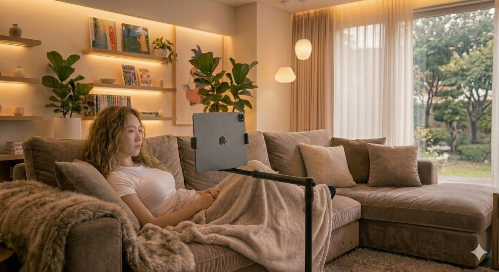

# 종이책부터 아이패드까지, 완벽한 만화 감상 환경 구축법 [만화인문학 ③]

이 글은 기획 연재 [만화인문학] 시리즈의 3부인 「종이책부터 아이패드까지, 완벽한 만화 감상 환경 구축법」이다. 1부의 문해력 회복, 2부의 인지 자극 제어를 현실로 옮기기 위한 최종 단계로, 최고의 만화 감상 환경은 비싼 기기를 갖추는 것이 아니다. 나에게 가장 편안한 자세와 가장 오래 집중할 수 있는 공간을 만드는 것이 훨씬 중요하다. 오늘날에는 종이책, 전자책, 태블릿, 대형 모니터, 만화카페 등 선택지가 매우 다양해졌다. 각각은 서로 다른 장점을 가지고 있으며, 어떤 환경이 가장 좋은지는 개인의 감상 방식에 따라 달라진다. 이번 글에서는 장비의 우열을 가리기보다 현대인이 가장 깊게 몰입할 수 있는 최적의 감상 환경이 무엇인지 살펴본다.

## 핵심 요약

1. **종이책**과 **전자책**은 서로 경쟁하는 것이 아니라 각자의 장점을 가진 감상 방식이다.
2. 현대의 **태블릿**과 **대형 모니터**는 장시간 감상에 유리한 환경을 만들 수 있다.
3. **만화카페**는 콘텐츠 소비 공간에서 공간 경험을 즐기는 문화 공간으로 성격이 변화하고 있다.
4. 영화관과 OTT의 관계처럼 만화 역시 집이 중요한 감상 공간으로 자리 잡고 있다.
5. 최고의 감상 환경은 특정 기기가 아니라 오래 몰입할 수 있는 공간이다.
6. 현대의 집은 생활 공간을 넘어 가장 중요한 **문화 아지트**가 되고 있다.

---

## 1. 좋은 작품만큼 중요한 것은 좋은 감상 환경이다

좋은 만화를 만났는데도 기대만큼 재미를 느끼지 못하는 경우가 있다. 작품의 문제가 아니라 **감상 환경**이 몰입을 방해했을 가능성도 적지 않다.

만화는 글과 그림을 동시에 읽는 매체다. 따라서 화면의 크기, 조명의 밝기, 앉은 자세, 주변 소음처럼 사소해 보이는 요소들이 감상 경험에 직접적인 영향을 준다.  
특히 장편 작품일수록 이런 차이는 더욱 커진다.

* **조명이 불편하면** 눈의 피로가 빨리 찾아온다.
* **자세가 불편하면** 집중력이 오래 유지되지 않는다.
* **화면이 작으면** 컷 구성과 세밀한 작화를 충분히 감상하기 어렵다.
* **주변이 시끄러우면** 작품의 흐름이 자주 끊긴다.

결국 좋은 감상 환경은 단순히 편안한 공간을 의미하지 않는다. 작품이 가진 연출과 감정을 온전히 받아들이기 위한 중요한 조건이라고 할 수 있다.

## 2. 종이책과 전자책은 서로 다른 매력을 가진다

종이책과 전자책을 어느 한쪽이 더 우수하다고 단정하기는 어렵다. 두 방식은 서로 다른 만족을 제공하기 때문이다.  
**종이책**의 가장 큰 장점은 물성이다.  
책장을 넘기는 감각, 종이의 질감, 서가에 좋아하는 작품을 채워 가는 즐거움은 디지털 환경으로 완전히 대체하기 어렵다. 작품을 소장하는 행위 자체가 취미의 일부가 되기도 한다.  
반면 **전자책**은 현대적인 생활 방식과 잘 어울린다.

* **많은 작품을 하나의 기기**에 담을 수 있다.
* 언제든 이어서 감상할 수 있다.
* 보관 공간이 거의 필요 없다.
* 원하는 작품을 빠르게 찾을 수 있다.
* 이동 중에도 편하게 감상할 수 있다.

특히 **미니멀리즘**을 추구하는 사람이라면 전자책은 매우 효율적인 선택이 될 수 있다. 물리적인 공간을 크게 차지하지 않으면서도 자신만의 라이브러리를 구축할 수 있기 때문이다.  
그래서 오늘날에는 둘 가운데 하나만 선택하기보다, 좋아하는 작품은 종이책으로 소장하고 평소에는 전자책으로 감상하는 방식도 자연스러운 문화로 자리 잡고 있다.

## 3. 큰 화면이 만드는 몰입의 차이

전자책의 진짜 장점은 종이책을 대신하는 것이 아니라 **감상 환경을 자유롭게 구성할 수 있다는 점**이다.  
최근에는 태블릿과 대형 모니터의 성능이 크게 향상되면서 집에서도 매우 뛰어난 만화 감상 환경을 만들 수 있게 되었다.

중요한 것은 특정 브랜드나 제품이 아니다.  
오랫동안 작품에 집중할 수 있는 환경을 만드는 요소들이다.

* **넉넉한 화면 크기**
* **선명한 해상도**
* **편안한 자세**
* **적절한 조명**
* **눈의 피로를 줄이는 거리와 각도**

화면이 충분히 크면 만화의 연출 방식도 더욱 자연스럽게 전달된다.  
작은 컷 속에 담긴 인물의 표정이나 배경의 디테일, 칸과 칸 사이의 흐름까지 한눈에 들어오기 때문이다.

장편 만화를 연속으로 감상할수록 이러한 차이는 더욱 크게 느껴진다.  
또한 감상 자세 역시 중요한 요소다. 태블릿을 거치대에 올려두거나 자신에게 맞는 위치에 화면을 배치하면 손으로 계속 책을 들고 있을 필요가 없다.

덕분에 목과 어깨, 손목의 부담이 줄어들고, 작품 자체에 더 오래 집중할 수 있다. 대형 모니터 역시 장점이 분명하다.

책상 앞에서 안정적인 자세를 유지하기 쉽고, 넓은 화면은 한 페이지 전체의 구성을 감상하기에도 유리하다. 세밀한 작화가 강점인 작품일수록 큰 화면이 주는 만족감은 더욱 커진다.

결국 현대적인 만화 감상 환경은 특정 기기를 의미하지 않는다.

**큰 화면**, **편안한 자세**, **조용한 공간**, **적절한 조명**이 함께 갖춰질 때 가장 높은 수준의 몰입이 만들어진다.

## 4. 만화카페의 역할은 시대와 함께 달라졌다

한때 만화카페는 가장 이상적인 만화 감상 공간이었다.  다양한 작품을 자유롭게 읽을 수 있었고, 집에서는 구하기 어려운 작품도 쉽게 접할 수 있었기 때문이다.  하지만 디지털 환경이 발전한 지금은 상황이 많이 달라졌다.

전자책 서비스가 보편화되고 집에서도 좋은 디스플레이를 사용할 수 있게 되면서, 순수하게 작품을 감상하는 환경만 놓고 보면 집이 더 편안한 경우도 적지 않다. 집에서는 다음과 같은 장점을 직접 만들 수 있다.

* **원하는 조명**을 사용할 수 있다.
* **가장 편한 자세**를 유지할 수 있다.
* **주변 소음**을 최소화할 수 있다.
* 필요하면 언제든 쉬었다가 다시 감상할 수 있다.
* 시간에 쫓기지 않고 자신의 속도로 작품을 즐길 수 있다.

이러한 이유로 작품에 깊게 몰입하는 것이 목적이라면 집을 선호하는 사람도 점점 늘어나고 있다.  

그렇다고 **만화카페**의 가치가 사라진 것은 아니다. 오히려 지금의 만화카페는 과거와는 다른 의미를 갖게 되었다.  
많은 사람에게 만화카페는 이제 단순히 만화를 읽는 장소가 아니라,

* 잠시 일상에서 벗어나는 **외출**
* **아늑한 공간**에서 보내는 **휴식**
* **간단한 식사**와 함께 즐기는 **여유**
* 어릴 적 **만화방의 추억**을 떠올리는 **향수**
* **혼자만의 시간**을 보내는 작은 **문화 이벤트**

를 함께 경험하는 공간이 되었다.

즉, 오늘날의 만화카페는 콘텐츠 자체보다 **공간이 주는 경험**의 가치가 점점 더 커지고 있다고 볼 수 있다.

## 5. 영화관과 OTT의 변화는 만화에도 그대로 나타났다.

이러한 변화를 이해하려면 먼저 영화 산업을 떠올려 보면 쉽다.  
과거에는 영화를 보기 위해 극장을 찾는 것이 당연했다. 큰 화면과 뛰어난 음향은 집에서 경험하기 어려웠고, 최신 영화를 가장 먼저 볼 수 있는 장소도 극장뿐이었다.

하지만 지금은 상황이 크게 달라졌다. 대형 TV와 고해상도 모니터, 홈시어터, 스트리밍 서비스가 빠르게 발전하면서 집에서도 상당히 높은 수준의 감상 환경을 구축할 수 있게 되었다.

특히 집은 **감상의 주도권**을 모두 시청자가 가진다는 점이 가장 큰 차이다.

* 원하는 **시간**에 시작할 수 있다.
* 언제든 **일시정지**할 수 있다.
* **놓친** 장면을 다시 볼 수 있다.
* 주변 사람의 **방해**를 받지 않는다.
* **비용** 부담도 상대적으로 적다.

순수하게 콘텐츠를 감상하는 환경만 놓고 보면 집의 경쟁력은 과거보다 훨씬 높아졌다. 그렇다면 영화관의 역할은 사라졌을까. 그렇지는 않다.

오늘날 영화관은 단순히 영화를 보는 장소가 아니라 **특별한 경험을 소비하는 공간**으로 성격이 바뀌고 있다. 영화관만이 제공할 수 있는 요소도 여전히 존재한다.

* **거대한 스크린**이 주는 압도감
* **공간 전체를 채우는 음향**
* **개봉작**을 가장 먼저 보는 **경험**
* **데이트와 나들이** 같은 **외출**의 의미
* 다른 관객과 함께 작품을 체험하는 **현장감**

즉, 콘텐츠 자체보다 공간과 경험의 가치가 더욱 중요해진 것이다.  

만화 역시 같은 방향으로 변화하고 있다.  
과거에는 만화방이 **최고의 감상 공간**이었다면 지금은 많은 사람이 **집**에서 자신만의 감상 환경을 구축한다.

반대로 만화카페는 작품 자체보다 공간의 분위기와 외출의 즐거움을 경험하는 장소로 조금씩 변화하고 있다. 결국 영화관과 OTT가 서로를 완전히 대체하지 않았듯, 집과 만화카페도 경쟁 관계라기보다 서로 다른 역할을 담당하는 관계에 가깝다.

## 6. 집은 현대인의 가장 중요한 문화 아지트가 되었다.

현대인의 집은 더 이상 단순히 잠을 자는 공간이 아니다. 예전에는 문화생활을 즐기기 위해 각각 다른 장소를 찾아가야 했다.

* **영화**는 극장
* **만화**는 만화방
* **음악**은 음반 매장
* **게임**은 오락실
* **독서**는 서점이나 도서관

문화 콘텐츠마다 별도의 공간이 존재했다. 하지만 디지털 기술이 발전하면서 대부분의 문화생활이 하나의 공간 안으로 들어왔다. 오늘날 집에서는 거의 모든 문화 활동이 가능하다.

* **영화와 드라마**를 감상한다.
* **만화와 웹툰**을 읽는다.
* **전자책**으로 독서를 한다.
* **음악**을 감상한다.
* **게임**을 즐긴다.
* 필요하면 **온라인으로 사람들과 연결**된다.

집은 생활 공간을 넘어 개인만의 **문화 아지트**가 되었다. 이 변화는 단순히 기술이 발전했기 때문만은 아니다. **미니멀리즘**, **에센셜리즘**, **다운시프팅**이라는 현대적인 삶의 방식과도 자연스럽게 연결된다.

미니멀리즘은 불필요한 **소비와 이동**을 줄여 삶의 여백을 만드는 철학이다.  
에센셜리즘은 정말 **중요한 것**에만 집중하는 태도다.  
다운시프팅은 끝없는 효율 경쟁에서 잠시 **속도를 늦추는 삶**의 방식이다.  

집이라는 문화 공간은 이 세 가지를 동시에 실천하기 가장 좋은 장소가 될 수 있다.  
불필요한 이동은 줄이고, 좋아하는 작품에는 더 오래 집중하며, 자신만의 속도로 문화를 즐길 수 있기 때문이다.

특히 만화는 이러한 변화와 잘 어울리는 콘텐츠다. 큰 공간도 필요하지 않고, 비싼 장비도 반드시 필요한 것은 아니며, 조용한 환경만 갖춰져도 깊은 몰입이 가능하다.

좋은 감상 환경은 더 많은 작품을 소비하게 만들지 않는다. 오히려 한 작품을 더 오래 읽고, 더 깊이 이해하며, 더 오래 기억하게 만든다. 
이것이 현대 사회에서 만화가 대표적인 **미니멀리즘 취미** 가운데 하나로 평가받는 이유이기도 하다.

## 마치며

만화를 가장 잘 즐기는 방법에는 정답이 없다.

종이책과 전자책도, 태블릿과 대형 모니터도, 각각 다른 장점을 가지고 있다. 다만 기술의 발전으로 인해 **감상의 중심이 집으로 이동하고 있다는 흐름**은 분명해지고 있다.

과거에는 만화방이 최고의 감상 공간이었다면, 오늘날에는 많은 사람이 자신만의 문화 환경을 집 안에서 구축하고 있다. 이는 단순히 편리하기 때문만은 아니다. 자신에게 가장 편안한 자세와 조명, 가장 조용한 환경, 가장 오래 몰입할 수 있는 공간을 직접 만들 수 있기 때문이다.

반대로 만화카페는 콘텐츠를 소비하는 공간에서, 분위기와 여유를 경험하는 문화 공간으로 조금씩 역할이 변화하고 있다. 이는 영화관과 OTT가 공존하는 모습과도 매우 닮아 있다.

결국 중요한 것은 어떤 기기를 사용하는지가 아니다.

**오랫동안 편안하게 몰입할 수 있는 환경**을 만드는 것이 가장 중요하다.

그리고 그 환경은 사람마다 조금씩 다를 수 있다. 누군가에게는 종이책이, 누군가에게는 전자책이, 누군가에게는 조용한 서재가, 또 다른 누군가에게는 만화카페가 최고의 공간일 수도 있다.

기술은 감상 환경을 크게 바꾸었지만, 좋은 작품을 오래 기억하게 만드는 힘은 여전히 **몰입**에서 나온다. 그런 의미에서 현대의 집은 단순한 생활 공간을 넘어, 자신만의 속도로 문화를 즐기고, 불필요한 소음을 줄이며,

가장 본질적인 즐거움에 집중할 수 있는 **개인 문화 아지트**가 되어 가고 있다.

---
## FAQ
---

### 종이책은 이제 전자책보다 가치가 없는 걸까?

그렇지 않다.

**종이책**과 **전자책**은 서로를 대체하는 관계가 아니라 서로 다른 경험을 제공한다. 종이책은 종이의 질감과 책장을 넘기는 감각, 소장하는 즐거움이라는 물성을 제공한다.

반면 전자책은 뛰어난 접근성과 보관 효율, 휴대성이라는 장점을 가진다. 좋아하는 작품은 종이책으로 소장하고, 평소에는 전자책으로 감상하는 방식도 충분히 합리적인 선택이다.

### 태블릿과 대형 모니터 가운데 어느 쪽이 더 좋을까?

사용 환경에 따라 달라진다.

* **태블릿**은 침대나 소파 등 다양한 장소에서 편안하게 감상하기 좋다.
* **대형 모니터**는 책상에서 안정적인 자세로 장시간 집중하기에 유리하다.

어느 한쪽이 절대적으로 우수하다기보다 자신의 생활 방식에 맞는 환경을 선택하는 것이 중요하다.

---

### 만화카페는 앞으로 사라질까?

가능성은 높지 않다. 과거에는 만화를 읽기 위한 공간이었다면, 앞으로는 **공간 경험**을 소비하는 문화 공간으로 더욱 발전할 가능성이 크다.  
아늑한 분위기, 간단한 식사, 혼자 쉬는 시간, 외출 자체가 주는 만족감은 집에서 완전히 대체하기 어렵기 때문이다.

---

### 집에서만 문화생활을 해도 충분할까?

효율만 생각하면 가능하다.  
하지만 인간은 콘텐츠만 소비하는 존재가 아니다. 가끔은 산책을 하고, 서점을 둘러보고, 만화카페를 찾거나, 익숙한 공간을 벗어나는 경험도 삶의 균형을 유지하는 데 중요한 역할을 한다.

---

### 왜 만화는 현대적인 미니멀리즘 취미라고 할 수 있을까?

만화는 비교적 적은 비용과 작은 공간만으로도 깊은 만족을 얻을 수 있는 문화다.  
여기에 **에센셜리즘**의 관점에서 정말 좋아하는 작품만 선택하고, **다운시프팅**의 관점에서 천천히 몰입하는 시간을 만든다면, 소비를 늘리지 않고도 삶의 만족도를 높일 수 있다.  
그래서 만화는 단순한 오락을 넘어, 정보 과부하가 일상이 된 현대 사회에서 **자신만의 속도를 회복할 수 있는 현실적인 문화 활동** 가운데 하나라고 볼 수 있다.

---

### [연재 기획] 만화인문학 시리즈
*지속적 집중력을 회복하고 삶의 속도를 늦추는 만화 독서 이야기입니다.*

* **1부:** [팝콘브레인 시대, 현대인이 만화를 읽어야 하는 이유 \[만화인문학 ①\]](https://soometro.kr/docs/manga/series01/series01/)
* **2부:** [미니멀리즘 취미 추천, 삶의 속도를 늦추는 만화 독서 \[만화인문학 ②\]](https://soometro.kr/docs/manga/series01/series02/)
* **3부:** [종이책부터 아이패드까지, 완벽한 만화 감상 환경 구축법 \[만화인문학 ③\]](https://soometro.kr/docs/manga/series01/series03/)

---