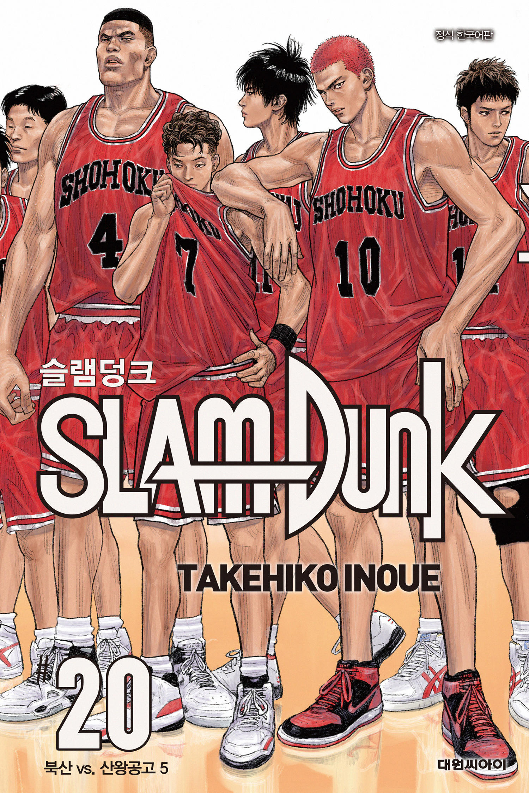
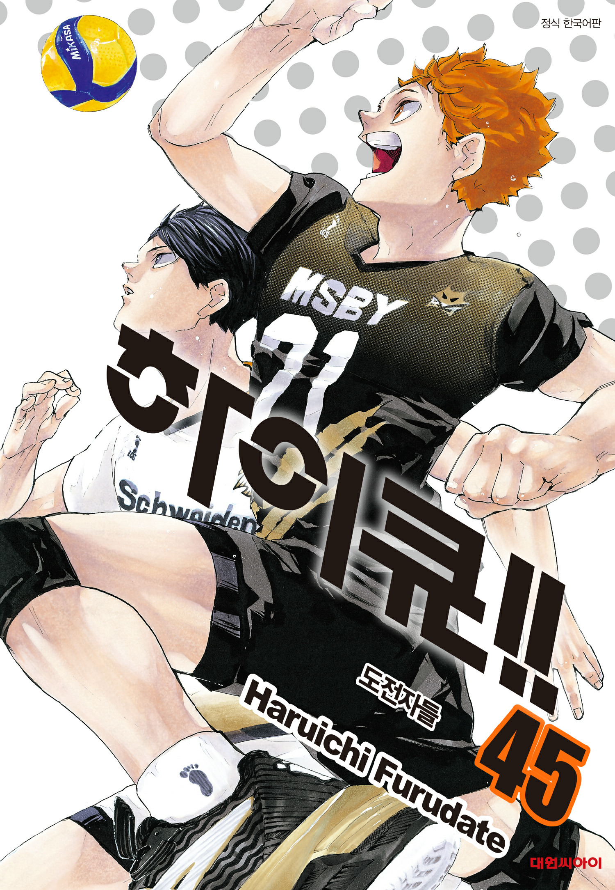
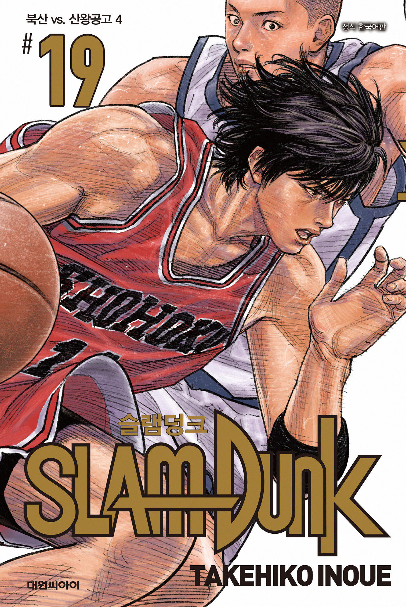
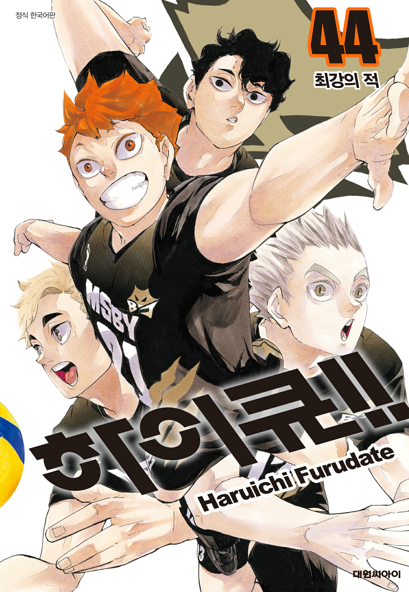
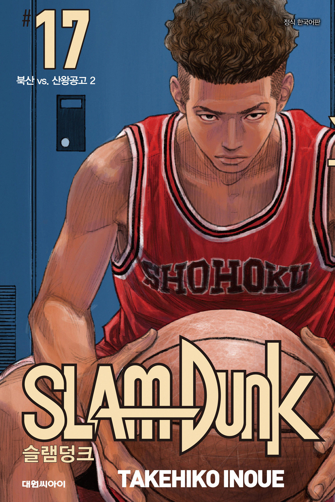
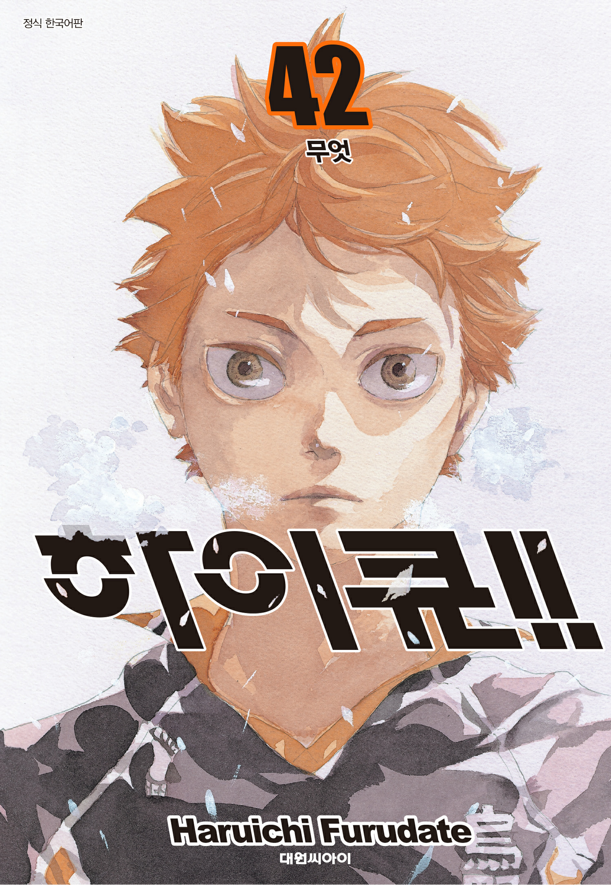

# 슬램덩크와 하이큐는 어떻게 다르게 성장하는가

슬램덩크가 개인의 투지와 폭발적인 재능에 집중한다면, 하이큐는 동료와의 연결과 팀 전술을 통해 성장하는 과정을 보여준다. 두 주인공은 엘리트 코스를 밟지 않은 초보자로 시작했다는 공통점이 있다. 강백호는 압도적인 신체 능력과 승부욕으로 자신의 가능성을 드러내고, 히나타 쇼요는 부족한 점을 인정한 뒤 동료와 전술을 활용하는 법을 배워간다. 두 작품의 재미는 농구와 배구의 차이보다 ‘성장’을 바라보는 방식이 서로 다르다는 데서 나온다.

## 핵심 요약

* **강백호와 히나타 쇼요**는 초보자로 출발하지만 성장하는 방향은 다르다. 강백호가 타고난 신체 능력과 승부욕을 앞세운다면, 히나타는 동료와 전술을 활용해 자신의 약점을 하나씩 극복한다.
* 슬램덩크에서는 **개인의 욕망과 극적인 승부**가 강하게 부각된다. 반면 하이큐에서는 선수들 사이의 호흡과 전술이 경기의 흐름을 바꾸는 중요한 요소로 등장한다.
* 서태웅과 카게야마 토비오는 모두 뛰어난 재능을 지녔지만, 개인 기량만으로는 팀 스포츠의 정점에 오를 수 없다는 사실을 깨닫고 달라진다.
* 주인공만 이야기를 이끌어가는 것은 아니다. 평범한 선수와 상대 팀의 사정까지 함께 보여주기 때문에, 경기가 끝난 뒤에도 여러 인물이 오래 기억에 남는다.
* 패배를 다루는 방식에도 차이가 있다. 슬램덩크의 패배가 청춘의 한 장면을 강렬하게 남긴다면, 하이큐의 패배는 다음 성장을 준비하는 계기로 이어진다.
* 두 작품은 개인과 팀의 관계를 서로 다른 방식으로 그려내며 스포츠 만화가 다룰 수 있는 이야기의 폭을 넓혔다.

## 강백호와 히나타, 서로 다른 출발점

두 사람은 모두 제대로 된 교육을 받은 엘리트 선수가 아니었다. 강백호는 농구 규칙조차 익숙하지 않았고, 히나타도 정식 배구부에서 체계적으로 배운 경험이 거의 없었다. 강백호는 농구의 기본 규칙도 제대로 모르는 상태에서 코트에 들어섰고, 히나타 역시 정식 배구부 활동을 충분히 경험하지 못한 채 자기만의 방식으로 운동 능력을 키웠다. 두 사람에게 먼저 있었던 것은 체계적인 훈련보다 본능적인 신체 감각이었다.

비슷한 출발점에서 시작했지만 성장 방향은 달랐다. 강백호의 가장 큰 무기는 압도적인 신체 조건과 운동 신경이다. 부족한 기술은 반복 훈련으로 채워가지만, 결정적인 순간마다 그의 점프력과 반사적인 움직임이 중요한 역할을 한다. 반대로 히나타에게는 키가 작다는 분명한 약점이 있다. 그래서 카게야마와의 속공을 익히고, 팀 전술과 동료들의 움직임을 이해하면서 **자신에게 부족한 요소를 주변과 연결해 보완하는 방식**으로 성장한다.

농구와 배구를 시작한 이유도 서로 다르다. 강백호의 농구 입문에는 이성에게 잘 보이고 싶다는 단순한 욕망이 자리하고 있다. 히나타에게는 작은 거인에 대한 동경과 배구 자체에 대한 열망이 더 크게 작용한다. 출발점은 달랐지만, 두 사람은 경기를 거듭하면서 점점 승리와 실력 향상 자체를 목표로 삼게 된다.

## 개인의 투지와 팀의 연결

슬램덩크에서 인물을 움직이는 가장 강한 힘은 **자신을 증명하려는 욕망**이다. 강백호의 승부욕, 서태웅의 경쟁심, 정대만의 과거를 되찾으려는 집념은 서로 다른 모습으로 나타나지만, 모두 각자의 이유를 품고 코트에 서게 만든다. 특히 강백호는 처음부터 팀을 위해 농구를 시작한 인물이 아니다. 자신이 얼마나 대단한 사람인지 보여주고 싶어 했던 마음이 경기를 거치면서 팀을 위한 플레이로 바뀌어간다.

하이큐에서 성장을 이끄는 힘은 조금 다르다. **연결과 상호작용**이 이야기의 중요한 자리를 차지한다. 히나타와 카게야마의 속공은 한 사람의 능력만으로 완성되지 않는다. 상대 블로커의 위치를 읽고, 세터와 공격수가 타이밍을 맞추며, 리시버와 수비수도 각자의 위치에서 움직여야 한 번의 플레이가 성립한다. 히나타의 성장은 혼자 강해지는 과정이라기보다, 함께 플레이할 수 있는 사람과 방법을 넓혀가는 과정에 가깝다.

두 작품은 라이벌을 다루는 방식에서도 차이를 보인다. 슬램덩크에서는 강한 상대를 꺾는 일이 자신의 한계를 확인하는 계기가 되는 경우가 많다. 하이큐에서는 상대의 기술과 전술을 관찰하고, 그것을 자신의 성장으로 연결하는 과정이 더욱 자세하게 그려진다. 상대는 넘어야 할 벽이면서 동시에 다음 단계로 나아가는 방법을 알려주는 존재이기도 하다.

## 서태웅과 카게야마가 팀 플레이를 배운 이유

서태웅과 카게야마 토비오는 서로 다른 종목의 선수지만 비슷한 출발점을 갖고 있다. 두 사람 모두 또래보다 뛰어난 실력을 지녔고, 자신의 판단과 능력을 믿으며 플레이한다. 하지만 개인 기량이 뛰어나다고 해서 팀 전체가 강해지는 것은 아니다. **혼자 잘하는 것과 팀을 강하게 만드는 것은 서로 다른 문제**다.

서태웅은 개인 기량이 뛰어난 선수지만 처음부터 동료와의 조화를 중요하게 생각하지는 않는다. 그러나 더 강한 상대와 맞붙으면서 자신의 능력만으로는 도달하기 어려운 영역이 있다는 사실을 알게 된다. 동료와 함께 움직이기 시작했을 때 그의 재능은 오히려 더 큰 힘을 발휘한다.

카게야마 역시 중학 시절 ‘코트 위의 제왕’이라는 별명을 얻을 만큼 뛰어난 세터였다. 하지만 공격수를 자신의 뜻대로 움직이려는 태도 때문에 동료들과 멀어졌다. 카라스노에서 히나타를 만난 뒤 상황이 달라진다. 히나타의 능력을 살리려면 자신의 토스를 일방적으로 강요할 것이 아니라, **상대와 함께 가장 좋은 플레이를 만들어야 한다**는 사실을 배운다.

두 사람의 변화에는 조금 다른 결이 있다. 서태웅은 더 강한 상대와 경쟁하기 위해 팀의 가치를 받아들이고, 카게야마는 자신의 플레이를 완성하기 위해 파트너의 존재를 인정한다. 출발점은 달라도 두 사람이 도착한 곳은 비슷하다. 뛰어난 선수도 팀 안에서 자신의 역할을 찾을 때 재능을 제대로 발휘할 수 있다는 점이다.

## 농구 코트와 배구 코트가 만드는 긴장감

농구와 배구는 경기 구조가 다르다. 자연스럽게 두 작품의 공간 연출도 서로 다른 방식으로 나타난다. **농구에서는 끊임없이 이어지는 움직임**이 중요하다. 선수들은 공격과 수비를 오가며 넓은 코트를 움직이고, 한 명의 돌파가 순식간에 경기의 흐름을 바꿀 수 있다.

배구 코트에는 네트와 포지션이라는 분명한 경계가 있다. 한 번의 공격이 끝나면 다시 수비와 공격을 준비해야 하고, 공을 바닥에 떨어뜨리지 않기 위해 여러 선수가 짧은 시간 안에 연속해서 움직인다. 히나타가 코트 곳곳을 오가는 모습도 이런 배구의 구조 안에서 의미를 갖는다. **배구의 긴장감은 제한된 공간에서 여러 선수가 정확하게 움직이는 호흡**에서 나온다.

이런 차이는 만화의 컷 구성에도 영향을 준다. 슬램덩크는 근육의 움직임과 표정, 땀, 거친 호흡처럼 한순간에 발생하는 물리적인 충격을 강하게 포착한다. 하이큐는 공의 궤적과 선수의 시선, 블로킹과 공격이 맞물리는 순간을 나누어 보여주면서 경기의 속도를 전달한다. 같은 스포츠 만화라도 각 종목의 움직임에 맞춰 경기 장면을 표현하는 방식이 달라지는 것이다.

## 슬램덩크의 미완의 청춘과 하이큐의 다음 경기

두 작품에서 패배가 남기는 감정은 꽤 다르다. 슬램덩크의 산왕전은 작품 전체에서 가장 뜨거운 승부 가운데 하나지만, 그 승리가 전국대회 우승으로 이어지지는 않는다. 오히려 극적인 승리 뒤에 예상하지 못한 탈락이 이어지면서 **청춘의 한 장면이 완전히 끝나지 않은 듯한 감정**을 남긴다.

하이큐에서 패배는 좀 더 긴 성장의 과정 속에 놓인다. 한 경기에서 진 선수들은 그 경기에서 얻은 경험과 기술을 다음 경기로 가져간다. 카라스노뿐 아니라 상대 팀 선수들도 패배를 통해 자신의 부족한 점을 확인하고 달라진다. 경기가 끝났다고 해서 그 선수의 이야기도 끝나는 것은 아니다.

이런 차이 때문에 두 작품이 남기는 정서도 다르다. 슬램덩크의 감동에는 다시 돌아오지 않을 순간에 대한 아쉬움이 강하게 남는다. 반면 하이큐의 감동에는 **패배한 뒤에도 계속 이어지는 선수들의 시간**이 담겨 있다. 슬램덩크가 청춘의 절정에 강렬한 장면을 남긴다면, 하이큐는 그 순간이 지나간 뒤에도 삶과 스포츠가 계속된다는 사실을 보여준다.

## 상대 팀 선수들도 자신의 이야기를 갖고 있다

두 작품에서 오래 기억에 남는 인물은 주인공 팀에만 있지 않다. **조연에게도 각자의 목표와 부족한 점을 부여한다.** 슬램덩크에는 풍전의 남훈이나 해남의 신준섭처럼 주인공 팀의 승리를 위한 소모품으로만 소비되지 않는 선수들이 등장한다. 하이큐 역시 조젠지나 와쿠타니미나미 같은 상대 팀에 각자의 팀 색깔과 목표를 부여한다.

이런 방식 덕분에 스포츠 만화는 단순한 승패 이야기를 넘어선다. 독자는 어느 순간부터 카라스노가 반드시 이겨야 한다는 생각만 하지 않는다. 상대 팀의 마지막 경기를 보며 아쉬움을 느끼기도 한다. 한 경기 안에 여러 선수의 사정이 겹쳐지기 때문에, 상대 팀의 선수도 그 경기만큼은 자신의 이야기 속 주인공처럼 보인다.

평범한 선수들의 존재도 중요하다. 다나카, 스가와라, 야마구치처럼 절대적인 천재와는 거리가 있는 인물들은 각자의 방식으로 팀에서 필요한 역할을 찾아간다. 이들의 이야기는 팀의 완성도가 에이스 한 명만으로 결정되지 않는다는 점을 보여준다. 뛰어난 공격수뿐 아니라 리시브와 수비를 맡는 선수, 분위기를 바꾸는 선수, 벤치에서 동료를 지켜보는 선수까지 있어야 팀이 완성된다.

## 선수의 실력은 코트 밖에서도 만들어진다

스포츠 만화에서 훈련 장면은 단순히 능력치를 높이는 장면이 아니다. **한 인물이 얼마나 긴 시간을 견뎌왔는지 보여주는 장면**이기도 하다. 권준호가 강도 높은 훈련을 견디며 팀에 남는 과정, 니시노야와 다나카가 자신에게 필요한 역할을 다듬어가는 과정은 경기에서 드러나는 실력만큼이나 중요하다.

일탈과 징계는 선수의 미숙함과 변화를 드러낸다. 정대만이나 니시노야가 팀에서 이탈하거나 활동 정지를 겪는 사건은 단순히 이야기를 자극적으로 만들기 위한 장치가 아니다. 아무리 실력이 뛰어나도 팀의 규칙과 동료와의 관계를 무시하면 자신의 능력을 제대로 발휘할 수 없다는 점을 보여준다.

결국 **재능과 노력만으로 좋은 선수가 되는 것은 아니다.** 자신의 감정을 조절하고 동료와 관계를 맺으며, 팀의 규칙 안에서 자신의 역할을 수행해야 한다. 두 작품에서 인물들이 코트 밖의 문제를 해결하는 장면도 선수로 성장하는 과정의 일부라고 볼 수 있다.

## 코트 밖에서 팀을 지탱하는 사람들

북산과 카라스노를 움직이는 사람은 선수만이 아니다. **매니저와 조력자는 경기장 밖에서 팀이 흔들리지 않도록 붙잡아준다.** 시미즈 키요코를 비롯한 매니저들은 직접 경기에 출전하지 않지만, 선수들이 경기에 집중할 수 있도록 팀의 일상과 분위기를 챙긴다.

권준호도 비슷한 역할을 한다. 채치수가 강한 리더십과 승부욕을 담당한다면, 권준호는 팀의 화합과 인간적인 균형을 보완한다. 이런 인물이 있기 때문에 팀은 단순히 실력 좋은 선수들을 모아놓은 집단이 아니라 함께 생활하는 공동체처럼 보인다.

평소 말이 많지 않은 인물이 건넨 짧은 한마디가 선수에게 큰 힘이 되는 장면도 있다. 그런 순간은 팀을 움직이는 힘이 꼭 큰 목소리에서만 나오는 것은 아니라는 점을 보여준다. 스포츠의 결과는 기록으로 남지만, 선수가 경기에 나서기까지 받았던 마음의 지지는 기록에 남지 않는다. 두 작품은 바로 그런 보이지 않는 역할까지 이야기 안에 담아낸다.

## 강팀도 혼자서는 완성되지 않는다

두 작품에는 강한 팀을 상대하는 과정에서 전력의 균형이 흔들리는 장면이 등장한다. **뛰어난 선수들이 모였다고 해서 팀 운영까지 저절로 잘되는 것은 아니다.** 선수 개인의 능력과 팀 전체를 움직이는 힘은 반드시 같은 방향으로 움직이지 않는다.

슬램덩크의 상양은 뛰어난 선수들을 보유한 팀이지만, 김수겸이 선수와 사실상 사령탑의 역할까지 맡고 있다. 코트에서 직접 경기를 뛰면서 동시에 팀 전체를 관리해야 하는 구조다. 객관적인 시선으로 경기를 조정할 외부 감독이 없는 상황에서는 개인 기량만으로 팀의 잠재력을 완전히 끌어내기 어렵다.

하이큐의 시라토리자와 역시 우시지마 와카토시라는 압도적인 에이스를 보유한 강팀이다. 그러나 카라스노는 조직적인 플레이와 선수들의 성장을 앞세워 시라토리자와에 맞선다. 이 대결은 아무리 강한 에이스가 있어도 개인의 능력만으로 승부를 결정할 수 없다는 점을 보여준다. 강팀과 약팀의 차이는 선수 개개인의 능력치만으로 설명하기 어렵다. 역할 분담과 전술, 선수들 사이의 신뢰와 호흡까지 함께 살펴봐야 한다.

## 주인공 앞에 놓인 또 다른 강함

윤대협과 오이카와 토오루는 주인공 팀이 넘어야 할 벽이라는 공통점을 가진다. 두 사람은 단순히 공격력이 뛰어난 에이스가 아니다. **주변 선수의 장점까지 끌어내는 플레이메이커**라는 점에서 주인공들과는 다른 형태의 강함을 보여준다.

윤대협은 뛰어난 재능과 여유를 가진 인물로 그려진다. 그는 자신의 능력을 팀 전체의 경기력으로 연결할 줄 안다. 오이카와는 카게야마라는 천재를 의식하면서도 자신의 노력과 감각으로 정상에 도전한다. 같은 플레이메이커라는 공통점이 있지만, 두 사람이 강해지는 과정은 서로 다르게 그려진다.

이들의 이야기를 보면 타고난 재능만으로 정상에 오를 수 있다는 생각은 흔들린다. **가진 재능을 어떻게 다듬고 누구와 함께 사용하느냐가 강함을 결정한다.** 특히 하이큐에서 오이카와가 보여주는 열등감과 노력은 이 메시지를 더욱 현실적인 감정으로 전달한다.

## 슬램덩크와 하이큐가 태어난 시대의 차이

슬램덩크와 하이큐가 연재된 시기 사이에는 20년이 넘는 간격이 있다. **그 사이 스포츠를 접하고 소비하는 환경도 크게 달라졌다.** 슬램덩크가 대중적인 농구 붐과 함께 성장했다면, 하이큐가 등장한 시대에는 인터넷과 스트리밍을 비롯한 다양한 콘텐츠 소비 방식이 이미 자리 잡고 있었다.

슬램덩크가 인기를 얻던 시기에는 농구대잔치와 드라마 <마지막 승부>, 프로농구 출범이 이어지면서 농구에 대한 관심이 크게 높아졌다. 슬램덩크는 이런 흐름과 맞물려 농구를 대중문화의 한가운데로 끌어올리는 역할을 했다.

하이큐는 상대적으로 배구에 대한 대중적 관심이 제한된 환경에서 출발했다. 하지만 작품은 배구의 포지션과 기술, 전술을 어렵지 않게 이야기 속에 녹여냈다. 종목의 인기가 작품의 성공을 이끄는 경우도 있지만, 작품이 오히려 종목에 대한 관심을 끌어올리는 경우도 있다. 하이큐는 그 반대 방향의 영향력을 보여준 작품이라고 할 수 있다.

## 서로 다른 세대가 두 작품을 기억하는 방식

두 작품을 접하는 환경은 예전과 많이 달라졌다. 과거에는 만화책과 비디오 대여점, TV 애니메이션이 중요한 통로였지만, 지금은 스트리밍과 글로벌 플랫폼을 통해 작품을 훨씬 쉽게 만날 수 있다. 그래도 두 작품이 오래 기억되는 이유는 크게 달라지지 않았다. 작품을 보며 다른 사람과 감정을 나누고, 자신의 경험을 떠올리게 한다는 점이다.

슬램덩크는 한국에서 캐릭터 이름을 현지화하면서 독자에게 친숙한 언어적 기억을 남겼다. 강백호, 서태웅, 정대만, 채치수 같은 이름은 원작의 일본식 이름과는 다른 방식으로 한국 독자에게 각인됐다. 반면 하이큐는 일본식 이름을 그대로 사용하면서 원작에 가까운 문화적 감각을 전달한다.

이 차이는 단순한 번역상의 선택으로만 볼 수 없다. **어떤 이름으로 캐릭터를 기억하느냐는 작품을 처음 만난 시대와도 연결된다.** 누군가에게 슬램덩크는 학창 시절의 만화책과 비디오를 떠올리게 하고, 다른 누군가에게 하이큐는 스트리밍으로 처음 만난 스포츠 만화를 떠올리게 한다. 그래서 슬램덩크는 특정 세대의 학창 시절과 함께 기억되고, 하이큐는 또 다른 세대가 스포츠 만화를 접한 경험과 결합한다.

## 경기장 밖으로 이어지는 하이큐의 경험

하이큐를 좋아하는 방식은 경기 장면을 보는 데서 끝나지 않는다. **음악과 다른 서브컬처로 이어지는 경험**도 작품을 즐기는 방법의 일부가 된다. 특히 SPYAIR의 곡처럼 작품과 강하게 연결된 음악은 경기에서 느낀 감정을 다른 매체의 경험으로 이어준다.

이런 경험은 하나의 작품을 보고 끝내는 방식과는 다르다. 애니메이션을 본 뒤 주제가를 찾아 듣고, 가수의 다른 음악을 듣거나 관련 작품을 찾아보면서 관심의 범위가 넓어진다. 하나의 작품을 계기로 음악과 성우, 다른 콘텐츠까지 자연스럽게 찾아보게 되는 것이다.

팬들 사이의 공유도 이런 확장에 힘을 보탠다. 경기 장면과 캐릭터, 음악, 명대사 같은 요소가 팬들 사이에서 공유되면서 작품은 개인의 감상을 넘어선다. 팬들이 서로의 감상을 나누는 과정에서 작품을 경험하는 방식도 더욱 다양해진다.

## 코트를 벗어나도 남는 이야기

슬램덩크와 하이큐를 오래 기억하게 만드는 것은 농구와 배구만이 아니다. 두 작품의 중심에는 사람이 다른 사람과 부딪히고 영향을 주고받으며 성장한다는 이야기가 있다. 주인공은 혼자 힘만으로 강해지지 않는다. 라이벌과 경쟁하고, 동료와 충돌하며, 패배한 상대에게서 배우는 과정에서 자신의 한계를 다시 바라보게 된다.

두 작품이 오랫동안 사랑받은 이유도 여기에 있다. 독자는 경기 결과만 따라가는 것이 아니라, 자신이 겪었던 경쟁과 실패, 동료와의 관계, 노력의 시간을 캐릭터에게 겹쳐본다. 어릴 때는 단순히 재미있는 스포츠 만화였던 작품이 시간이 지나면 자신의 성장 과정을 돌아보게 하는 이야기로 다가오는 이유다.

슬램덩크는 개인의 폭발적인 성장과 청춘의 절정을 강렬하게 포착한다. 하이큐는 자신의 약점을 인정하고 다른 사람과 연결되면서 계속 성장하는 과정을 길게 보여준다. 표현 방식은 달라도 두 작품이 말하는 핵심은 비슷하다. **혼자 완성되는 선수는 없다. 사람은 다른 사람과 관계를 맺고 부딪히는 과정에서 자신의 가능성을 발견한다.**

## 결론

슬램덩크와 하이큐의 차이는 농구와 배구라는 종목에서만 나오지 않는다. 두 작품은 선수가 강해지는 과정을 서로 다르게 바라본다. 슬램덩크에서는 강백호와 서태웅이 자신의 재능과 욕망을 앞세워 더 높은 곳을 향해 나아가는 모습이 강렬하게 그려진다. 하이큐에서는 히나타와 카게야마가 서로의 플레이를 바꾸고 맞춰가며, 혼자서는 넘기 어려운 한계를 함께 넘어선다.

그렇다고 슬램덩크를 개인주의적인 작품으로, 하이큐를 팀워크만 강조하는 작품으로 나눌 수는 없다. 슬램덩크 역시 개인의 재능이 팀 안에서 제 역할을 찾아야 한다는 점을 보여준다. 하이큐도 각 선수의 개성과 경쟁심을 중요한 성장의 힘으로 사용한다. 두 작품의 차이는 개인과 팀 중 어느 쪽에서 성장의 출발점을 찾느냐에 있다.

두 작품은 서로 다른 시대에 만들어진 스포츠 만화지만 나란히 비교해볼 만하다. 슬램덩크가 한순간의 폭발적인 에너지와 청춘의 미완성을 보여준다면, 하이큐는 그 순간이 지나간 뒤에도 계속 이어지는 성장과 관계의 시간을 보여준다. 슬램덩크가 코트 위에서 자신의 존재를 증명하는 이야기에 가깝다면, 하이큐는 다른 선수와 호흡을 맞추며 더 멀리 나아가는 이야기에 가깝다.

## 자주 묻는 질문(FAQ)

### 슬램덩크와 하이큐의 가장 큰 차이는 무엇인가?

가장 큰 차이는 선수가 성장하는 출발점이다. 슬램덩크에서는 개인의 욕망과 재능이 팀 안에서 자리를 찾아가는 모습이 두드러진다. 하이큐에서는 동료와의 연결을 통해 혼자서는 넘기 어려운 한계를 극복하는 과정이 중심에 놓인다.

### 강백호와 히나타 쇼요는 어떤 공통점이 있는가?

두 사람 모두 제대로 된 엘리트 교육을 받지 않은 상태에서 시작했다. 대신 뛰어난 운동 감각과 강한 승부욕을 갖고 있었다. 부족한 기술은 훈련과 실전 경험으로 하나씩 채워갔고, 결국 팀의 중요한 선수로 성장한다.

### 서태웅과 카게야마는 왜 비슷한 캐릭터로 평가되는가?

두 사람 모두 처음에는 자신의 실력과 판단을 가장 믿는 천재형 선수였다. 동료와의 호흡보다 자기 플레이를 앞세우는 면도 있었다. 하지만 동료의 능력을 인정하고 함께 움직이는 법을 배우면서, 자신의 재능을 팀 전체의 힘으로 바꿔간다.

### 슬램덩크와 하이큐는 왜 조연의 비중이 큰가?

두 작품은 팀 스포츠를 한 사람의 성공담으로만 다루지 않기 때문이다. 주인공뿐 아니라 동료와 상대 팀 선수에게도 각자의 목표와 사정을 부여한다. 그래서 한 경기가 여러 사람의 이야기가 만나는 장면이 되고, 경기가 끝난 뒤에도 다양한 인물이 기억에 남는다.

### 두 작품 중 어느 쪽이 더 현실적인 스포츠 만화인가?

어느 한쪽이 더 현실적이라고 단정하기는 어렵다. 슬램덩크는 농구 경기의 속도와 몸싸움, 현장감을 생생하게 보여준다. 하이큐는 배구의 포지션과 전술, 선수들 사이의 호흡을 세밀하게 그린다. 두 작품은 각자의 방식으로 실제 스포츠의 재미를 만화 안에 옮겨놓았다.