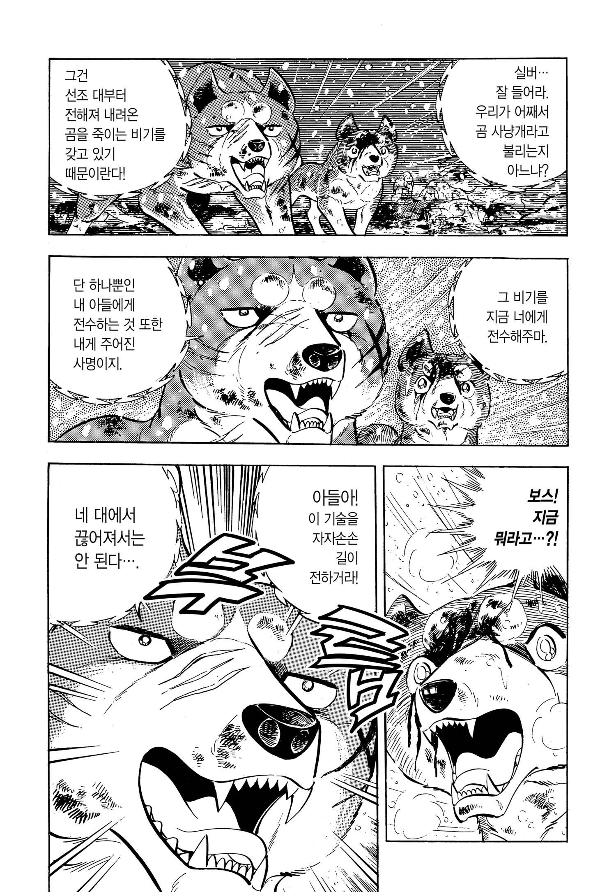
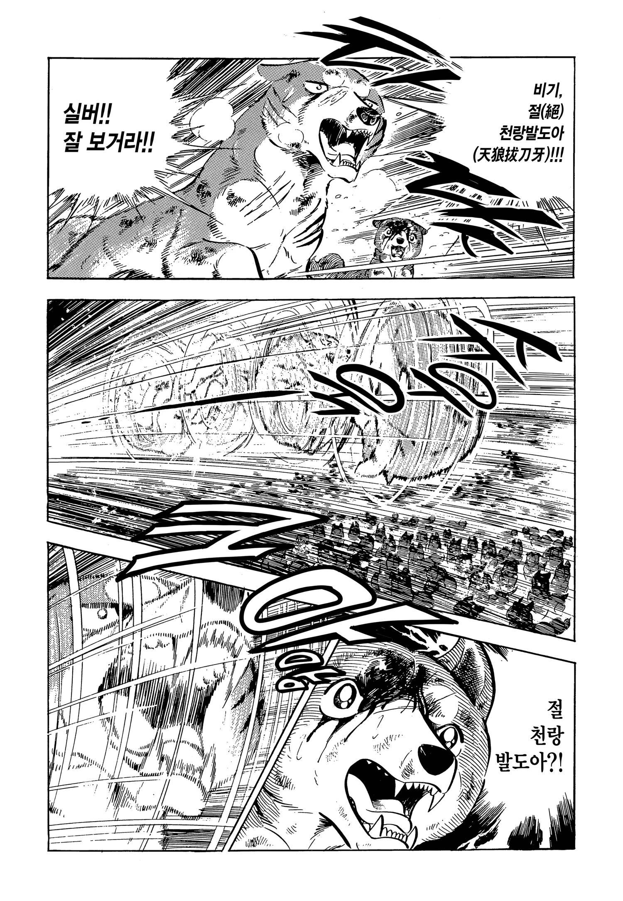
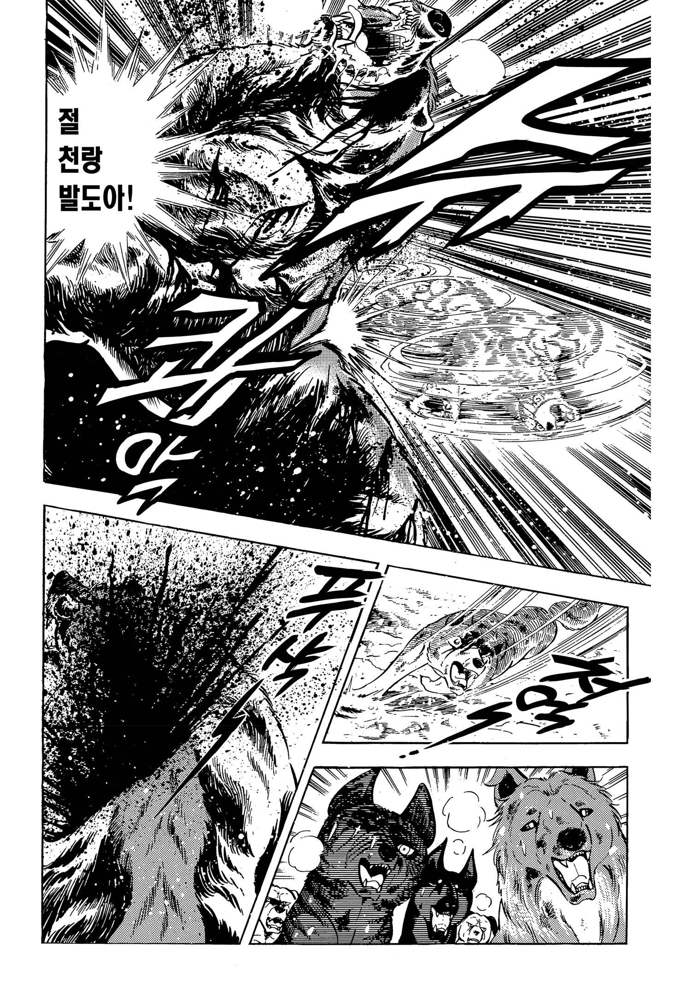

# 명견 실버 은아 유성 긴 절천랑발도아 전투력 비교 분석

은아 시리즈 최고의 기술인 절천랑발도아의 메커니즘과 이를 계승한 오우 가문 전사들의 실전 능력치를 객관적인 근거를 바탕으로 비교 분석한다. 이 기술은 작품 전체를 관통하는 오우 가문의 상징이자 가장 강력한 살상력을 지닌 비기다.  

고대 늑대족의 역사에서 비롯되어 리키, 긴, 위드, 오리온으로 이어지는 계승 서사는 작중 가장 중요한 축을 담당한다. 본 문서에서는 8대 발도아의 특징을 살펴보고, 시전자들의 능력치 랭킹을 통해 누가 가장 압도적인 위력을 발휘하는지 명확한 수치로 규명한다.

## 핵심 요약

* 절천랑발도아는 은아 시리즈를 관통하는 오우 가문 최고의 비기이자 상징적인 기술이다.
* 과거 고대 늑대족이 사룡 오로치를 쓰러뜨리기 위해 만들어 전수해 온 8대 비기 중 하나다.
* 다른 발도아와 달리 속임수나 환경에 의존하지 않고 순수한 근력과 회전력으로 적을 즉사시킨다.
* 리키는 탈주 무사 늑대를 구해주고 기술을 전수받았으며, 아들인 긴에게 직접 이를 물려주었다.
* 실전 전투력 종합 순위 1위는 전성기 시절의 긴(실버)으로 총점 578점을 기록했다.
* 리키는 기동 유지력이 낮으나 순수 파괴력 면에서는 역대 최고 수치인 99를 보유했다.
* 위드는 신체 하드웨어는 뛰어나지만 적을 죽이지 않으려는 성향으로 인해 종합 4위로 밀려났다.

## 1. 늑대 전설의 8대 발도아 종류 및 특징

이 기술들은 과거 고대 늑대족이 사룡 오로치를 쓰러뜨리기 위해 만들어 대대로 전수해 온 특수 비기다. 원래 늑대 이리족의 비술이었으나 오우의 전사들에게 전해져 내려왔다.
| 기술 이름 (한자)          | 주요 시전자 (정통 계승자) | 기술의 특징 및 메커니즘                                                         |
|---------------------|-----------------|-----------------------------------------------------------------------|
| 절천랑발도아 (絶天狼抜刀牙)     | 실버 (리키로부터 계승)   | 공중에서 초고속 회전하여 발생하는 원심력과 무는 힘으로 상대를 물어 근육과 뼈를 통째로 뜯어내는 절대적인 파괴력의 기술이다. |
| 열환몽발도아 (烈幻夢抜刀牙)     | 빙마 (Hyoma)      | 몸을 엄청난 속도로 회전시켜 강력한 회오리바람을 발생시켜 상대를 멀리 날려버리는 광범위 기술이다.                |
| 멸변이발도아 (滅変異抜刀牙)     | 영마 (Reima)      | 상대의 시각과 감각을 교란하는 변칙적인 움직임으로 사각지대를 파고들어 치명상을 입히는 암살형 기술이다.             |
| 참비승분신발도아 (斬飛翔分身抜刀牙) | 삼형제 늑대          | 공격하는 순간 세 방향에서 동시에 습격하는 연계 기술이다. 세 마리가 한 마리처럼 겹쳐 움직이다 갈라지는 방식을 취한다.   |
| 란사룡신발도아 (乱蛇竜神抜刀牙)   | 백귀아             | 뱀이 사냥감을 조이듯 복잡하고 유연한 궤적으로 회전하며 상대의 방어를 무력화하고 급소를 타격한다.                |
| 지공섬신발도아 (地空閃神抜刀牙)   | 무명 기사늑대         | 지면의 고저차와 지형지물을 이용해 엄청난 가속도를 얻어 하단에서 상대를 걷어차거나 베어내는 기술이다.              |
| 폭풍추격발도아 (爆風追撃抜刀牙)   | 무명 기사늑대         | 직선상으로 가해지는 연속적인 돌진형 발도아로, 돌파력과 전진 압박에 특화되어 있다.                        |
| 무쌍격파발도아 (無双撃破抜刀牙)   | 무명 기사늑대         | 자신의 모든 체중과 근력을 정면 한 점에 집중시켜 적의 정면 방어선이나 단단한 갑옷을 분쇄하는 정공법 기술이다.        |

## 2. 절천랑발도아가 최고 비기로 평가받는 이유

8가지 발도아 중 절천랑발도아가 최고이자 최강의 비기로 취급받는 이유는 완벽한 살상력과 정통성 때문이다.  
다른 발도아들이 바람을 일으키거나, 환각을 쓰거나, 숫자로 교란하는 등 변칙적인 속임수와 환경에 의존하는 반면, 절천랑발도아는 순수한 개체의 근력, 회전력, 치악력만을 극한으로 끌어올려 적을 즉사시키는 단발 필살기다.  
방어가 불가능하고 스치는 것만으로도 신체가 분쇄되기 때문에 늑대 제국 내에서도 왕족의 상징이자 특수 비기 중의 비기로 꼽힌다.

## 3. 오우 가문 계승 서사와 실버의 습득 계기

### 리키의 기술 수용 맥락

* 리키는 과거 풍아 늑대 왕국에서 자객들에게 쫓기던 탈주 무사 늑대를 구해준 적이 있다.

* 그 늑대가 은혜를 갚기 위해 리키에게 늑대족의 정통 비기인 절천랑발도아를 전수해 주었고, 리키는 이를 자신만의 필살기로 완성시켰다.

### 실버가 기술을 배우게 된 계기

* 1부 붉은 곰(아카카부토) 편 중반부, 오우군의 총대장이었던 리키가 아들인 실버의 자질과 우두머리로서의 숙명을 시험하고 물려주기 위해 직접 시범을 보이며 전수했다.

* 실버는 아버지 리키의 압도적인 시연을 보고 목숨을 건 수련 끝에 이 기술을 완벽하게 자신의 것으로 흡수했다.

## 4. 실버의 절천랑발도아 파괴력 묘사와 연출

실버가 사용하는 절천랑발도아는 파공음과 함께 몸이 거대한 드릴처럼 회전하며 허공을 가르는 은빛 섬광을 만들어낸다. 상대가 방어하려 내밀었던 단단한 앞발과 어깨 근육이 찢겨 나가며 뼈가 으스러지는 파괴력을 보여준다. 이 기술은 멧돼지나 거대한 식인곰의 두꺼운 가죽과 지방층을 단숨에 뚫어버릴 뿐만 아니라, 고대 늑대 제국의 황제나 기사들의 단단한 방어구조차 파괴하는 관통력과 절단력을 발휘한다.

## 5. 오우 가문 시전자별 실전 전투력 및 스펙 비교

발도아라는 비기의 완성도, 맷집, 실전 전투 센스, 그리고 세계관 내에서의 압박감을 모두 고려한 오우 가문의 능력치 지표는 다음과 같다.

| 실제 순위 | 이름 | 파괴력 | 속도 | 연속구사 | 천재성 | 결단력 | 성공률 | 합산 |
| --- | --- | --- | --- | --- | --- | --- | --- | --- |
| 1위 | 긴 (실버) | 96 | 99 | 88 | 99 | 98 | 98 | 578 |
| 2위 | 위드 (흑화) | 92 | 95 | 97 | 95 | 98 | 95 | 570 |
| 3위 | 오리온 | 95 | 92 | 73 | 85 | 95 | 75 | 515 |
| 4위 | 리키 | 99 | 85 | 45 | 90 | 95 | 96 | 510 |
| 5위 | 위드 (기존) | 92 | 95 | 97 | 95 | 50 | 80 | 509 |

### 시전자별 세부 능력 분석

* 긴 (전성기 시절): 리키의 파괴력과 위드의 유연함을 완벽하게 흡수한 밸런스형 전사다. 적의 약점을 송곳처럼 간파하는 천재적인 전투 IQ와 예리함을 지녔으며, 늑대족 오리지널 발도아 사용자들을 꺾고 기술을 완성한 최강자다.

* 오리온: 아버지 위드의 신체 능력과 증조부 리키의 잔혹한 살의가 조합된 전사다. 이빨을 드러내면 망설임 없이 끝장을 내는 가차 없는 결단력을 바탕으로 종합 능력치에서 아버지를 추월했다.

* 리키: 기술을 밑바닥에서부터 뼈를 깎는 노력으로 정립한 원조다. 거대 곰의 신체를 단번에 두 동강 내는 역대 최고의 순수 파괴력(99)을 지녔으나, 기동 유지력이 낮아 1대1 단판 승부에 특화되어 있다.

* 위드: 속도, 연속성, 천재성 등 모든 신체 능력치를 도배한 최신형 머신이다. 지치지 않고 기술을 난사하며 공중에서 궤도를 바꾸는 유연성을 가졌으나, 적을 죽이지 않으려는 불살 주의 성격이 사기적인 스펙을 갉아먹어 종합 서열 4위를 기록했다.

## 결론

절천랑발도아는 단순한 가상의 무술을 넘어 오우 가문의 세대 교체와 숭고한 투쟁을 상징하는 핵심 장치다.  
고대 늑대족의 비기에서 시작된 이 기술은 리키의 압도적인 파괴력, 긴의 천재적인 밸런스, 위드의 유연함, 오리온의 야성적 살의로 변모하며 작품의 서사를 이끌어왔다.  

시전자들의 능력치 비교에서 드러나듯, 기술의 위력은 단순히 신체적 스펙뿐만 아니라 전사의 결단력과 신념에 의해 완성된다는 점이 은아 시리즈가 가진 진정한 명작으로서의 가치다.

## 자주 묻는 질문(FAQ)

### 은아 시리즈 중에서 상업적으로 가장 큰 성공을 거둔 작품은 무엇인가?

누적 약 2,000만 부를 기록한 은아전설 위드가 상업적으로 가장 성공했다. 장기 연재와 애니메이션, 게임화로 대중적 인지도의 정점을 찍었다.

### 최신작으로 갈수록 작품이 오글거린다는 평가는 사실인가?

독자들의 평가는 반대다. 초기작은 묵직한 명작으로 평가받는 반면, 후기작으로 갈수록 개들이 인간의 말을 완벽히 구사하고 소행성 충돌을 막는 등 판타지 및 초자연적 설정이 도입되어 오히려 당혹감이나 오글거림을 유발한다는 지적이 많다.

### 오우 가문 전사들을 제외하고 세계관 내에서 손꼽히는 강자는 누구인가?

전직 군견 출신인 조지(5위, 498점)와 코가 닌자견 출신인 텟싱(6위, 495점) 등이 전 세대 강자 탑클래스에 포진해 있다.

### 도사견 챔피언인 무사시와 전설의 투견 베니자쿠라 중 누가 더 거구인가?

베니자쿠라가 무사시보다 체고와 체중 면에서 훨씬 거대한 초헤비급 도사견이다. 무사시가 현역 최강이라면 베니자쿠라는 논외급의 무력을 가진 전설로 묘사된다.

### 세계관 최강의 거구로 꼽히는 모스의 체급은 어느 정도인가?

마스티프 믹스견인 모스는 체중이 최소 80~100kg 이상으로 추정되는 초현실적 거구다. 개라기보다는 곰이나 멧돼지에 가까운 덩치를 자랑하며 베니자쿠라조차 작아 보이게 만든다.

## 부록

### 1. 전 시리즈 전투력 Top20

| 실제 순위 | 이름         | 소속 / 세대        | 합산  | 한 줄 요약                               |
|-------|------------|----------------|-----|--------------------------------------|
| 1위    | 긴 (실버)     | 오우군 2대 총대장     | 578 |                                      |
| 2위    | 위드 (흑화)    | 오우군 3대 총대장     | 570 | 흑화버전을 추가해 보았다.                       |
| 3위    | 오리온        | 위드의 차남 (4대)    | 515 |                                      |
| 4위    | 리키         | 오우군 1대 총대장     | 510 |                                      |
| 5위    | 위드 (기존)    | 오우군 3대 총대장     | 509 |                                      |
| 5위    | 조지         | 전직 군견 / 위드 세대  | 498 | 소형견 특유의 기동성과 가공할 미국 군견식 살상술의 일인자     |
| 6위    | 텟싱 (철심)    | 코가 닌자견 / 위드 세대 | 495 | 닌자술과 발도아 아류 기술을 가장 유연하게 다루는 테크니션     |
| 7위    | 코무라 (사무라)  | 긴의 장남 / 위드 세대  | 492 | 발도아를 독학으로 습득한 시한폭탄 같은 천재성을 품은 전사     |
| 8위    | 제롬         | 위드의 보좌관 / 킬러견  | 488 | 냉혹한 결단력과 군견 전술을 가졌으나 순수 파괴력이 살짝 아쉬움  |
| 9위    | 존          | 긴의 라이벌 / 셰퍼드   | 485 | 압도적인 사냥 본능과 파괴력을 지닌 초반부 최고의 전투력 측정기  |
| 10위   | 베가         | 오리온 세대 러시아 군견  | 482 | 오리온을 죽음 직전까지 압박했던 흑룡강의 잔혹한 학살자 출신    |
| 11위   | 붉은 눈 (아카메) | 이가 닌자견 총수      | 480 | 가문의 비술과 지략을 겸비했으며 속도만큼은 전 세대 탑클래스    |
| 12위   | 벤          | 오우군 초대 돌격대장    | 478 | 괴력의 그레이트 데인으로 눈이 멀기 전 전성기는 멧돼지 학살자   |
| 13위   | 시리우스       | 위드의 장남 (4대)    | 475 | 천재성은 높으나 아버지보다 더 심한 극단적 평화주의로 자멸함    |
| 14위   | 장군 (쇼군)    | 위드 편 원숭이 군단 개  | 472 | 압도적인 맷집과 거대한 덩치 하나로 오우군을 공포에 떨게 한 거구 |
| 15위   | 블러디        | 신 오우군 / 위드 세대  | 468 | 잔인함과 정교한 전투 센스를 동시에 지닌 전직 투견 출신의 강자  |
| 16위   | 카마키리 (사마귀) | 코우가 세력 배신자     | 465 | 비열하지만 물러서지 않는 흉포함과 높은 치명타 성공률 보유     |
| 17위   | 시저 (키사르)   | 위드 편 허스키 세력    | 463 | 북방의 지배자로 정면 완력 승부에서 엄청난 위력을 자랑하는 견종  |
| 18위   | 하쿠로        | 홋카이도의 강자       | 460 | 거친 대자연에서 살아남아 호방한 파괴력과 저돌성이 강점인 대장   |
| 19위   | 무사시        | 토사 투견 챔피언      | 458 | 기술은 전무하나 순수 맷집과 정면 무는 힘만큼은 리키급의 강자   |
| 20위   | 그레이트       | 오우군 간부         | 455 | 은밀한 기동성과 베테랑다운 전술 안목이 뛰어난 오우의 무사     |

### 2. 거구들인 무사시, 모스, 베니자쿠라(붉은 매화) 3마리를 체급, 전투 스타일 세계관 내 위상으로 일목요연하게 비교.  

베니자쿠라(매화)는 무사시보다 훨씬 거대한 최강의 도사견이며, 모스는 그 베니자쿠라보다도 덩치가 더 큰 규격 외의 괴물.

* 세 캐릭터 프로필 및 체급 비교

• 무사시 (武蔵)
  1. 견종: 도사견
  2. 체급: 체고 64cm / 체중 41kg
  3. 위상: 현역 투견계의 챔피언(요코주나)이다.
  4. 특징: 현실적인 최고 수준의 대형 도사견 스펙이다. 군더더기 없는 탄탄한 근육질이며 기술이 뛰어나다. 셋 중에서는 체급이 가장 작다.

• 베니자쿠라 (붉은 매화 / 紅桜)
  1. 견종: 도사견
  2. 체급: 체고 약 80cm / 체중 약 65kg 이상 (추정)
  3. 위상: '사상 최강의 투견'으로 불리는 전설적인 파이터다.
  4. 특징: 무사시와 같은 도사견이지만 무사시보다 머리 하나가 더 있고 덩치 차이가 확연한 헤비급 도사견이다. 링 위에서 무사시가 현역 최강이라면 베니자쿠라는 투견 역사를 통틀어 논외 급의 무력을 가진 전설이다.

• 모스 (Moss)
  1. 견종: 마스티프 믹스견
  2. 체급: 체중 최소 80~100kg 이상 (초현실적 거구)
  3. 위상: 안개 언덕의 야생 우두머리다.
  4. 특징: 셋 중 압도적으로 가장 거대하다. 도사견의 원종이 되는 마스티프의 피가 짙어 뼈대 자체가 다르다. 개라기보다는 곰이나 멧돼지에 가까운 덩치로 묘사된다.