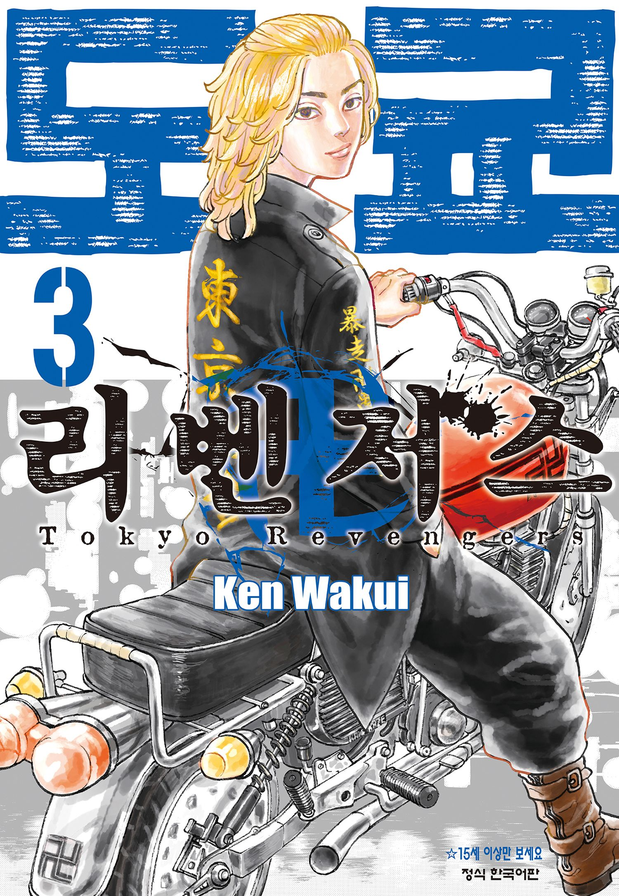
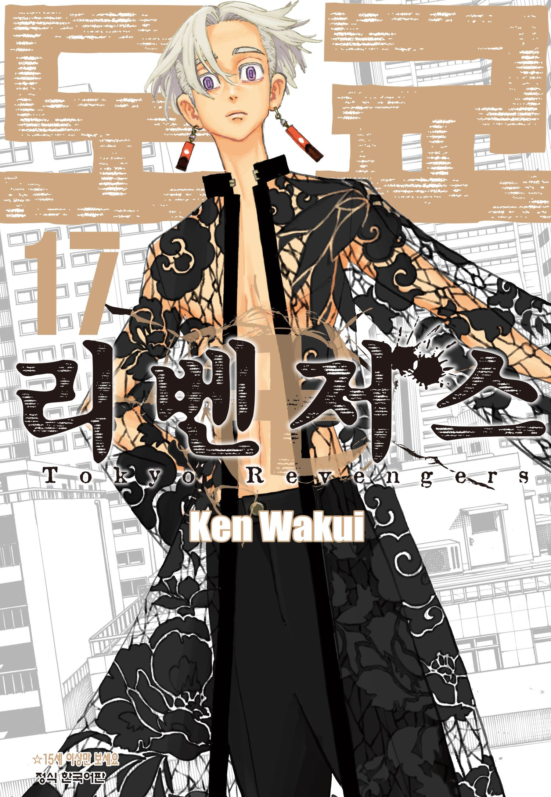
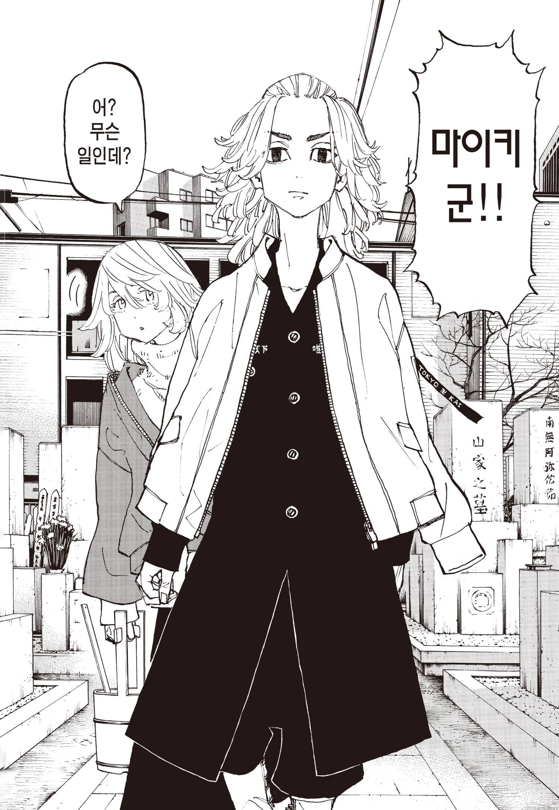
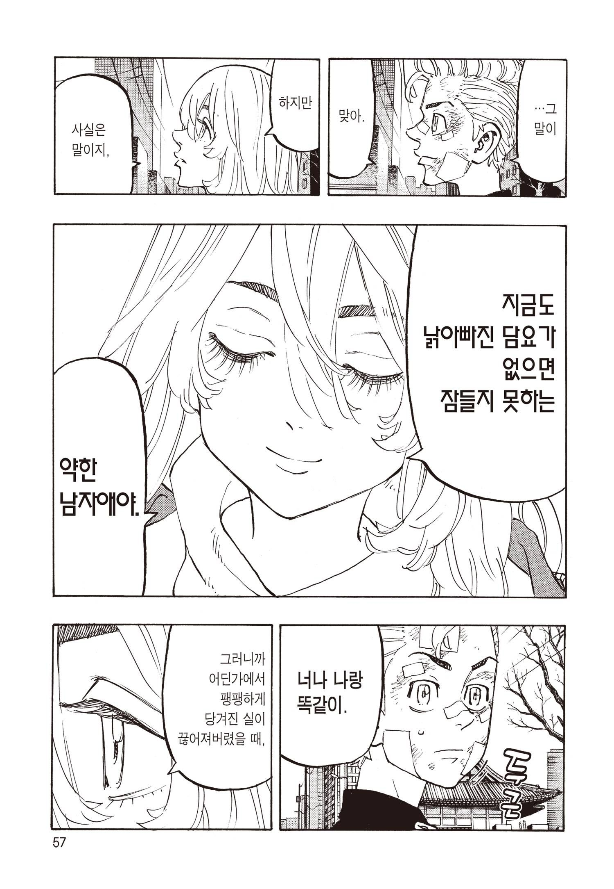

# [도쿄 리벤저스] 쿠로카와 이자나 혈연 진실 - 에마 죽음의 전말 정리

도쿄 리벤저스 천축 편은 작품 전체에서 가장 복잡한 가족관계를 다루는 이야기다.  
처음에는 이자나가 에마의 친오빠이며 마이키와도 혈연으로 연결된 인물처럼 보인다. 하지만 이야기가 진행될수록 모든 관계가 뒤집히는 충격적인 진실이 밝혀진다.  
그래서 많은 사람들이 아래와 같은 의문을 가진다.

* 병원에서 죽어가던 사람은 에마의 친엄마였나?
* 이자나는 정말 사노 가문의 가족이었나?
* 에마는 왜 이자나를 기억하지 못했나?
* 이자나는 언제 자신의 출생의 비밀을 알았나?
* 마이키는 언제 진실을 알았나?
* 에마는 끝까지 아무것도 몰랐나?
* 이자나는 왜 에마를 죽였나?

이 글에서는 작품에서 공개된 설정을 기준으로 사건이 발생한 순서대로 정리해본다.

## 핵심 요약

먼저 결론부터 정리하면 아래와 같다.

* 병원에서 에마를 안아준 사람은 친엄마인 쿠로카와 카렌이 아니라 사노 사쿠라코다.
* 사노 사쿠라코는 남편의 불륜으로 태어난 에마를 자신의 딸처럼 받아들였다.
* 쿠로카와 이자나는 사노 가문과 혈연관계가 전혀 없다.
* 에마와 이자나 역시 친남매가 아니다.
* 이자나는 소년원을 나온 뒤 자신의 출생의 비밀을 알게 된다.
* 마이키는 관동사변에서 처음 진실을 듣게 된다.
* 에마는 끝까지 아무것도 모른 채 사망한다.
* 이자나는 이미 모든 진실을 알고 있는 상태에서 마이키를 무너뜨리기 위해 에마를 죽였다.

이 모든 사건은 혈연보다 가족을 선택했던 사노 가문의 가치관과, 그 과정에서 철저하게 소외된 이자나의 비극이 만들어낸 결과라고 볼 수 있다.

## 1. 병원에서 에마를 안아준 사람은 누구였을까?

많은 사람들이 병원 장면을 기억하면서 죽어가던 여성이 에마의 친엄마였다고 생각한다.
하지만 사실은 아니다.
병원 침대에 누워 있던 사람은 에마의 친엄마인 쿠로카와 카렌이 아니라, 마이키와 신이치로의 친어머니인 **사노 사쿠라코**다.
이 장면은 사노 가문이 왜 에마를 진심으로 가족으로 받아들였는지를 보여주는 가장 중요한 장면 가운데 하나다.

### 사노 사쿠라코는 왜 에마를 받아들였을까?

사쿠라코의 입장에서 에마는 남편인 사노 마코토가 다른 여자와의 사이에서 낳은 아이다. 현실적으로 보면 미워하거나 거부해도 이상하지 않은 상황이다.
하지만 사쿠라코는 죽음을 앞둔 순간까지 어린 에마를 따뜻하게 안아주며 자신의 아이가 되어줘서 고맙다는 마음을 전한다.
혈연보다 가족을 선택한 것이다.
이 장면 덕분에 에마는 사노 가문을 자신의 진짜 가족으로 받아들이게 된다.

### 사노 가문의 선택이 만든 역설

사노 가문은 에마를 '불륜의 증거'가 아니라 가족으로 받아들였다.
신이치로 역시 같은 생각이었다. 하지만 이 선택은 또 다른 비극을 만들었다.
에마는 집 안에서 사랑받는 가족으로 자랐지만, 이자나는 시설에서 언젠가는 가족이 될 것이라는 희망만 품은 채 성장했다.  

신이치로는 이자나도 가족처럼 생각했지만 현실은 달랐다. 에마는 실제 가족이 되었고, 이자나는 끝내 가족이 되지 못했다.  
이 사랑의 불균형은 시간이 흐를수록 이자나의 소외감과 열등감을 더욱 키우게 된다.

## 2. 이자나는 정말 사노 가문의 가족이었을까?

결론부터 말하면 아니다.  
이자나는 사노 가문과 혈연관계가 전혀 없는 완전한 타인이다. 작품 초반에는 에마의 친오빠이며 마이키의 이복형처럼 보이지만, 천축 편 후반부에서 이 설정은 모두 뒤집힌다.

### 이자나의 실제 출생

이자나는 쿠로카와 카렌의 친아들이 아니다.
카렌의 전남편이 다른 필리핀 여성과의 사이에서 낳은 아이가 바로 이자나다.  
즉,

* 카렌와도 혈연이 없고
* 에마와도 혈연이 없으며
* 사노 신이치로
* 사노 만지로(마이키)
* 사노 에마

모두와 피가 한 방울도 섞이지 않았다. 유전학적으로 완전한 남이었다.

### 왜 함께 살게 되었을까?

카렌는 여러 사정으로 인해 이자나를 잠시 맡아 키우게 된다.
이후 에마를 데리고 사노 가문을 찾아오지만, 결국 사노 가문은 어린 에마만 받아들이고 이자나는 보육시설로 보내진다.

이때부터 두 사람의 인생은 완전히 갈라진다. 에마는 사랑받는 가족이 되었고,
이자나는 버려진 아이가 되었다.

### 왜 에마는 이자나를 잊게 되었을까?

에마가 이자나를 거의 기억하지 못하는 이유는 단순히 시간이 흘렀기 때문이 아니다. 
사노 가문에서 받은 사랑이 너무 컸기 때문이다. 특히 병원에서 사쿠라코에게 받은 사랑은 에마에게 '진짜 가족'의 의미를 완전히 바꾸어 놓았다. 보육원에서 함께 지냈던 기억은 점차 희미해졌고, 이자나는 어린 시절의 흐릿한 기억 정도로만 남게 된다.

반대로 이자나는 달랐다. 이자나는 에마를 자신과 함께 버려진 유일한 혈육이라고 믿고 있었다. 그래서 에마에게 이자나는 잊힌 과거였지만, 이자나에게 에마는 유일한가족이었다. 이 감정의 비대칭성이 훗날 천축 편의 비극을 더욱 잔혹하게 만드는 원인이 된다.

## 3. 이자나는 언제 자신의 출생의 비밀을 알게 되었을까?

이자나는 처음부터 자신의 출생의 진실을 알고 있었던 것이 아니다.

오히려 자신을 사노 가문의 일원이라고 믿으며 성장했다. 에마와 자신은 친남매이고, 신이치로가 자신을 동생처럼 아끼는 것도 가족이기 때문이라고 생각했다.  
하지만 그 믿음은 소년원을 나온 뒤 단 한 번의 만남으로 완전히 무너진다.

### 소년원 퇴소 후 우연히 카렌을 다시 만난다

고등학생 나이가 되어 소년원을 나온 이자나는 길거리에서 자신과 에마를 버렸던 양어머니 쿠로카와 카렌을 우연히 만나게 된다.

오랜 시간이 지나 다시 만난 만큼, 이자나는 원망과 분노를 품은 채 카렌에게 다가간다. 왜 자신을 버렸는지, 왜 그런 삶을 살아야 했는지 묻고 싶었던 것이다. 하지만 카렌은 이자나의 감정을 받아주기는커녕 더욱 잔인한 진실을 말한다.

### 카렌이 알려준 충격적인 진실

카렌는 아무렇지도 않은 표정으로 이자나에게 말한다.

> "너랑 나는 피가 안 섞였어."
> "넌 내 전남편이 필리핀 여자와 바람나서 낳은 아이야."
> "피도 안 섞인 타인인 너를 내가 왜 신경 써야 하니?"

이 한마디는 이자나가 평생 믿고 살아온 자신의 정체성을 한순간에 부정하는 말이었다.

### 이자나는 무엇이 가장 충격이었을까?

많은 사람들이 단순히 '혈연이 아니었다'는 사실만 충격이었다고 생각한다.
하지만 이자나가 무너진 이유는 그것보다 훨씬 크다. 그 순간 이자나는 동시에 세 가지 사실을 깨닫게 된다.

* 에마는 자신의 친동생이 아니었다.
* 자신은 사노 가문과도 아무런 혈연관계가 없었다.
* 신이치로가 자신에게 보여준 사랑은 가족이기 때문이 아니라, 갈 곳 없는 아이를 불쌍히 여긴 결과일 수도 있다는 생각에 사로잡힌다.

물론 작품 어디에서도 신이치로가 동정심 때문에 이자나를 아꼈다고 말하지는 않는다. 오히려 신이치로는 끝까지 이자나를 가족처럼 대했다. 하지만 이자나는 그 사랑마저 '동정'이었다고 왜곡해서 받아들이게 된다. 바로 이 왜곡이 훗날 천축을 만들고 마이키를 향한 증오를 키우는 결정적인 계기가 된다.

## 4. 마이키와 에마는 언제 진실을 알게 되었을까?

이자나는 소년원을 나온 뒤 진실을 알게 되었지만, 마이키와 에마는 서로 다른 운명을 맞는다. 한 사람은 마지막 전투에서 진실을 알게 되고, 다른 한 사람은 끝까지 아무것도 모른 채 생을 마감한다.

### 마이키는 관동사변에서 처음 진실을 듣는다

마이키가 이 사실을 알게 된 시점은 천축 편 마지막 결전인 관동사변이다.마이키는 이자나와 싸우던 중 가장 이해되지 않았던 질문을 던진다. '왜 에마를 죽였냐?' 그러자 이자나는 광기에 가까운 모습을 보이며 폭주한다.

그때 이를 말리던 카쿠쵸가 진실을 밝힌다. 이자나는 처음부터 사노 가문의 사람이 아니었다는 것이다. 마이키는 큰 충격을 받는다. 하지만 그의 반응은 예상과 달랐다. 혈연이 아니라는 사실을 알게 되었음에도 이자나를 밀어내지 않았다. 오히려 끝까지 손을 내밀며 말한다.

'피가 섞이지 않았어도 넌 내 형이다.'

이 장면은 작품 전체에서 혈연보다 유대를 더 중요하게 여기는 마이키의 가치관을 가장 잘 보여주는 장면 가운데 하나다.

### 에마는 끝까지 아무것도 몰랐다

에마는 이 진실을 평생 알지 못했다.

관동사변이 시작되기 전, 키사키 텟타가 일으킨 오토바이 습격으로 목숨을 잃었기 때문이다. 죽는 순간까지도 에마는 두 가지 사실을 전혀 모르고 있었다.

첫 번째는 자신과 이자나가 친남매가 아니라는 사실이다. 두 번째는 자신을 죽인 배후가 바로 자신이 친오빠라고 믿었던 이자나라는 사실이다.

에마는 마지막 순간까지도 이자나를 미워하지 않았다. 오히려 어린 시절 자신만 사노 가문에 입양되어 행복하게 살았다는 사실에 미안함을 품고 있었다.
보육원에 혼자 남겨진 이자나를 떠올리며 늘 죄책감을 안고 살아왔던 것이다.

그래서 에마의 죽음은 더욱 비극적으로 느껴진다. 이자나는 이미 모든 진실을 알고 있었지만, 에마는 아무것도 모른 채 끝까지 친오빠라고 믿었던 사람을 걱정하며 세상을 떠났다.  

## 5. 이자나는 왜 에마를 죽였을까?

결론부터 말하면, 이자나는 에마와 자신이 혈연관계가 아니라는 사실을 모두 알고 있는 상태에서 에마를 죽였다.

즉, 진실을 몰라서 벌어진 비극이 아니라 모든 사실을 알고도 내린 선택이었다.많은 사람들이 "친동생이라고 믿었던 사람이 사실은 남이었다"는 점만 기억하지만, 작품에서 더 중요한 것은 이자나가 무엇을 위해 에마를 희생시켰느냐다.

### 에마는 이미 지켜야 할 가족이 아니었다

카렌에게 자신의 출생의 비밀을 들은 이후 이자나에게 에마는 더 이상 함께 버려진 친동생이 아니었다.

그동안 자신이 의지했던 혈연이라는 마지막 연결고리가 완전히 끊어진 것이다. 그 이후 이자나에게 에마는 가족이 아니라 사노 가문의 일원이 되었다. 그리고 그 사노 가문은 자신에게서 신이치로를 빼앗고, 자신이 결코 들어갈 수 없었던 장소가 되었다. 이자나의 증오는 더 이상 특정 개인을 향한 것이 아니었다.
사노 가문 전체를 향한 증오로 변해 있었다.

### 진짜 목적은 마이키를 무너뜨리는 것이었다

이자나가 에마를 죽이려 한 가장 큰 이유는 마이키를 정신적으로 붕괴시키기 위해서였다.

이자나는 신이치로의 사랑을 독차지하고 싶어 했다. 하지만 신이치로에게는 언제나 가장 소중한 동생인 마이키가 있었다. 이자나는 그것을 받아들이지 못했다. 그래서 마이키가 가장 소중하게 여기는 존재를 하나씩 빼앗으려 했다.  
그 가운데 가장 효과적인 대상이 바로 에마였다. 에마를 잃으면 마이키는 정상적인 판단을 할 수 없을 것이라고 생각한 것이다.

### 마이키를 자신의 것으로 만들고 싶었다

이자나의 목적은 단순한 복수가 아니었다.

그는 완전히 무너진 마이키를 자신이 거두고 싶어 했다. 가족도 친구도 모두 잃은 마이키를 자신의 곁에 두고 자신이 원하는 모습으로 지배하려 했던 것이다. 이 때문에 에마는 이자나에게 더 이상 사람이 아니라 계획을 완성하기 위한 수단으로 전락한다. 작품에서 이자나가 보여주는 가장 잔혹한 부분도 바로 여기에 있다. 에마의 감정이나 과거의 추억은 전혀 고려하지 않았다. 오직 마이키를 파괴하기 위한 도구로만 이용했다.

## 6. 사노 가문의 선택은 왜 또 다른 비극을 만들었을까?

사노 가문은 작품 전체에서 가장 따뜻한 가족처럼 보인다.

혈연보다 사람을 먼저 받아들이고, 가족이라는 이름으로 서로를 품어준다. 하지만 아이러니하게도 그 따뜻함은 또 다른 아이에게는 깊은 상처가 되었다.

### 에마에게는 구원이 되었다

사노 가문은 에마를 친딸처럼 키웠다.

사쿠라코는 마지막 순간까지 에마를 사랑했고, 신이치로 역시 에마를 친동생처럼 아꼈다. 덕분에 에마는 버려진 아이가 아니라 사랑받는 가족으로 성장할 수 있었다.

### 이자나에게는 희망고문이 되었다

반대로 이자나는 시설에 남겨졌다.

신이치로는 그를 자주 찾아왔고, 가족처럼 대해주려고 노력했다. 하지만 현실은 달랐다. 에마는 매일 가족과 함께 살았고, 이자나는 다시 시설로 돌아가야 했다. 이 차이는 시간이 흐를수록 더욱 커졌다. 이자나는 자신도 가족이라고 믿고 싶었지만, 현실에서는 언제나 문밖에 있는 사람이었다. 결국 그는 자신이 버림받았다는 감정을 버리지 못했고, 그 감정은 마이키를 향한 질투와 증오로 변해 간다.

### 혈연보다 더 중요한 것은 무엇이었을까?

작품은 혈연만으로 가족이 결정되지 않는다는 사실을 여러 번 보여준다.

사쿠라코는 혈연이 없는 에마를 사랑했다. 신이치로 역시 혈연이 없는 이자나를 동생처럼 아꼈다. 마이키도 마지막 순간까지 혈연이 없어도 형이라고 인정했다. 반대로 이자나는 혈연이라는 사실 하나에 자신의 존재 이유를 걸었다. 그리고 그 믿음이 무너지는 순간 자신도 함께 무너졌다.  
결국 이자나를 파멸시킨 것은 혈연이 없었다는 사실 자체가 아니라, 혈연만이 자신을 증명할 수 있다고 믿었던 집착이었다.

## 사노 가문과 이자나의 관계를 한눈에 정리

| 구분 | 사노 가문 | 쿠로카와 이자나 |
|******|***********|****************|
| 혈연관계 | 사노 가족 중심 | 사노 가문과 혈연 없음 |
| 에마와의 관계 | 가족 | 혈연 없음 |
| 가족을 바라보는 방식 | 혈연보다 유대 | 혈연에 집착 |
| 신이치로의 태도 | 모두를 가족으로 품으려 함 | 사랑을 독점하고 싶어 함 |
| 마이키의 태도 | 혈연이 없어도 형으로 인정 | 끝까지 거부하고 적으로 대함 |
| 비극의 원인 | 모두를 품으려 했던 이상 | 혈연이 무너진 뒤의 왜곡된 집착 |
| 최후 | 가족을 잃는 상처 | 정체성 붕괴와 죽음 |

이 표를 보면 천축 편의 비극은 단순히 선과 악의 대결이 아니라, 서로 다른 가족관이 충돌한 결과라는 점을 이해하기 쉽다.  

## 결론

천축 편의 비극은 단순히 혈연의 진실이 밝혀진 이야기라고 보기 어렵다.  
오히려 서로 다른 방식으로 '가족'을 받아들였던 인물들이 끝내 화해하지 못한 결과에 가깝다.

사노 사쿠라코는 혈연이 없는 에마를 자신의 딸로 받아들였다.  
신이치로는 혈연이 없는 이자나를 동생으로 대했다.  
마이키 역시 마지막 순간까지 혈연이 없어도 형이라고 인정했다.  
반대로 이자나는 자신의 존재 이유를 혈연에서 찾았다.  
그래서 자신이 사노 가문과 아무 관계가 없다는 사실을 알게 된 순간, 자신이 살아갈 이유마저 잃어버렸다고 받아들였다.  
결국 이자나를 무너뜨린 것은 '혈연이 없었다'는 사실 자체가 아니다.  
혈연만이 자신을 가족으로 증명해 줄 수 있다고 믿었던 왜곡된 집착이 그를 파멸로 이끌었다.  

《도쿄 리벤저스》가 천축 편을 통해 보여주려는 핵심은 바로 여기에 있다.

***진짜 가족은 같은 피를 나누었느냐보다 서로를 어떻게 받아들이고 끝까지 손을 내밀었느냐에 의해 결정된다.  
하지만 그 손을 끝내 붙잡지 못한 사람에게는 가족이라는 이름조차 또 하나의 상처가 될 수 있다.***

## 자주 묻는 질문(FAQ)

### 병원에서 죽어가던 사람은 에마의 친엄마였나?

아니다.  
병원에 누워 있던 사람은 에마의 친엄마인 쿠로카와 카렌이 아니라 마이키와 신이치로의 친어머니인 **사노 사쿠라코**다.  
이 장면은 사노 가문이 에마를 진심으로 가족으로 받아들였다는 사실을 보여주는 대표적인 장면이다.

### 이자나는 정말 에마의 친오빠가 아니었나?

그렇다.  
작품 후반에서 밝혀지듯 이자나는 에마와 혈연관계가 전혀 없다. 이자나는 카렌의 친아들도 아니며, 카렌의 전남편과 다른 여성 사이에서 태어난 아이였다. 따라서

* 에마와도 혈연이 없고
* 사노 신이치로와도 혈연이 없으며
* 마이키와도 혈연이 없다.

처음에는 친남매처럼 알려졌지만, 실제로는 모두 잘못 알려진 정보였다.

### 신이치로는 이 사실을 알고 있었을까?

작품에서 신이치로가 직접 밝히지는 않는다.  
다만 에마를 데려오는 과정과 당시 상황을 고려하면 이자나가 사노 가문과 혈연이 아니라는 사실을 알고 있었을 가능성이 매우 높다. 그럼에도 신이치로는 혈연과 상관없이 이자나를 동생처럼 대했다. 그에게 중요한 것은 피가 아니라 함께하는 사람이었기 때문이다.

### 마이키는 언제 진실을 알게 되었을까?

천축 편 마지막 결전인 관동사변에서 알게 된다.

마이키는 이자나에게 왜 에마를 죽였는지 묻는다. 그 과정에서 카쿠쵸가 이자나는 처음부터 사노 가문의 사람이 아니었다는 사실을 밝힌다. 큰 충격을 받은 마이키였지만, 그는 이자나를 밀어내지 않았다. 오히려 혈연이 아니어도 형이라고 인정하며 마지막까지 손을 내민다.

### 에마는 진실을 알고 죽었을까?

아니다.  
에마는 끝까지 아무것도 모른 채 세상을 떠났다. 자신과 이자나가 혈연이 아니라는 사실도, 자신을 죽인 배후가 이자나라는 사실도 알지 못했다. 마지막 순간까지도 에마는 어린 시절 보육원에 혼자 남겨진 이자나를 떠올리며 미안한 마음을 품고 있었다. 그래서 천축 편은 더욱 비극적으로 느껴진다.

### 이자나는 죄책감을 느끼지 않았을까?

작품에서 죄책감을 드러내는 모습은 거의 없다.  
이미 카렌에게 자신의 출생의 비밀을 들은 뒤 혈연이라는 마지막 연결고리마저 끊어졌다고 생각했기 때문이다. 그에게 에마는 더 이상 지켜야 할 가족이 아니라 마이키를 무너뜨리기 위한 가장 효과적인 수단이 되어 있었다. 이 때문에 에마를 이용하는 데 큰 망설임을 보이지 않는다.