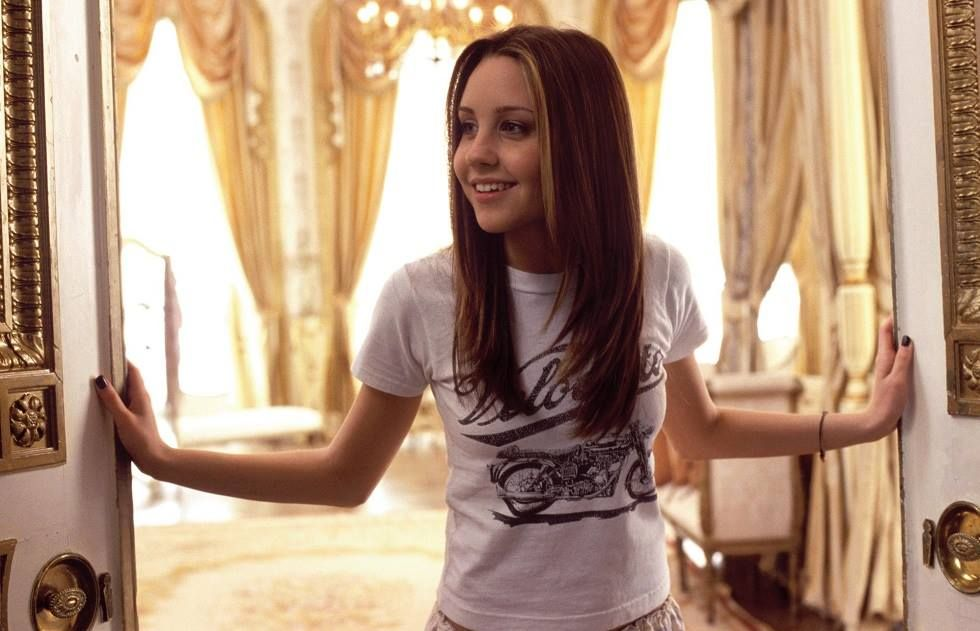
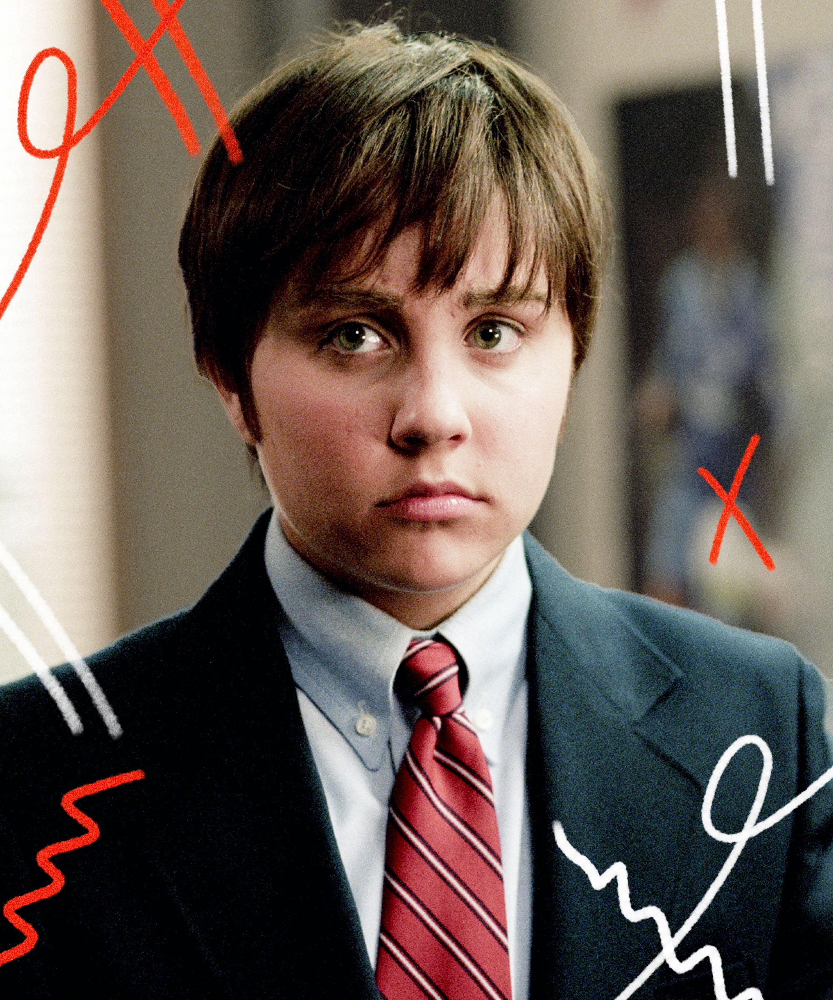
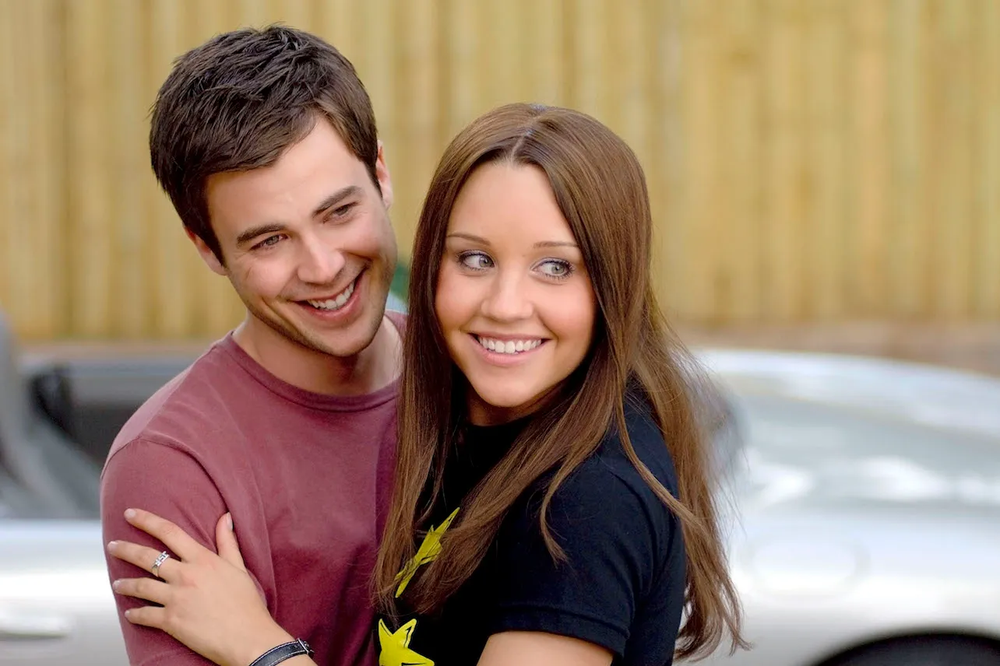

# 아만다 바인즈 전성기와 은퇴, 근황까지 완전 정리

아만다 바인즈는 2000년대를 대표한 하이틴 스타였지만 24세에 은퇴를 선언했고, 정신 건강 문제를 겪은 뒤 현재는 예술과 패션 분야에서 새로운 삶을 이어가고 있다. 그녀는 한 시대를 대표했던 배우였으며, 지금도 《쉬즈 더 맨》, 《왓 어 걸 원츠》, 《시드니 화이트》를 통해 많은 사람들에게 기억되고 있다. 그러나 그녀의 이야기는 단순히 유명 배우의 성공과 실패가 아니라, 어린 나이에 스타가 된 사람이 어떤 환경 속에서 살아가야 했는지를 보여주는 사례이기도 하다.

## 핵심 요약

* **아만다 바인즈**는 1990~2000년대 니켈로디언을 대표한 아역 배우이자 하이틴 스타였다.
* 《왓 어 걸 원츠》, 《쉬즈 더 맨》, 《시드니 화이트》를 통해 20대 초반 최고의 인기를 누렸다.
* 2010년 스스로 은퇴를 선언했지만 이후 정신 건강 악화로 사실상 복귀가 어려워졌다.
* 현재는 배우보다 **패션·미술 등 창작 활동**에 집중하며 새로운 삶을 이어가고 있다.
* 그녀의 사례는 할리우드 아역 스타 보호 시스템의 한계를 보여주는 대표적인 사례 가운데 하나로 자주 언급된다.

## 1. 아만다 바인즈는 누구인가?

1986년 미국 캘리포니아에서 태어난 아만다 바인즈는 어린 시절부터 코미디 감각과 연기력을 인정받은 배우였다. 불과 일곱 살 무렵 광고와 무대 활동을 시작했고, 이후 미국 어린이 채널 **니켈로디언(Nickelodeon)**에서 빠르게 이름을 알렸다. 특히 《All That》와 《The Amanda Show》는 그녀를 미국 청소년들이 가장 좋아하는 스타 가운데 한 명으로 만들어 준 작품이었다.

당시의 아만다 바인즈는 단순히 외모가 뛰어난 배우가 아니었다. 상황극과 슬랩스틱, 표정 연기, 빠른 대사 처리까지 모두 능숙하게 소화하는 드문 코미디 배우였으며, 자연스럽게 영화계에서도 관심을 받기 시작했다. 어린 시절부터 이미 여러 차례 키즈 초이스 어워드(Kids' Choice Awards)를 수상하며 대중성과 연기력을 동시에 인정받았다.

많은 아역 배우들이 성장 과정에서 이미지를 유지하지 못하고 사라지는 경우가 많았지만, 아만다는 청소년 시기에도 자연스럽게 하이틴 영화의 주연으로 자리 잡으며 성공적으로 활동 영역을 넓혀 갔다. 이 시기는 그녀의 커리어에서 가장 중요한 전환점이었다.

## 2. 2000년대를 대표한 하이틴 스타가 되다

2000년대 초반은 미국 하이틴 영화가 가장 큰 인기를 누리던 시기였다. 린제이 로한, 힐러리 더프, 앤 해서웨이 등 여러 배우들이 활동했지만, **아만다 바인즈** 역시 그 중심에 있었다.

그녀의 대표작은 다음 세 작품으로 정리할 수 있다.

| 작품 | 개봉 | 촬영 당시 나이 | 간단한 내용 |
|------|------|----------------|-------------|
| **왓 어 걸 원츠** | 2003 | 만 16~17세 | 영국 귀족 아버지를 찾아 떠난 소녀의 성장 이야기 |
| **쉬즈 더 맨** | 2006 | 만 19~20세 | 축구를 위해 남장을 하고 학교에 들어가는 코미디 |
| **시드니 화이트** | 2007 | 만 20~21세 | 현대적으로 재해석한 백설공주 이야기 |

세 작품 모두 밝고 유쾌한 분위기의 하이틴 영화였지만 공통점도 있었다.

* 자신의 길을 스스로 선택하는 여성 주인공
* 기존 사회의 편견에 맞서는 이야기
* 코미디와 성장 드라마의 결합
* 가족과 사랑을 함께 다루는 구조

아만다 바인즈는 이러한 역할을 자연스럽게 소화하면서 '사랑스럽지만 당당한 여성'이라는 이미지를 확립했다. 과장된 연기를 하지 않아도 특유의 표정과 리듬감만으로 웃음을 만들어 내는 배우라는 평가를 받았고, 이 시기 그녀는 미국을 대표하는 하이틴 스타 가운데 한 명으로 자리 잡게 된다.

## 3. 지금도 사랑받는 대표작 세 편

많은 작품에 출연했지만 현재까지 가장 많이 회자되는 작품은 역시 세 편이다.

### 《왓 어 걸 원츠》(2003)

미국에서 자란 소녀가 한 번도 만나지 못했던 영국 귀족 아버지를 찾아가면서 벌어지는 성장 영화다. 가족애와 로맨스, 코미디를 균형 있게 담아낸 작품으로, 당시 10대 관객들에게 큰 사랑을 받았다. 아만다 바인즈는 밝고 당찬 매력을 자연스럽게 보여 주며 영화의 중심을 이끌었다.

### 《쉬즈 더 맨》(2006)

셰익스피어의 **『십이야(Twelfth Night)』**를 현대적으로 각색한 작품이다. 축구를 계속하기 위해 오빠 대신 남장을 하고 기숙학교에 들어간다는 설정을 중심으로 이야기가 전개된다. 오늘날에도 그녀를 대표하는 작품으로 가장 많이 언급되며, 채닝 테이텀의 초기 출연작이라는 점에서도 자주 회자된다.

### 《시드니 화이트》(2007)

동화를 현대 대학 생활에 맞게 재해석한 캠퍼스 코미디다. 학생회 권력 구조와 인기 문화, 편견 등을 풍자하며 일곱 명의 괴짜 친구들과 함께 학교의 부조리에 맞서는 이야기를 그린다. 흥행은 앞선 두 작품만큼 크지 않았지만 시간이 지나면서 꾸준히 재평가를 받았고, 현재는 대표작 가운데 하나로 자리 잡았다.

## 4. 24세의 이른 은퇴는 어떻게 시작되었을까?

2010년은 아만다 바인즈의 인생에서 가장 큰 전환점이었다. 영화 《Easy A》 개봉 직후였던 24세의 그녀는 자신의 SNS를 통해 더 이상 연기를 사랑하지 않는다며 **은퇴를 선언**했다. 당시에는 단순한 슬럼프 정도로 받아들이는 시선도 있었지만, 시간이 지나면서 이 결정은 단순한 휴식이 아니라 심각한 정신 건강 문제의 시작과 맞물려 있었다는 사실이 알려졌다.

이후 그녀는 인터뷰를 통해 마지막 작품 속 자신의 모습을 보고 외모에 큰 충격을 받았으며, 강한 자기혐오와 외모 강박을 느꼈다고 밝혔다. 배우라는 직업이 더 이상 즐겁지 않았고, 대중 앞에서 끊임없이 평가받는 삶을 견디기 어려웠다는 고백도 남겼다. 얼마 지나지 않아 은퇴 선언을 번복하기도 했지만, 이미 건강 상태는 급격히 악화되고 있었고 배우로 복귀할 수 있는 상황은 아니었다.

정리하면 그녀의 커리어는 다음과 같은 흐름으로 이어졌다.

| 시기 | 주요 사건 |
|------|----------|
| 2010년 | 트위터를 통해 공식 은퇴 선언 |
| 2010년 이후 | 은퇴 번복 의사 표명 |
| 2012~2013년 | 정신 건강 악화와 각종 사건 발생 |
| 2013~2022년 | 성인후견인 제도 적용 |
| 이후 | 배우 활동 대신 치료와 회복에 집중 |

많은 사람들이 '갑자기 사라진 배우'로 기억하지만, 실제로는 은퇴 선언 이후에도 복귀 의지가 전혀 없었던 것은 아니다. 다만 건강 문제가 반복되면서 배우 생활을 이어 갈 여건을 만들지 못했다.

## 5. 정신 건강 악화와 성인후견인 제도

은퇴 이후의 아만다 바인즈는 언론을 통해 여러 차례 부정적인 뉴스의 중심에 섰다. 음주운전과 교통사고, 기행으로 보도된 행동들이 이어졌고, 정신 건강이 급격히 악화되면서 병원 치료를 반복하게 되었다. 이 시기에는 약물 문제와 함께 **양극성 장애(Bipolar disorder)**를 포함한 중증 정신 질환 치료를 받았으며, 법원은 그녀가 독립적으로 재산과 생활을 관리하기 어렵다고 판단해 어머니를 성인후견인으로 지정했다.

성인후견인 제도는 본인의 재산과 법적 의사결정을 일정 부분 후견인이 대신하는 제도다. 브리트니 스피어스 사례로도 널리 알려졌으며, 아만다 역시 약 9년 동안 이 제도의 적용을 받았다. 이 기간 동안에는 배우로 복귀하고 싶다는 의사를 밝힌 적도 있었지만, 건강 회복이 우선이라는 판단 아래 실제 활동은 거의 이루어지지 않았다.

이 과정에서 인터넷에서는 그녀의 병명을 **조현병**으로 단정하는 글도 많았지만, 공식적으로 확인된 내용은 아니다. 공개된 자료에서 확인되는 것은 양극성 장애와 정신 건강 악화, 약물 문제, 외모 강박 등이며, 특정 병명을 단정하는 것은 신중할 필요가 있다.

## 6. 왜 아역 스타들의 비극은 반복될까?

아만다 바인즈의 사례는 단순히 한 배우 개인의 문제가 아니라 할리우드 아역 스타 시스템이 가진 구조적 한계를 보여주는 사례로 자주 언급된다. 물론 모든 아역 배우가 같은 길을 걷는 것은 아니지만, 여러 전문가들은 다음과 같은 요인이 복합적으로 작용한다고 설명한다.

* **어린 시절부터 형성되는 유명세**로 인해 건강한 자아를 만들기 어려운 환경
* 또래와 다른 생활을 반복하며 겪는 사회적 고립
* 외모와 이미지에 대한 지속적인 평가
* 파파라치와 언론의 과도한 관심
* 약물과 알코올에 쉽게 노출되는 환경
* 정신 건강을 체계적으로 관리해 줄 시스템 부족

특히 2000년대 초반은 지금보다 정신 건강에 대한 사회적 인식이 낮았던 시기였다. 배우가 심리적 어려움을 겪더라도 적극적으로 치료를 받기보다 스케줄을 소화하는 것이 우선되는 경우가 많았고, 이러한 문화는 여러 비극을 낳았다.

또한 최근에는 SNS가 등장하면서 상황은 더욱 복잡해졌다. 과거에는 언론이 유명인을 평가했다면, 지금은 수많은 사람들이 실시간으로 외모와 행동을 평가한다. 특히 어린 나이에 유명해진 배우나 아이돌, 인플루언서는 과거보다 훨씬 강한 심리적 압박을 받을 가능성이 높아졌다.

그래서 최근 미국과 유럽에서는 미성년 연예인의 노동시간 제한, 수익 보호, 심리 상담 지원 등 다양한 보호 장치를 강화해야 한다는 논의가 계속 이어지고 있다. 아만다 바인즈 역시 이러한 논의에서 자주 언급되는 대표적인 사례 가운데 하나다.

## 7. 배우를 떠나 예술가로 살아가는 현재

2022년 성인후견인 제도가 종료된 이후 아만다 바인즈는 과거처럼 할리우드 복귀를 최우선 목표로 삼지 않았다. 오히려 평범한 삶을 되찾는 데 집중하며 자신이 오래전부터 관심을 가져왔던 **패션과 미술** 분야에서 새로운 가능성을 찾기 시작했다.

사실 그녀의 패션에 대한 관심은 최근에 생긴 것이 아니다. 전성기였던 2007년에는 미국 유통업체 **Steve & Barry's**와 함께 **'Dear by Amanda Bynes'**라는 패션 브랜드를 출시한 적이 있다. 10대 소녀를 주요 고객층으로 한 이 브랜드는 당시 높은 판매량을 기록했지만, 유통사의 경영 악화와 파산으로 오래 이어지지는 못했다. 그럼에도 이 경험은 그녀가 단순히 배우가 아니라 디자인에도 꾸준한 관심과 재능을 가지고 있었음을 보여준다.

이후 패션 전문학교인 **FIDM(Fashion Institute of Design & Merchandising)**에서 공부를 이어 갔고, 그림과 의류 디자인, 네일아트 등 다양한 창작 활동을 시작했다. 최근에는 직접 그린 작품을 활용한 의류를 선보이거나 팝업 행사를 열었으며, 자신의 SNS 역시 연예 활동보다 미술과 일상을 공유하는 공간으로 활용하고 있다.

한때 온리팬스(OnlyFans) 계정을 개설하겠다고 발표하면서 논란이 일기도 했다. 그러나 그녀는 선정적인 콘텐츠를 제작하려는 목적이 아니라 팬들과 소통하고 자신의 일상과 창작 활동을 공유하기 위한 용도라고 직접 설명했다. 현재 공개된 활동 역시 대부분 미술과 패션 중심이며, 과거 배우 시절과는 전혀 다른 삶을 살아가고 있다.

## 8. 전성기의 작품이 더욱 특별하게 느껴지는 이유

《왓 어 걸 원츠》, 《쉬즈 더 맨》, 《시드니 화이트》는 모두 밝고 경쾌한 하이틴 영화다. 처음 개봉했을 당시에는 유쾌한 청춘 코미디로 소비되었지만, 시간이 흐른 지금 다시 보면 조금 다른 감정을 느끼는 사람들이 많다.

영화 속 아만다 바인즈는 언제나 밝고 자신감 넘치는 인물을 연기한다. 어려운 상황에서도 포기하지 않고 자신의 길을 개척하며, 특유의 코믹한 표정과 자연스러운 연기로 극 전체를 이끈다. 그러나 관객은 이미 그녀가 이후 어떤 삶을 살았는지 알고 있다. 그래서 당시에는 웃으며 지나쳤던 장면들이 지금은 씁쓸한 여운을 남기기도 한다.

물론 이것은 영화가 의도한 메시지가 아니라, **배우의 실제 삶을 알고 있는 관객이 작품에 투영하는 감정**이다. 작품 자체는 여전히 밝고 희망적인 청춘 영화이며, 그 가치가 달라진 것은 아니다. 다만 시간이 흐르면서 배우의 삶과 작품이 겹쳐 보이기 시작했고, 그것이 지금도 많은 사람들이 그녀를 잊지 못하는 이유 가운데 하나가 되었다.

또 하나 주목할 점은 그녀의 **코미디 연기**다. 아만다 바인즈는 단순히 아름다운 배우가 아니라 망가지는 연기를 두려워하지 않았고, 과장된 상황에서도 자연스럽게 웃음을 만들어 내는 능력이 뛰어났다. 이러한 재능 덕분에 당시 평론가와 관객들은 그녀를 로맨틱 코미디와 하이틴 영화에서 독보적인 존재로 평가했다.

## 결론

아만다 바인즈는 2000년대 하이틴 영화를 대표하는 배우였으며, 어린 시절부터 쌓아 온 뛰어난 **코미디 연기력**과 대중성으로 짧은 시간 안에 정상급 스타가 되었다. 《왓 어 걸 원츠》, 《쉬즈 더 맨》, 《시드니 화이트》는 지금도 그녀를 대표하는 작품으로 남아 있으며, 당시 세대에게는 청춘을 상징하는 영화로 기억되고 있다.

반면 그녀의 커리어는 유명세가 반드시 행복으로 이어지는 것은 아니라는 사실도 보여준다. **정신 건강**, 외모에 대한 압박, 어린 시절부터 이어진 대중의 관심, 충분하지 못했던 보호 시스템 등 여러 요소가 복합적으로 작용하면서 그녀는 배우 생활을 지속하지 못했다. 특정 원인 하나만으로 설명할 수는 없지만, 이러한 사례는 오늘날 아역 배우와 청소년 연예인을 어떻게 보호해야 하는지에 대한 중요한 사회적 논의로 이어지고 있다.

현재의 아만다 바인즈는 더 이상 할리우드 스타가 아니다. 대신 자신이 오래전부터 관심을 가져온 패션과 미술 분야에서 새로운 삶을 만들어 가고 있다. 배우로서 남긴 작품은 과거에 머물러 있지만, 한 사람의 삶은 여전히 현재진행형이며, 많은 팬들이 그녀가 평범하고 건강한 일상을 이어 가기를 응원하는 이유도 여기에 있다.

## 자주 묻는 질문(FAQ)

### 아만다 바인즈는 공식적으로 은퇴한 것인가?

맞다. 2010년 본인이 직접 연기 은퇴를 선언했다. 이후 은퇴를 번복한 적은 있었지만 건강 문제로 인해 배우 활동은 사실상 재개되지 못했다.

### 아만다 바인즈는 현재 배우로 활동하고 있는가?

아니다. 현재는 연기보다 패션과 미술 등 창작 활동에 집중하고 있으며, 공식적인 영화 복귀 계획은 알려진 바 없다.

### 아만다 바인즈의 대표작은 무엇인가?

일반적으로 《왓 어 걸 원츠》, 《쉬즈 더 맨》, 《시드니 화이트》가 대표작으로 꼽힌다. 이 밖에도 《헤어스프레이》와 《Easy A》 역시 많은 팬들에게 기억되는 작품이다.

### 아만다 바인즈가 조현병을 앓았다는 것이 사실인가?

공식적으로 확인된 사실은 아니다. 공개된 자료에서는 양극성 장애를 포함한 정신 건강 문제와 약물 문제 등이 확인되며, 특정 병명을 단정하는 것은 신중해야 한다.

### 왜 지금도 아만다 바인즈를 그리워하는 팬이 많은가?

전성기 작품들이 여전히 높은 완성도를 유지하고 있으며, 밝고 유쾌한 연기와 독보적인 코미디 감각이 지금도 대체하기 어려운 매력으로 평가받기 때문이다.