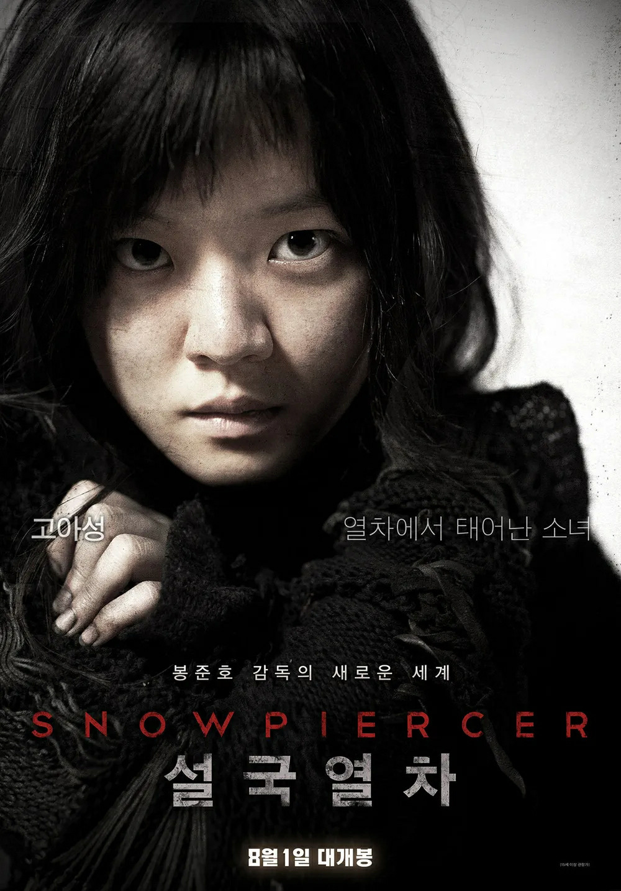

# 봉준호 영화 속 계급 구조는 어떻게 공간으로 표현되는가

봉준호 영화에서 계급은 대사가 아닌 공간과 구조를 통해 드러나며, 문·계단·창문 같은 장치를 통해 인간의 위치와 삶의 조건을 보여준다.

특히 《설국열차》와 《기생충》은 계급을 공간으로 표현하는 봉준호의 연출 방식을 가장 명확하게 보여준다. 《설국열차》는 하나의 열차 안에서 앞과 뒤로 나뉜 수평적 계급 구조를 보여주고, 《기생충》은 언덕 위 대저택과 반지하, 지하 밀실을 통해 위와 아래로 구분되는 수직적 계급 구조를 보여준다.

두 작품은 배경과 공간의 방향은 다르지만 같은 질문을 던진다. **같은 사회 안에 존재한다는 이유만으로 모두가 같은 기회와 선택권을 가질 수 있는가? 그리고 공간의 차이는 어떻게 인간의 위치와 가치를 결정하는가?**

봉준호에게 공간은 단순한 배경이 아니다. 공간은 사회적 관계를 드러내는 구조이며, 계급을 유지하는 장치다. 문은 출입을 제한하고, 계단은 위치의 차이를 보여주며, 창문은 세상을 바라보는 방식을 구분한다. 냄새와 같은 감각적 요소 역시 특정한 공간에서 살아온 흔적으로 작동한다.

따라서 봉준호 영화의 계급론을 이해하려면 인물이 무엇을 말하는지보다 **어디에 존재하고 어디로 이동하는지**를 살펴봐야 한다. 그의 영화에서 계급은 추상적인 개념이 아니라 공간의 높이와 거리, 접근 가능성으로 시각화된다.

## 1. 봉준호 영화에서 계급은 왜 공간으로 표현되는가?

사회적 계급은 일반적으로 소득, 직업, 재산 같은 경제적 요소로 설명된다. 그러나 봉준호는 이러한 추상적인 차이를 관객이 눈으로 확인할 수 있는 물리적 조건으로 변환한다. 그의 영화에서 계급은 "얼마나 많이 가지고 있는가"보다 "어디에 위치하고 무엇에 접근할 수 있는가"라는 문제로 표현된다.

공간은 인간의 삶을 결정하는 가장 기본적인 조건이다. 안전하고 넓은 공간에 사는 사람은 위험으로부터 거리를 둘 수 있지만, 불안정한 공간에 사는 사람은 같은 사건에서도 더 큰 피해를 감당해야 한다. 봉준호는 이러한 차이를 통해 계급이 단순한 개인 능력의 차이가 아니라 **출발 조건과 생활 환경의 차이에서 비롯되는 구조적 문제**임을 보여준다.

《기생충》의 반지하와 대저택은 이러한 공간적 계급 구조를 대표한다. 기택 가족이 사는 반지하는 지상과 지하 사이에 위치한다. 완전히 지하에 갇힌 공간은 아니지만, 그렇다고 지상의 안정된 생활 공간도 아니다. 거리와 연결되어 있지만 동시에 거리의 먼지, 냄새, 소음과 같은 외부 환경을 그대로 받아들인다.

반면 박 사장 가족의 집은 높은 언덕 위에 있다. 넓은 정원과 큰 창문을 가진 이 공간은 외부 세계를 선택적으로 바라볼 수 있는 위치다. 그들은 자연과 도시를 감상할 수 있지만, 도시의 불편한 현실과 직접 접촉할 필요는 적다.

두 가족은 같은 도시 안에 존재하지만 공간적 조건은 완전히 다르다. 이 차이는 단순히 집의 크기 차이가 아니다. 어떤 사람은 환경을 통제할 수 있고, 어떤 사람은 환경의 영향을 그대로 받아야 한다는 차이다.

《설국열차》에서도 같은 원리가 적용된다. 모든 사람은 하나의 열차 안에 있지만 어느 칸에 있는지에 따라 삶의 조건이 결정된다. 열차라는 하나의 공간 안에서 앞과 뒤의 위치가 곧 사회적 위치가 된다.

이처럼 봉준호는 계급을 공간으로 번역한다. 높은 곳과 낮은 곳, 앞과 뒤, 내부와 외부라는 공간적 차이는 곧 권력과 자원의 차이를 의미한다. 그리고 이러한 차이는 인간의 행동과 관계를 제한하며 기존 구조를 유지하는 힘으로 작동한다.

## 2. 봉준호는 공간의 방향으로 계급을 시각화한다

봉준호는 작품마다 서로 다른 공간 구조를 사용하지만, 그 안에서 공통적으로 **공간의 방향이 계급의 방향이 되는 구조**를 만든다. 《설국열차》에서는 앞과 뒤라는 수평적 구조가 계급을 나누고, 《기생충》에서는 위와 아래라는 수직적 구조가 계급을 나눈다.

두 작품의 차이는 공간의 형태에 있지만 핵심은 같다. 사람들은 하나의 사회 안에 존재하지만 모든 공간을 자유롭게 사용할 수 없다. 공간에 대한 접근 권한의 차이가 곧 계급의 차이를 만든다.

《설국열차》에서 열차는 단순한 이동 수단이 아니다. 그것은 지구 멸망 이후 살아남은 인간 사회의 축소판이다. 열차 안의 모든 사람은 같은 방향으로 이동하고 같은 시스템에 의존하지만, 어디에 위치하는지에 따라 완전히 다른 삶을 경험한다.

꼬리 칸의 사람들은 열차 가장 뒤쪽에서 제한된 식량과 열악한 환경을 견디며 살아간다. 그들에게 열차는 이동을 위한 공간이 아니라 생존을 위해 버텨야 하는 공간이다. 좁고 어두운 칸 안에서 그들은 최소한의 자원만 배분받으며 체제의 가장 낮은 위치에 머문다.

반면 앞 칸으로 이동할수록 공간은 점점 풍요로워진다. 식물 재배 공간, 수족관, 식당, 바와 같은 시설이 등장하고, 사람들은 생존을 넘어 문화와 여유를 경험한다. 같은 열차 안에서도 어떤 공간에 속해 있는지에 따라 인간이 누릴 수 있는 경험의 범위가 달라진다.

여기서 중요한 것은 모든 사람이 같은 열차 안에 있다는 사실이다. 열차는 하나이고 목적지도 하나다. 그러나 같은 시스템 안에 있다는 사실이 평등을 의미하지는 않는다. 오히려 하나의 공간 안에서 자원이 어떻게 배분되는지를 보여주기 때문에 계급 차이는 더욱 선명해진다.

열차 칸 사이의 문은 이러한 구조를 가장 직접적으로 보여주는 장치다. 문은 단순한 출입구가 아니다. 그것은 누가 어느 공간에 접근할 수 있는지를 결정하는 사회적 경계다.

꼬리 칸 사람들에게 앞 칸으로 가는 문은 쉽게 열리는 통로가 아니다. 그들은 폭력과 희생을 감수해야만 하나씩 문을 통과할 수 있다. 반면 앞 칸 사람들에게 같은 문은 일상적인 이동 경로일 뿐이다.

이 차이는 계급 사회에서 공간 접근성이 어떻게 다르게 작동하는지를 보여준다. 상층 계급에게 특정 공간은 당연한 권리지만, 하층 계급에게 같은 공간은 투쟁을 통해서만 얻을 수 있는 대상이다.

커티스 일행의 이동은 단순한 반란 과정이 아니다. 그것은 자신들에게 허용되지 않았던 공간을 차지하려는 움직임이며, 동시에 기존 질서의 구조를 확인하는 과정이다.

그러나 영화는 앞 칸으로 이동하는 것을 성공적인 계급 상승의 이야기로 만들지 않는다. 오히려 앞으로 나아갈수록 열차를 유지하는 시스템의 본질이 드러난다. 문제는 단순히 누가 앞 칸을 차지하느냐가 아니다. **앞과 뒤를 나누는 구조 자체가 어떻게 만들어지고 유지되는가**가 핵심 질문이 된다.

《설국열차》에서 음식은 계급 구조를 가장 직접적으로 보여주는 요소 중 하나다. 꼬리 칸 사람들이 먹는 단백질 블록은 생존을 위한 최소한의 영양 공급을 상징한다. 그것은 인간이 살아가기 위해 필요한 조건은 제공하지만, 음식이 가진 문화적 의미나 선택의 즐거움과는 거리가 멀다.

반면 앞 칸으로 이동할수록 음식은 생존 수단을 넘어 취향과 여유를 표현하는 소비 영역으로 변한다. 식사는 단순히 배고픔을 해결하는 행위가 아니라 자신이 어떤 삶을 누리고 있는지를 보여주는 문화적 경험이 된다.

이 차이는 빈곤을 단순한 경제적 부족으로 설명할 수 없다는 점을 보여준다. 가난한 사람은 단지 적은 돈을 가진 사람이 아니다. 무엇을 먹을지, 어떤 경험을 할지, 자신의 삶을 어떻게 선택할지를 결정할 수 있는 범위 자체가 제한된 사람이다.

봉준호는 음식이라는 가장 일상적인 요소를 통해 계급 차이를 설명한다. 같은 열차 안에 있지만 누군가는 생존을 위한 최소한의 것을 받고, 누군가는 삶의 질을 높이는 선택을 누린다. 따라서 음식은 경제적 격차뿐 아니라 **삶의 선택권 차이**를 보여주는 장치가 된다.

열차 안의 학교 칸은 계급 구조가 단순한 강제만으로 유지되지 않는다는 점을 보여준다. 아이들은 역사와 질서를 배우면서 현재의 체제가 자연스럽고 필연적인 것처럼 받아들인다.

학교에서는 윌포드와 열차 시스템을 절대적인 질서처럼 받아들이도록 교육한다. 학생들은 각자의 위치가 열차 전체의 생존을 위해 필요하다고 배우며, 계급 구조를 비판하기보다 받아들이도록 교육받는다.

이 장면은 《설국열차》의 계급 구조가 단순히 힘으로 유지되는 것이 아니라 **교육과 문화적 인식을 통해 재생산되는 구조**임을 보여준다. 문을 잠그고 사람을 통제하는 물리적 장벽뿐 아니라, 사람 스스로 질서를 받아들이게 만드는 보이지 않는 장벽도 존재한다.

따라서 꼬리 칸 사람들이 문을 부수고 앞으로 이동한다고 해서 모든 문제가 해결되는 것은 아니다. 물리적인 공간을 바꾸는 것과 사회 구조를 바꾸는 것은 다른 문제다. 기존 질서를 유지하는 사고방식까지 변화하지 않는다면 새로운 형태의 계급 구조가 다시 만들어질 수 있다.

열차의 가장 앞에 위치한 엔진은 이러한 구조의 정점이다. 윌포드는 엔진을 단순한 동력 장치가 아니라 열차 전체를 유지하는 절대적 중심으로 만든다.

그의 논리는 각자의 위치가 필요하다는 것이다. 꼬리 칸 사람도 필요하고, 앞 칸 사람도 필요하며, 각자가 정해진 역할을 수행해야만 전체 시스템이 유지된다는 주장이다.

이 논리는 불평등한 사회 구조가 유지되는 방식과 닮아 있다. 현재의 위치가 단순한 차별이 아니라 전체를 위한 기능적 역할이라고 설명하면, 불평등은 자연스러운 질서처럼 받아들여진다.

그러나 영화는 이러한 논리를 그대로 받아들이지 않는다. 엔진은 생존의 중심이지만 동시에 사람들이 벗어날 수 없는 감옥의 중심이기도 하다. 문제는 누가 엔진을 차지하느냐가 아니라, 엔진을 중심으로 구성된 세계 자체가 어떤 구조로 유지되는가에 있다.

## 3. 《기생충》은 어떻게 수직적 계급 구조를 보여주는가

《설국열차》가 앞과 뒤라는 수평적 공간으로 계급을 표현했다면, 《기생충》은 위와 아래라는 수직적 공간으로 같은 문제를 보여준다.

두 작품은 방향은 다르지만 공통적으로 공간의 위치가 인간의 사회적 위치와 연결된다는 점을 보여준다. 앞쪽에 있는 사람과 뒤쪽에 있는 사람, 높은 곳에 있는 사람과 낮은 곳에 있는 사람은 같은 사회에 속하지만 서로 다른 현실을 경험한다.

《기생충》에서 가장 중요한 공간 대비는 기택 가족의 반지하와 박 사장 가족의 대저택이다. 반지하는 단순히 가난한 사람이 사는 집이 아니다. 그것은 사회적으로 애매한 위치를 상징한다.

반지하는 지상과 연결되어 있다. 창문을 통해 거리의 모습을 볼 수 있고, 외부 세계와 완전히 단절되어 있지는 않다. 그러나 동시에 지상보다 낮은 위치에 있기 때문에 거리의 오염과 소음, 냄새를 그대로 받아들인다.

즉 반지하는 사회 안에 존재하지만 완전히 안정된 위치를 확보하지 못한 공간이다. 기택 가족은 사회에서 사라진 존재는 아니지만, 언제든 아래로 밀려날 수 있는 불안정한 위치에 놓여 있다.

반면 박 사장 가족의 집은 높은 언덕 위에 있다. 이 공간은 단순히 넓고 좋은 집이라는 의미를 넘어 외부 세계와 거리를 유지할 수 있는 위치를 가진다.

큰 창문을 통해 정원을 바라보는 박 사장 가족은 외부 환경을 선택적으로 받아들인다. 자연과 도시를 감상할 수 있지만, 그 안에 존재하는 불편한 현실까지 직접 경험할 필요는 없다.

이 차이는 폭우 장면에서 극적으로 드러난다. 박 사장 가족에게 폭우는 불편한 일정 변화다. 캠핑 계획은 취소되지만, 비가 그친 뒤에는 다시 일상으로 돌아갈 수 있다.

그러나 기택 가족에게 같은 폭우는 삶의 기반을 무너뜨리는 재난이다. 반지하는 침수되고, 생활 물품은 물에 잠기며, 가족은 하루아침에 모든 것을 잃는다.

같은 자연현상이지만 결과가 다른 이유는 개인의 노력 차이가 아니다. 어떤 공간에 살고 있는지, 재난을 견딜 수 있는 경제적 여력이 있는지가 결과를 결정한다.

봉준호는 이를 통해 재난 역시 계급적으로 경험될 수 있음을 보여준다. 자연은 모두에게 동일하게 발생하지만, 그것이 인간에게 미치는 영향은 결코 동일하지 않다.

계단은 《기생충》의 수직적 계급 구조를 가장 직접적으로 보여주는 장치다. 기택 가족은 박 사장의 집으로 들어가기 위해 언덕과 계단을 올라간다. 그들은 노동력을 제공하기 위해 상층 계급의 공간으로 이동한다.

하지만 폭우가 지나간 밤, 그들은 반대로 끊임없이 아래로 내려간다. 언덕을 내려가고, 계단을 내려가고, 결국 반지하라는 자신들의 현실로 돌아온다.

이 장면이 강력한 이유는 영화가 단순히 두 공간을 비교하지 않기 때문이다. 인물이 실제로 이동하는 시간을 보여주면서 관객이 계급적 거리를 체험하게 만든다.

계단은 이동 수단이지만 동시에 사회적 위치의 변화를 표현한다. 올라가는 것은 접근이고, 내려가는 것은 추락이다. 봉준호는 이러한 움직임을 통해 계급 차이를 시각적으로 전달한다.

반지하보다 더 아래에 존재하는 지하 밀실은 《기생충》의 계급 구조를 더욱 복잡하게 만든다. 영화는 단순히 부자와 가난한 사람이라는 두 계층만 보여주지 않는다. 박 사장의 대저택 위에는 상층 계급이 존재하고, 그 아래에는 기택 가족이 있으며, 더 아래에는 사회의 시야에서 완전히 사라진 근세와 문광 부부가 존재한다.

이 공간 구조는 계급을 하나의 선이 아니라 여러 층으로 이루어진 피라미드로 보여준다.

- **언덕 위 대저택**: 자본과 권력을 가진 상층 계급의 공간
- **반지하**: 노동력을 제공하지만 불안정한 하층 계급의 공간
- **지하 밀실**: 사회적 관계와 제도에서 탈락한 극단적 주변부의 공간

중요한 점은 가장 아래에 있는 사람이 상층 계급에게조차 보이지 않는다는 것이다. 박 사장 가족은 자신들의 집 아래에 다른 인간이 존재한다는 사실을 알지 못한다. 자신의 공간 안에 자신이 인식하지 못하는 사람이 있다는 설정은 계급 구조의 가장 잔인한 특징을 보여준다.

상층 계급은 아래를 바라보지 않는다. 반면 아래에 있는 사람은 위를 바라본다. 기택 가족은 박 사장 가족의 생활을 관찰하고 그들의 공간 안으로 들어가지만, 근세는 아예 존재 자체가 숨겨진다.

따라서 《기생충》의 공간 구조는 단순한 빈부 차이가 아니다. 누군가는 타인의 삶을 선택적으로 볼 수 있고, 누군가는 끊임없이 위를 바라보지만 결코 같은 위치에 도달하지 못한다. 그리고 누군가는 사회의 시야에서 완전히 사라진다.

창문 역시 이러한 차이를 보여주는 중요한 공간 장치다. 박 사장 집의 거실에 있는 큰 창문은 외부 세계를 바라보는 전망의 기능을 한다. 정돈된 정원을 바라보는 창문은 상층 계급이 세상을 감상하는 방식과 연결된다.

그러나 기택 가족의 반지하 창문은 같은 창문이라는 기능을 가지고 있지만 완전히 다른 의미를 가진다. 그것은 풍경을 즐기기 위한 통로가 아니라 외부 환경에 노출되는 통로다.

반지하 창문으로 들어오는 것은 아름다운 전망이 아니다. 지나가는 사람의 발, 거리의 소음, 방역 작업에서 발생하는 연기처럼 불쾌한 현실이다.

같은 건축 요소라도 계급에 따라 경험이 달라진다. 상층 계급에게 창문은 세상을 바라보는 권리지만, 하층 계급에게 창문은 외부 환경을 견뎌야 하는 틈이다.

## 4. 냄새와 선은 보이지 않는 계급 경계다

《기생충》에서 냄새는 계급 차이를 가장 직접적으로 감각화하는 장치다. 기택 가족은 옷차림과 말투, 행동을 바꾸면서 박 사장 가족의 공간 안으로 들어간다. 그들은 교육자, 기사, 가사도우미라는 역할을 수행하며 겉으로는 상층 공간에 적응한다.

그러나 박 사장 가족은 반복적으로 그들에게서 특정한 냄새를 느낀다.

냄새가 중요한 이유는 그것이 개인의 의지만으로 쉽게 제거할 수 없는 흔적이기 때문이다. 말투와 행동은 노력으로 바꿀 수 있지만, 어떤 공간에서 살아왔는지에 따라 몸에 남은 감각적 흔적까지 완전히 숨기기는 어렵다.

따라서 냄새는 단순한 위생 문제가 아니다. 그것은 생활 조건이 인간의 몸에 남긴 흔적이며, 개인이 선택하지 않은 환경이 사회적 평가의 기준이 되는 순간을 보여준다.

기택이 느끼는 모욕은 냄새 자체 때문이 아니다. 자신의 능력이나 행동이 아니라 자신이 살아온 환경 때문에 평가받는다는 감각 때문이다.

박 사장이 말하는 ‘선’ 역시 같은 구조를 가진다. 그는 노동자가 자신의 역할을 수행하는 것은 받아들인다. 그러나 일정한 거리 이상 가까워지는 것은 허용하지 않는다.

노동자는 집 안으로 들어올 수 있지만 가족이 될 수는 없다. 생활을 돕는 역할은 할 수 있지만 그 공간의 주인이 될 수는 없다.

여기서 선은 물리적으로 그어진 경계가 아니다. 고용주와 노동자 사이에 존재하는 사회적 거리다. 현대 사회에서는 과거처럼 명확한 신분제가 존재하지 않지만, 계급의 경계는 이러한 보이지 않는 규칙을 통해 유지된다.

《기생충》이 보여주는 비극은 이 선이 무너지는 순간 발생한다. 서로 다른 계급이 가까워질 수는 있지만 완전히 같은 위치에 설 수는 없다. 가까워지는 순간 오히려 차이가 더욱 선명하게 드러난다.

봉준호 영화에서 계급 문제는 단순히 상층과 하층의 대립으로 끝나지 않는다. 오히려 더 중요한 것은 불안정한 위치에 있는 사람들이 서로 경쟁하게 되는 구조다.

기택 가족과 문광 가족은 모두 박 사장 가족의 공간에 의존한다. 그러나 서로 연대하지 못하고 상대방을 제거해야 살아남는 상황에 놓인다.

이것은 개인의 성격 문제가 아니다. 선택 가능한 자원이 부족하고 생존의 여지가 줄어들면 같은 위치에 있는 사람들이 서로 경쟁하게 된다.

봉준호는 이를 통해 계급 구조가 단순히 위와 아래를 나누는 것이 아니라 아래쪽 내부까지 분열시킨다는 점을 보여준다. 구조적 불평등은 상층과 하층 사이의 거리만 만드는 것이 아니라 하층 내부의 경쟁과 적대까지 만들어낸다.

## 5. 봉준호 영화에서 계급 구조는 어떻게 확장되는가?

봉준호의 계급적 시선은 《기생충》에서 갑자기 등장한 것이 아니다. 그의 초기 작품부터 인간이 자신이 속한 구조와 환경에 의해 어떻게 행동하는지가 중요한 주제로 등장했다.

《플란다스의 개》에서는 아파트라는 일상적 공간 안에서 서로 다른 사람들이 자신의 욕망을 추구한다. 교수 임용을 기다리는 사람, 주민, 경비원 등 다양한 인물들은 같은 건물 안에 있지만 서로 다른 이해관계를 가진다.

이 작품에서 중요한 것은 봉준호가 인물을 단순히 피해자와 가해자로 나누지 않는다는 점이다. 불공정한 환경 속에서 살아가는 사람도 자신의 생존을 위해 다른 사람에게 피해를 줄 수 있다.

이러한 관점은 이후 작품에서도 반복된다. 문제는 특정한 악인의 존재보다 인간이 자신이 속한 구조 속에서 어떤 선택을 하게 되는가이다.

《살인의 추억》은 직접적인 계급 영화는 아니지만, 개인이 거대한 시스템 앞에서 느끼는 무력감을 보여준다. 경찰 조직은 권력을 가진 기관이지만 사건 해결 과정에서 한계를 드러낸다.

봉준호는 이를 통해 개인의 문제가 아니라 시스템이 인간의 행동을 어떻게 제한하는지에 관심을 보인다. 이후 작품에서는 그 시스템이 계급, 자본, 기업의 형태로 확장된다.

《괴물》에서는 국가 시스템과 개인의 관계가 중심이 된다. 강두 가족은 가족을 구하기 위해 움직이지만, 국가는 시민을 보호하기보다 통제와 관리의 대상으로 바라본다.

《옥자》에서는 이러한 구조가 글로벌 자본으로 확장된다. 미란도 코퍼레이션은 생명체를 상품으로 만들고 소비 시스템 안에 배치한다. 옥자는 미자에게 가족이지만 기업에게는 상품이다.

이 차이는 봉준호 영화에서 반복되는 질문과 연결된다. 무엇이 가치 있는 존재로 인정받는가? 그리고 누가 그 가치를 결정하는가?

《미키 17》에서는 이 질문이 인간 자체로 확장된다. 미키는 위험한 노동을 수행하는 소모 가능한 존재로 취급된다. 죽음 이후 다시 만들어질 수 있다는 설정은 인간의 가치가 시스템의 필요에 따라 계산될 수 있음을 보여준다.

이는 《옥자》에서 생명이 상품화되는 문제와 연결된다. 다만 《미키 17》에서는 그 대상이 인간 자신이다.

봉준호의 계급론은 결국 단순한 부자와 가난한 사람의 문제가 아니다. 그의 영화가 계속 묻는 것은 인간의 가치가 어떤 기준으로 결정되는가라는 문제다.

## 결론

봉준호 영화의 가장 중요한 특징은 사회적 불평등을 설명하는 대신 공간과 구조로 보여준다는 점이다.

《설국열차》의 앞과 뒤, 《기생충》의 위와 아래, 《옥자》의 기업 시스템, 《미키 17》의 우주 식민지는 서로 다른 배경을 가지고 있지만 같은 질문으로 연결된다.

누가 공간을 소유하는가? 누가 그 공간에 접근할 수 있는가? 누가 위험을 감당하는가? 그리고 그 차이는 어떻게 인간의 가치 차이로 이어지는가?

봉준호는 특정 계층을 단순히 비난하지 않는다. 대신 계급 구조가 인간의 행동과 관계를 어떻게 변화시키는지 보여준다.

그의 영화에서 계급은 배경이 아니다. 인물의 선택을 만드는 환경이고, 갈등을 발생시키는 구조이며, 인간이 서로를 바라보는 방식을 결정하는 보이지 않는 힘이다.

《기생충》의 계단과 냄새, 《설국열차》의 문과 칸, 《옥자》의 상품화된 생명, 《미키 17》의 소모되는 인간은 모두 하나의 방향으로 연결된다.

인간은 모두 같은 가치를 가진다고 말하지만, 현실에서는 공간과 자본, 권력에 따라 다르게 평가된다.

봉준호 영화가 불편한 이유는 바로 이 지점을 건드리기 때문이다. 관객은 화면 속 계급 구조를 바라보지만, 결국 그 구조가 특정한 영화 속 세계만의 문제가 아니라 현실 사회와 연결되어 있다는 사실을 마주하게 된다.

그의 영화는 누가 옳고 누가 나쁜지를 묻는 이야기가 아니다. 사람을 서로 다른 위치와 가치로 나누는 구조가 인간의 삶과 관계를 어떻게 변화시키는지를 묻는 작품이다.

