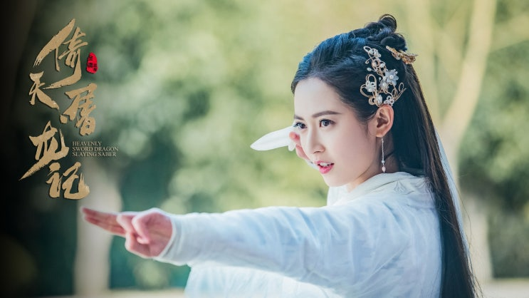
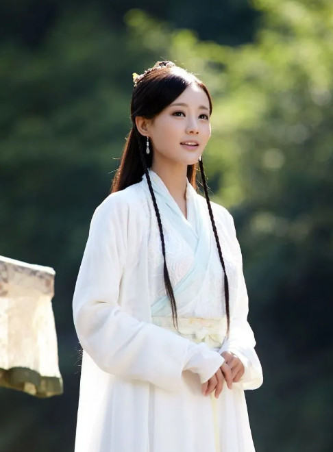

# 의천도룡기 조민 사조영웅전 황용 판타지가 된 사랑

김용의 무협소설을 떠올리면 대부분은 화려한 무공이나 거대한 강호의 이야기를 먼저 생각한다. 하지만 사조삼부곡을 끝까지 읽고 나면 결국 가장 오래 기억에 남는 것은 **사랑**이다.

특히 **황용**과 **조민**은 시대도 작품도 다르지만 놀라울 정도로 비슷한 사랑의 방식을 보여준다. 두 사람은 단순히 아름다운 여주인공이 아니라, 자신이 선택한 단 한 사람을 위해 자신의 재능과 인생을 모두 걸었던 인물들이다.

현대의 기준으로 보면 이러한 사랑은 현실성이 부족한 이야기처럼 보일 수도 있다. 그러나 한편으로는 수많은 남성들이 지금도 이 두 사람을 최고의 여성 캐릭터로 기억하는 이유 역시 여기에 있다.

이 글에서는 **황용과 조민이 왜 닮아 있는지**, **왜 남성들에게 가장 강력한 판타지로 남아 있는지**, 그리고 **현대 사회에서 이러한 사랑이 왜 점점 사라지고 있는 것처럼 느껴지는지**를 함께 이야기해 보려고 한다.

## 핵심 요약

* **황용**과 **조민**은 김용 소설을 대표하는 최고의 지략가형 여주인공이다.
* 두 사람은 모두 자신의 모든 능력을 **사랑하는 사람**에게 아낌없이 사용한다.
* 현대 사회가 이러한 사랑을 비현실적으로 만든 것은 가치관보다 사회 구조의 변화와 더 깊은 관련이 있다.
* 그러나 인간이 오래도록 추구해 온 **신뢰**, **헌신**, **상호보완**이라는 관점에서는 지금도 강한 설득력을 가진다.
* 이 글은 과거의 사랑을 무조건 이상화하기보다 인간이 오래도록 추구해 온 사랑의 원형을 돌아보려는 목적을 가진다.

## 1. 황용과 조민은 놀라울 정도로 닮아 있다

처음 보면 두 사람은 전혀 다른 인물처럼 보인다. 
황용은 《사조영웅전》의 여주인공이고, 조민은 《의천도룡기》의 여주인공이다.

살아온 시대도 다르고 처한 상황도 다르다. 하지만 조금만 깊게 들여다보면 두 사람은 거의 같은 철학으로 사랑을 한다.

공통점을 정리하면 다음과 같다.

* **압도적인 지능**을 가진 여성이다.
* **세상의 위선**을 누구보다 잘 꿰뚫어 본다.
* 뛰어난 **권력과 배경**을 가지고 있다.
* 남성에게 의존하지 않아도 충분히 성공할 수 있다.
* 그럼에도 자신이 선택한 단 한 사람에게 모든 능력을 사용한다.

가장 흥미로운 부분은 마지막이다. 두 사람은 결코 약한 여성이 아니다. 오히려 혼자서도 세상을 살아갈 수 있는 능력을 이미 갖춘 여성들이다. 그런데도 자신의 능력을 가장 사랑하는 사람과 함께 살아가기 위해 사용한다.

여기에서 많은 독자들이 감동을 받는다.

  

## 2. 두 사람이 선택한 남자는 놀라울 만큼 비슷하다

더 흥미로운 것은 상대 남성이다.  
황용은 **곽정**을 선택한다.  
조민은 **장무기**를 선택한다.  

두 사람은 외형적으로도 상당히 닮았다.

* 화려한 말재주가 없다.
* 계산에 능하지 않다.
* 지나칠 만큼 착하다.
* 사람을 쉽게 믿는다.
* 권력욕이 거의 없다.

현대 기준으로 보면 장점보다 단점이 먼저 보일 수도 있다. 곽정은 너무 우직하다. 장무기는 너무 우유부단하다. 실제로 현대 독자들도 이 두 사람을 답답하게 느끼는 경우가 많다. 그런데 황용과 조민은 오히려 바로 그 점 때문에 사랑하게 된다.

왜일까?

두 사람은 세상에서 가장 영리한 여성이다. 거짓말도 쉽게 알아차린다. 사람의 욕심도 금방 읽는다. 권력 다툼도 누구보다 잘 이해한다. 그래서 오히려 계산하지 않는 사람에게 마음이 간다. 자신보다 똑똑한 사람을 원한 것이 아니다.  
자신보다 **진심인 사람**을 원했다.

이것이 김용이 반복해서 보여주는 사랑의 공식이다.  

## 3. 사랑을 시작한 이후의 모습은 더욱 닮아 있다

많은 사람들은 황용과 조민이 사랑에 빠지는 과정만 기억한다. 하지만 진짜 중요한 것은 그 이후다. 사랑을 시작한 뒤 두 사람은 놀라울 정도로 같은 행동을 한다.

### 자신의 능력을 아끼지 않는다

두 사람 모두 자신의 재능을 숨기지 않는다. 오히려 더 적극적으로 사용한다. 황용은 곽정의 부족한 부분을 채워 준다.

* 전략을 세운다.
* 적의 계략을 간파한다.
* 위기를 해결한다.
* 무림의 판을 읽는다.

곽정이 영웅으로 성장하는 과정에는 항상 황용이 있었다. 조민 역시 마찬가지다. 장무기가 감정 때문에 흔들릴 때마다 현실적인 판단을 내린다.

* 정치를 읽는다.
* 적의 심리를 분석한다.
* 위험을 먼저 발견한다.
* 필요하면 자신의 목숨까지 건다.

두 사람은 남편 뒤에 숨어 있는 여성이 아니다. 오히려 언제나 가장 앞에서 상황을 해결하는 인물이다. 

### 자신의 자존심을 버리는 것이 아니다

여기에서 오해하면 안 되는 부분이 있다.

황용과 조민은 자신의 인생을 포기한 것이 아니다. 오히려 자신의 의지로 선택했다. 누군가에게 강요받지 않았다. 사회가 시켜서도 아니다. 아버지가 결정해 준 결혼도 아니다.

자신이 직접 사람을 선택했고, 그 사람과 함께 살아가는 것을 자신의 삶으로 결정했다. 

즉, 두 사람의 헌신은 **강요된 희생**이 아니라 **주체적인 선택**이다.  
바로 이 점이 두 캐릭터를 지금도 특별하게 만든다.

## 4. 조민은 모든 것을 버린 것이 아니라, 자신이 가장 소중하게 여긴 것을 선택했다

조민을 단순히 "남자 때문에 모든 것을 버린 여자"라고 이해하면 캐릭터를 절반밖에 이해하지 못한 것이다.

조민은 원나라 최고의 권력가 집안에서 태어났다. 황실의 군주이며,아버지는 천하를 호령하는 명장이고, 오빠 역시 군대를 지휘하는 최고의 장수다.

원한다면 평생 권력과 부를 누릴 수 있었다. 하지만 그녀는 장무기를 선택한다. 겉으로 보기에는 모든 것을 버린 것처럼 보인다. 그러나 조금 다르게 생각해 볼 수도 있다. 조민은 권력을 버린 것이 아니라, 자신에게 **더 가치 있는 삶**을 선택한 것이다.

그녀는 장무기를 얻기 위해 황족 신분도 포기한다. 무림인들의 증오도 감수한다. 매국노라는 비난도 받아들인다. 심지어 가족과도 갈등한다. 그러면서도 **한 번도 자신의 선택을 후회**하지 않는다. 사랑이 그녀를 약하게 만든 것이 아니다. 오히려 더욱 강하게 만들었다.

이것이 조민이라는 인물이 지금까지도 최고의 여주인공으로 평가받는 이유다.

## 5. 황용 역시 같은 방식으로 사랑한다

황용은 겉으로 보기에는 조민보다 훨씬 밝고 장난기가 많은 인물이다. 하지만 사랑을 대하는 방식은 놀라울 정도로 닮아 있다. 황용 역시 곽정을 처음 만났을 때 그의 무공이나 명성을 보고 반한 것이 아니다.

거지 행색으로 돌아다니던 자신을 아무 조건 없이 따뜻하게 대해 준 **진심**에 마음을 빼앗겼다. 곽정은 황용이 누구인지 몰랐다. 그녀가 동사 황약사의 딸이라는 사실도 몰랐다. 천재라는 사실도 몰랐다. 그저 춥고 배고픈 어린 거지를 도와주었다.

황용은 평생 수많은 사람을 만났지만 이런 사람은 처음이었다. 그래서 곽정을 선택한다. 이후 황용은 자신의 모든 재능을 곽정을 위해 사용한다.

* **지략**으로 위기를 해결한다.
* **심리전**으로 적을 무너뜨린다.
* **요리**로 홍칠공의 마음을 얻는다.
* **기문둔갑**으로 수많은 적을 농락한다.
* **개방**을 이끌며 무림의 질서를 유지한다.

곽정이 영웅이라면, 황용은 그 영웅을 완성시키는 설계자였다. 하지만 황용은 자신을 희생했다고 생각하지 않는다. 그것이 자신이 가장 행복한 삶이라고 믿었기 때문이다.

## 6. 그래서 남자들에게는 판타지 그 이상의 의미가 된다

많은 사람들이 이것을 남성 판타지라고 부른다. 하지만 조금 다르게 생각해 볼 수도 있다.

남성이 동경하는 것은 아름다운 여성이 아니다. 나보다 뛰어난 사람이 끝까지 내 편이 되어 주는 관계다. 그것은 권력도 아니고 소유도 아니다. 평생 변하지 않을 것이라는 믿음이다.

그래서 조민과 황용은 단순한 판타지가 아니라, 인간이 오래도록 이상으로 여겨 온 동반자의 모습에 가깝다.

이러한 관계는 단순한 연애가 아니다.

**절대적인 신뢰**다.

인간은 누구나 자신의 약점을 안고 살아간다. 곽정도 부족했다. 장무기도 부족했다. 황용과 조민은 그 부족함을 누구보다 잘 알고 있었다.  
그럼에도 떠나지 않았다. 오히려 자신이 그 빈자리를 채우겠다고 선택했다. 그래서 수많은 남성들은 이 사랑을 단순한 로맨스로 받아들이지 않는다.

인생에서 단 한 번이라도 만나 보고 싶은 **이상적인 동반자**의 모습으로 기억한다.

## 7. 현대에서는 왜 비현실적인 사랑처럼 보일까

그렇다면 이런 사랑은 정말 비현실적인 것일까? 

여기서 중요한 것은 사랑 자체가 아니라 **사회 구조**다. 현대 사회는 개인의 독립을 매우 중요하게 생각한다.  
경제 역시 마찬가지다. 결혼하더라도 각자의 직업을 유지해야 한다. 맞벌이는 사실상 필수가 되었다. 자산 가격은 계속 상승했고, 주거비는 급격히 높아졌으며, 평생직장은 거의 사라졌다.
이러한 환경에서는 어느 한 사람이 자신의 모든 것을 상대에게 맡기는 것이 너무 위험하다.

예를 들어,

조민처럼 모든 권력을 포기하고, 황용처럼 자신의 인생을 상대와 함께 설계하는 것은 현실적으로 엄청난 위험을 동반한다.

만약 관계가 실패하면, 잃는 것이 너무 많기 때문이다.

그래서 현대인은 사랑이 부족해서 계산적으로 변한 것이 아니다. 계산하지 않으면 생존하기 어렵기 때문에 계산하게 된 것이다. 이 점은 분명히 구분해야 한다.  

어쩌면 우리는 사랑을 잃어버린 것이 아니라, **그런 사랑을 선택할 수 없는 사회 속에서** 살아가고 있는 것인지도 모른다.

## 8. 그렇다고 황용과 조민의 사랑이 시대착오적인 것은 아니다

여기에서 많은 사람들이 오해한다. 현대 사회에서 실천하기 어렵다고 해서, 그 가치 자체가 잘못된 것은 아니다. 오히려 그 반대일 수도 있다.

황용과 조민이 보여 준 것은 단순한 희생이 아니다. 그들의 사랑은 언제나 다음과 같은 특징을 가진다.

* **신뢰**가 먼저 존재한다.
* **존중**이 먼저 존재한다.
* **선택**이 강요되지 않는다.
* 서로를 **이용하지 않는다.**
* 상대를 자신의 소유물로 생각하지 않는다.
* 함께 성장하는 것을 당연하게 여긴다.

현대 사회에서도 이런 관계는 여전히 건강한 관계의 조건이다. 문제는 그 표현 방식이 달라졌을 뿐이다. 과거에는 평생 남편을 보필하는 모습으로 나타났다면, 오늘날에는 함께 회사를 운영하거나, 함께 아이를 키우거나, 서로의 커리어를 존중하는 형태로 나타날 수도 있다.

즉,

겉모습은 달라졌지만, 본질은 크게 변하지 않았다.

## 9. 우리가 잃어버린 것은 사랑이 아니라 신뢰일지도 모른다

현대의 연애는 과거보다 훨씬 자유롭다.

결혼도 자유다. 이혼도 자유다. 직업도 자유다. 삶의 방식도 자유다.  
그러나 역설적으로 사람들은 이전보다 더 쉽게 사랑을 시작하지 못한다. 결혼도 줄어들고, 출산도 줄어들고, 장기적인 관계 역시 점점 줄어들고 있다. 물론 여기에는 수많은 경제적 원인이 존재한다.

* 높은 집값
* 불안정한 고용
* 양육비 부담
* 교육비 부담
* 노후 불안

이러한 요소들이 결혼을 어렵게 만든 것은 분명한 사실이다. 그러나 인간의 심리만 놓고 본다면 또 하나의 변화가 있다. 바로 **신뢰의 비용**이다.

예전에는 사람을 믿는 것이 미덕이었다. 지금은 너무 쉽게 이용당할 수도 있다. 예전에는 헌신이 사랑의 증거였다. 지금은 자기희생으로 받아들여질 수도 있다. 예전에는 상대를 위해 양보하는 것이 아름다웠다.

지금은 손해 보는 행동으로 평가받기도 한다. 이런 사회에서 황용과 조민 같은 사랑이 점점 비현실적으로 보이는 것은 어쩌면 당연한 결과일지도 모른다. 하지만 동시에 우리는 한 가지 질문도 던질 수 있다. 

정말 인간의 본성까지 바뀐 것일까? 아니면 사회가 그렇게 행동할 수 없는 환경으로 변한 것일까? 이 질문은 생각보다 훨씬 중요하다.

그래서 사람들은 점점 더 상대를 믿기보다 확인하려 한다. 사랑보다 안전을, 헌신보다 손실을 먼저 계산한다. 이것이 현대인의 잘못이라기보다 사회 구조가 만들어 낸 자연스러운 결과일 수도 있다.

## 10. 인간은 원래 어떤 사랑을 꿈꾸도록 진화했을까

인간은 수만 년 동안 혼자 살아남은 생물이 아니다.

생존은 언제나 **가족**, **공동체**, **신뢰**를 중심으로 이루어졌다. 남녀의 역할은 시대마다 조금씩 달랐지만, 오랫동안 유지된 공통점이 하나 있다. 바로 서로를 **경쟁자**가 아니라 **동반자**로 인식했다는 점이다.

인간은 오랫동안 경쟁보다 협력을 통해 살아남았다. 그렇기에 서로를 깊이 신뢰하는 관계에서 안정감을 느끼는 것은 매우 자연스러운 일이다.

물론 과거의 사회를 무조건 이상화할 수는 없다. 여성의 권리가 충분히 보장되지 않았던 시대도 있었고, 가부장적인 문화 속에서 많은 희생이 강요되기도 했다. 그러한 역사까지 미화해서는 안 된다.

하지만 그렇다고 인간이 오랫동안 유지해 온 **상호 보완적인 관계**까지 모두 부정할 필요는 없다. 황용과 조민이 보여 준 사랑은 권력 관계가 아니다. 누군가에게 복종하는 관계도 아니다.

오히려 각자의 능력을 인정한 뒤, 그 능력을 가장 소중한 사람에게 기꺼이 사용하려는 관계에 가깝다. 그래서 두 사람의 사랑은 지금도 많은 독자들에게 자연스럽게 받아들여진다.

## 11. 비현실적인 것은 사랑이 아니라, 그런 사랑을 하기 어려운 사회일지도 모른다

오늘날 많은 사람들은 황용과 조민 같은 사랑을 두고 현실성이 없다고 말한다.

하지만 다른 관점에서도 생각해 볼 수 있다. 정말 비현실적인 것은 그들의 사랑일까? 아니면 그런 사랑을 선택하기 어려운 지금의 사회일까? 현대 사회에서는 상대를 전적으로 신뢰하는 것이 위험이 될 수도 있다.

경제적인 문제도 그렇다. 경력 단절의 문제도 그렇다. 관계가 끝났을 때 감당해야 할 손실 역시 과거보다 훨씬 크다. 결국 사람들은 사랑이 부족해서 계산적인 것이 아니다. 상처를 최소화하기 위해 계산하는 것이다.

그래서 현대인의 사랑은 종종 **위험 관리**처럼 변한다.

* 얼마나 경제력이 있는가.
* 직업은 안정적인가.
* 가치관은 맞는가.
* 손해를 보지는 않을까.
* 미래는 안전한가.

이런 질문들은 모두 현실적으로 중요한 문제다. 하지만 동시에 사랑의 본질을 조금씩 뒤로 밀어내기도 한다. 신뢰보다 계약이, 헌신보다 계산이, 동행보다 위험 관리가 우선되는 순간, 사랑은 점점 더 어려워질 수밖에 없다.

## 12. 남자다움과 여자다움을 다시 생각해 볼 필요가 있다

오늘날 **남자답다**, **여자답다**라는 표현은 쉽게 논쟁의 대상이 된다.

실제로 시대가 변하면서 과거의 역할을 그대로 적용하는 것은 어렵다. 또 그렇게 해서도 안 된다. 하지만 역할과 고정관념을 걷어낸 뒤에도 남는 것이 있다. 바로 서로를 위해 기꺼이 책임지려는 마음이다. 곽정은 끝까지 백성을 지키려 했다.

장무기는 권력을 탐하지 않았다. 황용은 자신의 재능을 가장 사랑하는 사람에게 아낌없이 사용했다. 조민은 자신의 선택에 끝까지 책임을 졌다.

이것은 남성과 여성의 우열이 아니다. 사람이 사람을 사랑하는 방식이다. 그래서 황용과 조민을 단순히 "남성 판타지를 위한 캐릭터"라고만 평가하는 것은 이들의 본질을 충분히 설명하지 못한다.

**황용과 조민**은 남성에게 복종한 여성이 아니다. 자신이 가장 사랑하는 사람을 스스로 선택했고, 그 선택에 끝까지 책임진 여성이다. 그래서 두 사람은 지금도 **가장 주체적인 여성 캐릭터** 가운데 하나로 평가받는다.

## 13. 그래서 김용의 무협은 결국 사랑 이야기다

김용의 작품에는 수많은 절세고수들이 등장한다. 천하제일의 무공도 나온다. 나라가 멸망하고, 황제가 바뀌며, 무림의 패권도 끊임없이 이동한다. 하지만 시간이 흐른 뒤 독자들이 기억하는 것은 의외로 다른 장면들이다.

곽정이 아무 조건 없이 황용을 따뜻하게 대하던 순간, 황용이 곽정을 위해 계략을 세우던 순간, 조민이 모든 비난을 감수하면서도 장무기를 선택하던 순간, 장무기가 평생 조민의 눈썹을 그려 주겠다고 약속하던 마지막 장면.

무공은 이야기의 **무대**였다.
권력은 이야기의 **배경**이었다.

결국 작품을 움직인 것은 언제나 **사랑**이었다. 그리고 그 사랑은 수많은 전투보다 오래 기억되었다.  
그래서 사조삼부곡은 무협소설인 동시에, 인간이 어떤 사람과 평생을 함께 살아가고 싶은지에 대한 긴 질문이기도 하다.

## 결론

황용과 조민의 사랑은 현대 사회에서는 비현실적으로 느껴질 수 있다.
그러나 그것이 곧 잘못된 사랑이라는 의미는 아니다.

그들의 사랑에는 

**신뢰**가 있다. **존중**이 있다. **헌신**이 있다.

나는 과거의 사회로 돌아가야 한다고 생각하지 않는다. 시대는 변했고, 남성과 여성 모두 더 많은 자유를 얻었다. 그것은 분명 소중한 변화다.

하지만 한편으로는 조민과 황용 같은 사랑이 비현실적인 것으로 받아들여지는 시대가 되었다는 사실이 조금은 슬프다. 그들이 특별했던 이유는 자신의 삶을 버렸기 때문이 아니다. 자신이 가장 사랑하는 사람을 끝까지 믿었기 때문이다.

어쩌면 인간은 지금도 마음속 깊은 곳에서는 그런 사랑을 가장 이상적인 관계라고 느끼고 있는지도 모른다.
그래서 김용의 작품은 수십 년이 지난 지금도 여전히 사람들의 마음을 움직인다.

## 자주 묻는 질문(FAQ)

### 황용과 조민 중 누가 더 뛰어난 지략가일까?

둘 다 김용 소설을 대표하는 최고의 지략가다. 다만 **황용**은 임기응변과 심리전에 강하고, **조민**은 정치와 군사 전략처럼 더 큰 판을 설계하는 능력이 뛰어나다.

### 왜 두 사람은 평범한 영웅보다 부족한 남자를 선택했을까?

두 사람 모두 세상의 계산과 욕망을 누구보다 잘 이해했다. 그래서 화려한 능력보다 **진심**, **선함**, **신뢰**를 더 높은 가치로 여겼다고 해석할 수 있다.

### 현대에도 황용이나 조민 같은 사랑이 가능할까?

가능은 하지만 과거보다 훨씬 어려워졌다. 개인이 감당해야 하는 **경제적 위험**과 **사회적 리스크**가 커졌기 때문이다. 다만 서로를 깊이 신뢰하고 함께 성장하려는 관계 자체는 지금도 충분히 현실적인 가치다.

### 김용은 왜 이런 여성상을 반복해서 그렸을까?

김용은 단순히 아름다운 여주인공을 만든 것이 아니라, 남성 주인공의 부족함을 채우고 함께 성장하는 **동반자형 여성상**을 꾸준히 그렸다. 그래서 황용과 조민은 지금까지도 그의 대표적인 여성 캐릭터로 평가받는다.

### 이 글은 과거의 결혼관으로 돌아가자는 주장인가?

그렇지는 않다. 과거의 사회 구조에는 분명한 한계와 불평등도 존재했다. 이 글이 말하고 싶은 것은 과거의 제도를 복원하자는 것이 아니라, 시대가 바뀌더라도 **신뢰**, **헌신**, **책임감**, **평생의 동반자 의식** 같은 인간 관계의 본질적 가치는 여전히 소중하다는 점이다.

### 조민과 황용의 사랑은 현대에도 이상적인 관계라고 볼 수 있을까?

사랑의 표현 방식은 시대에 따라 달라질 수 있다. 하지만 서로를 깊이 신뢰하고, 자신의 능력을 아낌없이 나누며, 함께 성장하려는 관계는 시대가 바뀌어도 여전히 많은 사람들이 이상적인 동반자 관계로 생각하는 가치다.