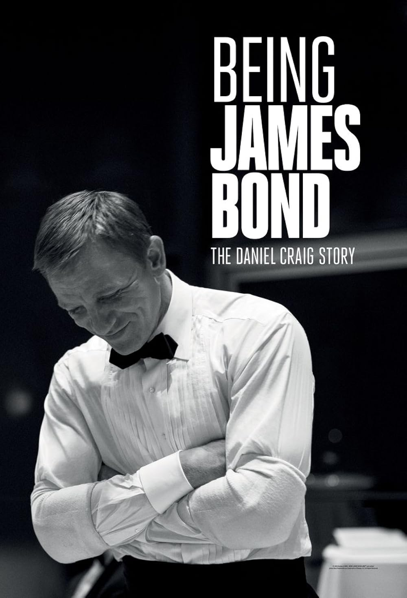
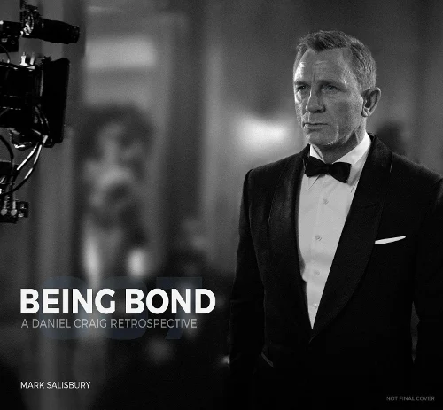
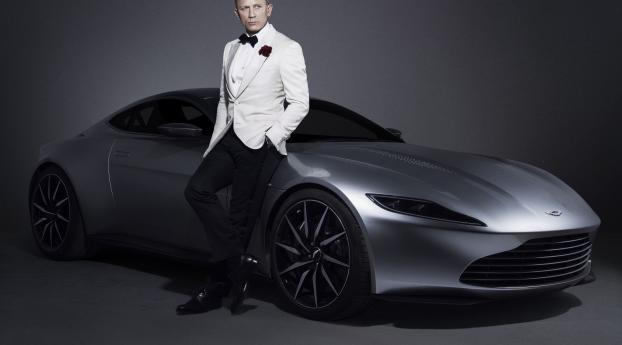
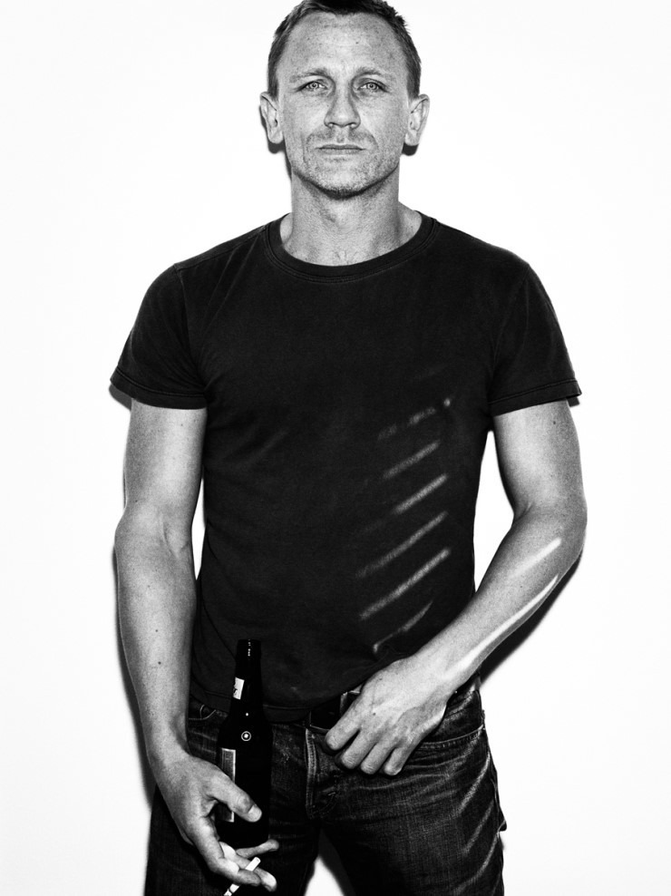

# 제임스 본드 007 다니엘 크레이그 역대 최고의 캐스팅

다니엘 크레이그는 가장 큰 캐스팅 논란을 극복하고 007 시리즈, 역대 최고의 제임스 본드 가운데 한 명으로 평가받게 되었다. 그는 처음부터 환영받았던 배우가 아니라 시리즈 역사상 가장 거센 반발을 받은 배우였다. 그러나 [카지노 로얄]을 시작으로 기존의 제임스 본드를 완전히 다른 방향으로 재해석했고, 침체기에 접어들던 시리즈를 다시 세계 정상급 프랜차이즈로 끌어올렸다. 이러한 변화는 단순히 배우 한 명의 성공이 아니라 007이라는 브랜드 자체가 시대 변화에 적응하는 과정이기도 했다.

## 핵심 요약

* **다니엘 크레이그는 역대 제임스 본드 배우 가운데 가장 큰 캐스팅 반발을 경험했다.**
* **금발, 작은 체격, 거친 이미지 때문에 원작 파괴라는 비판을 받았지만 작품 공개 후 여론이 완전히 뒤집혔다.**
* **카지노 로얄은 시리즈의 방향 자체를 바꾸며 현대적인 007의 기준을 새롭게 만들었다.**
* **크레이그는 인간적인 약점과 현실적인 액션을 통해 기존 본드와 차별화된 캐릭터를 구축했다.**
* **그의 성공은 배우 개인의 역량뿐 아니라 제작진의 과감한 전략적 선택이 만들어낸 결과였다.**

## 1. 역대 가장 논란이 컸던 제임스 본드 캐스팅이었던 이유

2005년 10월 14일, 이온 프로덕션은 피어스 브로스넌의 뒤를 이을 여섯 번째 공식 제임스 본드로 **다니엘 크레이그**를 발표했다. 지금은 상상하기 어렵지만 당시 분위기는 축하보다는 비난에 가까웠다. 영국 언론은 물론 오랜 팬들까지 캐스팅을 반대했고, 인터넷에는 보이콧 운동이 벌어질 정도였다.

공식 발표 행사 역시 조롱의 대상이 되었다. 런던 템스강에서 해군 고속정을 타고 등장한 그는 안전 규정에 따라 형광색 구명조끼를 착용하고 있었는데, 타블로이드 언론은 이를 두고 "세계 최고의 스파이가 구명조끼를 입고 등장했다"며 비웃는 기사를 경쟁적으로 내보냈다. 영화가 제작되기도 전에 배우의 이미지를 조롱하는 분위기가 형성된 것이다.

이처럼 발표 직후부터 부정적인 여론이 폭발한 사례는 역대 007 시리즈에서도 매우 이례적이었다.

## 2. 팬들이 다니엘 크레이그를 받아들이지 못했던 이유는 무엇이었을까?

당시 팬들이 가장 크게 문제 삼은 것은 **외형적인 이미지**였다. 제임스 본드는 수십 년 동안 일정한 이미지가 축적되어 있었다.

| 항목  | 기존 본드 이미지    | 다니엘 크레이그   |
| --- | ------------ | ---------- |
| 머리색 | 검은색 또는 짙은 갈색 | 금발         |
| 이미지 | 귀족적인 신사      | 거칠고 투박한 인상 |
| 체격  | 185~188cm 장신 | 약 178cm    |
| 분위기 | 우아함과 여유      | 긴장감과 강인함   |

가장 많이 언급된 비판은 다음과 같았다.

* **역대 최초의 금발 제임스 본드**
* **키가 작고 평범해 보인다.**
* **신사보다 악역에 더 어울리는 얼굴이다.**
* **상류층 스파이의 분위기가 전혀 없다.**
* **원작 이미지와 다르다.**

영국 언론은 그를 **James Blonde**라고 부르며 금발을 조롱했고, **James Bland**라는 별명까지 만들어 매력이 없는 배우라는 이미지를 씌우려 했다.

인터넷에서는 **"CraignotBond.com"** 이라는 사이트가 개설되어 공개적으로 캐스팅 철회를 요구하는 움직임까지 나타났다. 영화가 개봉하기도 전에 배우 교체 운동이 벌어진 것은 당시 반발이 얼마나 심했는지를 보여주는 대표적인 사례다.

## 3. 사실 팬들이 지키려 했던 것은 배우가 아니라 '전통'이었다

흥미로운 점은 팬들이 실제로 반대한 대상은 **다니엘 크레이그 개인**이라기보다, 자신들이 수십 년 동안 익숙하게 받아들여 온 **제임스 본드의 전형**이었다는 점이다.

숀 코너리 이후 로저 무어, 티모시 달튼, 피어스 브로스넌으로 이어지는 제임스 본드는 공통적인 특징을 가지고 있었다.

* **세련된 정장**
* **귀족적인 말투**
* **능글맞은 유머**
* **최첨단 장비**
* **화려한 자동차**
* **압도적인 자신감**
* **거의 상처받지 않는 영웅**

이 이미지는 오랜 시간 동안 대중에게 **'제임스 본드다움'** 으로 자리 잡았다. 따라서 금발에 근육질 체형을 가진 크레이그가 등장했을 때 많은 사람들은 배우를 평가하기보다 "우리가 알고 있던 본드가 사라진다"는 상실감을 먼저 느꼈다.

실제로 당시 인터넷 게시판과 언론에서 가장 많이 등장한 표현도 "그는 본드처럼 보이지 않는다"였다. 이는 연기력을 확인하기도 전에 외형만으로 평가가 내려졌음을 보여준다.

이러한 현상은 대형 프랜차이즈에서 반복적으로 나타난다. 수십 년 동안 이어진 상징적인 캐릭터는 배우보다 **고정된 이미지**가 더 큰 영향력을 갖기 때문이다. 관객은 새로운 해석보다 익숙한 모습을 기대하는 경향이 있으며, 변화가 클수록 초기 거부감 역시 커질 가능성이 높다.

하지만 제작진은 이러한 반발을 이미 예상하고 있었다. 그들은 기존 공식을 반복하는 것이 아니라, 시대 변화에 맞는 새로운 제임스 본드를 만들겠다는 분명한 목표를 갖고 있었다. 그리고 그 선택은 007 시리즈의 역사 전체를 바꾸는 출발점이 되었다.

## 4. 제작진은 왜 모두가 반대한 배우를 선택했을까?

다니엘 크레이그의 캐스팅은 단순히 "좋은 배우를 뽑았다"는 수준의 결정이 아니었다. 당시 시리즈를 총괄하던 제작자 **바버라 브로콜리**와 **마이클 G. 윌슨**은 007 시리즈가 더 이상 기존 공식을 반복해서는 살아남기 어렵다는 사실을 누구보다 잘 알고 있었다.

2002년 개봉한 [007 어나더 데이]는 흥행에는 성공했지만, 지나치게 과장된 CG와 비현실적인 액션으로 비판을 받았다. 특히 얼음 궁전, 투명 자동차 같은 설정은 냉전 시대 첩보물에서 이어져 온 007의 판타지성이 한계에 도달했음을 보여주는 사례였다.

반면 같은 시기 영화 시장에서는 전혀 다른 흐름이 나타나고 있었다.

* [본 아이덴티티] 시리즈
* [본 슈프리머시]
* [24]와 같은 리얼리즘 첩보 드라마

이 작품들은 초인적인 영웅보다 현실적인 첩보원을 내세우며 큰 성공을 거두고 있었다.

제작진은 007 역시 같은 방향으로 변화하지 않으면 브랜드 자체가 시대에 뒤처질 것이라고 판단했다.

그 결과 제작진은 **"그 결과 제작진은 기존 본드와 가장 닮지 않은 배우가 필요하다는 결론에 도달했다."**

바로 그 기준에 가장 잘 맞았던 배우가 다니엘 크레이그였다.

## 5. [레이어 케이크]가 모든 것을 바꾸었다

바버라 브로콜리가 크레이그를 주목하게 된 결정적인 계기는 2004년 영화 **[레이어 케이크]** 였다.

이 작품에서 크레이그는 화려한 액션보다 절제된 감정과 냉정한 카리스마를 보여주며 강렬한 인상을 남겼다.

그는 많은 대사 없이도 긴장감을 만들어낼 수 있었고, 폭력을 과장하지 않으면서도 위험한 인물이라는 분위기를 표현했다.

제작진은 여기서 기존 본드에게 부족했던 모습을 발견했다.

기존 본드는 언제나 여유 있었다.

* 총격전에서도 농담을 한다.
* 위기에서도 웃는다.
* 거의 다치지 않는다.
* 감정을 쉽게 드러내지 않는다.

반면 크레이그는 전혀 달랐다.

* 상대를 제압해도 몸이 망가진다.
* 싸움이 끝나면 숨이 찬다.
* 실패를 경험한다.
* 감정을 숨기지 못한다.

제작진은 이러한 인간적인 면이 오히려 현대 관객에게 더 설득력 있게 다가갈 것이라고 판단했다.

## 6. 다니엘 크레이그도 처음에는 제안을 거절했다

흥미롭게도 가장 망설였던 사람은 크레이그 본인이었다.

처음 캐스팅 제안을 받았을 때 그는 자신이 제임스 본드와 어울리지 않는다고 생각했다. 당시 그는 제작진에게 "사람을 잘못 찾아온 것 아니냐."는 반응을 보였다고 여러 인터뷰에서 회상했다.

그가 쉽게 수락하지 못한 이유는 분명했다. 제임스 본드는 단순한 영화 배역이 아니었다. 영국을 대표하는 문화적 상징이었고, 세계에서 가장 유명한 영화 캐릭터 가운데 하나였다. 성공하면 영웅이 되지만, 실패하면 평생 "최악의 본드"라는 꼬리표를 달 수도 있었다.

결국 제작진은 완성된 시나리오를 전달했고, 특히 **[카지노 로얄]**이 기존 시리즈와 전혀 다른 방향으로 재해석된 작품이라는 점을 설명했다. 이를 읽은 크레이그는 생각을 바꾸게 된다. 그는 훗날 "그 대본이 아니었다면 아마 맡지 않았을 것이다."라고 말하기도 했다.

즉, 배우가 시리즈를 선택한 것이 아니라, **새로운 본드라는 방향성**이 배우를 설득한 셈이었다.

## 7. [카지노 로얄]은 왜 시리즈의 전환점이 되었을까?

2006년 개봉한 **[007 카지노 로얄]**은 개봉과 동시에 모든 비판을 뒤집었다.

가장 큰 변화는 **이야기의 출발점** 이었다. 기존 시리즈는 이미 완성된 전설적인 요원인 제임스 본드를 보여주었다. 반면 [카지노 로얄]은 **007 번호를 막 부여받은 신참 요원**부터 이야기를 시작했다. 이 설정은 캐릭터를 완전히 새롭게 만들었다.

관객은 처음으로 다음과 같은 본드를 보게 된다.

* 첫 살인을 경험한다.
* 임무 수행에 서툴다.
* 감정적으로 흔들린다.
* 사랑에 빠진다.
* 배신을 경험한다.
* 실패를 통해 성장한다.

이전까지의 제임스 본드가 거의 완성형 영웅이었다면, 크레이그의 본드는 **성장하는 인간**이었다. 액션 역시 크게 달라졌다.

과거 시리즈가 각종 첨단 장비와 화려한 연출을 강조했다면, [카지노 로얄]은 맨몸 격투와 추격전, 실제 타격감을 중심으로 구성되었다. 영화 초반의 파쿠르 추격 장면은 이러한 변화를 상징하는 대표적인 장면으로 평가받는다.

관객은 처음으로 **피를 흘리고, 넘어지고, 지치는 제임스 본드**를 보게 되었고, 그 현실감은 오히려 캐릭터를 더욱 설득력 있게 만들었다.

이 작품은 전 세계 약 **6억 1,600만 달러**의 흥행 수입을 기록하며 당시 007 시리즈 최고 흥행 기록을 새로 썼고, 평단에서도 시리즈 최고의 작품 가운데 하나라는 평가를 받았다.

개봉 전까지 이어졌던 "크레이그는 본드가 아니다."라는 비난은 영화 한 편으로 거의 사라졌다.

## 8. [스카이폴]이 증명한 다니엘 크레이그의 가치

[카지노 로얄]이 새로운 제임스 본드의 가능성을 보여준 작품이었다면, **[스카이폴]** 은 다니엘 크레이그가 시대를 대표하는 제임스 본드로 자리매김한 작품이었다.

[퀀텀 오브 솔러스]가 전작의 직접적인 후속 이야기로 다소 엇갈린 평가를 받았던 것과 달리, [스카이폴]은 액션과 드라마, 캐릭터의 내면을 균형 있게 결합하며 시리즈의 새로운 정점을 만들었다.

특히 이 작품은 단순한 첩보 영화가 아니라 **제임스 본드라는 인물 자체를 해부하는 영화**였다.

* **M과 본드의 관계**
* **국가를 위해 살아온 요원의 정체성**
* **나이 들어가는 스파이의 한계**
* **과거와 현재의 충돌**
* **기술보다 인간의 선택이 중요한 이유**

이러한 요소들은 기존 시리즈에서 깊이 다뤄지지 않았던 주제였다.

흥행 성적 역시 압도적이었다.

* **전 세계 약 11억 달러 흥행**
* **007 시리즈 최초의 10억 달러 돌파**
* **당시 시리즈 최고 흥행 기록**
* **아카데미 주제가상과 음향편집상 수상**

이 작품을 기점으로 다니엘 크레이그는 단순히 성공한 본드가 아니라, **시리즈를 다시 세계 정상으로 올려놓은 배우**라는 평가를 받기 시작했다.

## 9. 그는 원작의 본드를 가장 충실하게 구현한 배우이기도 했다

흥미롭게도 초기 비판 가운데 가장 많이 언급되었던 **'원작 파괴'** 라는 주장은 시간이 흐를수록 설득력을 잃었다.

오히려 많은 평론가와 원작 연구자들은 크레이그의 본드가 **이언 플레밍**이 소설에서 묘사했던 제임스 본드에 가장 가깝다고 평가했다.

원작 속 본드는 영화에서 오랫동안 소비된 이미지처럼 항상 여유롭고 낭만적인 인물이 아니었다.

그는 임무를 수행하면서 상처를 입고, 심리적으로 흔들리며, 자신이 저지른 살인의 무게를 외면하지 못하는 인물이었다.

또한 임무를 수행하는 과정에서 국가와 조직에 대한 회의를 느끼기도 했고, 사랑하는 사람을 잃으며 깊은 상실감을 경험하기도 했다.

크레이그는 이러한 요소를 과장 없이 표현했다.

* **살인의 무게를 느끼는 요원**
* **실패를 경험하는 인간**
* **육체적으로 상처 입는 첩보원**
* **사랑 때문에 무너질 수 있는 남자**

이는 이전 영화들이 강조했던 초인적인 영웅상보다 원작 소설의 분위기에 더 가까운 해석이었다.

결국 초기에는 "본드답지 않다."는 비판을 받았던 배우가 시간이 지나서는 "가장 원작에 충실한 본드"라는 평가를 받게 된 것이다.

## 10. 가장 큰 성공은 캐릭터의 방향을 바꿨다는 점이다

다니엘 크레이그의 가장 큰 업적은 흥행 기록만으로 설명하기 어렵다. 그는 **제임스 본드라는 캐릭터가 무엇인지**에 대한 관객의 인식을 바꾸었다.

그 이전까지 본드는 초인적인 존재였다.

* 언제나 승리한다.
* 거의 다치지 않는다.
* 감정을 드러내지 않는다.
* 임무를 수행한 뒤 아무 일도 없었다는 듯 다음 사건으로 넘어간다.

반면 크레이그의 본드는 인간이었다.

* 실패한다.
* 부상을 입는다.
* 사랑에 상처받는다.
* 조직을 의심한다.
* 나이가 들어간다.
* 죽음을 두려워한다.

이러한 변화는 단순한 캐릭터 설정의 수정이 아니었다.

2000년대 이후 관객은 더 이상 완벽한 영웅보다 현실적인 인물을 선호하기 시작했다. [본] 시리즈, [다크 나이트], [로건]처럼 상처받는 주인공들이 사랑받기 시작한 시대적 흐름 속에서 크레이그의 본드는 가장 성공적으로 시대 변화에 적응한 사례였다.

즉, 그는 007 시리즈를 바꾼 것이 아니라 **007이라는 브랜드가 다음 세대까지 살아남을 수 있는 방향**을 제시한 배우였다.

## 결론

다니엘 크레이그는 캐스팅 발표 당시만 해도 역대 제임스 본드 가운데 가장 큰 반발을 받은 배우였다. 금발이라는 외모, 기존 배우들과 다른 체격과 분위기, 그리고 신사적인 이미지와 거리가 있다는 이유로 "본드가 아니다."라는 평가를 받았다. 그러나 이러한 비판은 대부분 **익숙한 이미지를 잃는 것에 대한 거부감**에서 비롯된 것이었으며, 그의 연기력이 검증된 이후에는 자연스럽게 사라졌다.

그의 성공은 뛰어난 연기만으로 이루어진 결과도 아니었다. **제작진의 과감한 방향 전환**, **[카지노 로얄]이라는 뛰어난 시나리오**, 그리고 시대가 요구한 **현실적인 첩보물**이라는 흐름이 맞물리면서 007 시리즈는 새로운 전성기를 맞이했다. 특히 [스카이폴]의 세계적인 성공은 이러한 변화가 일시적인 실험이 아니라 장기적으로도 옳은 선택이었음을 입증했다.

결국 다니엘 크레이그는 기존의 제임스 본드를 가장 충실하게 재현한 배우가 아니라, **시대가 요구하는 방식으로 제임스 본드를 다시 정의한 배우**였다. 그의 본드는 화려한 영웅보다 상처 입는 인간에 가까웠고, 바로 그 점이 수십 년간 이어진 프랜차이즈를 다시 살아 움직이게 만든 가장 결정적인 이유였다.

## 자주 묻는 질문(FAQ)

### 다니엘 크레이그는 정말 역대 가장 많은 비판을 받은 제임스 본드였을까?

캐스팅 발표 당시의 반발 규모만 놓고 보면 그렇다는 평가가 일반적이다. 언론의 조롱 기사, 팬들의 보이콧 운동, 전용 반대 사이트 개설 등은 이전 본드 배우들에게서는 보기 어려웠던 현상이었다.

### 다니엘 크레이그는 몇 편의 007 영화에 출연했을까?

총 **5편**이다.

* [카지노 로얄] 2006
* [퀀텀 오브 솔러스] 2008 
* [스카이폴] 2012
* [스펙터] 2015
* [노 타임 투 다이] 2021

### 다니엘 크레이그는 역대 가장 오래 제임스 본드를 연기한 배우인가?

출연 **기간** 기준으로는 2005년 캐스팅부터 2021년까지 약 **16년**으로 가장 길다. 다만 **출연 편수**는 로저 무어(7편), 숀 코너리(EON 공식 시리즈 기준 6편)가 더 많다.

### [카지노 로얄]은 왜 그렇게 높은 평가를 받았을까?

제임스 본드가 처음으로 00 요원이 되어 성장하는 과정을 그렸고, 현실적인 액션과 인간적인 감정선을 강조해 시리즈의 분위기를 완전히 바꾸었기 때문이다. 현재도 역대 최고의 007 영화 가운데 하나로 자주 언급된다.

### 다니엘 크레이그 이후의 007도 같은 방향을 유지할까?

차기 제임스 본드가 어떤 배우가 될지는 아직 확정되지 않았지만, 크레이그 시대가 남긴 **현실적인 캐릭터와 감정 중심의 서사**는 앞으로도 새로운 007 시리즈가 쉽게 버리기 어려운 중요한 유산으로 평가받고 있다.
