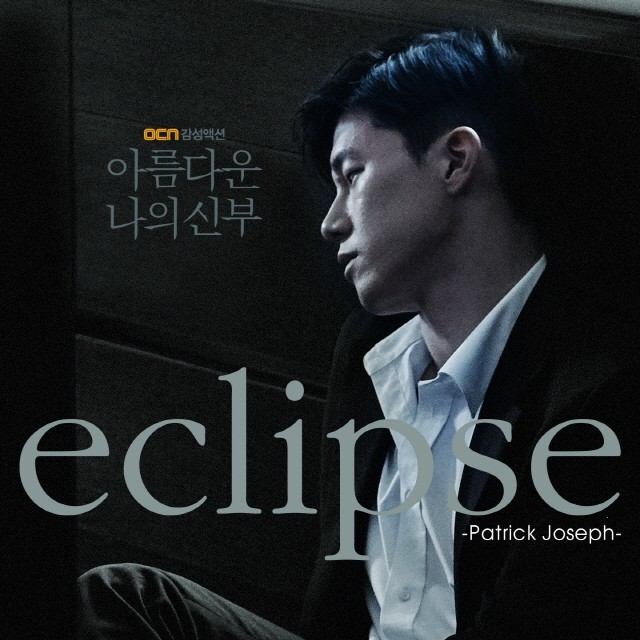

# 아름다운 나의 신부 리뷰, 자본주의 속 김무열의 순애보 느와르 드라마

아름다운 나의 신부는 한 남자의 순애보를 통해 사랑과 자본, 권력 구조가 충돌하는 현대 사회의 모순을 느와르 장르로 해부한 작품이다. 이 작품은 단순한 로맨스도, 단순한 액션 느와르도 아니다. 사랑이라는 가장 순수한 가치가 가장 차갑고 계산적인 현실과 충돌할 때 어떤 모습이 되는지를 집요하게 추적한다. 작품은 거대한 사회를 바꾸는 영웅을 만들지 않는다. 대신 오직 한 사람을 구하기 위해 자신의 모든 것을 버리는 한 인간을 끝까지 따라가며, 그 과정에서 현대 사회가 가진 구조적 폭력을 함께 드러낸다.

## 핵심 요약

* **김도형**은 정의를 위해 싸우는 영웅이 아니라 오직 주영 한 사람만을 위해 모든 것을 버리는 인물이다.
* 작품은 **사랑과 자본주의의 충돌**을 중심축으로 삼아 현대 사회의 냉혹함을 묘사한다.
* 주변 인물들은 모두 권력과 돈을 향해 움직이지만 도형만은 사랑이라는 단 하나의 가치만을 따른다.
* 서진기, 김 비서, 박태규는 서로 다른 욕망을 상징하며 결국 모두 욕망 때문에 무너진다.
* 거대한 범죄 조직보다 더 위에 존재하는 **보이지 않는 권력 구조**가 작품 전체를 지배한다.
* 이 드라마의 핵심은 악당을 처벌하는 이야기가 아니라 사랑만이 끝까지 살아남는 과정을 보여주는 데 있다.

## 1. 왜 김도형이라는 주인공은 이질적으로 보일까?

현대 사회에서 사랑은 흔히 감정보다 조건으로 평가된다. 경제력, 직업, 현실적인 안정성 같은 요소들이 사랑보다 우선하는 경우가 많으며, 많은 작품 역시 이러한 현실성을 전제로 관계를 그린다. 그러나 **김도형**은 이러한 시대적 문법을 철저히 거부하는 존재다. 그는 자신의 미래나 사회적 성공보다 단 한 사람의 생존을 우선하며, 자신의 안전과 목숨까지 아무런 계산 없이 내던진다. 이러한 모습은 현대 사회에서는 오히려 비현실적으로 느껴질 정도이며, 작품은 바로 그 비현실성 자체를 통해 사랑이라는 가치의 희소성을 강조한다.

도형의 행동에는 영웅주의도 존재하지 않는다. 그는 사회 정의를 실현하려 하지도 않고 세상을 바꾸려 하지도 않는다. 경찰도 아니고 검사도 아니며 정의감에 불타는 시민운동가도 아니다. 그의 모든 행동은 오직 주영을 되찾기 위한 하나의 목적만을 향한다. 이러한 **극단적인 단일 목적성**은 느와르 장르에서는 매우 드문 특징이며, 오히려 사랑이 인간을 얼마나 강하게 움직일 수 있는지를 보여주는 장치가 된다.

작품은 이러한 순애보를 감상적으로 소비하지 않는다. 도형이 선택한 길은 끝없는 폭력과 상실, 배신으로 이어진다. 사랑은 아름답지만 그것을 지키는 과정은 처절하며, 현실은 결코 낭만적이지 않다는 사실을 처음부터 끝까지 유지한다.

## 2. 김도형은 왜 엘리트의 삶을 버리고 은행원이 되었을까?

도형은 평범한 청년가 아니라 대한민국 최고 수준의 법률 권력 중심에 설 수 있었던 인물이다. 그의 어머니 문인숙은 거대 로펌을 이끄는 대표이며, 그 역시 얼마든지 사회 최상층으로 진입할 수 있는 환경에서 성장했다. 그러나 그는 그 길을 스스로 거부한다.

이 선택은 출세를 포기한 청춘의 낭만이 아니다. **주영이라는 존재**가 그의 인생 자체를 바꾸었기 때문이다.

주영은 극심한 가난 속에서 살아왔다. 돈이 없다는 이유만으로 인간의 존엄까지 무너지는 경험을 반복했고, 그녀에게 은행은 단순한 금융기관이 아니라 돈 때문에 다시는 울지 않아도 되는 세상을 상징하는 공간이었다. 그녀가 "은행처럼 많은 돈을 가진 사람이 되고 싶다."라고 말했던 이유 역시 부자가 되고 싶어서가 아니라 가난의 공포에서 벗어나고 싶었기 때문이다.

도형은 이 말을 잊지 않는다.

그는 언젠가 주영이 다시 자신의 삶을 찾아오게 될 장소를 은행이라고 생각했고, 그녀를 기다리기 위해 평범한 은행원이 된다. 사회적으로는 하향 선택처럼 보이지만, 도형에게 그것은 가장 합리적인 사랑의 방식이었다.

이처럼 작품은 **은행**이라는 공간을 단순한 직장으로 사용하지 않는다.

* 주영에게 은행은 결핍을 끝내는 희망이다.
* 도형에게 은행은 사랑을 기다리는 장소다.
* 사회에는 돈을 관리하는 제도권 금융기관이다.

하나의 공간이 세 가지 의미를 동시에 가지면서 이후 작품 전체에서 중요한 상징으로 기능하게 된다.

## 3. 사랑만 바라본 도형과 욕망만 좇은 주변 인물들은 어떻게 대비되는가?

도형이 사랑 하나만을 위해 움직이는 동안 주변 인물들은 모두 각자의 욕망을 위해 움직인다. 이러한 대비가 작품의 긴장감을 만들어낸다.

| 인물 | 움직이는 원인 | 결과 |
| --- | --- | --- |
| 김도형 | **사랑** | 주영을 끝까지 포기하지 않음 |
| 서진기 | 권력과 출세 | 강 회장에게 제거됨 |
| 김 비서 | 생존과 권력 | 끝내 한계를 드러냄 |
| 박태규 | 배신감과 복수 | 비극을 확대함 |

가장 대표적인 인물이 **서진기**다.

그는 조직 최하층에서 시작해 자신의 능력과 잔혹함으로 최고 간부 자리까지 올라간 입지전적인 인물이다. 송학수를 제거하려는 계획 역시 단순한 충동이 아니라 조직을 장악하기 위한 계산된 전략이었다.

그러나 그는 치명적인 착각을 한다.

자신이 조직을 움직이고 있다고 믿었지만 실제로는 강 회장의 손바닥 위에서 움직이는 말에 불과했다. 강 회장은 서진기의 야망을 오래전부터 알고 있었으며, 자신을 위협하는 순간 아무런 미련 없이 제거한다.

여기에는 작품이 보여주는 **권력의 본질**이 담겨 있다.

권력자는 능력 있는 부하를 원하지만 자신을 넘보는 부하는 용납하지 않는다. 아무리 뛰어난 성과를 내더라도 충성보다 야망이 커지는 순간 제거 대상이 된다.

김 비서는 조금 다른 유형이다.

그는 처음부터 권력을 직접 차지하려 하기보다 언제나 살아남는 쪽을 선택하는 기회주의자다. 권력 이동을 감지하면 가장 먼저 줄을 바꾸고, 자신이 살아남기 위해 누구든 배신한다.

문인숙 대표의 라인으로 들어가려는 시도 역시 같은 맥락이다. 그러나 그는 끝내 받아들여지지 않는다. 지배 계층에게 그는 어디까지나 이용 가능한 부속품일 뿐이며, 아무리 영리해도 같은 계층으로 편입될 수는 없다.

이 실패 이후 그는 더욱 위험한 선택을 한다.

주영을 이용해 강 회장을 제거하려 하고 동시에 도형까지 움직여 판을 뒤흔들려 한다. 계산 자체는 정교했지만, 한 가지를 이해하지 못했다.

도형에게는 권력도 복수도 중요하지 않았다.

오직 **주영의 생존**만이 그의 현실이었다.

권력을 기준으로 세상을 계산한 김 비서는 결국 사랑을 기준으로 움직이는 도형을 끝까지 이해하지 못한다.

박태규 역시 비극적인 인물이다.

그는 조직 안에서 누구보다 인간적인 감정을 가지고 있었지만, 자신이 모든 사람에게 속았다고 믿는 순간 무너진다. 특히 도형의 정체를 알게 된 이후에는 자신이 순수한 사랑이라는 이름 아래 이용당했다고 받아들이며 극단적인 분노를 드러낸다.

그가 "도형만 사랑을 하는 것은 아니다."라고 외치며 칼을 꽂는 장면은 단순한 복수가 아니다.

사랑조차 욕망과 배신으로 오염된 세계에서 살아온 인간이 마지막으로 터뜨리는 절규에 가깝다.

결국 작품은 네 사람을 통해 하나의 대비를 완성한다.

* **도형**은 사랑을 선택한다.
* 서진기는 권력을 선택한다.
* 김 비서는 생존을 선택한다.
* 박태규는 감정에 무너진다.

그리고 끝까지 자신의 신념을 버리지 않는 사람은 도형 한 사람뿐이다.

## 4. 대부업과 은행은 정말 서로 다른 세계일까?

작품이 전달하는 가장 날카로운 사회비판은 **제도권 금융과 불법 사채 시장이 하나의 구조 안에서 움직인다는 점**이다. 일반적인 범죄 드라마라면 은행은 선한 제도권, 사채업자는 악한 범죄 조직으로 구분하지만, 아름다운 나의 신부는 이 단순한 이분법을 거부한다.

작품에서 은행은 돈이 가장 필요한 사람들에게 가장 높은 문턱을 세운다. 담보와 신용을 갖춘 사람에게는 낮은 금리와 안정적인 금융 서비스를 제공하지만, 생계 자체가 위태로운 사람에게는 대출 자체를 거부한다.

문제는 그 이후다.

은행에서 거절당한 사람들은 결국 살아남기 위해 **불법 사채 시장**으로 흘러간다. 작품은 이 과정을 개인의 잘못이 아니라 구조적인 결과로 묘사한다.

* 은행은 위험을 피한다.
* 사채업자는 위험을 돈으로 바꾼다.
* 서민은 선택권 없이 착취당한다.

이 과정에서 은행은 직접 폭력을 행사하지 않는다. 대신 거액의 자금이 다양한 경로를 통해 사채 조직으로 흘러 들어가고, 사채업자는 그 자금을 이용해 극단적인 고금리와 폭력으로 이익을 창출한다.

드라마는 이러한 구조를 통해 **돈은 합법과 불법을 자유롭게 넘나들지만, 피해는 항상 가장 약한 사람에게 집중된다**는 사실을 보여준다.

강 회장이 절대 권력처럼 보이지만 실제로는 더 거대한 자본과 법률 권력의 하위 구성원에 불과하다는 설정 역시 같은 메시지를 강화한다.

* 강 회장은 사채 조직을 운영한다.
* 문인숙은 법률 권력을 가진 최상층 인물이다.
* 그러나 문인숙 역시 더 거대한 권력 구조 안에서 움직인다.

작품은 최종 흑막을 구체적으로 설명하지 않는다. 대신 권력은 얼굴을 바꿀 뿐 **착취 시스템 자체는 계속 유지된다**는 사실만을 반복해서 보여준다.

이 때문에 강 회장이 죽는 장면조차 통쾌한 권선징악이 되지 않는다. 그는 제거되었지만 구조는 남아 있기 때문이다.

## 5. 열린 결말은 무엇을 의미하는가?

가장 많은 해석이 나오는 부분은 마지막 장면이다.

박태규에게 치명상을 입은 도형은 구급차 안에서 심장이 멈추는 순간까지 몰린다. 이후 작품은 인천 바닷가에서 주영과 다시 만나는 장면을 보여주지만, 그것이 현실인지 죽음 직전의 환상인지는 끝내 설명하지 않는다.

이 때문에 두 가지 해석이 가능하다.

* 실제 생존하여 재회했다.
* 죽음 직전 마지막으로 바라본 환상이다.

그러나 작품이 진짜 말하고 싶은 것은 어느 쪽이 맞느냐가 아니다.

중요한 것은 **사랑이 현실의 폭력보다 오래 살아남았다는 상징성**이다.

극 초반 "어이 자전거"라는 대사와 함께 시작된 두 사람의 관계는 세상의 이해관계와 무관한 순수한 연결이었다. 마지막 인천 바닷가 역시 그 시작과 대응되는 공간으로 사용되며, 모든 권력 다툼과 폭력으로부터 완전히 분리된 장소처럼 묘사된다.

반대로 같은 시점에 작품은 이진숙이 새로운 사채 조직의 중심에 서는 모습을 교차 편집한다.

이 두 장면은 강한 대비를 만든다.

| 개인 | 사회 |
| --- | --- |
| 도형과 주영은 서로를 구원한다. | 착취 구조는 그대로 유지된다. |
| 사랑은 완성된다. | 권력은 계속 순환한다. |
| 개인은 행복을 찾는다. | 사회는 변하지 않는다. |

이처럼 작품은 개인의 행복과 사회 정의를 동일시하지 않는다.

도형은 세상을 구하지 못했다.

하지만 가장 소중한 사람만큼은 끝내 지켜냈다.

그것으로 그의 이야기는 완성된다.

## 6. 16부작이라는 구성은 성공했을까?

작품에 대한 가장 대표적인 비판은 **분량 조절 실패**다.

초반부는 매우 뛰어나다.

주영이 사라진 이후 도형이 정체를 숨긴 채 조직을 추적하는 과정은 영화 수준의 긴장감을 유지한다. 인물들의 관계도 빠르게 전개되며, 느와르 특유의 차가운 분위기 역시 높은 완성도를 보여준다.

그러나 중반 이후부터는 같은 구조가 반복된다.

* 도형이 단서를 찾는다.
* 주영과 가까워진다.
* 다시 놓친다.
* 새로운 조직원이 등장한다.
* 다시 추적한다.

이러한 반복은 초반의 긴장감을 점차 약화시킨다.

또한 후반부로 갈수록 **김도형이라는 인물의 행동 반경이 지나치게 단순화**된다.

거대한 금융 카르텔과 법조 권력, 조직 내부 쿠데타가 동시에 진행되는데도 도형은 끝까지 주영만 바라본다. 작품의 의도는 분명하지만, 사회 구조를 해부하는 이야기와 개인 멜로드라마가 완전히 융합되지 못하면서 일부 장면에서는 인물이 기계적으로 움직이는 것처럼 보이기도 한다.

최종회 역시 다소 아쉬움을 남긴다.

강 회장의 몰락, 조직 재편, 문인숙의 움직임, 박태규의 최후, 도형의 생사, 열린 결말까지 많은 요소를 한 회 안에서 정리하다 보니 감정선이 충분히 축적되지 못한 부분이 있다.

그럼에도 작품의 장르적 가치는 여전히 높다.

당시 국내 드라마에서 이 정도 규모의 **한국형 느와르 액션과 순애 멜로드라마를 결합한 사례는 매우 드물었다.** 거친 액션과 사랑이라는 감정을 동시에 중심축으로 삼으면서도 권력과 금융 구조를 비판하는 사회성을 결합한 점은 지금도 충분한 의미를 가진다.

## 결론

아름다운 나의 신부는 결국 **사랑과 사회를 동시에 이야기하는 작품**이다. 작품은 사랑이 세상을 바꾸지는 못한다고 말한다. 강 회장이 죽어도 새로운 강 회장이 등장하고, 사채 조직은 이름만 바뀔 뿐 계속 유지된다. 권력은 사람을 교체할 뿐 구조 자체는 쉽게 무너지지 않는다.

반면 개인은 서로를 구원할 수 있다. **김도형**은 거대한 악을 처단한 영웅이 아니라 단 한 사람을 끝까지 포기하지 않은 인간이다. 그가 얻은 것은 사회 정의의 승리가 아니라 사랑의 완성이며, 작품은 그것만으로도 한 인간의 삶은 충분히 구원될 수 있다고 말한다.

또한 작품은 **욕망과 사랑의 차이**를 끝까지 대비시킨다. 서진기와 김 비서는 권력을 향해 올라가려 했고, 박태규는 배신감 속에서 무너졌다. 그러나 자신의 신념을 끝까지 바꾸지 않은 도형만이 마지막에 가장 소중한 것을 지켜낸다. 이는 현실의 냉혹함을 인정하면서도 인간이 끝까지 붙잡아야 할 가치가 무엇인지를 조용히 질문하는 결말이라 할 수 있다.

국내 느와르 드라마라는 관점에서도 이 작품은 의미가 크다. 후반부의 서사 밀도와 완급 조절에는 분명한 아쉬움이 남지만, **사랑을 단순한 로맨스가 아니라 인간 존재를 끝까지 움직이는 신념으로 그려낸 시도**는 지금도 쉽게 대체되지 않는 개성을 가진다.

## 자주 묻는 질문(FAQ)

### 아름다운 나의 신부의 핵심 장르는 무엇인가?

기본적으로는 느와르 액션 드라마지만, 이야기의 중심은 범죄 조직이 아니라 사랑을 끝까지 지키려는 한 남자의 순애보에 있다.

### 김도형은 왜 사회 정의보다 주영만 구하려 했을까?

도형은 영웅으로 설계된 인물이 아니다. 그의 목표는 세상을 바꾸는 것이 아니라 가장 소중한 사람을 지키는 것이며, 작품도 이를 일관되게 유지한다.

### 마지막에 도형과 주영은 실제로 살아남은 것일까?

작품은 의도적으로 답을 제시하지 않는다. 실제 생존과 환상 모두 해석이 가능하며, 중요한 것은 사랑이 생사의 경계를 넘어 완성되었다는 상징성이다.

### 작품에서 은행과 사채업을 함께 다룬 이유는 무엇일까?

제도권 금융과 불법 금융이 사회적 약자를 중심으로 하나의 구조를 형성한다는 점을 보여주기 위한 장치다. 이를 통해 작품은 개인의 범죄보다 구조적 문제를 더 강조한다.

### 아름다운 나의 신부는 지금 다시 볼 가치가 있을까?

후반부 전개에는 아쉬움이 있지만, 한국형 느와르와 순애 멜로드라마를 결합한 독창성, 그리고 사랑과 권력 구조를 함께 다룬 주제의식은 지금 다시 보아도 충분히 의미가 있다.