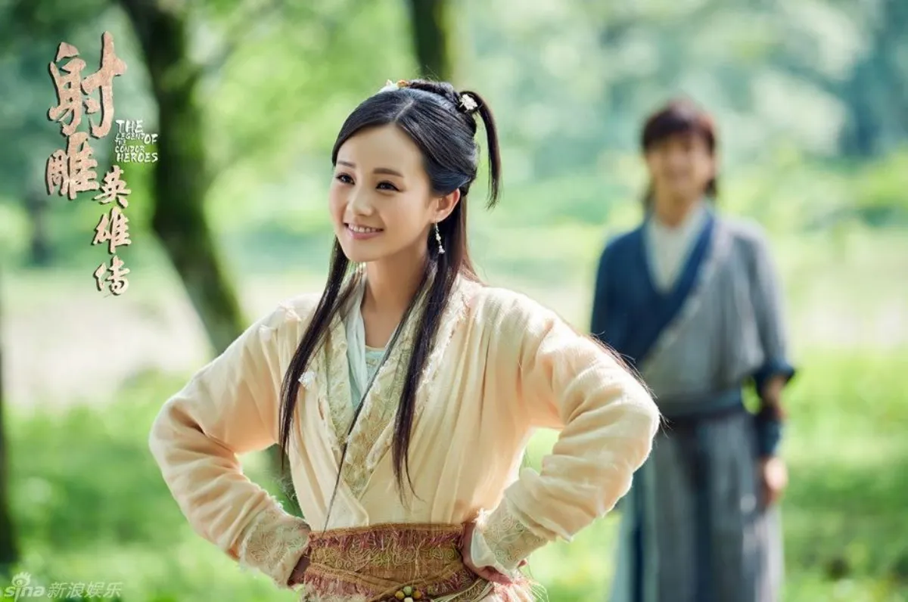

# 구양신공 장무기 vs 구음진경 곽정 양과 무공 대결

원작자 공인 서열은 공동 1위다. 장무기가 치트키급 무공 스펙을 가졌으나 유약한 성격이 약점이며, 곽정의 완벽한 구음항룡장과 양과의 암연소혼장 변수가 이를 정면에서 상쇄하기 때문이다. 소설 속 무공의 화려함과 순수 스펙만 놓고 보면 장무기는 타의 추종을 불허하는 세계관 최강자처럼 보인다. 하지만 원작을 깊이 있게 들여다보면 실전에서 장무기가 곽정과 양과를 일방적으로 찍어누르는 그림은 나오지 않는다. 오히려 심리전과 결단력 싸움에서 밀려 고전할 수밖에 없는 구조적 한계가 명확히 존재한다.

## 핵심 요약

* 김용 작가의 공식 언급에 따르면 곽정, 양과, 장무기 세 사람의 무공 우열은 가릴 수 없는 공동 1위다.
* 장무기는 구양신공과 건곤대나이 등 최강의 하드웨어를 가졌으나 유약한 성격과 살기 부재가 치명적인 약점이다.
* 곽정은 구음진경을 완벽히 마스터하고 좌우서로격박을 조합하여 실질적으로 2인분의 화력을 뿜어낸다.
* 양과는 기교를 초월한 현철중검의 경지와 예측 불가능한 일격필살의 암연소혼장이라는 거대한 변수를 지니고 있다.
* 실전에서는 순수 무공 스펙보다 정신력, 결단력, 전투 경험이 승패를 가르는 핵심 요인으로 작용한다.
* 결론적으로 세 고수의 대결은 어느 한쪽이 압도하지 못하고 완벽한 삼각 균형을 이룬다.

## 1. 하드웨어 최강 장무기가 실전에서 고전하는 구조적 이유

장무기의 무공 라인업은 그야말로 치트키의 집합체다. 무한한 내공과 자동 회복, 독에 대한 면역을 보장하는 구양신공, 상대의 에너지를 100% 반사하고 역학 구조를 제어하는 건곤대나이, 유능제강의 극치인 태극권과 태극검, 그리고 기괴하고 변칙적인 페르시아 명교의 성화령 무공까지 마스터했다. 하지만 이를 구동하는 장무기라는 인물의 멘탈에는 치명적인 결함이 있다.

### 살기와 결단력의 부재

* 장무기는 천성적으로 모질지 못하고 우유부단하다.

* 싸움에서 상대를 무조건 살려두거나 다치지 않게 하려는 의협심이 도리어 실전에서는 독으로 작용한다.

* 고수들의 일격필살 대결에서는 단 0.1초의 망설임이 목숨을 가르는데, 장무기는 늘 머뭇거린다.

* 광명정에서 멸절사태의 의천검을 상대할 때나, 주지약과의 대결에서 마음이 약해져 기습을 허용하고 가슴이 뚫렸던 실책이 대표적이다.

### 기만책에 취약한 실전 센스

* 초식과 내공은 신의 경지이지만 실전 센스가 턱없이 부족하다.

* 원작 후반부에서도 무공 실력이 한참 떨어지는 주지약의 하급 기습이나 적들의 인질극, 잔꾀에 휘말려 목숨을 잃을 뻔한 위기를 자주 겪는다.

* 소림사 삼승의 금강복마권을 상대할 때도, 압도적인 힘을 가졌음에도 전술적 돌파구를 찾지 못해 지리멸렬한 장기전으로 끌려갔다.

## 2. 실전형 전투 기계 곽정과 변수의 화신 양과의 무공 보강 분석

### 곽정의 무공 특성

* 곽정은 구음진경을 대충 익힌 방외 고수들과 궤를 달리한다.

* 구음진경 원본 전체는 물론, 범어로 적혀 있어 음양 조화의 절대적 비결이 담긴 마지막 총결 편까지 완벽하게 독파했다.

* 전진교의 정통 도가 내공인 역근경의 원리까지 흡수하여, 그의 내공은 장무기의 구양신공과 비교해도 순수함과 깊이에서 전혀 밀리지 않는 음양조화의 극치에 도달했다.

* 천하제일의 강맹함을 자랑하는 항룡십팔장에 구음진경의 내공이 융합되면서, 곽정의 장풍은 강한 가운데 부드러움이 숨어 있어 한 번 발출되면 13중의 겹겹 무공으로 몰아치는 경지에 이른다.

* 주백통에게 배운 좌우서로격박이 더해져 왼손으로는 부드러운 공명권을, 오른손으로는 극강의 항룡장을 날리는데, 이는 실질적으로 곽정 두 명이 동시에 공격하는 효과를 낸다.

* 장무기의 건곤대나이가 힘을 반사하려고 해도, 양손에서 들어오는 이질적인 두 가지 극강의 역학 구조를 한 번에 제어하려다 방어 레이어가 과부하로 터질 가능성이 높다.

* 곽정은 양양성에서 평생을 몽골의 수십만 대군과 맞서 싸운 일선 사령관이자 돌격대장이다.

* 살수를 써야 할 때와 꺾어야 할 때를 본능적으로 아는 실전형 고수이기 때문에, 장무기가 조금이라도 우유부단한 모습을 보이면 그 찰나의 빈틈에 항룡장을 꽂아 넣을 결단력을 가졌다.

### 양과의 무공 특성

* 양과는 검마 독고구패의 신조와 함께 폭포수 아래서, 그리고 바다의 거센 파도를 온몸으로 버텨내며 수련했다.

* 이를 통해 얻은 현철중검의 경지는 화려한 초식을 전부 무력화하는 무지막지한 내공의 중압감 그 자체다.

* 장무기가 태극권의 흘리기나 성화령의 기괴한 초식으로 흔들려고 해도, 양과가 그저 무겁게 내리치는 한 방 앞에서는 모든 기교가 파쇄된다.

* 무기가 무거우니 날이 필요 없고, 큰 기교는 도리어 서툴게 보인다는 말처럼 기교의 영역을 초월한 무학이다.

* 양과에게는 소룡녀와 이별한 16년 동안의 깊은 슬픔과 고독을 무공으로 승화시킨 암연소혼장이 있다.

* 이 무공은 마음속 감정이 비장해질 때만 발동한다는 특수 조건이 있지만, 일단 터지면 초식의 궤적과 성질을 전혀 예측할 수 없다.

* 당대 구음진경과 라마교의 비기인 용상반야공 10성을 마스터하여 강력한 외공과 내공을 가졌던 최종 보스 금륜법왕조차 양과의 암연소혼장이 폭발하자 단 몇 초식 만에 정면에서 격살당했다.

* 장무기의 건곤대나이 시스템으로도 예측이 불가능한 강력한 일격이자 결정적인 변수다.

## 3. 속성별 비교 요약 및 역학 관계

세 인물의 종합적인 능력치를 다각도로 분해하여 비교하면 다음과 같은 삼각 균형이 성립한다. 김용 작가는 공식적으로 곽정, 양과, 장무기 세 사람의 무공 우열은 가릴 수 없으며 모두 각 시대의 정점에 선 고수들이라고 밝혔다.

| 능력치 분류 | 장무기 (의천도룡기) | 곽정 (사조/신조삼협) | 양과 (신조협려) |
| :--- | :--- | :--- | :--- |
| **순수 내공 및 방어력 (하드웨어)** | **최강 (★) [구양신공/건곤대나이]** | 우수 [구음진경/역근경] | 우수 [해조내공/독고구패] |
| **공격 파괴력 및 초식 완성도** | 우수 [태극권/성화령] | **최강 (★) [항룡장/양손호박]** | 보통 [현철중검/잡학] |
| **실전 센스 및 투지 (소프트웨어)** | 미흡 [우유부단/살기 부재] | **최강 (★) [전쟁 영웅/결단력]** | 우수 [영악함/실전 변칙] |
| **위기 극변 변수 (일격 필살)** | 전무 [평정심 유지] | 보통 [정공법 위주] | **최강 (★) [암연소혼장 폭발]** |
| **최종 종합 전투력 (작가 공인)** | **동률 (공동 1위)** | **동률 (공동 1위)** | **동률 (공동 1위)** |

## 결론
장무기가 가진 무공의 스펙이 가장 화려하고 사기적인 것은 원작의 데이터를 통해 볼 때 움직일 수 없는 사실이다. 하지만 무학의 경지라는 것은 단순히 지닌 기술의 총합으로만 결정되지 않는다. 곽정의 완성된 구음항룡장과 두 인분의 효율을 내는 좌우서로격박의 압박, 그리고 양과의 현철중검 및 암연소혼장이 가지는 치명타 변수는 장무기의 치트키급 기술들을 정면에서 완벽하게 상쇄한다.

결국 김용 작가가 밝힌 동급이라는 설정은 실전에서 벌어질 수 있는 수많은 심리적, 환경적 변수까지 모두 고려한 가장 객관적인 진단이다. 세 고수의 우열을 가리는 것보다 중요한 것은 각자가 처한 시대와 운명 속에서 자신의 무학을 어떻게 완성하고 협을 실천했는가 하는 점이다. 이들은 모두 각자의 방식으로 세계관의 정점에 선 위대한 영웅들이다.

## 자주 묻는 질문(FAQ)

### 장무기가 성격만 독하게 먹는다면 곽정과 양과를 이길 수 있을까?

성격을 고친다면 실전 효율이 극대화되겠지만 승리를 장담할 수는 없다. 장무기의 유약한 성격 자체가 그의 무공인 태극권의 부드러움이나 건곤대나이의 포용력과도 긴밀하게 연결되어 있기 때문이다. 또한 곽정과 양과의 무공 역시 각자의 확고한 신념과 정신력에서 비롯된 것이므로, 장무기가 독해진다고 해서 그들의 절대적인 화력과 변수를 쉽게 무력화하기는 어렵다.

### 양과의 암연소혼장은 소룡녀를 만난 이후에는 전혀 쓸 수 없을까?

완전히 쓸 수 없는 것은 아니다. 소룡녀와 재회한 후 마음의 슬픔이 사라져 일시적으로 암연소혼장의 위력이 떨어지거나 발동이 되지 않기도 했다. 하지만 실전에서 진정한 위기에 처하거나 소룡녀가 위험에 빠지는 등의 극단적인 상황이 오면 다시 비장한 감정이 살아나 발동할 수 있다는 것이 정설이다.

### 곽정의 쌍수호박을 장무기도 배울 수 있을까?

장무기의 성향상 배우기 매우 힘들다. 쌍수호박은 마음이 순박하고 딴생각이 없는 사람이 쉽게 익힐 수 있는 무공이다. 반면 장무기는 생각이 많고 영리하며 우유부단한 면이 있어, 마음을 둘로 나누어 동시에 다른 무공을 펼치는 쌍수호박의 심법을 터득하기에는 체질적으로 맞지 않는다.

### 장무기의 건곤대나이는 작중에서 파해된 적이 없을까?

완전히 파해된 적은 없으나 한계를 보인 적은 있다. 소림사 삼승의 금강복마권처럼 완벽한 진법을 바탕으로 기운을 하나로 모아 압박할 때, 건곤대나이로도 그 거대한 힘의 흐름을 혼자서 전부 제어하지 못해 장기전으로 끌려갔다. 즉, 건곤대나이가 무적의 기술처럼 보이지만 제어할 수 있는 범위를 넘어서는 거대한 힘이나 진법 앞에서는 고전할 수 있다.