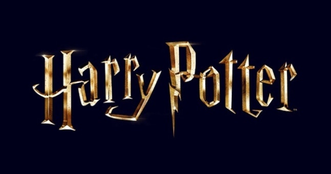

# 해리포터 마법 체계와 세계관 법칙 완전 분석

해리포터 마법 체계는 선천적 마력과 지팡이, 주문, 정신력의 결합으로 작동하며 명확한 한계와 법칙을 가진다. 마법은 단순히 주문을 외우면 원하는 결과가 발생하는 초자연적 힘이 아니라, 마법사의 재능·학습·의지·감정·도구가 함께 작용하는 하나의 체계적인 학문으로 묘사된다.  

작품 속 마법은 현실의 물리 법칙을 일부 초월하지만 전능한 힘으로 그려지지는 않는다. 생명의 완전한 창조와 부활, 특정한 물질의 무한 생성 등은 불가능하며, 마법 사회 역시 이러한 한계를 기반으로 법률과 교육 체계를 발전시켜 왔다. 이 문서는 해리포터 세계관의 마법이 어떤 원리로 작동하고, 어떤 분야로 나뉘며, 어떠한 절대 법칙을 가지고 있는지 정리한다.

## 핵심 요약

* **마법 능력은 선천적 요소**로 결정되며, 머글 출생 마법사와 스퀴브의 존재를 통해 혈통만으로 완전히 설명되지 않는다.
* **지팡이는 마법사의 의지를 현실에 전달하는 매개체**이며, 재질과 심의 조합 그리고 소유권 관계가 마법의 결과에 영향을 준다.
* 주문은 단순한 언어가 아니라 **주문·지팡이 동작·의도·집중력의 결합 과정**으로 발동된다.
* 변신술, 마법약, 정신 마법, 어둠의 마법 등은 서로 다른 원리와 목적을 가진 전문 분야로 구분된다.
* 해리포터 세계관의 마법은 강력하지만 **죽음과 같은 근본적 한계는 극복하지 못한다.**
* 마법의 위력은 단순한 힘보다 사용자의 정신 상태와 윤리적 선택에 의해 결정된다.

## 1. 마법의 근본적 본질과 작용 원리

해리포터 세계관에서 마법은 누구나 훈련으로 습득할 수 있는 기술이 아니다. 마법 능력은 **선천적인 재능** 으로 나타나며, 마법사는 교육과 훈련을 통해 자신의 능력을 발전시킨다. 호그와트에서 학생들이 배우는 것은 마법 자체를 만들어내는 과정이 아니라, 이미 가진 마력을 안전하고 정교하게 사용하는 방법이다.

마법 능력의 유전 구조는 단순한 혈통주의로 설명되지 않는다. 순수한 마법사 가문에서 태어난 사람도 마법 능력이 없는 스퀴브가 될 수 있으며, 반대로 머글 부모 사이에서도 강력한 마법사가 태어날 수 있다. 대표적으로 머글 출생 마법사는 마법사 사회에서 중요한 위치를 차지하며, 이는 마법 능력이 반드시 부모의 마법 혈통과 일치하지 않는다는 사실을 보여준다.

마법사의 혈통 분류는 다음과 같이 나뉜다.

* **순혈(Pure-blood)**: 마법사 가문끼리 이어져 머글과의 직접적인 혈연 관계가 없다고 주장하는 집단이다.
* **혼혈(Half-blood)**: 마법사와 머글 또는 머글 출생 마법사의 혈통이 섞인 경우다.
* **머글 출생(Muggle-born)**: 머글 부모에게 태어났지만 마법 능력을 가진 마법사다.
* **스퀴브(Squib)**: 마법사 가문에서 태어났지만 마법 능력이 나타나지 않는 사람이다.

이러한 설정은 작품 속에서 혈통주의가 왜 잘못된 사상인지 보여주는 장치이기도 하다. 볼드모트와 일부 순혈주의자들은 혈통을 마법 능력의 우월성과 연결하지만, 실제 세계관에서는 마법 재능이 혈통만으로 결정되지 않는다.

### 감정과 무의식에서 발생하는 초기 마법

어린 마법사는 정식 교육을 받기 전에도 감정 변화에 따라 마법을 일으킬 수 있다. 이를 **비의도적 마법 발현**이라고 볼 수 있으며, 어린 시절 해리 포터가 위험한 상황에서 순간적으로 사라지거나 물체에 영향을 준 장면들이 대표적인 사례다.

이러한 현상은 마법이 단순한 기술적 행위가 아니라 정신 상태와 연결되어 있음을 보여준다. 숙련된 마법사는 의식적인 통제를 통해 힘을 사용하지만, 어린 마법사는 강한 감정이 직접 마력을 자극하는 형태로 나타난다.

마법 숙련도가 높아질수록 중요한 것은 단순한 마력의 양이 아니라 **정밀한 제어 능력**이다. 강력한 마법사라고 해서 항상 더 많은 에너지를 사용하는 것이 아니라, 필요한 상황에 적절한 주문과 의지를 결합하는 능력이 중요하다.

## 2. 지팡이학과 마법 발동 구조는 어떻게 작동하는가?

해리포터 세계관에서 지팡이는 단순한 도구가 아니다. 마법사의 의지를 현실 세계에 전달하는 **마법적 매개체**이며, 숙련된 마법사가 정확한 결과를 얻기 위해 반드시 필요한 장비다.

마법사는 지팡이 없이도 약한 형태의 마법을 사용할 수 있지만, 복잡하고 강력한 마법을 안정적으로 구현하기 위해서는 지팡이가 필요하다. 특히 전투 마법이나 고등 마법에서는 지팡이와 사용자의 관계가 결과에 직접적인 영향을 준다.

지팡이는 크게 두 가지 요소로 구성된다.

* **나무(Wood)**: 지팡이의 외부 구조를 이루며 마법사의 성향과 관련된 특징을 가진다.
* **심(Core)**: 지팡이 내부에 들어가는 마법적 재료로, 주문의 특성과 반응성을 결정한다.

대표적인 지팡이 심 재료는 다음과 같다.

| 심 재료 | 특징 |
| --- | --- |
| 용의 심장 힘줄(Dragon Heartstring) | 강력한 주문과 빠른 학습 능력을 가진 것으로 알려짐 |
| 불사조의 깃털(Phoenix Feather) | 다양한 마법 가능성을 지니지만 선택성이 강함 |
| 유니콘의 털(Unicorn Hair) | 안정적이고 충성도가 높은 특성을 가짐 |

올리밴더의 설명처럼 해리포터 세계관에서는 **"지팡이가 마법사를 선택한다"**는 원칙이 중요하다. 이는 지팡이가 단순한 물건이 아니라 사용자의 성향과 마법적 적합성을 어느 정도 판단하는 반(半)지각적 존재임을 의미한다.

특히 지팡이의 충성심은 단순한 소유 관계와 다르다. 기존 주인이 다른 마법사에게 패배하거나 무장 해제되면 지팡이의 충성 대상이 변경될 수 있다. 이 원리는 엘더 와드의 소유권 변화 과정에서 가장 명확하게 드러난다.

마법 발동 과정은 일반적으로 다음 요소의 결합으로 이루어진다.

* **주문(Incantation)**: 마법 효과를 지정하는 언어적 요소다.
* **지팡이 동작(Wand Movement)**: 마법의 방향과 형태를 결정한다.
* **의도(Intent)**: 무엇을 이루려 하는지에 대한 정신적 목표다.
* **집중력(Focus)**: 마법을 안정적으로 유지하는 정신적 통제력이다.

따라서 같은 주문이라도 시전자의 의지와 숙련도에 따라 결과가 달라질 수 있다.

## 3. 주문과 의도, 감정은 마법의 위력을 어떻게 결정하는가?

해리포터 세계관의 주문은 단순한 암호나 구호가 아니다. 주문은 마법사의 의지를 특정한 형태로 현실에 전달하기 위한 **마법적 언어 체계**이며, 정확한 발음과 지팡이 움직임, 정신적 집중이 함께 작용해야 원하는 결과를 얻을 수 있다. 따라서 같은 주문이라도 시전자의 숙련도와 정신 상태에 따라 위력과 정확도가 달라진다.

초보 마법사는 주문을 소리 내어 외우고 정해진 지팡이 동작을 따라 하는 방식으로 마법을 배운다. 호그와트의 주문 교육이 반복적인 발음 연습과 동작 훈련을 강조하는 이유도 여기에 있다. 마법은 단순히 마력을 방출하는 행위가 아니라, **정확한 제어와 이해를 필요로 하는 기술**이기 때문이다.

숙련된 마법사는 음성 주문 없이도 마법을 사용할 수 있다. 이를 **무언 마법(Non-verbal Magic)**이라고 한다. 무언 마법은 주문을 생략하는 대신 마법사가 머릿속으로 효과와 목적을 명확하게 형성해야 하므로 높은 집중력과 경험이 요구된다.

마법 발동 과정에서 중요한 요소는 다음과 같다.

* **주문(Incantation)**: 원하는 마법 효과를 지정하는 언어적 형식이다.
* **지팡이 동작(Wand Movement)**: 마법의 방향과 형태를 조절한다.
* **의도(Intent)**: 마법사가 실제로 원하는 결과를 결정한다.
* **집중력(Focus)**: 마법을 안정적으로 유지하는 정신적 능력이다.

특히 해리포터 세계관에서는 의도가 매우 중요한 요소로 묘사된다. 단순히 주문의 형태를 알고 있다고 해서 모든 마법을 사용할 수 있는 것은 아니다. 대표적으로 용서받지 못할 저주들은 주문 자체보다 시전자의 내면 상태가 더욱 중요하다.

### 감정과 정신 상태가 요구되는 특수 마법

일부 고위 마법은 특정한 감정이나 정신 상태를 요구한다. 가장 대표적인 사례가 **패트로누스 주문(Expecto Patronum)**이다.

패트로누스는 단순한 방어 주문이 아니라, 시전자가 자신의 가장 강력한 행복한 기억을 떠올리고 그것을 마법적으로 구현해야 하는 고난도 주문이다. 따라서 깊은 절망이나 공포 속에서도 긍정적인 감정을 유지할 수 있는 정신력이 필요하다.

반대로 어둠의 마법은 부정적인 감정을 연료처럼 요구한다.

* 아바다 케다브라는 상대를 죽이고자 하는 진정한 살의가 필요하다.
* 크루시오는 타인에게 고통을 주고자 하는 가학적 의지가 필요하다.
* 임페리오는 상대의 의지를 지배하려는 통제 욕망이 작용한다.

이러한 설정은 해리포터 세계관에서 마법이 단순한 힘의 경쟁이 아니라 **사용자의 인간성과 연결된 능력**이라는 점을 보여준다.

## 4. 호그와트 마법 체계는 어떻게 분류되는가?

호그와트에서는 마법을 여러 전문 분야로 나누어 교육한다. 각각의 분야는 같은 마력을 사용하지만, 대상과 목적 그리고 작동 원리가 다르다. 주문은 물체에 새로운 기능을 부여하는 데 집중하고, 변신술은 대상의 본질 자체를 변화시키며, 마법약은 재료와 조합 과정을 통해 마법 효과를 만든다.

주요 마법 분야는 다음과 같다.

* 주문학(Charms)
* 변신술(Transfiguration)
* 마법약학(Potions)
* 어둠의 마법 방어술(Defense Against the Dark Arts)
* 약초학(Herbology)
* 마법 생물 돌보기(Care of Magical Creatures)
* 천문학(Astronomy)
* 산술점(Arithmancy)
* 고대 룬 문자학(Ancient Runes)

이 가운데 마법의 작동 원리를 이해하는 데 가장 중요한 분야는 주문학, 변신술, 마법약학, 정신 마법이다.

### 주문학(Charms)은 기능을 부여하는 마법이다

주문학은 대상 자체의 본질을 바꾸지 않고 새로운 성질이나 기능을 부여하는 마법이다. 예를 들어 물체를 빛나게 하거나, 움직이게 하거나, 특정 행동을 수행하도록 만드는 것이 주문학의 영역이다.

대표적인 주문은 다음과 같다.

| 주문 | 효과 | 특징 |
| --- | --- | --- |
| 루모스(Lumos) | 지팡이 끝에서 빛 생성 | 가장 기본적인 생활 마법 |
| 액시오(Accio) | 대상 소환 | 공간을 넘어 물체를 끌어옴 |
| 알로호모라(Alohomora) | 잠금 해제 | 보안 마법과 대립 |
| 윙가르디움 레비오우사(Wingardium Leviosa) | 물체 부양 | 초급 마법 교육의 대표 사례 |
| 패트로누스(Expecto Patronum) | 보호체 소환 | 고난도 정신 기반 마법 |

주문학의 핵심은 기존 대상에 새로운 기능을 추가하는 것이다. 따라서 물체의 구조 자체를 바꾸는 변신술과 구별된다.

예를 들어 컵을 공중에 띄우는 것은 주문학이지만, 컵을 쥐나 새로 바꾸는 것은 변신술에 해당한다.

### 변신술(Transfiguration)은 존재의 형태를 변화시키는 마법이다

변신술은 대상의 물리적 구조와 본질을 변화시키는 분야다. 맥고나걸 교수가 담당했던 과목으로, 호그와트에서도 가장 어렵고 위험한 마법 분야 중 하나로 평가된다.

변신술은 크게 다음과 같이 구분된다.

* **변형(Transformation)**: 한 대상을 다른 형태로 변화시킨다.
* **소환(Conjuration)**: 특정 조건 아래 물체를 만들어낸다.
* **소멸(Vanishing)**: 대상을 사라지게 만든다.
* **인간 변신(Human Transfiguration)**: 생명체의 형태를 변화시키는 고난도 영역이다.

변신술이 위험한 이유는 단순히 외형을 바꾸는 것이 아니라 대상의 구조 자체에 영향을 주기 때문이다. 작은 실수도 예상하지 못한 결과를 만들 수 있으며, 생명체를 대상으로 하는 변신은 더욱 높은 수준의 통제가 필요하다.

### 애니마구스와 메타모프마구스는 인간과 형태 변화의 관계를 보여준다

변신술의 특수한 형태로 **애니마구스(Animagus)**가 있다. 애니마구스는 마법사가 자신의 의지로 특정 동물 형태로 변신하는 능력이다.

애니마구스는 일반적인 변신 주문과 차이가 있다.

* 주문을 사용하지 않고 스스로 변신한다.
* 자신의 정체성과 연결된 하나의 동물 형태만 가진다.
* 마법부에 등록해야 한다.
* 장기간의 준비와 높은 숙련도가 필요하다.

반면 **메타모프마구스(Metamorphmagus)**는 선천적으로 외형을 변화시킬 수 있는 희귀 능력이다. 통스가 대표적인 사례이며, 주문이나 약물 없이 얼굴과 머리카락 등 신체 일부를 자유롭게 변화시킨다.

두 능력의 차이는 마법이 후천적 기술뿐 아니라 선천적 특성으로도 나타날 수 있음을 보여준다.

## 5. 마법약학과 정신 마법은 어떻게 다른 영역을 지배하는가?

해리포터 세계관에서 마법은 지팡이를 휘두르는 주문만으로 구성되지 않는다. **마법약학(Potions)**과 **정신 마법(Mind Magic)**은 각각 물질과 정신이라는 서로 다른 영역에 개입하는 전문 분야다. 두 분야는 직접적인 전투력보다 준비와 이해를 통해 결과를 만들어낸다는 공통점을 가진다.

마법약학은 마법적 성질을 가진 재료를 조합하여 특정한 효과를 만들어내는 학문이다. 재료의 종류뿐 아니라 투입 순서, 온도 조절, 저어주는 방식 등 정밀한 과정이 중요하며, 단순히 제조법을 외우는 것만으로 완성되는 분야가 아니다.

대표적으로 스네이프 교수가 강조했던 것처럼 마법약 제조에서는 세부적인 과정 하나가 결과를 완전히 바꿀 수 있다. 같은 재료를 사용하더라도 준비 과정과 기술에 따라 완전히 다른 결과가 발생할 수 있기 때문에 마법약학은 마법 분야 가운데서도 높은 집중력과 지식이 요구된다.

주요 마법약은 다음과 같다.

| 마법약 | 효과 | 특징 |
| --- | --- | --- |
| 폴리주스 드링크(Polyjuice Potion) | 다른 사람의 모습으로 변신 | 변신 대상의 일부 재료 필요 |
| 펠릭스 펠리시스(Felix Felicis) | 일정 시간 동안 행운 증가 | 과도한 사용 시 판단력 저하 가능 |
| 베리타세룸(Veritaserum) | 진실을 말하게 만드는 효과 | 강력한 정신 개입 마법약 |
| 늑대인간 치료 관련 약물 | 변신 과정 완화 | 제한적인 효과만 가능 |

마법약은 단순한 제조법만으로 완성되는 분야가 아니며, **마법적 재료의 특성과 제조자의 숙련도** 가 결과에 영향을 준다. 마법적 재료 자체가 가진 특성과 마법사의 개입이 필요하기 때문에, 머글의 화학 실험과는 다른 영역으로 구분된다.

그러나 마법약 역시 만능은 아니다. 어떤 약물도 생명의 근본적인 법칙을 완전히 바꾸지는 못한다. 외형 변화, 감정 조절, 신체 상태 변화는 가능하지만 죽음 자체를 되돌리는 것은 불가능하다.

## 정신 마법은 타인의 의식과 기억에 어떻게 영향을 주는가?

정신 마법은 해리포터 세계관에서 가장 위험하고 윤리적인 논쟁이 많은 분야다. 신체를 공격하는 일반적인 전투 마법과 달리, 정신 마법은 **개인의 기억·생각·의지 자체를 대상으로 한다.**

대표적인 정신 마법은 레질리먼시, 오클루먼시, 기억 수정 마법이다.

### 레질리먼시(Legilimency)는 마음을 읽는 기술이다

레질리먼시는 상대의 정신에 접근하여 기억과 생각을 읽는 마법이다. 단순한 표정 분석이나 추론이 아니라, 상대의 내면에 직접 접근하는 능력이다.

볼드모트와 덤블도어 같은 강력한 마법사들은 높은 수준의 레질리먼시 능력을 보여준다. 하지만 이 능력은 단순한 정보 획득 기술이 아니라 상대의 가장 깊은 기억과 감정까지 침범할 수 있기 때문에 윤리적으로 매우 위험하다.

레질리먼시의 특징은 다음과 같다.

* 상대의 기억과 감정에 접근할 수 있다.
* 강한 정신력을 가진 사람은 방어할 수 있다.
* 숙련자는 거짓 기억이나 숨겨진 의도를 파악할 수 있다.
* 무단 사용은 개인의 정신적 자유를 침해한다.

### 오클루먼시(Occlumency)는 정신 방어 기술이다

오클루먼시는 레질리먼시 공격으로부터 자신의 정신을 보호하는 기술이다. 자신의 감정과 기억을 통제하고 외부 침입을 차단하는 것이 핵심이다.

볼드모트와 정신적으로 연결된 해리가 오클루먼시 훈련을 받은 이유도 이 때문이다. 상대와 연결된 상태에서는 자신의 기억과 감정이 그대로 노출될 위험이 있기 때문이다.

오클루먼시에서 중요한 것은 단순한 집중력이 아니다. 감정을 완전히 통제하고, 자신의 내면을 숨길 수 있는 정신적 절제가 필요하다.

### 기억 수정 마법은 마법 사회의 가장 큰 윤리 문제다

기억 수정 주문인 **오블리비아테(Obliviate)**는 마법 세계가 머글 사회와 공존하기 위해 사용하는 대표적인 마법이다.

마법사가 머글에게 노출되었을 경우 기억을 삭제하거나 변경하여 비밀을 유지하는 것이 대표적인 사용 목적이다. 하지만 기억은 개인의 정체성과 경험을 구성하는 핵심 요소이기 때문에, 이를 조작하는 행위는 심각한 윤리 문제를 발생시킨다.

기억 수정 마법이 가진 문제점은 다음과 같다.

* 개인의 경험을 강제로 변경한다.
* 피해자는 자신에게 일어난 일을 알 수 없다.
* 사회적 질서를 위해 개인의 자유를 제한할 수 있다.
* 권력을 가진 집단이 악용할 가능성이 있다.

해리포터 세계관은 이 마법을 통해 강력한 힘을 가진 사회가 질서를 유지하기 위해 어디까지 개인의 권리를 침해할 수 있는지 질문한다.

## 6. 어둠의 마법과 방어술은 어떻게 힘의 균형을 이루는가?

어둠의 마법(Dark Arts)은 마법 자체가 악한 것이 아니라, **타인에게 심각한 피해를 주거나 자연의 질서를 왜곡하기 위한 목적**으로 사용되는 마법을 의미한다.

따라서 같은 마법적 원리라도 목적과 사용 방식에 따라 평가가 달라질 수 있다. 예를 들어 공격적인 주문이라도 방어 목적에서 사용될 수 있으며, 반대로 기억 수정처럼 보호를 위해 사용되는 마법도 개인의 자유를 침해할 수 있다.

어둠의 마법 방어술은 이러한 위험한 마법에 대응하기 위한 학문이다. 호그와트에서는 학생들에게 단순한 공격 주문보다 방어와 대응 방법을 우선적으로 가르친다.

주요 방어 개념은 다음과 같다.

* 공격을 직접 막는 보호 마법
* 상대 주문을 무력화하는 대응 주문
* 위험한 생물과 저주에 대응하는 방법
* 정신 공격으로부터 자신을 보호하는 기술

대표적인 방어 주문은 다음과 같다.

| 주문 | 효과 | 의미 |
| --- | --- | --- |
| 프로테고(Protego) | 마법 방어막 생성 | 기본적인 방어 마법 |
| 리디큘러스(Riddikulus) | 보가트를 약화 | 공포를 극복하는 정신 훈련 |
| 엑스펠리아르무스(Expelliarmus) | 상대 지팡이 제거 | 비살상 전투 방식 |
| 패트로누스(Expecto Patronum) | 디멘터 방어 | 정신력과 긍정적 감정의 상징 |

특히 해리가 자주 사용하는 엑스펠리아르무스는 해리포터 세계관의 가치관을 상징한다. 강력한 적을 쓰러뜨리는 것보다 상대의 공격 수단을 제거하는 방식을 선택한다는 점에서, 힘의 사용 목적이 중요하다는 메시지를 전달한다.

## 7. 마법에는 어떤 절대적 한계와 법칙이 존재하는가?

해리포터 세계관의 마법은 매우 강력하지만 모든 것을 해결할 수 있는 무한한 힘으로 묘사되지 않는다. 오히려 작품은 **마법이 넘을 수 없는 경계선**을 명확하게 설정함으로써 세계관의 균형을 유지한다. 생명의 창조, 완전한 부활, 특정 물질의 무한 생성 등은 마법으로도 불가능하며, 이러한 한계는 마법사 사회의 과학적·윤리적 질서를 형성하는 기반이 된다.

마법의 한계 가운데 가장 중요한 것은 가프의 원소 변형 법칙(Gamp's Law of Elemental Transfiguration)이다. 이 법칙은 변신술과 창조 마법이 어디까지 가능한지를 설명하는 기준이다.

### 가프의 원소 변형 법칙과 창조의 한계

작품에서는 가프의 원소 변형 법칙에 따라 변신술과 창조 마법에는 일정한 제한이 존재한다고 언급된다. 그중 작품에서 명확하게 확인되는 대표적인 제한은 **음식(Food)** 이다

마법사는 이미 존재하는 음식을 이동시키거나 양을 늘리거나 변형할 수 있지만, 완전히 무(無)에서 음식을 창조하는 것은 불가능하다.

가능한 경우와 불가능한 경우는 다음과 같이 구분된다.

| 구분 | 가능 여부 | 설명 |
| --- | --- | --- |
| 기존 음식 소환 | 가능 | 이미 존재하는 음식을 이동시킬 수 있음 |
| 음식 양 증가 | 가능 | 제한적인 복제와 증식 가능 |
| 음식 형태 변경 | 가능 | 변신술로 형태 변화 가능 |
| 완전히 새로운 음식 창조 | 불가능 | 가프의 법칙에 의해 제한됨 |

이러한 제한은 마법이 현실의 모든 결핍을 해결하지 못한다는 점을 보여준다. 만약 마법으로 음식, 돈, 생명을 무한히 만들어낼 수 있다면 마법 사회의 경제와 생태계는 유지될 수 없기 때문이다.

작품 속에서는 음식 외에도 생명, 영혼, 진정한 지식과 같은 영역 역시 완전한 창조가 불가능한 것으로 해석된다. 다만 이 부분은 작품 내에서 명확한 목록으로 모두 공개된 것은 아니므로, 팬들의 해석과 공식 설정을 구분할 필요가 있다.

## 죽음은 왜 마법으로 극복할 수 없는가?

해리포터 세계관에서 가장 중요한 절대 법칙은 **죽음의 불가역성**이다. 강력한 마법사라도 이미 죽은 사람을 완전한 생명체로 되돌릴 수 없다.

볼드모트가 추구한 불사는 죽음을 없애는 것이 아니라, 영혼을 여러 조각으로 나누어 생명의 지속성을 유지하려는 방식이었다. 이는 오히려 죽음을 완전히 극복할 수 없다는 사실을 증명한다.

죽음과 관련된 대표적인 마법적 수단은 다음과 같다.

### 부활의 돌(Resurrection Stone)

부활의 돌은 죽은 사람을 다시 불러오는 능력을 가진 죽음의 성물이다. 그러나 이들이 돌아오는 방식은 완전한 부활이 아니다.

부활의 돌로 나타난 존재는 살아 있는 육체를 가진 사람이 아니라, 죽은 자의 흔적과 가까운 환영에 가깝다. 따라서 사용자는 죽음을 되돌린 것이 아니라, 잃어버린 존재와 일시적으로 연결되는 것이다.

### 인페리우스(Inferius)

인페리우스는 어둠의 마법으로 조종되는 시체다. 외형적으로는 움직이는 인간처럼 보이지만, 그 안에는 원래 사람의 영혼이나 의식이 존재하지 않는다.

이는 죽은 사람을 되살리는 것과 시체를 조종하는 것이 완전히 다른 개념임을 보여준다.

| 구분 | 특징 |
| --- | --- |
| 부활의 돌 | 죽은 자의 흔적을 불러오는 불완전한 재현 |
| 인페리우스 | 영혼 없는 시체 조종 |
| 진정한 부활 | 불가능 |

이러한 설정은 해리포터 세계관이 죽음을 단순한 기술적 문제로 취급하지 않는다는 점을 보여준다. 죽음은 마법으로 해결해야 할 결함이 아니라, 모든 생명체가 받아들여야 하는 자연적 질서로 표현된다.

## 고대 마법과 희생의 보호는 어떻게 작동하는가?

해리포터 세계관에는 주문으로 완전히 설명할 수 없는 원초적인 마법이 존재한다. 이를 **고대 마법(Ancient Magic)**이라고 부른다.

고대 마법은 특정 주문을 외워 발생시키는 기술이 아니라, 사랑·희생·혈연과 같은 강력한 감정과 선택에서 발생하는 마법적 법칙이다.

가장 대표적인 사례는 릴리 포터가 해리 포터를 보호하기 위해 자신의 목숨을 희생하면서 발생한 보호 마법이다.

볼드모트의 살인 저주는 일반적인 방어 마법으로 막을 수 없었지만, 릴리의 희생은 해리에게 특별한 보호를 남겼다. 이 보호는 단순한 방패 주문이 아니라, **자신을 희생한 사랑이라는 선택이 만들어낸 고대의 마법적 계약**이었다.

고대 마법의 특징은 다음과 같다.

* 주문 없이 발생할 수 있다.
* 강한 감정과 선택이 핵심 조건이다.
* 일반적인 마법 이론으로 완전히 설명하기 어렵다.
* 강력한 어둠의 마법에도 영향을 줄 수 있다.

이 설정은 해리포터 시리즈 전체를 관통하는 핵심 주제와 연결된다. 작품은 가장 강력한 힘이 파괴적인 공격 주문이 아니라, 타인을 위해 자신을 희생할 수 있는 의지일 수 있다고 설명한다.

## 8. 이동과 공간 제어 마법은 어떤 원리로 작동하는가?

해리포터 세계관의 이동 마법은 현실적인 교통수단을 대체하지만, 아무런 제한 없이 공간을 초월하는 것은 아니다. 각각의 이동 방식은 편리함과 함께 명확한 위험 요소를 가진다.

대표적인 이동 방법은 순간이동, 플루 가루, 포트키, 시간 돌리기다.

| 이동 방식 | 원리 | 제한 사항 |
| --- | --- | --- |
| 순간이동(Apparition) | 원하는 장소로 즉시 이동 | 실패 시 신체 분열 위험 |
| 플루 가루(Floo Powder) | 벽난로 네트워크 이동 | 목적지 오류 가능 |
| 포트키(Portkey) | 특정 물체를 통한 강제 이동 | 승인 절차 필요 |
| 시간 돌리기(Time-Turner) | 과거 시간 이동 | 시간 질서 유지 필요 |

### 순간이동(Apparition)의 위험성

순간이동은 가장 자유로운 이동 방법 가운데 하나지만 높은 숙련도가 필요하다. 마법사는 목적지와 이동 의지를 정확히 유지해야 하며, 실수하면 **신체 분열(Splinching)**이 발생한다.

신체 분열은 이동 과정에서 신체 일부가 목적지에 도착하지 못하는 현상이다. 이는 공간 이동이 단순한 위치 변경이 아니라 신체 전체를 정확하게 재구성해야 하는 고난도 마법임을 보여준다.

순간이동에는 흔히 세 가지 원칙이 요구된다.

* **Destination(목적지)**: 어디로 이동할지 정확히 알아야 한다.
* **Determination(결의)**: 이동하려는 강한 의지가 필요하다.
* **Deliberation(신중함)**: 무리한 시도를 피해야 한다.

### 시간 돌리기와 시간 질서

시간 돌리기는 제한된 범위에서 시간을 되돌릴 수 있는 희귀한 마법 도구다. 하지만 작품은 시간 여행을 만능 해결책으로 사용하지 않는다.

시간 돌리기는 과거를 자유롭게 수정하는 도구가 아니라, 이미 일어난 사건의 구조 안에서 움직이는 방식으로 묘사된다. 과거의 자신과 접촉하거나 무분별하게 역사를 바꾸려는 행동은 위험한 결과를 초래할 수 있다.

이는 해리포터 세계관에서도 시간은 가장 조심스럽게 다뤄야 하는 영역이며, 마법조차 인과관계의 법칙을 완전히 벗어날 수 없다는 점을 보여준다.

## 9. 금지된 마법은 왜 마법 사회의 최악의 범죄로 규정되는가?

해리포터 세계관에서 모든 마법이 동일한 가치를 가지는 것은 아니다. 마법은 사용 목적과 대상에 따라 보호와 치료의 도구가 될 수도 있고, 타인의 자유와 생명을 파괴하는 수단이 될 수도 있다. 특히 어둠의 마법 가운데에서도 **용서받지 못할 세 가지 저주(Unforgivable Curses)**는 마법 사회가 절대적으로 금지하는 최악의 범죄로 취급된다.

이 저주들이 위험한 이유는 단순히 강력한 효과 때문이 아니다. 세 주문은 각각 인간의 가장 기본적인 권리인 생명, 자유 의지, 고통으로부터의 보호를 직접적으로 침해한다.

용서받지 못할 세 가지 저주는 다음과 같다.

| 주문 | 효과 | 침해하는 가치 |
| --- | --- | --- |
| 아바다 케다브라(Avada Kedavra) | 즉사 | 생명권 |
| 크루시오(Crucio) | 극심한 고통 부여 | 신체적·정신적 존엄성 |
| 임페리오(Imperio) | 완전한 정신 지배 | 자유 의지 |

### 아바다 케다브라는 죽음 자체를 강제로 부여하는 주문이다

아바다 케다브라는 대상자를 즉시 사망시키는 살인 저주다. 일반적인 방어 주문으로 막기 어렵고, 물리적 상처를 남기지 않는다는 특징을 가진다.

하지만 이 주문 역시 단순한 기술만으로 사용할 수 있는 것은 아니다. 시전자는 상대를 죽이고자 하는 강력한 의지를 가져야 하며, 주문의 성공 여부는 마법사의 정신 상태와 연결된다.

해리 포터가 이 저주에서 살아남은 사건은 단순한 마법적 예외가 아니다. 릴리 포터의 희생으로 발생한 고대 마법이 개입하면서, 살인 저주라는 파괴적 힘이 사랑과 희생이라는 다른 종류의 힘과 충돌한 결과였다.

### 크루시오는 고통을 목적 자체로 삼는 마법이다

크루시오는 대상에게 극심한 육체적 고통을 가하는 고문 저주다. 이 주문의 핵심은 결과보다 시전자의 의도다.

단순히 상대를 제압하려는 목적이 아니라, 상대가 고통받는 것을 원한다는 가학적 의지가 필요하다. 따라서 크루시오는 공격 마법 중에서도 특히 시전자의 도덕적 타락을 직접적으로 보여주는 주문이다.

### 임페리오는 자유 의지를 제거하는 정신 지배 마법이다

임페리오는 대상자의 판단과 행동을 조종하는 주문이다. 육체를 파괴하지 않더라도 인간의 선택권 자체를 빼앗는다는 점에서 매우 위험하다.

작품은 임페리오를 통해 힘에 의한 지배가 반드시 폭력적인 형태로만 나타나는 것은 아니라는 점을 보여준다. 타인의 행동을 통제하고 자신의 목적을 위해 이용하는 것 역시 인간성을 침해하는 행위다.

## 10. 호크룩스와 죽음의 성물은 불멸에 대한 서로 다른 해답이다

해리포터 세계관에서 불멸을 추구하는 방식은 크게 두 방향으로 나뉜다. 하나는 볼드모트가 선택한 **호크룩스(Horcrux)**이고, 다른 하나는 전설 속 **죽음의 성물(Deathly Hallows)**이다.

두 가지 모두 죽음과 관련된 마법적 힘이지만, 작품은 완전히 다른 의미를 부여한다.

호크룩스는 죽음을 거부하기 위해 영혼을 파괴하는 방식이고, 죽음의 성물은 죽음과 인간이 어떻게 관계를 맺어야 하는지를 상징하는 유물이다.

### 호크룩스는 영혼을 희생하는 불사의 방법이다

호크룩스는 자신의 영혼 일부를 특정 물체나 생명체에 봉인하여 육체가 파괴되어도 존재를 유지하는 어둠의 마법이다.

제작 과정에는 살인이 필요하다. 살인은 영혼을 손상시키며, 그 균열을 이용해 영혼의 일부를 분리하고 매개체에 저장한다.

호크룩스의 특징은 다음과 같다.

* 영혼을 여러 조각으로 나눈다.
* 육체가 파괴되어도 일부 존재를 유지할 수 있다.
* 제작 과정 자체가 극도로 사악한 행위다.
* 완전한 인간성을 유지하는 방식이 아니다.

볼드모트는 죽음을 극복하기 위해 호크룩스를 만들었지만, 그 과정에서 오히려 자신의 인간성을 파괴했다. 작품은 이를 통해 생존 자체가 목적이 될 때 인간성이 어떻게 무너지는지를 보여준다.

### 호크룩스를 파괴하는 방법

호크룩스는 일반적인 마법으로 파괴할 수 없다. 영혼이 담긴 매개체를 복구 불가능한 상태로 만들어야 한다.

대표적인 파괴 수단은 다음과 같다.

* 바실리스크의 독
* 악마의 불(Fiendfyre)
* 강력한 파괴력을 가진 마법적 수단

중요한 것은 물체를 부수는 것이 아니라, 내부에 저장된 영혼 조각까지 제거해야 한다는 점이다.

### 죽음의 성물은 죽음을 지배하려는 인간의 욕망을 상징한다

죽음의 성물은 세 가지 고대 유물로 구성된다.

| 유물 | 능력 | 상징 |
| --- | --- | --- |
| 엘더 와드(Elder Wand) | 가장 강력한 지팡이 | 힘에 대한 욕망 |
| 부활의 돌 | 죽은 자와 연결 | 상실과 집착 |
| 투명 망토 | 완벽한 은폐 | 회피와 보호 |

전설에서는 세 가지를 모두 소유한 사람이 죽음을 지배한다고 하지만, 작품은 다른 메시지를 전달한다. 죽음을 지배하려는 욕망 자체가 인간을 파괴할 수 있으며, 진정한 성숙은 죽음을 받아들이는 태도에서 나온다는 것이다.

## 11. 마법 사회는 어떻게 힘을 통제하고 질서를 유지하는가?

강력한 힘을 가진 사회에서는 통제 체계가 필수적이다. 해리포터 세계관의 마법 사회 역시 법률과 감시 체계를 통해 마법 사용을 제한한다.

대표적인 법률은 **국제 비밀 법령(International Statute of Wizarding Secrecy)**이다. 1692년에 제정된 이 법은 마법 사회가 머글 세계로부터 자신들의 존재를 숨기기 위해 만들어졌다.

이 법령의 목적은 단순한 은폐가 아니다. 과거 마법사와 머글 사이의 갈등을 피하고, 두 사회가 분리된 상태에서 공존하기 위한 정치적 선택이었다.

주요 통제 방식은 다음과 같다.

* 머글 앞에서 마법 사용 제한
* 마법 노출 시 기억 수정 조치
* 위험한 마법 사용 처벌
* 미성년 마법사의 능력 감시

### 추적(The Trace)은 미성년 마법을 감시하는 시스템이다

마법부는 만 17세 미만 마법사가 학교 밖에서 사용하는 마법을 감지하기 위해 추적 시스템을 운영한다.

하지만 추적에는 한계가 있다. 이 시스템은 미성년 마법사가 거주하는 환경에서는 정확한 사용자를 구분하기 어려운 한계를 가진다.

이 때문에 다음과 같은 문제가 발생한다.

* 마법사 가정에서는 부모가 사용한 것인지 판단하기 어렵다.
* 머글 가정 출신 미성년자는 상대적으로 감시가 엄격하다.
* 실제 책임자를 특정하는 데 한계가 있다.

이는 마법 사회의 제도 역시 완벽하지 않으며, 강력한 힘을 가진 사회일수록 공정한 통제 방식이 중요하다는 점을 보여준다.

## 12. 마법 주문은 세계관의 철학을 어떻게 보여주는가?

해리포터의 마법 주문은 단순한 전투 기술 목록이 아니다. 각각의 주문은 사용자의 가치관과 세계관의 주제를 반영한다.

공격 주문은 힘의 사용 방식에 대한 질문을 던지고, 방어 주문은 보호와 연대의 의미를 보여준다. 생활 마법은 마법 사회가 어떻게 독자적인 문명을 유지하는지 설명하며, 정신 마법은 개인의 자유와 권력의 관계를 탐구한다.

특히 패트로누스는 해리포터 세계관의 핵심 철학을 상징한다. 가장 어두운 순간에도 자신 안의 행복과 희망을 찾아내야 한다는 점에서, 패트로누스는 단순한 방어 주문 이상의 의미를 가진다.

반대로 호크룩스와 용서받지 못할 저주는 힘을 얻기 위해 인간성을 희생하는 선택의 결과를 보여준다.

결국 해리포터의 마법 체계는 누가 더 강한 힘을 가지고 있는가보다, **그 힘을 어떤 목적으로 사용하는가**를 중요하게 다룬다.

## 결론

해리포터 세계관의 마법은 단순한 판타지적 능력이 아니라, 명확한 규칙과 한계를 가진 체계적인 학문으로 구성되어 있다. 선천적인 마력, 지팡이와 주문의 관계, 정신력과 감정의 영향은 마법이 단순한 힘의 방출이 아니라 사용자의 내면과 연결된 능력임을 보여준다.

또한 마법은 강력하지만 모든 문제를 해결하지 못한다. 죽음은 되돌릴 수 없고, 생명과 영혼에는 넘을 수 없는 경계가 존재한다. 이러한 제한은 마법 세계가 현실 세계와 마찬가지로 윤리와 질서를 필요로 하는 이유가 된다.

해리포터의 마법 체계가 오랫동안 사랑받는 이유는 화려한 주문 때문만이 아니다. 각 마법에는 인간의 욕망, 두려움, 사랑, 희생, 책임이라는 주제가 담겨 있다. 결국 작품이 말하는 가장 강력한 마법은 지팡이에서 나오는 힘이 아니라, 힘을 사용하는 사람의 선택과 의지다.

## 자주 묻는 질문(FAQ)

### 해리포터 세계관에서 가장 강력한 마법은 무엇인가?

공식적으로 하나의 최강 마법이 정해져 있지는 않다. 다만 고대 마법, 특히 희생으로 발생하는 보호 마법은 일반적인 주문으로는 대응하기 어려운 독특한 힘으로 묘사된다.

### 머글도 마법약을 만들 수 있는가?

일반적인 의미에서는 어렵다. 마법약은 마법적 재료와 마법사의 개입이 필요하기 때문에 단순한 제조법만으로 완성할 수 없다.

### 왜 마법사는 죽은 사람을 완전히 되살리지 못하는가?

해리포터 세계관에서는 죽음이 자연 법칙의 일부로 취급된다. 부활의 돌처럼 죽은 자와 연결하는 방법은 존재하지만, 완전한 생명 회복은 불가능하다.

### 엘더 와드는 왜 가장 강력한 지팡이인가?

엘더 와드는 뛰어난 마법 능력을 가진 지팡이로 묘사되며, 특히 소유권 변화 규칙 때문에 독특한 힘을 가진다. 단순히 강력한 주문을 가능하게 하는 도구가 아니라 지팡이와 사용자의 관계가 중요한 유물이다.

### 해리포터 세계관에서 가장 위험한 마법 분야는 무엇인가?

어둠의 마법과 정신 마법이 가장 위험한 영역으로 평가된다. 두 분야 모두 신체뿐 아니라 인간의 자유 의지와 정체성까지 침해할 수 있기 때문이다.