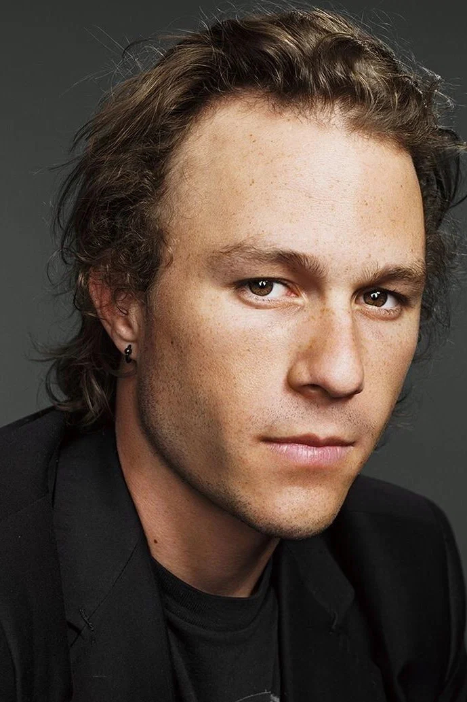
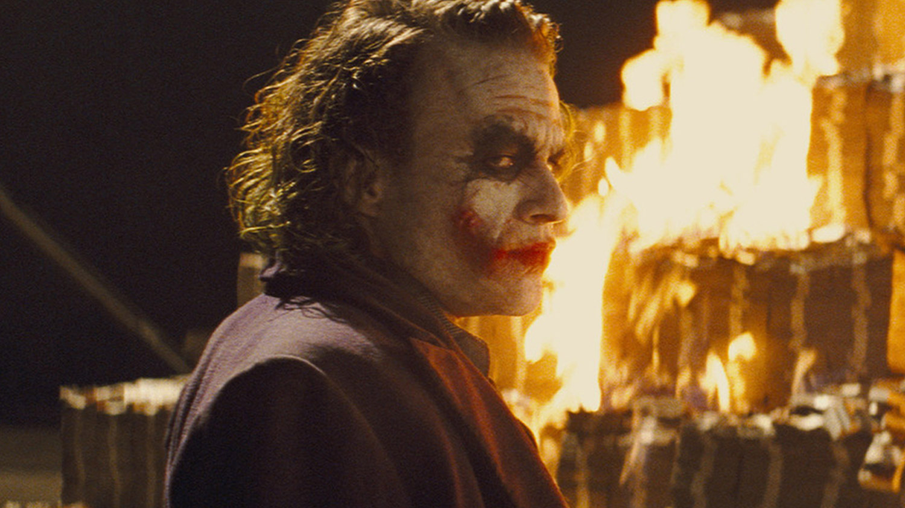
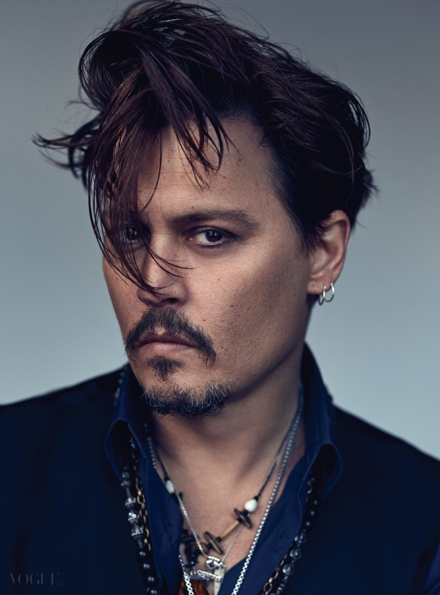
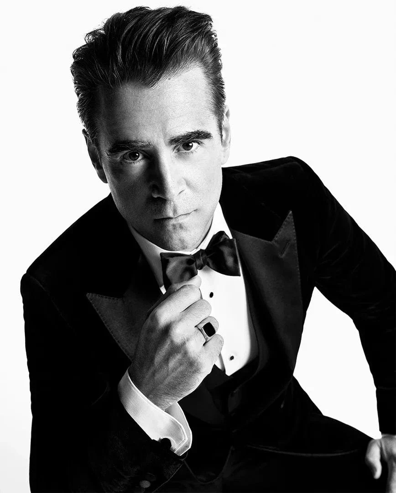

# 히스 레저 유산과 조니 뎁, 주드로, 콜린 파렐 세 배우

히스 레저의 유산과 세 배우의 출연료 기부는 사실이지만, 딸이 200억 원 상속 재판에 휘말렸다는 이야기는 사실과 다르다.

히스 레저가 세상을 떠난 뒤 딸 마틸다의 이름이 유언장에 없었다는 사실이 알려지면서 상속을 둘러싼 논란이 커졌다. 그 과정에서 조니 뎁과 콜린 파렐, 주드 로의 선행까지 하나의 감동적인 이야기로 묶이기 시작했다.

문제는 시간이 지나면서 실제로 벌어진 일과 나중에 덧붙은 이야기가 뒤섞였다는 점이다. 상속 분쟁이 벌어질 가능성이 제기된 것과 실제 재판이 열린 것은 다르다. 세 배우가 출연료를 포기한 것도 사실이지만, 그 금액이나 유족의 결정에 미친 영향까지 모두 확인된 사실이라고 보기는 어렵다.

## 핵심 요약

* 히스 레저는 **마틸다가 태어나기 전인 2003년에 유언장**을 작성했고, 당시 유언장에는 부모와 형제자매가 수혜자로 지정되어 있었다.
* 사망 뒤 마틸다와 어머니 미셸 윌리엄스의 상속 문제가 언론의 관심을 받았고, 가족 내부의 갈등도 실제로 공개됐다.
* 조니 뎁, 콜린 파렐, 주드 로는 《파르나서스 박사의 상상극장》에서 히스 레저의 역할을 이어받았고 **자신들의 출연료를 마틸다에게 기부했다**.
* 마틸다가 약 200억 원의 유산을 두고 직접 상속 재판에 휘말렸다는 이야기는 실제 결과와 다르다.
* 히스 레저의 가족은 2008년 결국 **유산을 마틸다에게 주기로 결정**했고, 킴 레저는 별도의 상속 청구가 없다고 밝혔다.
* 세 배우가 기부한 정확한 금액은 공개되지 않았으며, 수백만 달러라는 구체적인 액수는 추정에 해당한다.

## 1. 히스 레저의 유언장에는 왜 마틸다가 없었을까?

상속 논란의 출발점은 유언장이 작성된 시점이다. 히스 레저는 2003년 4월 유언장을 작성했고, 당시에는 마틸다가 아직 태어나지 않았다. 딸 마틸다 로즈는 2005년에 태어났기 때문에 기존 유언장에 딸의 이름이 들어갈 수 없었던 셈이다.

유언장에는 부모와 세 자매가 수혜자로 지정되어 있었다. 히스 레저가 2008년 1월 갑작스럽게 사망하면서 이 오래된 유언장이 그대로 법적 절차의 출발점이 됐다. 이후 언론은 마틸다와 미셸 윌리엄스에게 유산이 돌아갈 수 있을지를 집중적으로 다뤘다.

당시 유산 규모는 보도에 따라 차이가 있지만 수천만 달러에 이르는 상당한 규모로 추정됐다. 더구나 히스 레저가 《브로크백 마운틴》과 《다크 나이트》를 거치며 세계적인 스타가 된 시점이었기 때문에 오래전에 작성된 유언장과 실제 재산 사이의 격차도 컸다.

유언장에 마틸다가 없었다는 사실 자체가 곧 마틸다에게 유산이 돌아가지 않는다는 의미는 아니다. 실제 상속 절차에서는 별도의 청구 가능성이 제기될 수 있었고, 당시 언론도 바로 그 가능성을 둘러싸고 보도했다.

## 2. 실제로 가족 사이에 상속 갈등이 있었을까?

가족 내부의 갈등이 언론에 등장한 것은 사실이다. 히스 레저가 사망한 직후 일부 친척들이 유언장과 재산 관리 문제를 공개적으로 언급하면서 논란이 커졌다.

2008년 3월에는 킴 레저의 형제들이 마틸다와 미셸 윌리엄스가 유산에서 충분한 몫을 받지 못할 수 있다는 우려를 공개적으로 제기했다. 일부 친척은 킴 레저의 재산 관리 능력에 대해서도 문제를 제기했다.

킴 레저의 대응은 달랐다. 그는 마틸다가 가족의 최우선 대상이며, 미셸 윌리엄스 역시 가족의 중요한 일원이라고 강조했다. 가족 문제를 공개적으로 벌이는 것을 자제해 달라는 입장도 함께 밝혔다.

당시 상황을 단순히 "가족들이 돈을 두고 싸웠다"고 정리하는 것은 지나치다. 실제로는 상속 구조와 재산 관리 문제를 둘러싼 가족 내부의 공개적인 충돌이 있었고, 그 과정에서 마틸다의 상속권을 걱정하는 목소리가 등장한 것이다.

그리고 이 시점이 세 배우의 행동과 맞물린다.

## 3. 조니 뎁, 콜린 파렐, 주드 로는 왜 유작에 참여했을까?

히스 레저는 사망 당시 테리 길리엄 감독의 《파르나서스 박사의 상상극장》을 촬영하고 있었다. 문제는 영화 촬영이 아직 끝나지 않았다는 것이었다.

처음에는 영화 자체를 중단하는 방안까지 고려됐다. 이미 촬영된 히스 레저의 장면을 살리면서 남은 촬영을 어떻게 끝낼 것인지가 제작진에게 현실적인 문제로 남았다.

해법을 찾았다.

영화 속 주인공 토니가 마법의 거울을 통과하면서 외모가 변하는 설정을 활용해, 한 명의 배우가 아니라 세 명의 배우가 같은 인물을 이어서 연기하는 방식이었다. 조니 뎁과 주드 로, 콜린 파렐이 각각 다른 모습의 토니를 맡으면서 히스 레저가 이미 촬영한 장면도 그대로 영화에 남길 수 있었다.

테리 길리엄은 아무 배우나 골라 대체한 것이 아니라고 여러 차례 설명했다. 그는 히스 레저를 알고 사랑했던 친구들을 먼저 불렀다. 실제로 다른 유명 배우들도 참여 의사를 보였지만, 길리엄은 히스 레저와 가까운 사람들이 영화에 함께하기를 원했다.

조니 뎁은 가장 먼저 참여 의사를 밝혔고, 이후 주드 로와 콜린 파렐이 합류했다. 세 사람은 충분한 리허설을 거칠 시간도 없이 촬영에 들어갔다.

그 과정 자체가 평범한 대체 캐스팅과는 달랐다.

## 4. 세 배우가 출연료를 마틸다에게 기부한 것은 사실일까?

그렇다. 이 부분은 확인된 사실이다.

2008년 8월 당시 보도에 따르면 조니 뎁과 주드 로, 콜린 파렐은 《파르나서스 박사의 상상극장》에서 히스 레저의 역할을 이어받으면서 자신들의 출연료를 그의 딸 마틸다에게 기부하기로 했다.

테리 길리엄 역시 세 배우가 돈을 받지 않았고 그 돈이 히스 레저의 딸에게 돌아갔다고 직접 설명했다. 당시 길리엄이 세 배우의 결정을 특별하게 평가한 것도 이 때문이다.

다만 인터넷에서 퍼지는 이야기 중에는 여기서 한 단계 더 나아간 주장도 많다. 세 배우가 각각 얼마를 받았는지, 정확히 얼마를 기부했는지, 러닝 개런티까지 모두 포기했는지는 공개 자료만으로 확정하기 어렵다.

출연료 기부는 사실이지만 구체적인 수백만 달러의 총액은 추정이라고 구분하는 것이 정확하다.

## 5. 세 배우의 기부가 상속 분쟁을 막았다는 이야기는 사실일까?

이 부분부터는 사실과 해석을 나눠야 한다.

세 배우가 기부를 결정한 시점에는 마틸다의 상속 문제가 언론의 관심을 받고 있었다. 오래된 유언장 때문에 딸에게 재산이 바로 넘어가지 않을 수 있다는 우려도 존재했다. 따라서 세 배우가 마틸다의 경제적 안전을 염두에 두고 기부를 결정했다고 설명하는 것은 당시 보도와 크게 어긋나지 않는다.

"세 배우가 기부했기 때문에 레저 가문이 마음을 돌렸다"거나 "기부가 유족에게 결정적인 심리적 압박을 줘 상속 포기를 이끌어냈다"고 단정할 근거는 충분하지 않다.

시간의 흐름만 놓고 보면 흥미로운 장면이 만들어진다.

2008년 1월 히스 레저가 사망했고, 3월에는 유언장과 가족 문제가 공개적으로 논란이 됐다. 8월에는 세 배우의 출연료 기부가 알려졌고, 9월에는 킴 레저가 가족의 유산을 마틸다에게 주기로 했다고 밝혔다.

타임라인은 분명 연결되어 있다. 하지만 시간적으로 이어져 있다는 것과 인과관계가 입증됐다는 것은 다르다.

세 배우의 행동이 유족에게 좋은 영향을 주었을 가능성을 이야기하는 것과, 그것이 가족 결정의 직접적인 원인이었다고 사실처럼 쓰는 것은 구분해야 한다.

## 6. 마틸다는 정말 200억 원 상속 재판에 휘말렸을까?

아니다. 이 표현은 실제 사건을 지나치게 극적으로 바꿔놓은 것이다.

당시에는 마틸다와 미셸 윌리엄스가 상속에 대해 법적 청구를 할 가능성이 언론에서 거론됐다. 가족 내부에서도 유산과 재산 관리 문제를 둘러싼 공개적인 논쟁이 있었다.

최종 결과는 장기간 이어지는 상속 재판이 아니었다.

2008년 9월 킴 레저는 가족이 유산 전체를 마틸다에게 주었다고 공개적으로 밝혔다. 그는 "There is no claim"이라고 말하며 마틸다를 위해 가족이 재산을 넘겼다고 설명했다.

정확한 서술은 "마틸다가 200억 원 상속 재판을 치렀다"가 아니다. 마틸다에게 유산이 돌아갈 수 있을지를 둘러싸고 논란과 우려가 있었지만 가족이 자발적으로 유산을 넘겨 실제 상속 분쟁으로 이어지지 않았다는 것이다.

금액 역시 마찬가지다. 국내에서 약 195억 원이라는 환산액이 널리 언급되지만 당시 외신은 달러와 호주달러 기준으로 여러 추산치를 제시했다. 환율과 시점이 다르기 때문에 특정 원화 금액 하나를 절대적인 숫자로 고정하는 것에는 주의가 필요하다.

## 7. 세 배우와 히스 레저의 관계는 실제로 어느 정도였을까?

세 배우를 단순히 "돈을 기부한 유명 배우들"이라고만 설명하면 유작의 맥락을 놓치게 된다.

테리 길리엄은 영화 완성을 위해 히스 레저와 가까웠던 사람들을 찾았다. 특히 조니 뎁은 길리엄의 연락을 받고 바로 참여 의사를 밝혔고, 그의 일정이 맞지 않았다면 영화 자체의 완성이 더 어려워졌을 가능성도 있었다고 길리엄은 회고했다.

주드 로와 콜린 파렐 역시 히스 레저와 알고 지내던 배우들이었다. 이들이 참여한 중요한 이유 가운데 하나는 단순히 유명 배우였기 때문이 아니라 히스 레저의 자리를 대신하는 사람으로 적합했기 때문이다.

다만 인터넷에서 흔히 묘사되는 세 사람의 관계를 전부 사실로 받아들일 필요는 없다. "소울메이트", "친형제 같은 사이", "평생 대부 역할을 했다"와 같은 표현은 당시 확인 가능한 자료보다 후대의 미담 콘텐츠에서 훨씬 강하게 확대됐다.

확실한 사실은 세 사람이 히스 레저의 친구였고, 그의 마지막 작품을 완성하기 위해 위험 부담을 감수하며 참여했다는 것이다.

## 8. 영화 속에서는 어떻게 네 명의 배우가 한 인물이 되었을까?

이 영화의 가장 독특한 장치는 배우 교체를 이야기 속에 집어넣었다는 것이다.

히스 레저가 연기한 토니는 영화 속에서 마법의 거울을 통과한다. 이때 현실 세계의 모습과 상상의 세계에서 보이는 외모가 달라질 수 있다는 설정을 이용했다.

그래서 히스 레저가 촬영한 장면 뒤를 조니 뎁이 이어받고, 다시 주드 로와 콜린 파렐이 등장한다. 각각의 배우는 완전히 새로운 인물을 맡은 것이 아니라 동일한 토니의 다른 모습을 연기한다.

이 방식은 제작 현실과 영화의 환상적 설정을 동시에 해결했다. 히스 레저의 이미 촬영한 분량을 폐기하지 않고 살릴 수 있었고, 대체 배우의 등장 역시 극적인 장치가 됐다.

테리 길리엄은 한 명의 배우가 히스 레저를 대신하는 방식은 적절하지 않다고 봤다. 대신 세 사람이 역할을 나누면 히스 레저의 자리를 한 사람이 대체한다는 느낌을 줄일 수 있다고 판단했다.

영화 자체도 이런 과정을 숨기지 않았다. 엔딩 크레디트에는 **"By Heath and Friends"**라는 문구가 들어갔다. 히스 레저 혼자 완성한 영화가 아니라, 그가 떠난 뒤 친구들과 동료들이 함께 마무리한 작품이라는 의미가 그대로 남은 셈이다.

## 결론

히스 레저와 마틸다를 둘러싼 이야기는 사실만으로도 충분히 극적이다. 마틸다가 태어나기 전에 작성된 유언장 때문에 상속 문제가 발생했고, 가족 내부의 갈등이 실제 언론에 등장했다. 그 혼란 속에서 조니 뎁, 주드 로, 콜린 파렐은 친구의 마지막 영화를 완성하기 위해 히스 레저의 역할을 이어받았고, 출연료를 그의 딸에게 기부했다.

여기에 "200억 원 상속 재판"이라는 이야기를 덧붙이면 사건의 실제 모습과 달라진다. 상속 분쟁의 가능성이 제기된 것은 사실이지만 마틸다가 유산을 두고 장기간 재판을 치른 것은 아니다. 가족은 결국 유산을 마틸다에게 넘겼다.

세 배우의 기부와 가족의 결정 사이에 어떤 심리적 영향이 있었는지는 충분히 생각해볼 만한 부분이다. 하지만 그 연결고리를 확인된 사실처럼 단정할 자료는 없다.

이 이야기를 가장 정확하게 바라보는 방법은 감동을 조금 덜어내는 것이다. 그러고 나면 오히려 핵심이 선명해진다.

히스 레저가 남긴 오래된 유언장은 딸의 탄생이라는 현실의 변화를 반영하지 못했다. 가족은 결국 그 문제를 스스로 정리했고, 친구들은 완성되지 못할 뻔한 그의 마지막 작품을 함께 끝냈다. 상속 재판의 비극이 아니라, 상속 논란과 유작의 위기를 주변 사람들이 각자의 방식으로 정리한 사건에 가깝다.

## 자주 묻는 질문(FAQ)

### 히스 레저의 유언장에는 왜 딸 마틸다가 없었나?

히스 레저가 유언장을 작성한 시점은 마틸다가 태어나기 전인 2003년이었다. 따라서 당시 유언장에는 딸의 이름이 들어 있지 않았다.

### 조니 뎁, 주드 로, 콜린 파렐은 실제로 출연료를 기부했나?

그렇다. 세 배우는 히스 레저의 마지막 영화에 참여하면서 자신들의 출연료를 마틸다에게 기부했다고 당시 보도됐다.

### 세 배우가 기부한 금액은 얼마인가?

정확한 총액은 공개적으로 확인되지 않는다. 수백만 달러라는 이야기가 널리 퍼졌지만 구체적인 금액은 추정치로 보는 것이 적절하다.

### 마틸다는 200억 원 상속 재판을 치렀나?

아니다. 상속 문제가 언론의 관심을 받고 가족 내부의 갈등도 공개됐지만, 마틸다가 장기간 상속 재판을 벌인 사건으로 끝나지는 않았다.

### 히스 레저의 유산은 최종적으로 누구에게 돌아갔나?

히스 레저의 아버지 킴 레저는 2008년 가족이 유산 전체를 마틸다에게 주기로 했다고 밝혔다. 따라서 오래된 유언장의 내용과 실제 최종 귀속에는 차이가 생겼다.