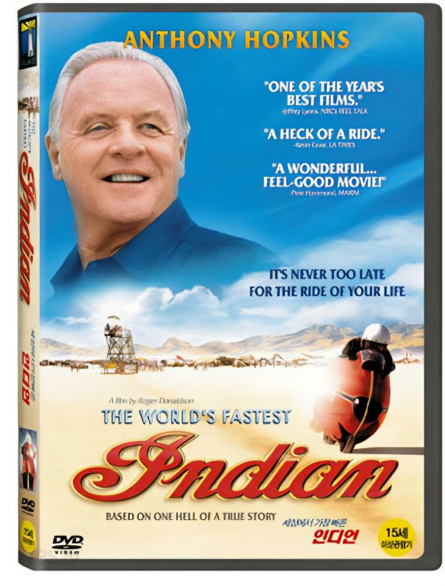
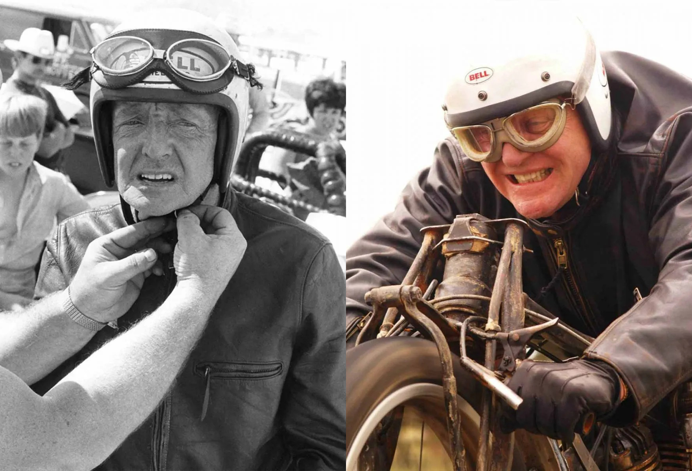

# 버트 먼로 전설인 이유 - [세상에서 가장 빠른 인디언] 한국 사회 메시지

[세상에서 가장 빠른 인디언] 은 버트 먼로의 실화를 통해 기록보다 삶의 태도가 왜 더 오래 남는지, 그리고 그 메시지가 오늘날 한국 사회에 어떤 의미를 가지는지 분석한다.

이 영화는 단순한 스포츠 영화도, 성공 신화를 미화하는 작품도 아니다. 세계 최고 속도 기록이라는 결과는 마지막에 등장할 뿐이며, 영화가 진짜로 보여주는 것은 한 인간이 **평생 하나의 목표를 향해 살아가는 방식**이다. 버트 먼로라는 인물은 속도를 사랑했던 사람이 아니라, 과정 자체를 사랑했던 사람이었으며, 그렇기 때문에 그의 이야기는 수십 년이 지난 지금도 많은 사람들에게 깊은 울림을 준다.

## 핵심 요약

* **버트 먼로**는 1920년식 인디언 스카우트를 약 40년 동안 직접 개조하여 1967년 보니빌 소금사막에서 세계 기록을 세웠다.
* 영화의 감동은 세계 기록보다도 평생 하나의 꿈을 포기하지 않았던 삶의 과정에서 나온다.
* 그의 오토바이는 최신 기술의 산물이 아니라 수많은 실패와 재설계를 반복한 집념의 결과였다.
* 버트 먼로는 엔지니어이면서 동시에 세계 최고 수준의 라이더였으며, 기계와 인간이 하나가 된 사례로 평가된다.
* 영화는 나이, 돈, 환경보다 자신의 삶을 어떻게 살아갈 것인가를 더 중요한 질문으로 던진다.
* 한국 사회에서 이 영화는 단순한 도전정신보다도 '타인의 기준으로부터 얼마나 독립할 수 있는가'라는 질문으로 읽을 필요가 있다.

## 1. 영화는 왜 지금까지도 회자되는가?

2005년에 개봉한 **[세상에서 가장 빠른 인디언(The World's Fastest Indian)]** 은 뉴질랜드 출신 라이더 **버트 먼로(Burt Munro)**의 실화를 바탕으로 제작된 영화다. 앤서니 홉킨스는 노년의 버트를 연기하며 단순히 괴짜 노인을 표현한 것이 아니라, 평생 한 가지 꿈만 바라보고 살아온 인간의 모습을 설득력 있게 보여준다.

대부분의 스포츠 영화는 대회 우승이나 경쟁에서의 승리를 중심으로 이야기를 전개한다. 그러나 이 작품은 구조가 전혀 다르다.

버트에게 세계 기록은 인생의 목적이 아니라, 평생 살아온 방식이 마지막에 하나의 결과로 나타난 사건일 뿐이다. 관객이 감동하는 이유 역시 기록 그 자체가 아니라 기록에 도달하기까지 흘러간 **40년이라는 시간**에 있다.

실제로 영화를 보고 시간이 지난 뒤에도 사람들이 기억하는 장면은 속도계 숫자가 아니다.

* 차고에서 혼자 부품을 깎는 모습
* 주변 사람들과 웃으며 대화하는 모습
* 돈이 없어도 포기하지 않는 태도
* 미국으로 떠나는 여정
* "가야 할 때 가지 않으면, 가려 할 때는 갈 수가 없단다."라는 대사

결국 영화는 세계 기록을 보여주기 위해 존재하는 작품이 아니라, 한 인간이 자신의 삶을 어떻게 살아갔는지를 보여주는 작품이라고 볼 수 있다.

## 2. 버트 먼로는 무엇을 이루었는가?

버트 먼로가 세운 기록은 단순히 "오래된 오토바이로 빠르게 달렸다"는 수준이 아니다.

그가 사용한 오토바이는 **1920년식 인디언 스카우트**였다. 원래 최고속도는 약 시속 110km 수준의 평범한 바이크였지만, 그는 수십 년 동안 엔진과 차체를 끊임없이 개조하여 약 **950cc**까지 배기량을 확대했고, 1967년 미국 보니빌 소금사막에서 1,000cc 이하 클래스 세계 최고 속도를 기록했다.

당시 기록은 왕복 평균 **184.087mph(약 296.26km/h)**로, 이후 계산 오류가 수정되면서 사후에 공식 기록이 다시 정정되었다.

더 중요한 점은 이 기록이 세워진 방식이다.

* 최신 공장에서 만든 레이싱 머신이 아니었다.
* 대기업 연구소가 개발한 엔진도 아니었다.
* 전문 엔지니어 팀이 만든 프로젝트도 아니었다.

오직 한 사람이 차고에서 수십 년 동안 반복한 실패와 개조가 만든 결과였다.

그래서 버트 먼로의 기록은 단순한 속도의 기록이 아니라 **인간의 집념이 만든 기록**으로 평가된다.

## 3. 1920년식 엔진으로 시속 296km를 기록했다는 것은 왜 공학적 기적인가?

버트 먼로의 기록을 제대로 이해하려면 먼저 그가 출발한 기술 수준을 알아야 한다.

1920년식 **인디언 스카우트(Indian Scout)**는 당시로서는 우수한 오토바이였지만, 현대 기준에서는 극도로 단순한 구조였다. 특히 초기 **사이드 밸브(Side Valve, Flathead)** 엔진은 출력과 효율을 높이는 데 구조적인 한계를 안고 있었다.

즉, 버트는 성능이 부족한 엔진을 조금 튜닝한 것이 아니라, 애초에 고속 주행을 상정하지 않았던 엔진을 세계 최고 속도 기록용으로 다시 태어나게 만든 것이다.

### 사이드 밸브 엔진의 구조적 한계

사이드 밸브 방식은 흡기와 배기 밸브가 실린더 옆에 배치된다.

이 구조는 제조가 쉽고 내구성이 좋지만, 고출력을 얻기에는 치명적인 약점을 가진다.

* **흡기 효율의 한계**
  * 공기와 연료가 직선으로 들어가지 못하고 여러 번 꺾이며 유입된다.
  * 고회전으로 갈수록 흡입 효율이 급격히 떨어진다.

* **압축비 상승의 한계**
  * 연소실이 넓게 형성되어 높은 압축비를 만들기 어렵다.
  * 출력을 높이려 하면 노킹과 과열 문제가 쉽게 발생한다.

* **열관리의 한계**
  * 배기 열이 실린더 블록에 집중된다.
  * 장시간 고부하 운전 시 과열 가능성이 매우 높다.

현대의 고성능 엔진은 대부분 **OHV**, **SOHC**, **DOHC** 구조를 사용하는 이유도 이러한 한계를 극복하기 위해서다.

### 단순한 보어업이 아니었다

버트 먼로는 단순히 실린더를 크게 깎아 배기량만 늘린 것이 아니다.

그는 오랫동안 반복적인 실패를 통해 거의 모든 핵심 부품을 다시 설계했다.

대표적인 개조는 다음과 같다.

* **배기량 확대**
  * 약 600cc였던 엔진을 약 950cc 수준까지 확장했다.

* **실린더 헤드 재설계**
  * 흡배기 효율 향상을 위해 헤드 구조를 지속적으로 수정했다.

* **흡배기 포트 가공**
  * 공기 흐름을 조금이라도 개선하기 위해 수없이 형상을 바꾸었다.

* **연소실 형상 변경**
  * 압축비를 높이기 위해 연소실 용적을 반복적으로 수정했다.

* **회전계와 계측 장비 없이 반복 테스트**
  * 실제 주행 결과를 바탕으로 다음 버전을 제작하는 방식이었다.

오늘날이라면 CAD, 유한요소해석(FEA), 유동해석(CFD), 엔진 다이노를 활용했을 작업을 그는 자신의 경험과 감각만으로 수행했다.

## 4. 버트 먼로는 왜 40년 동안 같은 엔진을 붙잡았는가?

많은 사람들이 "왜 그렇게 오랜 시간이 걸렸는가?"라는 의문을 가진다.

답은 의외로 단순하다.

버트는 연구소도 없었고, 투자자도 없었으며, 최신 장비도 없었다.

그는 **모든 실패를 스스로 비용으로 감당해야 하는 개발자**였다.

낮에는 생계를 위해 오토바이 정비와 판매 일을 했고, 퇴근 후에는 자신의 차고에서 새벽까지 엔진을 만들었다.

그의 개발 과정은 현대의 연구개발과는 완전히 달랐다.

### 실패 자체가 데이터였다

현대 기업은 설계가 끝난 뒤 시제품을 만든다.  
버트는 반대로 움직였다.  
먼저 만들어 보고, 터지면 이유를 찾고, 다시 만들었다.  
그 과정이 수십 년 동안 반복됐다.

예를 들어,

* 피스톤이 녹으면 합금을 바꾸었다.
* 커넥팅 로드가 부러지면 열처리를 수정했다.
* 압축이 새면 연소실 형상을 다시 깎았다.
* 과열되면 냉각 방식을 다시 고민했다.

이러한 반복은 단순한 시행착오가 아니라 **실패를 통해 설계를 진화시키는 과정**이었다.  
오늘날 소프트웨어 개발에서 말하는 애자일(Agile)이나 MVP(Minimum Viable Product) 방식과도 닮아 있다.

### 돈이 없다는 것은 오히려 개발 방식이 되었다

버트는 필요한 부품을 주문할 수 있는 사람이 아니었다.  
그는 폐차장을 연구소처럼 활용했다.

* 폐기된 자동차 피스톤
* 트럭 차축
* 고철 파이프
* 버려진 알루미늄

이런 재료들을 가져와 직접 녹이고, 깎고, 다시 만들었다.  
주방에서 피스톤을 주조하고, 줄과 사포로 수개월 동안 부품을 다듬는 모습은 현대인의 시각에서는 비효율적으로 보인다.

하지만 그는 돈 대신 **시간과 집념**을 투자했다.  
그에게 부족했던 것은 자금이었지, 반복 실험을 계속할 의지는 아니었다.

### 엔진보다 먼저 성장한 것은 사람이었다

40년 동안 발전한 것은 엔진만이 아니었다.  
버트 자신도 함께 발전했다.

수천 번의 실패를 겪으면서 그는 금속의 성질, 열처리의 결과, 연료의 특성, 진동의 의미를 몸으로 익혔다.  
이러한 경험은 책으로 배운 지식이 아니라, 실패를 축적하며 얻은 경험 데이터였다.

그래서 버트 먼로의 차고는 단순한 작업장이 아니라, 수십 년 동안 이어진 하나의 개인 연구소였다고 볼 수 있다.

## 5. 버트 먼로는 엔지니어였을까, 라이더였을까?

버트 먼로를 단순한 정비공이나 라이더 가운데 하나로만 정의하기는 어렵다.

그는 **엔지니어**, **제작자**, **시험 개발자**, **테스트 라이더**의 역할을 모두 혼자 수행한 인물이었다. 현대 모터스포츠에서는 이 역할들이 각각 별도의 전문가에게 분리되어 있지만, 버트는 하나의 몸으로 모든 과정을 책임졌다.

바로 이 점이 그의 기록을 더욱 특별하게 만든다.

### 기계를 가장 잘 이해한 사람은 기계를 만든 사람이었다

오늘날 레이싱에서는 차량을 설계하는 엔지니어와 실제 운전하는 드라이버가 서로 다른 사람인 경우가 대부분이다.

엔지니어는 데이터를 통해 차량을 이해하고, 드라이버는 감각을 통해 차량을 이해한다.  
버트 먼로는 그 둘을 모두 갖춘 드문 사례였다. 그는 엔진을 직접 만들었기 때문에 다음과 같은 사실을 누구보다 잘 알고 있었다.

* 어느 회전수에서 진동이 커지는지
* 어느 정도 온도에서 출력이 떨어지는지
* 어느 부품이 가장 먼저 한계에 도달하는지
* 어느 정도까지는 무리해도 버틸 수 있는지

이런 정보는 계측기로 얻은 것이 아니라 수십 년 동안 같은 오토바이를 타며 축적한 경험이었다.

## 6. 세계 기록을 만든 마지막 퍼즐은 운전 실력이었다

버트 먼로의 엔진은 당시 기준으로도 극한까지 개조된 기계였다. 하지만 아무리 뛰어난 엔진이라도 그것만으로는 세계 기록을 만들 수 없었다.

오히려 극단적인 개조 때문에 그의 오토바이는 현대 레이스 머신보다 훨씬 위험한 상태였다. 부품 하나만 버티지 못해도 엔진은 즉시 파손될 수 있었고, 고속에서 차체가 흔들리면 치명적인 사고로 이어질 가능성도 높았다.

결국 마지막 한계를 넘은 것은 **라이더 버트 먼로**였다.

### 그는 계기판보다 몸을 믿었다

오늘날 레이스에서는 ECU가 실시간으로 다음과 같은 정보를 보여준다.

* 엔진 회전수(RPM)
* 냉각수 온도
* 배기 온도
* 연료 분사량
* 노킹 발생 여부
* 오일 압력

하지만 버트에게는 그런 장비가 없었다.

그는 오직 자신의 감각으로 엔진 상태를 읽었다.

* 손끝으로 전해지는 미세한 진동
* 엉덩이로 느껴지는 차체의 떨림
* 배기음의 높낮이
* 엔진이 내는 금속성 소리

이러한 감각을 종합해 "지금이 한계다"라는 순간을 판단했다.

즉, 그는 기계를 조종한 것이 아니라 **기계와 대화하며 달렸다**고 표현하는 편이 더 정확하다.

### 피시테일 현상조차 받아들였다

고속에서 오토바이 뒤쪽이 좌우로 흔들리는 현상을 **피시테일(Fishtailing)**이라고 한다. 오늘날 레이싱에서는 매우 위험한 상황으로 여겨지며, 대부분 즉시 속도를 줄인다. 그러나 버트 먼로는 기록 주행 중 이 현상을 경험하고도 가속을 멈추지 않았다.

속도를 줄이면 기록은 사라진다. 속도를 유지하면 사고 위험이 커진다. 그는 두 선택지 가운데 후자를 택했다.  
이는 무모함이라기보다 자신의 기계를 누구보다 잘 알고 있었기에 가능한 판단이었다.

### 부족한 기계를 인간이 완성했다

현대의 레이스 머신은 전자제어와 정밀 설계를 통해 라이더의 부담을 줄인다.  
버트의 오토바이는 정반대였다. 기계가 부족한 만큼 사람이 부족한 부분을 메워야 했다.  
그의 기록은 단순히 엔진의 성능이 아니라 다음 세 요소가 동시에 맞물린 결과였다.

| 요소 | 역할 |
|------|------|
| **기계** | 수십 년 동안 직접 개조한 엔진 |
| **경험** | 실패를 통해 축적한 방대한 데이터 |
| **라이딩** | 한계 직전까지 유지하는 정밀한 제어 |

이 셋 가운데 하나라도 부족했다면 세계 기록은 불가능했을 가능성이 높다.

## 7. 영화보다 더 놀라운 실제 이야기

영화만 보면 세계 기록을 세우고 모든 이야기가 끝난 것처럼 보인다.

그러나 실제 버트 먼로의 삶에는 영화보다 더 놀라운 뒷이야기가 남아 있다.

### 사후 36년 만에 기록이 다시 경신되었다

버트 먼로는 1978년에 세상을 떠났다.

그로부터 수십 년이 흐른 뒤, 그의 아들 존 먼로는 당시의 공식 기록을 다시 검토하다 이상한 점을 발견했다.  
1967년 보니빌 기록은 왕복 평균 속도로 계산되는데, 공식 인증서의 계산값이 실제 평균보다 낮게 기재되어 있었던 것이다.

결국 기록을 다시 검증한 결과 계산 오류가 확인되었고, 공식 기록은 다음과 같이 수정되었다.

| 구분 | 속도 |
|------|------:|
| 기존 공식 기록 | 약 **295.45km/h** |
| 수정 후 공식 기록 | 약 **296.26km/h** |

세상을 떠난 지 36년이 지난 사람이 자신의 세계 기록을 다시 경신한 셈이다.

이처럼 기록 자체가 사후에 수정되어 더 빨라진 사례는 모터스포츠 역사에서도 매우 드물다.

### 왜 아직도 기록이 남아 있는가?

흔히 "1967년 기록이 아직도 안 깨졌다는 것이 가능한가?"라는 의문을 가진다. 엄밀히 말하면 현대의 오토바이는 훨씬 빠르다. 1000cc급 머신으로 시속 400km를 넘기는 사례도 존재한다.

그럼에도 버트 먼로의 이름이 기록 보유자로 남아 있는 이유는 그가 세운 **세부 클래스**가 이후 규정 개편으로 사실상 사라졌기 때문이다.

즉,

* 동일한 규정
* 동일한 클래스
* 동일한 조건

에서 다시 도전할 수 없게 되었다.

그 결과 그의 기록은 단순한 최고 속도를 넘어, 하나의 **역사적 기록**으로 남게 되었다.

## 8. 감독이 말하고 싶었던 것은 '도전'이 아니라 삶의 태도였다

많은 사람들이 [세상에서 가장 빠른 인디언] 을 '도전정신을 그린 영화'로 기억한다.

틀린 해석은 아니지만, 작품이 전달하는 핵심을 모두 설명하기에는 부족하다.

이 영화의 감독 **로저 도널드슨(Roger Donaldson)**은 버트 먼로를 생전에 직접 만나 다큐멘터리를 촬영했던 인물이다. 그는 버트를 단순한 스포츠 영웅으로 바라보지 않았다.

영화가 반복해서 보여주는 것은 기록보다 **삶을 살아가는 방식**이다.

### 나이는 한계가 아니라 사회가 만든 기준이다

버트는 기록을 세울 당시 이미 예순을 훌쩍 넘긴 노인이었다. 심장 질환도 있었고, 돈도 없었으며, 최신 장비도 없었다. 일반적인 기준으로 보면 도전을 포기할 이유는 충분했다.

그러나 버트는 그런 조건을 특별하게 여기지 않았다. 그는 단지 자신이 하고 싶은 일을 계속했을 뿐이다.

그래서 영화는 "늙어서도 도전할 수 있다."라고 말하기보다, **사람은 스스로 포기하기 전까지 끝난 것이 아니다**라는 태도를 보여준다.

### 완벽한 준비를 기다리면 평생 출발하지 못한다

영화에서 가장 유명한 대사는 다음과 같다.

> "가야 할 때 가지 않으면 말이다... 가려 할 때는 갈 수가 없단다."

이 한 문장이 영화 전체를 관통한다.

버트는 완벽하게 준비된 상태에서 미국으로 떠난 것이 아니다. 오히려 준비되지 않았기 때문에 더 늦기 전에 떠났다.

* 돈도 부족했다.
* 엔진도 완벽하지 않았다.
* 건강도 좋지 않았다.

하지만 그는 시간이 자신의 편이 아니라는 사실을 누구보다 잘 알고 있었다.  
만약 모든 조건이 갖춰질 때까지 기다렸다면, 그는 평생 뉴질랜드 차고를 벗어나지 못했을 가능성이 크다.

### 과정 자체를 사랑한 사람

세상은 버트를 세계 기록 보유자로 기억한다. 하지만 버트 자신은 기록보다 **오토바이를 만드는 과정**을 더 사랑했던 사람에 가까웠다. 세계 기록을 세운 뒤에도 그는 화려한 삶을 선택하지 않았다.

다시 차고로 돌아가 오토바이를 만지고, 새로운 개조를 고민하며 살아갔다. 그에게 기록은 끝이 아니라, 평소 살아오던 방식의 연장선이었다.

그래서 이 영화는 성공학이 아니라, 한 사람이 자신의 삶을 어떤 태도로 살아야 하는지를 묻는 작품이라고 볼 수 있다.

## 9. 이 메시지는 오늘날 대한민국에서도 그대로 통할까?

여기서부터는 영화의 공식적인 내용과는 별개로, 현대 한국 사회에 적용했을 때의 의미를 생각해 볼 필요가 있다.

### 현실은 영화보다 훨씬 냉혹하다

버트 먼로의 삶을 그대로 따라 하는 것은 현실적으로 바람직하지도 않고 가능하지도 않다. 그는 평생 경제적으로 넉넉하지 못했고, 가족과의 관계에서도 희생을 치렀다. 

한국 사회에서 이러한 삶은 더 큰 위험을 동반한다.

* 높은 주거비
* 치열한 입시와 취업 경쟁
* 불안정한 노후
* 낮은 사회적 안전망
* 강한 비교 문화

이러한 환경에서는 생계를 포기한 채 하나의 꿈에 모든 것을 거는 행동이 개인뿐 아니라 가족 전체의 삶을 흔들 수 있다.

즉, 버트의 삶을 문자 그대로 모방하는 것은 현실적인 선택이 아니다.

### 한국 사회는 결과 중심의 평가가 강하다

대한민국에서는 결과가 개인의 가치를 결정하는 경우가 많다.

* 어느 대학을 나왔는가.
* 어떤 직장에 다니는가.
* 얼마를 버는가.
* 어디에 사는가.
* 어떤 차를 타는가.

이처럼 비교 가능한 지표가 사회적 평가 기준이 되기 쉽다.

이러한 문화에서는 과정 자체를 즐긴다는 말이 현실에서는 쉽게 받아들여지지 않는다. 돈이 되지 않는 일에 오래 몰두하는 사람은 장인으로 인정받기보다 현실 감각이 부족한 사람으로 평가받는 경우도 적지 않다.

영화 속 버트가 오늘날 한국 사회에서 같은 삶을 살았다면, 많은 사람은 그를 전설이 아니라 실패한 인생으로 먼저 판단했을 가능성도 있다.

이 점은 불편하지만 외면하기 어려운 현실이다.

### 그렇다고 영화의 메시지가 무의미한 것은 아니다

바로 이 지점에서 영화의 진짜 가치가 드러난다.

버트의 삶을 그대로 따라 하라는 것이 아니라, **삶의 기준을 누구에게 맡길 것인가**를 묻기 때문이다.

버트는 세상의 평가를 무시한 사람이 아니었다. 다만 자신의 행복을 타인의 평가보다 우선에 두었다. 오늘날 한국 사회에서 그대로 실천하기는 어렵더라도, 이 태도 자체는 여전히 의미가 있다. 남들과 경쟁하며 살아가더라도 삶의 모든 평가 기준까지 남에게 넘겨줄 필요는 없다.

생계는 현실적으로 유지하되, 자신이 진심으로 좋아하는 무언가를 포기하지 않는 것.  
영화는 극단적인 도전을 권하는 것이 아니라, 적어도 삶의 일부만큼은 **자신의 기준으로 살아갈 수 있는가**라는 질문을 던지고 있다.

## 결론

버트 먼로는 세계 기록을 세운 사람이기 때문에 전설이 된 것이 아니다. 오히려 그의 기록은 평생 이어진 삶의 태도가 마지막에 만들어 낸 결과였다.

그는 최신 기술도, 막대한 자본도, 전문 연구팀도 없었다. 부족한 장비와 한정된 자원 속에서 실패를 반복하며 스스로 배우고, 다시 만들고, 다시 도전하는 삶을 수십 년 동안 이어갔다. 현대 공학의 관점에서 보면 그의 방식은 비효율적이고 위험한 부분도 많았지만, 그 과정에서 보여준 **집요한 문제 해결 능력**과 **끝없는 실험 정신**은 지금도 높은 평가를 받는다.

이 영화가 오랫동안 사랑받는 이유도 바로 여기에 있다. 관객은 세계 기록이라는 숫자보다, 자신의 삶을 끝까지 스스로 선택하며 살아간 한 인간의 모습을 기억한다. 그래서 [세상에서 가장 빠른 인디언]은 스포츠 영화이면서 동시에 장인정신, 엔지니어 정신, 그리고 삶의 철학을 담은 작품으로 남아 있다.

다만 이 메시지를 오늘날 대한민국 사회에 그대로 적용하는 것은 신중해야 한다. 버트처럼 모든 것을 하나의 꿈에 걸었던 삶은 현재의 경제 구조와 사회 환경에서는 매우 큰 위험을 동반한다. 높은 주거비와 노후 부담, 치열한 경쟁 속에서 무조건적인 '올인'은 낭만이 아니라 생존 자체를 위협할 수도 있다.

그렇다고 영화가 현실과 동떨어진 판타지에 머무는 것은 아니다. 오히려 현대 사회일수록 더욱 중요한 질문을 던진다. **삶의 성공 기준을 누가 정하는가**라는 질문이다.

버트 먼로는 세상의 기준을 거부한 사람이 아니라, 자신의 행복을 스스로 결정한 사람이었다. 그의 삶에서 배워야 할 것은 무모한 도전이 아니라, 타인의 평가에 자신의 인생 전체를 맡기지 않는 태도다.

결국 [세상에서 가장 빠른 인디언]은 속도에 관한 영화가 아니다. 자신이 사랑하는 일을 끝까지 놓지 않았던 한 인간의 이야기이며, 결과보다 과정 속에서 삶의 의미를 발견할 수 있는가를 묻는 작품이다. 그래서 버트 먼로는 세계 기록 보유자를 넘어, 오늘날에도 여전히 많은 사람들에게 삶의 방향을 다시 생각하게 만드는 상징으로 남아 있다.

## 자주 묻는 질문(FAQ)

### 버트 먼로는 실제 인물인가?

그렇다. 버트 먼로(Burt Munro)는 뉴질랜드 출신의 실존 인물이며, 영화는 그의 실제 삶과 1967년 보니빌 소금사막에서 세운 세계 기록을 바탕으로 제작되었다. 영화적 연출을 위해 일부 사건과 인물은 각색되었지만, 핵심 줄거리는 실화에 기반한다.

### 영화 속 오토바이는 정말 1920년식 인디언 스카우트였는가?

그렇다. 버트 먼로는 1920년식 **인디언 스카우트(Indian Scout)**를 오랫동안 직접 개조하며 사용했다. 원형을 유지한 것이 아니라 엔진과 차체 대부분을 끊임없이 수정했기 때문에, 기록 당시의 오토바이는 사실상 평생에 걸쳐 진화한 결과물에 가까웠다.

### 버트 먼로의 세계 기록은 아직도 유효한가?

그가 세운 **세부 클래스** 기준의 공식 기록은 현재까지도 역사적 기록으로 남아 있다. 이후 경기 규정과 클래스 체계가 변경되어 동일한 조건에서 새로운 기록을 세우는 것이 사실상 불가능해졌기 때문이다. 현대 오토바이의 절대 속도는 훨씬 빠르지만, 이는 다른 규정과 클래스에서 달성된 기록이다.

### 버트 먼로는 천재 엔지니어였는가?

정규 공학 교육을 받은 연구자는 아니었지만, 수십 년 동안 반복한 실험과 실패를 통해 뛰어난 기술적 통찰을 축적했다. 현대적인 개발 환경과 비교하면 그의 작업 방식은 매우 원시적이었지만, 제한된 자원으로 문제를 해결한 사례라는 점에서 오늘날에도 높은 평가를 받는다.

### 이 영화가 오늘날 한국 사회에도 의미가 있는 이유는 무엇인가?

현실적으로 버트 먼로의 삶을 그대로 따라 하는 것은 위험할 수 있다. 하지만 자신의 행복을 타인의 평가보다 우선하는 태도, 그리고 생계와는 별개로 평생 몰입할 수 있는 무언가를 잃지 않는 자세는 경쟁과 비교가 강한 사회에서도 충분히 생각해 볼 가치가 있다.

