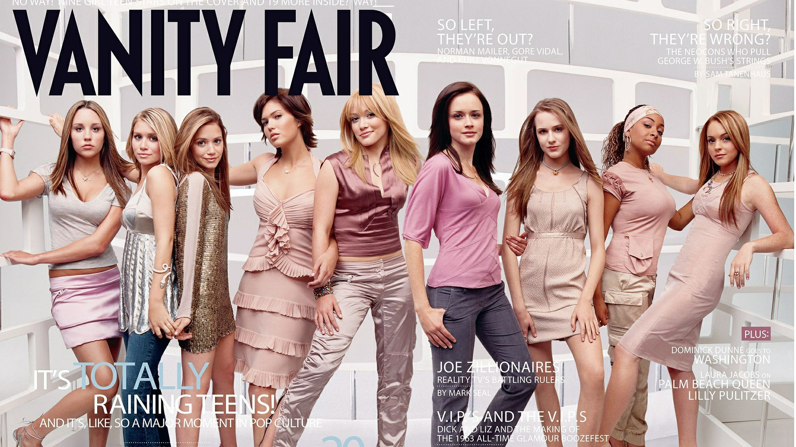
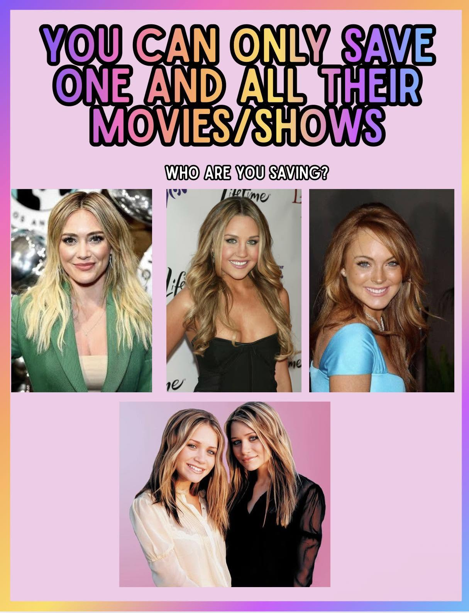

# 린제이 로한과 힐러리 더프 그시절 틴퀸과 하이틴 스타 차이

린제이 로한과 힐러리 더프는 같은 시대를 대표했지만 영화와 디즈니를 기반으로 전혀 다른 이미지와 커리어를 구축한 틴퀸이었다. 그 무렵 미국 하이틴 문화는 빠르게 커졌고, 두 사람은 각자의 방식으로 10대 대중문화의 중심에 섰다.

그 시절엔 아만다 바인즈까지 포함해 세 사람이 각자 자리에서 뚜렷한 존재감을 냈다. 린제이 로한은 화제를 몰고 다니는 영화 스타였고, 힐러리 더프는 누구나 편하게 좋아할 수 있는 친근한 스타였다. 아만다 바인즈는 코미디 하나로 확실한 자기 자리를 만들었다.

## 핵심 요약

* 린제이 로한은 할리우드 영화와 파파라치 문화 한복판에서 **잇걸 이미지**를 만들었다.
* 힐러리 더프는 디즈니 채널과 《리지의 사춘기》를 기반으로 **친근한 밀레니얼 아이콘**이 됐다.
* 린제이는 《페어런트 트랩》과 《퀸카로 살아남는 법》으로 영화계에서 먼저 존재감을 키웠다.
* 힐러리는 《리지의 사춘기》의 성공을 음반과 영화로 넓히며 **프랜차이즈 스타**로 성장했다.
* 두 사람은 아론 카터를 둘러싼 관계로 실제 언론의 관심을 받으면서 라이벌 구도가 한층 뚜렷해졌다.
* 두 사람의 차이는 단순한 인기 경쟁이 아니라 **스타를 만드는 산업과 이미지의 차이**에서 나왔다.

---

2000년대 초반 할리우드를 이끌던 하이틴 스타 9명이 한자리에 모인 커버 사진.  

배니티 페어(Vanity Fair) 2003년 7월호 표지 왼쪽부터  

아만다 바인즈(Amanda Bynes), 애슐리 올슨(Ashley Olsen), 메리케이트 올슨(Mary-Kate Olsen), 맨디 무어(Mandy Moore), 힐러리 더프(Hilary Duff), 알렉시스 브레델(Alexis Bledel), 에반 레이첼 우드(Evan Rachel Wood), 레이븐 시모네(Raven-Symoné), 린제이 로한(Lindsay Lohan)

## 1. 2000년대 틴퀸을 상징한 세 사람은 누구였을까?

2000년대 초중반 미국 하이틴 문화는 지금과 다른 스타 시스템 안에서 움직였다. TV와 극장, 음반 산업이 가까이 붙어 있었다. 어린 배우가 짧은 시간 안에 영화배우이자 가수, 패션 아이콘으로 성장할 수 있던 때다.

그 시절을 상징하는 인물이라면 **린제이 로한, 힐러리 더프, 아만다 바인즈**를 빼놓을 수 없다. 활동 기반은 저마다 달랐어도, 틴 스타라는 자리만큼은 셋이 겹쳤다.

2003년 7월, 《배니티 페어》가 실은 "It's Raining Teens!" 화보 한 장이 당시 분위기를 잘 보여준다. 아만다 바인즈, 메리케이트·애슐리 올슨 자매, 맨디 무어, 힐러리 더프, 알렉시스 블레델, 에반 레이첼 우드, 레이븐 시몬, 린제이 로한까지 — 한 프레임 안에 다 모였다.

그 무렵 할리우드는 젊은 배우와 가수들이 앞줄에 서던 시기였다. 그중에서도 린제이와 힐러리는 서로 다른 방식으로 대중의 기억 속에 자리를 잡았다.

| 항목     | 린제이 로한      | 힐러리 더프     | 아만다 바인즈      |
| ------ | ----------- | ---------- | ------------ |
| 핵심 채널  | 할리우드 메이저 영화 | 디즈니 채널     | 니켈로디언        |
| 최고 전성기 | 2003~2005년  | 2002~2004년 | 2003~2006년   |
| 대표 이미지 | 트렌디한 잇걸     | 친근한 이웃집 소녀 | 유쾌한 코미디 스타   |
| 강점 영역  | 영화와 화제성     | 음반과 프랜차이즈  | 슬랩스틱과 코미디 연기 |

그 시절 인터넷에서 유행하던 밸런스 게임처럼, "한 사람만 골라 그 사람 영화·방송만 본다면 누구를 고를까?"라는 질문도 가능했다. 그만큼 셋의 존재감은 컸다.

## 2. 힐러리 더프는 왜 가장 친근한 틴퀸이었을까?

힐러리 더프의 출발점은 디즈니 채널이다. 2001년 시작한 《리지의 사춘기》에서 리지 맥과이어를 연기하며, 또래 청소년이 공감할 캐릭터를 만들었다.

리지는 완벽한 스타가 아니었다. 평범하게 고민하고 실수도 했다. 힐러리 더프의 밝고 친근한 이미지가 이 캐릭터와 자연스럽게 겹치면서, 보는 사람들은 리지의 일상에 쉽게 마음을 붙였다.

이 인기는 드라마 한 편으로 끝나지 않았다. 《리지 맥과이어 무비》를 시작으로 《신데렐라 스토리》, 《에이전트 코디 뱅크스》, 《더즌 바이 더즌》까지 활동 영역을 넓혔다.

음악에서도 통했다. 2003년 낸 **《Metamorphosis》**는 빌보드 200 1위에 올랐고, 미국에서만 400만 장 넘게 팔려 4배 플래티넘을 받았다.

〈So Yesterday〉와 〈Come Clean〉은 그 시절 틴 팝을 대표하는 곡으로 남았다. 연기와 음악을 함께 소비할 수 있는 스타. 힐러리는 2000년대형 프랜차이즈 틴 아이돌에 가까웠다.

무엇보다 눈에 띄는 차이는 이미지였다.

린제이 로한에게는 늘 어딘가 위태로운 분위기가 따라다녔다. 반면 힐러리 더프는 부모까지 안심하고 좋아할 수 있는 스타였다. 이 차이가 그녀를 오래 사랑받는 스타로 만들었다.

## 3. 린제이 로한은 어떻게 영화계의 잇걸이 되었을까?

린제이 로한은 출발점부터 힐러리 더프와 달랐다. 영화 《페어런트 트랩》에서 1인 2역을 해내며 아역 배우로 먼저 이름을 알렸다. 이후 커리어는 영화 중심으로 흘렀다.

특히 2004년 《퀸카로 살아남는 법》이 린제이의 이미지를 크게 바꿔놓았다. 흥행뿐 아니라 대사와 의상, 캐릭터가 오랫동안 밈으로 돌았다. 이 작품은 지금도 **2000년대 하이틴 영화의 대표작**으로 남아 있다.

연기만 하는 배우도 아니었다. 2004년 앨범 《Speak》를 내고 가수로도 활동하면서, 영화와 음악을 함께 다루는 멀티 엔터테이너로 영역을 넓혔다.

하지만 그녀의 대중적 이미지를 만든 것은 작품만이 아니었다.

2000년대 초반은 **파파라치 문화가 절정**에 이른 시기였다. 패리스 힐튼, 브리트니 스피어스와 나란히, 린제이 로한은 사생활 자체가 뉴스가 되는 스타였다.

로우라이즈 청바지, 핑크빛 벨벳 트레이닝 슈트, 틴트 선글라스, 오버사이즈 모자. Y2K 스타일도 그녀의 이미지와 겹쳐졌다. 영화 속 배우를 넘어, 거리에서 뭘 입는지까지 주목받는 **패션 트렌드 세터**가 됐다.

그만큼 대중의 관심은 강렬했다. 위험한 관심이기도 했다.

화려한 밤문화와 사생활에 쏠린 언론의 관심은 커리어에도 영향을 미쳤다. 이후 활동 공백과 이미지 변화가 뒤따랐다. 2022년 넷플릭스 영화 《폴링 포 크리스마스》로 돌아와 다시 연기를 이어간 흐름을 보면, 이 스타의 커리어가 크게 흔들렸다는 사실을 짐작할 수 있다.

* ***한 명만 살릴 수 있다면?" 밸런스 게임***  
  - 상단: 힐러리 더프, 아만다 바인즈, 린제이 로한  
  - 하단: 올슨 자매

## 4. 린제이 로한과 힐러리 더프의 차이는 무엇이었을까?

두 사람은 비슷한 나이에 활동했고, 영화와 음악 모두에서 성공을 거뒀다. 그런데 대중이 받아들인 이미지는 거의 정반대였다.

린제이 로한은 날것의 매력이 셌다. 주근깨와 붉은 머리, 허스키한 목소리, 다부진 연기력은 정형화된 틴 스타와는 거리가 있었다. 세련된 듯하면서도 반항기가 묻어났고, 그 불안정함이 오히려 매혹적이었다.

힐러리 더프는 정반대 자리에 있었다. 금발에 밝은 미소, 긍정적인 이미지가 겹치면서 **이웃집 소녀** 그 자체가 됐다. 청소년은 물론 부모 세대까지 편하게 받아들일 수 있는 스타였다.

이런 이미지 차이는 대중이 둘을 소비하는 방식까지 갈라놓았다. 린제이는 작품과 사생활이 뒤섞인 채로 소비됐고, 힐러리는 캐릭터와 음악, 친근한 이미지가 하나의 브랜드처럼 소비됐다.

그래서 이 라이벌 구도를 "누가 더 인기 있었나"로만 보면 핵심을 놓친다. 산업 구조부터 스타 브랜딩 방식까지, 애초에 다른 게임을 하고 있었다는 쪽이 맞다.

## 5. 아론 카터 사건은 실제 라이벌 관계였을까?

두 사람의 관계가 유독 주목받은 데는 아론 카터가 있다. 당시 인기 가수였던 아론 카터는 힐러리 더프와 사귀던 중 린제이 로한과도 얽혔고, 이 일을 언론은 두 틴 스타 사이의 실제 갈등으로 다뤘다.

10대 스타의 연애조차 대중문화 콘텐츠처럼 소비되던 시절이다. 사생활과 작품 활동을 지금처럼 딱 나누기 어려웠다. 연애 관계 자체가 스타 이미지의 일부였다.

이 사건은 둘의 경쟁 구도를 한층 선명하게 만들었다. 진짜 감정과 언론이 지어낸 라이벌 서사가 뒤섞이면서, 두 사람은 한동안 계속 비교당하는 처지가 됐다.

시간이 지나며 관계도 달라졌다. 성인이 된 두 사람은 서로를 응원하는 모습을 보였다. 어릴 적 경쟁 구도는 그저 지난 일이 됐다.

이 사건에서 정말 중요한 건 누가 이겼느냐가 아니다. 10대 스타의 사생활까지 대중문화 콘텐츠로 소비하던, 그 시절 미디어 환경 쪽이다.

## 6. 두 사람은 왜 전혀 다른 길을 걸었을까?

린제이 로한의 커리어는 강렬함이 어떤 대가를 치르게 하는지 보여준다.

힐러리 더프 쪽은 훨씬 안정적이었다. 이후 배우, 제작자, 사업가, 그리고 어머니까지 새 역할로 계속 영역을 넓혀 갔다.

둘의 차이를 그냥 성격이나 자기관리 탓으로 돌리면 너무 단순한 설명이 된다. 출발한 산업이 달랐다. 대중이 소비한 이미지도 달랐다. 미디어 환경과 사생활 노출 방식까지, 처음부터 다른 조건 위에 있었다.

그래서 같은 시대를 살고도 커리어 곡선은 완전히 달랐다. 린제이는 강렬한 전성기 뒤에 큰 공백을 겪었다. 힐러리는 비교적 안정적으로 스타의 이미지를 성인이 된 뒤까지 끌고 갔다.

## 결론

린제이 로한과 힐러리 더프는 누가 더 뛰어난 틴퀸이었나를 겨루는 사이라기보다, **2000년대 하이틴 스타의 두 가지 모델**에 가깝다. 린제이는 영화와 패션, 파파라치 문화가 뒤섞인 강렬한 잇걸이었다. 힐러리는 디즈니와 음악을 발판 삼아 자란 친근한 프랜차이즈 스타였다.

둘을 나란히 놓고 보면, 그 시절 미국 대중문화가 원했던 것도 보인다. 끊임없이 자극과 화제를 만들어내는 스타가 필요했다. 동시에 오래 두고 소비할 수 있는 안정적인 이미지도 필요했다.

2000년대 틴퀸의 시대가 저문 뒤에도 두 이름이 계속 불리는 이유는, 그저 그때 인기가 많아서만은 아닐 것이다.

**서로 다른 방식으로, 한 시대의 스타 시스템을 대표했기 때문이다.**

## 자주 묻는 질문(FAQ)

### 린제이 로한과 힐러리 더프 중 누가 먼저 유명해졌을까?

린제이 로한은 《페어런트 트랩》으로 아역 배우로서 먼저 이름을 알렸다. 힐러리 더프는 《리지의 사춘기》가 성공하며 2000년대 초반 대형 틴 스타로 빠르게 컸다.

### 린제이 로한의 대표작은 무엇일까?

《페어런트 트랩》, 《프리키 프라이데이》, 《퀸카로 살아남는 법》 등이 대표작으로 꼽힌다. 특히 《퀸카로 살아남는 법》은 린제이의 전성기를 상징하는 작품으로 남았다.

### 힐러리 더프의 가장 중요한 작품은 무엇일까?

《리지의 사춘기》가 가장 중요한 출발점이다. 리지 맥과이어라는 캐릭터가 성공하면서 이후 영화와 음악으로 이어졌고, 그 흐름이 힐러리 더프의 스타 이미지를 만들었다.

### 두 사람은 실제로 라이벌이었을까?

아론 카터를 둘러싼 관계 때문에 실제 갈등을 언론이 크게 다뤘다. 다만 두 사람의 전체 커리어를 단순한 라이벌 관계로 규정하기보다는 서로 다른 영역에서 성장한 동시대 틴 스타로 보는 편이 적절하다.

### 2000년대 틴퀸 3대장으로 누가 거론됐을까?

린제이 로한, 힐러리 더프, 아만다 바인즈가 대표적인 세 인물로 거론된다. 각각 영화, 디즈니 채널, 니켈로디언을 중심으로 활동하면서 당시 하이틴 문화를 상징했다.