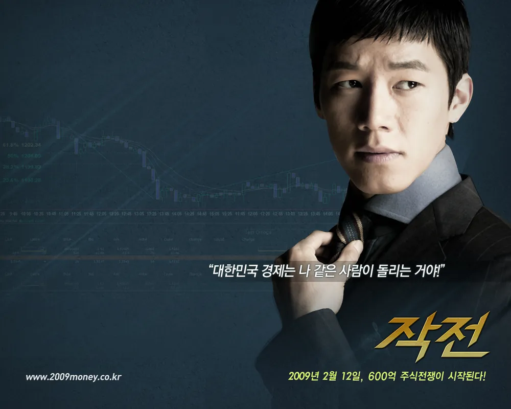
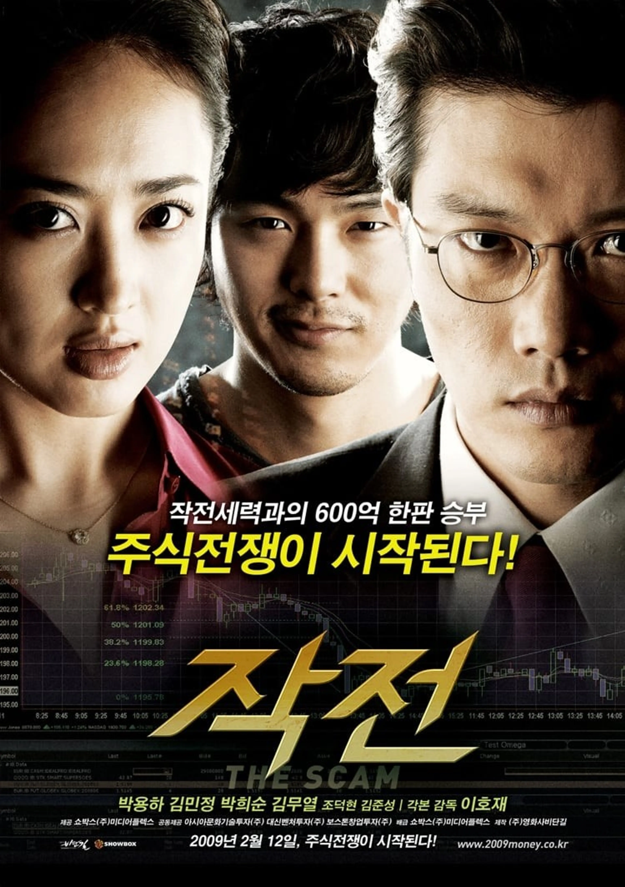

# 영화 작전 주가 조작 메커니즘과 자본주의 탐욕의 결말 분석

영화 [작전]은 주가 조작의 구조와 인간의 탐욕을 금융 범죄 스릴러의 문법으로 해부하며, 자본주의 시장의 구조적 모순을 날카롭게 드러낸 작품이다. 단순히 주식을 소재로 한 범죄 영화가 아니라, 시장을 움직이는 자와 끌려다니는 자의 관계를 통해 현대 금융 시스템이 가진 허상을 이야기한다. 눈에 보이지 않는 숫자만으로 막대한 부가 이동하는 세계를 대중적인 오락 영화로 풀어냈다는 점에서 당시 한국 영화계에서도 매우 이례적인 시도였다. 작품은 금융 범죄를 하나의 사건이 아니라 인간의 욕망이 만들어낸 필연적인 결과로 해석하며, 지금까지도 현실성을 잃지 않는 이유를 보여준다.

## 핵심 요약

* **[작전]은 한국 최초로 주가 조작을 전면에 내세운 본격 금융 범죄 영화**로 평가받으며, 기존 범죄 영화와 차별화된 장르를 개척했다.
* **2008년 글로벌 금융위기와 IT 버블 붕괴 이후의 시대 분위기**가 작품의 현실성과 사회적 공감대를 크게 강화했다.
* **모든 주요 인물은 각각 다른 계급과 욕망을 상징**하며, 돈이라는 공통 목표 아래 불안정한 동맹을 형성한다.
* 영화 속 주가 조작 과정은 **실제 금융시장에서 알려진 펌프 앤 덤프(Pump and Dump)** 구조와 상당히 유사한 형태로 구성된다.
* 작품이 궁극적으로 비판하는 대상은 주식이 아니라 **인간의 탐욕과 정보 비대칭이 만들어내는 자본주의의 구조적 모순**이다.

## 1. 왜 영화 [작전]은 한국 금융 범죄 영화의 출발점으로 평가받는가?

2009년 개봉한 이호재 감독의 **[작전]**은 한국 영화에서 거의 다뤄지지 않았던 금융 범죄를 정면으로 선택한 첫 번째 상업영화 가운데 하나다. 이전까지 한국 범죄 영화의 중심 소재는 조직폭력배, 강도, 보험 사기, 도박, 혹은 전통적인 사기극이었다. 범죄의 무대는 대부분 현실 공간에서 벌어지는 물리적인 충돌이었고, 관객 역시 폭력과 추격전을 통해 긴장감을 소비했다. 반면 [작전]은 이러한 공식을 완전히 뒤집었다. 범죄의 무대를 주식시장이라는 **보이지 않는 전장**으로 옮겼으며, 총이나 칼 대신 정보와 심리, 숫자가 가장 강력한 무기가 되는 세계를 선택했다.

특히 영화가 기획되고 개봉한 시점은 세계 경제가 극심한 충격을 받던 시기와 정확히 맞물린다. 2008년 리먼 브라더스 파산으로 시작된 글로벌 금융위기는 금융 시스템 자체에 대한 신뢰를 흔들어 놓았고, 한국 역시 외환시장과 증권시장이 크게 흔들렸다. 이미 국내에서는 IMF 외환위기와 IT 버블 붕괴를 연이어 경험하면서 자본시장의 위험성을 체감한 상황이었다. 이런 시대 분위기 속에서 **돈이 돈을 만들어내는 금융 시스템 자체에 대한 대중의 불신**은 극에 달했고, [작전]은 그 감정을 그대로 스크린으로 옮겨왔다.

영화는 금융을 전문적으로 설명하기보다 누구나 이해할 수 있는 범죄 스릴러의 구조를 선택했다. 관객은 주식을 몰라도 작전 세력이 가격을 올리고 사람들을 속여 돈을 버는 과정을 직관적으로 이해할 수 있으며, 그 과정에서 자연스럽게 시장의 구조를 체험하게 된다. 이처럼 금융을 대중 오락으로 번역한 접근 방식은 이후 한국 영화와 드라마가 금융 범죄를 다루는 하나의 기준이 되었다.

## 2. 영화 속 인물들은 자본주의의 어떤 욕망을 상징하는가?

[작전]의 가장 큰 강점은 금융 범죄를 설명하기 위해 단순한 악당과 영웅의 구도를 만들지 않았다는 점이다. 작품 속 대부분의 인물들은 모두 돈을 원하지만, **돈을 원하는 이유는 서로 다르다.** 이러한 차이가 각자의 행동을 결정하며, 결국 파멸을 향한 갈등 구조를 만든다.

| 인물 | 상징 | 핵심 욕망 |
| --- | --- | --- |
| 강현수 | 실패한 개인 투자자 | 인생 역전과 복수 |
| 황종구 | 조폭 출신 자본가 | 신분 세탁과 권력 |
| 유서연 | 금융 게이트키퍼 | 냉정한 자본 축적 |
| 조민형 | 엘리트 금융인 | 성공과 인정 욕구 |
| 박창주 | 몰락한 재벌 후계자 | 상속 자산 유지 |

주인공 **강현수**는 가장 현실적인 인물이다. 그는 특별한 악인이 아니다. 오히려 평범한 청년였지만, 닷컴 버블 붕괴 과정에서 모든 것을 잃고 사회적으로 추락한다. 이후 수년 동안 차트와 기업 분석에 집착하는 모습은 노동만으로는 계층 이동이 어렵다고 믿는 현대인의 절망을 상징한다. 현수에게 주식은 단순한 투자 수단이 아니라 인생을 되찾기 위한 마지막 희망이며, 동시에 세상에 대한 복수의 도구다.

반대로 **황종구**는 폭력 조직이 금융 자본으로 진화하는 과정을 상징한다. 그는 과거에는 칼과 주먹으로 돈을 벌었지만 이제는 정장을 입고 기업 인수를 논한다. 겉모습은 합법적인 사업가처럼 변했지만, 문제를 해결하는 방식은 여전히 폭력적이다. 이는 자본주의가 발전해도 탐욕의 본질은 쉽게 바뀌지 않는다는 점을 보여준다.

유서연은 영화에서 가장 차가운 현실주의자다. 그는 감정보다 **숫자를 신뢰하는 인물**이며, 돈의 흐름만이 진실이라고 믿는다. 법과 불법의 경계를 자유롭게 넘나들며 자금을 연결하는 역할을 수행하는데, 이러한 위치는 제도권 금융과 지하 금융이 현실에서 완전히 분리되어 있지 않다는 점을 상징적으로 보여준다.

조민형은 명문대 출신이라는 엘리트 의식을 가지고 있지만 실제로는 거대한 자본이 설계한 시스템 안에서 움직이는 하나의 부속품에 불과하다. 그는 스스로 지배계층이라 생각하지만 결국 더 큰 권력의 명령을 수행하는 전문가일 뿐이다. 영화는 이를 통해 학벌과 전문성조차 자본 앞에서는 독립적인 권력이 아니라는 점을 드러낸다.

## 3. 대산토건 작전은 어떤 방식으로 설계되는가?

영화 속 핵심 사건은 부실기업 **대산토건**을 이용한 대규모 주가 조작이다. 회사 자체는 이미 경쟁력을 잃었고, 정상적인 기업 활동만으로는 생존하기 어려운 상태다. 그러나 작전 세력에게 기업의 실적은 중요하지 않다. 중요한 것은 시장이 무엇을 믿게 만들 것인가이다.

작전은 비교적 전형적인 **펌프 앤 덤프(Pump and Dump)** 구조를 따른다.

* 부실기업 확보
* 새로운 성장 테마 부여
* 호재 공시 발표
* 대규모 매집
* 거래량 증가 연출
* 개인 투자자 유입
* 최고점에서 대량 매도
* 주가 폭락

이 과정에서 선택된 테마가 바로 친환경 바이오 사업이다. 당시 사회적으로 친환경 산업이 각광받던 분위기를 이용하여, 수질 개선 박테리아를 개발하는 벤처기업과의 투자 계획을 발표한다. 기존 건설회사가 갑자기 미래 산업에 진출한다는 이야기 자체는 현실성이 낮지만, 투자자들에게는 새로운 성장 가능성으로 인식된다.

영화가 흥미로운 이유는 기업 가치보다 **이야기(스토리)**가 주가를 움직인다는 사실을 정확히 보여주기 때문이다. 실제 기업의 수익 구조는 거의 변하지 않았지만, 시장은 미래에 대한 기대만으로 가격을 재평가한다. 작전 세력은 바로 이 심리를 이용하여 아무 가치도 없는 기업을 수천억 원 규모의 성장 기업처럼 포장한다.

대산토건이라는 이름은 결국 하나의 상징이다. 영화가 말하고자 하는 핵심은 특정 기업이 아니라, 시장이 얼마나 쉽게 허상을 가치로 착각할 수 있는가에 있다.

## 4. 영화는 어떻게 시장의 심리를 조작하는 과정을 보여주는가?

기업 하나만으로는 주가를 움직일 수 없다. 사람들의 심리를 움직여야 한다. 영화는 이 과정을 상당히 구체적으로 묘사한다.

가장 먼저 이루어지는 작업은 **초기 물량 확보**다. 작전 세력은 차명계좌를 이용하여 목표 기업의 주식을 미리 확보한다. 이후 서로 다른 계좌 사이에서 지속적으로 거래를 반복하며 거래량이 증가하는 것처럼 연출한다. 이러한 통정거래는 외부 투자자들에게 실제 매수세가 강하게 유입되는 것처럼 보이게 만드는 효과를 가진다.

다음 단계에서는 거대한 자금이 등장한다. 사채 자금과 비공식 투자금이 시장으로 유입되면서 가격이 빠르게 상승하고, 여기에 해외 자금처럼 보이는 계좌까지 활용해 외국인 투자자가 적극적으로 매수하는 분위기를 만든다. 개인 투자자들은 기관과 외국인의 움직임을 신뢰하는 경향이 있기 때문에 이러한 연출은 심리적으로 큰 영향을 준다.

마지막 단계에서는 언론과 전문가가 등장한다. 애널리스트와 경제 방송, 투자 정보가 동시에 긍정적인 전망을 내놓기 시작하면 일반 투자자는 자신이 뒤늦게 좋은 기회를 발견했다고 착각하게 된다. 그러나 영화는 바로 이 시점이 **가장 위험한 순간**이라고 말한다. 뉴스가 가장 화려할 때는 이미 작전 세력이 빠져나갈 준비를 끝낸 경우가 많기 때문이다.

이처럼 영화는 주가를 움직이는 것이 기업 실적 하나만이 아니라 **정보, 심리, 기대, 군중 행동**이라는 사실을 스릴러 형식으로 자연스럽게 설명한다.

## 5. 왜 개인 투자자는 반복해서 작전 세력의 희생양이 되는가?

영화는 개인 투자자가 손실을 보는 이유를 단순히 투자 실력 부족으로 설명하지 않는다. 오히려 **시장 구조 자체가 정보 비대칭을 전제로 작동**한다는 점을 강조한다. 작전 세력은 정보의 생산자이자 설계자다. 언제 공시를 내보낼지, 어떤 기사를 흘릴지, 어떤 자금을 언제 투입할지를 모두 미리 계획한다. 반면 개인 투자자는 이미 설계가 끝난 시나리오의 마지막 장면만 보게 된다. 뉴스를 보고 매수하는 순간은 대개 세력이 가장 비싼 가격에 물량을 넘길 준비를 마친 시점이다. 영화가 말하는 비극은 개인이 어리석어서가 아니라 **출발선 자체가 다르다**는 현실에 있다.

또 하나의 원인은 인간의 심리다. 시장은 언제나 **탐욕과 공포**라는 두 감정을 번갈아 자극한다. 가격이 오르면 더 늦기 전에 올라타야 한다는 조급함이 생기고, 가격이 급락하면 손실을 견디지 못하고 투매하게 된다. 이러한 군중 심리는 합리적인 기업 분석보다 훨씬 빠르게 투자 결정을 지배한다. 영화는 차트가 아니라 사람의 감정이 시장을 움직이는 가장 강력한 동력이라는 사실을 여러 장면을 통해 보여준다.

여기에 제도적 한계도 더해진다. 영화는 직접적으로 법 제도를 설명하지는 않지만, 금융 범죄가 반복되는 배경에는 처벌보다 기대수익이 더 크다고 판단하는 환경이 존재한다는 점을 암시한다. 현실에서도 금융 범죄는 적발이 어렵고 복잡한 자금 흐름 때문에 입증 과정이 길어지는 경우가 많다. 결국 영화는 **탐욕을 이용하는 사람과 탐욕에 이용당하는 사람이 동시에 존재하는 시장 구조** 자체를 비판의 대상으로 삼는다.

## 6. 쿠키 영상과 마산창투는 어떤 의미를 남기는가?

영화의 본편이 치밀한 작전과 배신, 그리고 돈을 둘러싼 인간 군상의 충돌을 보여줬다면, 엔딩 이후의 쿠키 영상은 작품 전체를 하나의 철학적 메시지로 완성한다. 여기서 등장하는 **마산창투**는 한때 시장을 움직이는 거물 투자자였지만 결국 시장에서 몰락한 인물로 묘사된다. 그의 추락은 아무리 뛰어난 투자자라도 시장을 영원히 지배할 수 없다는 사실을 상징한다.

가장 인상적인 장면은 마산창투가 강현수에게 건네는 마지막 조언이다. 그는 화려한 차트나 급등하는 테마보다 먼저 **실제로 회사를 운영하는 사람이 누구인지 살펴보라**고 말한다. 이는 영화 전체가 전달하는 핵심 가치관과 정확히 맞닿아 있다. 숫자는 얼마든지 꾸며낼 수 있지만 기업을 움직이는 사람과 사업은 쉽게 조작할 수 없다는 의미다.

이 장면은 작품 초반부터 이어진 가치와 허상의 대립을 하나의 문장으로 정리한다. 영화 속 작전 세력은 모두 숫자를 조작하고 심리를 이용해 돈을 벌려 하지만, 정작 실제 기업의 경쟁력이나 생산 활동에는 거의 관심을 두지 않는다. 결국 이들의 몰락은 단순히 작전이 실패했기 때문이 아니라 **실체 없는 가치 위에 부를 쌓으려 했기 때문**이라는 해석이 가능하다.

이어지는 강현수의 "아직 끝난 건 아닙니다."라는 마지막 대사는 또 다른 의미를 남긴다. 이는 새로운 작전을 예고하는 문장이기보다, 자본주의가 계속되는 한 인간의 탐욕 역시 반복될 것이라는 냉소적인 선언에 가깝다. 영화는 사건은 끝났지만 구조는 끝나지 않았음을 강조하며 관객에게 긴 여운을 남긴다.

## 결론

**[작전]은 금융 범죄를 소재로 한 오락 영화인 동시에 자본주의의 작동 원리를 해설하는 사회 드라마**다. 작품은 주가 조작이라는 범죄를 단순한 악인의 일탈로 그리지 않고, 정보 비대칭과 군중 심리, 계층 이동에 대한 욕망이 서로 맞물릴 때 어떻게 거대한 금융 사기가 만들어지는지를 설득력 있게 보여준다.

특히 등장인물들은 모두 서로 다른 위치에 있지만 **돈을 통해 자신의 결핍을 해결하려 한다는 공통점**을 가진다. 실패한 개인 투자자는 인생 역전을 꿈꾸고, 조직폭력배는 신분 상승을 원하며, 금융 전문가는 인정받기를 원하고, 자산관리사는 오직 숫자만을 신뢰한다. 이러한 욕망이 하나의 작전 안에서 충돌하면서 영화는 범죄보다 인간 자체를 더 깊이 해부한다.

오늘날에도 주식시장뿐 아니라 가상자산, 투자 리딩방, 허위 정보, 테마주 열풍 등은 끊임없이 반복되고 있다. 시대는 변했지만 **사람의 탐욕과 군중 심리는 크게 달라지지 않았다.** 그렇기 때문에 [작전]은 2009년에 머물러 있는 작품이 아니라, 지금도 금융시장을 바라보는 태도를 다시 생각하게 만드는 현실적인 경고로 기능한다.

## 자주 묻는 질문(FAQ)

### 영화 [작전]은 실제 사건을 바탕으로 만들어졌는가?

특정 사건을 그대로 영화화한 작품은 아니다. 다만 실제 금융시장에서 반복적으로 발생했던 주가 조작 사례와 금융 범죄 수법을 참고하여 현실성을 높인 것으로 평가받는다.

### 영화 속 대산토건 같은 작전은 현실에서도 가능한가?

영화적 연출이 포함되어 있지만, 부실기업에 새로운 성장 테마를 부여하고 기대 심리를 이용하는 방식은 실제 주가 조작 사건에서도 반복적으로 등장했던 유형이다.

### 펌프 앤 덤프는 무엇을 의미하는가?

**펌프 앤 덤프(Pump and Dump)** 는 허위 정보나 과장된 호재를 이용해 가격을 인위적으로 끌어올린 뒤, 높은 가격에서 보유 물량을 매도하고 빠져나가는 대표적인 시세조종 방식이다.

### 영화가 말하는 가장 중요한 투자 원칙은 무엇인가?

차트나 소문보다 **기업의 실제 가치와 사업 내용, 경영진의 역량**을 먼저 살펴야 한다는 점이다. 영화는 숫자는 조작될 수 있지만 기업의 본질은 쉽게 바뀌지 않는다는 메시지를 반복해서 전달한다.

### 지금 봐도 영화 [작전]이 의미 있는 이유는 무엇인가?

금융상품은 달라졌지만 정보 비대칭과 군중 심리, 탐욕을 이용한 투자 사기는 지금도 계속되고 있다. 따라서 영화가 제시한 구조적 문제와 투자자의 심리 분석은 현재의 금융시장에도 여전히 적용할 수 있는 시사점을 제공한다.